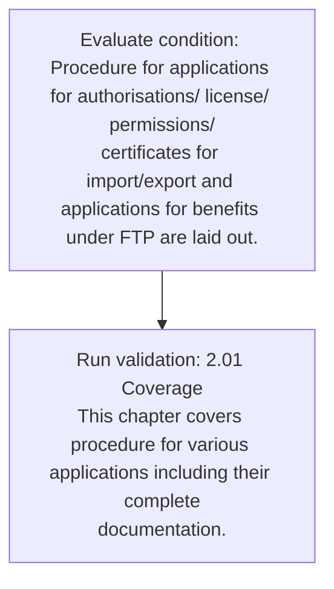

# Chapter 2 / Section 2.01: Coverage

**Chapter Title:** General Provisions Regarding Imports and Exports

**Pages:** 2

**Purpose:** 2.01 Coverage
This chapter covers procedure for various applications including their complete
documentation.

**Purpose Thanglish:** Indha Coverage section-la, 2.01 Coverage
This chapter covers procedure for various applications including their complete
documentation.

**Summary:** 2.01 Coverage
This chapter covers procedure for various applications including their complete
documentation. Procedure for applications for authorisations/ license/ permissions/
certificates for import/export and applications for benefits under FTP are laid out.

**Business Meaning:** 2.01 Coverage
This chapter covers procedure for various applications including their complete
documentation.

**Business Explanation:** 2.01 Coverage
This chapter covers procedure for various applications including their complete
documentation. Procedure for applications for authorisations/ license/ permissions/
certificates for import/export and applications for benefits under FTP are laid out.

**Business Explanation Thanglish:** Indha Coverage section-la, 2.01 Coverage
This chapter covers procedure for various applications including their complete
documentation. Procedure for applications for authorisations/ license/ permissions/
certificates for import/export and applications for benefits under FTP are laid out.

## Business Logic
- None identified

## Business Rules
- rule_id=CH2-SEC2_01-R001, rule_description=2.01 Coverage
This chapter covers procedure for various applications including their complete
documentation. Procedure for applications for authorisations/ license/ permissions/
certificates for import/export and applications for benefits under FTP are laid out., trigger=Coverage, condition=Procedure for applications for authorisations/ license/ permissions/
certificates for import/export and applications for benefits under FTP are laid out., validation=2.01 Coverage
This chapter covers procedure for various applications including their complete
documentation., action=Manual review required., exception=No explicit exception found in uploaded documents., output=DEKAI should produce a compliance decision for 2.01 - Coverage.

## Conditions
- Procedure for applications for authorisations/ license/ permissions/
certificates for import/export and applications for benefits under FTP are laid out.

## Condition Logic
- id=2.2.01.1, if=Procedure for applications for authorisations/ license/ permissions/
certificates for import/export and applications for benefits under FTP are laid out., then=Route for review, source=Procedure for applications for authorisations/ license/ permissions/
certificates for import/export and applications for benefits under FTP are laid out.

## Validations
- 2.01 Coverage
This chapter covers procedure for various applications including their complete
documentation.

## Exceptions
- None identified

## Dependencies
- 1

## Authorities
- None identified

## Required Documents
- 2.01 Coverage
This chapter covers procedure for various applications including their complete
documentation.
- Procedure for applications for authorisations/ license/ permissions/
certificates for import/export and applications for benefits under FTP are laid out.

## Timelines
- None identified

## Actions
- None identified

## Workflow
- Evaluate condition: Procedure for applications for authorisations/ license/ permissions/
certificates for import/export and applications for benefits under FTP are laid out.
- Run validation: 2.01 Coverage
This chapter covers procedure for various applications including their complete
documentation.

## Workflow ASCII
```text
Coverage
Evaluate condition: Procedure for applications for authorisations/ license/ permissions/
certificates for import/export and applications for benefits under FTP are laid out.
   |
   v
Run validation: 2.01 Coverage
This chapter covers procedure for various applications including their complete
documentation.
```

## Decision Tree
- IF section 2.01 applies THEN proceed with standard DGFT workflow

## Decision Tree ASCII
```text
Coverage Decision
IF section 2.01 applies THEN proceed with standard DGFT workflow
```

## Examples
- User asks to process Coverage; the platform checks conditions, validations, and documents before action.

**Real-world Example:** Example: an importer or exporter invokes Coverage, submits 2.01 Coverage
This chapter covers procedure for various applications including their complete
documentation., Procedure for applications for authorisations/ license/ permissions/
certificates for import/export and applications for benefits under FTP are laid out., and DEKAI uses the extracted rules to follow the coverage process.

**Real-world Example Thanglish:** Indha Coverage section-la, Example: an importer or exporter invokes Coverage, submits 2.01 Coverage
This chapter covers procedure for various applications including their complete
documentation., Procedure for applications for authorisations/ license/ permissions/
certificates for import/export and applications for benefits under FTP are laid out., and DEKAI uses the extracted rules to follow the coverage process.

## AI Rules
- None identified

## Database Fields
- name=section_code, type=string, required=True, source=parsed_section_heading
- name=section_title, type=string, required=True, source=parsed_section_heading
- name=for_flag, type=boolean, required=False, source=keyword:for
- name=and_flag, type=boolean, required=False, source=keyword:and
- name=ftp_flag, type=boolean, required=False, source=keyword:FTP
- name=are_flag, type=boolean, required=False, source=keyword:are
- name=out_flag, type=boolean, required=False, source=keyword:out
- name=this_flag, type=boolean, required=False, source=keyword:This
- name=laid_flag, type=boolean, required=False, source=keyword:laid
- name=their_flag, type=boolean, required=False, source=keyword:their
- name=document_1_submitted, type=boolean, required=True, source=2.01 Coverage
This chapter covers procedure for various applications including their complete
documentation.
- name=document_2_submitted, type=boolean, required=True, source=Procedure for applications for authorisations/ license/ permissions/
certificates for import/export and applications for benefits under FTP are laid out.

## API Requirements
- method=GET, path=/api/dgft/sections/2.01, purpose=Retrieve knowledge payload for section 2.01, query_params=['include=workflow,decision_tree,validations'], response_fields=['section', 'title', 'summary', 'conditions', 'validations', 'exceptions', 'workflow', 'decision_tree']
- method=POST, path=/api/dgft/Coverage/validate, purpose=Validate inputs and documents for Coverage, request_fields=['section_code', 'section_title', 'document_1_submitted', 'document_2_submitted'], response_fields=['status', 'errors', 'warnings', 'next_actions']

## UI Screens
- screen_id=Coverage_overview, name=Coverage Overview, purpose=Show section summary, authority, timeline, and eligibility cues., widgets=['summary_card', 'conditions_table', 'authority_badges', 'timeline_panel']
- screen_id=Coverage_submission, name=Coverage Submission, purpose=Capture applicant data and supporting documents., widgets=['dynamic_form', 'document_uploader', 'validation_panel', 'next_action_footer'], fields=['section_code', 'section_title', 'for_flag', 'and_flag', 'ftp_flag', 'are_flag', 'out_flag', 'this_flag']

## Error Messages
- Validation failed because the section requirements were not fully met.

## FAQ
- question_en=What is the purpose of section 2.01?, answer_en=2.01 Coverage
This chapter covers procedure for various applications including their complete
documentation. Procedure for applications for authorisations/ license/ permissions/
certificates for import/export and applications for benefits under FTP are laid out., question_thanglish=Indha Coverage section-la, What is the purpose of section 2.01?, answer_thanglish=Indha Coverage section-la, 2.01 Coverage
This chapter covers procedure for various applications including their complete
documentation. Procedure for applications for authorisations/ license/ permissions/
certificates for import/export and applications for benefits under FTP are laid out.
- question_en=What documents are required under Coverage?, answer_en=2.01 Coverage
This chapter covers procedure for various applications including their complete
documentation., Procedure for applications for authorisations/ license/ permissions/
certificates for import/export and applications for benefits under FTP are laid out., question_thanglish=Indha Coverage section-la, What documents are required under Coverage?, answer_thanglish=Indha Coverage section-la, 2.01 Coverage
This chapter covers procedure for various applications including their complete
documentation., Procedure for applications for authorisations/ license/ permissions/
certificates for import/export and applications for benefits under FTP are laid out.
- question_en=Which authority handles Coverage?, answer_en=Not explicitly covered in uploaded documents., question_thanglish=Indha Coverage section-la, Which authority handles Coverage?, answer_thanglish=Indha Coverage section-la, Not explicitly covered in uploaded documents.

## Questions Users May Ask
- What does Coverage require?
- Which documents are needed for Coverage?
- How does DEKAI validate Coverage requests?

## Expected AI Answers
- Coverage requires the platform to interpret the section text, apply the extracted business rules, and present the correct next action.
- Required documents are inferred from the section text: 2.01 Coverage
This chapter covers procedure for various applications including their complete
documentation., Procedure for applications for authorisations/ license/ permissions/
certificates for import/export and applications for benefits under FTP are laid out.
- DEKAI validates Coverage by checking conditions, required documents, authority references, and exception clauses before recommending an outcome.

## AI Q&A Examples
- question_en=User asks: How do I comply with Coverage?, answer_en=AI answers: DEKAI should evaluate section 2.01, apply the extracted rules, and guide the user through Evaluate condition: Procedure for applications for authorisations/ license/ permissions/
certificates for import/export and applications for benefits under FTP are laid out.., question_thanglish=Indha Coverage section-la, User asks: How do I comply with Coverage?, answer_thanglish=Indha Coverage section-la, AI answers: DEKAI should evaluate section 2.01, apply the extracted rules, and guide the user through Evaluate condition: Procedure for applications for authorisations/ license/ permissions/
certificates for import/export and applications for benefits under FTP are laid out..
- question_en=User asks: Which validations apply to Coverage?, answer_en=AI answers: Applicable validations are 2.01 Coverage
This chapter covers procedure for various applications including their complete
documentation., question_thanglish=Indha Coverage section-la, User asks: Which validations apply to Coverage?, answer_thanglish=Indha Coverage section-la, AI answers: Applicable validations are 2.01 Coverage
This chapter covers procedure for various applications including their complete
documentation.

## DEKAI AI Implementation Notes
- Capture chapter 2, section 2.01, title, and page references as immutable knowledge metadata.
- Bind validations for Coverage into a rule engine keyed by the rule IDs extracted for this section.
- Expose document upload controls for: 2.01 Coverage
This chapter covers procedure for various applications including their complete
documentation., Procedure for applications for authorisations/ license/ permissions/
certificates for import/export and applications for benefits under FTP are laid out..
- Show contextual links to related sections: 1.

## DEKAI AI Implementation Notes Thanglish
- Indha Coverage section-la, Capture chapter 2, section 2.01, title, and page references as immutable knowledge metadata.
- Indha Coverage section-la, Bind validations for Coverage into a rule engine keyed by the rule IDs extracted for this section.
- Indha Coverage section-la, Expose document upload controls for: 2.01 Coverage
This chapter covers procedure for various applications including their complete
documentation., Procedure for applications for authorisations/ license/ permissions/
certificates for import/export and applications for benefits under FTP are laid out..
- Indha Coverage section-la, Show contextual links to related sections: 1.

## AI Metadata
- Keywords: for, and, FTP, are, out, This, laid, their, under, covers, chapter, various, license, Coverage, complete, benefits, procedure, including, permissions, applications
- Search Keywords: for, and, FTP, are, out, This, laid, their, under, covers, chapter, various, license, Coverage, complete, benefits, procedure, including, permissions, applications
- Intent: Provide knowledge guidance for Coverage.
- Tags: 2.01, Coverage, document-driven, dgft
- Related Sections: 1
- Related Chapters: 
- Related Rules: 

## Mermaid


## PlantUML
```plantuml
@startuml
start
:Evaluate condition\: Procedure for applications for authorisations/ license/ permissions/
certificates for import/export and applications for benefits under FTP are laid out.;
:Run validation\: 2.01 Coverage
This chapter covers procedure for various applications including their complete
documentation.;
stop
@enduml
```
