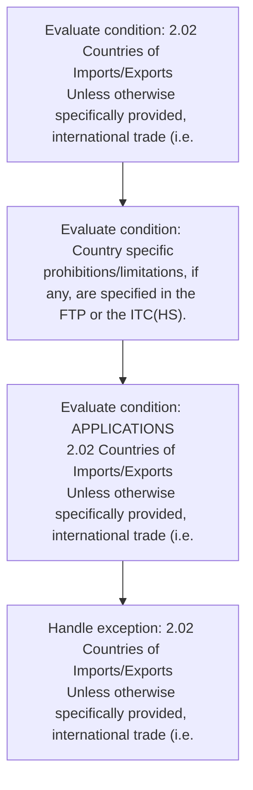
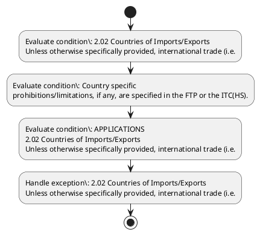

# Chapter 2 / Section 2.02: Countries of Imports/Exports

**Chapter Title:** General Provisions Regarding Imports and Exports

**Pages:** 2

**Purpose:** import into India and/or
export from India) can take place from/to any country.

**Purpose Thanglish:** Indha Countries of Imports/Exports section-la, import into India and/or
export from India) can take place from/to any country.

**Summary:** 2.02 Countries of Imports/Exports
Unless otherwise specifically provided, international trade (i.e. import into India and/or
export from India) can take place from/to any country. Country specific
prohibitions/limitations, if any, are specified in the FTP or the ITC(HS).

**Business Meaning:** 2.02 Countries of Imports/Exports
Unless otherwise specifically provided, international trade (i.e.

**Business Explanation:** 2.02 Countries of Imports/Exports
Unless otherwise specifically provided, international trade (i.e. import into India and/or
export from India) can take place from/to any country. Country specific
prohibitions/limitations, if any, are specified in the FTP or the ITC(HS).

**Business Explanation Thanglish:** Indha Countries of Imports/Exports section-la, 2.02 Countries of Imports/Exports
Unless otherwise specifically provided, international trade (i.e. import into India and/or
export from India) can take place from/to any country. Country specific
prohibitions/limitations, if any, are specified in the FTP or the ITC(HS).

## Business Logic
- None identified

## Business Rules
- rule_id=CH2-SEC2_02-R001, rule_description=2.02 Countries of Imports/Exports
Unless otherwise specifically provided, international trade (i.e. import into India and/or
export from India) can take place from/to any country. Country specific
prohibitions/limitations, if any, are specified in the FTP or the ITC(HS)., trigger=Countries of Imports/Exports, condition=2.02 Countries of Imports/Exports
Unless otherwise specifically provided, international trade (i.e., validation=Not explicitly covered in uploaded documents., action=Manual review required., exception=2.02 Countries of Imports/Exports
Unless otherwise specifically provided, international trade (i.e., output=DEKAI should produce a compliance decision for 2.02 - Countries of Imports/Exports.

## Conditions
- 2.02 Countries of Imports/Exports
Unless otherwise specifically provided, international trade (i.e.
- Country specific
prohibitions/limitations, if any, are specified in the FTP or the ITC(HS).
- APPLICATIONS
2.02 Countries of Imports/Exports
Unless otherwise specifically provided, international trade (i.e.
- Country
specific
prohibitions/limitations, if any, are specified in the FTP or the ITC(HS).

## Condition Logic
- id=2.2.02.1, if=2.02 Countries of Imports/Exports
Unless otherwise specifically provided, international trade (i.e., then=Route for review, source=2.02 Countries of Imports/Exports
Unless otherwise specifically provided, international trade (i.e.
- id=2.2.02.2, if=any, then=Route for review, source=Country specific
prohibitions/limitations, if any, are specified in the FTP or the ITC(HS).
- id=2.2.02.3, if=APPLICATIONS
2.02 Countries of Imports/Exports
Unless otherwise specifically provided, international trade (i.e., then=Route for review, source=APPLICATIONS
2.02 Countries of Imports/Exports
Unless otherwise specifically provided, international trade (i.e.
- id=2.2.02.4, if=any, then=Route for review, source=Country
specific
prohibitions/limitations, if any, are specified in the FTP or the ITC(HS).

## Validations
- None identified

## Exceptions
- 2.02 Countries of Imports/Exports
Unless otherwise specifically provided, international trade (i.e.
- APPLICATIONS
2.02 Countries of Imports/Exports
Unless otherwise specifically provided, international trade (i.e.

## Dependencies
- None identified

## Authorities
- None identified

## Required Documents
- APPLICATIONS
2.02 Countries of Imports/Exports
Unless otherwise specifically provided, international trade (i.e.
- APPLICATIONS

## Timelines
- None identified

## Actions
- None identified

## Workflow
- Evaluate condition: 2.02 Countries of Imports/Exports
Unless otherwise specifically provided, international trade (i.e.
- Evaluate condition: Country specific
prohibitions/limitations, if any, are specified in the FTP or the ITC(HS).
- Evaluate condition: APPLICATIONS
2.02 Countries of Imports/Exports
Unless otherwise specifically provided, international trade (i.e.
- Handle exception: 2.02 Countries of Imports/Exports
Unless otherwise specifically provided, international trade (i.e.

## Workflow ASCII
```text
Countries of Imports/Exports
Evaluate condition: 2.02 Countries of Imports/Exports
Unless otherwise specifically provided, international trade (i.e.
   |
   v
Evaluate condition: Country specific
prohibitions/limitations, if any, are specified in the FTP or the ITC(HS).
   |
   v
Evaluate condition: APPLICATIONS
2.02 Countries of Imports/Exports
Unless otherwise specifically provided, international trade (i.e.
   |
   v
Handle exception: 2.02 Countries of Imports/Exports
Unless otherwise specifically provided, international trade (i.e.
```

## Decision Tree
- IF exception applies (2.02 Countries of Imports/Exports
Unless otherwise specifically provided, international trade (i.e.) THEN route to manual review
- IF exception applies (APPLICATIONS
2.02 Countries of Imports/Exports
Unless otherwise specifically provided, international trade (i.e.) THEN route to manual review

## Decision Tree ASCII
```text
Countries of Imports/Exports Decision
IF exception applies (2.02 Countries of Imports/Exports
Unless otherwise specifically provided, international trade (i.e.) THEN route to manual review
   |
   v
IF exception applies (APPLICATIONS
2.02 Countries of Imports/Exports
Unless otherwise specifically provided, international trade (i.e.) THEN route to manual review
```

## Examples
- User asks to process Countries of Imports/Exports; the platform checks conditions, validations, and documents before action.

**Real-world Example:** Example: an importer or exporter invokes Countries of Imports/Exports, submits APPLICATIONS
2.02 Countries of Imports/Exports
Unless otherwise specifically provided, international trade (i.e., APPLICATIONS, and DEKAI uses the extracted rules to follow the countries of imports/exports process.

**Real-world Example Thanglish:** Indha Countries of Imports/Exports section-la, Example: an importer or exporter invokes Countries of Imports/Exports, submits APPLICATIONS
2.02 Countries of Imports/Exports
Unless otherwise specifically provided, international trade (i.e., APPLICATIONS, and DEKAI uses the extracted rules to follow the countries of imports/exports process.

## AI Rules
- None identified

## Database Fields
- name=section_code, type=string, required=True, source=parsed_section_heading
- name=section_title, type=string, required=True, source=parsed_section_heading
- name=can_flag, type=boolean, required=False, source=keyword:can
- name=any_flag, type=boolean, required=False, source=keyword:any
- name=are_flag, type=boolean, required=False, source=keyword:are
- name=the_flag, type=boolean, required=False, source=keyword:the
- name=ftp_flag, type=boolean, required=False, source=keyword:FTP
- name=itc_flag, type=boolean, required=False, source=keyword:ITC
- name=into_flag, type=boolean, required=False, source=keyword:into
- name=from_flag, type=boolean, required=False, source=keyword:from
- name=document_1_submitted, type=boolean, required=True, source=APPLICATIONS
2.02 Countries of Imports/Exports
Unless otherwise specifically provided, international trade (i.e.
- name=document_2_submitted, type=boolean, required=True, source=APPLICATIONS

## API Requirements
- method=GET, path=/api/dgft/sections/2.02, purpose=Retrieve knowledge payload for section 2.02, query_params=['include=workflow,decision_tree,validations'], response_fields=['section', 'title', 'summary', 'conditions', 'validations', 'exceptions', 'workflow', 'decision_tree']
- method=POST, path=/api/dgft/Countries-of-Imports-Exports/validate, purpose=Validate inputs and documents for Countries of Imports/Exports, request_fields=['section_code', 'section_title', 'document_1_submitted', 'document_2_submitted'], response_fields=['status', 'errors', 'warnings', 'next_actions']

## UI Screens
- screen_id=Countries_of_Imports_Exports_overview, name=Countries of Imports/Exports Overview, purpose=Show section summary, authority, timeline, and eligibility cues., widgets=['summary_card', 'conditions_table', 'authority_badges', 'timeline_panel']
- screen_id=Countries_of_Imports_Exports_submission, name=Countries of Imports/Exports Submission, purpose=Capture applicant data and supporting documents., widgets=['dynamic_form', 'document_uploader', 'validation_panel', 'next_action_footer'], fields=['section_code', 'section_title', 'can_flag', 'any_flag', 'are_flag', 'the_flag', 'ftp_flag', 'itc_flag']
- screen_id=Countries_of_Imports_Exports_exceptions, name=Countries of Imports/Exports Exception Review, purpose=Explain exception handling and manual review triggers., widgets=['exception_banner', 'decision_tree', 'case_notes']

## Error Messages
- Validation failed because the section requirements were not fully met.

## FAQ
- question_en=What is the purpose of section 2.02?, answer_en=2.02 Countries of Imports/Exports
Unless otherwise specifically provided, international trade (i.e. import into India and/or
export from India) can take place from/to any country. Country specific
prohibitions/limitations, if any, are specified in the FTP or the ITC(HS)., question_thanglish=Indha Countries of Imports/Exports section-la, What is the purpose of section 2.02?, answer_thanglish=Indha Countries of Imports/Exports section-la, 2.02 Countries of Imports/Exports
Unless otherwise specifically provided, international trade (i.e. import into India and/or
export from India) can take place from/to any country. Country specific
prohibitions/limitations, if any, are specified in the FTP or the ITC(HS).
- question_en=What documents are required under Countries of Imports/Exports?, answer_en=APPLICATIONS
2.02 Countries of Imports/Exports
Unless otherwise specifically provided, international trade (i.e., APPLICATIONS, question_thanglish=Indha Countries of Imports/Exports section-la, What documents are required under Countries of Imports/Exports?, answer_thanglish=Indha Countries of Imports/Exports section-la, APPLICATIONS
2.02 Countries of Imports/Exports
Unless otherwise specifically provided, international trade (i.e., APPLICATIONS
- question_en=Which authority handles Countries of Imports/Exports?, answer_en=Not explicitly covered in uploaded documents., question_thanglish=Indha Countries of Imports/Exports section-la, Which authority handles Countries of Imports/Exports?, answer_thanglish=Indha Countries of Imports/Exports section-la, Not explicitly covered in uploaded documents.

## Questions Users May Ask
- What does Countries of Imports/Exports require?
- Which documents are needed for Countries of Imports/Exports?
- How does DEKAI validate Countries of Imports/Exports requests?

## Expected AI Answers
- Countries of Imports/Exports requires the platform to interpret the section text, apply the extracted business rules, and present the correct next action.
- Required documents are inferred from the section text: APPLICATIONS
2.02 Countries of Imports/Exports
Unless otherwise specifically provided, international trade (i.e., APPLICATIONS
- DEKAI validates Countries of Imports/Exports by checking conditions, required documents, authority references, and exception clauses before recommending an outcome.

## AI Q&A Examples
- question_en=User asks: How do I comply with Countries of Imports/Exports?, answer_en=AI answers: DEKAI should evaluate section 2.02, apply the extracted rules, and guide the user through Evaluate condition: 2.02 Countries of Imports/Exports
Unless otherwise specifically provided, international trade (i.e.., question_thanglish=Indha Countries of Imports/Exports section-la, User asks: How do I comply with Countries of Imports/Exports?, answer_thanglish=Indha Countries of Imports/Exports section-la, AI answers: DEKAI should evaluate section 2.02, apply the extracted rules, and guide the user through Evaluate condition: 2.02 Countries of Imports/Exports
Unless otherwise specifically provided, international trade (i.e..
- question_en=User asks: Which validations apply to Countries of Imports/Exports?, answer_en=AI answers: Applicable validations are not explicitly covered in the uploaded documents., question_thanglish=Indha Countries of Imports/Exports section-la, User asks: Which validations apply to Countries of Imports/Exports?, answer_thanglish=Indha Countries of Imports/Exports section-la, AI answers: Applicable validations are not explicitly covered in the uploaded documents.

## DEKAI AI Implementation Notes
- Capture chapter 2, section 2.02, title, and page references as immutable knowledge metadata.
- Bind validations for Countries of Imports/Exports into a rule engine keyed by the rule IDs extracted for this section.
- Expose document upload controls for: APPLICATIONS
2.02 Countries of Imports/Exports
Unless otherwise specifically provided, international trade (i.e., APPLICATIONS.
- Trigger manual review when exception clauses are detected.

## DEKAI AI Implementation Notes Thanglish
- Indha Countries of Imports/Exports section-la, Capture chapter 2, section 2.02, title, and page references as immutable knowledge metadata.
- Indha Countries of Imports/Exports section-la, Bind validations for Countries of Imports/Exports into a rule engine keyed by the rule IDs extracted for this section.
- Indha Countries of Imports/Exports section-la, Expose document upload controls for: APPLICATIONS
2.02 Countries of Imports/Exports
Unless otherwise specifically provided, international trade (i.e., APPLICATIONS.
- Indha Countries of Imports/Exports section-la, Trigger manual review when exception clauses are detected.

## AI Metadata
- Keywords: can, any, are, the, FTP, ITC, into, from, take, trade, India, place, Unless, import, and/or, export, from/to, country, provided, specific
- Search Keywords: can, any, are, the, FTP, ITC, into, from, take, trade, India, place, Unless, import, and/or, export, from/to, country, provided, specific
- Intent: Provide knowledge guidance for Countries of Imports/Exports.
- Tags: 2.02, Countries of Imports/Exports, document-driven, dgft
- Related Sections: 
- Related Chapters: 
- Related Rules: 

## Mermaid


## PlantUML

