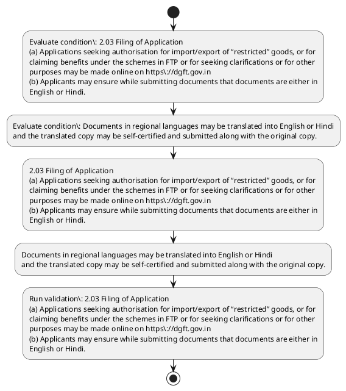

# Chapter 2 / Section 2.03: Filing of Application

**Chapter Title:** General Provisions Regarding Imports and Exports

**Pages:** 2

**Purpose:** 2.03 Filing of Application
(a) Applications seeking authorisation for import/export of “restricted” goods, or for
claiming benefits under the schemes in FTP or for seeking clarifications or for other
purposes may be made online on https://dgft.gov.in
(b) Applicants may ensure while submitting documents that documents are either in
English or Hindi.

**Purpose Thanglish:** Indha Filing of Application section-la, 2.03 Filing of application
(a) Applications seeking authorisation for import/export of “restricted” goods, or for
claiming benefits under the schemes in FTP or for seeking clarifications or for other
purposes may be made online on https://dgft.gov.in
(b) Applicants may ensure while submitting documents that documents are either in
English or Hindi.

**Summary:** 2.03 Filing of Application
(a) Applications seeking authorisation for import/export of “restricted” goods, or for
claiming benefits under the schemes in FTP or for seeking clarifications or for other
purposes may be made online on https://dgft.gov.in
(b) Applicants may ensure while submitting documents that documents are either in
English or Hindi. Documents in regional languages may be translated into English or Hindi
and the translated copy may be self-certified and submitted along with the original copy.

**Business Meaning:** 2.03 Filing of Application
(a) Applications seeking authorisation for import/export of “restricted” goods, or for
claiming benefits under the schemes in FTP or for seeking clarifications or for other
purposes may be made online on https://dgft.gov.in
(b) Applicants may ensure while submitting documents that documents are either in
English or Hindi.

**Business Explanation:** 2.03 Filing of Application
(a) Applications seeking authorisation for import/export of “restricted” goods, or for
claiming benefits under the schemes in FTP or for seeking clarifications or for other
purposes may be made online on https://dgft.gov.in
(b) Applicants may ensure while submitting documents that documents are either in
English or Hindi. Documents in regional languages may be translated into English or Hindi
and the translated copy may be self-certified and submitted along with the original copy.

**Business Explanation Thanglish:** Indha Filing of Application section-la, 2.03 Filing of application
(a) Applications seeking authorisation for import/export of “restricted” goods, or for
claiming benefits under the schemes in FTP or for seeking clarifications or for other
purposes may be made online on https://dgft.gov.in
(b) Applicants may ensure while submitting documents that documents are either in
English or Hindi. documents in regional languages may be translated into English or Hindi
and the translated copy may be self-certified and submitted along with the original copy.

## Business Logic
- None identified

## Business Rules
- rule_id=CH2-SEC2_03-R001, rule_description=IF validations pass THEN recommend action: 2.03 Filing of Application
(a) Applications seeking authorisation for import/export of “restricted” goods, or for
claiming benefits under the schemes in FTP or for seeking clarifications or for other
purposes may be made online on https://dgft.gov.in
(b) Applicants may ensure while submitting documents that documents are either in
English or Hindi., trigger=Filing of Application, condition=2.03 Filing of Application
(a) Applications seeking authorisation for import/export of “restricted” goods, or for
claiming benefits under the schemes in FTP or for seeking clarifications or for other
purposes may be made online on https://dgft.gov.in
(b) Applicants may ensure while submitting documents that documents are either in
English or Hindi., validation=2.03 Filing of Application
(a) Applications seeking authorisation for import/export of “restricted” goods, or for
claiming benefits under the schemes in FTP or for seeking clarifications or for other
purposes may be made online on https://dgft.gov.in
(b) Applicants may ensure while submitting documents that documents are either in
English or Hindi., action=2.03 Filing of Application
(a) Applications seeking authorisation for import/export of “restricted” goods, or for
claiming benefits under the schemes in FTP or for seeking clarifications or for other
purposes may be made online on https://dgft.gov.in
(b) Applicants may ensure while submitting documents that documents are either in
English or Hindi., exception=No explicit exception found in uploaded documents., output=DEKAI should produce a compliance decision for 2.03 - Filing of Application.

## Conditions
- 2.03 Filing of Application
(a) Applications seeking authorisation for import/export of “restricted” goods, or for
claiming benefits under the schemes in FTP or for seeking clarifications or for other
purposes may be made online on https://dgft.gov.in
(b) Applicants may ensure while submitting documents that documents are either in
English or Hindi.
- Documents in regional languages may be translated into English or Hindi
and the translated copy may be self-certified and submitted along with the original copy.

## Condition Logic
- id=2.2.03.1, if=2.03 Filing of Application
(a) Applications seeking authorisation for import/export of “restricted” goods, or for
claiming benefits under the schemes in FTP or for seeking clarifications or for other
purposes may be made online on https://dgft.gov.in
(b) Applicants may ensure while submitting documents that documents are either in
English or Hindi., then=2.03 Filing of Application
(a) Applications seeking authorisation for import/export of “restricted” goods, or for
claiming benefits under the schemes in FTP or for seeking clarifications or for other
purposes may be made online on https://dgft.gov.in
(b) Applicants may ensure while submitting documents that documents are either in
English or Hindi., source=2.03 Filing of Application
(a) Applications seeking authorisation for import/export of “restricted” goods, or for
claiming benefits under the schemes in FTP or for seeking clarifications or for other
purposes may be made online on https://dgft.gov.in
(b) Applicants may ensure while submitting documents that documents are either in
English or Hindi.
- id=2.2.03.2, if=Documents in regional languages may be translated into English or Hindi
and the translated copy may be self-certified and submitted along with the original copy., then=2.03 Filing of Application
(a) Applications seeking authorisation for import/export of “restricted” goods, or for
claiming benefits under the schemes in FTP or for seeking clarifications or for other
purposes may be made online on https://dgft.gov.in
(b) Applicants may ensure while submitting documents that documents are either in
English or Hindi., source=Documents in regional languages may be translated into English or Hindi
and the translated copy may be self-certified and submitted along with the original copy.

## Validations
- 2.03 Filing of Application
(a) Applications seeking authorisation for import/export of “restricted” goods, or for
claiming benefits under the schemes in FTP or for seeking clarifications or for other
purposes may be made online on https://dgft.gov.in
(b) Applicants may ensure while submitting documents that documents are either in
English or Hindi.

## Exceptions
- None identified

## Dependencies
- None identified

## Authorities
- dgft

## Required Documents
- Filing of Application
- Documents in regional languages may be translated into English or Hindi
and the translated copy may be self-certified and submitted along with the original copy.

## Timelines
- None identified

## Actions
- 2.03 Filing of Application
(a) Applications seeking authorisation for import/export of “restricted” goods, or for
claiming benefits under the schemes in FTP or for seeking clarifications or for other
purposes may be made online on https://dgft.gov.in
(b) Applicants may ensure while submitting documents that documents are either in
English or Hindi.
- Documents in regional languages may be translated into English or Hindi
and the translated copy may be self-certified and submitted along with the original copy.

## Workflow
- Evaluate condition: 2.03 Filing of Application
(a) Applications seeking authorisation for import/export of “restricted” goods, or for
claiming benefits under the schemes in FTP or for seeking clarifications or for other
purposes may be made online on https://dgft.gov.in
(b) Applicants may ensure while submitting documents that documents are either in
English or Hindi.
- Evaluate condition: Documents in regional languages may be translated into English or Hindi
and the translated copy may be self-certified and submitted along with the original copy.
- 2.03 Filing of Application
(a) Applications seeking authorisation for import/export of “restricted” goods, or for
claiming benefits under the schemes in FTP or for seeking clarifications or for other
purposes may be made online on https://dgft.gov.in
(b) Applicants may ensure while submitting documents that documents are either in
English or Hindi.
- Documents in regional languages may be translated into English or Hindi
and the translated copy may be self-certified and submitted along with the original copy.
- Run validation: 2.03 Filing of Application
(a) Applications seeking authorisation for import/export of “restricted” goods, or for
claiming benefits under the schemes in FTP or for seeking clarifications or for other
purposes may be made online on https://dgft.gov.in
(b) Applicants may ensure while submitting documents that documents are either in
English or Hindi.

## Workflow ASCII
```text
Filing of Application
Evaluate condition: 2.03 Filing of Application
(a) Applications seeking authorisation for import/export of “restricted” goods, or for
claiming benefits under the schemes in FTP or for seeking clarifications or for other
purposes may be made online on https://dgft.gov.in
(b) Applicants may ensure while submitting documents that documents are either in
English or Hindi.
   |
   v
Evaluate condition: Documents in regional languages may be translated into English or Hindi
and the translated copy may be self-certified and submitted along with the original copy.
   |
   v
2.03 Filing of Application
(a) Applications seeking authorisation for import/export of “restricted” goods, or for
claiming benefits under the schemes in FTP or for seeking clarifications or for other
purposes may be made online on https://dgft.gov.in
(b) Applicants may ensure while submitting documents that documents are either in
English or Hindi.
   |
   v
Documents in regional languages may be translated into English or Hindi
and the translated copy may be self-certified and submitted along with the original copy.
   |
   v
Run validation: 2.03 Filing of Application
(a) Applications seeking authorisation for import/export of “restricted” goods, or for
claiming benefits under the schemes in FTP or for seeking clarifications or for other
purposes may be made online on https://dgft.gov.in
(b) Applicants may ensure while submitting documents that documents are either in
English or Hindi.
```

## Decision Tree
- IF 2.03 Filing of Application
(a) Applications seeking authorisation for import/export of “restricted” goods, or for
claiming benefits under the schemes in FTP or for seeking clarifications or for other
purposes may be made online on https://dgft.gov.in
(b) Applicants may ensure while submitting documents that documents are either in
English or Hindi. THEN 2.03 Filing of Application
(a) Applications seeking authorisation for import/export of “restricted” goods, or for
claiming benefits under the schemes in FTP or for seeking clarifications or for other
purposes may be made online on https://dgft.gov.in
(b) Applicants may ensure while submitting documents that documents are either in
English or Hindi.
- IF Documents in regional languages may be translated into English or Hindi
and the translated copy may be self-certified and submitted along with the original copy. THEN 2.03 Filing of Application
(a) Applications seeking authorisation for import/export of “restricted” goods, or for
claiming benefits under the schemes in FTP or for seeking clarifications or for other
purposes may be made online on https://dgft.gov.in
(b) Applicants may ensure while submitting documents that documents are either in
English or Hindi.

## Decision Tree ASCII
```text
Filing of Application Decision
IF 2.03 Filing of Application
(a) Applications seeking authorisation for import/export of “restricted” goods, or for
claiming benefits under the schemes in FTP or for seeking clarifications or for other
purposes may be made online on https://dgft.gov.in
(b) Applicants may ensure while submitting documents that documents are either in
English or Hindi. THEN 2.03 Filing of Application
(a) Applications seeking authorisation for import/export of “restricted” goods, or for
claiming benefits under the schemes in FTP or for seeking clarifications or for other
purposes may be made online on https://dgft.gov.in
(b) Applicants may ensure while submitting documents that documents are either in
English or Hindi.
   |
   v
IF Documents in regional languages may be translated into English or Hindi
and the translated copy may be self-certified and submitted along with the original copy. THEN 2.03 Filing of Application
(a) Applications seeking authorisation for import/export of “restricted” goods, or for
claiming benefits under the schemes in FTP or for seeking clarifications or for other
purposes may be made online on https://dgft.gov.in
(b) Applicants may ensure while submitting documents that documents are either in
English or Hindi.
```

## Examples
- User asks to process Filing of Application; the platform checks conditions, validations, and documents before action.

**Real-world Example:** Example: an importer or exporter invokes Filing of Application, submits Filing of Application, Documents in regional languages may be translated into English or Hindi
and the translated copy may be self-certified and submitted along with the original copy., and DEKAI uses the extracted rules to 2.03 filing of application
(a) applications seeking authorisation for import/export of “restricted” goods, or for
claiming benefits under the schemes in ftp or for seeking clarifications or for other
purposes may be made online on https://dgft.gov.in
(b) applicants may ensure while submitting documents that documents are either in
english or hindi..

**Real-world Example Thanglish:** Indha Filing of Application section-la, Example: an importer or exporter invokes Filing of application, submits Filing of application, documents in regional languages may be translated into English or Hindi
and the translated copy may be self-certified and submitted along with the original copy., and DEKAI uses the extracted rules to 2.03 filing of application
(a) applications seeking authorisation for import/export of “restricted” goods, or for
claiming benefits under the schemes in ftp or for seeking clarifications or for other
purposes may be made online on https://dgft.gov.in
(b) applicants may ensure while submitting documents that documents are either in
english or hindi..

## AI Rules
- IF validations pass THEN recommend action: 2.03 Filing of Application
(a) Applications seeking authorisation for import/export of “restricted” goods, or for
claiming benefits under the schemes in FTP or for seeking clarifications or for other
purposes may be made online on https://dgft.gov.in
(b) Applicants may ensure while submitting documents that documents are either in
English or Hindi.

## Database Fields
- name=section_code, type=string, required=True, source=parsed_section_heading
- name=section_title, type=string, required=True, source=parsed_section_heading
- name=for_flag, type=boolean, required=False, source=keyword:for
- name=the_flag, type=boolean, required=False, source=keyword:the
- name=ftp_flag, type=boolean, required=False, source=keyword:FTP
- name=may_flag, type=boolean, required=False, source=keyword:may
- name=gov_flag, type=boolean, required=False, source=keyword:gov
- name=are_flag, type=boolean, required=False, source=keyword:are
- name=and_flag, type=boolean, required=False, source=keyword:and
- name=made_flag, type=boolean, required=False, source=keyword:made
- name=document_1_submitted, type=boolean, required=True, source=Filing of Application
- name=document_2_submitted, type=boolean, required=True, source=Documents in regional languages may be translated into English or Hindi
and the translated copy may be self-certified and submitted along with the original copy.

## API Requirements
- method=GET, path=/api/dgft/sections/2.03, purpose=Retrieve knowledge payload for section 2.03, query_params=['include=workflow,decision_tree,validations'], response_fields=['section', 'title', 'summary', 'conditions', 'validations', 'exceptions', 'workflow', 'decision_tree']
- method=POST, path=/api/dgft/Filing-of-Application/validate, purpose=Validate inputs and documents for Filing of Application, request_fields=['section_code', 'section_title', 'document_1_submitted', 'document_2_submitted'], response_fields=['status', 'errors', 'warnings', 'next_actions']
- method=POST, path=/api/dgft/Filing-of-Application/execute, purpose=Trigger business action for 2.03 Filing of Application
(a) Applications seeking authorisation for import/export of “restricted” goods, or for
claiming benefits under the schemes in FTP or for seeking clarifications or for other
purposes may be made online on https://dgft.gov.in
(b) Applicants may ensure while submitting documents that documents are either in
English or Hindi., request_fields=['section_code', 'section_title', 'document_1_submitted', 'document_2_submitted'], response_fields=['reference_id', 'status', 'authority', 'timeline']

## UI Screens
- screen_id=Filing_of_Application_overview, name=Filing of Application Overview, purpose=Show section summary, authority, timeline, and eligibility cues., widgets=['summary_card', 'conditions_table', 'authority_badges', 'timeline_panel']
- screen_id=Filing_of_Application_submission, name=Filing of Application Submission, purpose=Capture applicant data and supporting documents., widgets=['dynamic_form', 'document_uploader', 'validation_panel', 'next_action_footer'], fields=['section_code', 'section_title', 'for_flag', 'the_flag', 'ftp_flag', 'may_flag', 'gov_flag', 'are_flag']

## Error Messages
- Validation failed because the section requirements were not fully met.

## FAQ
- question_en=What is the purpose of section 2.03?, answer_en=2.03 Filing of Application
(a) Applications seeking authorisation for import/export of “restricted” goods, or for
claiming benefits under the schemes in FTP or for seeking clarifications or for other
purposes may be made online on https://dgft.gov.in
(b) Applicants may ensure while submitting documents that documents are either in
English or Hindi. Documents in regional languages may be translated into English or Hindi
and the translated copy may be self-certified and submitted along with the original copy., question_thanglish=Indha Filing of Application section-la, What is the purpose of section 2.03?, answer_thanglish=Indha Filing of Application section-la, 2.03 Filing of application
(a) Applications seeking authorisation for import/export of “restricted” goods, or for
claiming benefits under the schemes in FTP or for seeking clarifications or for other
purposes may be made online on https://dgft.gov.in
(b) Applicants may ensure while submitting documents that documents are either in
English or Hindi. documents in regional languages may be translated into English or Hindi
and the translated copy may be self-certified and submitted along with the original copy.
- question_en=What documents are required under Filing of Application?, answer_en=Filing of Application, Documents in regional languages may be translated into English or Hindi
and the translated copy may be self-certified and submitted along with the original copy., question_thanglish=Indha Filing of Application section-la, What documents are required under Filing of application?, answer_thanglish=Indha Filing of Application section-la, Filing of application, documents in regional languages may be translated into English or Hindi
and the translated copy may be self-certified and submitted along with the original copy.
- question_en=Which authority handles Filing of Application?, answer_en=dgft, question_thanglish=Indha Filing of Application section-la, Which authority handles Filing of application?, answer_thanglish=Indha Filing of Application section-la, dgft

## Questions Users May Ask
- What does Filing of Application require?
- Which documents are needed for Filing of Application?
- How does DEKAI validate Filing of Application requests?
- What action should be taken for Filing of Application?

## Expected AI Answers
- Filing of Application requires the platform to interpret the section text, apply the extracted business rules, and present the correct next action.
- Required documents are inferred from the section text: Filing of Application, Documents in regional languages may be translated into English or Hindi
and the translated copy may be self-certified and submitted along with the original copy.
- DEKAI validates Filing of Application by checking conditions, required documents, authority references, and exception clauses before recommending an outcome.
- The primary extracted action is: 2.03 Filing of Application
(a) Applications seeking authorisation for import/export of “restricted” goods, or for
claiming benefits under the schemes in FTP or for seeking clarifications or for other
purposes may be made online on https://dgft.gov.in
(b) Applicants may ensure while submitting documents that documents are either in
English or Hindi.

## AI Q&A Examples
- question_en=User asks: How do I comply with Filing of Application?, answer_en=AI answers: DEKAI should evaluate section 2.03, apply the extracted rules, and guide the user through Evaluate condition: 2.03 Filing of Application
(a) Applications seeking authorisation for import/export of “restricted” goods, or for
claiming benefits under the schemes in FTP or for seeking clarifications or for other
purposes may be made online on https://dgft.gov.in
(b) Applicants may ensure while submitting documents that documents are either in
English or Hindi.., question_thanglish=Indha Filing of Application section-la, User asks: How do I comply with Filing of application?, answer_thanglish=Indha Filing of Application section-la, AI answers: DEKAI should evaluate section 2.03, apply the extracted rules, and guide the user through Evaluate condition: 2.03 Filing of application
(a) Applications seeking authorisation for import/export of “restricted” goods, or for
claiming benefits under the schemes in FTP or for seeking clarifications or for other
purposes may be made online on https://dgft.gov.in
(b) Applicants may ensure while submitting documents that documents are either in
English or Hindi..
- question_en=User asks: Which validations apply to Filing of Application?, answer_en=AI answers: Applicable validations are 2.03 Filing of Application
(a) Applications seeking authorisation for import/export of “restricted” goods, or for
claiming benefits under the schemes in FTP or for seeking clarifications or for other
purposes may be made online on https://dgft.gov.in
(b) Applicants may ensure while submitting documents that documents are either in
English or Hindi., question_thanglish=Indha Filing of Application section-la, User asks: Which validations apply to Filing of application?, answer_thanglish=Indha Filing of Application section-la, AI answers: Applicable validations are 2.03 Filing of application
(a) Applications seeking authorisation for import/export of “restricted” goods, or for
claiming benefits under the schemes in FTP or for seeking clarifications or for other
purposes may be made online on https://dgft.gov.in
(b) Applicants may ensure while submitting documents that documents are either in
English or Hindi.

## DEKAI AI Implementation Notes
- Capture chapter 2, section 2.03, title, and page references as immutable knowledge metadata.
- Bind validations for Filing of Application into a rule engine keyed by the rule IDs extracted for this section.
- Expose document upload controls for: Filing of Application, Documents in regional languages may be translated into English or Hindi
and the translated copy may be self-certified and submitted along with the original copy..
- Route escalations or approvals to: dgft.

## DEKAI AI Implementation Notes Thanglish
- Indha Filing of Application section-la, Capture chapter 2, section 2.03, title, and page references as immutable knowledge metadata.
- Indha Filing of Application section-la, Bind validations for Filing of application into a rule engine keyed by the rule IDs extracted for this section.
- Indha Filing of Application section-la, Expose document upload controls for: Filing of application, documents in regional languages may be translated into English or Hindi
and the translated copy may be self-certified and submitted along with the original copy..
- Indha Filing of Application section-la, Route escalations or approvals to: dgft.

## AI Metadata
- Keywords: for, the, FTP, may, gov, are, and, made, dgft, that, into, copy, with, goods, under, other, https, while, Hindi, along
- Search Keywords: for, the, FTP, may, gov, are, and, made, dgft, that, into, copy, with, goods, under, other, https, while, Hindi, along
- Intent: Support Filing of Application processing and compliance validation.
- Tags: 2.03, Filing of Application, document-driven, dgft
- Related Sections: 
- Related Chapters: 
- Related Rules: 

## Mermaid

```mermaid
flowchart TD
    S1["Evaluate condition: 2.03 Filing of Application
(a) Applications seeking authorisation for import/export of “restricted” goods, or for
claiming benefits under the schemes in FTP or for seeking clarifications or for other
purposes may be made online on https://dgft.gov.in
(b) Applicants may ensure while submitting documents that documents are either in
English or Hindi."]
    S2["Evaluate condition: Documents in regional languages may be translated into English or Hindi
and the translated copy may be self-certified and submitted along with the original copy."]
    S1 --> S2
    S3["2.03 Filing of Application
(a) Applications seeking authorisation for import/export of “restricted” goods, or for
claiming benefits under the schemes in FTP or for seeking clarifications or for other
purposes may be made online on https://dgft.gov.in
(b) Applicants may ensure while submitting documents that documents are either in
English or Hindi."]
    S2 --> S3
    S4["Documents in regional languages may be translated into English or Hindi
and the translated copy may be self-certified and submitted along with the original copy."]
    S3 --> S4
    S5["Run validation: 2.03 Filing of Application
(a) Applications seeking authorisation for import/export of “restricted” goods, or for
claiming benefits under the schemes in FTP or for seeking clarifications or for other
purposes may be made online on https://dgft.gov.in
(b) Applicants may ensure while submitting documents that documents are either in
English or Hindi."]
    S4 --> S5
```


## PlantUML

