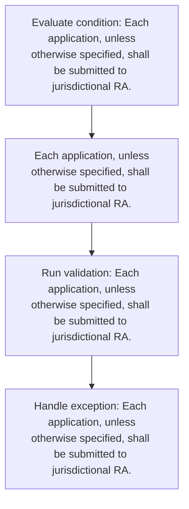
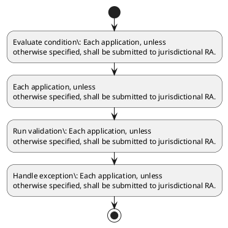

# Chapter 2 / Section 2.04: Territorial Jurisdiction of RA

**Chapter Title:** General Provisions Regarding Imports and Exports

**Pages:** 2

**Purpose:** Each application, unless
otherwise specified, shall be submitted to jurisdictional RA.

**Purpose Thanglish:** Indha Territorial Jurisdiction of RA section-la, Each application, unless
otherwise specified, kandippa be submitted to jurisdictional RA.

**Summary:** 2.04 Territorial Jurisdiction of RA
Territorial jurisdiction of RAs is given in Appendix 1A of Appendices and Aayat Niryat
Forms. The address of applicant determines the jurisdiction of RA. Each application, unless
otherwise specified, shall be submitted to jurisdictional RA.

**Business Meaning:** Territorial Jurisdiction of RA governs how DGFT business controls should be applied, validated, and enforced.

**Business Explanation:** Territorial Jurisdiction of RA explains the operating rule set that DEKAI should enforce. Key control points include Each application, unless
otherwise specified, shall be submitted to jurisdictional RA. The section also drives actions such as Each application, unless
otherwise specified, shall be submitted to jurisdictional RA..

**Business Explanation Thanglish:** Indha Territorial Jurisdiction of RA section-la, Territorial Jurisdiction of RA explains the operating rule set that DEKAI should enforce. Key control points include Each application, unless
otherwise specified, kandippa be submitted to jurisdictional RA. The section also drives actions such as Each application, unless
otherwise specified, kandippa be submitted to jurisdictional RA..

## Business Logic
- Each application, unless
otherwise specified, shall be submitted to jurisdictional RA.

## Business Rules
- rule_id=CH2-SEC2_04-R001, rule_description=Each application, unless
otherwise specified, shall be submitted to jurisdictional RA., trigger=Territorial Jurisdiction of RA, condition=Each application, unless
otherwise specified, shall be submitted to jurisdictional RA., validation=Each application, unless
otherwise specified, shall be submitted to jurisdictional RA., action=Each application, unless
otherwise specified, shall be submitted to jurisdictional RA., exception=Each application, unless
otherwise specified, shall be submitted to jurisdictional RA., output=DEKAI should produce a compliance decision for 2.04 - Territorial Jurisdiction of RA.

## Conditions
- Each application, unless
otherwise specified, shall be submitted to jurisdictional RA.

## Condition Logic
- id=2.2.04.1, if=Each application, unless
otherwise specified, shall be submitted to jurisdictional RA., then=Each application, unless
otherwise specified, shall be submitted to jurisdictional RA., source=Each application, unless
otherwise specified, shall be submitted to jurisdictional RA.

## Validations
- Each application, unless
otherwise specified, shall be submitted to jurisdictional RA.

## Exceptions
- Each application, unless
otherwise specified, shall be submitted to jurisdictional RA.

## Dependencies
- 1

## Authorities
- RA
- Territorial Jurisdiction of RA
- The address of applicant determines the jurisdiction of RA
- jurisdictional RA

## Required Documents
- Each application, unless
otherwise specified, shall be submitted to jurisdictional RA.

## Timelines
- None identified

## Actions
- Each application, unless
otherwise specified, shall be submitted to jurisdictional RA.

## Workflow
- Evaluate condition: Each application, unless
otherwise specified, shall be submitted to jurisdictional RA.
- Each application, unless
otherwise specified, shall be submitted to jurisdictional RA.
- Run validation: Each application, unless
otherwise specified, shall be submitted to jurisdictional RA.
- Handle exception: Each application, unless
otherwise specified, shall be submitted to jurisdictional RA.

## Workflow ASCII
```text
Territorial Jurisdiction of RA
Evaluate condition: Each application, unless
otherwise specified, shall be submitted to jurisdictional RA.
   |
   v
Each application, unless
otherwise specified, shall be submitted to jurisdictional RA.
   |
   v
Run validation: Each application, unless
otherwise specified, shall be submitted to jurisdictional RA.
   |
   v
Handle exception: Each application, unless
otherwise specified, shall be submitted to jurisdictional RA.
```

## Decision Tree
- IF Each application, unless
otherwise specified, shall be submitted to jurisdictional RA. THEN Each application, unless
otherwise specified, shall be submitted to jurisdictional RA.
- IF exception applies (Each application, unless
otherwise specified, shall be submitted to jurisdictional RA.) THEN route to manual review

## Decision Tree ASCII
```text
Territorial Jurisdiction of RA Decision
IF Each application, unless
otherwise specified, shall be submitted to jurisdictional RA. THEN Each application, unless
otherwise specified, shall be submitted to jurisdictional RA.
   |
   v
IF exception applies (Each application, unless
otherwise specified, shall be submitted to jurisdictional RA.) THEN route to manual review
```

## Examples
- User asks to process Territorial Jurisdiction of RA; the platform checks conditions, validations, and documents before action.

**Real-world Example:** Example: an importer or exporter invokes Territorial Jurisdiction of RA, submits Each application, unless
otherwise specified, shall be submitted to jurisdictional RA., and DEKAI uses the extracted rules to each application, unless
otherwise specified, shall be submitted to jurisdictional ra..

**Real-world Example Thanglish:** Indha Territorial Jurisdiction of RA section-la, Example: an importer or exporter invokes Territorial Jurisdiction of RA, submits Each application, unless
otherwise specified, kandippa be submitted to jurisdictional RA., and DEKAI uses the extracted rules to each application, unless
otherwise specified, kandippa be submitted to jurisdictional ra..

## AI Rules
- IF detected context matches section rule THEN enforce: Each application, unless
otherwise specified, shall be submitted to jurisdictional RA.
- IF validations pass THEN recommend action: Each application, unless
otherwise specified, shall be submitted to jurisdictional RA.

## Database Fields
- name=section_code, type=string, required=True, source=parsed_section_heading
- name=section_title, type=string, required=True, source=parsed_section_heading
- name=ras_flag, type=boolean, required=False, source=keyword:RAs
- name=and_flag, type=boolean, required=False, source=keyword:and
- name=the_flag, type=boolean, required=False, source=keyword:The
- name=each_flag, type=boolean, required=False, source=keyword:Each
- name=given_flag, type=boolean, required=False, source=keyword:given
- name=aayat_flag, type=boolean, required=False, source=keyword:Aayat
- name=forms_flag, type=boolean, required=False, source=keyword:Forms
- name=shall_flag, type=boolean, required=False, source=keyword:shall
- name=document_1_submitted, type=boolean, required=True, source=Each application, unless
otherwise specified, shall be submitted to jurisdictional RA.

## API Requirements
- method=GET, path=/api/dgft/sections/2.04, purpose=Retrieve knowledge payload for section 2.04, query_params=['include=workflow,decision_tree,validations'], response_fields=['section', 'title', 'summary', 'conditions', 'validations', 'exceptions', 'workflow', 'decision_tree']
- method=POST, path=/api/dgft/Territorial-Jurisdiction-of-RA/validate, purpose=Validate inputs and documents for Territorial Jurisdiction of RA, request_fields=['section_code', 'section_title', 'document_1_submitted'], response_fields=['status', 'errors', 'warnings', 'next_actions']
- method=POST, path=/api/dgft/Territorial-Jurisdiction-of-RA/execute, purpose=Trigger business action for Each application, unless
otherwise specified, shall be submitted to jurisdictional RA., request_fields=['section_code', 'section_title', 'document_1_submitted'], response_fields=['reference_id', 'status', 'authority', 'timeline']

## UI Screens
- screen_id=Territorial_Jurisdiction_of_RA_overview, name=Territorial Jurisdiction of RA Overview, purpose=Show section summary, authority, timeline, and eligibility cues., widgets=['summary_card', 'conditions_table', 'authority_badges', 'timeline_panel']
- screen_id=Territorial_Jurisdiction_of_RA_submission, name=Territorial Jurisdiction of RA Submission, purpose=Capture applicant data and supporting documents., widgets=['dynamic_form', 'document_uploader', 'validation_panel', 'next_action_footer'], fields=['section_code', 'section_title', 'ras_flag', 'and_flag', 'the_flag', 'each_flag', 'given_flag', 'aayat_flag']
- screen_id=Territorial_Jurisdiction_of_RA_exceptions, name=Territorial Jurisdiction of RA Exception Review, purpose=Explain exception handling and manual review triggers., widgets=['exception_banner', 'decision_tree', 'case_notes']

## Error Messages
- Validation failed because the section requirements were not fully met.

## FAQ
- question_en=What is the purpose of section 2.04?, answer_en=Territorial Jurisdiction of RA explains the operating rule set that DEKAI should enforce. Key control points include Each application, unless
otherwise specified, shall be submitted to jurisdictional RA. The section also drives actions such as Each application, unless
otherwise specified, shall be submitted to jurisdictional RA.., question_thanglish=Indha Territorial Jurisdiction of RA section-la, What is the purpose of section 2.04?, answer_thanglish=Indha Territorial Jurisdiction of RA section-la, Territorial Jurisdiction of RA explains the operating rule set that DEKAI should enforce. Key control points include Each application, unless
otherwise specified, kandippa be submitted to jurisdictional RA. The section also drives actions such as Each application, unless
otherwise specified, kandippa be submitted to jurisdictional RA..
- question_en=What documents are required under Territorial Jurisdiction of RA?, answer_en=Each application, unless
otherwise specified, shall be submitted to jurisdictional RA., question_thanglish=Indha Territorial Jurisdiction of RA section-la, What documents are required under Territorial Jurisdiction of RA?, answer_thanglish=Indha Territorial Jurisdiction of RA section-la, Each application, unless
otherwise specified, kandippa be submitted to jurisdictional RA.
- question_en=Which authority handles Territorial Jurisdiction of RA?, answer_en=RA, Territorial Jurisdiction of RA, The address of applicant determines the jurisdiction of RA, jurisdictional RA, question_thanglish=Indha Territorial Jurisdiction of RA section-la, Which authority handles Territorial Jurisdiction of RA?, answer_thanglish=Indha Territorial Jurisdiction of RA section-la, RA, Territorial Jurisdiction of RA, The address of applicant determines the jurisdiction of RA, jurisdictional RA

## Questions Users May Ask
- What does Territorial Jurisdiction of RA require?
- Which documents are needed for Territorial Jurisdiction of RA?
- How does DEKAI validate Territorial Jurisdiction of RA requests?
- What action should be taken for Territorial Jurisdiction of RA?

## Expected AI Answers
- Territorial Jurisdiction of RA requires the platform to interpret the section text, apply the extracted business rules, and present the correct next action.
- Required documents are inferred from the section text: Each application, unless
otherwise specified, shall be submitted to jurisdictional RA.
- DEKAI validates Territorial Jurisdiction of RA by checking conditions, required documents, authority references, and exception clauses before recommending an outcome.
- The primary extracted action is: Each application, unless
otherwise specified, shall be submitted to jurisdictional RA.

## AI Q&A Examples
- question_en=User asks: How do I comply with Territorial Jurisdiction of RA?, answer_en=AI answers: DEKAI should evaluate section 2.04, apply the extracted rules, and guide the user through Evaluate condition: Each application, unless
otherwise specified, shall be submitted to jurisdictional RA.., question_thanglish=Indha Territorial Jurisdiction of RA section-la, User asks: How do I comply with Territorial Jurisdiction of RA?, answer_thanglish=Indha Territorial Jurisdiction of RA section-la, AI answers: DEKAI should evaluate section 2.04, apply the extracted rules, and guide the user through Evaluate condition: Each application, unless
otherwise specified, kandippa be submitted to jurisdictional RA..
- question_en=User asks: Which validations apply to Territorial Jurisdiction of RA?, answer_en=AI answers: Applicable validations are Each application, unless
otherwise specified, shall be submitted to jurisdictional RA., question_thanglish=Indha Territorial Jurisdiction of RA section-la, User asks: Which validations apply to Territorial Jurisdiction of RA?, answer_thanglish=Indha Territorial Jurisdiction of RA section-la, AI answers: Applicable validations are Each application, unless
otherwise specified, kandippa be submitted to jurisdictional RA.

## DEKAI AI Implementation Notes
- Capture chapter 2, section 2.04, title, and page references as immutable knowledge metadata.
- Bind validations for Territorial Jurisdiction of RA into a rule engine keyed by the rule IDs extracted for this section.
- Expose document upload controls for: Each application, unless
otherwise specified, shall be submitted to jurisdictional RA..
- Route escalations or approvals to: RA, Territorial Jurisdiction of RA, The address of applicant determines the jurisdiction of RA, jurisdictional RA.
- Trigger manual review when exception clauses are detected.
- Show contextual links to related sections: 1.

## DEKAI AI Implementation Notes Thanglish
- Indha Territorial Jurisdiction of RA section-la, Capture chapter 2, section 2.04, title, and page references as immutable knowledge metadata.
- Indha Territorial Jurisdiction of RA section-la, Bind validations for Territorial Jurisdiction of RA into a rule engine keyed by the rule IDs extracted for this section.
- Indha Territorial Jurisdiction of RA section-la, Expose document upload controls for: Each application, unless
otherwise specified, kandippa be submitted to jurisdictional RA..
- Indha Territorial Jurisdiction of RA section-la, Route escalations or approvals to: RA, Territorial Jurisdiction of RA, The address of applicant determines the jurisdiction of RA, jurisdictional RA.
- Indha Territorial Jurisdiction of RA section-la, Trigger manual review when exception clauses are detected.
- Indha Territorial Jurisdiction of RA section-la, Show contextual links to related sections: 1.

## AI Metadata
- Keywords: RAs, and, The, Each, given, Aayat, Forms, shall, Niryat, unless, address, GENERAL, IMPORTS, EXPORTS, Appendix, CHAPTER-, applicant, otherwise, specified, submitted
- Search Keywords: RAs, and, The, Each, given, Aayat, Forms, shall, Niryat, unless, address, GENERAL, IMPORTS, EXPORTS, Appendix, CHAPTER-, applicant, otherwise, specified, submitted
- Intent: Support Territorial Jurisdiction of RA processing and compliance validation.
- Tags: 2.04, Territorial Jurisdiction of RA, business-rule, document-driven, dgft
- Related Sections: 1
- Related Chapters: 
- Related Rules: Each application, unless
otherwise specified, shall be submitted to jurisdictional RA.

## Mermaid


## PlantUML

