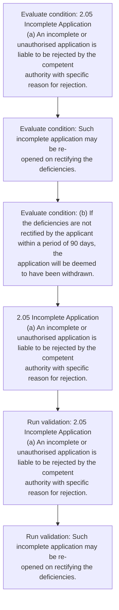
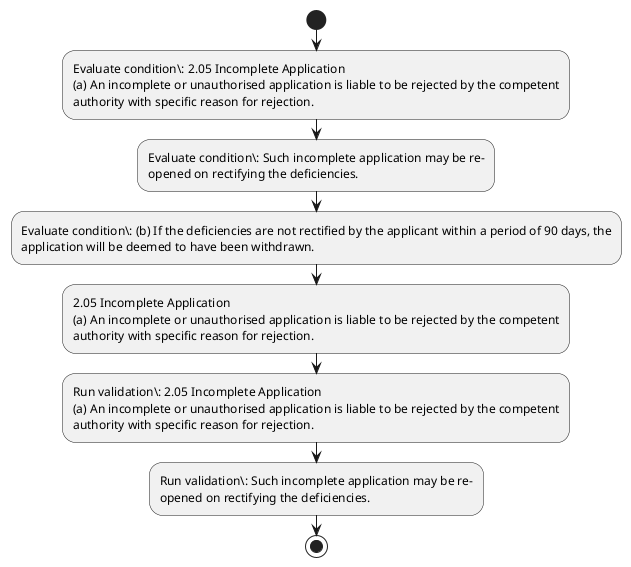

# Chapter 2 / Section 2.05: Incomplete Application

**Chapter Title:** General Provisions Regarding Imports and Exports

**Pages:** 3

**Purpose:** 2.05 Incomplete Application
(a) An incomplete or unauthorised application is liable to be rejected by the competent
authority with specific reason for rejection.

**Purpose Thanglish:** Indha Incomplete Application section-la, 2.05 Incomplete application
(a) An incomplete or unauthorised application is liable to be rejected by the competent
authority with specific reason for rejection.

**Summary:** 2.05 Incomplete Application
(a) An incomplete or unauthorised application is liable to be rejected by the competent
authority with specific reason for rejection. Such incomplete application may be re-
opened on rectifying the deficiencies. (b) If the deficiencies are not rectified by the applicant within a period of 90 days, the
application will be deemed to have been withdrawn.

**Business Meaning:** 2.05 Incomplete Application
(a) An incomplete or unauthorised application is liable to be rejected by the competent
authority with specific reason for rejection.

**Business Explanation:** 2.05 Incomplete Application
(a) An incomplete or unauthorised application is liable to be rejected by the competent
authority with specific reason for rejection. Such incomplete application may be re-
opened on rectifying the deficiencies. (b) If the deficiencies are not rectified by the applicant within a period of 90 days, the
application will be deemed to have been withdrawn.

**Business Explanation Thanglish:** Indha Incomplete Application section-la, 2.05 Incomplete application
(a) An incomplete or unauthorised application is liable to be rejected by the competent
authority with specific reason for rejection. Such incomplete application may be re-
opened on rectifying the deficiencies. (b) If the deficiencies are not rectified by the applicant within a period of 90 days, the
application will be deemed to have been withdrawn.

## Business Logic
- None identified

## Business Rules
- rule_id=CH2-SEC2_05-R001, rule_description=IF validations pass THEN recommend action: 2.05 Incomplete Application
(a) An incomplete or unauthorised application is liable to be rejected by the competent
authority with specific reason for rejection., trigger=Incomplete Application, condition=2.05 Incomplete Application
(a) An incomplete or unauthorised application is liable to be rejected by the competent
authority with specific reason for rejection., validation=2.05 Incomplete Application
(a) An incomplete or unauthorised application is liable to be rejected by the competent
authority with specific reason for rejection., action=2.05 Incomplete Application
(a) An incomplete or unauthorised application is liable to be rejected by the competent
authority with specific reason for rejection., exception=No explicit exception found in uploaded documents., output=DEKAI should produce a compliance decision for 2.05 - Incomplete Application.

## Conditions
- 2.05 Incomplete Application
(a) An incomplete or unauthorised application is liable to be rejected by the competent
authority with specific reason for rejection.
- Such incomplete application may be re-
opened on rectifying the deficiencies.
- (b) If the deficiencies are not rectified by the applicant within a period of 90 days, the
application will be deemed to have been withdrawn.

## Condition Logic
- id=2.2.05.1, if=2.05 Incomplete Application
(a) An incomplete or unauthorised application is liable to be rejected by the competent
authority with specific reason for rejection., then=2.05 Incomplete Application
(a) An incomplete or unauthorised application is liable to be rejected by the competent
authority with specific reason for rejection., source=2.05 Incomplete Application
(a) An incomplete or unauthorised application is liable to be rejected by the competent
authority with specific reason for rejection.
- id=2.2.05.2, if=Such incomplete application may be re-
opened on rectifying the deficiencies., then=2.05 Incomplete Application
(a) An incomplete or unauthorised application is liable to be rejected by the competent
authority with specific reason for rejection., source=Such incomplete application may be re-
opened on rectifying the deficiencies.
- id=2.2.05.3, if=the deficiencies are not rectified by the applicant within a period of 90 days, then=2.05 Incomplete Application
(a) An incomplete or unauthorised application is liable to be rejected by the competent
authority with specific reason for rejection., source=(b) If the deficiencies are not rectified by the applicant within a period of 90 days, the
application will be deemed to have been withdrawn.

## Validations
- 2.05 Incomplete Application
(a) An incomplete or unauthorised application is liable to be rejected by the competent
authority with specific reason for rejection.
- Such incomplete application may be re-
opened on rectifying the deficiencies.

## Exceptions
- None identified

## Dependencies
- None identified

## Authorities
- None identified

## Required Documents
- Incomplete Application
- Such incomplete application may be re-
opened on rectifying the deficiencies.
- (b) If the deficiencies are not rectified by the applicant within a period of 90 days, the
application will be deemed to have been withdrawn.

## Timelines
- (b) If the deficiencies are not rectified by the applicant within a period of 90 days, the
application will be deemed to have been withdrawn.

## Actions
- 2.05 Incomplete Application
(a) An incomplete or unauthorised application is liable to be rejected by the competent
authority with specific reason for rejection.

## Workflow
- Evaluate condition: 2.05 Incomplete Application
(a) An incomplete or unauthorised application is liable to be rejected by the competent
authority with specific reason for rejection.
- Evaluate condition: Such incomplete application may be re-
opened on rectifying the deficiencies.
- Evaluate condition: (b) If the deficiencies are not rectified by the applicant within a period of 90 days, the
application will be deemed to have been withdrawn.
- 2.05 Incomplete Application
(a) An incomplete or unauthorised application is liable to be rejected by the competent
authority with specific reason for rejection.
- Run validation: 2.05 Incomplete Application
(a) An incomplete or unauthorised application is liable to be rejected by the competent
authority with specific reason for rejection.
- Run validation: Such incomplete application may be re-
opened on rectifying the deficiencies.

## Workflow ASCII
```text
Incomplete Application
Evaluate condition: 2.05 Incomplete Application
(a) An incomplete or unauthorised application is liable to be rejected by the competent
authority with specific reason for rejection.
   |
   v
Evaluate condition: Such incomplete application may be re-
opened on rectifying the deficiencies.
   |
   v
Evaluate condition: (b) If the deficiencies are not rectified by the applicant within a period of 90 days, the
application will be deemed to have been withdrawn.
   |
   v
2.05 Incomplete Application
(a) An incomplete or unauthorised application is liable to be rejected by the competent
authority with specific reason for rejection.
   |
   v
Run validation: 2.05 Incomplete Application
(a) An incomplete or unauthorised application is liable to be rejected by the competent
authority with specific reason for rejection.
   |
   v
Run validation: Such incomplete application may be re-
opened on rectifying the deficiencies.
```

## Decision Tree
- IF 2.05 Incomplete Application
(a) An incomplete or unauthorised application is liable to be rejected by the competent
authority with specific reason for rejection. THEN 2.05 Incomplete Application
(a) An incomplete or unauthorised application is liable to be rejected by the competent
authority with specific reason for rejection.
- IF Such incomplete application may be re-
opened on rectifying the deficiencies. THEN 2.05 Incomplete Application
(a) An incomplete or unauthorised application is liable to be rejected by the competent
authority with specific reason for rejection.
- IF (b) If the deficiencies are not rectified by the applicant within a period of 90 days, the
application will be deemed to have been withdrawn. THEN 2.05 Incomplete Application
(a) An incomplete or unauthorised application is liable to be rejected by the competent
authority with specific reason for rejection.

## Decision Tree ASCII
```text
Incomplete Application Decision
IF 2.05 Incomplete Application
(a) An incomplete or unauthorised application is liable to be rejected by the competent
authority with specific reason for rejection. THEN 2.05 Incomplete Application
(a) An incomplete or unauthorised application is liable to be rejected by the competent
authority with specific reason for rejection.
   |
   v
IF Such incomplete application may be re-
opened on rectifying the deficiencies. THEN 2.05 Incomplete Application
(a) An incomplete or unauthorised application is liable to be rejected by the competent
authority with specific reason for rejection.
   |
   v
IF (b) If the deficiencies are not rectified by the applicant within a period of 90 days, the
application will be deemed to have been withdrawn. THEN 2.05 Incomplete Application
(a) An incomplete or unauthorised application is liable to be rejected by the competent
authority with specific reason for rejection.
```

## Examples
- User asks to process Incomplete Application; the platform checks conditions, validations, and documents before action.

**Real-world Example:** Example: an importer or exporter invokes Incomplete Application, submits Incomplete Application, Such incomplete application may be re-
opened on rectifying the deficiencies., (b) If the deficiencies are not rectified by the applicant within a period of 90 days, the
application will be deemed to have been withdrawn., and DEKAI uses the extracted rules to 2.05 incomplete application
(a) an incomplete or unauthorised application is liable to be rejected by the competent
authority with specific reason for rejection..

**Real-world Example Thanglish:** Indha Incomplete Application section-la, Example: an importer or exporter invokes Incomplete application, submits Incomplete application, Such incomplete application may be re-
opened on rectifying the deficiencies., (b) If the deficiencies are not rectified by the applicant within a period of 90 days, the
application will be deemed to have been withdrawn., and DEKAI uses the extracted rules to 2.05 incomplete application
(a) an incomplete or unauthorised application is liable to be rejected by the competent
authority with specific reason for rejection..

## AI Rules
- IF validations pass THEN recommend action: 2.05 Incomplete Application
(a) An incomplete or unauthorised application is liable to be rejected by the competent
authority with specific reason for rejection.

## Database Fields
- name=section_code, type=string, required=True, source=parsed_section_heading
- name=section_title, type=string, required=True, source=parsed_section_heading
- name=the_flag, type=boolean, required=False, source=keyword:the
- name=for_flag, type=boolean, required=False, source=keyword:for
- name=may_flag, type=boolean, required=False, source=keyword:may
- name=are_flag, type=boolean, required=False, source=keyword:are
- name=not_flag, type=boolean, required=False, source=keyword:not
- name=with_flag, type=boolean, required=False, source=keyword:with
- name=such_flag, type=boolean, required=False, source=keyword:Such
- name=days_flag, type=boolean, required=False, source=keyword:days
- name=document_1_submitted, type=boolean, required=True, source=Incomplete Application
- name=document_2_submitted, type=boolean, required=True, source=Such incomplete application may be re-
opened on rectifying the deficiencies.
- name=document_3_submitted, type=boolean, required=True, source=(b) If the deficiencies are not rectified by the applicant within a period of 90 days, the
application will be deemed to have been withdrawn.

## API Requirements
- method=GET, path=/api/dgft/sections/2.05, purpose=Retrieve knowledge payload for section 2.05, query_params=['include=workflow,decision_tree,validations'], response_fields=['section', 'title', 'summary', 'conditions', 'validations', 'exceptions', 'workflow', 'decision_tree']
- method=POST, path=/api/dgft/Incomplete-Application/validate, purpose=Validate inputs and documents for Incomplete Application, request_fields=['section_code', 'section_title', 'document_1_submitted', 'document_2_submitted', 'document_3_submitted'], response_fields=['status', 'errors', 'warnings', 'next_actions']
- method=POST, path=/api/dgft/Incomplete-Application/execute, purpose=Trigger business action for 2.05 Incomplete Application
(a) An incomplete or unauthorised application is liable to be rejected by the competent
authority with specific reason for rejection., request_fields=['section_code', 'section_title', 'document_1_submitted', 'document_2_submitted', 'document_3_submitted'], response_fields=['reference_id', 'status', 'authority', 'timeline']

## UI Screens
- screen_id=Incomplete_Application_overview, name=Incomplete Application Overview, purpose=Show section summary, authority, timeline, and eligibility cues., widgets=['summary_card', 'conditions_table', 'authority_badges', 'timeline_panel']
- screen_id=Incomplete_Application_submission, name=Incomplete Application Submission, purpose=Capture applicant data and supporting documents., widgets=['dynamic_form', 'document_uploader', 'validation_panel', 'next_action_footer'], fields=['section_code', 'section_title', 'the_flag', 'for_flag', 'may_flag', 'are_flag', 'not_flag', 'with_flag']

## Error Messages
- 2.05 Incomplete Application
(a) An incomplete or unauthorised application is liable to be rejected by the competent
authority with specific reason for rejection.
- Such incomplete application may be re-
opened on rectifying the deficiencies.

## FAQ
- question_en=What is the purpose of section 2.05?, answer_en=2.05 Incomplete Application
(a) An incomplete or unauthorised application is liable to be rejected by the competent
authority with specific reason for rejection. Such incomplete application may be re-
opened on rectifying the deficiencies. (b) If the deficiencies are not rectified by the applicant within a period of 90 days, the
application will be deemed to have been withdrawn., question_thanglish=Indha Incomplete Application section-la, What is the purpose of section 2.05?, answer_thanglish=Indha Incomplete Application section-la, 2.05 Incomplete application
(a) An incomplete or unauthorised application is liable to be rejected by the competent
authority with specific reason for rejection. Such incomplete application may be re-
opened on rectifying the deficiencies. (b) If the deficiencies are not rectified by the applicant within a period of 90 days, the
application will be deemed to have been withdrawn.
- question_en=What documents are required under Incomplete Application?, answer_en=Incomplete Application, Such incomplete application may be re-
opened on rectifying the deficiencies., (b) If the deficiencies are not rectified by the applicant within a period of 90 days, the
application will be deemed to have been withdrawn., question_thanglish=Indha Incomplete Application section-la, What documents are required under Incomplete application?, answer_thanglish=Indha Incomplete Application section-la, Incomplete application, Such incomplete application may be re-
opened on rectifying the deficiencies., (b) If the deficiencies are not rectified by the applicant within a period of 90 days, the
application will be deemed to have been withdrawn.
- question_en=Which authority handles Incomplete Application?, answer_en=Not explicitly covered in uploaded documents., question_thanglish=Indha Incomplete Application section-la, Which authority handles Incomplete application?, answer_thanglish=Indha Incomplete Application section-la, Not explicitly covered in uploaded documents.

## Questions Users May Ask
- What does Incomplete Application require?
- Which documents are needed for Incomplete Application?
- How does DEKAI validate Incomplete Application requests?
- What action should be taken for Incomplete Application?

## Expected AI Answers
- Incomplete Application requires the platform to interpret the section text, apply the extracted business rules, and present the correct next action.
- Required documents are inferred from the section text: Incomplete Application, Such incomplete application may be re-
opened on rectifying the deficiencies., (b) If the deficiencies are not rectified by the applicant within a period of 90 days, the
application will be deemed to have been withdrawn.
- DEKAI validates Incomplete Application by checking conditions, required documents, authority references, and exception clauses before recommending an outcome.
- The primary extracted action is: 2.05 Incomplete Application
(a) An incomplete or unauthorised application is liable to be rejected by the competent
authority with specific reason for rejection.

## AI Q&A Examples
- question_en=User asks: How do I comply with Incomplete Application?, answer_en=AI answers: DEKAI should evaluate section 2.05, apply the extracted rules, and guide the user through Evaluate condition: 2.05 Incomplete Application
(a) An incomplete or unauthorised application is liable to be rejected by the competent
authority with specific reason for rejection.., question_thanglish=Indha Incomplete Application section-la, User asks: How do I comply with Incomplete application?, answer_thanglish=Indha Incomplete Application section-la, AI answers: DEKAI should evaluate section 2.05, apply the extracted rules, and guide the user through Evaluate condition: 2.05 Incomplete application
(a) An incomplete or unauthorised application is liable to be rejected by the competent
authority with specific reason for rejection..
- question_en=User asks: Which validations apply to Incomplete Application?, answer_en=AI answers: Applicable validations are 2.05 Incomplete Application
(a) An incomplete or unauthorised application is liable to be rejected by the competent
authority with specific reason for rejection., Such incomplete application may be re-
opened on rectifying the deficiencies., question_thanglish=Indha Incomplete Application section-la, User asks: Which validations apply to Incomplete application?, answer_thanglish=Indha Incomplete Application section-la, AI answers: Applicable validations are 2.05 Incomplete application
(a) An incomplete or unauthorised application is liable to be rejected by the competent
authority with specific reason for rejection., Such incomplete application may be re-
opened on rectifying the deficiencies.

## DEKAI AI Implementation Notes
- Capture chapter 2, section 2.05, title, and page references as immutable knowledge metadata.
- Bind validations for Incomplete Application into a rule engine keyed by the rule IDs extracted for this section.
- Expose document upload controls for: Incomplete Application, Such incomplete application may be re-
opened on rectifying the deficiencies., (b) If the deficiencies are not rectified by the applicant within a period of 90 days, the
application will be deemed to have been withdrawn..

## DEKAI AI Implementation Notes Thanglish
- Indha Incomplete Application section-la, Capture chapter 2, section 2.05, title, and page references as immutable knowledge metadata.
- Indha Incomplete Application section-la, Bind validations for Incomplete application into a rule engine keyed by the rule IDs extracted for this section.
- Indha Incomplete Application section-la, Expose document upload controls for: Incomplete application, Such incomplete application may be re-
opened on rectifying the deficiencies., (b) If the deficiencies are not rectified by the applicant within a period of 90 days, the
application will be deemed to have been withdrawn..

## AI Metadata
- Keywords: the, for, may, are, not, with, Such, days, will, have, been, liable, reason, opened, within, period, deemed, rejected, specific, competent
- Search Keywords: the, for, may, are, not, with, Such, days, will, have, been, liable, reason, opened, within, period, deemed, rejected, specific, competent
- Intent: Support Incomplete Application processing and compliance validation.
- Tags: 2.05, Incomplete Application, document-driven, dgft
- Related Sections: 
- Related Chapters: 
- Related Rules: 

## Mermaid


## PlantUML

