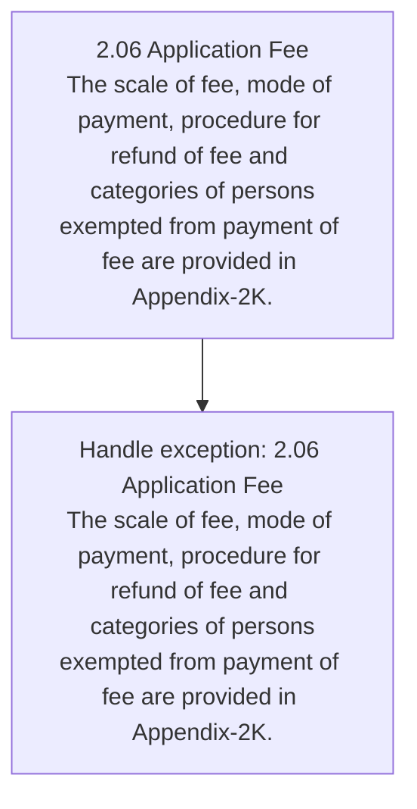
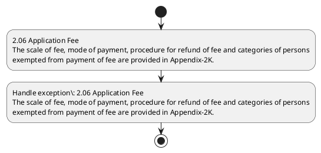

# Chapter 2 / Section 2.06: Application Fee

**Chapter Title:** General Provisions Regarding Imports and Exports

**Pages:** 3

**Purpose:** 2.06 Application Fee
The scale of fee, mode of payment, procedure for refund of fee and categories of persons
exempted from payment of fee are provided in Appendix-2K.

**Purpose Thanglish:** Indha Application Fee section-la, 2.06 application Fee
The scale of fee, mode of payment, procedure for refund of fee and categories of persons
exempted from payment of fee are provided in Appendix-2K.

**Summary:** 2.06 Application Fee
The scale of fee, mode of payment, procedure for refund of fee and categories of persons
exempted from payment of fee are provided in Appendix-2K. IMPORTER EXPORTER CODE (IEC)

**Business Meaning:** 2.06 Application Fee
The scale of fee, mode of payment, procedure for refund of fee and categories of persons
exempted from payment of fee are provided in Appendix-2K.

**Business Explanation:** 2.06 Application Fee
The scale of fee, mode of payment, procedure for refund of fee and categories of persons
exempted from payment of fee are provided in Appendix-2K. IMPORTER EXPORTER CODE (IEC)

**Business Explanation Thanglish:** Indha Application Fee section-la, 2.06 application Fee
The scale of fee, mode of payment, procedure for refund of fee and categories of persons
exempted from payment of fee are provided in Appendix-2K. IMPORTER EXPORTER CODE (IEC)

## Business Logic
- None identified

## Business Rules
- rule_id=CH2-SEC2_06-R001, rule_description=IF validations pass THEN recommend action: 2.06 Application Fee
The scale of fee, mode of payment, procedure for refund of fee and categories of persons
exempted from payment of fee are provided in Appendix-2K., trigger=Application Fee, condition=Section 2.06 is applicable, validation=Not explicitly covered in uploaded documents., action=2.06 Application Fee
The scale of fee, mode of payment, procedure for refund of fee and categories of persons
exempted from payment of fee are provided in Appendix-2K., exception=2.06 Application Fee
The scale of fee, mode of payment, procedure for refund of fee and categories of persons
exempted from payment of fee are provided in Appendix-2K., output=DEKAI should produce a compliance decision for 2.06 - Application Fee.

## Conditions
- None identified

## Condition Logic
- id=2.2.06.1, if=Section 2.06 is applicable, then=2.06 Application Fee
The scale of fee, mode of payment, procedure for refund of fee and categories of persons
exempted from payment of fee are provided in Appendix-2K., source=Derived from uploaded documents

## Validations
- None identified

## Exceptions
- 2.06 Application Fee
The scale of fee, mode of payment, procedure for refund of fee and categories of persons
exempted from payment of fee are provided in Appendix-2K.

## Dependencies
- None identified

## Authorities
- None identified

## Required Documents
- 2.06 Application Fee
The scale of fee, mode of payment, procedure for refund of fee and categories of persons
exempted from payment of fee are provided in Appendix-2K.

## Timelines
- None identified

## Actions
- 2.06 Application Fee
The scale of fee, mode of payment, procedure for refund of fee and categories of persons
exempted from payment of fee are provided in Appendix-2K.

## Workflow
- 2.06 Application Fee
The scale of fee, mode of payment, procedure for refund of fee and categories of persons
exempted from payment of fee are provided in Appendix-2K.
- Handle exception: 2.06 Application Fee
The scale of fee, mode of payment, procedure for refund of fee and categories of persons
exempted from payment of fee are provided in Appendix-2K.

## Workflow ASCII
```text
Application Fee
2.06 Application Fee
The scale of fee, mode of payment, procedure for refund of fee and categories of persons
exempted from payment of fee are provided in Appendix-2K.
   |
   v
Handle exception: 2.06 Application Fee
The scale of fee, mode of payment, procedure for refund of fee and categories of persons
exempted from payment of fee are provided in Appendix-2K.
```

## Decision Tree
- IF exception applies (2.06 Application Fee
The scale of fee, mode of payment, procedure for refund of fee and categories of persons
exempted from payment of fee are provided in Appendix-2K.) THEN route to manual review

## Decision Tree ASCII
```text
Application Fee Decision
IF exception applies (2.06 Application Fee
The scale of fee, mode of payment, procedure for refund of fee and categories of persons
exempted from payment of fee are provided in Appendix-2K.) THEN route to manual review
```

## Examples
- User asks to process Application Fee; the platform checks conditions, validations, and documents before action.

**Real-world Example:** Example: an importer or exporter invokes Application Fee, submits 2.06 Application Fee
The scale of fee, mode of payment, procedure for refund of fee and categories of persons
exempted from payment of fee are provided in Appendix-2K., and DEKAI uses the extracted rules to 2.06 application fee
the scale of fee, mode of payment, procedure for refund of fee and categories of persons
exempted from payment of fee are provided in appendix-2k..

**Real-world Example Thanglish:** Indha Application Fee section-la, Example: an importer or exporter invokes application Fee, submits 2.06 application Fee
The scale of fee, mode of payment, procedure for refund of fee and categories of persons
exempted from payment of fee are provided in Appendix-2K., and DEKAI uses the extracted rules to 2.06 application fee
the scale of fee, mode of payment, procedure for refund of fee and categories of persons
exempted from payment of fee are provided in appendix-2k..

## AI Rules
- IF validations pass THEN recommend action: 2.06 Application Fee
The scale of fee, mode of payment, procedure for refund of fee and categories of persons
exempted from payment of fee are provided in Appendix-2K.

## Database Fields
- name=section_code, type=string, required=True, source=parsed_section_heading
- name=section_title, type=string, required=True, source=parsed_section_heading
- name=fee_flag, type=boolean, required=False, source=keyword:Fee
- name=the_flag, type=boolean, required=False, source=keyword:The
- name=for_flag, type=boolean, required=False, source=keyword:for
- name=and_flag, type=boolean, required=False, source=keyword:and
- name=are_flag, type=boolean, required=False, source=keyword:are
- name=iec_flag, type=boolean, required=False, source=keyword:IEC
- name=mode_flag, type=boolean, required=False, source=keyword:mode
- name=from_flag, type=boolean, required=False, source=keyword:from
- name=document_1_submitted, type=boolean, required=True, source=2.06 Application Fee
The scale of fee, mode of payment, procedure for refund of fee and categories of persons
exempted from payment of fee are provided in Appendix-2K.

## API Requirements
- method=GET, path=/api/dgft/sections/2.06, purpose=Retrieve knowledge payload for section 2.06, query_params=['include=workflow,decision_tree,validations'], response_fields=['section', 'title', 'summary', 'conditions', 'validations', 'exceptions', 'workflow', 'decision_tree']
- method=POST, path=/api/dgft/Application-Fee/validate, purpose=Validate inputs and documents for Application Fee, request_fields=['section_code', 'section_title', 'document_1_submitted'], response_fields=['status', 'errors', 'warnings', 'next_actions']
- method=POST, path=/api/dgft/Application-Fee/execute, purpose=Trigger business action for 2.06 Application Fee
The scale of fee, mode of payment, procedure for refund of fee and categories of persons
exempted from payment of fee are provided in Appendix-2K., request_fields=['section_code', 'section_title', 'document_1_submitted'], response_fields=['reference_id', 'status', 'authority', 'timeline']

## UI Screens
- screen_id=Application_Fee_overview, name=Application Fee Overview, purpose=Show section summary, authority, timeline, and eligibility cues., widgets=['summary_card', 'conditions_table', 'authority_badges', 'timeline_panel']
- screen_id=Application_Fee_submission, name=Application Fee Submission, purpose=Capture applicant data and supporting documents., widgets=['dynamic_form', 'document_uploader', 'validation_panel', 'next_action_footer'], fields=['section_code', 'section_title', 'fee_flag', 'the_flag', 'for_flag', 'and_flag', 'are_flag', 'iec_flag']
- screen_id=Application_Fee_exceptions, name=Application Fee Exception Review, purpose=Explain exception handling and manual review triggers., widgets=['exception_banner', 'decision_tree', 'case_notes']

## Error Messages
- Validation failed because the section requirements were not fully met.

## FAQ
- question_en=What is the purpose of section 2.06?, answer_en=2.06 Application Fee
The scale of fee, mode of payment, procedure for refund of fee and categories of persons
exempted from payment of fee are provided in Appendix-2K. IMPORTER EXPORTER CODE (IEC), question_thanglish=Indha Application Fee section-la, What is the purpose of section 2.06?, answer_thanglish=Indha Application Fee section-la, 2.06 application Fee
The scale of fee, mode of payment, procedure for refund of fee and categories of persons
exempted from payment of fee are provided in Appendix-2K. IMPORTER EXPORTER CODE (IEC)
- question_en=What documents are required under Application Fee?, answer_en=2.06 Application Fee
The scale of fee, mode of payment, procedure for refund of fee and categories of persons
exempted from payment of fee are provided in Appendix-2K., question_thanglish=Indha Application Fee section-la, What documents are required under application Fee?, answer_thanglish=Indha Application Fee section-la, 2.06 application Fee
The scale of fee, mode of payment, procedure for refund of fee and categories of persons
exempted from payment of fee are provided in Appendix-2K.
- question_en=Which authority handles Application Fee?, answer_en=Not explicitly covered in uploaded documents., question_thanglish=Indha Application Fee section-la, Which authority handles application Fee?, answer_thanglish=Indha Application Fee section-la, Not explicitly covered in uploaded documents.

## Questions Users May Ask
- What does Application Fee require?
- Which documents are needed for Application Fee?
- How does DEKAI validate Application Fee requests?
- What action should be taken for Application Fee?

## Expected AI Answers
- Application Fee requires the platform to interpret the section text, apply the extracted business rules, and present the correct next action.
- Required documents are inferred from the section text: 2.06 Application Fee
The scale of fee, mode of payment, procedure for refund of fee and categories of persons
exempted from payment of fee are provided in Appendix-2K.
- DEKAI validates Application Fee by checking conditions, required documents, authority references, and exception clauses before recommending an outcome.
- The primary extracted action is: 2.06 Application Fee
The scale of fee, mode of payment, procedure for refund of fee and categories of persons
exempted from payment of fee are provided in Appendix-2K.

## AI Q&A Examples
- question_en=User asks: How do I comply with Application Fee?, answer_en=AI answers: DEKAI should evaluate section 2.06, apply the extracted rules, and guide the user through 2.06 Application Fee
The scale of fee, mode of payment, procedure for refund of fee and categories of persons
exempted from payment of fee are provided in Appendix-2K.., question_thanglish=Indha Application Fee section-la, User asks: How do I comply with application Fee?, answer_thanglish=Indha Application Fee section-la, AI answers: DEKAI should evaluate section 2.06, apply the extracted rules, and guide the user through 2.06 application Fee
The scale of fee, mode of payment, procedure for refund of fee and categories of persons
exempted from payment of fee are provided in Appendix-2K..
- question_en=User asks: Which validations apply to Application Fee?, answer_en=AI answers: Applicable validations are not explicitly covered in the uploaded documents., question_thanglish=Indha Application Fee section-la, User asks: Which validations apply to application Fee?, answer_thanglish=Indha Application Fee section-la, AI answers: Applicable validations are not explicitly covered in the uploaded documents.

## DEKAI AI Implementation Notes
- Capture chapter 2, section 2.06, title, and page references as immutable knowledge metadata.
- Bind validations for Application Fee into a rule engine keyed by the rule IDs extracted for this section.
- Expose document upload controls for: 2.06 Application Fee
The scale of fee, mode of payment, procedure for refund of fee and categories of persons
exempted from payment of fee are provided in Appendix-2K..
- Trigger manual review when exception clauses are detected.

## DEKAI AI Implementation Notes Thanglish
- Indha Application Fee section-la, Capture chapter 2, section 2.06, title, and page references as immutable knowledge metadata.
- Indha Application Fee section-la, Bind validations for application Fee into a rule engine keyed by the rule IDs extracted for this section.
- Indha Application Fee section-la, Expose document upload controls for: 2.06 application Fee
The scale of fee, mode of payment, procedure for refund of fee and categories of persons
exempted from payment of fee are provided in Appendix-2K..
- Indha Application Fee section-la, Trigger manual review when exception clauses are detected.

## AI Metadata
- Keywords: Fee, The, for, and, are, IEC, mode, from, CODE, scale, refund, payment, persons, exempted, provided, IMPORTER, EXPORTER, procedure, Appendix-, categories
- Search Keywords: Fee, The, for, and, are, IEC, mode, from, CODE, scale, refund, payment, persons, exempted, provided, IMPORTER, EXPORTER, procedure, Appendix-, categories
- Intent: Support Application Fee processing and compliance validation.
- Tags: 2.06, Application Fee, document-driven, dgft
- Related Sections: 
- Related Chapters: 
- Related Rules: 

## Mermaid


## PlantUML

