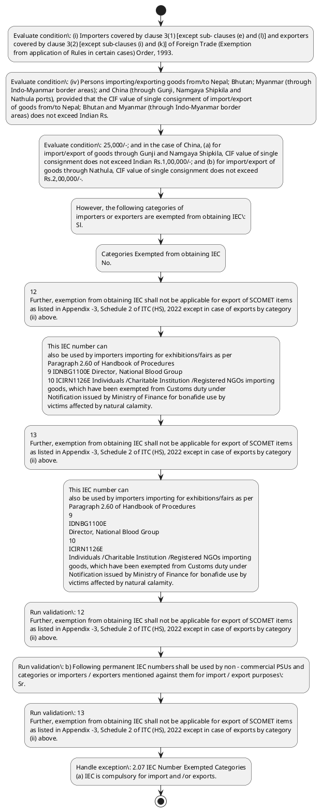

# Chapter 2 / Section 2.07: IEC Number Exempted Categories

**Chapter Title:** General Provisions Regarding Imports and Exports

**Pages:** 3, 4

**Purpose:** 2.07 IEC Number Exempted Categories
(a) IEC is compulsory for import and /or exports.

**Purpose Thanglish:** Indha IEC Number Exempted Categories section-la, 2.07 IEC Number Exempted Categories
(a) IEC is compulsory for import and /or exports.

**Summary:** 2.07 IEC Number Exempted Categories
(a) IEC is compulsory for import and /or exports. However, the following categories of
importers or exporters are exempted from obtaining IEC:
Sl. Categories Exempted from obtaining IEC
No.

**Business Meaning:** IEC Number Exempted Categories governs how DGFT business controls should be applied, validated, and enforced.

**Business Explanation:** IEC Number Exempted Categories explains the operating rule set that DEKAI should enforce. Key control points include 12
Further, exemption from obtaining IEC shall not be applicable for export of SCOMET items
as listed in Appendix -3, Schedule 2 of ITC (HS), 2022 except in case of exports by category
(ii) above. The section also drives actions such as However, the following categories of
importers or exporters are exempted from obtaining IEC:
Sl..

**Business Explanation Thanglish:** Indha IEC Number Exempted Categories section-la, IEC Number Exempted Categories explains the operating rule set that DEKAI should enforce. Key control points include 12
Further, exemption from obtaining IEC kandippa not be applicable for export of SCOMET items
as listed in Appendix -3, Schedule 2 of ITC (HS), 2022 except in case of exports by category
(ii) above. The section also drives actions such as However, the following categories of
importers or exporters are exempted from obtaining IEC:
Sl..

## Business Logic
- 12
Further, exemption from obtaining IEC shall not be applicable for export of SCOMET items
as listed in Appendix -3, Schedule 2 of ITC (HS), 2022 except in case of exports by category
(ii) above.
- b) Following permanent IEC numbers shall be used by non – commercial PSUs and
categories or importers / exporters mentioned against them for import / export purposes:
Sr.
- 11 IIEGC1134E Persons importing/exporting permissible goods as notified from
time to time, from /to China through Gunji, Namgaya Shipkila and
Nathula ports, subject to value ceilings of single consignment as
given in Paragraph 2.07 (iv) above.
- 13
Further, exemption from obtaining IEC shall not be applicable for export of SCOMET items
as listed in Appendix -3, Schedule 2 of ITC (HS), 2022 except in case of exports by category
(ii) above.
- 11
IIEGC1134E
Persons importing/exporting permissible goods as notified from
time to time, from /to China through Gunji, Namgaya Shipkila and
Nathula ports, subject to value ceilings of single consignment as
given in Paragraph 2.07 (iv) above.

## Business Rules
- rule_id=CH2-SEC2_07-R001, rule_description=12
Further, exemption from obtaining IEC shall not be applicable for export of SCOMET items
as listed in Appendix -3, Schedule 2 of ITC (HS), 2022 except in case of exports by category
(ii) above., trigger=IEC Number Exempted Categories, condition=(i) Importers covered by clause 3(1) [except sub- clauses (e) and (l)] and exporters
covered by clause 3(2) [except sub-clauses (i) and (k)] of Foreign Trade (Exemption
from application of Rules in certain cases) Order, 1993., validation=12
Further, exemption from obtaining IEC shall not be applicable for export of SCOMET items
as listed in Appendix -3, Schedule 2 of ITC (HS), 2022 except in case of exports by category
(ii) above., action=However, the following categories of
importers or exporters are exempted from obtaining IEC:
Sl., exception=2.07 IEC Number Exempted Categories
(a) IEC is compulsory for import and /or exports., output=DEKAI should produce a compliance decision for 2.07 - IEC Number Exempted Categories.
- rule_id=CH2-SEC2_07-R002, rule_description=b) Following permanent IEC numbers shall be used by non – commercial PSUs and
categories or importers / exporters mentioned against them for import / export purposes:
Sr., trigger=IEC Number Exempted Categories, condition=(iv) Persons importing/exporting goods from/to Nepal; Bhutan; Myanmar (through
Indo-Myanmar border areas); and China (through Gunji, Namgaya Shipkila and
Nathula ports), provided that the CIF value of single consignment of import/export
of goods from/to Nepal; Bhutan and Myanmar (through Indo-Myanmar border
areas) does not exceed Indian Rs., validation=b) Following permanent IEC numbers shall be used by non – commercial PSUs and
categories or importers / exporters mentioned against them for import / export purposes:
Sr., action=Categories Exempted from obtaining IEC
No., exception=However, the following categories of
importers or exporters are exempted from obtaining IEC:
Sl., output=DEKAI should produce a compliance decision for 2.07 - IEC Number Exempted Categories.
- rule_id=CH2-SEC2_07-R003, rule_description=11 IIEGC1134E Persons importing/exporting permissible goods as notified from
time to time, from /to China through Gunji, Namgaya Shipkila and
Nathula ports, subject to value ceilings of single consignment as
given in Paragraph 2.07 (iv) above., trigger=IEC Number Exempted Categories, condition=25,000/-; and in the case of China, (a) for
import/export of goods through Gunji and Namgaya Shipkila, CIF value of single
consignment does not exceed Indian Rs.1,00,000/-; and (b) for import/export of
goods through Nathula, CIF value of single consignment does not exceed
Rs.2,00,000/-., validation=13
Further, exemption from obtaining IEC shall not be applicable for export of SCOMET items
as listed in Appendix -3, Schedule 2 of ITC (HS), 2022 except in case of exports by category
(ii) above., action=12
Further, exemption from obtaining IEC shall not be applicable for export of SCOMET items
as listed in Appendix -3, Schedule 2 of ITC (HS), 2022 except in case of exports by category
(ii) above., exception=Categories Exempted from obtaining IEC
No., output=DEKAI should produce a compliance decision for 2.07 - IEC Number Exempted Categories.
- rule_id=CH2-SEC2_07-R004, rule_description=13
Further, exemption from obtaining IEC shall not be applicable for export of SCOMET items
as listed in Appendix -3, Schedule 2 of ITC (HS), 2022 except in case of exports by category
(ii) above., trigger=IEC Number Exempted Categories, condition=(i)
Importers covered by clause 3(1) [except sub- clauses (e) and (l)] and exporters
covered by clause 3(2) [except sub-clauses (i) and (k)] of Foreign Trade (Exemption
from application of Rules in certain cases) Order, 1993., validation=13
Further, exemption from obtaining IEC shall not be applicable for export of SCOMET items
as listed in Appendix -3, Schedule 2 of ITC (HS), 2022 except in case of exports by category
(ii) above., action=This IEC number can
also be used by importers importing for exhibitions/fairs as per
Paragraph 2.60 of Handbook of Procedures
9 IDNBG1100E Director, National Blood Group
10 ICIRN1126E Individuals /Charitable Institution /Registered NGOs importing
goods, which have been exempted from Customs duty under
Notification issued by Ministry of Finance for bonafide use by
victims affected by natural calamity., exception=(i) Importers covered by clause 3(1) [except sub- clauses (e) and (l)] and exporters
covered by clause 3(2) [except sub-clauses (i) and (k)] of Foreign Trade (Exemption
from application of Rules in certain cases) Order, 1993., output=DEKAI should produce a compliance decision for 2.07 - IEC Number Exempted Categories.
- rule_id=CH2-SEC2_07-R005, rule_description=11
IIEGC1134E
Persons importing/exporting permissible goods as notified from
time to time, from /to China through Gunji, Namgaya Shipkila and
Nathula ports, subject to value ceilings of single consignment as
given in Paragraph 2.07 (iv) above., trigger=IEC Number Exempted Categories, condition=(iv)
Persons importing/exporting goods from/to Nepal; Bhutan; Myanmar (through
Indo-Myanmar border areas); and China (through Gunji, Namgaya Shipkila and
Nathula ports), provided that the CIF value of single consignment of import/export
of goods from/to Nepal; Bhutan and Myanmar (through Indo-Myanmar border
areas) does not exceed Indian Rs., validation=13
Further, exemption from obtaining IEC shall not be applicable for export of SCOMET items
as listed in Appendix -3, Schedule 2 of ITC (HS), 2022 except in case of exports by category
(ii) above., action=13
Further, exemption from obtaining IEC shall not be applicable for export of SCOMET items
as listed in Appendix -3, Schedule 2 of ITC (HS), 2022 except in case of exports by category
(ii) above., exception=(iv) Persons importing/exporting goods from/to Nepal; Bhutan; Myanmar (through
Indo-Myanmar border areas); and China (through Gunji, Namgaya Shipkila and
Nathula ports), provided that the CIF value of single consignment of import/export
of goods from/to Nepal; Bhutan and Myanmar (through Indo-Myanmar border
areas) does not exceed Indian Rs., output=DEKAI should produce a compliance decision for 2.07 - IEC Number Exempted Categories.

## Conditions
- (i) Importers covered by clause 3(1) [except sub- clauses (e) and (l)] and exporters
covered by clause 3(2) [except sub-clauses (i) and (k)] of Foreign Trade (Exemption
from application of Rules in certain cases) Order, 1993.
- (iv) Persons importing/exporting goods from/to Nepal; Bhutan; Myanmar (through
Indo-Myanmar border areas); and China (through Gunji, Namgaya Shipkila and
Nathula ports), provided that the CIF value of single consignment of import/export
of goods from/to Nepal; Bhutan and Myanmar (through Indo-Myanmar border
areas) does not exceed Indian Rs.
- 25,000/-; and in the case of China, (a) for
import/export of goods through Gunji and Namgaya Shipkila, CIF value of single
consignment does not exceed Indian Rs.1,00,000/-; and (b) for import/export of
goods through Nathula, CIF value of single consignment does not exceed
Rs.2,00,000/-.
- (i)
Importers covered by clause 3(1) [except sub- clauses (e) and (l)] and exporters
covered by clause 3(2) [except sub-clauses (i) and (k)] of Foreign Trade (Exemption
from application of Rules in certain cases) Order, 1993.
- (iv)
Persons importing/exporting goods from/to Nepal; Bhutan; Myanmar (through
Indo-Myanmar border areas); and China (through Gunji, Namgaya Shipkila and
Nathula ports), provided that the CIF value of single consignment of import/export
of goods from/to Nepal; Bhutan and Myanmar (through Indo-Myanmar border
areas) does not exceed Indian Rs.
- 12
Further, exemption from obtaining IEC shall not be applicable for export of SCOMET items
as listed in Appendix -3, Schedule 2 of ITC (HS), 2022 except in case of exports by category
(ii) above.
- This IEC number can
also be used by importers importing for exhibitions/fairs as per
Paragraph 2.60 of Handbook of Procedures
9 IDNBG1100E Director, National Blood Group
10 ICIRN1126E Individuals /Charitable Institution /Registered NGOs importing
goods, which have been exempted from Customs duty under
Notification issued by Ministry of Finance for bonafide use by
victims affected by natural calamity.
- 11 IIEGC1134E Persons importing/exporting permissible goods as notified from
time to time, from /to China through Gunji, Namgaya Shipkila and
Nathula ports, subject to value ceilings of single consignment as
given in Paragraph 2.07 (iv) above.
- 13
Further, exemption from obtaining IEC shall not be applicable for export of SCOMET items
as listed in Appendix -3, Schedule 2 of ITC (HS), 2022 except in case of exports by category
(ii) above.
- This IEC number can
also be used by importers importing for exhibitions/fairs as per
Paragraph 2.60 of Handbook of Procedures
9
IDNBG1100E
Director, National Blood Group
10
ICIRN1126E
Individuals /Charitable Institution /Registered NGOs importing
goods, which have been exempted from Customs duty under
Notification issued by Ministry of Finance for bonafide use by
victims affected by natural calamity.
- 11
IIEGC1134E
Persons importing/exporting permissible goods as notified from
time to time, from /to China through Gunji, Namgaya Shipkila and
Nathula ports, subject to value ceilings of single consignment as
given in Paragraph 2.07 (iv) above.

## Condition Logic
- id=2.2.07.1, if=(i) Importers covered by clause 3(1) [except sub- clauses (e) and (l)] and exporters
covered by clause 3(2) [except sub-clauses (i) and (k)] of Foreign Trade (Exemption
from application of Rules in certain cases) Order, 1993., then=However, the following categories of
importers or exporters are exempted from obtaining IEC:
Sl., source=(i) Importers covered by clause 3(1) [except sub- clauses (e) and (l)] and exporters
covered by clause 3(2) [except sub-clauses (i) and (k)] of Foreign Trade (Exemption
from application of Rules in certain cases) Order, 1993.
- id=2.2.07.2, if=(iv) Persons importing/exporting goods from/to Nepal; Bhutan; Myanmar (through
Indo-Myanmar border areas); and China (through Gunji, Namgaya Shipkila and
Nathula ports), provided that the CIF value of single consignment of import/export
of goods from/to Nepal; Bhutan and Myanmar (through Indo-Myanmar border
areas) does not exceed Indian Rs., then=However, the following categories of
importers or exporters are exempted from obtaining IEC:
Sl., source=(iv) Persons importing/exporting goods from/to Nepal; Bhutan; Myanmar (through
Indo-Myanmar border areas); and China (through Gunji, Namgaya Shipkila and
Nathula ports), provided that the CIF value of single consignment of import/export
of goods from/to Nepal; Bhutan and Myanmar (through Indo-Myanmar border
areas) does not exceed Indian Rs.
- id=2.2.07.3, if=25,000/-; and in the case of China, (a) for
import/export of goods through Gunji and Namgaya Shipkila, CIF value of single
consignment does not exceed Indian Rs.1,00,000/-; and (b) for import/export of
goods through Nathula, CIF value of single consignment does not exceed
Rs.2,00,000/-., then=However, the following categories of
importers or exporters are exempted from obtaining IEC:
Sl., source=25,000/-; and in the case of China, (a) for
import/export of goods through Gunji and Namgaya Shipkila, CIF value of single
consignment does not exceed Indian Rs.1,00,000/-; and (b) for import/export of
goods through Nathula, CIF value of single consignment does not exceed
Rs.2,00,000/-.
- id=2.2.07.4, if=(i)
Importers covered by clause 3(1) [except sub- clauses (e) and (l)] and exporters
covered by clause 3(2) [except sub-clauses (i) and (k)] of Foreign Trade (Exemption
from application of Rules in certain cases) Order, 1993., then=However, the following categories of
importers or exporters are exempted from obtaining IEC:
Sl., source=(i)
Importers covered by clause 3(1) [except sub- clauses (e) and (l)] and exporters
covered by clause 3(2) [except sub-clauses (i) and (k)] of Foreign Trade (Exemption
from application of Rules in certain cases) Order, 1993.
- id=2.2.07.5, if=(iv)
Persons importing/exporting goods from/to Nepal; Bhutan; Myanmar (through
Indo-Myanmar border areas); and China (through Gunji, Namgaya Shipkila and
Nathula ports), provided that the CIF value of single consignment of import/export
of goods from/to Nepal; Bhutan and Myanmar (through Indo-Myanmar border
areas) does not exceed Indian Rs., then=However, the following categories of
importers or exporters are exempted from obtaining IEC:
Sl., source=(iv)
Persons importing/exporting goods from/to Nepal; Bhutan; Myanmar (through
Indo-Myanmar border areas); and China (through Gunji, Namgaya Shipkila and
Nathula ports), provided that the CIF value of single consignment of import/export
of goods from/to Nepal; Bhutan and Myanmar (through Indo-Myanmar border
areas) does not exceed Indian Rs.
- id=2.2.07.6, if=12
Further, exemption from obtaining IEC shall not be applicable for export of SCOMET items
as listed in Appendix -3, Schedule 2 of ITC (HS), 2022 except in case of exports by category
(ii) above., then=However, the following categories of
importers or exporters are exempted from obtaining IEC:
Sl., source=12
Further, exemption from obtaining IEC shall not be applicable for export of SCOMET items
as listed in Appendix -3, Schedule 2 of ITC (HS), 2022 except in case of exports by category
(ii) above.
- id=2.2.07.7, if=This IEC number can
also be used by importers importing for exhibitions/fairs as per
Paragraph 2.60 of Handbook of Procedures
9 IDNBG1100E Director, National Blood Group
10 ICIRN1126E Individuals /Charitable Institution /Registered NGOs importing
goods, which have been exempted from Customs duty under
Notification issued by Ministry of Finance for bonafide use by
victims affected by natural calamity., then=However, the following categories of
importers or exporters are exempted from obtaining IEC:
Sl., source=This IEC number can
also be used by importers importing for exhibitions/fairs as per
Paragraph 2.60 of Handbook of Procedures
9 IDNBG1100E Director, National Blood Group
10 ICIRN1126E Individuals /Charitable Institution /Registered NGOs importing
goods, which have been exempted from Customs duty under
Notification issued by Ministry of Finance for bonafide use by
victims affected by natural calamity.
- id=2.2.07.8, if=11 IIEGC1134E Persons importing/exporting permissible goods as notified from
time to time, from /to China through Gunji, Namgaya Shipkila and
Nathula ports, subject to value ceilings of single consignment as
given in Paragraph 2.07 (iv) above., then=However, the following categories of
importers or exporters are exempted from obtaining IEC:
Sl., source=11 IIEGC1134E Persons importing/exporting permissible goods as notified from
time to time, from /to China through Gunji, Namgaya Shipkila and
Nathula ports, subject to value ceilings of single consignment as
given in Paragraph 2.07 (iv) above.
- id=2.2.07.9, if=13
Further, exemption from obtaining IEC shall not be applicable for export of SCOMET items
as listed in Appendix -3, Schedule 2 of ITC (HS), 2022 except in case of exports by category
(ii) above., then=However, the following categories of
importers or exporters are exempted from obtaining IEC:
Sl., source=13
Further, exemption from obtaining IEC shall not be applicable for export of SCOMET items
as listed in Appendix -3, Schedule 2 of ITC (HS), 2022 except in case of exports by category
(ii) above.
- id=2.2.07.10, if=This IEC number can
also be used by importers importing for exhibitions/fairs as per
Paragraph 2.60 of Handbook of Procedures
9
IDNBG1100E
Director, National Blood Group
10
ICIRN1126E
Individuals /Charitable Institution /Registered NGOs importing
goods, which have been exempted from Customs duty under
Notification issued by Ministry of Finance for bonafide use by
victims affected by natural calamity., then=However, the following categories of
importers or exporters are exempted from obtaining IEC:
Sl., source=This IEC number can
also be used by importers importing for exhibitions/fairs as per
Paragraph 2.60 of Handbook of Procedures
9
IDNBG1100E
Director, National Blood Group
10
ICIRN1126E
Individuals /Charitable Institution /Registered NGOs importing
goods, which have been exempted from Customs duty under
Notification issued by Ministry of Finance for bonafide use by
victims affected by natural calamity.
- id=2.2.07.11, if=11
IIEGC1134E
Persons importing/exporting permissible goods as notified from
time to time, from /to China through Gunji, Namgaya Shipkila and
Nathula ports, subject to value ceilings of single consignment as
given in Paragraph 2.07 (iv) above., then=However, the following categories of
importers or exporters are exempted from obtaining IEC:
Sl., source=11
IIEGC1134E
Persons importing/exporting permissible goods as notified from
time to time, from /to China through Gunji, Namgaya Shipkila and
Nathula ports, subject to value ceilings of single consignment as
given in Paragraph 2.07 (iv) above.

## Validations
- 12
Further, exemption from obtaining IEC shall not be applicable for export of SCOMET items
as listed in Appendix -3, Schedule 2 of ITC (HS), 2022 except in case of exports by category
(ii) above.
- b) Following permanent IEC numbers shall be used by non – commercial PSUs and
categories or importers / exporters mentioned against them for import / export purposes:
Sr.
- 13
Further, exemption from obtaining IEC shall not be applicable for export of SCOMET items
as listed in Appendix -3, Schedule 2 of ITC (HS), 2022 except in case of exports by category
(ii) above.

## Exceptions
- 2.07 IEC Number Exempted Categories
(a) IEC is compulsory for import and /or exports.
- However, the following categories of
importers or exporters are exempted from obtaining IEC:
Sl.
- Categories Exempted from obtaining IEC
No.
- (i) Importers covered by clause 3(1) [except sub- clauses (e) and (l)] and exporters
covered by clause 3(2) [except sub-clauses (i) and (k)] of Foreign Trade (Exemption
from application of Rules in certain cases) Order, 1993.
- (iv) Persons importing/exporting goods from/to Nepal; Bhutan; Myanmar (through
Indo-Myanmar border areas); and China (through Gunji, Namgaya Shipkila and
Nathula ports), provided that the CIF value of single consignment of import/export
of goods from/to Nepal; Bhutan and Myanmar (through Indo-Myanmar border
areas) does not exceed Indian Rs.
- 12
2.07 IEC Number Exempted Categories
(a) IEC is compulsory for import and /or exports.
- (i)
Importers covered by clause 3(1) [except sub- clauses (e) and (l)] and exporters
covered by clause 3(2) [except sub-clauses (i) and (k)] of Foreign Trade (Exemption
from application of Rules in certain cases) Order, 1993.
- (iv)
Persons importing/exporting goods from/to Nepal; Bhutan; Myanmar (through
Indo-Myanmar border areas); and China (through Gunji, Namgaya Shipkila and
Nathula ports), provided that the CIF value of single consignment of import/export
of goods from/to Nepal; Bhutan and Myanmar (through Indo-Myanmar border
areas) does not exceed Indian Rs.
- 12
Further, exemption from obtaining IEC shall not be applicable for export of SCOMET items
as listed in Appendix -3, Schedule 2 of ITC (HS), 2022 except in case of exports by category
(ii) above.
- This IEC number can
also be used by importers importing for exhibitions/fairs as per
Paragraph 2.60 of Handbook of Procedures
9 IDNBG1100E Director, National Blood Group
10 ICIRN1126E Individuals /Charitable Institution /Registered NGOs importing
goods, which have been exempted from Customs duty under
Notification issued by Ministry of Finance for bonafide use by
victims affected by natural calamity.
- 13
Further, exemption from obtaining IEC shall not be applicable for export of SCOMET items
as listed in Appendix -3, Schedule 2 of ITC (HS), 2022 except in case of exports by category
(ii) above.
- This IEC number can
also be used by importers importing for exhibitions/fairs as per
Paragraph 2.60 of Handbook of Procedures
9
IDNBG1100E
Director, National Blood Group
10
ICIRN1126E
Individuals /Charitable Institution /Registered NGOs importing
goods, which have been exempted from Customs duty under
Notification issued by Ministry of Finance for bonafide use by
victims affected by natural calamity.

## Dependencies
- 2.60

## Authorities
- State Government
- Ministries /Departments of Central or State Government
- Central Government
- All Ministries / Departments of Central Government
- All Departments of any State Government
- Customs
- Notification issued by Ministry

## Required Documents
- (i) Importers covered by clause 3(1) [except sub- clauses (e) and (l)] and exporters
covered by clause 3(2) [except sub-clauses (i) and (k)] of Foreign Trade (Exemption
from application of Rules in certain cases) Order, 1993.
- (i)
Importers covered by clause 3(1) [except sub- clauses (e) and (l)] and exporters
covered by clause 3(2) [except sub-clauses (i) and (k)] of Foreign Trade (Exemption
from application of Rules in certain cases) Order, 1993.

## Timelines
- None identified

## Actions
- However, the following categories of
importers or exporters are exempted from obtaining IEC:
Sl.
- Categories Exempted from obtaining IEC
No.
- 12
Further, exemption from obtaining IEC shall not be applicable for export of SCOMET items
as listed in Appendix -3, Schedule 2 of ITC (HS), 2022 except in case of exports by category
(ii) above.
- This IEC number can
also be used by importers importing for exhibitions/fairs as per
Paragraph 2.60 of Handbook of Procedures
9 IDNBG1100E Director, National Blood Group
10 ICIRN1126E Individuals /Charitable Institution /Registered NGOs importing
goods, which have been exempted from Customs duty under
Notification issued by Ministry of Finance for bonafide use by
victims affected by natural calamity.
- 13
Further, exemption from obtaining IEC shall not be applicable for export of SCOMET items
as listed in Appendix -3, Schedule 2 of ITC (HS), 2022 except in case of exports by category
(ii) above.
- This IEC number can
also be used by importers importing for exhibitions/fairs as per
Paragraph 2.60 of Handbook of Procedures
9
IDNBG1100E
Director, National Blood Group
10
ICIRN1126E
Individuals /Charitable Institution /Registered NGOs importing
goods, which have been exempted from Customs duty under
Notification issued by Ministry of Finance for bonafide use by
victims affected by natural calamity.

## Workflow
- Evaluate condition: (i) Importers covered by clause 3(1) [except sub- clauses (e) and (l)] and exporters
covered by clause 3(2) [except sub-clauses (i) and (k)] of Foreign Trade (Exemption
from application of Rules in certain cases) Order, 1993.
- Evaluate condition: (iv) Persons importing/exporting goods from/to Nepal; Bhutan; Myanmar (through
Indo-Myanmar border areas); and China (through Gunji, Namgaya Shipkila and
Nathula ports), provided that the CIF value of single consignment of import/export
of goods from/to Nepal; Bhutan and Myanmar (through Indo-Myanmar border
areas) does not exceed Indian Rs.
- Evaluate condition: 25,000/-; and in the case of China, (a) for
import/export of goods through Gunji and Namgaya Shipkila, CIF value of single
consignment does not exceed Indian Rs.1,00,000/-; and (b) for import/export of
goods through Nathula, CIF value of single consignment does not exceed
Rs.2,00,000/-.
- However, the following categories of
importers or exporters are exempted from obtaining IEC:
Sl.
- Categories Exempted from obtaining IEC
No.
- 12
Further, exemption from obtaining IEC shall not be applicable for export of SCOMET items
as listed in Appendix -3, Schedule 2 of ITC (HS), 2022 except in case of exports by category
(ii) above.
- This IEC number can
also be used by importers importing for exhibitions/fairs as per
Paragraph 2.60 of Handbook of Procedures
9 IDNBG1100E Director, National Blood Group
10 ICIRN1126E Individuals /Charitable Institution /Registered NGOs importing
goods, which have been exempted from Customs duty under
Notification issued by Ministry of Finance for bonafide use by
victims affected by natural calamity.
- 13
Further, exemption from obtaining IEC shall not be applicable for export of SCOMET items
as listed in Appendix -3, Schedule 2 of ITC (HS), 2022 except in case of exports by category
(ii) above.
- This IEC number can
also be used by importers importing for exhibitions/fairs as per
Paragraph 2.60 of Handbook of Procedures
9
IDNBG1100E
Director, National Blood Group
10
ICIRN1126E
Individuals /Charitable Institution /Registered NGOs importing
goods, which have been exempted from Customs duty under
Notification issued by Ministry of Finance for bonafide use by
victims affected by natural calamity.
- Run validation: 12
Further, exemption from obtaining IEC shall not be applicable for export of SCOMET items
as listed in Appendix -3, Schedule 2 of ITC (HS), 2022 except in case of exports by category
(ii) above.
- Run validation: b) Following permanent IEC numbers shall be used by non – commercial PSUs and
categories or importers / exporters mentioned against them for import / export purposes:
Sr.
- Run validation: 13
Further, exemption from obtaining IEC shall not be applicable for export of SCOMET items
as listed in Appendix -3, Schedule 2 of ITC (HS), 2022 except in case of exports by category
(ii) above.
- Handle exception: 2.07 IEC Number Exempted Categories
(a) IEC is compulsory for import and /or exports.

## Workflow ASCII
```text
IEC Number Exempted Categories
Evaluate condition: (i) Importers covered by clause 3(1) [except sub- clauses (e) and (l)] and exporters
covered by clause 3(2) [except sub-clauses (i) and (k)] of Foreign Trade (Exemption
from application of Rules in certain cases) Order, 1993.
   |
   v
Evaluate condition: (iv) Persons importing/exporting goods from/to Nepal; Bhutan; Myanmar (through
Indo-Myanmar border areas); and China (through Gunji, Namgaya Shipkila and
Nathula ports), provided that the CIF value of single consignment of import/export
of goods from/to Nepal; Bhutan and Myanmar (through Indo-Myanmar border
areas) does not exceed Indian Rs.
   |
   v
Evaluate condition: 25,000/-; and in the case of China, (a) for
import/export of goods through Gunji and Namgaya Shipkila, CIF value of single
consignment does not exceed Indian Rs.1,00,000/-; and (b) for import/export of
goods through Nathula, CIF value of single consignment does not exceed
Rs.2,00,000/-.
   |
   v
However, the following categories of
importers or exporters are exempted from obtaining IEC:
Sl.
   |
   v
Categories Exempted from obtaining IEC
No.
   |
   v
12
Further, exemption from obtaining IEC shall not be applicable for export of SCOMET items
as listed in Appendix -3, Schedule 2 of ITC (HS), 2022 except in case of exports by category
(ii) above.
   |
   v
This IEC number can
also be used by importers importing for exhibitions/fairs as per
Paragraph 2.60 of Handbook of Procedures
9 IDNBG1100E Director, National Blood Group
10 ICIRN1126E Individuals /Charitable Institution /Registered NGOs importing
goods, which have been exempted from Customs duty under
Notification issued by Ministry of Finance for bonafide use by
victims affected by natural calamity.
   |
   v
13
Further, exemption from obtaining IEC shall not be applicable for export of SCOMET items
as listed in Appendix -3, Schedule 2 of ITC (HS), 2022 except in case of exports by category
(ii) above.
   |
   v
This IEC number can
also be used by importers importing for exhibitions/fairs as per
Paragraph 2.60 of Handbook of Procedures
9
IDNBG1100E
Director, National Blood Group
10
ICIRN1126E
Individuals /Charitable Institution /Registered NGOs importing
goods, which have been exempted from Customs duty under
Notification issued by Ministry of Finance for bonafide use by
victims affected by natural calamity.
   |
   v
Run validation: 12
Further, exemption from obtaining IEC shall not be applicable for export of SCOMET items
as listed in Appendix -3, Schedule 2 of ITC (HS), 2022 except in case of exports by category
(ii) above.
   |
   v
Run validation: b) Following permanent IEC numbers shall be used by non – commercial PSUs and
categories or importers / exporters mentioned against them for import / export purposes:
Sr.
   |
   v
Run validation: 13
Further, exemption from obtaining IEC shall not be applicable for export of SCOMET items
as listed in Appendix -3, Schedule 2 of ITC (HS), 2022 except in case of exports by category
(ii) above.
   |
   v
Handle exception: 2.07 IEC Number Exempted Categories
(a) IEC is compulsory for import and /or exports.
```

## Decision Tree
- IF (i) Importers covered by clause 3(1) [except sub- clauses (e) and (l)] and exporters
covered by clause 3(2) [except sub-clauses (i) and (k)] of Foreign Trade (Exemption
from application of Rules in certain cases) Order, 1993. THEN However, the following categories of
importers or exporters are exempted from obtaining IEC:
Sl.
- IF (iv) Persons importing/exporting goods from/to Nepal; Bhutan; Myanmar (through
Indo-Myanmar border areas); and China (through Gunji, Namgaya Shipkila and
Nathula ports), provided that the CIF value of single consignment of import/export
of goods from/to Nepal; Bhutan and Myanmar (through Indo-Myanmar border
areas) does not exceed Indian Rs. THEN However, the following categories of
importers or exporters are exempted from obtaining IEC:
Sl.
- IF 25,000/-; and in the case of China, (a) for
import/export of goods through Gunji and Namgaya Shipkila, CIF value of single
consignment does not exceed Indian Rs.1,00,000/-; and (b) for import/export of
goods through Nathula, CIF value of single consignment does not exceed
Rs.2,00,000/-. THEN However, the following categories of
importers or exporters are exempted from obtaining IEC:
Sl.
- IF (i)
Importers covered by clause 3(1) [except sub- clauses (e) and (l)] and exporters
covered by clause 3(2) [except sub-clauses (i) and (k)] of Foreign Trade (Exemption
from application of Rules in certain cases) Order, 1993. THEN However, the following categories of
importers or exporters are exempted from obtaining IEC:
Sl.
- IF (iv)
Persons importing/exporting goods from/to Nepal; Bhutan; Myanmar (through
Indo-Myanmar border areas); and China (through Gunji, Namgaya Shipkila and
Nathula ports), provided that the CIF value of single consignment of import/export
of goods from/to Nepal; Bhutan and Myanmar (through Indo-Myanmar border
areas) does not exceed Indian Rs. THEN However, the following categories of
importers or exporters are exempted from obtaining IEC:
Sl.
- IF exception applies (2.07 IEC Number Exempted Categories
(a) IEC is compulsory for import and /or exports.) THEN route to manual review
- IF exception applies (However, the following categories of
importers or exporters are exempted from obtaining IEC:
Sl.) THEN route to manual review
- IF exception applies (Categories Exempted from obtaining IEC
No.) THEN route to manual review

## Decision Tree ASCII
```text
IEC Number Exempted Categories Decision
IF (i) Importers covered by clause 3(1) [except sub- clauses (e) and (l)] and exporters
covered by clause 3(2) [except sub-clauses (i) and (k)] of Foreign Trade (Exemption
from application of Rules in certain cases) Order, 1993. THEN However, the following categories of
importers or exporters are exempted from obtaining IEC:
Sl.
   |
   v
IF (iv) Persons importing/exporting goods from/to Nepal; Bhutan; Myanmar (through
Indo-Myanmar border areas); and China (through Gunji, Namgaya Shipkila and
Nathula ports), provided that the CIF value of single consignment of import/export
of goods from/to Nepal; Bhutan and Myanmar (through Indo-Myanmar border
areas) does not exceed Indian Rs. THEN However, the following categories of
importers or exporters are exempted from obtaining IEC:
Sl.
   |
   v
IF 25,000/-; and in the case of China, (a) for
import/export of goods through Gunji and Namgaya Shipkila, CIF value of single
consignment does not exceed Indian Rs.1,00,000/-; and (b) for import/export of
goods through Nathula, CIF value of single consignment does not exceed
Rs.2,00,000/-. THEN However, the following categories of
importers or exporters are exempted from obtaining IEC:
Sl.
   |
   v
IF (i)
Importers covered by clause 3(1) [except sub- clauses (e) and (l)] and exporters
covered by clause 3(2) [except sub-clauses (i) and (k)] of Foreign Trade (Exemption
from application of Rules in certain cases) Order, 1993. THEN However, the following categories of
importers or exporters are exempted from obtaining IEC:
Sl.
   |
   v
IF (iv)
Persons importing/exporting goods from/to Nepal; Bhutan; Myanmar (through
Indo-Myanmar border areas); and China (through Gunji, Namgaya Shipkila and
Nathula ports), provided that the CIF value of single consignment of import/export
of goods from/to Nepal; Bhutan and Myanmar (through Indo-Myanmar border
areas) does not exceed Indian Rs. THEN However, the following categories of
importers or exporters are exempted from obtaining IEC:
Sl.
   |
   v
IF exception applies (2.07 IEC Number Exempted Categories
(a) IEC is compulsory for import and /or exports.) THEN route to manual review
   |
   v
IF exception applies (However, the following categories of
importers or exporters are exempted from obtaining IEC:
Sl.) THEN route to manual review
   |
   v
IF exception applies (Categories Exempted from obtaining IEC
No.) THEN route to manual review
```

## Examples
- User asks to process IEC Number Exempted Categories; the platform checks conditions, validations, and documents before action.

**Real-world Example:** Example: an importer or exporter invokes IEC Number Exempted Categories, submits (i) Importers covered by clause 3(1) [except sub- clauses (e) and (l)] and exporters
covered by clause 3(2) [except sub-clauses (i) and (k)] of Foreign Trade (Exemption
from application of Rules in certain cases) Order, 1993., (i)
Importers covered by clause 3(1) [except sub- clauses (e) and (l)] and exporters
covered by clause 3(2) [except sub-clauses (i) and (k)] of Foreign Trade (Exemption
from application of Rules in certain cases) Order, 1993., and DEKAI uses the extracted rules to however, the following categories of
importers or exporters are exempted from obtaining iec:
sl..

**Real-world Example Thanglish:** Indha IEC Number Exempted Categories section-la, Example: an importer or exporter invokes IEC Number Exempted Categories, submits (i) Importers covered by clause 3(1) [except sub- clauses (e) and (l)] and exporters
covered by clause 3(2) [except sub-clauses (i) and (k)] of Foreign Trade (Exemption
from application of Rules in certain cases) Order, 1993., (i)
Importers covered by clause 3(1) [except sub- clauses (e) and (l)] and exporters
covered by clause 3(2) [except sub-clauses (i) and (k)] of Foreign Trade (Exemption
from application of Rules in certain cases) Order, 1993., and DEKAI uses the extracted rules to however, the following categories of
importers or exporters are exempted from obtaining iec:
sl..

## AI Rules
- IF detected context matches section rule THEN enforce: 12
Further, exemption from obtaining IEC shall not be applicable for export of SCOMET items
as listed in Appendix -3, Schedule 2 of ITC (HS), 2022 except in case of exports by category
(ii) above.
- IF detected context matches section rule THEN enforce: b) Following permanent IEC numbers shall be used by non – commercial PSUs and
categories or importers / exporters mentioned against them for import / export purposes:
Sr.
- IF detected context matches section rule THEN enforce: 11 IIEGC1134E Persons importing/exporting permissible goods as notified from
time to time, from /to China through Gunji, Namgaya Shipkila and
Nathula ports, subject to value ceilings of single consignment as
given in Paragraph 2.07 (iv) above.
- IF detected context matches section rule THEN enforce: 13
Further, exemption from obtaining IEC shall not be applicable for export of SCOMET items
as listed in Appendix -3, Schedule 2 of ITC (HS), 2022 except in case of exports by category
(ii) above.
- IF detected context matches section rule THEN enforce: 11
IIEGC1134E
Persons importing/exporting permissible goods as notified from
time to time, from /to China through Gunji, Namgaya Shipkila and
Nathula ports, subject to value ceilings of single consignment as
given in Paragraph 2.07 (iv) above.
- IF validations pass THEN recommend action: However, the following categories of
importers or exporters are exempted from obtaining IEC:
Sl.

## Database Fields
- name=section_code, type=string, required=True, source=parsed_section_heading
- name=section_title, type=string, required=True, source=parsed_section_heading
- name=iec_flag, type=boolean, required=False, source=keyword:IEC
- name=for_flag, type=boolean, required=False, source=keyword:for
- name=and_flag, type=boolean, required=False, source=keyword:and
- name=the_flag, type=boolean, required=False, source=keyword:the
- name=are_flag, type=boolean, required=False, source=keyword:are
- name=sub_flag, type=boolean, required=False, source=keyword:sub
- name=iii_flag, type=boolean, required=False, source=keyword:iii
- name=use_flag, type=boolean, required=False, source=keyword:use
- name=document_1_submitted, type=boolean, required=True, source=(i) Importers covered by clause 3(1) [except sub- clauses (e) and (l)] and exporters
covered by clause 3(2) [except sub-clauses (i) and (k)] of Foreign Trade (Exemption
from application of Rules in certain cases) Order, 1993.
- name=document_2_submitted, type=boolean, required=True, source=(i)
Importers covered by clause 3(1) [except sub- clauses (e) and (l)] and exporters
covered by clause 3(2) [except sub-clauses (i) and (k)] of Foreign Trade (Exemption
from application of Rules in certain cases) Order, 1993.

## API Requirements
- method=GET, path=/api/dgft/sections/2.07, purpose=Retrieve knowledge payload for section 2.07, query_params=['include=workflow,decision_tree,validations'], response_fields=['section', 'title', 'summary', 'conditions', 'validations', 'exceptions', 'workflow', 'decision_tree']
- method=POST, path=/api/dgft/IEC-Number-Exempted-Categories/validate, purpose=Validate inputs and documents for IEC Number Exempted Categories, request_fields=['section_code', 'section_title', 'document_1_submitted', 'document_2_submitted'], response_fields=['status', 'errors', 'warnings', 'next_actions']
- method=POST, path=/api/dgft/IEC-Number-Exempted-Categories/execute, purpose=Trigger business action for However, the following categories of
importers or exporters are exempted from obtaining IEC:
Sl., request_fields=['section_code', 'section_title', 'document_1_submitted', 'document_2_submitted'], response_fields=['reference_id', 'status', 'authority', 'timeline']

## UI Screens
- screen_id=IEC_Number_Exempted_Categories_overview, name=IEC Number Exempted Categories Overview, purpose=Show section summary, authority, timeline, and eligibility cues., widgets=['summary_card', 'conditions_table', 'authority_badges', 'timeline_panel']
- screen_id=IEC_Number_Exempted_Categories_submission, name=IEC Number Exempted Categories Submission, purpose=Capture applicant data and supporting documents., widgets=['dynamic_form', 'document_uploader', 'validation_panel', 'next_action_footer'], fields=['section_code', 'section_title', 'iec_flag', 'for_flag', 'and_flag', 'the_flag', 'are_flag', 'sub_flag']
- screen_id=IEC_Number_Exempted_Categories_exceptions, name=IEC Number Exempted Categories Exception Review, purpose=Explain exception handling and manual review triggers., widgets=['exception_banner', 'decision_tree', 'case_notes']

## Error Messages
- Validation failed because the section requirements were not fully met.

## FAQ
- question_en=What is the purpose of section 2.07?, answer_en=IEC Number Exempted Categories explains the operating rule set that DEKAI should enforce. Key control points include 12
Further, exemption from obtaining IEC shall not be applicable for export of SCOMET items
as listed in Appendix -3, Schedule 2 of ITC (HS), 2022 except in case of exports by category
(ii) above. The section also drives actions such as However, the following categories of
importers or exporters are exempted from obtaining IEC:
Sl.., question_thanglish=Indha IEC Number Exempted Categories section-la, What is the purpose of section 2.07?, answer_thanglish=Indha IEC Number Exempted Categories section-la, IEC Number Exempted Categories explains the operating rule set that DEKAI should enforce. Key control points include 12
Further, exemption from obtaining IEC kandippa not be applicable for export of SCOMET items
as listed in Appendix -3, Schedule 2 of ITC (HS), 2022 except in case of exports by category
(ii) above. The section also drives actions such as However, the following categories of
importers or exporters are exempted from obtaining IEC:
Sl..
- question_en=What documents are required under IEC Number Exempted Categories?, answer_en=(i) Importers covered by clause 3(1) [except sub- clauses (e) and (l)] and exporters
covered by clause 3(2) [except sub-clauses (i) and (k)] of Foreign Trade (Exemption
from application of Rules in certain cases) Order, 1993., (i)
Importers covered by clause 3(1) [except sub- clauses (e) and (l)] and exporters
covered by clause 3(2) [except sub-clauses (i) and (k)] of Foreign Trade (Exemption
from application of Rules in certain cases) Order, 1993., question_thanglish=Indha IEC Number Exempted Categories section-la, What documents are required under IEC Number Exempted Categories?, answer_thanglish=Indha IEC Number Exempted Categories section-la, (i) Importers covered by clause 3(1) [except sub- clauses (e) and (l)] and exporters
covered by clause 3(2) [except sub-clauses (i) and (k)] of Foreign Trade (Exemption
from application of Rules in certain cases) Order, 1993., (i)
Importers covered by clause 3(1) [except sub- clauses (e) and (l)] and exporters
covered by clause 3(2) [except sub-clauses (i) and (k)] of Foreign Trade (Exemption
from application of Rules in certain cases) Order, 1993.
- question_en=Which authority handles IEC Number Exempted Categories?, answer_en=State Government, Ministries /Departments of Central or State Government, Central Government, All Ministries / Departments of Central Government, All Departments of any State Government, Customs, Notification issued by Ministry, question_thanglish=Indha IEC Number Exempted Categories section-la, Which authority handles IEC Number Exempted Categories?, answer_thanglish=Indha IEC Number Exempted Categories section-la, State Government, Ministries /Departments of Central or State Government, Central Government, All Ministries / Departments of Central Government, All Departments of any State Government, Customs, Notification issued by Ministry

## Questions Users May Ask
- What does IEC Number Exempted Categories require?
- Which documents are needed for IEC Number Exempted Categories?
- How does DEKAI validate IEC Number Exempted Categories requests?
- What action should be taken for IEC Number Exempted Categories?

## Expected AI Answers
- IEC Number Exempted Categories requires the platform to interpret the section text, apply the extracted business rules, and present the correct next action.
- Required documents are inferred from the section text: (i) Importers covered by clause 3(1) [except sub- clauses (e) and (l)] and exporters
covered by clause 3(2) [except sub-clauses (i) and (k)] of Foreign Trade (Exemption
from application of Rules in certain cases) Order, 1993., (i)
Importers covered by clause 3(1) [except sub- clauses (e) and (l)] and exporters
covered by clause 3(2) [except sub-clauses (i) and (k)] of Foreign Trade (Exemption
from application of Rules in certain cases) Order, 1993.
- DEKAI validates IEC Number Exempted Categories by checking conditions, required documents, authority references, and exception clauses before recommending an outcome.
- The primary extracted action is: However, the following categories of
importers or exporters are exempted from obtaining IEC:
Sl.

## AI Q&A Examples
- question_en=User asks: How do I comply with IEC Number Exempted Categories?, answer_en=AI answers: DEKAI should evaluate section 2.07, apply the extracted rules, and guide the user through Evaluate condition: (i) Importers covered by clause 3(1) [except sub- clauses (e) and (l)] and exporters
covered by clause 3(2) [except sub-clauses (i) and (k)] of Foreign Trade (Exemption
from application of Rules in certain cases) Order, 1993.., question_thanglish=Indha IEC Number Exempted Categories section-la, User asks: How do I comply with IEC Number Exempted Categories?, answer_thanglish=Indha IEC Number Exempted Categories section-la, AI answers: DEKAI should evaluate section 2.07, apply the extracted rules, and guide the user through Evaluate condition: (i) Importers covered by clause 3(1) [except sub- clauses (e) and (l)] and exporters
covered by clause 3(2) [except sub-clauses (i) and (k)] of Foreign Trade (Exemption
from application of Rules in certain cases) Order, 1993..
- question_en=User asks: Which validations apply to IEC Number Exempted Categories?, answer_en=AI answers: Applicable validations are 12
Further, exemption from obtaining IEC shall not be applicable for export of SCOMET items
as listed in Appendix -3, Schedule 2 of ITC (HS), 2022 except in case of exports by category
(ii) above., b) Following permanent IEC numbers shall be used by non – commercial PSUs and
categories or importers / exporters mentioned against them for import / export purposes:
Sr., 13
Further, exemption from obtaining IEC shall not be applicable for export of SCOMET items
as listed in Appendix -3, Schedule 2 of ITC (HS), 2022 except in case of exports by category
(ii) above., question_thanglish=Indha IEC Number Exempted Categories section-la, User asks: Which validations apply to IEC Number Exempted Categories?, answer_thanglish=Indha IEC Number Exempted Categories section-la, AI answers: Applicable validations are 12
Further, exemption from obtaining IEC kandippa not be applicable for export of SCOMET items
as listed in Appendix -3, Schedule 2 of ITC (HS), 2022 except in case of exports by category
(ii) above., b) Following permanent IEC numbers kandippa be used by non – commercial PSUs and
categories or importers / exporters mentioned against them for import / export purposes:
Sr., 13
Further, exemption from obtaining IEC kandippa not be applicable for export of SCOMET items
as listed in Appendix -3, Schedule 2 of ITC (HS), 2022 except in case of exports by category
(ii) above.

## DEKAI AI Implementation Notes
- Capture chapter 2, section 2.07, title, and page references as immutable knowledge metadata.
- Bind validations for IEC Number Exempted Categories into a rule engine keyed by the rule IDs extracted for this section.
- Expose document upload controls for: (i) Importers covered by clause 3(1) [except sub- clauses (e) and (l)] and exporters
covered by clause 3(2) [except sub-clauses (i) and (k)] of Foreign Trade (Exemption
from application of Rules in certain cases) Order, 1993., (i)
Importers covered by clause 3(1) [except sub- clauses (e) and (l)] and exporters
covered by clause 3(2) [except sub-clauses (i) and (k)] of Foreign Trade (Exemption
from application of Rules in certain cases) Order, 1993..
- Route escalations or approvals to: State Government, Ministries /Departments of Central or State Government, Central Government, All Ministries / Departments of Central Government.
- Trigger manual review when exception clauses are detected.
- Show contextual links to related sections: 2.60.

## DEKAI AI Implementation Notes Thanglish
- Indha IEC Number Exempted Categories section-la, Capture chapter 2, section 2.07, title, and page references as immutable knowledge metadata.
- Indha IEC Number Exempted Categories section-la, Bind validations for IEC Number Exempted Categories into a rule engine keyed by the rule IDs extracted for this section.
- Indha IEC Number Exempted Categories section-la, Expose document upload controls for: (i) Importers covered by clause 3(1) [except sub- clauses (e) and (l)] and exporters
covered by clause 3(2) [except sub-clauses (i) and (k)] of Foreign Trade (Exemption
from application of Rules in certain cases) Order, 1993., (i)
Importers covered by clause 3(1) [except sub- clauses (e) and (l)] and exporters
covered by clause 3(2) [except sub-clauses (i) and (k)] of Foreign Trade (Exemption
from application of Rules in certain cases) Order, 1993..
- Indha IEC Number Exempted Categories section-la, Route escalations or approvals to: State Government, Ministries /Departments of Central or State Government, Central Government, All Ministries / Departments of Central Government.
- Indha IEC Number Exempted Categories section-la, Trigger manual review when exception clauses are detected.
- Indha IEC Number Exempted Categories section-la, Show contextual links to related sections: 2.60.

## AI Metadata
- Keywords: IEC, for, and, the, are, sub, iii, use, not, CIF, ITC, non, All, any, UNO, its, ATA, can, per, who
- Search Keywords: IEC, for, and, the, are, sub, iii, use, not, CIF, ITC, non, All, any, UNO, its, ATA, can, per, who
- Intent: Support IEC Number Exempted Categories processing and compliance validation.
- Tags: 2.07, IEC Number Exempted Categories, business-rule, document-driven, dgft
- Related Sections: 2.60
- Related Chapters: 
- Related Rules: 12
Further, exemption from obtaining IEC shall not be applicable for export of SCOMET items
as listed in Appendix -3, Schedule 2 of ITC (HS), 2022 except in case of exports by category
(ii) above., b) Following permanent IEC numbers shall be used by non – commercial PSUs and
categories or importers / exporters mentioned against them for import / export purposes:
Sr., 11 IIEGC1134E Persons importing/exporting permissible goods as notified from
time to time, from /to China through Gunji, Namgaya Shipkila and
Nathula ports, subject to value ceilings of single consignment as
given in Paragraph 2.07 (iv) above., 13
Further, exemption from obtaining IEC shall not be applicable for export of SCOMET items
as listed in Appendix -3, Schedule 2 of ITC (HS), 2022 except in case of exports by category
(ii) above., 11
IIEGC1134E
Persons importing/exporting permissible goods as notified from
time to time, from /to China through Gunji, Namgaya Shipkila and
Nathula ports, subject to value ceilings of single consignment as
given in Paragraph 2.07 (iv) above.

## Mermaid

```mermaid
flowchart TD
    S1["Evaluate condition: (i) Importers covered by clause 3(1) [except sub- clauses (e) and (l)] and exporters
covered by clause 3(2) [except sub-clauses (i) and (k)] of Foreign Trade (Exemption
from application of Rules in certain cases) Order, 1993."]
    S2["Evaluate condition: (iv) Persons importing/exporting goods from/to Nepal; Bhutan; Myanmar (through
Indo-Myanmar border areas); and China (through Gunji, Namgaya Shipkila and
Nathula ports), provided that the CIF value of single consignment of import/export
of goods from/to Nepal; Bhutan and Myanmar (through Indo-Myanmar border
areas) does not exceed Indian Rs."]
    S1 --> S2
    S3["Evaluate condition: 25,000/-; and in the case of China, (a) for
import/export of goods through Gunji and Namgaya Shipkila, CIF value of single
consignment does not exceed Indian Rs.1,00,000/-; and (b) for import/export of
goods through Nathula, CIF value of single consignment does not exceed
Rs.2,00,000/-."]
    S2 --> S3
    S4["However, the following categories of
importers or exporters are exempted from obtaining IEC:
Sl."]
    S3 --> S4
    S5["Categories Exempted from obtaining IEC
No."]
    S4 --> S5
    S6["12
Further, exemption from obtaining IEC shall not be applicable for export of SCOMET items
as listed in Appendix -3, Schedule 2 of ITC (HS), 2022 except in case of exports by category
(ii) above."]
    S5 --> S6
    S7["This IEC number can
also be used by importers importing for exhibitions/fairs as per
Paragraph 2.60 of Handbook of Procedures
9 IDNBG1100E Director, National Blood Group
10 ICIRN1126E Individuals /Charitable Institution /Registered NGOs importing
goods, which have been exempted from Customs duty under
Notification issued by Ministry of Finance for bonafide use by
victims affected by natural calamity."]
    S6 --> S7
    S8["13
Further, exemption from obtaining IEC shall not be applicable for export of SCOMET items
as listed in Appendix -3, Schedule 2 of ITC (HS), 2022 except in case of exports by category
(ii) above."]
    S7 --> S8
    S9["This IEC number can
also be used by importers importing for exhibitions/fairs as per
Paragraph 2.60 of Handbook of Procedures
9
IDNBG1100E
Director, National Blood Group
10
ICIRN1126E
Individuals /Charitable Institution /Registered NGOs importing
goods, which have been exempted from Customs duty under
Notification issued by Ministry of Finance for bonafide use by
victims affected by natural calamity."]
    S8 --> S9
    S10["Run validation: 12
Further, exemption from obtaining IEC shall not be applicable for export of SCOMET items
as listed in Appendix -3, Schedule 2 of ITC (HS), 2022 except in case of exports by category
(ii) above."]
    S9 --> S10
    S11["Run validation: b) Following permanent IEC numbers shall be used by non – commercial PSUs and
categories or importers / exporters mentioned against them for import / export purposes:
Sr."]
    S10 --> S11
    S12["Run validation: 13
Further, exemption from obtaining IEC shall not be applicable for export of SCOMET items
as listed in Appendix -3, Schedule 2 of ITC (HS), 2022 except in case of exports by category
(ii) above."]
    S11 --> S12
    S13["Handle exception: 2.07 IEC Number Exempted Categories
(a) IEC is compulsory for import and /or exports."]
    S12 --> S13
```


## PlantUML

