# Chapter 2 / Section 2.08: Application for IEC

**Chapter Title:** General Provisions Regarding Imports and Exports

**Pages:** 5

**Purpose:** 2.08 Application for IEC
a) Exporters/ Importers shall file online application in ANF-2A format through the
online process at https://dgft.gov.in with applicable fee and requisite documents.

**Purpose Thanglish:** Indha Application for IEC section-la, 2.08 application for IEC
a) Exporters/ Importers kandippa file online application in ANF-2A format through the
online process at https://dgft.gov.in with applicable fee and requisite documents.

**Summary:** 2.08 Application for IEC
a) Exporters/ Importers shall file online application in ANF-2A format through the
online process at https://dgft.gov.in with applicable fee and requisite documents. b) IEC will be auto-generated and applicant will be informed through e-mail and SMS. Applicant can also view and download the e-IEC after completion of the submission
process of application by logging onto their dashboard.

**Business Meaning:** Application for IEC governs how DGFT business controls should be applied, validated, and enforced.

**Business Explanation:** Application for IEC explains the operating rule set that DEKAI should enforce. Key control points include 2.08 Application for IEC
a) Exporters/ Importers shall file online application in ANF-2A format through the
online process at https://dgft.gov.in with applicable fee and requisite documents. The section also drives actions such as c) The details submitted in the IEC application shall be validated through online
integration with records maintained by relevant
Ministries/Departments/Organisations/Banks, wherever feasible..

**Business Explanation Thanglish:** Indha Application for IEC section-la, application for IEC explains the operating rule set that DEKAI should enforce. Key control points include 2.08 application for IEC
a) Exporters/ Importers kandippa file online application in ANF-2A format through the
online process at https://dgft.gov.in with applicable fee and requisite documents. The section also drives actions such as c) The details submitted in the IEC application kandippa be validated through online
integration with records maintained by relevant
Ministries/Departments/Organisations/Banks, wherever feasible..

## Business Logic
- 2.08 Application for IEC
a) Exporters/ Importers shall file online application in ANF-2A format through the
online process at https://dgft.gov.in with applicable fee and requisite documents.
- c) The details submitted in the IEC application shall be validated through online
integration with records maintained by relevant
Ministries/Departments/Organisations/Banks, wherever feasible.
- Further, the
applicant is required to submit the following details/documents (scanned copies to be
uploaded), unless specifically exempted by the system during the online application
process:
(i) Cancelled cheque bearing entity’s pre-printed name or Bank certificate in
format prescribed;
(ii) Address proof of the applicant entity as detailed in the application
(d) The guidelines for the conduct of post-verification of Online IECs will be issued by
DGFT Headquarters from time to time.
- c) The details submitted in the IEC application shall be validated through online
integration
with
records
maintained
by
relevant
Ministries/Departments/Organisations/Banks,
wherever
feasible.
- Further,
the
applicant is required to submit the following details/documents (scanned copies to be
uploaded), unless specifically exempted by the system during the online application
process:
(i) Cancelled cheque bearing entity’s pre-printed name or Bank certificate in
format prescribed;
(ii) Address proof of the applicant entity as detailed in the application
(d) The guidelines for the conduct of post-verification of Online IECs will be issued by
DGFT Headquarters from time to time.

## Business Rules
- rule_id=CH2-SEC2_08-R001, rule_description=2.08 Application for IEC
a) Exporters/ Importers shall file online application in ANF-2A format through the
online process at https://dgft.gov.in with applicable fee and requisite documents., trigger=Application for IEC, condition=Applicant can also view and download the e-IEC after completion of the submission
process of application by logging onto their dashboard., validation=2.08 Application for IEC
a) Exporters/ Importers shall file online application in ANF-2A format through the
online process at https://dgft.gov.in with applicable fee and requisite documents., action=c) The details submitted in the IEC application shall be validated through online
integration with records maintained by relevant
Ministries/Departments/Organisations/Banks, wherever feasible., exception=Further, the
applicant is required to submit the following details/documents (scanned copies to be
uploaded), unless specifically exempted by the system during the online application
process:
(i) Cancelled cheque bearing entity’s pre-printed name or Bank certificate in
format prescribed;
(ii) Address proof of the applicant entity as detailed in the application
(d) The guidelines for the conduct of post-verification of Online IECs will be issued by
DGFT Headquarters from time to time., output=DEKAI should produce a compliance decision for 2.08 - Application for IEC.
- rule_id=CH2-SEC2_08-R002, rule_description=c) The details submitted in the IEC application shall be validated through online
integration with records maintained by relevant
Ministries/Departments/Organisations/Banks, wherever feasible., trigger=Application for IEC, condition=c) The details submitted in the IEC application shall be validated through online
integration with records maintained by relevant
Ministries/Departments/Organisations/Banks, wherever feasible., validation=c) The details submitted in the IEC application shall be validated through online
integration with records maintained by relevant
Ministries/Departments/Organisations/Banks, wherever feasible., action=Further, the
applicant is required to submit the following details/documents (scanned copies to be
uploaded), unless specifically exempted by the system during the online application
process:
(i) Cancelled cheque bearing entity’s pre-printed name or Bank certificate in
format prescribed;
(ii) Address proof of the applicant entity as detailed in the application
(d) The guidelines for the conduct of post-verification of Online IECs will be issued by
DGFT Headquarters from time to time., exception=Further,
the
applicant is required to submit the following details/documents (scanned copies to be
uploaded), unless specifically exempted by the system during the online application
process:
(i) Cancelled cheque bearing entity’s pre-printed name or Bank certificate in
format prescribed;
(ii) Address proof of the applicant entity as detailed in the application
(d) The guidelines for the conduct of post-verification of Online IECs will be issued by
DGFT Headquarters from time to time., output=DEKAI should produce a compliance decision for 2.08 - Application for IEC.
- rule_id=CH2-SEC2_08-R003, rule_description=Further, the
applicant is required to submit the following details/documents (scanned copies to be
uploaded), unless specifically exempted by the system during the online application
process:
(i) Cancelled cheque bearing entity’s pre-printed name or Bank certificate in
format prescribed;
(ii) Address proof of the applicant entity as detailed in the application
(d) The guidelines for the conduct of post-verification of Online IECs will be issued by
DGFT Headquarters from time to time., trigger=Application for IEC, condition=Further, the
applicant is required to submit the following details/documents (scanned copies to be
uploaded), unless specifically exempted by the system during the online application
process:
(i) Cancelled cheque bearing entity’s pre-printed name or Bank certificate in
format prescribed;
(ii) Address proof of the applicant entity as detailed in the application
(d) The guidelines for the conduct of post-verification of Online IECs will be issued by
DGFT Headquarters from time to time., validation=Further, the
applicant is required to submit the following details/documents (scanned copies to be
uploaded), unless specifically exempted by the system during the online application
process:
(i) Cancelled cheque bearing entity’s pre-printed name or Bank certificate in
format prescribed;
(ii) Address proof of the applicant entity as detailed in the application
(d) The guidelines for the conduct of post-verification of Online IECs will be issued by
DGFT Headquarters from time to time., action=c) The details submitted in the IEC application shall be validated through online
integration
with
records
maintained
by
relevant
Ministries/Departments/Organisations/Banks,
wherever
feasible., exception=Further,
the
applicant is required to submit the following details/documents (scanned copies to be
uploaded), unless specifically exempted by the system during the online application
process:
(i) Cancelled cheque bearing entity’s pre-printed name or Bank certificate in
format prescribed;
(ii) Address proof of the applicant entity as detailed in the application
(d) The guidelines for the conduct of post-verification of Online IECs will be issued by
DGFT Headquarters from time to time., output=DEKAI should produce a compliance decision for 2.08 - Application for IEC.
- rule_id=CH2-SEC2_08-R004, rule_description=c) The details submitted in the IEC application shall be validated through online
integration
with
records
maintained
by
relevant
Ministries/Departments/Organisations/Banks,
wherever
feasible., trigger=Application for IEC, condition=c) The details submitted in the IEC application shall be validated through online
integration
with
records
maintained
by
relevant
Ministries/Departments/Organisations/Banks,
wherever
feasible., validation=c) The details submitted in the IEC application shall be validated through online
integration
with
records
maintained
by
relevant
Ministries/Departments/Organisations/Banks,
wherever
feasible., action=Further,
the
applicant is required to submit the following details/documents (scanned copies to be
uploaded), unless specifically exempted by the system during the online application
process:
(i) Cancelled cheque bearing entity’s pre-printed name or Bank certificate in
format prescribed;
(ii) Address proof of the applicant entity as detailed in the application
(d) The guidelines for the conduct of post-verification of Online IECs will be issued by
DGFT Headquarters from time to time., exception=Further,
the
applicant is required to submit the following details/documents (scanned copies to be
uploaded), unless specifically exempted by the system during the online application
process:
(i) Cancelled cheque bearing entity’s pre-printed name or Bank certificate in
format prescribed;
(ii) Address proof of the applicant entity as detailed in the application
(d) The guidelines for the conduct of post-verification of Online IECs will be issued by
DGFT Headquarters from time to time., output=DEKAI should produce a compliance decision for 2.08 - Application for IEC.
- rule_id=CH2-SEC2_08-R005, rule_description=Further,
the
applicant is required to submit the following details/documents (scanned copies to be
uploaded), unless specifically exempted by the system during the online application
process:
(i) Cancelled cheque bearing entity’s pre-printed name or Bank certificate in
format prescribed;
(ii) Address proof of the applicant entity as detailed in the application
(d) The guidelines for the conduct of post-verification of Online IECs will be issued by
DGFT Headquarters from time to time., trigger=Application for IEC, condition=Further,
the
applicant is required to submit the following details/documents (scanned copies to be
uploaded), unless specifically exempted by the system during the online application
process:
(i) Cancelled cheque bearing entity’s pre-printed name or Bank certificate in
format prescribed;
(ii) Address proof of the applicant entity as detailed in the application
(d) The guidelines for the conduct of post-verification of Online IECs will be issued by
DGFT Headquarters from time to time., validation=Further,
the
applicant is required to submit the following details/documents (scanned copies to be
uploaded), unless specifically exempted by the system during the online application
process:
(i) Cancelled cheque bearing entity’s pre-printed name or Bank certificate in
format prescribed;
(ii) Address proof of the applicant entity as detailed in the application
(d) The guidelines for the conduct of post-verification of Online IECs will be issued by
DGFT Headquarters from time to time., action=Further,
the
applicant is required to submit the following details/documents (scanned copies to be
uploaded), unless specifically exempted by the system during the online application
process:
(i) Cancelled cheque bearing entity’s pre-printed name or Bank certificate in
format prescribed;
(ii) Address proof of the applicant entity as detailed in the application
(d) The guidelines for the conduct of post-verification of Online IECs will be issued by
DGFT Headquarters from time to time., exception=Further,
the
applicant is required to submit the following details/documents (scanned copies to be
uploaded), unless specifically exempted by the system during the online application
process:
(i) Cancelled cheque bearing entity’s pre-printed name or Bank certificate in
format prescribed;
(ii) Address proof of the applicant entity as detailed in the application
(d) The guidelines for the conduct of post-verification of Online IECs will be issued by
DGFT Headquarters from time to time., output=DEKAI should produce a compliance decision for 2.08 - Application for IEC.

## Conditions
- Applicant can also view and download the e-IEC after completion of the submission
process of application by logging onto their dashboard.
- c) The details submitted in the IEC application shall be validated through online
integration with records maintained by relevant
Ministries/Departments/Organisations/Banks, wherever feasible.
- Further, the
applicant is required to submit the following details/documents (scanned copies to be
uploaded), unless specifically exempted by the system during the online application
process:
(i) Cancelled cheque bearing entity’s pre-printed name or Bank certificate in
format prescribed;
(ii) Address proof of the applicant entity as detailed in the application
(d) The guidelines for the conduct of post-verification of Online IECs will be issued by
DGFT Headquarters from time to time.
- c) The details submitted in the IEC application shall be validated through online
integration
with
records
maintained
by
relevant
Ministries/Departments/Organisations/Banks,
wherever
feasible.
- Further,
the
applicant is required to submit the following details/documents (scanned copies to be
uploaded), unless specifically exempted by the system during the online application
process:
(i) Cancelled cheque bearing entity’s pre-printed name or Bank certificate in
format prescribed;
(ii) Address proof of the applicant entity as detailed in the application
(d) The guidelines for the conduct of post-verification of Online IECs will be issued by
DGFT Headquarters from time to time.

## Condition Logic
- id=2.2.08.1, if=Applicant can also view and download the e-IEC after completion of the submission
process of application by logging onto their dashboard., then=c) The details submitted in the IEC application shall be validated through online
integration with records maintained by relevant
Ministries/Departments/Organisations/Banks, wherever feasible., source=Applicant can also view and download the e-IEC after completion of the submission
process of application by logging onto their dashboard.
- id=2.2.08.2, if=c) The details submitted in the IEC application shall be validated through online
integration with records maintained by relevant
Ministries/Departments/Organisations/Banks, wherever feasible., then=c) The details submitted in the IEC application shall be validated through online
integration with records maintained by relevant
Ministries/Departments/Organisations/Banks, wherever feasible., source=c) The details submitted in the IEC application shall be validated through online
integration with records maintained by relevant
Ministries/Departments/Organisations/Banks, wherever feasible.
- id=2.2.08.3, if=Further, the
applicant is required to submit the following details/documents (scanned copies to be
uploaded), unless specifically exempted by the system during the online application
process:
(i) Cancelled cheque bearing entity’s pre-printed name or Bank certificate in
format prescribed;
(ii) Address proof of the applicant entity as detailed in the application
(d) The guidelines for the conduct of post-verification of Online IECs will be issued by
DGFT Headquarters from time to time., then=c) The details submitted in the IEC application shall be validated through online
integration with records maintained by relevant
Ministries/Departments/Organisations/Banks, wherever feasible., source=Further, the
applicant is required to submit the following details/documents (scanned copies to be
uploaded), unless specifically exempted by the system during the online application
process:
(i) Cancelled cheque bearing entity’s pre-printed name or Bank certificate in
format prescribed;
(ii) Address proof of the applicant entity as detailed in the application
(d) The guidelines for the conduct of post-verification of Online IECs will be issued by
DGFT Headquarters from time to time.
- id=2.2.08.4, if=c) The details submitted in the IEC application shall be validated through online
integration
with
records
maintained
by
relevant
Ministries/Departments/Organisations/Banks,
wherever
feasible., then=c) The details submitted in the IEC application shall be validated through online
integration with records maintained by relevant
Ministries/Departments/Organisations/Banks, wherever feasible., source=c) The details submitted in the IEC application shall be validated through online
integration
with
records
maintained
by
relevant
Ministries/Departments/Organisations/Banks,
wherever
feasible.
- id=2.2.08.5, if=Further,
the
applicant is required to submit the following details/documents (scanned copies to be
uploaded), unless specifically exempted by the system during the online application
process:
(i) Cancelled cheque bearing entity’s pre-printed name or Bank certificate in
format prescribed;
(ii) Address proof of the applicant entity as detailed in the application
(d) The guidelines for the conduct of post-verification of Online IECs will be issued by
DGFT Headquarters from time to time., then=c) The details submitted in the IEC application shall be validated through online
integration with records maintained by relevant
Ministries/Departments/Organisations/Banks, wherever feasible., source=Further,
the
applicant is required to submit the following details/documents (scanned copies to be
uploaded), unless specifically exempted by the system during the online application
process:
(i) Cancelled cheque bearing entity’s pre-printed name or Bank certificate in
format prescribed;
(ii) Address proof of the applicant entity as detailed in the application
(d) The guidelines for the conduct of post-verification of Online IECs will be issued by
DGFT Headquarters from time to time.

## Validations
- 2.08 Application for IEC
a) Exporters/ Importers shall file online application in ANF-2A format through the
online process at https://dgft.gov.in with applicable fee and requisite documents.
- c) The details submitted in the IEC application shall be validated through online
integration with records maintained by relevant
Ministries/Departments/Organisations/Banks, wherever feasible.
- Further, the
applicant is required to submit the following details/documents (scanned copies to be
uploaded), unless specifically exempted by the system during the online application
process:
(i) Cancelled cheque bearing entity’s pre-printed name or Bank certificate in
format prescribed;
(ii) Address proof of the applicant entity as detailed in the application
(d) The guidelines for the conduct of post-verification of Online IECs will be issued by
DGFT Headquarters from time to time.
- c) The details submitted in the IEC application shall be validated through online
integration
with
records
maintained
by
relevant
Ministries/Departments/Organisations/Banks,
wherever
feasible.
- Further,
the
applicant is required to submit the following details/documents (scanned copies to be
uploaded), unless specifically exempted by the system during the online application
process:
(i) Cancelled cheque bearing entity’s pre-printed name or Bank certificate in
format prescribed;
(ii) Address proof of the applicant entity as detailed in the application
(d) The guidelines for the conduct of post-verification of Online IECs will be issued by
DGFT Headquarters from time to time.

## Exceptions
- Further, the
applicant is required to submit the following details/documents (scanned copies to be
uploaded), unless specifically exempted by the system during the online application
process:
(i) Cancelled cheque bearing entity’s pre-printed name or Bank certificate in
format prescribed;
(ii) Address proof of the applicant entity as detailed in the application
(d) The guidelines for the conduct of post-verification of Online IECs will be issued by
DGFT Headquarters from time to time.
- Further,
the
applicant is required to submit the following details/documents (scanned copies to be
uploaded), unless specifically exempted by the system during the online application
process:
(i) Cancelled cheque bearing entity’s pre-printed name or Bank certificate in
format prescribed;
(ii) Address proof of the applicant entity as detailed in the application
(d) The guidelines for the conduct of post-verification of Online IECs will be issued by
DGFT Headquarters from time to time.

## Dependencies
- None identified

## Authorities
- dgft

## Required Documents
- 2.08 Application for IEC
a) Exporters/ Importers shall file online application in ANF-2A format through the
online process at https://dgft.gov.in with applicable fee and requisite documents.
- Applicant can also view and download the e-IEC after completion of the submission
process of application by logging onto their dashboard.
- c) The details submitted in the IEC application shall be validated through online
integration with records maintained by relevant
Ministries/Departments/Organisations/Banks, wherever feasible.
- Further, the
applicant is required to submit the following details/documents (scanned copies to be
uploaded), unless specifically exempted by the system during the online application
process:
(i) Cancelled cheque bearing entity’s pre-printed name or Bank certificate in
format prescribed;
(ii) Address proof of the applicant entity as detailed in the application
(d) The guidelines for the conduct of post-verification of Online IECs will be issued by
DGFT Headquarters from time to time.
- c) The details submitted in the IEC application shall be validated through online
integration
with
records
maintained
by
relevant
Ministries/Departments/Organisations/Banks,
wherever
feasible.
- Further,
the
applicant is required to submit the following details/documents (scanned copies to be
uploaded), unless specifically exempted by the system during the online application
process:
(i) Cancelled cheque bearing entity’s pre-printed name or Bank certificate in
format prescribed;
(ii) Address proof of the applicant entity as detailed in the application
(d) The guidelines for the conduct of post-verification of Online IECs will be issued by
DGFT Headquarters from time to time.

## Timelines
- Applicant can also view and download the e-IEC after completion of the submission
process of application by logging onto their dashboard.

## Actions
- c) The details submitted in the IEC application shall be validated through online
integration with records maintained by relevant
Ministries/Departments/Organisations/Banks, wherever feasible.
- Further, the
applicant is required to submit the following details/documents (scanned copies to be
uploaded), unless specifically exempted by the system during the online application
process:
(i) Cancelled cheque bearing entity’s pre-printed name or Bank certificate in
format prescribed;
(ii) Address proof of the applicant entity as detailed in the application
(d) The guidelines for the conduct of post-verification of Online IECs will be issued by
DGFT Headquarters from time to time.
- c) The details submitted in the IEC application shall be validated through online
integration
with
records
maintained
by
relevant
Ministries/Departments/Organisations/Banks,
wherever
feasible.
- Further,
the
applicant is required to submit the following details/documents (scanned copies to be
uploaded), unless specifically exempted by the system during the online application
process:
(i) Cancelled cheque bearing entity’s pre-printed name or Bank certificate in
format prescribed;
(ii) Address proof of the applicant entity as detailed in the application
(d) The guidelines for the conduct of post-verification of Online IECs will be issued by
DGFT Headquarters from time to time.

## Workflow
- Evaluate condition: Applicant can also view and download the e-IEC after completion of the submission
process of application by logging onto their dashboard.
- Evaluate condition: c) The details submitted in the IEC application shall be validated through online
integration with records maintained by relevant
Ministries/Departments/Organisations/Banks, wherever feasible.
- Evaluate condition: Further, the
applicant is required to submit the following details/documents (scanned copies to be
uploaded), unless specifically exempted by the system during the online application
process:
(i) Cancelled cheque bearing entity’s pre-printed name or Bank certificate in
format prescribed;
(ii) Address proof of the applicant entity as detailed in the application
(d) The guidelines for the conduct of post-verification of Online IECs will be issued by
DGFT Headquarters from time to time.
- c) The details submitted in the IEC application shall be validated through online
integration with records maintained by relevant
Ministries/Departments/Organisations/Banks, wherever feasible.
- Further, the
applicant is required to submit the following details/documents (scanned copies to be
uploaded), unless specifically exempted by the system during the online application
process:
(i) Cancelled cheque bearing entity’s pre-printed name or Bank certificate in
format prescribed;
(ii) Address proof of the applicant entity as detailed in the application
(d) The guidelines for the conduct of post-verification of Online IECs will be issued by
DGFT Headquarters from time to time.
- c) The details submitted in the IEC application shall be validated through online
integration
with
records
maintained
by
relevant
Ministries/Departments/Organisations/Banks,
wherever
feasible.
- Further,
the
applicant is required to submit the following details/documents (scanned copies to be
uploaded), unless specifically exempted by the system during the online application
process:
(i) Cancelled cheque bearing entity’s pre-printed name or Bank certificate in
format prescribed;
(ii) Address proof of the applicant entity as detailed in the application
(d) The guidelines for the conduct of post-verification of Online IECs will be issued by
DGFT Headquarters from time to time.
- Run validation: 2.08 Application for IEC
a) Exporters/ Importers shall file online application in ANF-2A format through the
online process at https://dgft.gov.in with applicable fee and requisite documents.
- Run validation: c) The details submitted in the IEC application shall be validated through online
integration with records maintained by relevant
Ministries/Departments/Organisations/Banks, wherever feasible.
- Run validation: Further, the
applicant is required to submit the following details/documents (scanned copies to be
uploaded), unless specifically exempted by the system during the online application
process:
(i) Cancelled cheque bearing entity’s pre-printed name or Bank certificate in
format prescribed;
(ii) Address proof of the applicant entity as detailed in the application
(d) The guidelines for the conduct of post-verification of Online IECs will be issued by
DGFT Headquarters from time to time.
- Handle exception: Further, the
applicant is required to submit the following details/documents (scanned copies to be
uploaded), unless specifically exempted by the system during the online application
process:
(i) Cancelled cheque bearing entity’s pre-printed name or Bank certificate in
format prescribed;
(ii) Address proof of the applicant entity as detailed in the application
(d) The guidelines for the conduct of post-verification of Online IECs will be issued by
DGFT Headquarters from time to time.

## Workflow ASCII
```text
Application for IEC
Evaluate condition: Applicant can also view and download the e-IEC after completion of the submission
process of application by logging onto their dashboard.
   |
   v
Evaluate condition: c) The details submitted in the IEC application shall be validated through online
integration with records maintained by relevant
Ministries/Departments/Organisations/Banks, wherever feasible.
   |
   v
Evaluate condition: Further, the
applicant is required to submit the following details/documents (scanned copies to be
uploaded), unless specifically exempted by the system during the online application
process:
(i) Cancelled cheque bearing entity’s pre-printed name or Bank certificate in
format prescribed;
(ii) Address proof of the applicant entity as detailed in the application
(d) The guidelines for the conduct of post-verification of Online IECs will be issued by
DGFT Headquarters from time to time.
   |
   v
c) The details submitted in the IEC application shall be validated through online
integration with records maintained by relevant
Ministries/Departments/Organisations/Banks, wherever feasible.
   |
   v
Further, the
applicant is required to submit the following details/documents (scanned copies to be
uploaded), unless specifically exempted by the system during the online application
process:
(i) Cancelled cheque bearing entity’s pre-printed name or Bank certificate in
format prescribed;
(ii) Address proof of the applicant entity as detailed in the application
(d) The guidelines for the conduct of post-verification of Online IECs will be issued by
DGFT Headquarters from time to time.
   |
   v
c) The details submitted in the IEC application shall be validated through online
integration
with
records
maintained
by
relevant
Ministries/Departments/Organisations/Banks,
wherever
feasible.
   |
   v
Further,
the
applicant is required to submit the following details/documents (scanned copies to be
uploaded), unless specifically exempted by the system during the online application
process:
(i) Cancelled cheque bearing entity’s pre-printed name or Bank certificate in
format prescribed;
(ii) Address proof of the applicant entity as detailed in the application
(d) The guidelines for the conduct of post-verification of Online IECs will be issued by
DGFT Headquarters from time to time.
   |
   v
Run validation: 2.08 Application for IEC
a) Exporters/ Importers shall file online application in ANF-2A format through the
online process at https://dgft.gov.in with applicable fee and requisite documents.
   |
   v
Run validation: c) The details submitted in the IEC application shall be validated through online
integration with records maintained by relevant
Ministries/Departments/Organisations/Banks, wherever feasible.
   |
   v
Run validation: Further, the
applicant is required to submit the following details/documents (scanned copies to be
uploaded), unless specifically exempted by the system during the online application
process:
(i) Cancelled cheque bearing entity’s pre-printed name or Bank certificate in
format prescribed;
(ii) Address proof of the applicant entity as detailed in the application
(d) The guidelines for the conduct of post-verification of Online IECs will be issued by
DGFT Headquarters from time to time.
   |
   v
Handle exception: Further, the
applicant is required to submit the following details/documents (scanned copies to be
uploaded), unless specifically exempted by the system during the online application
process:
(i) Cancelled cheque bearing entity’s pre-printed name or Bank certificate in
format prescribed;
(ii) Address proof of the applicant entity as detailed in the application
(d) The guidelines for the conduct of post-verification of Online IECs will be issued by
DGFT Headquarters from time to time.
```

## Decision Tree
- IF Applicant can also view and download the e-IEC after completion of the submission
process of application by logging onto their dashboard. THEN c) The details submitted in the IEC application shall be validated through online
integration with records maintained by relevant
Ministries/Departments/Organisations/Banks, wherever feasible.
- IF c) The details submitted in the IEC application shall be validated through online
integration with records maintained by relevant
Ministries/Departments/Organisations/Banks, wherever feasible. THEN c) The details submitted in the IEC application shall be validated through online
integration with records maintained by relevant
Ministries/Departments/Organisations/Banks, wherever feasible.
- IF Further, the
applicant is required to submit the following details/documents (scanned copies to be
uploaded), unless specifically exempted by the system during the online application
process:
(i) Cancelled cheque bearing entity’s pre-printed name or Bank certificate in
format prescribed;
(ii) Address proof of the applicant entity as detailed in the application
(d) The guidelines for the conduct of post-verification of Online IECs will be issued by
DGFT Headquarters from time to time. THEN c) The details submitted in the IEC application shall be validated through online
integration with records maintained by relevant
Ministries/Departments/Organisations/Banks, wherever feasible.
- IF c) The details submitted in the IEC application shall be validated through online
integration
with
records
maintained
by
relevant
Ministries/Departments/Organisations/Banks,
wherever
feasible. THEN c) The details submitted in the IEC application shall be validated through online
integration with records maintained by relevant
Ministries/Departments/Organisations/Banks, wherever feasible.
- IF Further,
the
applicant is required to submit the following details/documents (scanned copies to be
uploaded), unless specifically exempted by the system during the online application
process:
(i) Cancelled cheque bearing entity’s pre-printed name or Bank certificate in
format prescribed;
(ii) Address proof of the applicant entity as detailed in the application
(d) The guidelines for the conduct of post-verification of Online IECs will be issued by
DGFT Headquarters from time to time. THEN c) The details submitted in the IEC application shall be validated through online
integration with records maintained by relevant
Ministries/Departments/Organisations/Banks, wherever feasible.
- IF exception applies (Further, the
applicant is required to submit the following details/documents (scanned copies to be
uploaded), unless specifically exempted by the system during the online application
process:
(i) Cancelled cheque bearing entity’s pre-printed name or Bank certificate in
format prescribed;
(ii) Address proof of the applicant entity as detailed in the application
(d) The guidelines for the conduct of post-verification of Online IECs will be issued by
DGFT Headquarters from time to time.) THEN route to manual review
- IF exception applies (Further,
the
applicant is required to submit the following details/documents (scanned copies to be
uploaded), unless specifically exempted by the system during the online application
process:
(i) Cancelled cheque bearing entity’s pre-printed name or Bank certificate in
format prescribed;
(ii) Address proof of the applicant entity as detailed in the application
(d) The guidelines for the conduct of post-verification of Online IECs will be issued by
DGFT Headquarters from time to time.) THEN route to manual review

## Decision Tree ASCII
```text
Application for IEC Decision
IF Applicant can also view and download the e-IEC after completion of the submission
process of application by logging onto their dashboard. THEN c) The details submitted in the IEC application shall be validated through online
integration with records maintained by relevant
Ministries/Departments/Organisations/Banks, wherever feasible.
   |
   v
IF c) The details submitted in the IEC application shall be validated through online
integration with records maintained by relevant
Ministries/Departments/Organisations/Banks, wherever feasible. THEN c) The details submitted in the IEC application shall be validated through online
integration with records maintained by relevant
Ministries/Departments/Organisations/Banks, wherever feasible.
   |
   v
IF Further, the
applicant is required to submit the following details/documents (scanned copies to be
uploaded), unless specifically exempted by the system during the online application
process:
(i) Cancelled cheque bearing entity’s pre-printed name or Bank certificate in
format prescribed;
(ii) Address proof of the applicant entity as detailed in the application
(d) The guidelines for the conduct of post-verification of Online IECs will be issued by
DGFT Headquarters from time to time. THEN c) The details submitted in the IEC application shall be validated through online
integration with records maintained by relevant
Ministries/Departments/Organisations/Banks, wherever feasible.
   |
   v
IF c) The details submitted in the IEC application shall be validated through online
integration
with
records
maintained
by
relevant
Ministries/Departments/Organisations/Banks,
wherever
feasible. THEN c) The details submitted in the IEC application shall be validated through online
integration with records maintained by relevant
Ministries/Departments/Organisations/Banks, wherever feasible.
   |
   v
IF Further,
the
applicant is required to submit the following details/documents (scanned copies to be
uploaded), unless specifically exempted by the system during the online application
process:
(i) Cancelled cheque bearing entity’s pre-printed name or Bank certificate in
format prescribed;
(ii) Address proof of the applicant entity as detailed in the application
(d) The guidelines for the conduct of post-verification of Online IECs will be issued by
DGFT Headquarters from time to time. THEN c) The details submitted in the IEC application shall be validated through online
integration with records maintained by relevant
Ministries/Departments/Organisations/Banks, wherever feasible.
   |
   v
IF exception applies (Further, the
applicant is required to submit the following details/documents (scanned copies to be
uploaded), unless specifically exempted by the system during the online application
process:
(i) Cancelled cheque bearing entity’s pre-printed name or Bank certificate in
format prescribed;
(ii) Address proof of the applicant entity as detailed in the application
(d) The guidelines for the conduct of post-verification of Online IECs will be issued by
DGFT Headquarters from time to time.) THEN route to manual review
   |
   v
IF exception applies (Further,
the
applicant is required to submit the following details/documents (scanned copies to be
uploaded), unless specifically exempted by the system during the online application
process:
(i) Cancelled cheque bearing entity’s pre-printed name or Bank certificate in
format prescribed;
(ii) Address proof of the applicant entity as detailed in the application
(d) The guidelines for the conduct of post-verification of Online IECs will be issued by
DGFT Headquarters from time to time.) THEN route to manual review
```

## Examples
- User asks to process Application for IEC; the platform checks conditions, validations, and documents before action.

**Real-world Example:** Example: an importer or exporter invokes Application for IEC, submits 2.08 Application for IEC
a) Exporters/ Importers shall file online application in ANF-2A format through the
online process at https://dgft.gov.in with applicable fee and requisite documents., Applicant can also view and download the e-IEC after completion of the submission
process of application by logging onto their dashboard., c) The details submitted in the IEC application shall be validated through online
integration with records maintained by relevant
Ministries/Departments/Organisations/Banks, wherever feasible., and DEKAI uses the extracted rules to c) the details submitted in the iec application shall be validated through online
integration with records maintained by relevant
ministries/departments/organisations/banks, wherever feasible..

**Real-world Example Thanglish:** Indha Application for IEC section-la, Example: an importer or exporter invokes application for IEC, submits 2.08 application for IEC
a) Exporters/ Importers kandippa file online application in ANF-2A format through the
online process at https://dgft.gov.in with applicable fee and requisite documents., Applicant can also view and download the e-IEC after completion of the submission
process of application by logging onto their dashboard., c) The details submitted in the IEC application kandippa be validated through online
integration with records maintained by relevant
Ministries/Departments/Organisations/Banks, wherever feasible., and DEKAI uses the extracted rules to c) the details submitted in the iec application kandippa be validated through online
integration with records maintained by relevant
ministries/departments/organisations/banks, wherever feasible..

## AI Rules
- IF detected context matches section rule THEN enforce: 2.08 Application for IEC
a) Exporters/ Importers shall file online application in ANF-2A format through the
online process at https://dgft.gov.in with applicable fee and requisite documents.
- IF detected context matches section rule THEN enforce: c) The details submitted in the IEC application shall be validated through online
integration with records maintained by relevant
Ministries/Departments/Organisations/Banks, wherever feasible.
- IF detected context matches section rule THEN enforce: Further, the
applicant is required to submit the following details/documents (scanned copies to be
uploaded), unless specifically exempted by the system during the online application
process:
(i) Cancelled cheque bearing entity’s pre-printed name or Bank certificate in
format prescribed;
(ii) Address proof of the applicant entity as detailed in the application
(d) The guidelines for the conduct of post-verification of Online IECs will be issued by
DGFT Headquarters from time to time.
- IF detected context matches section rule THEN enforce: c) The details submitted in the IEC application shall be validated through online
integration
with
records
maintained
by
relevant
Ministries/Departments/Organisations/Banks,
wherever
feasible.
- IF detected context matches section rule THEN enforce: Further,
the
applicant is required to submit the following details/documents (scanned copies to be
uploaded), unless specifically exempted by the system during the online application
process:
(i) Cancelled cheque bearing entity’s pre-printed name or Bank certificate in
format prescribed;
(ii) Address proof of the applicant entity as detailed in the application
(d) The guidelines for the conduct of post-verification of Online IECs will be issued by
DGFT Headquarters from time to time.
- IF validations pass THEN recommend action: c) The details submitted in the IEC application shall be validated through online
integration with records maintained by relevant
Ministries/Departments/Organisations/Banks, wherever feasible.

## Database Fields
- name=section_code, type=string, required=True, source=parsed_section_heading
- name=section_title, type=string, required=True, source=parsed_section_heading
- name=for_flag, type=boolean, required=False, source=keyword:for
- name=iec_flag, type=boolean, required=False, source=keyword:IEC
- name=the_flag, type=boolean, required=False, source=keyword:the
- name=gov_flag, type=boolean, required=False, source=keyword:gov
- name=fee_flag, type=boolean, required=False, source=keyword:fee
- name=and_flag, type=boolean, required=False, source=keyword:and
- name=sms_flag, type=boolean, required=False, source=keyword:SMS
- name=can_flag, type=boolean, required=False, source=keyword:can
- name=document_1_submitted, type=boolean, required=True, source=2.08 Application for IEC
a) Exporters/ Importers shall file online application in ANF-2A format through the
online process at https://dgft.gov.in with applicable fee and requisite documents.
- name=document_2_submitted, type=boolean, required=True, source=Applicant can also view and download the e-IEC after completion of the submission
process of application by logging onto their dashboard.
- name=document_3_submitted, type=boolean, required=True, source=c) The details submitted in the IEC application shall be validated through online
integration with records maintained by relevant
Ministries/Departments/Organisations/Banks, wherever feasible.
- name=document_4_submitted, type=boolean, required=True, source=Further, the
applicant is required to submit the following details/documents (scanned copies to be
uploaded), unless specifically exempted by the system during the online application
process:
(i) Cancelled cheque bearing entity’s pre-printed name or Bank certificate in
format prescribed;
(ii) Address proof of the applicant entity as detailed in the application
(d) The guidelines for the conduct of post-verification of Online IECs will be issued by
DGFT Headquarters from time to time.
- name=document_5_submitted, type=boolean, required=True, source=c) The details submitted in the IEC application shall be validated through online
integration
with
records
maintained
by
relevant
Ministries/Departments/Organisations/Banks,
wherever
feasible.
- name=document_6_submitted, type=boolean, required=True, source=Further,
the
applicant is required to submit the following details/documents (scanned copies to be
uploaded), unless specifically exempted by the system during the online application
process:
(i) Cancelled cheque bearing entity’s pre-printed name or Bank certificate in
format prescribed;
(ii) Address proof of the applicant entity as detailed in the application
(d) The guidelines for the conduct of post-verification of Online IECs will be issued by
DGFT Headquarters from time to time.

## API Requirements
- method=GET, path=/api/dgft/sections/2.08, purpose=Retrieve knowledge payload for section 2.08, query_params=['include=workflow,decision_tree,validations'], response_fields=['section', 'title', 'summary', 'conditions', 'validations', 'exceptions', 'workflow', 'decision_tree']
- method=POST, path=/api/dgft/Application-for-IEC/validate, purpose=Validate inputs and documents for Application for IEC, request_fields=['section_code', 'section_title', 'document_1_submitted', 'document_2_submitted', 'document_3_submitted', 'document_4_submitted', 'document_5_submitted', 'document_6_submitted'], response_fields=['status', 'errors', 'warnings', 'next_actions']
- method=POST, path=/api/dgft/Application-for-IEC/execute, purpose=Trigger business action for c) The details submitted in the IEC application shall be validated through online
integration with records maintained by relevant
Ministries/Departments/Organisations/Banks, wherever feasible., request_fields=['section_code', 'section_title', 'document_1_submitted', 'document_2_submitted', 'document_3_submitted', 'document_4_submitted', 'document_5_submitted', 'document_6_submitted'], response_fields=['reference_id', 'status', 'authority', 'timeline']

## UI Screens
- screen_id=Application_for_IEC_overview, name=Application for IEC Overview, purpose=Show section summary, authority, timeline, and eligibility cues., widgets=['summary_card', 'conditions_table', 'authority_badges', 'timeline_panel']
- screen_id=Application_for_IEC_submission, name=Application for IEC Submission, purpose=Capture applicant data and supporting documents., widgets=['dynamic_form', 'document_uploader', 'validation_panel', 'next_action_footer'], fields=['section_code', 'section_title', 'for_flag', 'iec_flag', 'the_flag', 'gov_flag', 'fee_flag', 'and_flag']
- screen_id=Application_for_IEC_exceptions, name=Application for IEC Exception Review, purpose=Explain exception handling and manual review triggers., widgets=['exception_banner', 'decision_tree', 'case_notes']

## Error Messages
- Validation failed because the section requirements were not fully met.

## FAQ
- question_en=What is the purpose of section 2.08?, answer_en=Application for IEC explains the operating rule set that DEKAI should enforce. Key control points include 2.08 Application for IEC
a) Exporters/ Importers shall file online application in ANF-2A format through the
online process at https://dgft.gov.in with applicable fee and requisite documents. The section also drives actions such as c) The details submitted in the IEC application shall be validated through online
integration with records maintained by relevant
Ministries/Departments/Organisations/Banks, wherever feasible.., question_thanglish=Indha Application for IEC section-la, What is the purpose of section 2.08?, answer_thanglish=Indha Application for IEC section-la, application for IEC explains the operating rule set that DEKAI should enforce. Key control points include 2.08 application for IEC
a) Exporters/ Importers kandippa file online application in ANF-2A format through the
online process at https://dgft.gov.in with applicable fee and requisite documents. The section also drives actions such as c) The details submitted in the IEC application kandippa be validated through online
integration with records maintained by relevant
Ministries/Departments/Organisations/Banks, wherever feasible..
- question_en=What documents are required under Application for IEC?, answer_en=2.08 Application for IEC
a) Exporters/ Importers shall file online application in ANF-2A format through the
online process at https://dgft.gov.in with applicable fee and requisite documents., Applicant can also view and download the e-IEC after completion of the submission
process of application by logging onto their dashboard., c) The details submitted in the IEC application shall be validated through online
integration with records maintained by relevant
Ministries/Departments/Organisations/Banks, wherever feasible., Further, the
applicant is required to submit the following details/documents (scanned copies to be
uploaded), unless specifically exempted by the system during the online application
process:
(i) Cancelled cheque bearing entity’s pre-printed name or Bank certificate in
format prescribed;
(ii) Address proof of the applicant entity as detailed in the application
(d) The guidelines for the conduct of post-verification of Online IECs will be issued by
DGFT Headquarters from time to time., c) The details submitted in the IEC application shall be validated through online
integration
with
records
maintained
by
relevant
Ministries/Departments/Organisations/Banks,
wherever
feasible., Further,
the
applicant is required to submit the following details/documents (scanned copies to be
uploaded), unless specifically exempted by the system during the online application
process:
(i) Cancelled cheque bearing entity’s pre-printed name or Bank certificate in
format prescribed;
(ii) Address proof of the applicant entity as detailed in the application
(d) The guidelines for the conduct of post-verification of Online IECs will be issued by
DGFT Headquarters from time to time., question_thanglish=Indha Application for IEC section-la, What documents are required under application for IEC?, answer_thanglish=Indha Application for IEC section-la, 2.08 application for IEC
a) Exporters/ Importers kandippa file online application in ANF-2A format through the
online process at https://dgft.gov.in with applicable fee and requisite documents., Applicant can also view and download the e-IEC after completion of the submission
process of application by logging onto their dashboard., c) The details submitted in the IEC application kandippa be validated through online
integration with records maintained by relevant
Ministries/Departments/Organisations/Banks, wherever feasible., Further, the
applicant is required to submit the following details/documents (scanned copies to be
uploaded), unless specifically exempted by the system during the online application
process:
(i) Cancelled cheque bearing entity’s pre-printed name or Bank certificate in
format prescribed;
(ii) Address proof of the applicant entity as detailed in the application
(d) The guidelines for the conduct of post-verification of Online IECs will be issued by
DGFT Headquarters from time to time., c) The details submitted in the IEC application kandippa be validated through online
integration
with
records
maintained
by
relevant
Ministries/Departments/Organisations/Banks,
wherever
feasible., Further,
the
applicant is required to submit the following details/documents (scanned copies to be
uploaded), unless specifically exempted by the system during the online application
process:
(i) Cancelled cheque bearing entity’s pre-printed name or Bank certificate in
format prescribed;
(ii) Address proof of the applicant entity as detailed in the application
(d) The guidelines for the conduct of post-verification of Online IECs will be issued by
DGFT Headquarters from time to time.
- question_en=Which authority handles Application for IEC?, answer_en=dgft, question_thanglish=Indha Application for IEC section-la, Which authority handles application for IEC?, answer_thanglish=Indha Application for IEC section-la, dgft

## Questions Users May Ask
- What does Application for IEC require?
- Which documents are needed for Application for IEC?
- How does DEKAI validate Application for IEC requests?
- What action should be taken for Application for IEC?

## Expected AI Answers
- Application for IEC requires the platform to interpret the section text, apply the extracted business rules, and present the correct next action.
- Required documents are inferred from the section text: 2.08 Application for IEC
a) Exporters/ Importers shall file online application in ANF-2A format through the
online process at https://dgft.gov.in with applicable fee and requisite documents., Applicant can also view and download the e-IEC after completion of the submission
process of application by logging onto their dashboard., c) The details submitted in the IEC application shall be validated through online
integration with records maintained by relevant
Ministries/Departments/Organisations/Banks, wherever feasible., Further, the
applicant is required to submit the following details/documents (scanned copies to be
uploaded), unless specifically exempted by the system during the online application
process:
(i) Cancelled cheque bearing entity’s pre-printed name or Bank certificate in
format prescribed;
(ii) Address proof of the applicant entity as detailed in the application
(d) The guidelines for the conduct of post-verification of Online IECs will be issued by
DGFT Headquarters from time to time., c) The details submitted in the IEC application shall be validated through online
integration
with
records
maintained
by
relevant
Ministries/Departments/Organisations/Banks,
wherever
feasible.
- DEKAI validates Application for IEC by checking conditions, required documents, authority references, and exception clauses before recommending an outcome.
- The primary extracted action is: c) The details submitted in the IEC application shall be validated through online
integration with records maintained by relevant
Ministries/Departments/Organisations/Banks, wherever feasible.

## AI Q&A Examples
- question_en=User asks: How do I comply with Application for IEC?, answer_en=AI answers: DEKAI should evaluate section 2.08, apply the extracted rules, and guide the user through Evaluate condition: Applicant can also view and download the e-IEC after completion of the submission
process of application by logging onto their dashboard.., question_thanglish=Indha Application for IEC section-la, User asks: How do I comply with application for IEC?, answer_thanglish=Indha Application for IEC section-la, AI answers: DEKAI should evaluate section 2.08, apply the extracted rules, and guide the user through Evaluate condition: Applicant can also view and download the e-IEC after completion of the submission
process of application by logging onto their dashboard..
- question_en=User asks: Which validations apply to Application for IEC?, answer_en=AI answers: Applicable validations are 2.08 Application for IEC
a) Exporters/ Importers shall file online application in ANF-2A format through the
online process at https://dgft.gov.in with applicable fee and requisite documents., c) The details submitted in the IEC application shall be validated through online
integration with records maintained by relevant
Ministries/Departments/Organisations/Banks, wherever feasible., Further, the
applicant is required to submit the following details/documents (scanned copies to be
uploaded), unless specifically exempted by the system during the online application
process:
(i) Cancelled cheque bearing entity’s pre-printed name or Bank certificate in
format prescribed;
(ii) Address proof of the applicant entity as detailed in the application
(d) The guidelines for the conduct of post-verification of Online IECs will be issued by
DGFT Headquarters from time to time., question_thanglish=Indha Application for IEC section-la, User asks: Which validations apply to application for IEC?, answer_thanglish=Indha Application for IEC section-la, AI answers: Applicable validations are 2.08 application for IEC
a) Exporters/ Importers kandippa file online application in ANF-2A format through the
online process at https://dgft.gov.in with applicable fee and requisite documents., c) The details submitted in the IEC application kandippa be validated through online
integration with records maintained by relevant
Ministries/Departments/Organisations/Banks, wherever feasible., Further, the
applicant is required to submit the following details/documents (scanned copies to be
uploaded), unless specifically exempted by the system during the online application
process:
(i) Cancelled cheque bearing entity’s pre-printed name or Bank certificate in
format prescribed;
(ii) Address proof of the applicant entity as detailed in the application
(d) The guidelines for the conduct of post-verification of Online IECs will be issued by
DGFT Headquarters from time to time.

## DEKAI AI Implementation Notes
- Capture chapter 2, section 2.08, title, and page references as immutable knowledge metadata.
- Bind validations for Application for IEC into a rule engine keyed by the rule IDs extracted for this section.
- Expose document upload controls for: 2.08 Application for IEC
a) Exporters/ Importers shall file online application in ANF-2A format through the
online process at https://dgft.gov.in with applicable fee and requisite documents., Applicant can also view and download the e-IEC after completion of the submission
process of application by logging onto their dashboard., c) The details submitted in the IEC application shall be validated through online
integration with records maintained by relevant
Ministries/Departments/Organisations/Banks, wherever feasible., Further, the
applicant is required to submit the following details/documents (scanned copies to be
uploaded), unless specifically exempted by the system during the online application
process:
(i) Cancelled cheque bearing entity’s pre-printed name or Bank certificate in
format prescribed;
(ii) Address proof of the applicant entity as detailed in the application
(d) The guidelines for the conduct of post-verification of Online IECs will be issued by
DGFT Headquarters from time to time., c) The details submitted in the IEC application shall be validated through online
integration
with
records
maintained
by
relevant
Ministries/Departments/Organisations/Banks,
wherever
feasible., Further,
the
applicant is required to submit the following details/documents (scanned copies to be
uploaded), unless specifically exempted by the system during the online application
process:
(i) Cancelled cheque bearing entity’s pre-printed name or Bank certificate in
format prescribed;
(ii) Address proof of the applicant entity as detailed in the application
(d) The guidelines for the conduct of post-verification of Online IECs will be issued by
DGFT Headquarters from time to time..
- Route escalations or approvals to: dgft.
- Trigger manual review when exception clauses are detected.

## DEKAI AI Implementation Notes Thanglish
- Indha Application for IEC section-la, Capture chapter 2, section 2.08, title, and page references as immutable knowledge metadata.
- Indha Application for IEC section-la, Bind validations for application for IEC into a rule engine keyed by the rule IDs extracted for this section.
- Indha Application for IEC section-la, Expose document upload controls for: 2.08 application for IEC
a) Exporters/ Importers kandippa file online application in ANF-2A format through the
online process at https://dgft.gov.in with applicable fee and requisite documents., Applicant can also view and download the e-IEC after completion of the submission
process of application by logging onto their dashboard., c) The details submitted in the IEC application kandippa be validated through online
integration with records maintained by relevant
Ministries/Departments/Organisations/Banks, wherever feasible., Further, the
applicant is required to submit the following details/documents (scanned copies to be
uploaded), unless specifically exempted by the system during the online application
process:
(i) Cancelled cheque bearing entity’s pre-printed name or Bank certificate in
format prescribed;
(ii) Address proof of the applicant entity as detailed in the application
(d) The guidelines for the conduct of post-verification of Online IECs will be issued by
DGFT Headquarters from time to time., c) The details submitted in the IEC application kandippa be validated through online
integration
with
records
maintained
by
relevant
Ministries/Departments/Organisations/Banks,
wherever
feasible., Further,
the
applicant is required to submit the following details/documents (scanned copies to be
uploaded), unless specifically exempted by the system during the online application
process:
(i) Cancelled cheque bearing entity’s pre-printed name or Bank certificate in
format prescribed;
(ii) Address proof of the applicant entity as detailed in the application
(d) The guidelines for the conduct of post-verification of Online IECs will be issued by
DGFT Headquarters from time to time..
- Indha Application for IEC section-la, Route escalations or approvals to: dgft.
- Indha Application for IEC section-la, Trigger manual review when exception clauses are detected.

## AI Metadata
- Keywords: for, IEC, the, gov, fee, and, SMS, can, file, ANF-, dgft, with, will, also, view, onto, name, Bank, IECs, from
- Search Keywords: for, IEC, the, gov, fee, and, SMS, can, file, ANF-, dgft, with, will, also, view, onto, name, Bank, IECs, from
- Intent: Support Application for IEC processing and compliance validation.
- Tags: 2.08, Application for IEC, business-rule, document-driven, dgft
- Related Sections: 
- Related Chapters: 
- Related Rules: 2.08 Application for IEC
a) Exporters/ Importers shall file online application in ANF-2A format through the
online process at https://dgft.gov.in with applicable fee and requisite documents., c) The details submitted in the IEC application shall be validated through online
integration with records maintained by relevant
Ministries/Departments/Organisations/Banks, wherever feasible., Further, the
applicant is required to submit the following details/documents (scanned copies to be
uploaded), unless specifically exempted by the system during the online application
process:
(i) Cancelled cheque bearing entity’s pre-printed name or Bank certificate in
format prescribed;
(ii) Address proof of the applicant entity as detailed in the application
(d) The guidelines for the conduct of post-verification of Online IECs will be issued by
DGFT Headquarters from time to time., c) The details submitted in the IEC application shall be validated through online
integration
with
records
maintained
by
relevant
Ministries/Departments/Organisations/Banks,
wherever
feasible., Further,
the
applicant is required to submit the following details/documents (scanned copies to be
uploaded), unless specifically exempted by the system during the online application
process:
(i) Cancelled cheque bearing entity’s pre-printed name or Bank certificate in
format prescribed;
(ii) Address proof of the applicant entity as detailed in the application
(d) The guidelines for the conduct of post-verification of Online IECs will be issued by
DGFT Headquarters from time to time.

## Mermaid

```mermaid
flowchart TD
    S1["Evaluate condition: Applicant can also view and download the e-IEC after completion of the submission
process of application by logging onto their dashboard."]
    S2["Evaluate condition: c) The details submitted in the IEC application shall be validated through online
integration with records maintained by relevant
Ministries/Departments/Organisations/Banks, wherever feasible."]
    S1 --> S2
    S3["Evaluate condition: Further, the
applicant is required to submit the following details/documents (scanned copies to be
uploaded), unless specifically exempted by the system during the online application
process:
(i) Cancelled cheque bearing entity’s pre-printed name or Bank certificate in
format prescribed;
(ii) Address proof of the applicant entity as detailed in the application
(d) The guidelines for the conduct of post-verification of Online IECs will be issued by
DGFT Headquarters from time to time."]
    S2 --> S3
    S4["c) The details submitted in the IEC application shall be validated through online
integration with records maintained by relevant
Ministries/Departments/Organisations/Banks, wherever feasible."]
    S3 --> S4
    S5["Further, the
applicant is required to submit the following details/documents (scanned copies to be
uploaded), unless specifically exempted by the system during the online application
process:
(i) Cancelled cheque bearing entity’s pre-printed name or Bank certificate in
format prescribed;
(ii) Address proof of the applicant entity as detailed in the application
(d) The guidelines for the conduct of post-verification of Online IECs will be issued by
DGFT Headquarters from time to time."]
    S4 --> S5
    S6["c) The details submitted in the IEC application shall be validated through online
integration
with
records
maintained
by
relevant
Ministries/Departments/Organisations/Banks,
wherever
feasible."]
    S5 --> S6
    S7["Further,
the
applicant is required to submit the following details/documents (scanned copies to be
uploaded), unless specifically exempted by the system during the online application
process:
(i) Cancelled cheque bearing entity’s pre-printed name or Bank certificate in
format prescribed;
(ii) Address proof of the applicant entity as detailed in the application
(d) The guidelines for the conduct of post-verification of Online IECs will be issued by
DGFT Headquarters from time to time."]
    S6 --> S7
    S8["Run validation: 2.08 Application for IEC
a) Exporters/ Importers shall file online application in ANF-2A format through the
online process at https://dgft.gov.in with applicable fee and requisite documents."]
    S7 --> S8
    S9["Run validation: c) The details submitted in the IEC application shall be validated through online
integration with records maintained by relevant
Ministries/Departments/Organisations/Banks, wherever feasible."]
    S8 --> S9
    S10["Run validation: Further, the
applicant is required to submit the following details/documents (scanned copies to be
uploaded), unless specifically exempted by the system during the online application
process:
(i) Cancelled cheque bearing entity’s pre-printed name or Bank certificate in
format prescribed;
(ii) Address proof of the applicant entity as detailed in the application
(d) The guidelines for the conduct of post-verification of Online IECs will be issued by
DGFT Headquarters from time to time."]
    S9 --> S10
    S11["Handle exception: Further, the
applicant is required to submit the following details/documents (scanned copies to be
uploaded), unless specifically exempted by the system during the online application
process:
(i) Cancelled cheque bearing entity’s pre-printed name or Bank certificate in
format prescribed;
(ii) Address proof of the applicant entity as detailed in the application
(d) The guidelines for the conduct of post-verification of Online IECs will be issued by
DGFT Headquarters from time to time."]
    S10 --> S11
```


## PlantUML
```plantuml
@startuml
start
:Evaluate condition\: Applicant can also view and download the e-IEC after completion of the submission
process of application by logging onto their dashboard.;
:Evaluate condition\: c) The details submitted in the IEC application shall be validated through online
integration with records maintained by relevant
Ministries/Departments/Organisations/Banks, wherever feasible.;
:Evaluate condition\: Further, the
applicant is required to submit the following details/documents (scanned copies to be
uploaded), unless specifically exempted by the system during the online application
process\:
(i) Cancelled cheque bearing entity’s pre-printed name or Bank certificate in
format prescribed;
(ii) Address proof of the applicant entity as detailed in the application
(d) The guidelines for the conduct of post-verification of Online IECs will be issued by
DGFT Headquarters from time to time.;
:c) The details submitted in the IEC application shall be validated through online
integration with records maintained by relevant
Ministries/Departments/Organisations/Banks, wherever feasible.;
:Further, the
applicant is required to submit the following details/documents (scanned copies to be
uploaded), unless specifically exempted by the system during the online application
process\:
(i) Cancelled cheque bearing entity’s pre-printed name or Bank certificate in
format prescribed;
(ii) Address proof of the applicant entity as detailed in the application
(d) The guidelines for the conduct of post-verification of Online IECs will be issued by
DGFT Headquarters from time to time.;
:c) The details submitted in the IEC application shall be validated through online
integration
with
records
maintained
by
relevant
Ministries/Departments/Organisations/Banks,
wherever
feasible.;
:Further,
the
applicant is required to submit the following details/documents (scanned copies to be
uploaded), unless specifically exempted by the system during the online application
process\:
(i) Cancelled cheque bearing entity’s pre-printed name or Bank certificate in
format prescribed;
(ii) Address proof of the applicant entity as detailed in the application
(d) The guidelines for the conduct of post-verification of Online IECs will be issued by
DGFT Headquarters from time to time.;
:Run validation\: 2.08 Application for IEC
a) Exporters/ Importers shall file online application in ANF-2A format through the
online process at https\://dgft.gov.in with applicable fee and requisite documents.;
:Run validation\: c) The details submitted in the IEC application shall be validated through online
integration with records maintained by relevant
Ministries/Departments/Organisations/Banks, wherever feasible.;
:Run validation\: Further, the
applicant is required to submit the following details/documents (scanned copies to be
uploaded), unless specifically exempted by the system during the online application
process\:
(i) Cancelled cheque bearing entity’s pre-printed name or Bank certificate in
format prescribed;
(ii) Address proof of the applicant entity as detailed in the application
(d) The guidelines for the conduct of post-verification of Online IECs will be issued by
DGFT Headquarters from time to time.;
:Handle exception\: Further, the
applicant is required to submit the following details/documents (scanned copies to be
uploaded), unless specifically exempted by the system during the online application
process\:
(i) Cancelled cheque bearing entity’s pre-printed name or Bank certificate in
format prescribed;
(ii) Address proof of the applicant entity as detailed in the application
(d) The guidelines for the conduct of post-verification of Online IECs will be issued by
DGFT Headquarters from time to time.;
stop
@enduml
```
