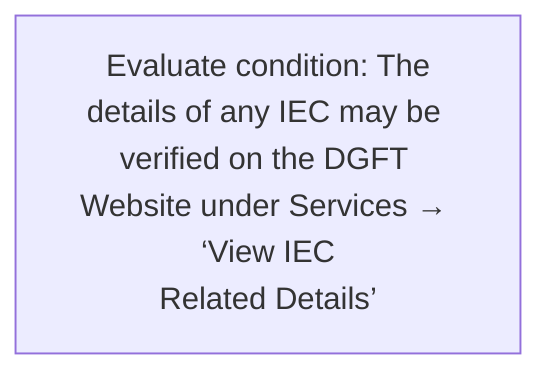
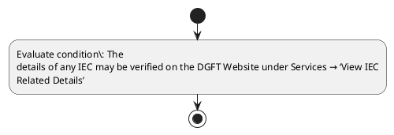

# Chapter 2 / Section 2.09: IEC Format

**Chapter Title:** General Provisions Regarding Imports and Exports

**Pages:** 5

**Purpose:** Defines the operational requirements for IEC Format.

**Purpose Thanglish:** Indha IEC Format section-la, Defines the operational requirements for IEC Format.

**Summary:** 2.09 IEC Format
An electronic copy of the IEC may be downloaded online on their DGFT Dashboard. The
details of any IEC may be verified on the DGFT Website under Services → ‘View IEC
Related Details’

**Business Meaning:** 2.09 IEC Format
An electronic copy of the IEC may be downloaded online on their DGFT Dashboard.

**Business Explanation:** 2.09 IEC Format
An electronic copy of the IEC may be downloaded online on their DGFT Dashboard. The
details of any IEC may be verified on the DGFT Website under Services → ‘View IEC
Related Details’

**Business Explanation Thanglish:** Indha IEC Format section-la, 2.09 IEC Format
An electronic copy of the IEC may be downloaded online on their DGFT Dashboard. The
details of any IEC may be verified on the DGFT Website under Services → ‘View IEC
Related Details’

## Business Logic
- None identified

## Business Rules
- rule_id=CH2-SEC2_09-R001, rule_description=2.09 IEC Format
An electronic copy of the IEC may be downloaded online on their DGFT Dashboard. The
details of any IEC may be verified on the DGFT Website under Services → ‘View IEC
Related Details’, trigger=IEC Format, condition=The
details of any IEC may be verified on the DGFT Website under Services → ‘View IEC
Related Details’, validation=Not explicitly covered in uploaded documents., action=Manual review required., exception=No explicit exception found in uploaded documents., output=DEKAI should produce a compliance decision for 2.09 - IEC Format.

## Conditions
- The
details of any IEC may be verified on the DGFT Website under Services → ‘View IEC
Related Details’

## Condition Logic
- id=2.2.09.1, if=The
details of any IEC may be verified on the DGFT Website under Services → ‘View IEC
Related Details’, then=Route for review, source=The
details of any IEC may be verified on the DGFT Website under Services → ‘View IEC
Related Details’

## Validations
- None identified

## Exceptions
- None identified

## Dependencies
- None identified

## Authorities
- DGFT
- An electronic copy of the IEC may be downloaded online on their DGFT
- IEC may be verified on the DGFT

## Required Documents
- 2.09 IEC Format
An electronic copy of the IEC may be downloaded online on their DGFT Dashboard.

## Timelines
- None identified

## Actions
- None identified

## Workflow
- Evaluate condition: The
details of any IEC may be verified on the DGFT Website under Services → ‘View IEC
Related Details’

## Workflow ASCII
```text
IEC Format
Evaluate condition: The
details of any IEC may be verified on the DGFT Website under Services → ‘View IEC
Related Details’
```

## Decision Tree
- IF section 2.09 applies THEN proceed with standard DGFT workflow

## Decision Tree ASCII
```text
IEC Format Decision
IF section 2.09 applies THEN proceed with standard DGFT workflow
```

## Examples
- User asks to process IEC Format; the platform checks conditions, validations, and documents before action.

**Real-world Example:** Example: an importer or exporter invokes IEC Format, submits 2.09 IEC Format
An electronic copy of the IEC may be downloaded online on their DGFT Dashboard., and DEKAI uses the extracted rules to follow the iec format process.

**Real-world Example Thanglish:** Indha IEC Format section-la, Example: an importer or exporter invokes IEC Format, submits 2.09 IEC Format
An electronic copy of the IEC may be downloaded online on their DGFT Dashboard., and DEKAI uses the extracted rules to follow the iec format process.

## AI Rules
- None identified

## Database Fields
- name=section_code, type=string, required=True, source=parsed_section_heading
- name=section_title, type=string, required=True, source=parsed_section_heading
- name=iec_flag, type=boolean, required=False, source=keyword:IEC
- name=the_flag, type=boolean, required=False, source=keyword:the
- name=may_flag, type=boolean, required=False, source=keyword:may
- name=any_flag, type=boolean, required=False, source=keyword:any
- name=copy_flag, type=boolean, required=False, source=keyword:copy
- name=dgft_flag, type=boolean, required=False, source=keyword:DGFT
- name=view_flag, type=boolean, required=False, source=keyword:View
- name=their_flag, type=boolean, required=False, source=keyword:their
- name=document_1_submitted, type=boolean, required=True, source=2.09 IEC Format
An electronic copy of the IEC may be downloaded online on their DGFT Dashboard.

## API Requirements
- method=GET, path=/api/dgft/sections/2.09, purpose=Retrieve knowledge payload for section 2.09, query_params=['include=workflow,decision_tree,validations'], response_fields=['section', 'title', 'summary', 'conditions', 'validations', 'exceptions', 'workflow', 'decision_tree']
- method=POST, path=/api/dgft/IEC-Format/validate, purpose=Validate inputs and documents for IEC Format, request_fields=['section_code', 'section_title', 'document_1_submitted'], response_fields=['status', 'errors', 'warnings', 'next_actions']

## UI Screens
- screen_id=IEC_Format_overview, name=IEC Format Overview, purpose=Show section summary, authority, timeline, and eligibility cues., widgets=['summary_card', 'conditions_table', 'authority_badges', 'timeline_panel']
- screen_id=IEC_Format_submission, name=IEC Format Submission, purpose=Capture applicant data and supporting documents., widgets=['dynamic_form', 'document_uploader', 'validation_panel', 'next_action_footer'], fields=['section_code', 'section_title', 'iec_flag', 'the_flag', 'may_flag', 'any_flag', 'copy_flag', 'dgft_flag']

## Error Messages
- Validation failed because the section requirements were not fully met.

## FAQ
- question_en=What is the purpose of section 2.09?, answer_en=2.09 IEC Format
An electronic copy of the IEC may be downloaded online on their DGFT Dashboard. The
details of any IEC may be verified on the DGFT Website under Services → ‘View IEC
Related Details’, question_thanglish=Indha IEC Format section-la, What is the purpose of section 2.09?, answer_thanglish=Indha IEC Format section-la, 2.09 IEC Format
An electronic copy of the IEC may be downloaded online on their DGFT Dashboard. The
details of any IEC may be verified on the DGFT Website under Services → ‘View IEC
Related Details’
- question_en=What documents are required under IEC Format?, answer_en=2.09 IEC Format
An electronic copy of the IEC may be downloaded online on their DGFT Dashboard., question_thanglish=Indha IEC Format section-la, What documents are required under IEC Format?, answer_thanglish=Indha IEC Format section-la, 2.09 IEC Format
An electronic copy of the IEC may be downloaded online on their DGFT Dashboard.
- question_en=Which authority handles IEC Format?, answer_en=DGFT, An electronic copy of the IEC may be downloaded online on their DGFT, IEC may be verified on the DGFT, question_thanglish=Indha IEC Format section-la, Which authority handles IEC Format?, answer_thanglish=Indha IEC Format section-la, DGFT, An electronic copy of the IEC may be downloaded online on their DGFT, IEC may be verified on the DGFT

## Questions Users May Ask
- What does IEC Format require?
- Which documents are needed for IEC Format?
- How does DEKAI validate IEC Format requests?

## Expected AI Answers
- IEC Format requires the platform to interpret the section text, apply the extracted business rules, and present the correct next action.
- Required documents are inferred from the section text: 2.09 IEC Format
An electronic copy of the IEC may be downloaded online on their DGFT Dashboard.
- DEKAI validates IEC Format by checking conditions, required documents, authority references, and exception clauses before recommending an outcome.

## AI Q&A Examples
- question_en=User asks: How do I comply with IEC Format?, answer_en=AI answers: DEKAI should evaluate section 2.09, apply the extracted rules, and guide the user through Evaluate condition: The
details of any IEC may be verified on the DGFT Website under Services → ‘View IEC
Related Details’., question_thanglish=Indha IEC Format section-la, User asks: How do I comply with IEC Format?, answer_thanglish=Indha IEC Format section-la, AI answers: DEKAI should evaluate section 2.09, apply the extracted rules, and guide the user through Evaluate condition: The
details of any IEC may be verified on the DGFT Website under Services → ‘View IEC
Related Details’.
- question_en=User asks: Which validations apply to IEC Format?, answer_en=AI answers: Applicable validations are not explicitly covered in the uploaded documents., question_thanglish=Indha IEC Format section-la, User asks: Which validations apply to IEC Format?, answer_thanglish=Indha IEC Format section-la, AI answers: Applicable validations are not explicitly covered in the uploaded documents.

## DEKAI AI Implementation Notes
- Capture chapter 2, section 2.09, title, and page references as immutable knowledge metadata.
- Bind validations for IEC Format into a rule engine keyed by the rule IDs extracted for this section.
- Expose document upload controls for: 2.09 IEC Format
An electronic copy of the IEC may be downloaded online on their DGFT Dashboard..
- Route escalations or approvals to: DGFT, An electronic copy of the IEC may be downloaded online on their DGFT, IEC may be verified on the DGFT.

## DEKAI AI Implementation Notes Thanglish
- Indha IEC Format section-la, Capture chapter 2, section 2.09, title, and page references as immutable knowledge metadata.
- Indha IEC Format section-la, Bind validations for IEC Format into a rule engine keyed by the rule IDs extracted for this section.
- Indha IEC Format section-la, Expose document upload controls for: 2.09 IEC Format
An electronic copy of the IEC may be downloaded online on their DGFT Dashboard..
- Indha IEC Format section-la, Route escalations or approvals to: DGFT, An electronic copy of the IEC may be downloaded online on their DGFT, IEC may be verified on the DGFT.

## AI Metadata
- Keywords: IEC, the, may, any, copy, DGFT, View, their, under, Format, online, details, Website, Related, verified, Services, Dashboard, electronic, downloaded
- Search Keywords: IEC, the, may, any, copy, DGFT, View, their, under, Format, online, details, Website, Related, verified, Services, Dashboard, electronic, downloaded
- Intent: Provide knowledge guidance for IEC Format.
- Tags: 2.09, IEC Format, document-driven, dgft
- Related Sections: 
- Related Chapters: 
- Related Rules: 

## Mermaid


## PlantUML

