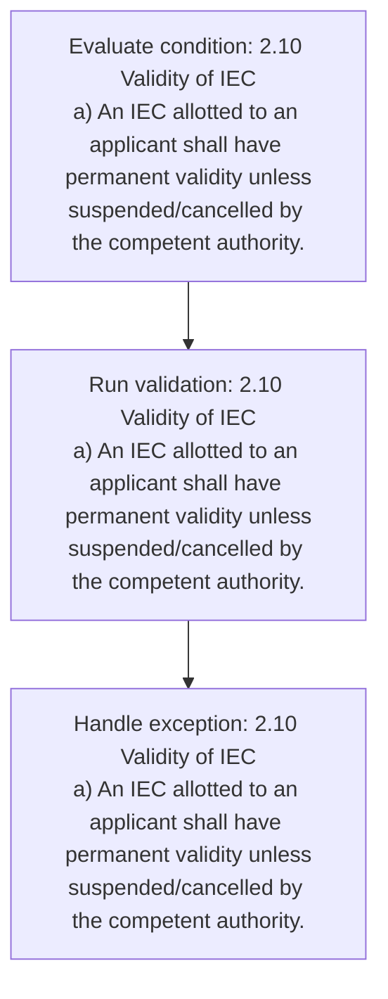
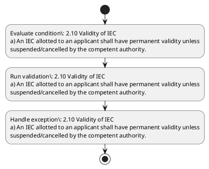

# Chapter 2 / Section 2.10: Validity of IEC

**Chapter Title:** General Provisions Regarding Imports and Exports

**Pages:** 5

**Purpose:** 2.10 Validity of IEC
a) An IEC allotted to an applicant shall have permanent validity unless
suspended/cancelled by the competent authority.

**Purpose Thanglish:** Indha Validity of IEC section-la, 2.10 Validity of IEC
a) An IEC allotted to an applicant kandippa have permanent validity unless
suspended/cancelled by the competent authority.

**Summary:** 2.10 Validity of IEC
a) An IEC allotted to an applicant shall have permanent validity unless
suspended/cancelled by the competent authority. The IEC will cover all branches /
divisions / units / factories of the applicant. b) IEC’s can however be de-activated in pursuance of the policy in para 2.05(e) of FTP.

**Business Meaning:** Validity of IEC governs how DGFT business controls should be applied, validated, and enforced.

**Business Explanation:** Validity of IEC explains the operating rule set that DEKAI should enforce. Key control points include 2.10 Validity of IEC
a) An IEC allotted to an applicant shall have permanent validity unless
suspended/cancelled by the competent authority.

**Business Explanation Thanglish:** Indha Validity of IEC section-la, Validity of IEC explains the operating rule set that DEKAI should enforce. Key control points include 2.10 Validity of IEC
a) An IEC allotted to an applicant kandippa have permanent validity unless
suspended/cancelled by the competent authority.

## Business Logic
- 2.10 Validity of IEC
a) An IEC allotted to an applicant shall have permanent validity unless
suspended/cancelled by the competent authority.

## Business Rules
- rule_id=CH2-SEC2_10-R001, rule_description=2.10 Validity of IEC
a) An IEC allotted to an applicant shall have permanent validity unless
suspended/cancelled by the competent authority., trigger=Validity of IEC, condition=2.10 Validity of IEC
a) An IEC allotted to an applicant shall have permanent validity unless
suspended/cancelled by the competent authority., validation=2.10 Validity of IEC
a) An IEC allotted to an applicant shall have permanent validity unless
suspended/cancelled by the competent authority., action=Manual review required., exception=2.10 Validity of IEC
a) An IEC allotted to an applicant shall have permanent validity unless
suspended/cancelled by the competent authority., output=DEKAI should produce a compliance decision for 2.10 - Validity of IEC.

## Conditions
- 2.10 Validity of IEC
a) An IEC allotted to an applicant shall have permanent validity unless
suspended/cancelled by the competent authority.

## Condition Logic
- id=2.2.10.1, if=2.10 Validity of IEC
a) An IEC allotted to an applicant shall have permanent validity unless
suspended/cancelled by the competent authority., then=Route for review, source=2.10 Validity of IEC
a) An IEC allotted to an applicant shall have permanent validity unless
suspended/cancelled by the competent authority.

## Validations
- 2.10 Validity of IEC
a) An IEC allotted to an applicant shall have permanent validity unless
suspended/cancelled by the competent authority.

## Exceptions
- 2.10 Validity of IEC
a) An IEC allotted to an applicant shall have permanent validity unless
suspended/cancelled by the competent authority.
- b) IEC’s can however be de-activated in pursuance of the policy in para 2.05(e) of FTP.

## Dependencies
- 2.05

## Authorities
- None identified

## Required Documents
- None identified

## Timelines
- None identified

## Actions
- None identified

## Workflow
- Evaluate condition: 2.10 Validity of IEC
a) An IEC allotted to an applicant shall have permanent validity unless
suspended/cancelled by the competent authority.
- Run validation: 2.10 Validity of IEC
a) An IEC allotted to an applicant shall have permanent validity unless
suspended/cancelled by the competent authority.
- Handle exception: 2.10 Validity of IEC
a) An IEC allotted to an applicant shall have permanent validity unless
suspended/cancelled by the competent authority.

## Workflow ASCII
```text
Validity of IEC
Evaluate condition: 2.10 Validity of IEC
a) An IEC allotted to an applicant shall have permanent validity unless
suspended/cancelled by the competent authority.
   |
   v
Run validation: 2.10 Validity of IEC
a) An IEC allotted to an applicant shall have permanent validity unless
suspended/cancelled by the competent authority.
   |
   v
Handle exception: 2.10 Validity of IEC
a) An IEC allotted to an applicant shall have permanent validity unless
suspended/cancelled by the competent authority.
```

## Decision Tree
- IF exception applies (2.10 Validity of IEC
a) An IEC allotted to an applicant shall have permanent validity unless
suspended/cancelled by the competent authority.) THEN route to manual review
- IF exception applies (b) IEC’s can however be de-activated in pursuance of the policy in para 2.05(e) of FTP.) THEN route to manual review

## Decision Tree ASCII
```text
Validity of IEC Decision
IF exception applies (2.10 Validity of IEC
a) An IEC allotted to an applicant shall have permanent validity unless
suspended/cancelled by the competent authority.) THEN route to manual review
   |
   v
IF exception applies (b) IEC’s can however be de-activated in pursuance of the policy in para 2.05(e) of FTP.) THEN route to manual review
```

## Examples
- User asks to process Validity of IEC; the platform checks conditions, validations, and documents before action.

**Real-world Example:** Example: an importer or exporter invokes Validity of IEC, submits the prescribed DGFT records, and DEKAI uses the extracted rules to follow the validity of iec process.

**Real-world Example Thanglish:** Indha Validity of IEC section-la, Example: an importer or exporter invokes Validity of IEC, submits the prescribed DGFT records, and DEKAI uses the extracted rules to follow the validity of iec process.

## AI Rules
- IF detected context matches section rule THEN enforce: 2.10 Validity of IEC
a) An IEC allotted to an applicant shall have permanent validity unless
suspended/cancelled by the competent authority.

## Database Fields
- name=section_code, type=string, required=True, source=parsed_section_heading
- name=section_title, type=string, required=True, source=parsed_section_heading
- name=iec_flag, type=boolean, required=False, source=keyword:IEC
- name=the_flag, type=boolean, required=False, source=keyword:the
- name=all_flag, type=boolean, required=False, source=keyword:all
- name=can_flag, type=boolean, required=False, source=keyword:can
- name=ftp_flag, type=boolean, required=False, source=keyword:FTP
- name=have_flag, type=boolean, required=False, source=keyword:have
- name=will_flag, type=boolean, required=False, source=keyword:will
- name=para_flag, type=boolean, required=False, source=keyword:para

## API Requirements
- method=GET, path=/api/dgft/sections/2.10, purpose=Retrieve knowledge payload for section 2.10, query_params=['include=workflow,decision_tree,validations'], response_fields=['section', 'title', 'summary', 'conditions', 'validations', 'exceptions', 'workflow', 'decision_tree']
- method=POST, path=/api/dgft/Validity-of-IEC/validate, purpose=Validate inputs and documents for Validity of IEC, request_fields=['section_code', 'section_title'], response_fields=['status', 'errors', 'warnings', 'next_actions']

## UI Screens
- screen_id=Validity_of_IEC_overview, name=Validity of IEC Overview, purpose=Show section summary, authority, timeline, and eligibility cues., widgets=['summary_card', 'conditions_table', 'authority_badges', 'timeline_panel']
- screen_id=Validity_of_IEC_submission, name=Validity of IEC Submission, purpose=Capture applicant data and supporting documents., widgets=['dynamic_form', 'document_uploader', 'validation_panel', 'next_action_footer'], fields=['section_code', 'section_title', 'iec_flag', 'the_flag', 'all_flag', 'can_flag', 'ftp_flag', 'have_flag']
- screen_id=Validity_of_IEC_exceptions, name=Validity of IEC Exception Review, purpose=Explain exception handling and manual review triggers., widgets=['exception_banner', 'decision_tree', 'case_notes']

## Error Messages
- Validation failed because the section requirements were not fully met.

## FAQ
- question_en=What is the purpose of section 2.10?, answer_en=Validity of IEC explains the operating rule set that DEKAI should enforce. Key control points include 2.10 Validity of IEC
a) An IEC allotted to an applicant shall have permanent validity unless
suspended/cancelled by the competent authority., question_thanglish=Indha Validity of IEC section-la, What is the purpose of section 2.10?, answer_thanglish=Indha Validity of IEC section-la, Validity of IEC explains the operating rule set that DEKAI should enforce. Key control points include 2.10 Validity of IEC
a) An IEC allotted to an applicant kandippa have permanent validity unless
suspended/cancelled by the competent authority.
- question_en=What documents are required under Validity of IEC?, answer_en=Not explicitly covered in uploaded documents., question_thanglish=Indha Validity of IEC section-la, What documents are required under Validity of IEC?, answer_thanglish=Indha Validity of IEC section-la, Not explicitly covered in uploaded documents.
- question_en=Which authority handles Validity of IEC?, answer_en=Not explicitly covered in uploaded documents., question_thanglish=Indha Validity of IEC section-la, Which authority handles Validity of IEC?, answer_thanglish=Indha Validity of IEC section-la, Not explicitly covered in uploaded documents.

## Questions Users May Ask
- What does Validity of IEC require?
- Which documents are needed for Validity of IEC?
- How does DEKAI validate Validity of IEC requests?

## Expected AI Answers
- Validity of IEC requires the platform to interpret the section text, apply the extracted business rules, and present the correct next action.
- Required documents are inferred from the section text: no explicit documents were detected.
- DEKAI validates Validity of IEC by checking conditions, required documents, authority references, and exception clauses before recommending an outcome.

## AI Q&A Examples
- question_en=User asks: How do I comply with Validity of IEC?, answer_en=AI answers: DEKAI should evaluate section 2.10, apply the extracted rules, and guide the user through Evaluate condition: 2.10 Validity of IEC
a) An IEC allotted to an applicant shall have permanent validity unless
suspended/cancelled by the competent authority.., question_thanglish=Indha Validity of IEC section-la, User asks: How do I comply with Validity of IEC?, answer_thanglish=Indha Validity of IEC section-la, AI answers: DEKAI should evaluate section 2.10, apply the extracted rules, and guide the user through Evaluate condition: 2.10 Validity of IEC
a) An IEC allotted to an applicant kandippa have permanent validity unless
suspended/cancelled by the competent authority..
- question_en=User asks: Which validations apply to Validity of IEC?, answer_en=AI answers: Applicable validations are 2.10 Validity of IEC
a) An IEC allotted to an applicant shall have permanent validity unless
suspended/cancelled by the competent authority., question_thanglish=Indha Validity of IEC section-la, User asks: Which validations apply to Validity of IEC?, answer_thanglish=Indha Validity of IEC section-la, AI answers: Applicable validations are 2.10 Validity of IEC
a) An IEC allotted to an applicant kandippa have permanent validity unless
suspended/cancelled by the competent authority.

## DEKAI AI Implementation Notes
- Capture chapter 2, section 2.10, title, and page references as immutable knowledge metadata.
- Bind validations for Validity of IEC into a rule engine keyed by the rule IDs extracted for this section.
- Trigger manual review when exception clauses are detected.
- Show contextual links to related sections: 2.05.

## DEKAI AI Implementation Notes Thanglish
- Indha Validity of IEC section-la, Capture chapter 2, section 2.10, title, and page references as immutable knowledge metadata.
- Indha Validity of IEC section-la, Bind validations for Validity of IEC into a rule engine keyed by the rule IDs extracted for this section.
- Indha Validity of IEC section-la, Trigger manual review when exception clauses are detected.
- Indha Validity of IEC section-la, Show contextual links to related sections: 2.05.

## AI Metadata
- Keywords: IEC, the, all, can, FTP, have, will, para, shall, cover, units, unless, policy, however, Validity, allotted, branches, applicant, permanent, competent
- Search Keywords: IEC, the, all, can, FTP, have, will, para, shall, cover, units, unless, policy, however, Validity, allotted, branches, applicant, permanent, competent
- Intent: Provide knowledge guidance for Validity of IEC.
- Tags: 2.10, Validity of IEC, business-rule, dgft
- Related Sections: 2.05
- Related Chapters: 
- Related Rules: 2.10 Validity of IEC
a) An IEC allotted to an applicant shall have permanent validity unless
suspended/cancelled by the competent authority.

## Mermaid


## PlantUML

