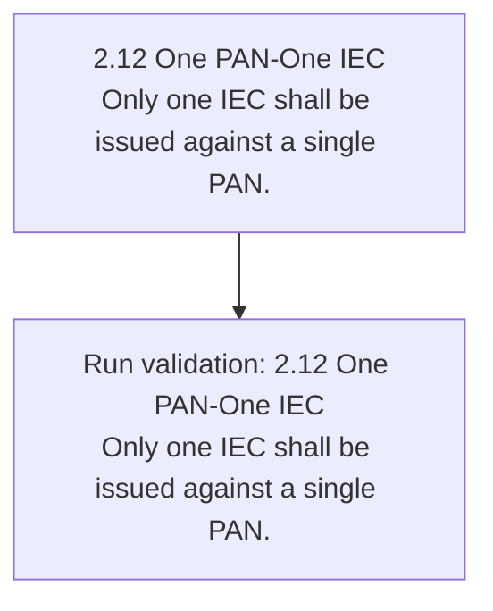
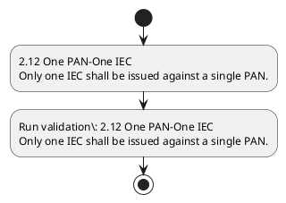

# Chapter 2 / Section 2.12: One PAN-One IEC

**Chapter Title:** General Provisions Regarding Imports and Exports

**Pages:** 5

**Purpose:** 2.12 One PAN-One IEC
Only one IEC shall be issued against a single PAN.

**Purpose Thanglish:** Indha One PAN-One IEC section-la, 2.12 One PAN-One IEC
Only one IEC kandippa be issued against a single PAN.

**Summary:** 2.12 One PAN-One IEC
Only one IEC shall be issued against a single PAN.

**Business Meaning:** One PAN-One IEC governs how DGFT business controls should be applied, validated, and enforced.

**Business Explanation:** One PAN-One IEC explains the operating rule set that DEKAI should enforce. Key control points include 2.12 One PAN-One IEC
Only one IEC shall be issued against a single PAN. The section also drives actions such as 2.12 One PAN-One IEC
Only one IEC shall be issued against a single PAN..

**Business Explanation Thanglish:** Indha One PAN-One IEC section-la, One PAN-One IEC explains the operating rule set that DEKAI should enforce. Key control points include 2.12 One PAN-One IEC
Only one IEC kandippa be issued against a single PAN. The section also drives actions such as 2.12 One PAN-One IEC
Only one IEC kandippa be issued against a single PAN..

## Business Logic
- 2.12 One PAN-One IEC
Only one IEC shall be issued against a single PAN.

## Business Rules
- rule_id=CH2-SEC2_12-R001, rule_description=2.12 One PAN-One IEC
Only one IEC shall be issued against a single PAN., trigger=One PAN-One IEC, condition=Section 2.12 is applicable, validation=2.12 One PAN-One IEC
Only one IEC shall be issued against a single PAN., action=2.12 One PAN-One IEC
Only one IEC shall be issued against a single PAN., exception=No explicit exception found in uploaded documents., output=DEKAI should produce a compliance decision for 2.12 - One PAN-One IEC.

## Conditions
- None identified

## Condition Logic
- id=2.2.12.1, if=Section 2.12 is applicable, then=2.12 One PAN-One IEC
Only one IEC shall be issued against a single PAN., source=Derived from uploaded documents

## Validations
- 2.12 One PAN-One IEC
Only one IEC shall be issued against a single PAN.

## Exceptions
- None identified

## Dependencies
- None identified

## Authorities
- None identified

## Required Documents
- None identified

## Timelines
- None identified

## Actions
- 2.12 One PAN-One IEC
Only one IEC shall be issued against a single PAN.

## Workflow
- 2.12 One PAN-One IEC
Only one IEC shall be issued against a single PAN.
- Run validation: 2.12 One PAN-One IEC
Only one IEC shall be issued against a single PAN.

## Workflow ASCII
```text
One PAN-One IEC
2.12 One PAN-One IEC
Only one IEC shall be issued against a single PAN.
   |
   v
Run validation: 2.12 One PAN-One IEC
Only one IEC shall be issued against a single PAN.
```

## Decision Tree
- IF section 2.12 applies THEN 2.12 One PAN-One IEC
Only one IEC shall be issued against a single PAN.

## Decision Tree ASCII
```text
One PAN-One IEC Decision
IF section 2.12 applies THEN 2.12 One PAN-One IEC
Only one IEC shall be issued against a single PAN.
```

## Examples
- User asks to process One PAN-One IEC; the platform checks conditions, validations, and documents before action.

**Real-world Example:** Example: an importer or exporter invokes One PAN-One IEC, submits the prescribed DGFT records, and DEKAI uses the extracted rules to 2.12 one pan-one iec
only one iec shall be issued against a single pan..

**Real-world Example Thanglish:** Indha One PAN-One IEC section-la, Example: an importer or exporter invokes One PAN-One IEC, submits the prescribed DGFT records, and DEKAI uses the extracted rules to 2.12 one pan-one iec
only one iec kandippa be issued against a single pan..

## AI Rules
- IF detected context matches section rule THEN enforce: 2.12 One PAN-One IEC
Only one IEC shall be issued against a single PAN.
- IF validations pass THEN recommend action: 2.12 One PAN-One IEC
Only one IEC shall be issued against a single PAN.

## Database Fields
- name=section_code, type=string, required=True, source=parsed_section_heading
- name=section_title, type=string, required=True, source=parsed_section_heading
- name=one_flag, type=boolean, required=False, source=keyword:One
- name=iec_flag, type=boolean, required=False, source=keyword:IEC
- name=pan_flag, type=boolean, required=False, source=keyword:PAN
- name=only_flag, type=boolean, required=False, source=keyword:Only
- name=shall_flag, type=boolean, required=False, source=keyword:shall
- name=issued_flag, type=boolean, required=False, source=keyword:issued
- name=single_flag, type=boolean, required=False, source=keyword:single
- name=pan_one_flag, type=boolean, required=False, source=keyword:PAN-One

## API Requirements
- method=GET, path=/api/dgft/sections/2.12, purpose=Retrieve knowledge payload for section 2.12, query_params=['include=workflow,decision_tree,validations'], response_fields=['section', 'title', 'summary', 'conditions', 'validations', 'exceptions', 'workflow', 'decision_tree']
- method=POST, path=/api/dgft/One-PAN-One-IEC/validate, purpose=Validate inputs and documents for One PAN-One IEC, request_fields=['section_code', 'section_title'], response_fields=['status', 'errors', 'warnings', 'next_actions']
- method=POST, path=/api/dgft/One-PAN-One-IEC/execute, purpose=Trigger business action for 2.12 One PAN-One IEC
Only one IEC shall be issued against a single PAN., request_fields=['section_code', 'section_title'], response_fields=['reference_id', 'status', 'authority', 'timeline']

## UI Screens
- screen_id=One_PAN_One_IEC_overview, name=One PAN-One IEC Overview, purpose=Show section summary, authority, timeline, and eligibility cues., widgets=['summary_card', 'conditions_table', 'authority_badges', 'timeline_panel']
- screen_id=One_PAN_One_IEC_submission, name=One PAN-One IEC Submission, purpose=Capture applicant data and supporting documents., widgets=['dynamic_form', 'document_uploader', 'validation_panel', 'next_action_footer'], fields=['section_code', 'section_title', 'one_flag', 'iec_flag', 'pan_flag', 'only_flag', 'shall_flag', 'issued_flag']

## Error Messages
- Validation failed because the section requirements were not fully met.

## FAQ
- question_en=What is the purpose of section 2.12?, answer_en=One PAN-One IEC explains the operating rule set that DEKAI should enforce. Key control points include 2.12 One PAN-One IEC
Only one IEC shall be issued against a single PAN. The section also drives actions such as 2.12 One PAN-One IEC
Only one IEC shall be issued against a single PAN.., question_thanglish=Indha One PAN-One IEC section-la, What is the purpose of section 2.12?, answer_thanglish=Indha One PAN-One IEC section-la, One PAN-One IEC explains the operating rule set that DEKAI should enforce. Key control points include 2.12 One PAN-One IEC
Only one IEC kandippa be issued against a single PAN. The section also drives actions such as 2.12 One PAN-One IEC
Only one IEC kandippa be issued against a single PAN..
- question_en=What documents are required under One PAN-One IEC?, answer_en=Not explicitly covered in uploaded documents., question_thanglish=Indha One PAN-One IEC section-la, What documents are required under One PAN-One IEC?, answer_thanglish=Indha One PAN-One IEC section-la, Not explicitly covered in uploaded documents.
- question_en=Which authority handles One PAN-One IEC?, answer_en=Not explicitly covered in uploaded documents., question_thanglish=Indha One PAN-One IEC section-la, Which authority handles One PAN-One IEC?, answer_thanglish=Indha One PAN-One IEC section-la, Not explicitly covered in uploaded documents.

## Questions Users May Ask
- What does One PAN-One IEC require?
- Which documents are needed for One PAN-One IEC?
- How does DEKAI validate One PAN-One IEC requests?
- What action should be taken for One PAN-One IEC?

## Expected AI Answers
- One PAN-One IEC requires the platform to interpret the section text, apply the extracted business rules, and present the correct next action.
- Required documents are inferred from the section text: no explicit documents were detected.
- DEKAI validates One PAN-One IEC by checking conditions, required documents, authority references, and exception clauses before recommending an outcome.
- The primary extracted action is: 2.12 One PAN-One IEC
Only one IEC shall be issued against a single PAN.

## AI Q&A Examples
- question_en=User asks: How do I comply with One PAN-One IEC?, answer_en=AI answers: DEKAI should evaluate section 2.12, apply the extracted rules, and guide the user through 2.12 One PAN-One IEC
Only one IEC shall be issued against a single PAN.., question_thanglish=Indha One PAN-One IEC section-la, User asks: How do I comply with One PAN-One IEC?, answer_thanglish=Indha One PAN-One IEC section-la, AI answers: DEKAI should evaluate section 2.12, apply the extracted rules, and guide the user through 2.12 One PAN-One IEC
Only one IEC kandippa be issued against a single PAN..
- question_en=User asks: Which validations apply to One PAN-One IEC?, answer_en=AI answers: Applicable validations are 2.12 One PAN-One IEC
Only one IEC shall be issued against a single PAN., question_thanglish=Indha One PAN-One IEC section-la, User asks: Which validations apply to One PAN-One IEC?, answer_thanglish=Indha One PAN-One IEC section-la, AI answers: Applicable validations are 2.12 One PAN-One IEC
Only one IEC kandippa be issued against a single PAN.

## DEKAI AI Implementation Notes
- Capture chapter 2, section 2.12, title, and page references as immutable knowledge metadata.
- Bind validations for One PAN-One IEC into a rule engine keyed by the rule IDs extracted for this section.

## DEKAI AI Implementation Notes Thanglish
- Indha One PAN-One IEC section-la, Capture chapter 2, section 2.12, title, and page references as immutable knowledge metadata.
- Indha One PAN-One IEC section-la, Bind validations for One PAN-One IEC into a rule engine keyed by the rule IDs extracted for this section.

## AI Metadata
- Keywords: One, IEC, PAN, Only, shall, issued, single, PAN-One, against
- Search Keywords: One, IEC, PAN, Only, shall, issued, single, PAN-One, against
- Intent: Support One PAN-One IEC processing and compliance validation.
- Tags: 2.12, One PAN-One IEC, business-rule, dgft
- Related Sections: 
- Related Chapters: 
- Related Rules: 2.12 One PAN-One IEC
Only one IEC shall be issued against a single PAN.

## Mermaid


## PlantUML

