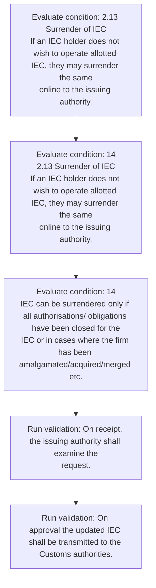
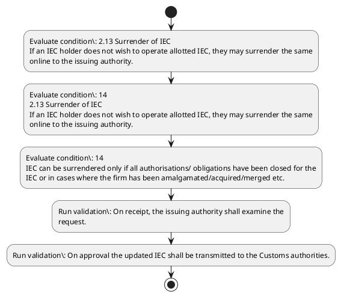

# Chapter 2 / Section 2.13: Surrender of IEC

**Chapter Title:** General Provisions Regarding Imports and Exports

**Pages:** 5, 6

**Purpose:** 2.13 Surrender of IEC
If an IEC holder does not wish to operate allotted IEC, they may surrender the same
online to the issuing authority.

**Purpose Thanglish:** Indha Surrender of IEC section-la, 2.13 Surrender of IEC
If an IEC holder does not wish to operate allotted IEC, they may surrender the same
online to the issuing authority.

**Summary:** 2.13 Surrender of IEC
If an IEC holder does not wish to operate allotted IEC, they may surrender the same
online to the issuing authority. On receipt, the issuing authority shall examine the
request. On approval the updated IEC shall be transmitted to the Customs authorities.

**Business Meaning:** Surrender of IEC governs how DGFT business controls should be applied, validated, and enforced.

**Business Explanation:** Surrender of IEC explains the operating rule set that DEKAI should enforce. Key control points include On receipt, the issuing authority shall examine the
request.

**Business Explanation Thanglish:** Indha Surrender of IEC section-la, Surrender of IEC explains the operating rule set that DEKAI should enforce. Key control points include On receipt, the issuing authority kandippa examine the
request.

## Business Logic
- On receipt, the issuing authority shall examine the
request.
- On approval the updated IEC shall be transmitted to the Customs authorities.

## Business Rules
- rule_id=CH2-SEC2_13-R001, rule_description=On receipt, the issuing authority shall examine the
request., trigger=Surrender of IEC, condition=an IEC holder does not wish to operate allotted IEC, validation=On receipt, the issuing authority shall examine the
request., action=Manual review required., exception=No explicit exception found in uploaded documents., output=DEKAI should produce a compliance decision for 2.13 - Surrender of IEC.
- rule_id=CH2-SEC2_13-R002, rule_description=On approval the updated IEC shall be transmitted to the Customs authorities., trigger=Surrender of IEC, condition=an IEC holder does not wish to operate allotted IEC, validation=On approval the updated IEC shall be transmitted to the Customs authorities., action=Manual review required., exception=No explicit exception found in uploaded documents., output=DEKAI should produce a compliance decision for 2.13 - Surrender of IEC.

## Conditions
- 2.13 Surrender of IEC
If an IEC holder does not wish to operate allotted IEC, they may surrender the same
online to the issuing authority.
- 14
2.13 Surrender of IEC
If an IEC holder does not wish to operate allotted IEC, they may surrender the same
online to the issuing authority.
- 14
IEC can be surrendered only if all authorisations/ obligations have been closed for the
IEC or in cases where the firm has been amalgamated/acquired/merged etc.

## Condition Logic
- id=2.2.13.1, if=an IEC holder does not wish to operate allotted IEC, then=Route for review, source=2.13 Surrender of IEC
If an IEC holder does not wish to operate allotted IEC, they may surrender the same
online to the issuing authority.
- id=2.2.13.2, if=an IEC holder does not wish to operate allotted IEC, then=Route for review, source=14
2.13 Surrender of IEC
If an IEC holder does not wish to operate allotted IEC, they may surrender the same
online to the issuing authority.
- id=2.2.13.3, if=14
IEC can be surrendered only if all authorisations/ obligations have been closed for the
IEC or in cases where the firm has been amalgamated/acquired/merged etc., then=Route for review, source=14
IEC can be surrendered only if all authorisations/ obligations have been closed for the
IEC or in cases where the firm has been amalgamated/acquired/merged etc.

## Validations
- On receipt, the issuing authority shall examine the
request.
- On approval the updated IEC shall be transmitted to the Customs authorities.

## Exceptions
- None identified

## Dependencies
- 1

## Authorities
- Customs
- On approval the updated IEC shall be transmitted to the Customs

## Required Documents
- None identified

## Timelines
- None identified

## Actions
- None identified

## Workflow
- Evaluate condition: 2.13 Surrender of IEC
If an IEC holder does not wish to operate allotted IEC, they may surrender the same
online to the issuing authority.
- Evaluate condition: 14
2.13 Surrender of IEC
If an IEC holder does not wish to operate allotted IEC, they may surrender the same
online to the issuing authority.
- Evaluate condition: 14
IEC can be surrendered only if all authorisations/ obligations have been closed for the
IEC or in cases where the firm has been amalgamated/acquired/merged etc.
- Run validation: On receipt, the issuing authority shall examine the
request.
- Run validation: On approval the updated IEC shall be transmitted to the Customs authorities.

## Workflow ASCII
```text
Surrender of IEC
Evaluate condition: 2.13 Surrender of IEC
If an IEC holder does not wish to operate allotted IEC, they may surrender the same
online to the issuing authority.
   |
   v
Evaluate condition: 14
2.13 Surrender of IEC
If an IEC holder does not wish to operate allotted IEC, they may surrender the same
online to the issuing authority.
   |
   v
Evaluate condition: 14
IEC can be surrendered only if all authorisations/ obligations have been closed for the
IEC or in cases where the firm has been amalgamated/acquired/merged etc.
   |
   v
Run validation: On receipt, the issuing authority shall examine the
request.
   |
   v
Run validation: On approval the updated IEC shall be transmitted to the Customs authorities.
```

## Decision Tree
- IF section 2.13 applies THEN proceed with standard DGFT workflow

## Decision Tree ASCII
```text
Surrender of IEC Decision
IF section 2.13 applies THEN proceed with standard DGFT workflow
```

## Examples
- User asks to process Surrender of IEC; the platform checks conditions, validations, and documents before action.

**Real-world Example:** Example: an importer or exporter invokes Surrender of IEC, submits the prescribed DGFT records, and DEKAI uses the extracted rules to follow the surrender of iec process.

**Real-world Example Thanglish:** Indha Surrender of IEC section-la, Example: an importer or exporter invokes Surrender of IEC, submits the prescribed DGFT records, and DEKAI uses the extracted rules to follow the surrender of iec process.

## AI Rules
- IF detected context matches section rule THEN enforce: On receipt, the issuing authority shall examine the
request.
- IF detected context matches section rule THEN enforce: On approval the updated IEC shall be transmitted to the Customs authorities.

## Database Fields
- name=section_code, type=string, required=True, source=parsed_section_heading
- name=section_title, type=string, required=True, source=parsed_section_heading
- name=iec_flag, type=boolean, required=False, source=keyword:IEC
- name=not_flag, type=boolean, required=False, source=keyword:not
- name=may_flag, type=boolean, required=False, source=keyword:may
- name=the_flag, type=boolean, required=False, source=keyword:the
- name=can_flag, type=boolean, required=False, source=keyword:can
- name=all_flag, type=boolean, required=False, source=keyword:all
- name=for_flag, type=boolean, required=False, source=keyword:for
- name=has_flag, type=boolean, required=False, source=keyword:has

## API Requirements
- method=GET, path=/api/dgft/sections/2.13, purpose=Retrieve knowledge payload for section 2.13, query_params=['include=workflow,decision_tree,validations'], response_fields=['section', 'title', 'summary', 'conditions', 'validations', 'exceptions', 'workflow', 'decision_tree']
- method=POST, path=/api/dgft/Surrender-of-IEC/validate, purpose=Validate inputs and documents for Surrender of IEC, request_fields=['section_code', 'section_title'], response_fields=['status', 'errors', 'warnings', 'next_actions']

## UI Screens
- screen_id=Surrender_of_IEC_overview, name=Surrender of IEC Overview, purpose=Show section summary, authority, timeline, and eligibility cues., widgets=['summary_card', 'conditions_table', 'authority_badges', 'timeline_panel']
- screen_id=Surrender_of_IEC_submission, name=Surrender of IEC Submission, purpose=Capture applicant data and supporting documents., widgets=['dynamic_form', 'document_uploader', 'validation_panel', 'next_action_footer'], fields=['section_code', 'section_title', 'iec_flag', 'not_flag', 'may_flag', 'the_flag', 'can_flag', 'all_flag']

## Error Messages
- Validation failed because the section requirements were not fully met.

## FAQ
- question_en=What is the purpose of section 2.13?, answer_en=Surrender of IEC explains the operating rule set that DEKAI should enforce. Key control points include On receipt, the issuing authority shall examine the
request., question_thanglish=Indha Surrender of IEC section-la, What is the purpose of section 2.13?, answer_thanglish=Indha Surrender of IEC section-la, Surrender of IEC explains the operating rule set that DEKAI should enforce. Key control points include On receipt, the issuing authority kandippa examine the
request.
- question_en=What documents are required under Surrender of IEC?, answer_en=Not explicitly covered in uploaded documents., question_thanglish=Indha Surrender of IEC section-la, What documents are required under Surrender of IEC?, answer_thanglish=Indha Surrender of IEC section-la, Not explicitly covered in uploaded documents.
- question_en=Which authority handles Surrender of IEC?, answer_en=Customs, On approval the updated IEC shall be transmitted to the Customs, question_thanglish=Indha Surrender of IEC section-la, Which authority handles Surrender of IEC?, answer_thanglish=Indha Surrender of IEC section-la, Customs, On approval the updated IEC kandippa be transmitted to the Customs

## Questions Users May Ask
- What does Surrender of IEC require?
- Which documents are needed for Surrender of IEC?
- How does DEKAI validate Surrender of IEC requests?

## Expected AI Answers
- Surrender of IEC requires the platform to interpret the section text, apply the extracted business rules, and present the correct next action.
- Required documents are inferred from the section text: no explicit documents were detected.
- DEKAI validates Surrender of IEC by checking conditions, required documents, authority references, and exception clauses before recommending an outcome.

## AI Q&A Examples
- question_en=User asks: How do I comply with Surrender of IEC?, answer_en=AI answers: DEKAI should evaluate section 2.13, apply the extracted rules, and guide the user through Evaluate condition: 2.13 Surrender of IEC
If an IEC holder does not wish to operate allotted IEC, they may surrender the same
online to the issuing authority.., question_thanglish=Indha Surrender of IEC section-la, User asks: How do I comply with Surrender of IEC?, answer_thanglish=Indha Surrender of IEC section-la, AI answers: DEKAI should evaluate section 2.13, apply the extracted rules, and guide the user through Evaluate condition: 2.13 Surrender of IEC
If an IEC holder does not wish to operate allotted IEC, they may surrender the same
online to the issuing authority..
- question_en=User asks: Which validations apply to Surrender of IEC?, answer_en=AI answers: Applicable validations are On receipt, the issuing authority shall examine the
request., On approval the updated IEC shall be transmitted to the Customs authorities., question_thanglish=Indha Surrender of IEC section-la, User asks: Which validations apply to Surrender of IEC?, answer_thanglish=Indha Surrender of IEC section-la, AI answers: Applicable validations are On receipt, the issuing authority kandippa examine the
request., On approval the updated IEC kandippa be transmitted to the Customs authorities.

## DEKAI AI Implementation Notes
- Capture chapter 2, section 2.13, title, and page references as immutable knowledge metadata.
- Bind validations for Surrender of IEC into a rule engine keyed by the rule IDs extracted for this section.
- Route escalations or approvals to: Customs, On approval the updated IEC shall be transmitted to the Customs.
- Show contextual links to related sections: 1.

## DEKAI AI Implementation Notes Thanglish
- Indha Surrender of IEC section-la, Capture chapter 2, section 2.13, title, and page references as immutable knowledge metadata.
- Indha Surrender of IEC section-la, Bind validations for Surrender of IEC into a rule engine keyed by the rule IDs extracted for this section.
- Indha Surrender of IEC section-la, Route escalations or approvals to: Customs, On approval the updated IEC kandippa be transmitted to the Customs.
- Indha Surrender of IEC section-la, Show contextual links to related sections: 1.

## AI Metadata
- Keywords: IEC, not, may, the, can, all, for, has, etc, are, new, does, wish, they, same, only, have, been, firm, with
- Search Keywords: IEC, not, may, the, can, all, for, has, etc, are, new, does, wish, they, same, only, have, been, firm, with
- Intent: Provide knowledge guidance for Surrender of IEC.
- Tags: 2.13, Surrender of IEC, business-rule, dgft
- Related Sections: 1
- Related Chapters: 
- Related Rules: On receipt, the issuing authority shall examine the
request., On approval the updated IEC shall be transmitted to the Customs authorities.

## Mermaid


## PlantUML

