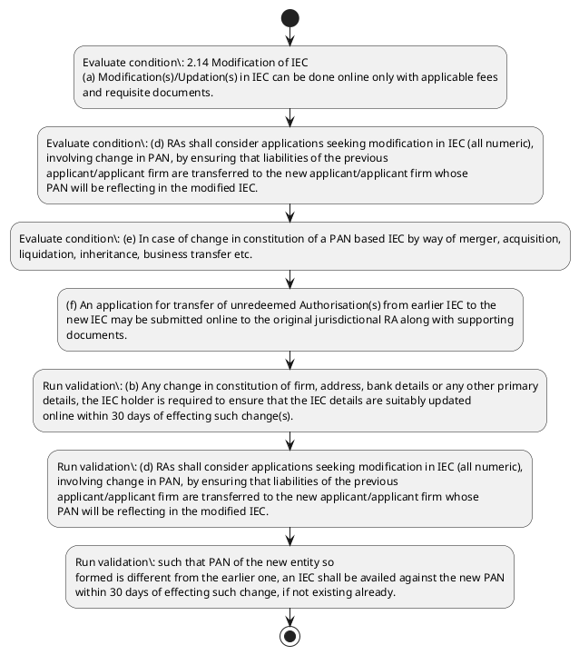

# Chapter 2 / Section 2.14: Modification of IEC

**Chapter Title:** General Provisions Regarding Imports and Exports

**Pages:** 6

**Purpose:** (b) Any change in constitution of firm, address, bank details or any other primary
details, the IEC holder is required to ensure that the IEC details are suitably updated
online within 30 days of effecting such change(s).

**Purpose Thanglish:** Indha Modification of IEC section-la, (b) Any change in constitution of firm, address, bank details or any other primary
details, the IEC holder is required to ensure that the IEC details are suitably updated
online within 30 days of effecting such change(s).

**Summary:** 2.14 Modification of IEC
(a) Modification(s)/Updation(s) in IEC can be done online only with applicable fees
and requisite documents. (b) Any change in constitution of firm, address, bank details or any other primary
details, the IEC holder is required to ensure that the IEC details are suitably updated
online within 30 days of effecting such change(s). (c) Request for (i) Cancellation of existing IEC and (ii) PAN change in existing numeric
IECs has to be made to the jurisdictional Regional Authority.

**Business Meaning:** Modification of IEC governs how DGFT business controls should be applied, validated, and enforced.

**Business Explanation:** Modification of IEC explains the operating rule set that DEKAI should enforce. Key control points include (b) Any change in constitution of firm, address, bank details or any other primary
details, the IEC holder is required to ensure that the IEC details are suitably updated
online within 30 days of effecting such change(s). The section also drives actions such as (f) An application for transfer of unredeemed Authorisation(s) from earlier IEC to the
new IEC may be submitted online to the original jurisdictional RA along with supporting
documents..

**Business Explanation Thanglish:** Indha Modification of IEC section-la, Modification of IEC explains the operating rule set that DEKAI should enforce. Key control points include (b) Any change in constitution of firm, address, bank details or any other primary
details, the IEC holder is required to ensure that the IEC details are suitably updated
online within 30 days of effecting such change(s). The section also drives actions such as (f) An application for transfer of unredeemed Authorisation(s) from earlier IEC to the
new IEC may be submitted online to the original jurisdictional RA along with supporting
documents..

## Business Logic
- (b) Any change in constitution of firm, address, bank details or any other primary
details, the IEC holder is required to ensure that the IEC details are suitably updated
online within 30 days of effecting such change(s).
- (d) RAs shall consider applications seeking modification in IEC (all numeric),
involving change in PAN, by ensuring that liabilities of the previous
applicant/applicant firm are transferred to the new applicant/applicant firm whose
PAN will be reflecting in the modified IEC.
- such that PAN of the new entity so
formed is different from the earlier one, an IEC shall be availed against the new PAN
within 30 days of effecting such change, if not existing already.
- (d) RAs shall consider applications seeking modification in IEC (all numeric),
involving
change
in
PAN,
by
ensuring
that
liabilities
of
the
previous
applicant/applicant firm are transferred to the new applicant/applicant firm whose
PAN will be reflecting in the modified IEC.

## Business Rules
- rule_id=CH2-SEC2_14-R001, rule_description=(b) Any change in constitution of firm, address, bank details or any other primary
details, the IEC holder is required to ensure that the IEC details are suitably updated
online within 30 days of effecting such change(s)., trigger=Modification of IEC, condition=2.14 Modification of IEC
(a) Modification(s)/Updation(s) in IEC can be done online only with applicable fees
and requisite documents., validation=(b) Any change in constitution of firm, address, bank details or any other primary
details, the IEC holder is required to ensure that the IEC details are suitably updated
online within 30 days of effecting such change(s)., action=(f) An application for transfer of unredeemed Authorisation(s) from earlier IEC to the
new IEC may be submitted online to the original jurisdictional RA along with supporting
documents., exception=No explicit exception found in uploaded documents., output=DEKAI should produce a compliance decision for 2.14 - Modification of IEC.
- rule_id=CH2-SEC2_14-R002, rule_description=(d) RAs shall consider applications seeking modification in IEC (all numeric),
involving change in PAN, by ensuring that liabilities of the previous
applicant/applicant firm are transferred to the new applicant/applicant firm whose
PAN will be reflecting in the modified IEC., trigger=Modification of IEC, condition=(d) RAs shall consider applications seeking modification in IEC (all numeric),
involving change in PAN, by ensuring that liabilities of the previous
applicant/applicant firm are transferred to the new applicant/applicant firm whose
PAN will be reflecting in the modified IEC., validation=(d) RAs shall consider applications seeking modification in IEC (all numeric),
involving change in PAN, by ensuring that liabilities of the previous
applicant/applicant firm are transferred to the new applicant/applicant firm whose
PAN will be reflecting in the modified IEC., action=(f) An application for transfer of unredeemed Authorisation(s) from earlier IEC to the
new IEC may be submitted online to the original jurisdictional RA along with supporting
documents., exception=No explicit exception found in uploaded documents., output=DEKAI should produce a compliance decision for 2.14 - Modification of IEC.
- rule_id=CH2-SEC2_14-R003, rule_description=such that PAN of the new entity so
formed is different from the earlier one, an IEC shall be availed against the new PAN
within 30 days of effecting such change, if not existing already., trigger=Modification of IEC, condition=(e) In case of change in constitution of a PAN based IEC by way of merger, acquisition,
liquidation, inheritance, business transfer etc., validation=such that PAN of the new entity so
formed is different from the earlier one, an IEC shall be availed against the new PAN
within 30 days of effecting such change, if not existing already., action=(f) An application for transfer of unredeemed Authorisation(s) from earlier IEC to the
new IEC may be submitted online to the original jurisdictional RA along with supporting
documents., exception=No explicit exception found in uploaded documents., output=DEKAI should produce a compliance decision for 2.14 - Modification of IEC.
- rule_id=CH2-SEC2_14-R004, rule_description=(d) RAs shall consider applications seeking modification in IEC (all numeric),
involving
change
in
PAN,
by
ensuring
that
liabilities
of
the
previous
applicant/applicant firm are transferred to the new applicant/applicant firm whose
PAN will be reflecting in the modified IEC., trigger=Modification of IEC, condition=such that PAN of the new entity so
formed is different from the earlier one, an IEC shall be availed against the new PAN
within 30 days of effecting such change, if not existing already., validation=(d) RAs shall consider applications seeking modification in IEC (all numeric),
involving
change
in
PAN,
by
ensuring
that
liabilities
of
the
previous
applicant/applicant firm are transferred to the new applicant/applicant firm whose
PAN will be reflecting in the modified IEC., action=(f) An application for transfer of unredeemed Authorisation(s) from earlier IEC to the
new IEC may be submitted online to the original jurisdictional RA along with supporting
documents., exception=No explicit exception found in uploaded documents., output=DEKAI should produce a compliance decision for 2.14 - Modification of IEC.

## Conditions
- 2.14 Modification of IEC
(a) Modification(s)/Updation(s) in IEC can be done online only with applicable fees
and requisite documents.
- (d) RAs shall consider applications seeking modification in IEC (all numeric),
involving change in PAN, by ensuring that liabilities of the previous
applicant/applicant firm are transferred to the new applicant/applicant firm whose
PAN will be reflecting in the modified IEC.
- (e) In case of change in constitution of a PAN based IEC by way of merger, acquisition,
liquidation, inheritance, business transfer etc.
- such that PAN of the new entity so
formed is different from the earlier one, an IEC shall be availed against the new PAN
within 30 days of effecting such change, if not existing already.
- Concerned RA may sanction the given linkage after due scrutiny of the
evidence provided by the applicant including submission of affidavits etc.
- (d) RAs shall consider applications seeking modification in IEC (all numeric),
involving
change
in
PAN,
by
ensuring
that
liabilities
of
the
previous
applicant/applicant firm are transferred to the new applicant/applicant firm whose
PAN will be reflecting in the modified IEC.

## Condition Logic
- id=2.2.14.1, if=2.14 Modification of IEC
(a) Modification(s)/Updation(s) in IEC can be done online only with applicable fees
and requisite documents., then=(f) An application for transfer of unredeemed Authorisation(s) from earlier IEC to the
new IEC may be submitted online to the original jurisdictional RA along with supporting
documents., source=2.14 Modification of IEC
(a) Modification(s)/Updation(s) in IEC can be done online only with applicable fees
and requisite documents.
- id=2.2.14.2, if=(d) RAs shall consider applications seeking modification in IEC (all numeric),
involving change in PAN, by ensuring that liabilities of the previous
applicant/applicant firm are transferred to the new applicant/applicant firm whose
PAN will be reflecting in the modified IEC., then=(f) An application for transfer of unredeemed Authorisation(s) from earlier IEC to the
new IEC may be submitted online to the original jurisdictional RA along with supporting
documents., source=(d) RAs shall consider applications seeking modification in IEC (all numeric),
involving change in PAN, by ensuring that liabilities of the previous
applicant/applicant firm are transferred to the new applicant/applicant firm whose
PAN will be reflecting in the modified IEC.
- id=2.2.14.3, if=(e) In case of change in constitution of a PAN based IEC by way of merger, acquisition,
liquidation, inheritance, business transfer etc., then=(f) An application for transfer of unredeemed Authorisation(s) from earlier IEC to the
new IEC may be submitted online to the original jurisdictional RA along with supporting
documents., source=(e) In case of change in constitution of a PAN based IEC by way of merger, acquisition,
liquidation, inheritance, business transfer etc.
- id=2.2.14.4, if=such that PAN of the new entity so
formed is different from the earlier one, an IEC shall be availed against the new PAN
within 30 days of effecting such change, if not existing already., then=(f) An application for transfer of unredeemed Authorisation(s) from earlier IEC to the
new IEC may be submitted online to the original jurisdictional RA along with supporting
documents., source=such that PAN of the new entity so
formed is different from the earlier one, an IEC shall be availed against the new PAN
within 30 days of effecting such change, if not existing already.
- id=2.2.14.5, if=Concerned RA may sanction the given linkage after due scrutiny of the
evidence provided by the applicant including submission of affidavits etc., then=(f) An application for transfer of unredeemed Authorisation(s) from earlier IEC to the
new IEC may be submitted online to the original jurisdictional RA along with supporting
documents., source=Concerned RA may sanction the given linkage after due scrutiny of the
evidence provided by the applicant including submission of affidavits etc.
- id=2.2.14.6, if=(d) RAs shall consider applications seeking modification in IEC (all numeric),
involving
change
in
PAN,
by
ensuring
that
liabilities
of
the
previous
applicant/applicant firm are transferred to the new applicant/applicant firm whose
PAN will be reflecting in the modified IEC., then=(f) An application for transfer of unredeemed Authorisation(s) from earlier IEC to the
new IEC may be submitted online to the original jurisdictional RA along with supporting
documents., source=(d) RAs shall consider applications seeking modification in IEC (all numeric),
involving
change
in
PAN,
by
ensuring
that
liabilities
of
the
previous
applicant/applicant firm are transferred to the new applicant/applicant firm whose
PAN will be reflecting in the modified IEC.

## Validations
- (b) Any change in constitution of firm, address, bank details or any other primary
details, the IEC holder is required to ensure that the IEC details are suitably updated
online within 30 days of effecting such change(s).
- (d) RAs shall consider applications seeking modification in IEC (all numeric),
involving change in PAN, by ensuring that liabilities of the previous
applicant/applicant firm are transferred to the new applicant/applicant firm whose
PAN will be reflecting in the modified IEC.
- such that PAN of the new entity so
formed is different from the earlier one, an IEC shall be availed against the new PAN
within 30 days of effecting such change, if not existing already.
- (d) RAs shall consider applications seeking modification in IEC (all numeric),
involving
change
in
PAN,
by
ensuring
that
liabilities
of
the
previous
applicant/applicant firm are transferred to the new applicant/applicant firm whose
PAN will be reflecting in the modified IEC.

## Exceptions
- None identified

## Dependencies
- None identified

## Authorities
- Regional Authority
- IECs has to be made to the jurisdictional Regional Authority
- RA
- jurisdictional RA
- IEC may be submitted online to the original jurisdictional RA
- Concerned RA

## Required Documents
- 2.14 Modification of IEC
(a) Modification(s)/Updation(s) in IEC can be done online only with applicable fees
and requisite documents.
- (d) RAs shall consider applications seeking modification in IEC (all numeric),
involving change in PAN, by ensuring that liabilities of the previous
applicant/applicant firm are transferred to the new applicant/applicant firm whose
PAN will be reflecting in the modified IEC.
- (f) An application for transfer of unredeemed Authorisation(s) from earlier IEC to the
new IEC may be submitted online to the original jurisdictional RA along with supporting
documents.
- (d) RAs shall consider applications seeking modification in IEC (all numeric),
involving
change
in
PAN,
by
ensuring
that
liabilities
of
the
previous
applicant/applicant firm are transferred to the new applicant/applicant firm whose
PAN will be reflecting in the modified IEC.

## Timelines
- (b) Any change in constitution of firm, address, bank details or any other primary
details, the IEC holder is required to ensure that the IEC details are suitably updated
online within 30 days of effecting such change(s).
- such that PAN of the new entity so
formed is different from the earlier one, an IEC shall be availed against the new PAN
within 30 days of effecting such change, if not existing already.
- Concerned RA may sanction the given linkage after due scrutiny of the
evidence provided by the applicant including submission of affidavits etc.

## Actions
- (f) An application for transfer of unredeemed Authorisation(s) from earlier IEC to the
new IEC may be submitted online to the original jurisdictional RA along with supporting
documents.

## Workflow
- Evaluate condition: 2.14 Modification of IEC
(a) Modification(s)/Updation(s) in IEC can be done online only with applicable fees
and requisite documents.
- Evaluate condition: (d) RAs shall consider applications seeking modification in IEC (all numeric),
involving change in PAN, by ensuring that liabilities of the previous
applicant/applicant firm are transferred to the new applicant/applicant firm whose
PAN will be reflecting in the modified IEC.
- Evaluate condition: (e) In case of change in constitution of a PAN based IEC by way of merger, acquisition,
liquidation, inheritance, business transfer etc.
- (f) An application for transfer of unredeemed Authorisation(s) from earlier IEC to the
new IEC may be submitted online to the original jurisdictional RA along with supporting
documents.
- Run validation: (b) Any change in constitution of firm, address, bank details or any other primary
details, the IEC holder is required to ensure that the IEC details are suitably updated
online within 30 days of effecting such change(s).
- Run validation: (d) RAs shall consider applications seeking modification in IEC (all numeric),
involving change in PAN, by ensuring that liabilities of the previous
applicant/applicant firm are transferred to the new applicant/applicant firm whose
PAN will be reflecting in the modified IEC.
- Run validation: such that PAN of the new entity so
formed is different from the earlier one, an IEC shall be availed against the new PAN
within 30 days of effecting such change, if not existing already.

## Workflow ASCII
```text
Modification of IEC
Evaluate condition: 2.14 Modification of IEC
(a) Modification(s)/Updation(s) in IEC can be done online only with applicable fees
and requisite documents.
   |
   v
Evaluate condition: (d) RAs shall consider applications seeking modification in IEC (all numeric),
involving change in PAN, by ensuring that liabilities of the previous
applicant/applicant firm are transferred to the new applicant/applicant firm whose
PAN will be reflecting in the modified IEC.
   |
   v
Evaluate condition: (e) In case of change in constitution of a PAN based IEC by way of merger, acquisition,
liquidation, inheritance, business transfer etc.
   |
   v
(f) An application for transfer of unredeemed Authorisation(s) from earlier IEC to the
new IEC may be submitted online to the original jurisdictional RA along with supporting
documents.
   |
   v
Run validation: (b) Any change in constitution of firm, address, bank details or any other primary
details, the IEC holder is required to ensure that the IEC details are suitably updated
online within 30 days of effecting such change(s).
   |
   v
Run validation: (d) RAs shall consider applications seeking modification in IEC (all numeric),
involving change in PAN, by ensuring that liabilities of the previous
applicant/applicant firm are transferred to the new applicant/applicant firm whose
PAN will be reflecting in the modified IEC.
   |
   v
Run validation: such that PAN of the new entity so
formed is different from the earlier one, an IEC shall be availed against the new PAN
within 30 days of effecting such change, if not existing already.
```

## Decision Tree
- IF 2.14 Modification of IEC
(a) Modification(s)/Updation(s) in IEC can be done online only with applicable fees
and requisite documents. THEN (f) An application for transfer of unredeemed Authorisation(s) from earlier IEC to the
new IEC may be submitted online to the original jurisdictional RA along with supporting
documents.
- IF (d) RAs shall consider applications seeking modification in IEC (all numeric),
involving change in PAN, by ensuring that liabilities of the previous
applicant/applicant firm are transferred to the new applicant/applicant firm whose
PAN will be reflecting in the modified IEC. THEN (f) An application for transfer of unredeemed Authorisation(s) from earlier IEC to the
new IEC may be submitted online to the original jurisdictional RA along with supporting
documents.
- IF (e) In case of change in constitution of a PAN based IEC by way of merger, acquisition,
liquidation, inheritance, business transfer etc. THEN (f) An application for transfer of unredeemed Authorisation(s) from earlier IEC to the
new IEC may be submitted online to the original jurisdictional RA along with supporting
documents.
- IF such that PAN of the new entity so
formed is different from the earlier one, an IEC shall be availed against the new PAN
within 30 days of effecting such change, if not existing already. THEN (f) An application for transfer of unredeemed Authorisation(s) from earlier IEC to the
new IEC may be submitted online to the original jurisdictional RA along with supporting
documents.
- IF Concerned RA may sanction the given linkage after due scrutiny of the
evidence provided by the applicant including submission of affidavits etc. THEN (f) An application for transfer of unredeemed Authorisation(s) from earlier IEC to the
new IEC may be submitted online to the original jurisdictional RA along with supporting
documents.

## Decision Tree ASCII
```text
Modification of IEC Decision
IF 2.14 Modification of IEC
(a) Modification(s)/Updation(s) in IEC can be done online only with applicable fees
and requisite documents. THEN (f) An application for transfer of unredeemed Authorisation(s) from earlier IEC to the
new IEC may be submitted online to the original jurisdictional RA along with supporting
documents.
   |
   v
IF (d) RAs shall consider applications seeking modification in IEC (all numeric),
involving change in PAN, by ensuring that liabilities of the previous
applicant/applicant firm are transferred to the new applicant/applicant firm whose
PAN will be reflecting in the modified IEC. THEN (f) An application for transfer of unredeemed Authorisation(s) from earlier IEC to the
new IEC may be submitted online to the original jurisdictional RA along with supporting
documents.
   |
   v
IF (e) In case of change in constitution of a PAN based IEC by way of merger, acquisition,
liquidation, inheritance, business transfer etc. THEN (f) An application for transfer of unredeemed Authorisation(s) from earlier IEC to the
new IEC may be submitted online to the original jurisdictional RA along with supporting
documents.
   |
   v
IF such that PAN of the new entity so
formed is different from the earlier one, an IEC shall be availed against the new PAN
within 30 days of effecting such change, if not existing already. THEN (f) An application for transfer of unredeemed Authorisation(s) from earlier IEC to the
new IEC may be submitted online to the original jurisdictional RA along with supporting
documents.
   |
   v
IF Concerned RA may sanction the given linkage after due scrutiny of the
evidence provided by the applicant including submission of affidavits etc. THEN (f) An application for transfer of unredeemed Authorisation(s) from earlier IEC to the
new IEC may be submitted online to the original jurisdictional RA along with supporting
documents.
```

## Examples
- User asks to process Modification of IEC; the platform checks conditions, validations, and documents before action.

**Real-world Example:** Example: an importer or exporter invokes Modification of IEC, submits 2.14 Modification of IEC
(a) Modification(s)/Updation(s) in IEC can be done online only with applicable fees
and requisite documents., (d) RAs shall consider applications seeking modification in IEC (all numeric),
involving change in PAN, by ensuring that liabilities of the previous
applicant/applicant firm are transferred to the new applicant/applicant firm whose
PAN will be reflecting in the modified IEC., (f) An application for transfer of unredeemed Authorisation(s) from earlier IEC to the
new IEC may be submitted online to the original jurisdictional RA along with supporting
documents., and DEKAI uses the extracted rules to (f) an application for transfer of unredeemed authorisation(s) from earlier iec to the
new iec may be submitted online to the original jurisdictional ra along with supporting
documents..

**Real-world Example Thanglish:** Indha Modification of IEC section-la, Example: an importer or exporter invokes Modification of IEC, submits 2.14 Modification of IEC
(a) Modification(s)/Updation(s) in IEC can be done online only with applicable fees
and requisite documents., (d) RAs kandippa consider applications seeking modification in IEC (all numeric),
involving change in PAN, by ensuring that liabilities of the previous
applicant/applicant firm are transferred to the new applicant/applicant firm whose
PAN will be reflecting in the modified IEC., (f) An application for transfer of unredeemed Authorisation(s) from earlier IEC to the
new IEC may be submitted online to the original jurisdictional RA along with supporting
documents., and DEKAI uses the extracted rules to (f) an application for transfer of unredeemed authorisation(s) from earlier iec to the
new iec may be submitted online to the original jurisdictional ra along with supporting
documents..

## AI Rules
- IF detected context matches section rule THEN enforce: (b) Any change in constitution of firm, address, bank details or any other primary
details, the IEC holder is required to ensure that the IEC details are suitably updated
online within 30 days of effecting such change(s).
- IF detected context matches section rule THEN enforce: (d) RAs shall consider applications seeking modification in IEC (all numeric),
involving change in PAN, by ensuring that liabilities of the previous
applicant/applicant firm are transferred to the new applicant/applicant firm whose
PAN will be reflecting in the modified IEC.
- IF detected context matches section rule THEN enforce: such that PAN of the new entity so
formed is different from the earlier one, an IEC shall be availed against the new PAN
within 30 days of effecting such change, if not existing already.
- IF detected context matches section rule THEN enforce: (d) RAs shall consider applications seeking modification in IEC (all numeric),
involving
change
in
PAN,
by
ensuring
that
liabilities
of
the
previous
applicant/applicant firm are transferred to the new applicant/applicant firm whose
PAN will be reflecting in the modified IEC.
- IF validations pass THEN recommend action: (f) An application for transfer of unredeemed Authorisation(s) from earlier IEC to the
new IEC may be submitted online to the original jurisdictional RA along with supporting
documents.

## Database Fields
- name=section_code, type=string, required=True, source=parsed_section_heading
- name=section_title, type=string, required=True, source=parsed_section_heading
- name=iec_flag, type=boolean, required=False, source=keyword:IEC
- name=can_flag, type=boolean, required=False, source=keyword:can
- name=and_flag, type=boolean, required=False, source=keyword:and
- name=any_flag, type=boolean, required=False, source=keyword:Any
- name=the_flag, type=boolean, required=False, source=keyword:the
- name=are_flag, type=boolean, required=False, source=keyword:are
- name=for_flag, type=boolean, required=False, source=keyword:for
- name=pan_flag, type=boolean, required=False, source=keyword:PAN
- name=document_1_submitted, type=boolean, required=True, source=2.14 Modification of IEC
(a) Modification(s)/Updation(s) in IEC can be done online only with applicable fees
and requisite documents.
- name=document_2_submitted, type=boolean, required=True, source=(d) RAs shall consider applications seeking modification in IEC (all numeric),
involving change in PAN, by ensuring that liabilities of the previous
applicant/applicant firm are transferred to the new applicant/applicant firm whose
PAN will be reflecting in the modified IEC.
- name=document_3_submitted, type=boolean, required=True, source=(f) An application for transfer of unredeemed Authorisation(s) from earlier IEC to the
new IEC may be submitted online to the original jurisdictional RA along with supporting
documents.
- name=document_4_submitted, type=boolean, required=True, source=(d) RAs shall consider applications seeking modification in IEC (all numeric),
involving
change
in
PAN,
by
ensuring
that
liabilities
of
the
previous
applicant/applicant firm are transferred to the new applicant/applicant firm whose
PAN will be reflecting in the modified IEC.

## API Requirements
- method=GET, path=/api/dgft/sections/2.14, purpose=Retrieve knowledge payload for section 2.14, query_params=['include=workflow,decision_tree,validations'], response_fields=['section', 'title', 'summary', 'conditions', 'validations', 'exceptions', 'workflow', 'decision_tree']
- method=POST, path=/api/dgft/Modification-of-IEC/validate, purpose=Validate inputs and documents for Modification of IEC, request_fields=['section_code', 'section_title', 'document_1_submitted', 'document_2_submitted', 'document_3_submitted', 'document_4_submitted'], response_fields=['status', 'errors', 'warnings', 'next_actions']
- method=POST, path=/api/dgft/Modification-of-IEC/execute, purpose=Trigger business action for (f) An application for transfer of unredeemed Authorisation(s) from earlier IEC to the
new IEC may be submitted online to the original jurisdictional RA along with supporting
documents., request_fields=['section_code', 'section_title', 'document_1_submitted', 'document_2_submitted', 'document_3_submitted', 'document_4_submitted'], response_fields=['reference_id', 'status', 'authority', 'timeline']

## UI Screens
- screen_id=Modification_of_IEC_overview, name=Modification of IEC Overview, purpose=Show section summary, authority, timeline, and eligibility cues., widgets=['summary_card', 'conditions_table', 'authority_badges', 'timeline_panel']
- screen_id=Modification_of_IEC_submission, name=Modification of IEC Submission, purpose=Capture applicant data and supporting documents., widgets=['dynamic_form', 'document_uploader', 'validation_panel', 'next_action_footer'], fields=['section_code', 'section_title', 'iec_flag', 'can_flag', 'and_flag', 'any_flag', 'the_flag', 'are_flag']

## Error Messages
- Validation failed because the section requirements were not fully met.

## FAQ
- question_en=What is the purpose of section 2.14?, answer_en=Modification of IEC explains the operating rule set that DEKAI should enforce. Key control points include (b) Any change in constitution of firm, address, bank details or any other primary
details, the IEC holder is required to ensure that the IEC details are suitably updated
online within 30 days of effecting such change(s). The section also drives actions such as (f) An application for transfer of unredeemed Authorisation(s) from earlier IEC to the
new IEC may be submitted online to the original jurisdictional RA along with supporting
documents.., question_thanglish=Indha Modification of IEC section-la, What is the purpose of section 2.14?, answer_thanglish=Indha Modification of IEC section-la, Modification of IEC explains the operating rule set that DEKAI should enforce. Key control points include (b) Any change in constitution of firm, address, bank details or any other primary
details, the IEC holder is required to ensure that the IEC details are suitably updated
online within 30 days of effecting such change(s). The section also drives actions such as (f) An application for transfer of unredeemed Authorisation(s) from earlier IEC to the
new IEC may be submitted online to the original jurisdictional RA along with supporting
documents..
- question_en=What documents are required under Modification of IEC?, answer_en=2.14 Modification of IEC
(a) Modification(s)/Updation(s) in IEC can be done online only with applicable fees
and requisite documents., (d) RAs shall consider applications seeking modification in IEC (all numeric),
involving change in PAN, by ensuring that liabilities of the previous
applicant/applicant firm are transferred to the new applicant/applicant firm whose
PAN will be reflecting in the modified IEC., (f) An application for transfer of unredeemed Authorisation(s) from earlier IEC to the
new IEC may be submitted online to the original jurisdictional RA along with supporting
documents., (d) RAs shall consider applications seeking modification in IEC (all numeric),
involving
change
in
PAN,
by
ensuring
that
liabilities
of
the
previous
applicant/applicant firm are transferred to the new applicant/applicant firm whose
PAN will be reflecting in the modified IEC., question_thanglish=Indha Modification of IEC section-la, What documents are required under Modification of IEC?, answer_thanglish=Indha Modification of IEC section-la, 2.14 Modification of IEC
(a) Modification(s)/Updation(s) in IEC can be done online only with applicable fees
and requisite documents., (d) RAs kandippa consider applications seeking modification in IEC (all numeric),
involving change in PAN, by ensuring that liabilities of the previous
applicant/applicant firm are transferred to the new applicant/applicant firm whose
PAN will be reflecting in the modified IEC., (f) An application for transfer of unredeemed Authorisation(s) from earlier IEC to the
new IEC may be submitted online to the original jurisdictional RA along with supporting
documents., (d) RAs kandippa consider applications seeking modification in IEC (all numeric),
involving
change
in
PAN,
by
ensuring
that
liabilities
of
the
previous
applicant/applicant firm are transferred to the new applicant/applicant firm whose
PAN will be reflecting in the modified IEC.
- question_en=Which authority handles Modification of IEC?, answer_en=Regional Authority, IECs has to be made to the jurisdictional Regional Authority, RA, jurisdictional RA, IEC may be submitted online to the original jurisdictional RA, Concerned RA, question_thanglish=Indha Modification of IEC section-la, Which authority handles Modification of IEC?, answer_thanglish=Indha Modification of IEC section-la, Regional authority, IECs has to be made to the jurisdictional Regional authority, RA, jurisdictional RA, IEC may be submitted online to the original jurisdictional RA, Concerned RA

## Questions Users May Ask
- What does Modification of IEC require?
- Which documents are needed for Modification of IEC?
- How does DEKAI validate Modification of IEC requests?
- What action should be taken for Modification of IEC?

## Expected AI Answers
- Modification of IEC requires the platform to interpret the section text, apply the extracted business rules, and present the correct next action.
- Required documents are inferred from the section text: 2.14 Modification of IEC
(a) Modification(s)/Updation(s) in IEC can be done online only with applicable fees
and requisite documents., (d) RAs shall consider applications seeking modification in IEC (all numeric),
involving change in PAN, by ensuring that liabilities of the previous
applicant/applicant firm are transferred to the new applicant/applicant firm whose
PAN will be reflecting in the modified IEC., (f) An application for transfer of unredeemed Authorisation(s) from earlier IEC to the
new IEC may be submitted online to the original jurisdictional RA along with supporting
documents., (d) RAs shall consider applications seeking modification in IEC (all numeric),
involving
change
in
PAN,
by
ensuring
that
liabilities
of
the
previous
applicant/applicant firm are transferred to the new applicant/applicant firm whose
PAN will be reflecting in the modified IEC.
- DEKAI validates Modification of IEC by checking conditions, required documents, authority references, and exception clauses before recommending an outcome.
- The primary extracted action is: (f) An application for transfer of unredeemed Authorisation(s) from earlier IEC to the
new IEC may be submitted online to the original jurisdictional RA along with supporting
documents.

## AI Q&A Examples
- question_en=User asks: How do I comply with Modification of IEC?, answer_en=AI answers: DEKAI should evaluate section 2.14, apply the extracted rules, and guide the user through Evaluate condition: 2.14 Modification of IEC
(a) Modification(s)/Updation(s) in IEC can be done online only with applicable fees
and requisite documents.., question_thanglish=Indha Modification of IEC section-la, User asks: How do I comply with Modification of IEC?, answer_thanglish=Indha Modification of IEC section-la, AI answers: DEKAI should evaluate section 2.14, apply the extracted rules, and guide the user through Evaluate condition: 2.14 Modification of IEC
(a) Modification(s)/Updation(s) in IEC can be done online only with applicable fees
and requisite documents..
- question_en=User asks: Which validations apply to Modification of IEC?, answer_en=AI answers: Applicable validations are (b) Any change in constitution of firm, address, bank details or any other primary
details, the IEC holder is required to ensure that the IEC details are suitably updated
online within 30 days of effecting such change(s)., (d) RAs shall consider applications seeking modification in IEC (all numeric),
involving change in PAN, by ensuring that liabilities of the previous
applicant/applicant firm are transferred to the new applicant/applicant firm whose
PAN will be reflecting in the modified IEC., such that PAN of the new entity so
formed is different from the earlier one, an IEC shall be availed against the new PAN
within 30 days of effecting such change, if not existing already., question_thanglish=Indha Modification of IEC section-la, User asks: Which validations apply to Modification of IEC?, answer_thanglish=Indha Modification of IEC section-la, AI answers: Applicable validations are (b) Any change in constitution of firm, address, bank details or any other primary
details, the IEC holder is required to ensure that the IEC details are suitably updated
online within 30 days of effecting such change(s)., (d) RAs kandippa consider applications seeking modification in IEC (all numeric),
involving change in PAN, by ensuring that liabilities of the previous
applicant/applicant firm are transferred to the new applicant/applicant firm whose
PAN will be reflecting in the modified IEC., such that PAN of the new entity so
formed is different from the earlier one, an IEC kandippa be availed against the new PAN
within 30 days of effecting such change, if not existing already.

## DEKAI AI Implementation Notes
- Capture chapter 2, section 2.14, title, and page references as immutable knowledge metadata.
- Bind validations for Modification of IEC into a rule engine keyed by the rule IDs extracted for this section.
- Expose document upload controls for: 2.14 Modification of IEC
(a) Modification(s)/Updation(s) in IEC can be done online only with applicable fees
and requisite documents., (d) RAs shall consider applications seeking modification in IEC (all numeric),
involving change in PAN, by ensuring that liabilities of the previous
applicant/applicant firm are transferred to the new applicant/applicant firm whose
PAN will be reflecting in the modified IEC., (f) An application for transfer of unredeemed Authorisation(s) from earlier IEC to the
new IEC may be submitted online to the original jurisdictional RA along with supporting
documents., (d) RAs shall consider applications seeking modification in IEC (all numeric),
involving
change
in
PAN,
by
ensuring
that
liabilities
of
the
previous
applicant/applicant firm are transferred to the new applicant/applicant firm whose
PAN will be reflecting in the modified IEC..
- Route escalations or approvals to: Regional Authority, IECs has to be made to the jurisdictional Regional Authority, RA, jurisdictional RA.

## DEKAI AI Implementation Notes Thanglish
- Indha Modification of IEC section-la, Capture chapter 2, section 2.14, title, and page references as immutable knowledge metadata.
- Indha Modification of IEC section-la, Bind validations for Modification of IEC into a rule engine keyed by the rule IDs extracted for this section.
- Indha Modification of IEC section-la, Expose document upload controls for: 2.14 Modification of IEC
(a) Modification(s)/Updation(s) in IEC can be done online only with applicable fees
and requisite documents., (d) RAs kandippa consider applications seeking modification in IEC (all numeric),
involving change in PAN, by ensuring that liabilities of the previous
applicant/applicant firm are transferred to the new applicant/applicant firm whose
PAN will be reflecting in the modified IEC., (f) An application for transfer of unredeemed Authorisation(s) from earlier IEC to the
new IEC may be submitted online to the original jurisdictional RA along with supporting
documents., (d) RAs kandippa consider applications seeking modification in IEC (all numeric),
involving
change
in
PAN,
by
ensuring
that
liabilities
of
the
previous
applicant/applicant firm are transferred to the new applicant/applicant firm whose
PAN will be reflecting in the modified IEC..
- Indha Modification of IEC section-la, Route escalations or approvals to: Regional authority, IECs has to be made to the jurisdictional Regional authority, RA, jurisdictional RA.

## AI Metadata
- Keywords: IEC, can, and, Any, the, are, for, PAN, has, RAs, all, new, way, etc, one, not, may, due, done, only
- Search Keywords: IEC, can, and, Any, the, are, for, PAN, has, RAs, all, new, way, etc, one, not, may, due, done, only
- Intent: Support Modification of IEC processing and compliance validation.
- Tags: 2.14, Modification of IEC, business-rule, document-driven, dgft
- Related Sections: 
- Related Chapters: 
- Related Rules: (b) Any change in constitution of firm, address, bank details or any other primary
details, the IEC holder is required to ensure that the IEC details are suitably updated
online within 30 days of effecting such change(s)., (d) RAs shall consider applications seeking modification in IEC (all numeric),
involving change in PAN, by ensuring that liabilities of the previous
applicant/applicant firm are transferred to the new applicant/applicant firm whose
PAN will be reflecting in the modified IEC., such that PAN of the new entity so
formed is different from the earlier one, an IEC shall be availed against the new PAN
within 30 days of effecting such change, if not existing already., (d) RAs shall consider applications seeking modification in IEC (all numeric),
involving
change
in
PAN,
by
ensuring
that
liabilities
of
the
previous
applicant/applicant firm are transferred to the new applicant/applicant firm whose
PAN will be reflecting in the modified IEC.

## Mermaid

```mermaid
flowchart TD
    S1["Evaluate condition: 2.14 Modification of IEC
(a) Modification(s)/Updation(s) in IEC can be done online only with applicable fees
and requisite documents."]
    S2["Evaluate condition: (d) RAs shall consider applications seeking modification in IEC (all numeric),
involving change in PAN, by ensuring that liabilities of the previous
applicant/applicant firm are transferred to the new applicant/applicant firm whose
PAN will be reflecting in the modified IEC."]
    S1 --> S2
    S3["Evaluate condition: (e) In case of change in constitution of a PAN based IEC by way of merger, acquisition,
liquidation, inheritance, business transfer etc."]
    S2 --> S3
    S4["(f) An application for transfer of unredeemed Authorisation(s) from earlier IEC to the
new IEC may be submitted online to the original jurisdictional RA along with supporting
documents."]
    S3 --> S4
    S5["Run validation: (b) Any change in constitution of firm, address, bank details or any other primary
details, the IEC holder is required to ensure that the IEC details are suitably updated
online within 30 days of effecting such change(s)."]
    S4 --> S5
    S6["Run validation: (d) RAs shall consider applications seeking modification in IEC (all numeric),
involving change in PAN, by ensuring that liabilities of the previous
applicant/applicant firm are transferred to the new applicant/applicant firm whose
PAN will be reflecting in the modified IEC."]
    S5 --> S6
    S7["Run validation: such that PAN of the new entity so
formed is different from the earlier one, an IEC shall be availed against the new PAN
within 30 days of effecting such change, if not existing already."]
    S6 --> S7
```


## PlantUML

