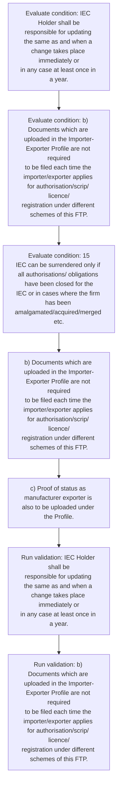

# Chapter 2 / Section 2.15: Profile of Importer / Exporter

**Chapter Title:** General Provisions Regarding Imports and Exports

**Pages:** 6, 7

**Purpose:** IEC Holder shall be
responsible for updating the same as and when a change takes place immediately or
in any case at least once in a year.

**Purpose Thanglish:** Indha Profile of Importer / Exporter section-la, IEC Holder kandippa be
responsible for updating the same as and when a change takes place immediately or
in any case at least once in a year.

**Summary:** 2.15 Profile of Importer / Exporter
a) ANF-1 contains the profile of the importer/exporter. IEC Holder shall be
responsible for updating the same as and when a change takes place immediately or
in any case at least once in a year. b) Documents which are uploaded in the Importer-Exporter Profile are not required
to be filed each time the importer/exporter applies for authorisation/scrip/ licence/
registration under different schemes of this FTP.

**Business Meaning:** Profile of Importer / Exporter governs how DGFT business controls should be applied, validated, and enforced.

**Business Explanation:** Profile of Importer / Exporter explains the operating rule set that DEKAI should enforce. Key control points include IEC Holder shall be
responsible for updating the same as and when a change takes place immediately or
in any case at least once in a year. The section also drives actions such as b) Documents which are uploaded in the Importer-Exporter Profile are not required
to be filed each time the importer/exporter applies for authorisation/scrip/ licence/
registration under different schemes of this FTP..

**Business Explanation Thanglish:** Indha Profile of Importer / Exporter section-la, Profile of Importer / Exporter explains the operating rule set that DEKAI should enforce. Key control points include IEC Holder kandippa be
responsible for updating the same as and when a change takes place immediately or
in any case at least once in a year. The section also drives actions such as b) documents which are uploaded in the Importer-Exporter Profile are not required
to be filed each time the importer/exporter applies for authorisation/scrip/ licence/
registration under different schemes of this FTP..

## Business Logic
- IEC Holder shall be
responsible for updating the same as and when a change takes place immediately or
in any case at least once in a year.

## Business Rules
- rule_id=CH2-SEC2_15-R001, rule_description=IEC Holder shall be
responsible for updating the same as and when a change takes place immediately or
in any case at least once in a year., trigger=Profile of Importer / Exporter, condition=IEC Holder shall be
responsible for updating the same as and when a change takes place immediately or
in any case at least once in a year., validation=IEC Holder shall be
responsible for updating the same as and when a change takes place immediately or
in any case at least once in a year., action=b) Documents which are uploaded in the Importer-Exporter Profile are not required
to be filed each time the importer/exporter applies for authorisation/scrip/ licence/
registration under different schemes of this FTP., exception=No explicit exception found in uploaded documents., output=DEKAI should produce a compliance decision for 2.15 - Profile of Importer / Exporter.

## Conditions
- IEC Holder shall be
responsible for updating the same as and when a change takes place immediately or
in any case at least once in a year.
- b) Documents which are uploaded in the Importer-Exporter Profile are not required
to be filed each time the importer/exporter applies for authorisation/scrip/ licence/
registration under different schemes of this FTP.
- 15
IEC can be surrendered only if all authorisations/ obligations have been closed for the
IEC or in cases where the firm has been amalgamated/acquired/merged etc.

## Condition Logic
- id=2.2.15.1, if=IEC Holder shall be
responsible for updating the same as and when a change takes place immediately or
in any case at least once in a year., then=b) Documents which are uploaded in the Importer-Exporter Profile are not required
to be filed each time the importer/exporter applies for authorisation/scrip/ licence/
registration under different schemes of this FTP., source=IEC Holder shall be
responsible for updating the same as and when a change takes place immediately or
in any case at least once in a year.
- id=2.2.15.2, if=b) Documents which are uploaded in the Importer-Exporter Profile are not required
to be filed each time the importer/exporter applies for authorisation/scrip/ licence/
registration under different schemes of this FTP., then=b) Documents which are uploaded in the Importer-Exporter Profile are not required
to be filed each time the importer/exporter applies for authorisation/scrip/ licence/
registration under different schemes of this FTP., source=b) Documents which are uploaded in the Importer-Exporter Profile are not required
to be filed each time the importer/exporter applies for authorisation/scrip/ licence/
registration under different schemes of this FTP.
- id=2.2.15.3, if=15
IEC can be surrendered only if all authorisations/ obligations have been closed for the
IEC or in cases where the firm has been amalgamated/acquired/merged etc., then=b) Documents which are uploaded in the Importer-Exporter Profile are not required
to be filed each time the importer/exporter applies for authorisation/scrip/ licence/
registration under different schemes of this FTP., source=15
IEC can be surrendered only if all authorisations/ obligations have been closed for the
IEC or in cases where the firm has been amalgamated/acquired/merged etc.

## Validations
- IEC Holder shall be
responsible for updating the same as and when a change takes place immediately or
in any case at least once in a year.
- b) Documents which are uploaded in the Importer-Exporter Profile are not required
to be filed each time the importer/exporter applies for authorisation/scrip/ licence/
registration under different schemes of this FTP.

## Exceptions
- None identified

## Dependencies
- None identified

## Authorities
- None identified

## Required Documents
- b) Documents which are uploaded in the Importer-Exporter Profile are not required
to be filed each time the importer/exporter applies for authorisation/scrip/ licence/
registration under different schemes of this FTP.
- c) Proof of status as manufacturer exporter is also to be uploaded under the Profile.

## Timelines
- IEC Holder shall be
responsible for updating the same as and when a change takes place immediately or
in any case at least once in a year.

## Actions
- b) Documents which are uploaded in the Importer-Exporter Profile are not required
to be filed each time the importer/exporter applies for authorisation/scrip/ licence/
registration under different schemes of this FTP.
- c) Proof of status as manufacturer exporter is also to be uploaded under the Profile.

## Workflow
- Evaluate condition: IEC Holder shall be
responsible for updating the same as and when a change takes place immediately or
in any case at least once in a year.
- Evaluate condition: b) Documents which are uploaded in the Importer-Exporter Profile are not required
to be filed each time the importer/exporter applies for authorisation/scrip/ licence/
registration under different schemes of this FTP.
- Evaluate condition: 15
IEC can be surrendered only if all authorisations/ obligations have been closed for the
IEC or in cases where the firm has been amalgamated/acquired/merged etc.
- b) Documents which are uploaded in the Importer-Exporter Profile are not required
to be filed each time the importer/exporter applies for authorisation/scrip/ licence/
registration under different schemes of this FTP.
- c) Proof of status as manufacturer exporter is also to be uploaded under the Profile.
- Run validation: IEC Holder shall be
responsible for updating the same as and when a change takes place immediately or
in any case at least once in a year.
- Run validation: b) Documents which are uploaded in the Importer-Exporter Profile are not required
to be filed each time the importer/exporter applies for authorisation/scrip/ licence/
registration under different schemes of this FTP.

## Workflow ASCII
```text
Profile of Importer / Exporter
Evaluate condition: IEC Holder shall be
responsible for updating the same as and when a change takes place immediately or
in any case at least once in a year.
   |
   v
Evaluate condition: b) Documents which are uploaded in the Importer-Exporter Profile are not required
to be filed each time the importer/exporter applies for authorisation/scrip/ licence/
registration under different schemes of this FTP.
   |
   v
Evaluate condition: 15
IEC can be surrendered only if all authorisations/ obligations have been closed for the
IEC or in cases where the firm has been amalgamated/acquired/merged etc.
   |
   v
b) Documents which are uploaded in the Importer-Exporter Profile are not required
to be filed each time the importer/exporter applies for authorisation/scrip/ licence/
registration under different schemes of this FTP.
   |
   v
c) Proof of status as manufacturer exporter is also to be uploaded under the Profile.
   |
   v
Run validation: IEC Holder shall be
responsible for updating the same as and when a change takes place immediately or
in any case at least once in a year.
   |
   v
Run validation: b) Documents which are uploaded in the Importer-Exporter Profile are not required
to be filed each time the importer/exporter applies for authorisation/scrip/ licence/
registration under different schemes of this FTP.
```

## Decision Tree
- IF IEC Holder shall be
responsible for updating the same as and when a change takes place immediately or
in any case at least once in a year. THEN b) Documents which are uploaded in the Importer-Exporter Profile are not required
to be filed each time the importer/exporter applies for authorisation/scrip/ licence/
registration under different schemes of this FTP.
- IF b) Documents which are uploaded in the Importer-Exporter Profile are not required
to be filed each time the importer/exporter applies for authorisation/scrip/ licence/
registration under different schemes of this FTP. THEN b) Documents which are uploaded in the Importer-Exporter Profile are not required
to be filed each time the importer/exporter applies for authorisation/scrip/ licence/
registration under different schemes of this FTP.
- IF 15
IEC can be surrendered only if all authorisations/ obligations have been closed for the
IEC or in cases where the firm has been amalgamated/acquired/merged etc. THEN b) Documents which are uploaded in the Importer-Exporter Profile are not required
to be filed each time the importer/exporter applies for authorisation/scrip/ licence/
registration under different schemes of this FTP.

## Decision Tree ASCII
```text
Profile of Importer / Exporter Decision
IF IEC Holder shall be
responsible for updating the same as and when a change takes place immediately or
in any case at least once in a year. THEN b) Documents which are uploaded in the Importer-Exporter Profile are not required
to be filed each time the importer/exporter applies for authorisation/scrip/ licence/
registration under different schemes of this FTP.
   |
   v
IF b) Documents which are uploaded in the Importer-Exporter Profile are not required
to be filed each time the importer/exporter applies for authorisation/scrip/ licence/
registration under different schemes of this FTP. THEN b) Documents which are uploaded in the Importer-Exporter Profile are not required
to be filed each time the importer/exporter applies for authorisation/scrip/ licence/
registration under different schemes of this FTP.
   |
   v
IF 15
IEC can be surrendered only if all authorisations/ obligations have been closed for the
IEC or in cases where the firm has been amalgamated/acquired/merged etc. THEN b) Documents which are uploaded in the Importer-Exporter Profile are not required
to be filed each time the importer/exporter applies for authorisation/scrip/ licence/
registration under different schemes of this FTP.
```

## Examples
- User asks to process Profile of Importer / Exporter; the platform checks conditions, validations, and documents before action.

**Real-world Example:** Example: an importer or exporter invokes Profile of Importer / Exporter, submits b) Documents which are uploaded in the Importer-Exporter Profile are not required
to be filed each time the importer/exporter applies for authorisation/scrip/ licence/
registration under different schemes of this FTP., c) Proof of status as manufacturer exporter is also to be uploaded under the Profile., and DEKAI uses the extracted rules to b) documents which are uploaded in the importer-exporter profile are not required
to be filed each time the importer/exporter applies for authorisation/scrip/ licence/
registration under different schemes of this ftp..

**Real-world Example Thanglish:** Indha Profile of Importer / Exporter section-la, Example: an importer or exporter invokes Profile of Importer / Exporter, submits b) documents which are uploaded in the Importer-Exporter Profile are not required
to be filed each time the importer/exporter applies for authorisation/scrip/ licence/
registration under different schemes of this FTP., c) Proof of status as manufacturer exporter is also to be uploaded under the Profile., and DEKAI uses the extracted rules to b) documents which are uploaded in the importer-exporter profile are not required
to be filed each time the importer/exporter applies for authorisation/scrip/ licence/
registration under different schemes of this ftp..

## AI Rules
- IF detected context matches section rule THEN enforce: IEC Holder shall be
responsible for updating the same as and when a change takes place immediately or
in any case at least once in a year.
- IF validations pass THEN recommend action: b) Documents which are uploaded in the Importer-Exporter Profile are not required
to be filed each time the importer/exporter applies for authorisation/scrip/ licence/
registration under different schemes of this FTP.

## Database Fields
- name=section_code, type=string, required=True, source=parsed_section_heading
- name=section_title, type=string, required=True, source=parsed_section_heading
- name=the_flag, type=boolean, required=False, source=keyword:the
- name=iec_flag, type=boolean, required=False, source=keyword:IEC
- name=for_flag, type=boolean, required=False, source=keyword:for
- name=and_flag, type=boolean, required=False, source=keyword:and
- name=any_flag, type=boolean, required=False, source=keyword:any
- name=are_flag, type=boolean, required=False, source=keyword:are
- name=not_flag, type=boolean, required=False, source=keyword:not
- name=ftp_flag, type=boolean, required=False, source=keyword:FTP
- name=document_1_submitted, type=boolean, required=True, source=b) Documents which are uploaded in the Importer-Exporter Profile are not required
to be filed each time the importer/exporter applies for authorisation/scrip/ licence/
registration under different schemes of this FTP.
- name=document_2_submitted, type=boolean, required=True, source=c) Proof of status as manufacturer exporter is also to be uploaded under the Profile.

## API Requirements
- method=GET, path=/api/dgft/sections/2.15, purpose=Retrieve knowledge payload for section 2.15, query_params=['include=workflow,decision_tree,validations'], response_fields=['section', 'title', 'summary', 'conditions', 'validations', 'exceptions', 'workflow', 'decision_tree']
- method=POST, path=/api/dgft/Profile-of-Importer-Exporter/validate, purpose=Validate inputs and documents for Profile of Importer / Exporter, request_fields=['section_code', 'section_title', 'document_1_submitted', 'document_2_submitted'], response_fields=['status', 'errors', 'warnings', 'next_actions']
- method=POST, path=/api/dgft/Profile-of-Importer-Exporter/execute, purpose=Trigger business action for b) Documents which are uploaded in the Importer-Exporter Profile are not required
to be filed each time the importer/exporter applies for authorisation/scrip/ licence/
registration under different schemes of this FTP., request_fields=['section_code', 'section_title', 'document_1_submitted', 'document_2_submitted'], response_fields=['reference_id', 'status', 'authority', 'timeline']

## UI Screens
- screen_id=Profile_of_Importer_Exporter_overview, name=Profile of Importer / Exporter Overview, purpose=Show section summary, authority, timeline, and eligibility cues., widgets=['summary_card', 'conditions_table', 'authority_badges', 'timeline_panel']
- screen_id=Profile_of_Importer_Exporter_submission, name=Profile of Importer / Exporter Submission, purpose=Capture applicant data and supporting documents., widgets=['dynamic_form', 'document_uploader', 'validation_panel', 'next_action_footer'], fields=['section_code', 'section_title', 'the_flag', 'iec_flag', 'for_flag', 'and_flag', 'any_flag', 'are_flag']

## Error Messages
- Validation failed because the section requirements were not fully met.

## FAQ
- question_en=What is the purpose of section 2.15?, answer_en=Profile of Importer / Exporter explains the operating rule set that DEKAI should enforce. Key control points include IEC Holder shall be
responsible for updating the same as and when a change takes place immediately or
in any case at least once in a year. The section also drives actions such as b) Documents which are uploaded in the Importer-Exporter Profile are not required
to be filed each time the importer/exporter applies for authorisation/scrip/ licence/
registration under different schemes of this FTP.., question_thanglish=Indha Profile of Importer / Exporter section-la, What is the purpose of section 2.15?, answer_thanglish=Indha Profile of Importer / Exporter section-la, Profile of Importer / Exporter explains the operating rule set that DEKAI should enforce. Key control points include IEC Holder kandippa be
responsible for updating the same as and when a change takes place immediately or
in any case at least once in a year. The section also drives actions such as b) documents which are uploaded in the Importer-Exporter Profile are not required
to be filed each time the importer/exporter applies for authorisation/scrip/ licence/
registration under different schemes of this FTP..
- question_en=What documents are required under Profile of Importer / Exporter?, answer_en=b) Documents which are uploaded in the Importer-Exporter Profile are not required
to be filed each time the importer/exporter applies for authorisation/scrip/ licence/
registration under different schemes of this FTP., c) Proof of status as manufacturer exporter is also to be uploaded under the Profile., question_thanglish=Indha Profile of Importer / Exporter section-la, What documents are required under Profile of Importer / Exporter?, answer_thanglish=Indha Profile of Importer / Exporter section-la, b) documents which are uploaded in the Importer-Exporter Profile are not required
to be filed each time the importer/exporter applies for authorisation/scrip/ licence/
registration under different schemes of this FTP., c) Proof of status as manufacturer exporter is also to be uploaded under the Profile.
- question_en=Which authority handles Profile of Importer / Exporter?, answer_en=Not explicitly covered in uploaded documents., question_thanglish=Indha Profile of Importer / Exporter section-la, Which authority handles Profile of Importer / Exporter?, answer_thanglish=Indha Profile of Importer / Exporter section-la, Not explicitly covered in uploaded documents.

## Questions Users May Ask
- What does Profile of Importer / Exporter require?
- Which documents are needed for Profile of Importer / Exporter?
- How does DEKAI validate Profile of Importer / Exporter requests?
- What action should be taken for Profile of Importer / Exporter?

## Expected AI Answers
- Profile of Importer / Exporter requires the platform to interpret the section text, apply the extracted business rules, and present the correct next action.
- Required documents are inferred from the section text: b) Documents which are uploaded in the Importer-Exporter Profile are not required
to be filed each time the importer/exporter applies for authorisation/scrip/ licence/
registration under different schemes of this FTP., c) Proof of status as manufacturer exporter is also to be uploaded under the Profile.
- DEKAI validates Profile of Importer / Exporter by checking conditions, required documents, authority references, and exception clauses before recommending an outcome.
- The primary extracted action is: b) Documents which are uploaded in the Importer-Exporter Profile are not required
to be filed each time the importer/exporter applies for authorisation/scrip/ licence/
registration under different schemes of this FTP.

## AI Q&A Examples
- question_en=User asks: How do I comply with Profile of Importer / Exporter?, answer_en=AI answers: DEKAI should evaluate section 2.15, apply the extracted rules, and guide the user through Evaluate condition: IEC Holder shall be
responsible for updating the same as and when a change takes place immediately or
in any case at least once in a year.., question_thanglish=Indha Profile of Importer / Exporter section-la, User asks: How do I comply with Profile of Importer / Exporter?, answer_thanglish=Indha Profile of Importer / Exporter section-la, AI answers: DEKAI should evaluate section 2.15, apply the extracted rules, and guide the user through Evaluate condition: IEC Holder kandippa be
responsible for updating the same as and when a change takes place immediately or
in any case at least once in a year..
- question_en=User asks: Which validations apply to Profile of Importer / Exporter?, answer_en=AI answers: Applicable validations are IEC Holder shall be
responsible for updating the same as and when a change takes place immediately or
in any case at least once in a year., b) Documents which are uploaded in the Importer-Exporter Profile are not required
to be filed each time the importer/exporter applies for authorisation/scrip/ licence/
registration under different schemes of this FTP., question_thanglish=Indha Profile of Importer / Exporter section-la, User asks: Which validations apply to Profile of Importer / Exporter?, answer_thanglish=Indha Profile of Importer / Exporter section-la, AI answers: Applicable validations are IEC Holder kandippa be
responsible for updating the same as and when a change takes place immediately or
in any case at least once in a year., b) documents which are uploaded in the Importer-Exporter Profile are not required
to be filed each time the importer/exporter applies for authorisation/scrip/ licence/
registration under different schemes of this FTP.

## DEKAI AI Implementation Notes
- Capture chapter 2, section 2.15, title, and page references as immutable knowledge metadata.
- Bind validations for Profile of Importer / Exporter into a rule engine keyed by the rule IDs extracted for this section.
- Expose document upload controls for: b) Documents which are uploaded in the Importer-Exporter Profile are not required
to be filed each time the importer/exporter applies for authorisation/scrip/ licence/
registration under different schemes of this FTP., c) Proof of status as manufacturer exporter is also to be uploaded under the Profile..

## DEKAI AI Implementation Notes Thanglish
- Indha Profile of Importer / Exporter section-la, Capture chapter 2, section 2.15, title, and page references as immutable knowledge metadata.
- Indha Profile of Importer / Exporter section-la, Bind validations for Profile of Importer / Exporter into a rule engine keyed by the rule IDs extracted for this section.
- Indha Profile of Importer / Exporter section-la, Expose document upload controls for: b) documents which are uploaded in the Importer-Exporter Profile are not required
to be filed each time the importer/exporter applies for authorisation/scrip/ licence/
registration under different schemes of this FTP., c) Proof of status as manufacturer exporter is also to be uploaded under the Profile..

## AI Metadata
- Keywords: the, IEC, for, and, any, are, not, FTP, can, all, has, etc, new, ANF-, same, when, case, once, year, each
- Search Keywords: the, IEC, for, and, any, are, not, FTP, can, all, has, etc, new, ANF-, same, when, case, once, year, each
- Intent: Support Profile of Importer / Exporter processing and compliance validation.
- Tags: 2.15, Profile of Importer / Exporter, business-rule, document-driven, dgft
- Related Sections: 
- Related Chapters: 
- Related Rules: IEC Holder shall be
responsible for updating the same as and when a change takes place immediately or
in any case at least once in a year.

## Mermaid


## PlantUML
```plantuml
@startuml
start
:Evaluate condition\: IEC Holder shall be
responsible for updating the same as and when a change takes place immediately or
in any case at least once in a year.;
:Evaluate condition\: b) Documents which are uploaded in the Importer-Exporter Profile are not required
to be filed each time the importer/exporter applies for authorisation/scrip/ licence/
registration under different schemes of this FTP.;
:Evaluate condition\: 15
IEC can be surrendered only if all authorisations/ obligations have been closed for the
IEC or in cases where the firm has been amalgamated/acquired/merged etc.;
:b) Documents which are uploaded in the Importer-Exporter Profile are not required
to be filed each time the importer/exporter applies for authorisation/scrip/ licence/
registration under different schemes of this FTP.;
:c) Proof of status as manufacturer exporter is also to be uploaded under the Profile.;
:Run validation\: IEC Holder shall be
responsible for updating the same as and when a change takes place immediately or
in any case at least once in a year.;
:Run validation\: b) Documents which are uploaded in the Importer-Exporter Profile are not required
to be filed each time the importer/exporter applies for authorisation/scrip/ licence/
registration under different schemes of this FTP.;
stop
@enduml
```
