# Chapter 2 / Section 2.16: Validity period of Authorisation/ Licence / Certificate /

**Chapter Title:** General Provisions Regarding Imports and Exports

**Pages:** 7

**Purpose:** 2.16 Validity period of Authorisation/ Licence / Certificate /
Authorisation / Permissions
Validity period of Import / Export Authorisations from the date of issue shall be as
follows, unless specified otherwise:
Sr.

**Purpose Thanglish:** Indha Validity period of Authorisation/ Licence / Certificate / section-la, 2.16 Validity period of Authorisation/ licence / Certificate /
Authorisation / Permissions
Validity period of import / export Authorisations from the date of issue kandippa be as
follows, unless specified otherwise:
Sr.

**Summary:** 2.16 Validity period of Authorisation/ Licence / Certificate /
Authorisation / Permissions
Validity period of Import / Export Authorisations from the date of issue shall be as
follows, unless specified otherwise:
Sr. Type of Authorisation Validity Period
No
(i) Export Authorisation for restricted 24 months
(Non-SCOMET) goods
(ii) Export Authorisation for SCOMET items 24 months
(iii) Import Authorisations for Restricted 18 months
items
(iv) EPCG Authorisation 24 months
(v) Advance Authorisations (AA) for Co-terminus with contracted
Deemed Exports duration of project execution or 12
months, whichever is more. (vi) AA {except (v) above}, DFIA, 12 months from issue date.

**Business Meaning:** Validity period of Authorisation/ Licence / Certificate / governs how DGFT business controls should be applied, validated, and enforced.

**Business Explanation:** Validity period of Authorisation/ Licence / Certificate / explains the operating rule set that DEKAI should enforce. Key control points include 2.16 Validity period of Authorisation/ Licence / Certificate /
Authorisation / Permissions
Validity period of Import / Export Authorisations from the date of issue shall be as
follows, unless specified otherwise:
Sr. The section also drives actions such as 2.16 Validity period of Authorisation/ Licence / Certificate /
Authorisation / Permissions
Validity period of Import / Export Authorisations from the date of issue shall be as
follows, unless specified otherwise:
Sr..

**Business Explanation Thanglish:** Indha Validity period of Authorisation/ Licence / Certificate / section-la, Validity period of Authorisation/ licence / Certificate / explains the operating rule set that DEKAI should enforce. Key control points include 2.16 Validity period of Authorisation/ licence / Certificate /
Authorisation / Permissions
Validity period of import / export Authorisations from the date of issue kandippa be as
follows, unless specified otherwise:
Sr. The section also drives actions such as 2.16 Validity period of Authorisation/ licence / Certificate /
Authorisation / Permissions
Validity period of import / export Authorisations from the date of issue kandippa be as
follows, unless specified otherwise:
Sr..

## Business Logic
- 2.16 Validity period of Authorisation/ Licence / Certificate /
Authorisation / Permissions
Validity period of Import / Export Authorisations from the date of issue shall be as
follows, unless specified otherwise:
Sr.
- ISSUANCE OF AUTHORISATION
2.16 Validity period of Authorisation/ Licence / Certificate /
Authorisation / Permissions
Validity period of Import / Export Authorisations from the date of issue shall be as
follows, unless specified otherwise:
Sr.

## Business Rules
- rule_id=CH2-SEC2_16-R001, rule_description=2.16 Validity period of Authorisation/ Licence / Certificate /
Authorisation / Permissions
Validity period of Import / Export Authorisations from the date of issue shall be as
follows, unless specified otherwise:
Sr., trigger=Validity period of Authorisation/ Licence / Certificate /, condition=2.16 Validity period of Authorisation/ Licence / Certificate /
Authorisation / Permissions
Validity period of Import / Export Authorisations from the date of issue shall be as
follows, unless specified otherwise:
Sr., validation=2.16 Validity period of Authorisation/ Licence / Certificate /
Authorisation / Permissions
Validity period of Import / Export Authorisations from the date of issue shall be as
follows, unless specified otherwise:
Sr., action=2.16 Validity period of Authorisation/ Licence / Certificate /
Authorisation / Permissions
Validity period of Import / Export Authorisations from the date of issue shall be as
follows, unless specified otherwise:
Sr., exception=2.16 Validity period of Authorisation/ Licence / Certificate /
Authorisation / Permissions
Validity period of Import / Export Authorisations from the date of issue shall be as
follows, unless specified otherwise:
Sr., output=DEKAI should produce a compliance decision for 2.16 - Validity period of Authorisation/ Licence / Certificate /.
- rule_id=CH2-SEC2_16-R002, rule_description=ISSUANCE OF AUTHORISATION
2.16 Validity period of Authorisation/ Licence / Certificate /
Authorisation / Permissions
Validity period of Import / Export Authorisations from the date of issue shall be as
follows, unless specified otherwise:
Sr., trigger=Validity period of Authorisation/ Licence / Certificate /, condition=(vii) Registration certificate for import/ Original shipment period as
export as per para 1.05 of FTP mentioned in the ICLC or as
(Transitional Arrangement)
stipulated by DGFT., validation=ISSUANCE OF AUTHORISATION
2.16 Validity period of Authorisation/ Licence / Certificate /
Authorisation / Permissions
Validity period of Import / Export Authorisations from the date of issue shall be as
follows, unless specified otherwise:
Sr., action=(vi) AA {except (v) above}, DFIA, 12 months from issue date., exception=(vi) AA {except (v) above}, DFIA, 12 months from issue date., output=DEKAI should produce a compliance decision for 2.16 - Validity period of Authorisation/ Licence / Certificate /.

## Conditions
- 2.16 Validity period of Authorisation/ Licence / Certificate /
Authorisation / Permissions
Validity period of Import / Export Authorisations from the date of issue shall be as
follows, unless specified otherwise:
Sr.
- (vii) Registration certificate for import/ Original shipment period as
export as per para 1.05 of FTP mentioned in the ICLC or as
(Transitional Arrangement)
stipulated by DGFT.
- However, EXIM Facilitation Committee (EFC) and Inter Ministerial Working Group
(IMWG) (for SCOMET items) may approve the grant of Export/ Import Authorisation
for a shorter / longer duration in specific cases to meet contractual
obligations/delivery schedule or on specific recommendation of the concerned
Technical / Administrative Ministry / Department / or any other agency.
- b) DGFT may decide to issue specific authorisation/ class of authorisations for a
longer/shorter validity period.
- ISSUANCE OF AUTHORISATION
2.16 Validity period of Authorisation/ Licence / Certificate /
Authorisation / Permissions
Validity period of Import / Export Authorisations from the date of issue shall be as
follows, unless specified otherwise:
Sr.
- (vii) Registration certificate for import/
Original shipment period as
export as per para 1.05 of FTP
mentioned in the ICLC or as
(Transitional Arrangement)
stipulated by DGFT.

## Condition Logic
- id=2.2.16.1, if=2.16 Validity period of Authorisation/ Licence / Certificate /
Authorisation / Permissions
Validity period of Import / Export Authorisations from the date of issue shall be as
follows, unless specified otherwise:
Sr., then=2.16 Validity period of Authorisation/ Licence / Certificate /
Authorisation / Permissions
Validity period of Import / Export Authorisations from the date of issue shall be as
follows, unless specified otherwise:
Sr., source=2.16 Validity period of Authorisation/ Licence / Certificate /
Authorisation / Permissions
Validity period of Import / Export Authorisations from the date of issue shall be as
follows, unless specified otherwise:
Sr.
- id=2.2.16.2, if=(vii) Registration certificate for import/ Original shipment period as
export as per para 1.05 of FTP mentioned in the ICLC or as
(Transitional Arrangement)
stipulated by DGFT., then=2.16 Validity period of Authorisation/ Licence / Certificate /
Authorisation / Permissions
Validity period of Import / Export Authorisations from the date of issue shall be as
follows, unless specified otherwise:
Sr., source=(vii) Registration certificate for import/ Original shipment period as
export as per para 1.05 of FTP mentioned in the ICLC or as
(Transitional Arrangement)
stipulated by DGFT.
- id=2.2.16.3, if=However, EXIM Facilitation Committee (EFC) and Inter Ministerial Working Group
(IMWG) (for SCOMET items) may approve the grant of Export/ Import Authorisation
for a shorter / longer duration in specific cases to meet contractual
obligations/delivery schedule or on specific recommendation of the concerned
Technical / Administrative Ministry / Department / or any other agency., then=2.16 Validity period of Authorisation/ Licence / Certificate /
Authorisation / Permissions
Validity period of Import / Export Authorisations from the date of issue shall be as
follows, unless specified otherwise:
Sr., source=However, EXIM Facilitation Committee (EFC) and Inter Ministerial Working Group
(IMWG) (for SCOMET items) may approve the grant of Export/ Import Authorisation
for a shorter / longer duration in specific cases to meet contractual
obligations/delivery schedule or on specific recommendation of the concerned
Technical / Administrative Ministry / Department / or any other agency.
- id=2.2.16.4, if=b) DGFT may decide to issue specific authorisation/ class of authorisations for a
longer/shorter validity period., then=2.16 Validity period of Authorisation/ Licence / Certificate /
Authorisation / Permissions
Validity period of Import / Export Authorisations from the date of issue shall be as
follows, unless specified otherwise:
Sr., source=b) DGFT may decide to issue specific authorisation/ class of authorisations for a
longer/shorter validity period.
- id=2.2.16.5, if=ISSUANCE OF AUTHORISATION
2.16 Validity period of Authorisation/ Licence / Certificate /
Authorisation / Permissions
Validity period of Import / Export Authorisations from the date of issue shall be as
follows, unless specified otherwise:
Sr., then=2.16 Validity period of Authorisation/ Licence / Certificate /
Authorisation / Permissions
Validity period of Import / Export Authorisations from the date of issue shall be as
follows, unless specified otherwise:
Sr., source=ISSUANCE OF AUTHORISATION
2.16 Validity period of Authorisation/ Licence / Certificate /
Authorisation / Permissions
Validity period of Import / Export Authorisations from the date of issue shall be as
follows, unless specified otherwise:
Sr.
- id=2.2.16.6, if=(vii) Registration certificate for import/
Original shipment period as
export as per para 1.05 of FTP
mentioned in the ICLC or as
(Transitional Arrangement)
stipulated by DGFT., then=2.16 Validity period of Authorisation/ Licence / Certificate /
Authorisation / Permissions
Validity period of Import / Export Authorisations from the date of issue shall be as
follows, unless specified otherwise:
Sr., source=(vii) Registration certificate for import/
Original shipment period as
export as per para 1.05 of FTP
mentioned in the ICLC or as
(Transitional Arrangement)
stipulated by DGFT.

## Validations
- 2.16 Validity period of Authorisation/ Licence / Certificate /
Authorisation / Permissions
Validity period of Import / Export Authorisations from the date of issue shall be as
follows, unless specified otherwise:
Sr.
- ISSUANCE OF AUTHORISATION
2.16 Validity period of Authorisation/ Licence / Certificate /
Authorisation / Permissions
Validity period of Import / Export Authorisations from the date of issue shall be as
follows, unless specified otherwise:
Sr.

## Exceptions
- 2.16 Validity period of Authorisation/ Licence / Certificate /
Authorisation / Permissions
Validity period of Import / Export Authorisations from the date of issue shall be as
follows, unless specified otherwise:
Sr.
- (vi) AA {except (v) above}, DFIA, 12 months from issue date.
- However, EXIM Facilitation Committee (EFC) and Inter Ministerial Working Group
(IMWG) (for SCOMET items) may approve the grant of Export/ Import Authorisation
for a shorter / longer duration in specific cases to meet contractual
obligations/delivery schedule or on specific recommendation of the concerned
Technical / Administrative Ministry / Department / or any other agency.
- ISSUANCE OF AUTHORISATION
2.16 Validity period of Authorisation/ Licence / Certificate /
Authorisation / Permissions
Validity period of Import / Export Authorisations from the date of issue shall be as
follows, unless specified otherwise:
Sr.
- (vi)
AA {except (v) above}, DFIA,
12 months from issue date.

## Dependencies
- 4
- 1.05
- 1

## Authorities
- DGFT
- Inter Ministerial Working Group
- EXIM Facilitation Committee
- Technical / Administrative Ministry

## Required Documents
- Validity period of Authorisation/ Licence / Certificate
- (vii) Registration certificate for import/ Original shipment period as
export as per para 1.05 of FTP mentioned in the ICLC or as
(Transitional Arrangement)
stipulated by DGFT.
- (vii) Registration certificate for import/
Original shipment period as
export as per para 1.05 of FTP
mentioned in the ICLC or as
(Transitional Arrangement)
stipulated by DGFT.

## Timelines
- Type of Authorisation Validity Period
No
(i) Export Authorisation for restricted 24 months
(Non-SCOMET) goods
(ii) Export Authorisation for SCOMET items 24 months
(iii) Import Authorisations for Restricted 18 months
items
(iv) EPCG Authorisation 24 months
(v) Advance Authorisations (AA) for Co-terminus with contracted
Deemed Exports duration of project execution or 12
months, whichever is more.
- (vi) AA {except (v) above}, DFIA, 12 months from issue date.
- 16
(ii) Export Authorisation for SCOMET items 24 months
(iii) Import Authorisations for Restricted 18 months
items
(iv) EPCG Authorisation 24 months
(v) Advance Authorisations (AA) for Co-terminus with contracted
Deemed Exports duration of project execution or 12
months, whichever is more.
- Type of Authorisation
Validity Period
No
(i)
Export Authorisation for restricted
24 months
(Non-SCOMET) goods
(ii)
Export Authorisation for SCOMET items 24 months
(iii)
Import Authorisations for Restricted
18 months
items
(iv)
EPCG Authorisation
24 months
(v)
Advance Authorisations (AA) for
Co-terminus
with
contracted
Deemed Exports
duration of project execution or 12
months, whichever is more.
- (vi)
AA {except (v) above}, DFIA,
12 months from issue date.

## Actions
- 2.16 Validity period of Authorisation/ Licence / Certificate /
Authorisation / Permissions
Validity period of Import / Export Authorisations from the date of issue shall be as
follows, unless specified otherwise:
Sr.
- (vi) AA {except (v) above}, DFIA, 12 months from issue date.
- However, EXIM Facilitation Committee (EFC) and Inter Ministerial Working Group
(IMWG) (for SCOMET items) may approve the grant of Export/ Import Authorisation
for a shorter / longer duration in specific cases to meet contractual
obligations/delivery schedule or on specific recommendation of the concerned
Technical / Administrative Ministry / Department / or any other agency.
- b) DGFT may decide to issue specific authorisation/ class of authorisations for a
longer/shorter validity period.
- ISSUANCE OF AUTHORISATION
2.16 Validity period of Authorisation/ Licence / Certificate /
Authorisation / Permissions
Validity period of Import / Export Authorisations from the date of issue shall be as
follows, unless specified otherwise:
Sr.
- (vi)
AA {except (v) above}, DFIA,
12 months from issue date.

## Workflow
- Evaluate condition: 2.16 Validity period of Authorisation/ Licence / Certificate /
Authorisation / Permissions
Validity period of Import / Export Authorisations from the date of issue shall be as
follows, unless specified otherwise:
Sr.
- Evaluate condition: (vii) Registration certificate for import/ Original shipment period as
export as per para 1.05 of FTP mentioned in the ICLC or as
(Transitional Arrangement)
stipulated by DGFT.
- Evaluate condition: However, EXIM Facilitation Committee (EFC) and Inter Ministerial Working Group
(IMWG) (for SCOMET items) may approve the grant of Export/ Import Authorisation
for a shorter / longer duration in specific cases to meet contractual
obligations/delivery schedule or on specific recommendation of the concerned
Technical / Administrative Ministry / Department / or any other agency.
- 2.16 Validity period of Authorisation/ Licence / Certificate /
Authorisation / Permissions
Validity period of Import / Export Authorisations from the date of issue shall be as
follows, unless specified otherwise:
Sr.
- (vi) AA {except (v) above}, DFIA, 12 months from issue date.
- However, EXIM Facilitation Committee (EFC) and Inter Ministerial Working Group
(IMWG) (for SCOMET items) may approve the grant of Export/ Import Authorisation
for a shorter / longer duration in specific cases to meet contractual
obligations/delivery schedule or on specific recommendation of the concerned
Technical / Administrative Ministry / Department / or any other agency.
- b) DGFT may decide to issue specific authorisation/ class of authorisations for a
longer/shorter validity period.
- ISSUANCE OF AUTHORISATION
2.16 Validity period of Authorisation/ Licence / Certificate /
Authorisation / Permissions
Validity period of Import / Export Authorisations from the date of issue shall be as
follows, unless specified otherwise:
Sr.
- (vi)
AA {except (v) above}, DFIA,
12 months from issue date.
- Run validation: 2.16 Validity period of Authorisation/ Licence / Certificate /
Authorisation / Permissions
Validity period of Import / Export Authorisations from the date of issue shall be as
follows, unless specified otherwise:
Sr.
- Run validation: ISSUANCE OF AUTHORISATION
2.16 Validity period of Authorisation/ Licence / Certificate /
Authorisation / Permissions
Validity period of Import / Export Authorisations from the date of issue shall be as
follows, unless specified otherwise:
Sr.
- Handle exception: 2.16 Validity period of Authorisation/ Licence / Certificate /
Authorisation / Permissions
Validity period of Import / Export Authorisations from the date of issue shall be as
follows, unless specified otherwise:
Sr.

## Workflow ASCII
```text
Validity period of Authorisation/ Licence / Certificate /
Evaluate condition: 2.16 Validity period of Authorisation/ Licence / Certificate /
Authorisation / Permissions
Validity period of Import / Export Authorisations from the date of issue shall be as
follows, unless specified otherwise:
Sr.
   |
   v
Evaluate condition: (vii) Registration certificate for import/ Original shipment period as
export as per para 1.05 of FTP mentioned in the ICLC or as
(Transitional Arrangement)
stipulated by DGFT.
   |
   v
Evaluate condition: However, EXIM Facilitation Committee (EFC) and Inter Ministerial Working Group
(IMWG) (for SCOMET items) may approve the grant of Export/ Import Authorisation
for a shorter / longer duration in specific cases to meet contractual
obligations/delivery schedule or on specific recommendation of the concerned
Technical / Administrative Ministry / Department / or any other agency.
   |
   v
2.16 Validity period of Authorisation/ Licence / Certificate /
Authorisation / Permissions
Validity period of Import / Export Authorisations from the date of issue shall be as
follows, unless specified otherwise:
Sr.
   |
   v
(vi) AA {except (v) above}, DFIA, 12 months from issue date.
   |
   v
However, EXIM Facilitation Committee (EFC) and Inter Ministerial Working Group
(IMWG) (for SCOMET items) may approve the grant of Export/ Import Authorisation
for a shorter / longer duration in specific cases to meet contractual
obligations/delivery schedule or on specific recommendation of the concerned
Technical / Administrative Ministry / Department / or any other agency.
   |
   v
b) DGFT may decide to issue specific authorisation/ class of authorisations for a
longer/shorter validity period.
   |
   v
ISSUANCE OF AUTHORISATION
2.16 Validity period of Authorisation/ Licence / Certificate /
Authorisation / Permissions
Validity period of Import / Export Authorisations from the date of issue shall be as
follows, unless specified otherwise:
Sr.
   |
   v
(vi)
AA {except (v) above}, DFIA,
12 months from issue date.
   |
   v
Run validation: 2.16 Validity period of Authorisation/ Licence / Certificate /
Authorisation / Permissions
Validity period of Import / Export Authorisations from the date of issue shall be as
follows, unless specified otherwise:
Sr.
   |
   v
Run validation: ISSUANCE OF AUTHORISATION
2.16 Validity period of Authorisation/ Licence / Certificate /
Authorisation / Permissions
Validity period of Import / Export Authorisations from the date of issue shall be as
follows, unless specified otherwise:
Sr.
   |
   v
Handle exception: 2.16 Validity period of Authorisation/ Licence / Certificate /
Authorisation / Permissions
Validity period of Import / Export Authorisations from the date of issue shall be as
follows, unless specified otherwise:
Sr.
```

## Decision Tree
- IF 2.16 Validity period of Authorisation/ Licence / Certificate /
Authorisation / Permissions
Validity period of Import / Export Authorisations from the date of issue shall be as
follows, unless specified otherwise:
Sr. THEN 2.16 Validity period of Authorisation/ Licence / Certificate /
Authorisation / Permissions
Validity period of Import / Export Authorisations from the date of issue shall be as
follows, unless specified otherwise:
Sr.
- IF (vii) Registration certificate for import/ Original shipment period as
export as per para 1.05 of FTP mentioned in the ICLC or as
(Transitional Arrangement)
stipulated by DGFT. THEN 2.16 Validity period of Authorisation/ Licence / Certificate /
Authorisation / Permissions
Validity period of Import / Export Authorisations from the date of issue shall be as
follows, unless specified otherwise:
Sr.
- IF However, EXIM Facilitation Committee (EFC) and Inter Ministerial Working Group
(IMWG) (for SCOMET items) may approve the grant of Export/ Import Authorisation
for a shorter / longer duration in specific cases to meet contractual
obligations/delivery schedule or on specific recommendation of the concerned
Technical / Administrative Ministry / Department / or any other agency. THEN 2.16 Validity period of Authorisation/ Licence / Certificate /
Authorisation / Permissions
Validity period of Import / Export Authorisations from the date of issue shall be as
follows, unless specified otherwise:
Sr.
- IF b) DGFT may decide to issue specific authorisation/ class of authorisations for a
longer/shorter validity period. THEN 2.16 Validity period of Authorisation/ Licence / Certificate /
Authorisation / Permissions
Validity period of Import / Export Authorisations from the date of issue shall be as
follows, unless specified otherwise:
Sr.
- IF ISSUANCE OF AUTHORISATION
2.16 Validity period of Authorisation/ Licence / Certificate /
Authorisation / Permissions
Validity period of Import / Export Authorisations from the date of issue shall be as
follows, unless specified otherwise:
Sr. THEN 2.16 Validity period of Authorisation/ Licence / Certificate /
Authorisation / Permissions
Validity period of Import / Export Authorisations from the date of issue shall be as
follows, unless specified otherwise:
Sr.
- IF exception applies (2.16 Validity period of Authorisation/ Licence / Certificate /
Authorisation / Permissions
Validity period of Import / Export Authorisations from the date of issue shall be as
follows, unless specified otherwise:
Sr.) THEN route to manual review
- IF exception applies ((vi) AA {except (v) above}, DFIA, 12 months from issue date.) THEN route to manual review
- IF exception applies (However, EXIM Facilitation Committee (EFC) and Inter Ministerial Working Group
(IMWG) (for SCOMET items) may approve the grant of Export/ Import Authorisation
for a shorter / longer duration in specific cases to meet contractual
obligations/delivery schedule or on specific recommendation of the concerned
Technical / Administrative Ministry / Department / or any other agency.) THEN route to manual review

## Decision Tree ASCII
```text
Validity period of Authorisation/ Licence / Certificate / Decision
IF 2.16 Validity period of Authorisation/ Licence / Certificate /
Authorisation / Permissions
Validity period of Import / Export Authorisations from the date of issue shall be as
follows, unless specified otherwise:
Sr. THEN 2.16 Validity period of Authorisation/ Licence / Certificate /
Authorisation / Permissions
Validity period of Import / Export Authorisations from the date of issue shall be as
follows, unless specified otherwise:
Sr.
   |
   v
IF (vii) Registration certificate for import/ Original shipment period as
export as per para 1.05 of FTP mentioned in the ICLC or as
(Transitional Arrangement)
stipulated by DGFT. THEN 2.16 Validity period of Authorisation/ Licence / Certificate /
Authorisation / Permissions
Validity period of Import / Export Authorisations from the date of issue shall be as
follows, unless specified otherwise:
Sr.
   |
   v
IF However, EXIM Facilitation Committee (EFC) and Inter Ministerial Working Group
(IMWG) (for SCOMET items) may approve the grant of Export/ Import Authorisation
for a shorter / longer duration in specific cases to meet contractual
obligations/delivery schedule or on specific recommendation of the concerned
Technical / Administrative Ministry / Department / or any other agency. THEN 2.16 Validity period of Authorisation/ Licence / Certificate /
Authorisation / Permissions
Validity period of Import / Export Authorisations from the date of issue shall be as
follows, unless specified otherwise:
Sr.
   |
   v
IF b) DGFT may decide to issue specific authorisation/ class of authorisations for a
longer/shorter validity period. THEN 2.16 Validity period of Authorisation/ Licence / Certificate /
Authorisation / Permissions
Validity period of Import / Export Authorisations from the date of issue shall be as
follows, unless specified otherwise:
Sr.
   |
   v
IF ISSUANCE OF AUTHORISATION
2.16 Validity period of Authorisation/ Licence / Certificate /
Authorisation / Permissions
Validity period of Import / Export Authorisations from the date of issue shall be as
follows, unless specified otherwise:
Sr. THEN 2.16 Validity period of Authorisation/ Licence / Certificate /
Authorisation / Permissions
Validity period of Import / Export Authorisations from the date of issue shall be as
follows, unless specified otherwise:
Sr.
   |
   v
IF exception applies (2.16 Validity period of Authorisation/ Licence / Certificate /
Authorisation / Permissions
Validity period of Import / Export Authorisations from the date of issue shall be as
follows, unless specified otherwise:
Sr.) THEN route to manual review
   |
   v
IF exception applies ((vi) AA {except (v) above}, DFIA, 12 months from issue date.) THEN route to manual review
   |
   v
IF exception applies (However, EXIM Facilitation Committee (EFC) and Inter Ministerial Working Group
(IMWG) (for SCOMET items) may approve the grant of Export/ Import Authorisation
for a shorter / longer duration in specific cases to meet contractual
obligations/delivery schedule or on specific recommendation of the concerned
Technical / Administrative Ministry / Department / or any other agency.) THEN route to manual review
```

## Examples
- User asks to process Validity period of Authorisation/ Licence / Certificate /; the platform checks conditions, validations, and documents before action.

**Real-world Example:** Example: an importer or exporter invokes Validity period of Authorisation/ Licence / Certificate /, submits Validity period of Authorisation/ Licence / Certificate, (vii) Registration certificate for import/ Original shipment period as
export as per para 1.05 of FTP mentioned in the ICLC or as
(Transitional Arrangement)
stipulated by DGFT., (vii) Registration certificate for import/
Original shipment period as
export as per para 1.05 of FTP
mentioned in the ICLC or as
(Transitional Arrangement)
stipulated by DGFT., and DEKAI uses the extracted rules to 2.16 validity period of authorisation/ licence / certificate /
authorisation / permissions
validity period of import / export authorisations from the date of issue shall be as
follows, unless specified otherwise:
sr..

**Real-world Example Thanglish:** Indha Validity period of Authorisation/ Licence / Certificate / section-la, Example: an importer or exporter invokes Validity period of Authorisation/ licence / Certificate /, submits Validity period of Authorisation/ licence / Certificate, (vii) Registration certificate for import/ Original shipment period as
export as per para 1.05 of FTP mentioned in the ICLC or as
(Transitional Arrangement)
stipulated by DGFT., (vii) Registration certificate for import/
Original shipment period as
export as per para 1.05 of FTP
mentioned in the ICLC or as
(Transitional Arrangement)
stipulated by DGFT., and DEKAI uses the extracted rules to 2.16 validity period of authorisation/ licence / certificate /
authorisation / permissions
validity period of import / export authorisations from the date of issue kandippa be as
follows, unless specified otherwise:
sr..

## AI Rules
- IF detected context matches section rule THEN enforce: 2.16 Validity period of Authorisation/ Licence / Certificate /
Authorisation / Permissions
Validity period of Import / Export Authorisations from the date of issue shall be as
follows, unless specified otherwise:
Sr.
- IF detected context matches section rule THEN enforce: ISSUANCE OF AUTHORISATION
2.16 Validity period of Authorisation/ Licence / Certificate /
Authorisation / Permissions
Validity period of Import / Export Authorisations from the date of issue shall be as
follows, unless specified otherwise:
Sr.
- IF validations pass THEN recommend action: 2.16 Validity period of Authorisation/ Licence / Certificate /
Authorisation / Permissions
Validity period of Import / Export Authorisations from the date of issue shall be as
follows, unless specified otherwise:
Sr.

## Database Fields
- name=section_code, type=string, required=True, source=parsed_section_heading
- name=section_title, type=string, required=True, source=parsed_section_heading
- name=the_flag, type=boolean, required=False, source=keyword:the
- name=for_flag, type=boolean, required=False, source=keyword:for
- name=iii_flag, type=boolean, required=False, source=keyword:iii
- name=per_flag, type=boolean, required=False, source=keyword:per
- name=ftp_flag, type=boolean, required=False, source=keyword:FTP
- name=vii_flag, type=boolean, required=False, source=keyword:vii
- name=efc_flag, type=boolean, required=False, source=keyword:EFC
- name=and_flag, type=boolean, required=False, source=keyword:and
- name=document_1_submitted, type=boolean, required=True, source=Validity period of Authorisation/ Licence / Certificate
- name=document_2_submitted, type=boolean, required=True, source=(vii) Registration certificate for import/ Original shipment period as
export as per para 1.05 of FTP mentioned in the ICLC or as
(Transitional Arrangement)
stipulated by DGFT.
- name=document_3_submitted, type=boolean, required=True, source=(vii) Registration certificate for import/
Original shipment period as
export as per para 1.05 of FTP
mentioned in the ICLC or as
(Transitional Arrangement)
stipulated by DGFT.

## API Requirements
- method=GET, path=/api/dgft/sections/2.16, purpose=Retrieve knowledge payload for section 2.16, query_params=['include=workflow,decision_tree,validations'], response_fields=['section', 'title', 'summary', 'conditions', 'validations', 'exceptions', 'workflow', 'decision_tree']
- method=POST, path=/api/dgft/Validity-period-of-Authorisation-Licence-Certificate/validate, purpose=Validate inputs and documents for Validity period of Authorisation/ Licence / Certificate /, request_fields=['section_code', 'section_title', 'document_1_submitted', 'document_2_submitted', 'document_3_submitted'], response_fields=['status', 'errors', 'warnings', 'next_actions']
- method=POST, path=/api/dgft/Validity-period-of-Authorisation-Licence-Certificate/execute, purpose=Trigger business action for 2.16 Validity period of Authorisation/ Licence / Certificate /
Authorisation / Permissions
Validity period of Import / Export Authorisations from the date of issue shall be as
follows, unless specified otherwise:
Sr., request_fields=['section_code', 'section_title', 'document_1_submitted', 'document_2_submitted', 'document_3_submitted'], response_fields=['reference_id', 'status', 'authority', 'timeline']

## UI Screens
- screen_id=Validity_period_of_Authorisation_Licence_Certificate_overview, name=Validity period of Authorisation/ Licence / Certificate / Overview, purpose=Show section summary, authority, timeline, and eligibility cues., widgets=['summary_card', 'conditions_table', 'authority_badges', 'timeline_panel']
- screen_id=Validity_period_of_Authorisation_Licence_Certificate_submission, name=Validity period of Authorisation/ Licence / Certificate / Submission, purpose=Capture applicant data and supporting documents., widgets=['dynamic_form', 'document_uploader', 'validation_panel', 'next_action_footer'], fields=['section_code', 'section_title', 'the_flag', 'for_flag', 'iii_flag', 'per_flag', 'ftp_flag', 'vii_flag']
- screen_id=Validity_period_of_Authorisation_Licence_Certificate_exceptions, name=Validity period of Authorisation/ Licence / Certificate / Exception Review, purpose=Explain exception handling and manual review triggers., widgets=['exception_banner', 'decision_tree', 'case_notes']

## Error Messages
- Validation failed because the section requirements were not fully met.

## FAQ
- question_en=What is the purpose of section 2.16?, answer_en=Validity period of Authorisation/ Licence / Certificate / explains the operating rule set that DEKAI should enforce. Key control points include 2.16 Validity period of Authorisation/ Licence / Certificate /
Authorisation / Permissions
Validity period of Import / Export Authorisations from the date of issue shall be as
follows, unless specified otherwise:
Sr. The section also drives actions such as 2.16 Validity period of Authorisation/ Licence / Certificate /
Authorisation / Permissions
Validity period of Import / Export Authorisations from the date of issue shall be as
follows, unless specified otherwise:
Sr.., question_thanglish=Indha Validity period of Authorisation/ Licence / Certificate / section-la, What is the purpose of section 2.16?, answer_thanglish=Indha Validity period of Authorisation/ Licence / Certificate / section-la, Validity period of Authorisation/ licence / Certificate / explains the operating rule set that DEKAI should enforce. Key control points include 2.16 Validity period of Authorisation/ licence / Certificate /
Authorisation / Permissions
Validity period of import / export Authorisations from the date of issue kandippa be as
follows, unless specified otherwise:
Sr. The section also drives actions such as 2.16 Validity period of Authorisation/ licence / Certificate /
Authorisation / Permissions
Validity period of import / export Authorisations from the date of issue kandippa be as
follows, unless specified otherwise:
Sr..
- question_en=What documents are required under Validity period of Authorisation/ Licence / Certificate /?, answer_en=Validity period of Authorisation/ Licence / Certificate, (vii) Registration certificate for import/ Original shipment period as
export as per para 1.05 of FTP mentioned in the ICLC or as
(Transitional Arrangement)
stipulated by DGFT., (vii) Registration certificate for import/
Original shipment period as
export as per para 1.05 of FTP
mentioned in the ICLC or as
(Transitional Arrangement)
stipulated by DGFT., question_thanglish=Indha Validity period of Authorisation/ Licence / Certificate / section-la, What documents are required under Validity period of Authorisation/ licence / Certificate /?, answer_thanglish=Indha Validity period of Authorisation/ Licence / Certificate / section-la, Validity period of Authorisation/ licence / Certificate, (vii) Registration certificate for import/ Original shipment period as
export as per para 1.05 of FTP mentioned in the ICLC or as
(Transitional Arrangement)
stipulated by DGFT., (vii) Registration certificate for import/
Original shipment period as
export as per para 1.05 of FTP
mentioned in the ICLC or as
(Transitional Arrangement)
stipulated by DGFT.
- question_en=Which authority handles Validity period of Authorisation/ Licence / Certificate /?, answer_en=DGFT, Inter Ministerial Working Group, EXIM Facilitation Committee, Technical / Administrative Ministry, question_thanglish=Indha Validity period of Authorisation/ Licence / Certificate / section-la, Which authority handles Validity period of Authorisation/ licence / Certificate /?, answer_thanglish=Indha Validity period of Authorisation/ Licence / Certificate / section-la, DGFT, Inter Ministerial Working Group, EXIM Facilitation Committee, Technical / Administrative Ministry

## Questions Users May Ask
- What does Validity period of Authorisation/ Licence / Certificate / require?
- Which documents are needed for Validity period of Authorisation/ Licence / Certificate /?
- How does DEKAI validate Validity period of Authorisation/ Licence / Certificate / requests?
- What action should be taken for Validity period of Authorisation/ Licence / Certificate /?

## Expected AI Answers
- Validity period of Authorisation/ Licence / Certificate / requires the platform to interpret the section text, apply the extracted business rules, and present the correct next action.
- Required documents are inferred from the section text: Validity period of Authorisation/ Licence / Certificate, (vii) Registration certificate for import/ Original shipment period as
export as per para 1.05 of FTP mentioned in the ICLC or as
(Transitional Arrangement)
stipulated by DGFT., (vii) Registration certificate for import/
Original shipment period as
export as per para 1.05 of FTP
mentioned in the ICLC or as
(Transitional Arrangement)
stipulated by DGFT.
- DEKAI validates Validity period of Authorisation/ Licence / Certificate / by checking conditions, required documents, authority references, and exception clauses before recommending an outcome.
- The primary extracted action is: 2.16 Validity period of Authorisation/ Licence / Certificate /
Authorisation / Permissions
Validity period of Import / Export Authorisations from the date of issue shall be as
follows, unless specified otherwise:
Sr.

## AI Q&A Examples
- question_en=User asks: How do I comply with Validity period of Authorisation/ Licence / Certificate /?, answer_en=AI answers: DEKAI should evaluate section 2.16, apply the extracted rules, and guide the user through Evaluate condition: 2.16 Validity period of Authorisation/ Licence / Certificate /
Authorisation / Permissions
Validity period of Import / Export Authorisations from the date of issue shall be as
follows, unless specified otherwise:
Sr.., question_thanglish=Indha Validity period of Authorisation/ Licence / Certificate / section-la, User asks: How do I comply with Validity period of Authorisation/ licence / Certificate /?, answer_thanglish=Indha Validity period of Authorisation/ Licence / Certificate / section-la, AI answers: DEKAI should evaluate section 2.16, apply the extracted rules, and guide the user through Evaluate condition: 2.16 Validity period of Authorisation/ licence / Certificate /
Authorisation / Permissions
Validity period of import / export Authorisations from the date of issue kandippa be as
follows, unless specified otherwise:
Sr..
- question_en=User asks: Which validations apply to Validity period of Authorisation/ Licence / Certificate /?, answer_en=AI answers: Applicable validations are 2.16 Validity period of Authorisation/ Licence / Certificate /
Authorisation / Permissions
Validity period of Import / Export Authorisations from the date of issue shall be as
follows, unless specified otherwise:
Sr., ISSUANCE OF AUTHORISATION
2.16 Validity period of Authorisation/ Licence / Certificate /
Authorisation / Permissions
Validity period of Import / Export Authorisations from the date of issue shall be as
follows, unless specified otherwise:
Sr., question_thanglish=Indha Validity period of Authorisation/ Licence / Certificate / section-la, User asks: Which validations apply to Validity period of Authorisation/ licence / Certificate /?, answer_thanglish=Indha Validity period of Authorisation/ Licence / Certificate / section-la, AI answers: Applicable validations are 2.16 Validity period of Authorisation/ licence / Certificate /
Authorisation / Permissions
Validity period of import / export Authorisations from the date of issue kandippa be as
follows, unless specified otherwise:
Sr., ISSUANCE OF AUTHORISATION
2.16 Validity period of Authorisation/ licence / Certificate /
Authorisation / Permissions
Validity period of import / export Authorisations from the date of issue kandippa be as
follows, unless specified otherwise:
Sr.

## DEKAI AI Implementation Notes
- Capture chapter 2, section 2.16, title, and page references as immutable knowledge metadata.
- Bind validations for Validity period of Authorisation/ Licence / Certificate / into a rule engine keyed by the rule IDs extracted for this section.
- Expose document upload controls for: Validity period of Authorisation/ Licence / Certificate, (vii) Registration certificate for import/ Original shipment period as
export as per para 1.05 of FTP mentioned in the ICLC or as
(Transitional Arrangement)
stipulated by DGFT., (vii) Registration certificate for import/
Original shipment period as
export as per para 1.05 of FTP
mentioned in the ICLC or as
(Transitional Arrangement)
stipulated by DGFT..
- Route escalations or approvals to: DGFT, Inter Ministerial Working Group, EXIM Facilitation Committee, Technical / Administrative Ministry.
- Trigger manual review when exception clauses are detected.
- Show contextual links to related sections: 1.

## DEKAI AI Implementation Notes Thanglish
- Indha Validity period of Authorisation/ Licence / Certificate / section-la, Capture chapter 2, section 2.16, title, and page references as immutable knowledge metadata.
- Indha Validity period of Authorisation/ Licence / Certificate / section-la, Bind validations for Validity period of Authorisation/ licence / Certificate / into a rule engine keyed by the rule IDs extracted for this section.
- Indha Validity period of Authorisation/ Licence / Certificate / section-la, Expose document upload controls for: Validity period of Authorisation/ licence / Certificate, (vii) Registration certificate for import/ Original shipment period as
export as per para 1.05 of FTP mentioned in the ICLC or as
(Transitional Arrangement)
stipulated by DGFT., (vii) Registration certificate for import/
Original shipment period as
export as per para 1.05 of FTP
mentioned in the ICLC or as
(Transitional Arrangement)
stipulated by DGFT..
- Indha Validity period of Authorisation/ Licence / Certificate / section-la, Route escalations or approvals to: DGFT, Inter Ministerial Working Group, EXIM Facilitation Committee, Technical / Administrative Ministry.
- Indha Validity period of Authorisation/ Licence / Certificate / section-la, Trigger manual review when exception clauses are detected.
- Indha Validity period of Authorisation/ Licence / Certificate / section-la, Show contextual links to related sections: 1.

## AI Metadata
- Keywords: the, for, iii, per, FTP, vii, EFC, and, may, any, from, date, Type, EPCG, with, more, DFIA, Gems, para, ICLC
- Search Keywords: the, for, iii, per, FTP, vii, EFC, and, may, any, from, date, Type, EPCG, with, more, DFIA, Gems, para, ICLC
- Intent: Support Validity period of Authorisation/ Licence / Certificate / processing and compliance validation.
- Tags: 2.16, Validity period of Authorisation/ Licence / Certificate /, business-rule, document-driven, dgft
- Related Sections: 1
- Related Chapters: 
- Related Rules: 2.16 Validity period of Authorisation/ Licence / Certificate /
Authorisation / Permissions
Validity period of Import / Export Authorisations from the date of issue shall be as
follows, unless specified otherwise:
Sr., ISSUANCE OF AUTHORISATION
2.16 Validity period of Authorisation/ Licence / Certificate /
Authorisation / Permissions
Validity period of Import / Export Authorisations from the date of issue shall be as
follows, unless specified otherwise:
Sr.

## Mermaid

```mermaid
flowchart TD
    S1["Evaluate condition: 2.16 Validity period of Authorisation/ Licence / Certificate /
Authorisation / Permissions
Validity period of Import / Export Authorisations from the date of issue shall be as
follows, unless specified otherwise:
Sr."]
    S2["Evaluate condition: (vii) Registration certificate for import/ Original shipment period as
export as per para 1.05 of FTP mentioned in the ICLC or as
(Transitional Arrangement)
stipulated by DGFT."]
    S1 --> S2
    S3["Evaluate condition: However, EXIM Facilitation Committee (EFC) and Inter Ministerial Working Group
(IMWG) (for SCOMET items) may approve the grant of Export/ Import Authorisation
for a shorter / longer duration in specific cases to meet contractual
obligations/delivery schedule or on specific recommendation of the concerned
Technical / Administrative Ministry / Department / or any other agency."]
    S2 --> S3
    S4["2.16 Validity period of Authorisation/ Licence / Certificate /
Authorisation / Permissions
Validity period of Import / Export Authorisations from the date of issue shall be as
follows, unless specified otherwise:
Sr."]
    S3 --> S4
    S5["(vi) AA {except (v) above}, DFIA, 12 months from issue date."]
    S4 --> S5
    S6["However, EXIM Facilitation Committee (EFC) and Inter Ministerial Working Group
(IMWG) (for SCOMET items) may approve the grant of Export/ Import Authorisation
for a shorter / longer duration in specific cases to meet contractual
obligations/delivery schedule or on specific recommendation of the concerned
Technical / Administrative Ministry / Department / or any other agency."]
    S5 --> S6
    S7["b) DGFT may decide to issue specific authorisation/ class of authorisations for a
longer/shorter validity period."]
    S6 --> S7
    S8["ISSUANCE OF AUTHORISATION
2.16 Validity period of Authorisation/ Licence / Certificate /
Authorisation / Permissions
Validity period of Import / Export Authorisations from the date of issue shall be as
follows, unless specified otherwise:
Sr."]
    S7 --> S8
    S9["(vi)
AA {except (v) above}, DFIA,
12 months from issue date."]
    S8 --> S9
    S10["Run validation: 2.16 Validity period of Authorisation/ Licence / Certificate /
Authorisation / Permissions
Validity period of Import / Export Authorisations from the date of issue shall be as
follows, unless specified otherwise:
Sr."]
    S9 --> S10
    S11["Run validation: ISSUANCE OF AUTHORISATION
2.16 Validity period of Authorisation/ Licence / Certificate /
Authorisation / Permissions
Validity period of Import / Export Authorisations from the date of issue shall be as
follows, unless specified otherwise:
Sr."]
    S10 --> S11
    S12["Handle exception: 2.16 Validity period of Authorisation/ Licence / Certificate /
Authorisation / Permissions
Validity period of Import / Export Authorisations from the date of issue shall be as
follows, unless specified otherwise:
Sr."]
    S11 --> S12
```


## PlantUML
```plantuml
@startuml
start
:Evaluate condition\: 2.16 Validity period of Authorisation/ Licence / Certificate /
Authorisation / Permissions
Validity period of Import / Export Authorisations from the date of issue shall be as
follows, unless specified otherwise\:
Sr.;
:Evaluate condition\: (vii) Registration certificate for import/ Original shipment period as
export as per para 1.05 of FTP mentioned in the ICLC or as
(Transitional Arrangement)
stipulated by DGFT.;
:Evaluate condition\: However, EXIM Facilitation Committee (EFC) and Inter Ministerial Working Group
(IMWG) (for SCOMET items) may approve the grant of Export/ Import Authorisation
for a shorter / longer duration in specific cases to meet contractual
obligations/delivery schedule or on specific recommendation of the concerned
Technical / Administrative Ministry / Department / or any other agency.;
:2.16 Validity period of Authorisation/ Licence / Certificate /
Authorisation / Permissions
Validity period of Import / Export Authorisations from the date of issue shall be as
follows, unless specified otherwise\:
Sr.;
:(vi) AA {except (v) above}, DFIA, 12 months from issue date.;
:However, EXIM Facilitation Committee (EFC) and Inter Ministerial Working Group
(IMWG) (for SCOMET items) may approve the grant of Export/ Import Authorisation
for a shorter / longer duration in specific cases to meet contractual
obligations/delivery schedule or on specific recommendation of the concerned
Technical / Administrative Ministry / Department / or any other agency.;
:b) DGFT may decide to issue specific authorisation/ class of authorisations for a
longer/shorter validity period.;
:ISSUANCE OF AUTHORISATION
2.16 Validity period of Authorisation/ Licence / Certificate /
Authorisation / Permissions
Validity period of Import / Export Authorisations from the date of issue shall be as
follows, unless specified otherwise\:
Sr.;
:(vi)
AA {except (v) above}, DFIA,
12 months from issue date.;
:Run validation\: 2.16 Validity period of Authorisation/ Licence / Certificate /
Authorisation / Permissions
Validity period of Import / Export Authorisations from the date of issue shall be as
follows, unless specified otherwise\:
Sr.;
:Run validation\: ISSUANCE OF AUTHORISATION
2.16 Validity period of Authorisation/ Licence / Certificate /
Authorisation / Permissions
Validity period of Import / Export Authorisations from the date of issue shall be as
follows, unless specified otherwise\:
Sr.;
:Handle exception\: 2.16 Validity period of Authorisation/ Licence / Certificate /
Authorisation / Permissions
Validity period of Import / Export Authorisations from the date of issue shall be as
follows, unless specified otherwise\:
Sr.;
stop
@enduml
```
