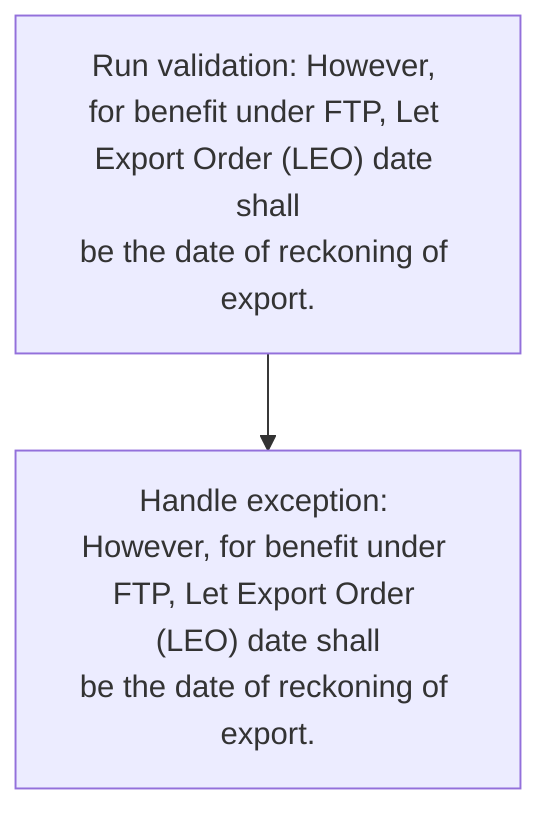
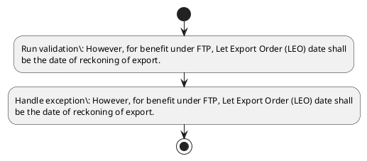

# Chapter 2 / Section 2.17: Date of reckoning of Import / Export

**Chapter Title:** General Provisions Regarding Imports and Exports

**Pages:** 8

**Purpose:** 2.17 Date of reckoning of Import / Export
(a) Date of reckoning of import is decided with reference to date of shipment /
dispatch of goods from supplying country as given in Paragraph 11.11 of
Handbook of Procedures and not the date of arrival of goods at an Indian port.

**Purpose Thanglish:** Indha Date of reckoning of Import / Export section-la, 2.17 Date of reckoning of import / export
(a) Date of reckoning of import is decided with reference to date of shipment /
dispatch of goods from supplying country as given in Paragraph 11.11 of
Handbook of Procedures and not the date of arrival of goods at an Indian port.

**Summary:** 2.17 Date of reckoning of Import / Export
(a) Date of reckoning of import is decided with reference to date of shipment /
dispatch of goods from supplying country as given in Paragraph 11.11 of
Handbook of Procedures and not the date of arrival of goods at an Indian port. (b) Date of reckoning of export is decided with reference to date of shipment /
dispatch of goods from India as given in Paragraph 11.12 of Handbook of
Procedures. However, for benefit under FTP, Let Export Order (LEO) date shall
be the date of reckoning of export.

**Business Meaning:** Date of reckoning of Import / Export governs how DGFT business controls should be applied, validated, and enforced.

**Business Explanation:** Date of reckoning of Import / Export explains the operating rule set that DEKAI should enforce. Key control points include However, for benefit under FTP, Let Export Order (LEO) date shall
be the date of reckoning of export.

**Business Explanation Thanglish:** Indha Date of reckoning of Import / Export section-la, Date of reckoning of import / export explains the operating rule set that DEKAI should enforce. Key control points include However, for benefit under FTP, Let export Order (LEO) date kandippa
be the date of reckoning of export.

## Business Logic
- However, for benefit under FTP, Let Export Order (LEO) date shall
be the date of reckoning of export.

## Business Rules
- rule_id=CH2-SEC2_17-R001, rule_description=However, for benefit under FTP, Let Export Order (LEO) date shall
be the date of reckoning of export., trigger=Date of reckoning of Import / Export, condition=Not explicitly covered in uploaded documents., validation=However, for benefit under FTP, Let Export Order (LEO) date shall
be the date of reckoning of export., action=Manual review required., exception=However, for benefit under FTP, Let Export Order (LEO) date shall
be the date of reckoning of export., output=DEKAI should produce a compliance decision for 2.17 - Date of reckoning of Import / Export.

## Conditions
- None identified

## Condition Logic
- None identified

## Validations
- However, for benefit under FTP, Let Export Order (LEO) date shall
be the date of reckoning of export.

## Exceptions
- However, for benefit under FTP, Let Export Order (LEO) date shall
be the date of reckoning of export.

## Dependencies
- 11.11
- 11.12
- 1

## Authorities
- None identified

## Required Documents
- None identified

## Timelines
- None identified

## Actions
- None identified

## Workflow
- Run validation: However, for benefit under FTP, Let Export Order (LEO) date shall
be the date of reckoning of export.
- Handle exception: However, for benefit under FTP, Let Export Order (LEO) date shall
be the date of reckoning of export.

## Workflow ASCII
```text
Date of reckoning of Import / Export
Run validation: However, for benefit under FTP, Let Export Order (LEO) date shall
be the date of reckoning of export.
   |
   v
Handle exception: However, for benefit under FTP, Let Export Order (LEO) date shall
be the date of reckoning of export.
```

## Decision Tree
- IF exception applies (However, for benefit under FTP, Let Export Order (LEO) date shall
be the date of reckoning of export.) THEN route to manual review

## Decision Tree ASCII
```text
Date of reckoning of Import / Export Decision
IF exception applies (However, for benefit under FTP, Let Export Order (LEO) date shall
be the date of reckoning of export.) THEN route to manual review
```

## Examples
- User asks to process Date of reckoning of Import / Export; the platform checks conditions, validations, and documents before action.

**Real-world Example:** Example: an importer or exporter invokes Date of reckoning of Import / Export, submits the prescribed DGFT records, and DEKAI uses the extracted rules to follow the date of reckoning of import / export process.

**Real-world Example Thanglish:** Indha Date of reckoning of Import / Export section-la, Example: an importer or exporter invokes Date of reckoning of import / export, submits the prescribed DGFT records, and DEKAI uses the extracted rules to follow the date of reckoning of import / export process.

## AI Rules
- IF detected context matches section rule THEN enforce: However, for benefit under FTP, Let Export Order (LEO) date shall
be the date of reckoning of export.

## Database Fields
- name=section_code, type=string, required=True, source=parsed_section_heading
- name=section_title, type=string, required=True, source=parsed_section_heading
- name=and_flag, type=boolean, required=False, source=keyword:and
- name=not_flag, type=boolean, required=False, source=keyword:not
- name=the_flag, type=boolean, required=False, source=keyword:the
- name=for_flag, type=boolean, required=False, source=keyword:for
- name=ftp_flag, type=boolean, required=False, source=keyword:FTP
- name=let_flag, type=boolean, required=False, source=keyword:Let
- name=leo_flag, type=boolean, required=False, source=keyword:LEO
- name=date_flag, type=boolean, required=False, source=keyword:Date

## API Requirements
- method=GET, path=/api/dgft/sections/2.17, purpose=Retrieve knowledge payload for section 2.17, query_params=['include=workflow,decision_tree,validations'], response_fields=['section', 'title', 'summary', 'conditions', 'validations', 'exceptions', 'workflow', 'decision_tree']
- method=POST, path=/api/dgft/Date-of-reckoning-of-Import-Export/validate, purpose=Validate inputs and documents for Date of reckoning of Import / Export, request_fields=['section_code', 'section_title'], response_fields=['status', 'errors', 'warnings', 'next_actions']

## UI Screens
- screen_id=Date_of_reckoning_of_Import_Export_overview, name=Date of reckoning of Import / Export Overview, purpose=Show section summary, authority, timeline, and eligibility cues., widgets=['summary_card', 'conditions_table', 'authority_badges', 'timeline_panel']
- screen_id=Date_of_reckoning_of_Import_Export_submission, name=Date of reckoning of Import / Export Submission, purpose=Capture applicant data and supporting documents., widgets=['dynamic_form', 'document_uploader', 'validation_panel', 'next_action_footer'], fields=['section_code', 'section_title', 'and_flag', 'not_flag', 'the_flag', 'for_flag', 'ftp_flag', 'let_flag']
- screen_id=Date_of_reckoning_of_Import_Export_exceptions, name=Date of reckoning of Import / Export Exception Review, purpose=Explain exception handling and manual review triggers., widgets=['exception_banner', 'decision_tree', 'case_notes']

## Error Messages
- Validation failed because the section requirements were not fully met.

## FAQ
- question_en=What is the purpose of section 2.17?, answer_en=Date of reckoning of Import / Export explains the operating rule set that DEKAI should enforce. Key control points include However, for benefit under FTP, Let Export Order (LEO) date shall
be the date of reckoning of export., question_thanglish=Indha Date of reckoning of Import / Export section-la, What is the purpose of section 2.17?, answer_thanglish=Indha Date of reckoning of Import / Export section-la, Date of reckoning of import / export explains the operating rule set that DEKAI should enforce. Key control points include However, for benefit under FTP, Let export Order (LEO) date kandippa
be the date of reckoning of export.
- question_en=What documents are required under Date of reckoning of Import / Export?, answer_en=Not explicitly covered in uploaded documents., question_thanglish=Indha Date of reckoning of Import / Export section-la, What documents are required under Date of reckoning of import / export?, answer_thanglish=Indha Date of reckoning of Import / Export section-la, Not explicitly covered in uploaded documents.
- question_en=Which authority handles Date of reckoning of Import / Export?, answer_en=Not explicitly covered in uploaded documents., question_thanglish=Indha Date of reckoning of Import / Export section-la, Which authority handles Date of reckoning of import / export?, answer_thanglish=Indha Date of reckoning of Import / Export section-la, Not explicitly covered in uploaded documents.

## Questions Users May Ask
- What does Date of reckoning of Import / Export require?
- Which documents are needed for Date of reckoning of Import / Export?
- How does DEKAI validate Date of reckoning of Import / Export requests?

## Expected AI Answers
- Date of reckoning of Import / Export requires the platform to interpret the section text, apply the extracted business rules, and present the correct next action.
- Required documents are inferred from the section text: no explicit documents were detected.
- DEKAI validates Date of reckoning of Import / Export by checking conditions, required documents, authority references, and exception clauses before recommending an outcome.

## AI Q&A Examples
- question_en=User asks: How do I comply with Date of reckoning of Import / Export?, answer_en=AI answers: DEKAI should evaluate section 2.17, apply the extracted rules, and guide the user through Run validation: However, for benefit under FTP, Let Export Order (LEO) date shall
be the date of reckoning of export.., question_thanglish=Indha Date of reckoning of Import / Export section-la, User asks: How do I comply with Date of reckoning of import / export?, answer_thanglish=Indha Date of reckoning of Import / Export section-la, AI answers: DEKAI should evaluate section 2.17, apply the extracted rules, and guide the user through Run validation: However, for benefit under FTP, Let export Order (LEO) date kandippa
be the date of reckoning of export..
- question_en=User asks: Which validations apply to Date of reckoning of Import / Export?, answer_en=AI answers: Applicable validations are However, for benefit under FTP, Let Export Order (LEO) date shall
be the date of reckoning of export., question_thanglish=Indha Date of reckoning of Import / Export section-la, User asks: Which validations apply to Date of reckoning of import / export?, answer_thanglish=Indha Date of reckoning of Import / Export section-la, AI answers: Applicable validations are However, for benefit under FTP, Let export Order (LEO) date kandippa
be the date of reckoning of export.

## DEKAI AI Implementation Notes
- Capture chapter 2, section 2.17, title, and page references as immutable knowledge metadata.
- Bind validations for Date of reckoning of Import / Export into a rule engine keyed by the rule IDs extracted for this section.
- Trigger manual review when exception clauses are detected.
- Show contextual links to related sections: 1.

## DEKAI AI Implementation Notes Thanglish
- Indha Date of reckoning of Import / Export section-la, Capture chapter 2, section 2.17, title, and page references as immutable knowledge metadata.
- Indha Date of reckoning of Import / Export section-la, Bind validations for Date of reckoning of import / export into a rule engine keyed by the rule IDs extracted for this section.
- Indha Date of reckoning of Import / Export section-la, Trigger manual review when exception clauses are detected.
- Indha Date of reckoning of Import / Export section-la, Show contextual links to related sections: 1.

## AI Metadata
- Keywords: and, not, the, for, FTP, Let, LEO, Date, with, from, port, goods, given, India, under, Order, shall, Import, Export, Indian
- Search Keywords: and, not, the, for, FTP, Let, LEO, Date, with, from, port, goods, given, India, under, Order, shall, Import, Export, Indian
- Intent: Provide knowledge guidance for Date of reckoning of Import / Export.
- Tags: 2.17, Date of reckoning of Import / Export, business-rule, dgft
- Related Sections: 1
- Related Chapters: 
- Related Rules: However, for benefit under FTP, Let Export Order (LEO) date shall
be the date of reckoning of export.

## Mermaid


## PlantUML

