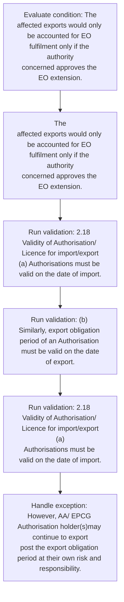
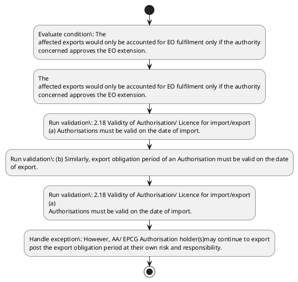

# Chapter 2 / Section 2.18: Validity of Authorisation/ Licence for import/export

**Chapter Title:** General Provisions Regarding Imports and Exports

**Pages:** 8

**Purpose:** 2.18 Validity of Authorisation/ Licence for import/export
(a) Authorisations must be valid on the date of import.

**Purpose Thanglish:** Indha Validity of Authorisation/ Licence for import/export section-la, 2.18 Validity of Authorisation/ licence for import/export
(a) Authorisations must be valid on the date of import.

**Summary:** 2.18 Validity of Authorisation/ Licence for import/export
(a) Authorisations must be valid on the date of import. (b) Similarly, export obligation period of an Authorisation must be valid on the date
of export. However, AA/ EPCG Authorisation holder(s)may continue to export
post the export obligation period at their own risk and responsibility.

**Business Meaning:** Validity of Authorisation/ Licence for import/export governs how DGFT business controls should be applied, validated, and enforced.

**Business Explanation:** Validity of Authorisation/ Licence for import/export explains the operating rule set that DEKAI should enforce. Key control points include 2.18 Validity of Authorisation/ Licence for import/export
(a) Authorisations must be valid on the date of import. The section also drives actions such as The
affected exports would only be accounted for EO fulfilment only if the authority
concerned approves the EO extension..

**Business Explanation Thanglish:** Indha Validity of Authorisation/ Licence for import/export section-la, Validity of Authorisation/ licence for import/export explains the operating rule set that DEKAI should enforce. Key control points include 2.18 Validity of Authorisation/ licence for import/export
(a) Authorisations must be valid on the date of import. The section also drives actions such as The
affected exports would only be accounted for EO fulfilment only if the authority
concerned approves the EO extension..

## Business Logic
- 2.18 Validity of Authorisation/ Licence for import/export
(a) Authorisations must be valid on the date of import.
- (b) Similarly, export obligation period of an Authorisation must be valid on the date
of export.
- 2.18 Validity of Authorisation/ Licence for import/export
(a)
Authorisations must be valid on the date of import.
- (b)
Similarly, export obligation period of an Authorisation must be valid on the date
of export.

## Business Rules
- rule_id=CH2-SEC2_18-R001, rule_description=2.18 Validity of Authorisation/ Licence for import/export
(a) Authorisations must be valid on the date of import., trigger=Validity of Authorisation/ Licence for import/export, condition=The
affected exports would only be accounted for EO fulfilment only if the authority
concerned approves the EO extension., validation=2.18 Validity of Authorisation/ Licence for import/export
(a) Authorisations must be valid on the date of import., action=The
affected exports would only be accounted for EO fulfilment only if the authority
concerned approves the EO extension., exception=However, AA/ EPCG Authorisation holder(s)may continue to export
post the export obligation period at their own risk and responsibility., output=DEKAI should produce a compliance decision for 2.18 - Validity of Authorisation/ Licence for import/export.
- rule_id=CH2-SEC2_18-R002, rule_description=(b) Similarly, export obligation period of an Authorisation must be valid on the date
of export., trigger=Validity of Authorisation/ Licence for import/export, condition=The
affected exports would only be accounted for EO fulfilment only if the authority
concerned approves the EO extension., validation=(b) Similarly, export obligation period of an Authorisation must be valid on the date
of export., action=The
affected exports would only be accounted for EO fulfilment only if the authority
concerned approves the EO extension., exception=However, AA/ EPCG Authorisation holder(s)may continue to export
post the export obligation period at their own risk and responsibility., output=DEKAI should produce a compliance decision for 2.18 - Validity of Authorisation/ Licence for import/export.
- rule_id=CH2-SEC2_18-R003, rule_description=2.18 Validity of Authorisation/ Licence for import/export
(a)
Authorisations must be valid on the date of import., trigger=Validity of Authorisation/ Licence for import/export, condition=The
affected exports would only be accounted for EO fulfilment only if the authority
concerned approves the EO extension., validation=2.18 Validity of Authorisation/ Licence for import/export
(a)
Authorisations must be valid on the date of import., action=The
affected exports would only be accounted for EO fulfilment only if the authority
concerned approves the EO extension., exception=However, AA/ EPCG Authorisation holder(s)may continue to export
post the export obligation period at their own risk and responsibility., output=DEKAI should produce a compliance decision for 2.18 - Validity of Authorisation/ Licence for import/export.
- rule_id=CH2-SEC2_18-R004, rule_description=(b)
Similarly, export obligation period of an Authorisation must be valid on the date
of export., trigger=Validity of Authorisation/ Licence for import/export, condition=The
affected exports would only be accounted for EO fulfilment only if the authority
concerned approves the EO extension., validation=(b)
Similarly, export obligation period of an Authorisation must be valid on the date
of export., action=The
affected exports would only be accounted for EO fulfilment only if the authority
concerned approves the EO extension., exception=However, AA/ EPCG Authorisation holder(s)may continue to export
post the export obligation period at their own risk and responsibility., output=DEKAI should produce a compliance decision for 2.18 - Validity of Authorisation/ Licence for import/export.

## Conditions
- The
affected exports would only be accounted for EO fulfilment only if the authority
concerned approves the EO extension.

## Condition Logic
- id=2.2.18.1, if=The
affected exports would only be accounted for EO fulfilment only if the authority
concerned approves the EO extension., then=The
affected exports would only be accounted for EO fulfilment only if the authority
concerned approves the EO extension., source=The
affected exports would only be accounted for EO fulfilment only if the authority
concerned approves the EO extension.

## Validations
- 2.18 Validity of Authorisation/ Licence for import/export
(a) Authorisations must be valid on the date of import.
- (b) Similarly, export obligation period of an Authorisation must be valid on the date
of export.
- 2.18 Validity of Authorisation/ Licence for import/export
(a)
Authorisations must be valid on the date of import.
- (b)
Similarly, export obligation period of an Authorisation must be valid on the date
of export.

## Exceptions
- However, AA/ EPCG Authorisation holder(s)may continue to export
post the export obligation period at their own risk and responsibility.

## Dependencies
- None identified

## Authorities
- None identified

## Required Documents
- Validity of Authorisation/ Licence

## Timelines
- None identified

## Actions
- The
affected exports would only be accounted for EO fulfilment only if the authority
concerned approves the EO extension.

## Workflow
- Evaluate condition: The
affected exports would only be accounted for EO fulfilment only if the authority
concerned approves the EO extension.
- The
affected exports would only be accounted for EO fulfilment only if the authority
concerned approves the EO extension.
- Run validation: 2.18 Validity of Authorisation/ Licence for import/export
(a) Authorisations must be valid on the date of import.
- Run validation: (b) Similarly, export obligation period of an Authorisation must be valid on the date
of export.
- Run validation: 2.18 Validity of Authorisation/ Licence for import/export
(a)
Authorisations must be valid on the date of import.
- Handle exception: However, AA/ EPCG Authorisation holder(s)may continue to export
post the export obligation period at their own risk and responsibility.

## Workflow ASCII
```text
Validity of Authorisation/ Licence for import/export
Evaluate condition: The
affected exports would only be accounted for EO fulfilment only if the authority
concerned approves the EO extension.
   |
   v
The
affected exports would only be accounted for EO fulfilment only if the authority
concerned approves the EO extension.
   |
   v
Run validation: 2.18 Validity of Authorisation/ Licence for import/export
(a) Authorisations must be valid on the date of import.
   |
   v
Run validation: (b) Similarly, export obligation period of an Authorisation must be valid on the date
of export.
   |
   v
Run validation: 2.18 Validity of Authorisation/ Licence for import/export
(a)
Authorisations must be valid on the date of import.
   |
   v
Handle exception: However, AA/ EPCG Authorisation holder(s)may continue to export
post the export obligation period at their own risk and responsibility.
```

## Decision Tree
- IF The
affected exports would only be accounted for EO fulfilment only if the authority
concerned approves the EO extension. THEN The
affected exports would only be accounted for EO fulfilment only if the authority
concerned approves the EO extension.
- IF exception applies (However, AA/ EPCG Authorisation holder(s)may continue to export
post the export obligation period at their own risk and responsibility.) THEN route to manual review

## Decision Tree ASCII
```text
Validity of Authorisation/ Licence for import/export Decision
IF The
affected exports would only be accounted for EO fulfilment only if the authority
concerned approves the EO extension. THEN The
affected exports would only be accounted for EO fulfilment only if the authority
concerned approves the EO extension.
   |
   v
IF exception applies (However, AA/ EPCG Authorisation holder(s)may continue to export
post the export obligation period at their own risk and responsibility.) THEN route to manual review
```

## Examples
- User asks to process Validity of Authorisation/ Licence for import/export; the platform checks conditions, validations, and documents before action.

**Real-world Example:** Example: an importer or exporter invokes Validity of Authorisation/ Licence for import/export, submits Validity of Authorisation/ Licence, and DEKAI uses the extracted rules to the
affected exports would only be accounted for eo fulfilment only if the authority
concerned approves the eo extension..

**Real-world Example Thanglish:** Indha Validity of Authorisation/ Licence for import/export section-la, Example: an importer or exporter invokes Validity of Authorisation/ licence for import/export, submits Validity of Authorisation/ licence, and DEKAI uses the extracted rules to the
affected exports would only be accounted for eo fulfilment only if the authority
concerned approves the eo extension..

## AI Rules
- IF detected context matches section rule THEN enforce: 2.18 Validity of Authorisation/ Licence for import/export
(a) Authorisations must be valid on the date of import.
- IF detected context matches section rule THEN enforce: (b) Similarly, export obligation period of an Authorisation must be valid on the date
of export.
- IF detected context matches section rule THEN enforce: 2.18 Validity of Authorisation/ Licence for import/export
(a)
Authorisations must be valid on the date of import.
- IF detected context matches section rule THEN enforce: (b)
Similarly, export obligation period of an Authorisation must be valid on the date
of export.
- IF validations pass THEN recommend action: The
affected exports would only be accounted for EO fulfilment only if the authority
concerned approves the EO extension.

## Database Fields
- name=section_code, type=string, required=True, source=parsed_section_heading
- name=section_title, type=string, required=True, source=parsed_section_heading
- name=for_flag, type=boolean, required=False, source=keyword:for
- name=the_flag, type=boolean, required=False, source=keyword:the
- name=may_flag, type=boolean, required=False, source=keyword:may
- name=own_flag, type=boolean, required=False, source=keyword:own
- name=and_flag, type=boolean, required=False, source=keyword:and
- name=must_flag, type=boolean, required=False, source=keyword:must
- name=date_flag, type=boolean, required=False, source=keyword:date
- name=epcg_flag, type=boolean, required=False, source=keyword:EPCG
- name=document_1_submitted, type=boolean, required=True, source=Validity of Authorisation/ Licence

## API Requirements
- method=GET, path=/api/dgft/sections/2.18, purpose=Retrieve knowledge payload for section 2.18, query_params=['include=workflow,decision_tree,validations'], response_fields=['section', 'title', 'summary', 'conditions', 'validations', 'exceptions', 'workflow', 'decision_tree']
- method=POST, path=/api/dgft/Validity-of-Authorisation-Licence-for-import-export/validate, purpose=Validate inputs and documents for Validity of Authorisation/ Licence for import/export, request_fields=['section_code', 'section_title', 'document_1_submitted'], response_fields=['status', 'errors', 'warnings', 'next_actions']
- method=POST, path=/api/dgft/Validity-of-Authorisation-Licence-for-import-export/execute, purpose=Trigger business action for The
affected exports would only be accounted for EO fulfilment only if the authority
concerned approves the EO extension., request_fields=['section_code', 'section_title', 'document_1_submitted'], response_fields=['reference_id', 'status', 'authority', 'timeline']

## UI Screens
- screen_id=Validity_of_Authorisation_Licence_for_import_export_overview, name=Validity of Authorisation/ Licence for import/export Overview, purpose=Show section summary, authority, timeline, and eligibility cues., widgets=['summary_card', 'conditions_table', 'authority_badges', 'timeline_panel']
- screen_id=Validity_of_Authorisation_Licence_for_import_export_submission, name=Validity of Authorisation/ Licence for import/export Submission, purpose=Capture applicant data and supporting documents., widgets=['dynamic_form', 'document_uploader', 'validation_panel', 'next_action_footer'], fields=['section_code', 'section_title', 'for_flag', 'the_flag', 'may_flag', 'own_flag', 'and_flag', 'must_flag']
- screen_id=Validity_of_Authorisation_Licence_for_import_export_exceptions, name=Validity of Authorisation/ Licence for import/export Exception Review, purpose=Explain exception handling and manual review triggers., widgets=['exception_banner', 'decision_tree', 'case_notes']

## Error Messages
- Validation failed because the section requirements were not fully met.

## FAQ
- question_en=What is the purpose of section 2.18?, answer_en=Validity of Authorisation/ Licence for import/export explains the operating rule set that DEKAI should enforce. Key control points include 2.18 Validity of Authorisation/ Licence for import/export
(a) Authorisations must be valid on the date of import. The section also drives actions such as The
affected exports would only be accounted for EO fulfilment only if the authority
concerned approves the EO extension.., question_thanglish=Indha Validity of Authorisation/ Licence for import/export section-la, What is the purpose of section 2.18?, answer_thanglish=Indha Validity of Authorisation/ Licence for import/export section-la, Validity of Authorisation/ licence for import/export explains the operating rule set that DEKAI should enforce. Key control points include 2.18 Validity of Authorisation/ licence for import/export
(a) Authorisations must be valid on the date of import. The section also drives actions such as The
affected exports would only be accounted for EO fulfilment only if the authority
concerned approves the EO extension..
- question_en=What documents are required under Validity of Authorisation/ Licence for import/export?, answer_en=Validity of Authorisation/ Licence, question_thanglish=Indha Validity of Authorisation/ Licence for import/export section-la, What documents are required under Validity of Authorisation/ licence for import/export?, answer_thanglish=Indha Validity of Authorisation/ Licence for import/export section-la, Validity of Authorisation/ licence
- question_en=Which authority handles Validity of Authorisation/ Licence for import/export?, answer_en=Not explicitly covered in uploaded documents., question_thanglish=Indha Validity of Authorisation/ Licence for import/export section-la, Which authority handles Validity of Authorisation/ licence for import/export?, answer_thanglish=Indha Validity of Authorisation/ Licence for import/export section-la, Not explicitly covered in uploaded documents.

## Questions Users May Ask
- What does Validity of Authorisation/ Licence for import/export require?
- Which documents are needed for Validity of Authorisation/ Licence for import/export?
- How does DEKAI validate Validity of Authorisation/ Licence for import/export requests?
- What action should be taken for Validity of Authorisation/ Licence for import/export?

## Expected AI Answers
- Validity of Authorisation/ Licence for import/export requires the platform to interpret the section text, apply the extracted business rules, and present the correct next action.
- Required documents are inferred from the section text: Validity of Authorisation/ Licence
- DEKAI validates Validity of Authorisation/ Licence for import/export by checking conditions, required documents, authority references, and exception clauses before recommending an outcome.
- The primary extracted action is: The
affected exports would only be accounted for EO fulfilment only if the authority
concerned approves the EO extension.

## AI Q&A Examples
- question_en=User asks: How do I comply with Validity of Authorisation/ Licence for import/export?, answer_en=AI answers: DEKAI should evaluate section 2.18, apply the extracted rules, and guide the user through Evaluate condition: The
affected exports would only be accounted for EO fulfilment only if the authority
concerned approves the EO extension.., question_thanglish=Indha Validity of Authorisation/ Licence for import/export section-la, User asks: How do I comply with Validity of Authorisation/ licence for import/export?, answer_thanglish=Indha Validity of Authorisation/ Licence for import/export section-la, AI answers: DEKAI should evaluate section 2.18, apply the extracted rules, and guide the user through Evaluate condition: The
affected exports would only be accounted for EO fulfilment only if the authority
concerned approves the EO extension..
- question_en=User asks: Which validations apply to Validity of Authorisation/ Licence for import/export?, answer_en=AI answers: Applicable validations are 2.18 Validity of Authorisation/ Licence for import/export
(a) Authorisations must be valid on the date of import., (b) Similarly, export obligation period of an Authorisation must be valid on the date
of export., 2.18 Validity of Authorisation/ Licence for import/export
(a)
Authorisations must be valid on the date of import., question_thanglish=Indha Validity of Authorisation/ Licence for import/export section-la, User asks: Which validations apply to Validity of Authorisation/ licence for import/export?, answer_thanglish=Indha Validity of Authorisation/ Licence for import/export section-la, AI answers: Applicable validations are 2.18 Validity of Authorisation/ licence for import/export
(a) Authorisations must be valid on the date of import., (b) Similarly, export obligation period of an Authorisation must be valid on the date
of export., 2.18 Validity of Authorisation/ licence for import/export
(a)
Authorisations must be valid on the date of import.

## DEKAI AI Implementation Notes
- Capture chapter 2, section 2.18, title, and page references as immutable knowledge metadata.
- Bind validations for Validity of Authorisation/ Licence for import/export into a rule engine keyed by the rule IDs extracted for this section.
- Expose document upload controls for: Validity of Authorisation/ Licence.
- Trigger manual review when exception clauses are detected.

## DEKAI AI Implementation Notes Thanglish
- Indha Validity of Authorisation/ Licence for import/export section-la, Capture chapter 2, section 2.18, title, and page references as immutable knowledge metadata.
- Indha Validity of Authorisation/ Licence for import/export section-la, Bind validations for Validity of Authorisation/ licence for import/export into a rule engine keyed by the rule IDs extracted for this section.
- Indha Validity of Authorisation/ Licence for import/export section-la, Expose document upload controls for: Validity of Authorisation/ licence.
- Indha Validity of Authorisation/ Licence for import/export section-la, Trigger manual review when exception clauses are detected.

## AI Metadata
- Keywords: for, the, may, own, and, must, date, EPCG, post, risk, only, valid, their, would, import, export, period, holder, Licence, However
- Search Keywords: for, the, may, own, and, must, date, EPCG, post, risk, only, valid, their, would, import, export, period, holder, Licence, However
- Intent: Support Validity of Authorisation/ Licence for import/export processing and compliance validation.
- Tags: 2.18, Validity of Authorisation/ Licence for import/export, business-rule, document-driven, dgft
- Related Sections: 
- Related Chapters: 
- Related Rules: 2.18 Validity of Authorisation/ Licence for import/export
(a) Authorisations must be valid on the date of import., (b) Similarly, export obligation period of an Authorisation must be valid on the date
of export., 2.18 Validity of Authorisation/ Licence for import/export
(a)
Authorisations must be valid on the date of import., (b)
Similarly, export obligation period of an Authorisation must be valid on the date
of export.

## Mermaid


## PlantUML

