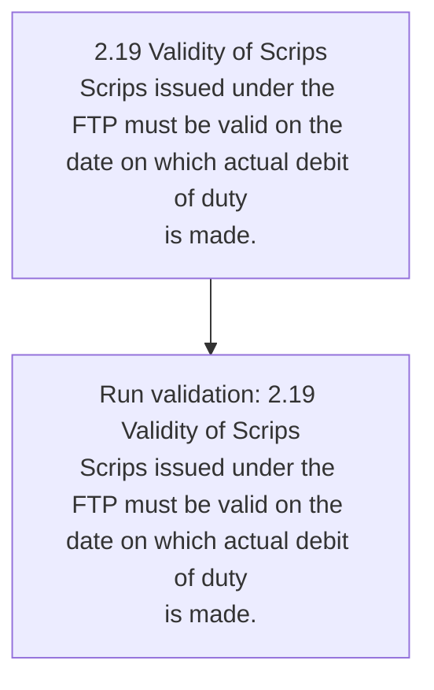
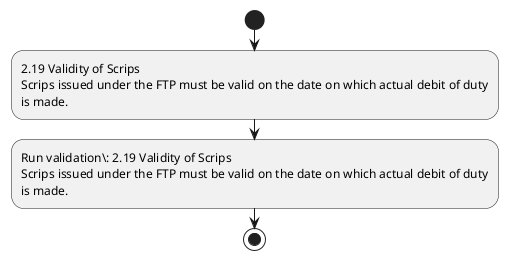

# Chapter 2 / Section 2.19: Validity of Scrips

**Chapter Title:** General Provisions Regarding Imports and Exports

**Pages:** 8

**Purpose:** Defines the operational requirements for Validity of Scrips.

**Purpose Thanglish:** Indha Validity of Scrips section-la, Defines the operational requirements for Validity of Scrips.

**Summary:** 2.19 Validity of Scrips
Scrips issued under the FTP must be valid on the date on which actual debit of duty
is made.

**Business Meaning:** Validity of Scrips governs how DGFT business controls should be applied, validated, and enforced.

**Business Explanation:** Validity of Scrips explains the operating rule set that DEKAI should enforce. Key control points include 2.19 Validity of Scrips
Scrips issued under the FTP must be valid on the date on which actual debit of duty
is made. The section also drives actions such as 2.19 Validity of Scrips
Scrips issued under the FTP must be valid on the date on which actual debit of duty
is made..

**Business Explanation Thanglish:** Indha Validity of Scrips section-la, Validity of Scrips explains the operating rule set that DEKAI should enforce. Key control points include 2.19 Validity of Scrips
Scrips issued under the FTP must be valid on the date on which actual debit of duty
is made. The section also drives actions such as 2.19 Validity of Scrips
Scrips issued under the FTP must be valid on the date on which actual debit of duty
is made..

## Business Logic
- 2.19 Validity of Scrips
Scrips issued under the FTP must be valid on the date on which actual debit of duty
is made.

## Business Rules
- rule_id=CH2-SEC2_19-R001, rule_description=2.19 Validity of Scrips
Scrips issued under the FTP must be valid on the date on which actual debit of duty
is made., trigger=Validity of Scrips, condition=Section 2.19 is applicable, validation=2.19 Validity of Scrips
Scrips issued under the FTP must be valid on the date on which actual debit of duty
is made., action=2.19 Validity of Scrips
Scrips issued under the FTP must be valid on the date on which actual debit of duty
is made., exception=No explicit exception found in uploaded documents., output=DEKAI should produce a compliance decision for 2.19 - Validity of Scrips.

## Conditions
- None identified

## Condition Logic
- id=2.2.19.1, if=Section 2.19 is applicable, then=2.19 Validity of Scrips
Scrips issued under the FTP must be valid on the date on which actual debit of duty
is made., source=Derived from uploaded documents

## Validations
- 2.19 Validity of Scrips
Scrips issued under the FTP must be valid on the date on which actual debit of duty
is made.

## Exceptions
- None identified

## Dependencies
- None identified

## Authorities
- None identified

## Required Documents
- None identified

## Timelines
- None identified

## Actions
- 2.19 Validity of Scrips
Scrips issued under the FTP must be valid on the date on which actual debit of duty
is made.

## Workflow
- 2.19 Validity of Scrips
Scrips issued under the FTP must be valid on the date on which actual debit of duty
is made.
- Run validation: 2.19 Validity of Scrips
Scrips issued under the FTP must be valid on the date on which actual debit of duty
is made.

## Workflow ASCII
```text
Validity of Scrips
2.19 Validity of Scrips
Scrips issued under the FTP must be valid on the date on which actual debit of duty
is made.
   |
   v
Run validation: 2.19 Validity of Scrips
Scrips issued under the FTP must be valid on the date on which actual debit of duty
is made.
```

## Decision Tree
- IF section 2.19 applies THEN 2.19 Validity of Scrips
Scrips issued under the FTP must be valid on the date on which actual debit of duty
is made.

## Decision Tree ASCII
```text
Validity of Scrips Decision
IF section 2.19 applies THEN 2.19 Validity of Scrips
Scrips issued under the FTP must be valid on the date on which actual debit of duty
is made.
```

## Examples
- User asks to process Validity of Scrips; the platform checks conditions, validations, and documents before action.

**Real-world Example:** Example: an importer or exporter invokes Validity of Scrips, submits the prescribed DGFT records, and DEKAI uses the extracted rules to 2.19 validity of scrips
scrips issued under the ftp must be valid on the date on which actual debit of duty
is made..

**Real-world Example Thanglish:** Indha Validity of Scrips section-la, Example: an importer or exporter invokes Validity of Scrips, submits the prescribed DGFT records, and DEKAI uses the extracted rules to 2.19 validity of scrips
scrips issued under the ftp must be valid on the date on which actual debit of duty
is made..

## AI Rules
- IF detected context matches section rule THEN enforce: 2.19 Validity of Scrips
Scrips issued under the FTP must be valid on the date on which actual debit of duty
is made.
- IF validations pass THEN recommend action: 2.19 Validity of Scrips
Scrips issued under the FTP must be valid on the date on which actual debit of duty
is made.

## Database Fields
- name=section_code, type=string, required=True, source=parsed_section_heading
- name=section_title, type=string, required=True, source=parsed_section_heading
- name=the_flag, type=boolean, required=False, source=keyword:the
- name=ftp_flag, type=boolean, required=False, source=keyword:FTP
- name=must_flag, type=boolean, required=False, source=keyword:must
- name=date_flag, type=boolean, required=False, source=keyword:date
- name=duty_flag, type=boolean, required=False, source=keyword:duty
- name=made_flag, type=boolean, required=False, source=keyword:made
- name=under_flag, type=boolean, required=False, source=keyword:under
- name=valid_flag, type=boolean, required=False, source=keyword:valid

## API Requirements
- method=GET, path=/api/dgft/sections/2.19, purpose=Retrieve knowledge payload for section 2.19, query_params=['include=workflow,decision_tree,validations'], response_fields=['section', 'title', 'summary', 'conditions', 'validations', 'exceptions', 'workflow', 'decision_tree']
- method=POST, path=/api/dgft/Validity-of-Scrips/validate, purpose=Validate inputs and documents for Validity of Scrips, request_fields=['section_code', 'section_title'], response_fields=['status', 'errors', 'warnings', 'next_actions']
- method=POST, path=/api/dgft/Validity-of-Scrips/execute, purpose=Trigger business action for 2.19 Validity of Scrips
Scrips issued under the FTP must be valid on the date on which actual debit of duty
is made., request_fields=['section_code', 'section_title'], response_fields=['reference_id', 'status', 'authority', 'timeline']

## UI Screens
- screen_id=Validity_of_Scrips_overview, name=Validity of Scrips Overview, purpose=Show section summary, authority, timeline, and eligibility cues., widgets=['summary_card', 'conditions_table', 'authority_badges', 'timeline_panel']
- screen_id=Validity_of_Scrips_submission, name=Validity of Scrips Submission, purpose=Capture applicant data and supporting documents., widgets=['dynamic_form', 'document_uploader', 'validation_panel', 'next_action_footer'], fields=['section_code', 'section_title', 'the_flag', 'ftp_flag', 'must_flag', 'date_flag', 'duty_flag', 'made_flag']

## Error Messages
- Validation failed because the section requirements were not fully met.

## FAQ
- question_en=What is the purpose of section 2.19?, answer_en=Validity of Scrips explains the operating rule set that DEKAI should enforce. Key control points include 2.19 Validity of Scrips
Scrips issued under the FTP must be valid on the date on which actual debit of duty
is made. The section also drives actions such as 2.19 Validity of Scrips
Scrips issued under the FTP must be valid on the date on which actual debit of duty
is made.., question_thanglish=Indha Validity of Scrips section-la, What is the purpose of section 2.19?, answer_thanglish=Indha Validity of Scrips section-la, Validity of Scrips explains the operating rule set that DEKAI should enforce. Key control points include 2.19 Validity of Scrips
Scrips issued under the FTP must be valid on the date on which actual debit of duty
is made. The section also drives actions such as 2.19 Validity of Scrips
Scrips issued under the FTP must be valid on the date on which actual debit of duty
is made..
- question_en=What documents are required under Validity of Scrips?, answer_en=Not explicitly covered in uploaded documents., question_thanglish=Indha Validity of Scrips section-la, What documents are required under Validity of Scrips?, answer_thanglish=Indha Validity of Scrips section-la, Not explicitly covered in uploaded documents.
- question_en=Which authority handles Validity of Scrips?, answer_en=Not explicitly covered in uploaded documents., question_thanglish=Indha Validity of Scrips section-la, Which authority handles Validity of Scrips?, answer_thanglish=Indha Validity of Scrips section-la, Not explicitly covered in uploaded documents.

## Questions Users May Ask
- What does Validity of Scrips require?
- Which documents are needed for Validity of Scrips?
- How does DEKAI validate Validity of Scrips requests?
- What action should be taken for Validity of Scrips?

## Expected AI Answers
- Validity of Scrips requires the platform to interpret the section text, apply the extracted business rules, and present the correct next action.
- Required documents are inferred from the section text: no explicit documents were detected.
- DEKAI validates Validity of Scrips by checking conditions, required documents, authority references, and exception clauses before recommending an outcome.
- The primary extracted action is: 2.19 Validity of Scrips
Scrips issued under the FTP must be valid on the date on which actual debit of duty
is made.

## AI Q&A Examples
- question_en=User asks: How do I comply with Validity of Scrips?, answer_en=AI answers: DEKAI should evaluate section 2.19, apply the extracted rules, and guide the user through 2.19 Validity of Scrips
Scrips issued under the FTP must be valid on the date on which actual debit of duty
is made.., question_thanglish=Indha Validity of Scrips section-la, User asks: How do I comply with Validity of Scrips?, answer_thanglish=Indha Validity of Scrips section-la, AI answers: DEKAI should evaluate section 2.19, apply the extracted rules, and guide the user through 2.19 Validity of Scrips
Scrips issued under the FTP must be valid on the date on which actual debit of duty
is made..
- question_en=User asks: Which validations apply to Validity of Scrips?, answer_en=AI answers: Applicable validations are 2.19 Validity of Scrips
Scrips issued under the FTP must be valid on the date on which actual debit of duty
is made., question_thanglish=Indha Validity of Scrips section-la, User asks: Which validations apply to Validity of Scrips?, answer_thanglish=Indha Validity of Scrips section-la, AI answers: Applicable validations are 2.19 Validity of Scrips
Scrips issued under the FTP must be valid on the date on which actual debit of duty
is made.

## DEKAI AI Implementation Notes
- Capture chapter 2, section 2.19, title, and page references as immutable knowledge metadata.
- Bind validations for Validity of Scrips into a rule engine keyed by the rule IDs extracted for this section.

## DEKAI AI Implementation Notes Thanglish
- Indha Validity of Scrips section-la, Capture chapter 2, section 2.19, title, and page references as immutable knowledge metadata.
- Indha Validity of Scrips section-la, Bind validations for Validity of Scrips into a rule engine keyed by the rule IDs extracted for this section.

## AI Metadata
- Keywords: the, FTP, must, date, duty, made, under, valid, which, debit, Scrips, issued, actual, Validity
- Search Keywords: the, FTP, must, date, duty, made, under, valid, which, debit, Scrips, issued, actual, Validity
- Intent: Support Validity of Scrips processing and compliance validation.
- Tags: 2.19, Validity of Scrips, business-rule, dgft
- Related Sections: 
- Related Chapters: 
- Related Rules: 2.19 Validity of Scrips
Scrips issued under the FTP must be valid on the date on which actual debit of duty
is made.

## Mermaid


## PlantUML

