# Chapter 2 / Section 2.20: Revalidation of Import / Export Licence Certificate/ Authorisation /

**Chapter Title:** General Provisions Regarding Imports and Exports

**Pages:** 8, 9

**Purpose:** 2.20 Revalidation of Import / Export Licence Certificate/ Authorisation /
Permissions for Non-SCOMET items
(a) Import Authorisation, may be revalidated, on merits for a period of six months
from date of expiry of validity by the DGFT (HQ).

**Purpose Thanglish:** Indha Revalidation of Import / Export Licence Certificate/ Authorisation / section-la, 2.20 Revalidation of import / export licence Certificate/ Authorisation /
Permissions for Non-SCOMET items
(a) import Authorisation, may be revalidated, on merits for a period of six months
from date of expiry of validity by the DGFT (HQ).

**Summary:** 2.20 Revalidation of Import / Export Licence Certificate/ Authorisation /
Permissions for Non-SCOMET items
(a) Import Authorisation, may be revalidated, on merits for a period of six months
from date of expiry of validity by the DGFT (HQ). (b) Export Authorisation, may be revalidated, on merits for a period of six months a
time and maximum upto 12 months by the DGFT (HQ). (c) However, revalidation of freely transferable authorisation / duty credit scrips and
stock and sale (excluding SCOMET items) authorisation shall not be permitted unless
validity has expired while in custody of Customs Authority / RA / Government
Authority.

**Business Meaning:** Revalidation of Import / Export Licence Certificate/ Authorisation / governs how DGFT business controls should be applied, validated, and enforced.

**Business Explanation:** Revalidation of Import / Export Licence Certificate/ Authorisation / explains the operating rule set that DEKAI should enforce. Key control points include (c) However, revalidation of freely transferable authorisation / duty credit scrips and
stock and sale (excluding SCOMET items) authorisation shall not be permitted unless
validity has expired while in custody of Customs Authority / RA / Government
Authority. The section also drives actions such as 17
(i) If Authorisation/Scrip or any amendment thereof could not be transmitted to
Customs Server within fifteen working days from the date of issue/amendment;
(ii) If Authorisation/Scrip rejected by Customs server with error Code
(iii) If request for issue of waiver of Bond/EODC was not considered within the
period specified under Para 11.10 of HBP, where complete application was
submitted within the validity of the Authorisation..

**Business Explanation Thanglish:** Indha Revalidation of Import / Export Licence Certificate/ Authorisation / section-la, Revalidation of import / export licence Certificate/ Authorisation / explains the operating rule set that DEKAI should enforce. Key control points include (c) However, revalidation of freely transferable authorisation / duty credit scrips and
stock and sale (excluding SCOMET items) authorisation kandippa not be permitted unless
validity has expired while in custody of Customs authority / RA / Government
authority. The section also drives actions such as 17
(i) If Authorisation/Scrip or any amendment thereof could not be transmitted to
Customs Server within fifteen working days from the date of issue/amendment;
(ii) If Authorisation/Scrip rejected by Customs server with error Code
(iii) If request for issue of waiver of Bond/EODC was not considered within the
period specified under Para 11.10 of HBP, where complete application was
submitted within the validity of the Authorisation..

## Business Logic
- (c) However, revalidation of freely transferable authorisation / duty credit scrips and
stock and sale (excluding SCOMET items) authorisation shall not be permitted unless
validity has expired while in custody of Customs Authority / RA / Government
Authority.
- (d) Revalidation of Authorisation/Duty Credit Scrip shall also be allowed without
charging any fee for the period of delay (the period for which authorisation/scrip
holder was unable to utilise the same) or six months, whichever is less, due to the
following reasons:
pg.
- In such cases, revalidation shall be allowed from the date of endorsement for the
period of delay or six months, whichever is less.
- In such a case, RA shall allow revalidation for a period of 6 months (validity of 5
months is subsumed) from the date of endorsement.
- The applicant shall submit request for endorsement of Authorisation/Scrip along with
screen shot of DGFT server as well as Customs Server in support of his claim.
- RA shall
verify the same before revalidation is allowed.
- However, request must be made to RA concerned within a month from the date of
final acceptance of Authorisation/Scrip in the Customs Server.
- Notwithstanding anything contained above, these provisions of revalidation shall not
apply wherever, the authorisation/scrip holder had clear 6 months period in hand for
utilisation.

## Business Rules
- rule_id=CH2-SEC2_20-R001, rule_description=(c) However, revalidation of freely transferable authorisation / duty credit scrips and
stock and sale (excluding SCOMET items) authorisation shall not be permitted unless
validity has expired while in custody of Customs Authority / RA / Government
Authority., trigger=Revalidation of Import / Export Licence Certificate/ Authorisation /, condition=2.20 Revalidation of Import / Export Licence Certificate/ Authorisation /
Permissions for Non-SCOMET items
(a) Import Authorisation, may be revalidated, on merits for a period of six months
from date of expiry of validity by the DGFT (HQ)., validation=2.20 Revalidation of Import / Export Licence Certificate/ Authorisation /
Permissions for Non-SCOMET items
(a) Import Authorisation, may be revalidated, on merits for a period of six months
from date of expiry of validity by the DGFT (HQ)., action=17
(i) If Authorisation/Scrip or any amendment thereof could not be transmitted to
Customs Server within fifteen working days from the date of issue/amendment;
(ii) If Authorisation/Scrip rejected by Customs server with error Code
(iii) If request for issue of waiver of Bond/EODC was not considered within the
period specified under Para 11.10 of HBP, where complete application was
submitted within the validity of the Authorisation., exception=(c) However, revalidation of freely transferable authorisation / duty credit scrips and
stock and sale (excluding SCOMET items) authorisation shall not be permitted unless
validity has expired while in custody of Customs Authority / RA / Government
Authority., output=DEKAI should produce a compliance decision for 2.20 - Revalidation of Import / Export Licence Certificate/ Authorisation /.
- rule_id=CH2-SEC2_20-R002, rule_description=(d) Revalidation of Authorisation/Duty Credit Scrip shall also be allowed without
charging any fee for the period of delay (the period for which authorisation/scrip
holder was unable to utilise the same) or six months, whichever is less, due to the
following reasons:
pg., trigger=Revalidation of Import / Export Licence Certificate/ Authorisation /, condition=(c) However, revalidation of freely transferable authorisation / duty credit scrips and
stock and sale (excluding SCOMET items) authorisation shall not be permitted unless
validity has expired while in custody of Customs Authority / RA / Government
Authority., validation=(b) Export Authorisation, may be revalidated, on merits for a period of six months a
time and maximum upto 12 months by the DGFT (HQ)., action=For example: Authorisation is issued
having initial validity of 12 months on 01.04.2017., exception=It was transmitted to Customs
server on 01.04.2017 by DGFT server but it is accepted by Customs server on
31.10.2017., output=DEKAI should produce a compliance decision for 2.20 - Revalidation of Import / Export Licence Certificate/ Authorisation /.
- rule_id=CH2-SEC2_20-R003, rule_description=In such cases, revalidation shall be allowed from the date of endorsement for the
period of delay or six months, whichever is less., trigger=Revalidation of Import / Export Licence Certificate/ Authorisation /, condition=17
2.20 Revalidation of Import / Export Licence Certificate/ Authorisation /
Permissions for Non-SCOMET items
(a) Import Authorisation, may be revalidated, on merits for a period of six months
from date of expiry of validity by the DGFT (HQ)., validation=(c) However, revalidation of freely transferable authorisation / duty credit scrips and
stock and sale (excluding SCOMET items) authorisation shall not be permitted unless
validity has expired while in custody of Customs Authority / RA / Government
Authority., action=The applicant shall submit request for endorsement of Authorisation/Scrip along with
screen shot of DGFT server as well as Customs Server in support of his claim., exception=However, request must be made to RA concerned within a month from the date of
final acceptance of Authorisation/Scrip in the Customs Server., output=DEKAI should produce a compliance decision for 2.20 - Revalidation of Import / Export Licence Certificate/ Authorisation /.
- rule_id=CH2-SEC2_20-R004, rule_description=In such a case, RA shall allow revalidation for a period of 6 months (validity of 5
months is subsumed) from the date of endorsement., trigger=Revalidation of Import / Export Licence Certificate/ Authorisation /, condition=17
(i) If Authorisation/Scrip or any amendment thereof could not be transmitted to
Customs Server within fifteen working days from the date of issue/amendment;
(ii) If Authorisation/Scrip rejected by Customs server with error Code
(iii) If request for issue of waiver of Bond/EODC was not considered within the
period specified under Para 11.10 of HBP, where complete application was
submitted within the validity of the Authorisation., validation=(d) Revalidation of Authorisation/Duty Credit Scrip shall also be allowed without
charging any fee for the period of delay (the period for which authorisation/scrip
holder was unable to utilise the same) or six months, whichever is less, due to the
following reasons:
pg., action=RA shall
verify the same before revalidation is allowed., exception=Notwithstanding anything contained above, these provisions of revalidation shall not
apply wherever, the authorisation/scrip holder had clear 6 months period in hand for
utilisation., output=DEKAI should produce a compliance decision for 2.20 - Revalidation of Import / Export Licence Certificate/ Authorisation /.
- rule_id=CH2-SEC2_20-R005, rule_description=The applicant shall submit request for endorsement of Authorisation/Scrip along with
screen shot of DGFT server as well as Customs Server in support of his claim., trigger=Revalidation of Import / Export Licence Certificate/ Authorisation /, condition=RA shall
verify the same before revalidation is allowed., validation=17
2.20 Revalidation of Import / Export Licence Certificate/ Authorisation /
Permissions for Non-SCOMET items
(a) Import Authorisation, may be revalidated, on merits for a period of six months
from date of expiry of validity by the DGFT (HQ)., action=Notwithstanding anything contained above, these provisions of revalidation shall not
apply wherever, the authorisation/scrip holder had clear 6 months period in hand for
utilisation., exception=Notwithstanding anything contained above, these provisions of revalidation shall not
apply wherever, the authorisation/scrip holder had clear 6 months period in hand for
utilisation., output=DEKAI should produce a compliance decision for 2.20 - Revalidation of Import / Export Licence Certificate/ Authorisation /.
- rule_id=CH2-SEC2_20-R006, rule_description=RA shall
verify the same before revalidation is allowed., trigger=Revalidation of Import / Export Licence Certificate/ Authorisation /, condition=Notwithstanding anything contained above, these provisions of revalidation shall not
apply wherever, the authorisation/scrip holder had clear 6 months period in hand for
utilisation., validation=17
(i) If Authorisation/Scrip or any amendment thereof could not be transmitted to
Customs Server within fifteen working days from the date of issue/amendment;
(ii) If Authorisation/Scrip rejected by Customs server with error Code
(iii) If request for issue of waiver of Bond/EODC was not considered within the
period specified under Para 11.10 of HBP, where complete application was
submitted within the validity of the Authorisation., action=Notwithstanding anything contained above, these provisions of revalidation shall not
apply wherever, the authorisation/scrip holder had clear 6 months period in hand for
utilisation., exception=Notwithstanding anything contained above, these provisions of revalidation shall not
apply wherever, the authorisation/scrip holder had clear 6 months period in hand for
utilisation., output=DEKAI should produce a compliance decision for 2.20 - Revalidation of Import / Export Licence Certificate/ Authorisation /.
- rule_id=CH2-SEC2_20-R007, rule_description=However, request must be made to RA concerned within a month from the date of
final acceptance of Authorisation/Scrip in the Customs Server., trigger=Revalidation of Import / Export Licence Certificate/ Authorisation /, condition=Notwithstanding anything contained above, these provisions of revalidation shall not
apply wherever, the authorisation/scrip holder had clear 6 months period in hand for
utilisation., validation=In such cases, revalidation shall be allowed from the date of endorsement for the
period of delay or six months, whichever is less., action=Notwithstanding anything contained above, these provisions of revalidation shall not
apply wherever, the authorisation/scrip holder had clear 6 months period in hand for
utilisation., exception=Notwithstanding anything contained above, these provisions of revalidation shall not
apply wherever, the authorisation/scrip holder had clear 6 months period in hand for
utilisation., output=DEKAI should produce a compliance decision for 2.20 - Revalidation of Import / Export Licence Certificate/ Authorisation /.
- rule_id=CH2-SEC2_20-R008, rule_description=Notwithstanding anything contained above, these provisions of revalidation shall not
apply wherever, the authorisation/scrip holder had clear 6 months period in hand for
utilisation., trigger=Revalidation of Import / Export Licence Certificate/ Authorisation /, condition=Notwithstanding anything contained above, these provisions of revalidation shall not
apply wherever, the authorisation/scrip holder had clear 6 months period in hand for
utilisation., validation=It was transmitted to Customs
server on 01.04.2017 by DGFT server but it is accepted by Customs server on
31.10.2017., action=Notwithstanding anything contained above, these provisions of revalidation shall not
apply wherever, the authorisation/scrip holder had clear 6 months period in hand for
utilisation., exception=Notwithstanding anything contained above, these provisions of revalidation shall not
apply wherever, the authorisation/scrip holder had clear 6 months period in hand for
utilisation., output=DEKAI should produce a compliance decision for 2.20 - Revalidation of Import / Export Licence Certificate/ Authorisation /.

## Conditions
- 2.20 Revalidation of Import / Export Licence Certificate/ Authorisation /
Permissions for Non-SCOMET items
(a) Import Authorisation, may be revalidated, on merits for a period of six months
from date of expiry of validity by the DGFT (HQ).
- (c) However, revalidation of freely transferable authorisation / duty credit scrips and
stock and sale (excluding SCOMET items) authorisation shall not be permitted unless
validity has expired while in custody of Customs Authority / RA / Government
Authority.
- 17
2.20 Revalidation of Import / Export Licence Certificate/ Authorisation /
Permissions for Non-SCOMET items
(a) Import Authorisation, may be revalidated, on merits for a period of six months
from date of expiry of validity by the DGFT (HQ).
- 17
(i) If Authorisation/Scrip or any amendment thereof could not be transmitted to
Customs Server within fifteen working days from the date of issue/amendment;
(ii) If Authorisation/Scrip rejected by Customs server with error Code
(iii) If request for issue of waiver of Bond/EODC was not considered within the
period specified under Para 11.10 of HBP, where complete application was
submitted within the validity of the Authorisation.
- RA shall
verify the same before revalidation is allowed.
- Notwithstanding anything contained above, these provisions of revalidation shall not
apply wherever, the authorisation/scrip holder had clear 6 months period in hand for
utilisation.

## Condition Logic
- id=2.2.20.1, if=2.20 Revalidation of Import / Export Licence Certificate/ Authorisation /
Permissions for Non-SCOMET items
(a) Import Authorisation, may be revalidated, on merits for a period of six months
from date of expiry of validity by the DGFT (HQ)., then=17
(i) If Authorisation/Scrip or any amendment thereof could not be transmitted to
Customs Server within fifteen working days from the date of issue/amendment;
(ii) If Authorisation/Scrip rejected by Customs server with error Code
(iii) If request for issue of waiver of Bond/EODC was not considered within the
period specified under Para 11.10 of HBP, where complete application was
submitted within the validity of the Authorisation., source=2.20 Revalidation of Import / Export Licence Certificate/ Authorisation /
Permissions for Non-SCOMET items
(a) Import Authorisation, may be revalidated, on merits for a period of six months
from date of expiry of validity by the DGFT (HQ).
- id=2.2.20.2, if=(c) However, revalidation of freely transferable authorisation / duty credit scrips and
stock and sale (excluding SCOMET items) authorisation shall not be permitted unless
validity has expired while in custody of Customs Authority / RA / Government
Authority., then=17
(i) If Authorisation/Scrip or any amendment thereof could not be transmitted to
Customs Server within fifteen working days from the date of issue/amendment;
(ii) If Authorisation/Scrip rejected by Customs server with error Code
(iii) If request for issue of waiver of Bond/EODC was not considered within the
period specified under Para 11.10 of HBP, where complete application was
submitted within the validity of the Authorisation., source=(c) However, revalidation of freely transferable authorisation / duty credit scrips and
stock and sale (excluding SCOMET items) authorisation shall not be permitted unless
validity has expired while in custody of Customs Authority / RA / Government
Authority.
- id=2.2.20.3, if=17
2.20 Revalidation of Import / Export Licence Certificate/ Authorisation /
Permissions for Non-SCOMET items
(a) Import Authorisation, may be revalidated, on merits for a period of six months
from date of expiry of validity by the DGFT (HQ)., then=17
(i) If Authorisation/Scrip or any amendment thereof could not be transmitted to
Customs Server within fifteen working days from the date of issue/amendment;
(ii) If Authorisation/Scrip rejected by Customs server with error Code
(iii) If request for issue of waiver of Bond/EODC was not considered within the
period specified under Para 11.10 of HBP, where complete application was
submitted within the validity of the Authorisation., source=17
2.20 Revalidation of Import / Export Licence Certificate/ Authorisation /
Permissions for Non-SCOMET items
(a) Import Authorisation, may be revalidated, on merits for a period of six months
from date of expiry of validity by the DGFT (HQ).
- id=2.2.20.4, if=17
(i) If Authorisation/Scrip or any amendment thereof could not be transmitted to
Customs Server within fifteen working days from the date of issue/amendment;
(ii) If Authorisation/Scrip rejected by Customs server with error Code
(iii) If request for issue of waiver of Bond/EODC was not considered within the
period specified under Para 11.10 of HBP, where complete application was
submitted within the validity of the Authorisation., then=17
(i) If Authorisation/Scrip or any amendment thereof could not be transmitted to
Customs Server within fifteen working days from the date of issue/amendment;
(ii) If Authorisation/Scrip rejected by Customs server with error Code
(iii) If request for issue of waiver of Bond/EODC was not considered within the
period specified under Para 11.10 of HBP, where complete application was
submitted within the validity of the Authorisation., source=17
(i) If Authorisation/Scrip or any amendment thereof could not be transmitted to
Customs Server within fifteen working days from the date of issue/amendment;
(ii) If Authorisation/Scrip rejected by Customs server with error Code
(iii) If request for issue of waiver of Bond/EODC was not considered within the
period specified under Para 11.10 of HBP, where complete application was
submitted within the validity of the Authorisation.
- id=2.2.20.5, if=RA shall
verify the same before revalidation is allowed., then=17
(i) If Authorisation/Scrip or any amendment thereof could not be transmitted to
Customs Server within fifteen working days from the date of issue/amendment;
(ii) If Authorisation/Scrip rejected by Customs server with error Code
(iii) If request for issue of waiver of Bond/EODC was not considered within the
period specified under Para 11.10 of HBP, where complete application was
submitted within the validity of the Authorisation., source=RA shall
verify the same before revalidation is allowed.
- id=2.2.20.6, if=Notwithstanding anything contained above, these provisions of revalidation shall not
apply wherever, the authorisation/scrip holder had clear 6 months period in hand for
utilisation., then=17
(i) If Authorisation/Scrip or any amendment thereof could not be transmitted to
Customs Server within fifteen working days from the date of issue/amendment;
(ii) If Authorisation/Scrip rejected by Customs server with error Code
(iii) If request for issue of waiver of Bond/EODC was not considered within the
period specified under Para 11.10 of HBP, where complete application was
submitted within the validity of the Authorisation., source=Notwithstanding anything contained above, these provisions of revalidation shall not
apply wherever, the authorisation/scrip holder had clear 6 months period in hand for
utilisation.

## Validations
- 2.20 Revalidation of Import / Export Licence Certificate/ Authorisation /
Permissions for Non-SCOMET items
(a) Import Authorisation, may be revalidated, on merits for a period of six months
from date of expiry of validity by the DGFT (HQ).
- (b) Export Authorisation, may be revalidated, on merits for a period of six months a
time and maximum upto 12 months by the DGFT (HQ).
- (c) However, revalidation of freely transferable authorisation / duty credit scrips and
stock and sale (excluding SCOMET items) authorisation shall not be permitted unless
validity has expired while in custody of Customs Authority / RA / Government
Authority.
- (d) Revalidation of Authorisation/Duty Credit Scrip shall also be allowed without
charging any fee for the period of delay (the period for which authorisation/scrip
holder was unable to utilise the same) or six months, whichever is less, due to the
following reasons:
pg.
- 17
2.20 Revalidation of Import / Export Licence Certificate/ Authorisation /
Permissions for Non-SCOMET items
(a) Import Authorisation, may be revalidated, on merits for a period of six months
from date of expiry of validity by the DGFT (HQ).
- 17
(i) If Authorisation/Scrip or any amendment thereof could not be transmitted to
Customs Server within fifteen working days from the date of issue/amendment;
(ii) If Authorisation/Scrip rejected by Customs server with error Code
(iii) If request for issue of waiver of Bond/EODC was not considered within the
period specified under Para 11.10 of HBP, where complete application was
submitted within the validity of the Authorisation.
- In such cases, revalidation shall be allowed from the date of endorsement for the
period of delay or six months, whichever is less.
- It was transmitted to Customs
server on 01.04.2017 by DGFT server but it is accepted by Customs server on
31.10.2017.
- In such a case, RA shall allow revalidation for a period of 6 months (validity of 5
months is subsumed) from the date of endorsement.
- The applicant shall submit request for endorsement of Authorisation/Scrip along with
screen shot of DGFT server as well as Customs Server in support of his claim.
- RA shall
verify the same before revalidation is allowed.
- However, request must be made to RA concerned within a month from the date of
final acceptance of Authorisation/Scrip in the Customs Server.
- Notwithstanding anything contained above, these provisions of revalidation shall not
apply wherever, the authorisation/scrip holder had clear 6 months period in hand for
utilisation.

## Exceptions
- (c) However, revalidation of freely transferable authorisation / duty credit scrips and
stock and sale (excluding SCOMET items) authorisation shall not be permitted unless
validity has expired while in custody of Customs Authority / RA / Government
Authority.
- It was transmitted to Customs
server on 01.04.2017 by DGFT server but it is accepted by Customs server on
31.10.2017.
- However, request must be made to RA concerned within a month from the date of
final acceptance of Authorisation/Scrip in the Customs Server.
- Notwithstanding anything contained above, these provisions of revalidation shall not
apply wherever, the authorisation/scrip holder had clear 6 months period in hand for
utilisation.

## Dependencies
- 11.10
- 1

## Authorities
- DGFT
- RA
- Customs
- Customs Authority
- Customs Authority / RA / Government
- If Authorisation/Scrip rejected by Customs
- It was transmitted to Customs
- DGFT server but it is accepted by Customs
- DGFT server as well as Customs
- Authorisation/Scrip in the Customs

## Required Documents
- Revalidation of Import / Export Licence Certificate
- 17
(i) If Authorisation/Scrip or any amendment thereof could not be transmitted to
Customs Server within fifteen working days from the date of issue/amendment;
(ii) If Authorisation/Scrip rejected by Customs server with error Code
(iii) If request for issue of waiver of Bond/EODC was not considered within the
period specified under Para 11.10 of HBP, where complete application was
submitted within the validity of the Authorisation.

## Timelines
- 2.20 Revalidation of Import / Export Licence Certificate/ Authorisation /
Permissions for Non-SCOMET items
(a) Import Authorisation, may be revalidated, on merits for a period of six months
from date of expiry of validity by the DGFT (HQ).
- (b) Export Authorisation, may be revalidated, on merits for a period of six months a
time and maximum upto 12 months by the DGFT (HQ).
- (d) Revalidation of Authorisation/Duty Credit Scrip shall also be allowed without
charging any fee for the period of delay (the period for which authorisation/scrip
holder was unable to utilise the same) or six months, whichever is less, due to the
following reasons:
pg.
- 17
2.20 Revalidation of Import / Export Licence Certificate/ Authorisation /
Permissions for Non-SCOMET items
(a) Import Authorisation, may be revalidated, on merits for a period of six months
from date of expiry of validity by the DGFT (HQ).
- 17
(i) If Authorisation/Scrip or any amendment thereof could not be transmitted to
Customs Server within fifteen working days from the date of issue/amendment;
(ii) If Authorisation/Scrip rejected by Customs server with error Code
(iii) If request for issue of waiver of Bond/EODC was not considered within the
period specified under Para 11.10 of HBP, where complete application was
submitted within the validity of the Authorisation.
- In such cases, revalidation shall be allowed from the date of endorsement for the
period of delay or six months, whichever is less.
- For example: Authorisation is issued
having initial validity of 12 months on 01.04.2017.
- So, the Authorisation holder loses 7 months (still 5 months validity is
left).
- In such a case, RA shall allow revalidation for a period of 6 months (validity of 5
months is subsumed) from the date of endorsement.
- RA shall
verify the same before revalidation is allowed.
- However, request must be made to RA concerned within a month from the date of
final acceptance of Authorisation/Scrip in the Customs Server.
- Notwithstanding anything contained above, these provisions of revalidation shall not
apply wherever, the authorisation/scrip holder had clear 6 months period in hand for
utilisation.

## Actions
- 17
(i) If Authorisation/Scrip or any amendment thereof could not be transmitted to
Customs Server within fifteen working days from the date of issue/amendment;
(ii) If Authorisation/Scrip rejected by Customs server with error Code
(iii) If request for issue of waiver of Bond/EODC was not considered within the
period specified under Para 11.10 of HBP, where complete application was
submitted within the validity of the Authorisation.
- For example: Authorisation is issued
having initial validity of 12 months on 01.04.2017.
- The applicant shall submit request for endorsement of Authorisation/Scrip along with
screen shot of DGFT server as well as Customs Server in support of his claim.
- RA shall
verify the same before revalidation is allowed.
- Notwithstanding anything contained above, these provisions of revalidation shall not
apply wherever, the authorisation/scrip holder had clear 6 months period in hand for
utilisation.

## Workflow
- Evaluate condition: 2.20 Revalidation of Import / Export Licence Certificate/ Authorisation /
Permissions for Non-SCOMET items
(a) Import Authorisation, may be revalidated, on merits for a period of six months
from date of expiry of validity by the DGFT (HQ).
- Evaluate condition: (c) However, revalidation of freely transferable authorisation / duty credit scrips and
stock and sale (excluding SCOMET items) authorisation shall not be permitted unless
validity has expired while in custody of Customs Authority / RA / Government
Authority.
- Evaluate condition: 17
2.20 Revalidation of Import / Export Licence Certificate/ Authorisation /
Permissions for Non-SCOMET items
(a) Import Authorisation, may be revalidated, on merits for a period of six months
from date of expiry of validity by the DGFT (HQ).
- 17
(i) If Authorisation/Scrip or any amendment thereof could not be transmitted to
Customs Server within fifteen working days from the date of issue/amendment;
(ii) If Authorisation/Scrip rejected by Customs server with error Code
(iii) If request for issue of waiver of Bond/EODC was not considered within the
period specified under Para 11.10 of HBP, where complete application was
submitted within the validity of the Authorisation.
- For example: Authorisation is issued
having initial validity of 12 months on 01.04.2017.
- The applicant shall submit request for endorsement of Authorisation/Scrip along with
screen shot of DGFT server as well as Customs Server in support of his claim.
- RA shall
verify the same before revalidation is allowed.
- Notwithstanding anything contained above, these provisions of revalidation shall not
apply wherever, the authorisation/scrip holder had clear 6 months period in hand for
utilisation.
- Run validation: 2.20 Revalidation of Import / Export Licence Certificate/ Authorisation /
Permissions for Non-SCOMET items
(a) Import Authorisation, may be revalidated, on merits for a period of six months
from date of expiry of validity by the DGFT (HQ).
- Run validation: (b) Export Authorisation, may be revalidated, on merits for a period of six months a
time and maximum upto 12 months by the DGFT (HQ).
- Run validation: (c) However, revalidation of freely transferable authorisation / duty credit scrips and
stock and sale (excluding SCOMET items) authorisation shall not be permitted unless
validity has expired while in custody of Customs Authority / RA / Government
Authority.
- Handle exception: (c) However, revalidation of freely transferable authorisation / duty credit scrips and
stock and sale (excluding SCOMET items) authorisation shall not be permitted unless
validity has expired while in custody of Customs Authority / RA / Government
Authority.

## Workflow ASCII
```text
Revalidation of Import / Export Licence Certificate/ Authorisation /
Evaluate condition: 2.20 Revalidation of Import / Export Licence Certificate/ Authorisation /
Permissions for Non-SCOMET items
(a) Import Authorisation, may be revalidated, on merits for a period of six months
from date of expiry of validity by the DGFT (HQ).
   |
   v
Evaluate condition: (c) However, revalidation of freely transferable authorisation / duty credit scrips and
stock and sale (excluding SCOMET items) authorisation shall not be permitted unless
validity has expired while in custody of Customs Authority / RA / Government
Authority.
   |
   v
Evaluate condition: 17
2.20 Revalidation of Import / Export Licence Certificate/ Authorisation /
Permissions for Non-SCOMET items
(a) Import Authorisation, may be revalidated, on merits for a period of six months
from date of expiry of validity by the DGFT (HQ).
   |
   v
17
(i) If Authorisation/Scrip or any amendment thereof could not be transmitted to
Customs Server within fifteen working days from the date of issue/amendment;
(ii) If Authorisation/Scrip rejected by Customs server with error Code
(iii) If request for issue of waiver of Bond/EODC was not considered within the
period specified under Para 11.10 of HBP, where complete application was
submitted within the validity of the Authorisation.
   |
   v
For example: Authorisation is issued
having initial validity of 12 months on 01.04.2017.
   |
   v
The applicant shall submit request for endorsement of Authorisation/Scrip along with
screen shot of DGFT server as well as Customs Server in support of his claim.
   |
   v
RA shall
verify the same before revalidation is allowed.
   |
   v
Notwithstanding anything contained above, these provisions of revalidation shall not
apply wherever, the authorisation/scrip holder had clear 6 months period in hand for
utilisation.
   |
   v
Run validation: 2.20 Revalidation of Import / Export Licence Certificate/ Authorisation /
Permissions for Non-SCOMET items
(a) Import Authorisation, may be revalidated, on merits for a period of six months
from date of expiry of validity by the DGFT (HQ).
   |
   v
Run validation: (b) Export Authorisation, may be revalidated, on merits for a period of six months a
time and maximum upto 12 months by the DGFT (HQ).
   |
   v
Run validation: (c) However, revalidation of freely transferable authorisation / duty credit scrips and
stock and sale (excluding SCOMET items) authorisation shall not be permitted unless
validity has expired while in custody of Customs Authority / RA / Government
Authority.
   |
   v
Handle exception: (c) However, revalidation of freely transferable authorisation / duty credit scrips and
stock and sale (excluding SCOMET items) authorisation shall not be permitted unless
validity has expired while in custody of Customs Authority / RA / Government
Authority.
```

## Decision Tree
- IF 2.20 Revalidation of Import / Export Licence Certificate/ Authorisation /
Permissions for Non-SCOMET items
(a) Import Authorisation, may be revalidated, on merits for a period of six months
from date of expiry of validity by the DGFT (HQ). THEN 17
(i) If Authorisation/Scrip or any amendment thereof could not be transmitted to
Customs Server within fifteen working days from the date of issue/amendment;
(ii) If Authorisation/Scrip rejected by Customs server with error Code
(iii) If request for issue of waiver of Bond/EODC was not considered within the
period specified under Para 11.10 of HBP, where complete application was
submitted within the validity of the Authorisation.
- IF (c) However, revalidation of freely transferable authorisation / duty credit scrips and
stock and sale (excluding SCOMET items) authorisation shall not be permitted unless
validity has expired while in custody of Customs Authority / RA / Government
Authority. THEN 17
(i) If Authorisation/Scrip or any amendment thereof could not be transmitted to
Customs Server within fifteen working days from the date of issue/amendment;
(ii) If Authorisation/Scrip rejected by Customs server with error Code
(iii) If request for issue of waiver of Bond/EODC was not considered within the
period specified under Para 11.10 of HBP, where complete application was
submitted within the validity of the Authorisation.
- IF 17
2.20 Revalidation of Import / Export Licence Certificate/ Authorisation /
Permissions for Non-SCOMET items
(a) Import Authorisation, may be revalidated, on merits for a period of six months
from date of expiry of validity by the DGFT (HQ). THEN 17
(i) If Authorisation/Scrip or any amendment thereof could not be transmitted to
Customs Server within fifteen working days from the date of issue/amendment;
(ii) If Authorisation/Scrip rejected by Customs server with error Code
(iii) If request for issue of waiver of Bond/EODC was not considered within the
period specified under Para 11.10 of HBP, where complete application was
submitted within the validity of the Authorisation.
- IF 17
(i) If Authorisation/Scrip or any amendment thereof could not be transmitted to
Customs Server within fifteen working days from the date of issue/amendment;
(ii) If Authorisation/Scrip rejected by Customs server with error Code
(iii) If request for issue of waiver of Bond/EODC was not considered within the
period specified under Para 11.10 of HBP, where complete application was
submitted within the validity of the Authorisation. THEN 17
(i) If Authorisation/Scrip or any amendment thereof could not be transmitted to
Customs Server within fifteen working days from the date of issue/amendment;
(ii) If Authorisation/Scrip rejected by Customs server with error Code
(iii) If request for issue of waiver of Bond/EODC was not considered within the
period specified under Para 11.10 of HBP, where complete application was
submitted within the validity of the Authorisation.
- IF RA shall
verify the same before revalidation is allowed. THEN 17
(i) If Authorisation/Scrip or any amendment thereof could not be transmitted to
Customs Server within fifteen working days from the date of issue/amendment;
(ii) If Authorisation/Scrip rejected by Customs server with error Code
(iii) If request for issue of waiver of Bond/EODC was not considered within the
period specified under Para 11.10 of HBP, where complete application was
submitted within the validity of the Authorisation.
- IF exception applies ((c) However, revalidation of freely transferable authorisation / duty credit scrips and
stock and sale (excluding SCOMET items) authorisation shall not be permitted unless
validity has expired while in custody of Customs Authority / RA / Government
Authority.) THEN route to manual review
- IF exception applies (It was transmitted to Customs
server on 01.04.2017 by DGFT server but it is accepted by Customs server on
31.10.2017.) THEN route to manual review
- IF exception applies (However, request must be made to RA concerned within a month from the date of
final acceptance of Authorisation/Scrip in the Customs Server.) THEN route to manual review

## Decision Tree ASCII
```text
Revalidation of Import / Export Licence Certificate/ Authorisation / Decision
IF 2.20 Revalidation of Import / Export Licence Certificate/ Authorisation /
Permissions for Non-SCOMET items
(a) Import Authorisation, may be revalidated, on merits for a period of six months
from date of expiry of validity by the DGFT (HQ). THEN 17
(i) If Authorisation/Scrip or any amendment thereof could not be transmitted to
Customs Server within fifteen working days from the date of issue/amendment;
(ii) If Authorisation/Scrip rejected by Customs server with error Code
(iii) If request for issue of waiver of Bond/EODC was not considered within the
period specified under Para 11.10 of HBP, where complete application was
submitted within the validity of the Authorisation.
   |
   v
IF (c) However, revalidation of freely transferable authorisation / duty credit scrips and
stock and sale (excluding SCOMET items) authorisation shall not be permitted unless
validity has expired while in custody of Customs Authority / RA / Government
Authority. THEN 17
(i) If Authorisation/Scrip or any amendment thereof could not be transmitted to
Customs Server within fifteen working days from the date of issue/amendment;
(ii) If Authorisation/Scrip rejected by Customs server with error Code
(iii) If request for issue of waiver of Bond/EODC was not considered within the
period specified under Para 11.10 of HBP, where complete application was
submitted within the validity of the Authorisation.
   |
   v
IF 17
2.20 Revalidation of Import / Export Licence Certificate/ Authorisation /
Permissions for Non-SCOMET items
(a) Import Authorisation, may be revalidated, on merits for a period of six months
from date of expiry of validity by the DGFT (HQ). THEN 17
(i) If Authorisation/Scrip or any amendment thereof could not be transmitted to
Customs Server within fifteen working days from the date of issue/amendment;
(ii) If Authorisation/Scrip rejected by Customs server with error Code
(iii) If request for issue of waiver of Bond/EODC was not considered within the
period specified under Para 11.10 of HBP, where complete application was
submitted within the validity of the Authorisation.
   |
   v
IF 17
(i) If Authorisation/Scrip or any amendment thereof could not be transmitted to
Customs Server within fifteen working days from the date of issue/amendment;
(ii) If Authorisation/Scrip rejected by Customs server with error Code
(iii) If request for issue of waiver of Bond/EODC was not considered within the
period specified under Para 11.10 of HBP, where complete application was
submitted within the validity of the Authorisation. THEN 17
(i) If Authorisation/Scrip or any amendment thereof could not be transmitted to
Customs Server within fifteen working days from the date of issue/amendment;
(ii) If Authorisation/Scrip rejected by Customs server with error Code
(iii) If request for issue of waiver of Bond/EODC was not considered within the
period specified under Para 11.10 of HBP, where complete application was
submitted within the validity of the Authorisation.
   |
   v
IF RA shall
verify the same before revalidation is allowed. THEN 17
(i) If Authorisation/Scrip or any amendment thereof could not be transmitted to
Customs Server within fifteen working days from the date of issue/amendment;
(ii) If Authorisation/Scrip rejected by Customs server with error Code
(iii) If request for issue of waiver of Bond/EODC was not considered within the
period specified under Para 11.10 of HBP, where complete application was
submitted within the validity of the Authorisation.
   |
   v
IF exception applies ((c) However, revalidation of freely transferable authorisation / duty credit scrips and
stock and sale (excluding SCOMET items) authorisation shall not be permitted unless
validity has expired while in custody of Customs Authority / RA / Government
Authority.) THEN route to manual review
   |
   v
IF exception applies (It was transmitted to Customs
server on 01.04.2017 by DGFT server but it is accepted by Customs server on
31.10.2017.) THEN route to manual review
   |
   v
IF exception applies (However, request must be made to RA concerned within a month from the date of
final acceptance of Authorisation/Scrip in the Customs Server.) THEN route to manual review
```

## Examples
- For example: Authorisation is issued
having initial validity of 12 months on 01.04.2017.

**Real-world Example:** Example: an importer or exporter invokes Revalidation of Import / Export Licence Certificate/ Authorisation /, submits Revalidation of Import / Export Licence Certificate, 17
(i) If Authorisation/Scrip or any amendment thereof could not be transmitted to
Customs Server within fifteen working days from the date of issue/amendment;
(ii) If Authorisation/Scrip rejected by Customs server with error Code
(iii) If request for issue of waiver of Bond/EODC was not considered within the
period specified under Para 11.10 of HBP, where complete application was
submitted within the validity of the Authorisation., and DEKAI uses the extracted rules to 17
(i) if authorisation/scrip or any amendment thereof could not be transmitted to
customs server within fifteen working days from the date of issue/amendment;
(ii) if authorisation/scrip rejected by customs server with error code
(iii) if request for issue of waiver of bond/eodc was not considered within the
period specified under para 11.10 of hbp, where complete application was
submitted within the validity of the authorisation..

**Real-world Example Thanglish:** Indha Revalidation of Import / Export Licence Certificate/ Authorisation / section-la, Example: an importer or exporter invokes Revalidation of import / export licence Certificate/ Authorisation /, submits Revalidation of import / export licence Certificate, 17
(i) If Authorisation/Scrip or any amendment thereof could not be transmitted to
Customs Server within fifteen working days from the date of issue/amendment;
(ii) If Authorisation/Scrip rejected by Customs server with error Code
(iii) If request for issue of waiver of Bond/EODC was not considered within the
period specified under Para 11.10 of HBP, where complete application was
submitted within the validity of the Authorisation., and DEKAI uses the extracted rules to 17
(i) if authorisation/scrip or any amendment thereof could not be transmitted to
customs server within fifteen working days from the date of issue/amendment;
(ii) if authorisation/scrip rejected by customs server with error code
(iii) if request for issue of waiver of bond/eodc was not considered within the
period specified under para 11.10 of hbp, where complete application was
submitted within the validity of the authorisation..

## AI Rules
- IF detected context matches section rule THEN enforce: (c) However, revalidation of freely transferable authorisation / duty credit scrips and
stock and sale (excluding SCOMET items) authorisation shall not be permitted unless
validity has expired while in custody of Customs Authority / RA / Government
Authority.
- IF detected context matches section rule THEN enforce: (d) Revalidation of Authorisation/Duty Credit Scrip shall also be allowed without
charging any fee for the period of delay (the period for which authorisation/scrip
holder was unable to utilise the same) or six months, whichever is less, due to the
following reasons:
pg.
- IF detected context matches section rule THEN enforce: In such cases, revalidation shall be allowed from the date of endorsement for the
period of delay or six months, whichever is less.
- IF detected context matches section rule THEN enforce: In such a case, RA shall allow revalidation for a period of 6 months (validity of 5
months is subsumed) from the date of endorsement.
- IF detected context matches section rule THEN enforce: The applicant shall submit request for endorsement of Authorisation/Scrip along with
screen shot of DGFT server as well as Customs Server in support of his claim.
- IF detected context matches section rule THEN enforce: RA shall
verify the same before revalidation is allowed.
- IF validations pass THEN recommend action: 17
(i) If Authorisation/Scrip or any amendment thereof could not be transmitted to
Customs Server within fifteen working days from the date of issue/amendment;
(ii) If Authorisation/Scrip rejected by Customs server with error Code
(iii) If request for issue of waiver of Bond/EODC was not considered within the
period specified under Para 11.10 of HBP, where complete application was
submitted within the validity of the Authorisation.

## Database Fields
- name=section_code, type=string, required=True, source=parsed_section_heading
- name=section_title, type=string, required=True, source=parsed_section_heading
- name=for_flag, type=boolean, required=False, source=keyword:for
- name=may_flag, type=boolean, required=False, source=keyword:may
- name=six_flag, type=boolean, required=False, source=keyword:six
- name=the_flag, type=boolean, required=False, source=keyword:the
- name=and_flag, type=boolean, required=False, source=keyword:and
- name=not_flag, type=boolean, required=False, source=keyword:not
- name=has_flag, type=boolean, required=False, source=keyword:has
- name=any_flag, type=boolean, required=False, source=keyword:any
- name=document_1_submitted, type=boolean, required=True, source=Revalidation of Import / Export Licence Certificate
- name=document_2_submitted, type=boolean, required=True, source=17
(i) If Authorisation/Scrip or any amendment thereof could not be transmitted to
Customs Server within fifteen working days from the date of issue/amendment;
(ii) If Authorisation/Scrip rejected by Customs server with error Code
(iii) If request for issue of waiver of Bond/EODC was not considered within the
period specified under Para 11.10 of HBP, where complete application was
submitted within the validity of the Authorisation.

## API Requirements
- method=GET, path=/api/dgft/sections/2.20, purpose=Retrieve knowledge payload for section 2.20, query_params=['include=workflow,decision_tree,validations'], response_fields=['section', 'title', 'summary', 'conditions', 'validations', 'exceptions', 'workflow', 'decision_tree']
- method=POST, path=/api/dgft/Revalidation-of-Import-Export-Licence-Certificate-Authorisation/validate, purpose=Validate inputs and documents for Revalidation of Import / Export Licence Certificate/ Authorisation /, request_fields=['section_code', 'section_title', 'document_1_submitted', 'document_2_submitted'], response_fields=['status', 'errors', 'warnings', 'next_actions']
- method=POST, path=/api/dgft/Revalidation-of-Import-Export-Licence-Certificate-Authorisation/execute, purpose=Trigger business action for 17
(i) If Authorisation/Scrip or any amendment thereof could not be transmitted to
Customs Server within fifteen working days from the date of issue/amendment;
(ii) If Authorisation/Scrip rejected by Customs server with error Code
(iii) If request for issue of waiver of Bond/EODC was not considered within the
period specified under Para 11.10 of HBP, where complete application was
submitted within the validity of the Authorisation., request_fields=['section_code', 'section_title', 'document_1_submitted', 'document_2_submitted'], response_fields=['reference_id', 'status', 'authority', 'timeline']

## UI Screens
- screen_id=Revalidation_of_Import_Export_Licence_Certificate_Authorisation_overview, name=Revalidation of Import / Export Licence Certificate/ Authorisation / Overview, purpose=Show section summary, authority, timeline, and eligibility cues., widgets=['summary_card', 'conditions_table', 'authority_badges', 'timeline_panel']
- screen_id=Revalidation_of_Import_Export_Licence_Certificate_Authorisation_submission, name=Revalidation of Import / Export Licence Certificate/ Authorisation / Submission, purpose=Capture applicant data and supporting documents., widgets=['dynamic_form', 'document_uploader', 'validation_panel', 'next_action_footer'], fields=['section_code', 'section_title', 'for_flag', 'may_flag', 'six_flag', 'the_flag', 'and_flag', 'not_flag']
- screen_id=Revalidation_of_Import_Export_Licence_Certificate_Authorisation_exceptions, name=Revalidation of Import / Export Licence Certificate/ Authorisation / Exception Review, purpose=Explain exception handling and manual review triggers., widgets=['exception_banner', 'decision_tree', 'case_notes']

## Error Messages
- Validation failed because the section requirements were not fully met.

## FAQ
- question_en=What is the purpose of section 2.20?, answer_en=Revalidation of Import / Export Licence Certificate/ Authorisation / explains the operating rule set that DEKAI should enforce. Key control points include (c) However, revalidation of freely transferable authorisation / duty credit scrips and
stock and sale (excluding SCOMET items) authorisation shall not be permitted unless
validity has expired while in custody of Customs Authority / RA / Government
Authority. The section also drives actions such as 17
(i) If Authorisation/Scrip or any amendment thereof could not be transmitted to
Customs Server within fifteen working days from the date of issue/amendment;
(ii) If Authorisation/Scrip rejected by Customs server with error Code
(iii) If request for issue of waiver of Bond/EODC was not considered within the
period specified under Para 11.10 of HBP, where complete application was
submitted within the validity of the Authorisation.., question_thanglish=Indha Revalidation of Import / Export Licence Certificate/ Authorisation / section-la, What is the purpose of section 2.20?, answer_thanglish=Indha Revalidation of Import / Export Licence Certificate/ Authorisation / section-la, Revalidation of import / export licence Certificate/ Authorisation / explains the operating rule set that DEKAI should enforce. Key control points include (c) However, revalidation of freely transferable authorisation / duty credit scrips and
stock and sale (excluding SCOMET items) authorisation kandippa not be permitted unless
validity has expired while in custody of Customs authority / RA / Government
authority. The section also drives actions such as 17
(i) If Authorisation/Scrip or any amendment thereof could not be transmitted to
Customs Server within fifteen working days from the date of issue/amendment;
(ii) If Authorisation/Scrip rejected by Customs server with error Code
(iii) If request for issue of waiver of Bond/EODC was not considered within the
period specified under Para 11.10 of HBP, where complete application was
submitted within the validity of the Authorisation..
- question_en=What documents are required under Revalidation of Import / Export Licence Certificate/ Authorisation /?, answer_en=Revalidation of Import / Export Licence Certificate, 17
(i) If Authorisation/Scrip or any amendment thereof could not be transmitted to
Customs Server within fifteen working days from the date of issue/amendment;
(ii) If Authorisation/Scrip rejected by Customs server with error Code
(iii) If request for issue of waiver of Bond/EODC was not considered within the
period specified under Para 11.10 of HBP, where complete application was
submitted within the validity of the Authorisation., question_thanglish=Indha Revalidation of Import / Export Licence Certificate/ Authorisation / section-la, What documents are required under Revalidation of import / export licence Certificate/ Authorisation /?, answer_thanglish=Indha Revalidation of Import / Export Licence Certificate/ Authorisation / section-la, Revalidation of import / export licence Certificate, 17
(i) If Authorisation/Scrip or any amendment thereof could not be transmitted to
Customs Server within fifteen working days from the date of issue/amendment;
(ii) If Authorisation/Scrip rejected by Customs server with error Code
(iii) If request for issue of waiver of Bond/EODC was not considered within the
period specified under Para 11.10 of HBP, where complete application was
submitted within the validity of the Authorisation.
- question_en=Which authority handles Revalidation of Import / Export Licence Certificate/ Authorisation /?, answer_en=DGFT, RA, Customs, Customs Authority, Customs Authority / RA / Government, If Authorisation/Scrip rejected by Customs, It was transmitted to Customs, DGFT server but it is accepted by Customs, DGFT server as well as Customs, Authorisation/Scrip in the Customs, question_thanglish=Indha Revalidation of Import / Export Licence Certificate/ Authorisation / section-la, Which authority handles Revalidation of import / export licence Certificate/ Authorisation /?, answer_thanglish=Indha Revalidation of Import / Export Licence Certificate/ Authorisation / section-la, DGFT, RA, Customs, Customs authority, Customs authority / RA / Government, If Authorisation/Scrip rejected by Customs, It was transmitted to Customs, DGFT server but it is accepted by Customs, DGFT server as well as Customs, Authorisation/Scrip in the Customs

## Questions Users May Ask
- What does Revalidation of Import / Export Licence Certificate/ Authorisation / require?
- Which documents are needed for Revalidation of Import / Export Licence Certificate/ Authorisation /?
- How does DEKAI validate Revalidation of Import / Export Licence Certificate/ Authorisation / requests?
- What action should be taken for Revalidation of Import / Export Licence Certificate/ Authorisation /?

## Expected AI Answers
- Revalidation of Import / Export Licence Certificate/ Authorisation / requires the platform to interpret the section text, apply the extracted business rules, and present the correct next action.
- Required documents are inferred from the section text: Revalidation of Import / Export Licence Certificate, 17
(i) If Authorisation/Scrip or any amendment thereof could not be transmitted to
Customs Server within fifteen working days from the date of issue/amendment;
(ii) If Authorisation/Scrip rejected by Customs server with error Code
(iii) If request for issue of waiver of Bond/EODC was not considered within the
period specified under Para 11.10 of HBP, where complete application was
submitted within the validity of the Authorisation.
- DEKAI validates Revalidation of Import / Export Licence Certificate/ Authorisation / by checking conditions, required documents, authority references, and exception clauses before recommending an outcome.
- The primary extracted action is: 17
(i) If Authorisation/Scrip or any amendment thereof could not be transmitted to
Customs Server within fifteen working days from the date of issue/amendment;
(ii) If Authorisation/Scrip rejected by Customs server with error Code
(iii) If request for issue of waiver of Bond/EODC was not considered within the
period specified under Para 11.10 of HBP, where complete application was
submitted within the validity of the Authorisation.

## AI Q&A Examples
- question_en=User asks: How do I comply with Revalidation of Import / Export Licence Certificate/ Authorisation /?, answer_en=AI answers: DEKAI should evaluate section 2.20, apply the extracted rules, and guide the user through Evaluate condition: 2.20 Revalidation of Import / Export Licence Certificate/ Authorisation /
Permissions for Non-SCOMET items
(a) Import Authorisation, may be revalidated, on merits for a period of six months
from date of expiry of validity by the DGFT (HQ).., question_thanglish=Indha Revalidation of Import / Export Licence Certificate/ Authorisation / section-la, User asks: How do I comply with Revalidation of import / export licence Certificate/ Authorisation /?, answer_thanglish=Indha Revalidation of Import / Export Licence Certificate/ Authorisation / section-la, AI answers: DEKAI should evaluate section 2.20, apply the extracted rules, and guide the user through Evaluate condition: 2.20 Revalidation of import / export licence Certificate/ Authorisation /
Permissions for Non-SCOMET items
(a) import Authorisation, may be revalidated, on merits for a period of six months
from date of expiry of validity by the DGFT (HQ)..
- question_en=User asks: Which validations apply to Revalidation of Import / Export Licence Certificate/ Authorisation /?, answer_en=AI answers: Applicable validations are 2.20 Revalidation of Import / Export Licence Certificate/ Authorisation /
Permissions for Non-SCOMET items
(a) Import Authorisation, may be revalidated, on merits for a period of six months
from date of expiry of validity by the DGFT (HQ)., (b) Export Authorisation, may be revalidated, on merits for a period of six months a
time and maximum upto 12 months by the DGFT (HQ)., (c) However, revalidation of freely transferable authorisation / duty credit scrips and
stock and sale (excluding SCOMET items) authorisation shall not be permitted unless
validity has expired while in custody of Customs Authority / RA / Government
Authority., question_thanglish=Indha Revalidation of Import / Export Licence Certificate/ Authorisation / section-la, User asks: Which validations apply to Revalidation of import / export licence Certificate/ Authorisation /?, answer_thanglish=Indha Revalidation of Import / Export Licence Certificate/ Authorisation / section-la, AI answers: Applicable validations are 2.20 Revalidation of import / export licence Certificate/ Authorisation /
Permissions for Non-SCOMET items
(a) import Authorisation, may be revalidated, on merits for a period of six months
from date of expiry of validity by the DGFT (HQ)., (b) export Authorisation, may be revalidated, on merits for a period of six months a
time and maximum upto 12 months by the DGFT (HQ)., (c) However, revalidation of freely transferable authorisation / duty credit scrips and
stock and sale (excluding SCOMET items) authorisation kandippa not be permitted unless
validity has expired while in custody of Customs authority / RA / Government
authority.

## DEKAI AI Implementation Notes
- Capture chapter 2, section 2.20, title, and page references as immutable knowledge metadata.
- Bind validations for Revalidation of Import / Export Licence Certificate/ Authorisation / into a rule engine keyed by the rule IDs extracted for this section.
- Expose document upload controls for: Revalidation of Import / Export Licence Certificate, 17
(i) If Authorisation/Scrip or any amendment thereof could not be transmitted to
Customs Server within fifteen working days from the date of issue/amendment;
(ii) If Authorisation/Scrip rejected by Customs server with error Code
(iii) If request for issue of waiver of Bond/EODC was not considered within the
period specified under Para 11.10 of HBP, where complete application was
submitted within the validity of the Authorisation..
- Route escalations or approvals to: DGFT, RA, Customs, Customs Authority.
- Trigger manual review when exception clauses are detected.
- Show contextual links to related sections: 1.

## DEKAI AI Implementation Notes Thanglish
- Indha Revalidation of Import / Export Licence Certificate/ Authorisation / section-la, Capture chapter 2, section 2.20, title, and page references as immutable knowledge metadata.
- Indha Revalidation of Import / Export Licence Certificate/ Authorisation / section-la, Bind validations for Revalidation of import / export licence Certificate/ Authorisation / into a rule engine keyed by the rule IDs extracted for this section.
- Indha Revalidation of Import / Export Licence Certificate/ Authorisation / section-la, Expose document upload controls for: Revalidation of import / export licence Certificate, 17
(i) If Authorisation/Scrip or any amendment thereof could not be transmitted to
Customs Server within fifteen working days from the date of issue/amendment;
(ii) If Authorisation/Scrip rejected by Customs server with error Code
(iii) If request for issue of waiver of Bond/EODC was not considered within the
period specified under Para 11.10 of HBP, where complete application was
submitted within the validity of the Authorisation..
- Indha Revalidation of Import / Export Licence Certificate/ Authorisation / section-la, Route escalations or approvals to: DGFT, RA, Customs, Customs authority.
- Indha Revalidation of Import / Export Licence Certificate/ Authorisation / section-la, Trigger manual review when exception clauses are detected.
- Indha Revalidation of Import / Export Licence Certificate/ Authorisation / section-la, Show contextual links to related sections: 1.

## AI Metadata
- Keywords: for, may, six, the, and, not, has, any, fee, was, due, iii, HBP, but, his, had, from, date, DGFT, time
- Search Keywords: for, may, six, the, and, not, has, any, fee, was, due, iii, HBP, but, his, had, from, date, DGFT, time
- Intent: Support Revalidation of Import / Export Licence Certificate/ Authorisation / processing and compliance validation.
- Tags: 2.20, Revalidation of Import / Export Licence Certificate/ Authorisation /, business-rule, document-driven, dgft
- Related Sections: 1
- Related Chapters: 
- Related Rules: (c) However, revalidation of freely transferable authorisation / duty credit scrips and
stock and sale (excluding SCOMET items) authorisation shall not be permitted unless
validity has expired while in custody of Customs Authority / RA / Government
Authority., (d) Revalidation of Authorisation/Duty Credit Scrip shall also be allowed without
charging any fee for the period of delay (the period for which authorisation/scrip
holder was unable to utilise the same) or six months, whichever is less, due to the
following reasons:
pg., In such cases, revalidation shall be allowed from the date of endorsement for the
period of delay or six months, whichever is less., In such a case, RA shall allow revalidation for a period of 6 months (validity of 5
months is subsumed) from the date of endorsement., The applicant shall submit request for endorsement of Authorisation/Scrip along with
screen shot of DGFT server as well as Customs Server in support of his claim.

## Mermaid

```mermaid
flowchart TD
    S1["Evaluate condition: 2.20 Revalidation of Import / Export Licence Certificate/ Authorisation /
Permissions for Non-SCOMET items
(a) Import Authorisation, may be revalidated, on merits for a period of six months
from date of expiry of validity by the DGFT (HQ)."]
    S2["Evaluate condition: (c) However, revalidation of freely transferable authorisation / duty credit scrips and
stock and sale (excluding SCOMET items) authorisation shall not be permitted unless
validity has expired while in custody of Customs Authority / RA / Government
Authority."]
    S1 --> S2
    S3["Evaluate condition: 17
2.20 Revalidation of Import / Export Licence Certificate/ Authorisation /
Permissions for Non-SCOMET items
(a) Import Authorisation, may be revalidated, on merits for a period of six months
from date of expiry of validity by the DGFT (HQ)."]
    S2 --> S3
    S4["17
(i) If Authorisation/Scrip or any amendment thereof could not be transmitted to
Customs Server within fifteen working days from the date of issue/amendment;
(ii) If Authorisation/Scrip rejected by Customs server with error Code
(iii) If request for issue of waiver of Bond/EODC was not considered within the
period specified under Para 11.10 of HBP, where complete application was
submitted within the validity of the Authorisation."]
    S3 --> S4
    S5["For example: Authorisation is issued
having initial validity of 12 months on 01.04.2017."]
    S4 --> S5
    S6["The applicant shall submit request for endorsement of Authorisation/Scrip along with
screen shot of DGFT server as well as Customs Server in support of his claim."]
    S5 --> S6
    S7["RA shall
verify the same before revalidation is allowed."]
    S6 --> S7
    S8["Notwithstanding anything contained above, these provisions of revalidation shall not
apply wherever, the authorisation/scrip holder had clear 6 months period in hand for
utilisation."]
    S7 --> S8
    S9["Run validation: 2.20 Revalidation of Import / Export Licence Certificate/ Authorisation /
Permissions for Non-SCOMET items
(a) Import Authorisation, may be revalidated, on merits for a period of six months
from date of expiry of validity by the DGFT (HQ)."]
    S8 --> S9
    S10["Run validation: (b) Export Authorisation, may be revalidated, on merits for a period of six months a
time and maximum upto 12 months by the DGFT (HQ)."]
    S9 --> S10
    S11["Run validation: (c) However, revalidation of freely transferable authorisation / duty credit scrips and
stock and sale (excluding SCOMET items) authorisation shall not be permitted unless
validity has expired while in custody of Customs Authority / RA / Government
Authority."]
    S10 --> S11
    S12["Handle exception: (c) However, revalidation of freely transferable authorisation / duty credit scrips and
stock and sale (excluding SCOMET items) authorisation shall not be permitted unless
validity has expired while in custody of Customs Authority / RA / Government
Authority."]
    S11 --> S12
```


## PlantUML
```plantuml
@startuml
start
:Evaluate condition\: 2.20 Revalidation of Import / Export Licence Certificate/ Authorisation /
Permissions for Non-SCOMET items
(a) Import Authorisation, may be revalidated, on merits for a period of six months
from date of expiry of validity by the DGFT (HQ).;
:Evaluate condition\: (c) However, revalidation of freely transferable authorisation / duty credit scrips and
stock and sale (excluding SCOMET items) authorisation shall not be permitted unless
validity has expired while in custody of Customs Authority / RA / Government
Authority.;
:Evaluate condition\: 17
2.20 Revalidation of Import / Export Licence Certificate/ Authorisation /
Permissions for Non-SCOMET items
(a) Import Authorisation, may be revalidated, on merits for a period of six months
from date of expiry of validity by the DGFT (HQ).;
:17
(i) If Authorisation/Scrip or any amendment thereof could not be transmitted to
Customs Server within fifteen working days from the date of issue/amendment;
(ii) If Authorisation/Scrip rejected by Customs server with error Code
(iii) If request for issue of waiver of Bond/EODC was not considered within the
period specified under Para 11.10 of HBP, where complete application was
submitted within the validity of the Authorisation.;
:For example\: Authorisation is issued
having initial validity of 12 months on 01.04.2017.;
:The applicant shall submit request for endorsement of Authorisation/Scrip along with
screen shot of DGFT server as well as Customs Server in support of his claim.;
:RA shall
verify the same before revalidation is allowed.;
:Notwithstanding anything contained above, these provisions of revalidation shall not
apply wherever, the authorisation/scrip holder had clear 6 months period in hand for
utilisation.;
:Run validation\: 2.20 Revalidation of Import / Export Licence Certificate/ Authorisation /
Permissions for Non-SCOMET items
(a) Import Authorisation, may be revalidated, on merits for a period of six months
from date of expiry of validity by the DGFT (HQ).;
:Run validation\: (b) Export Authorisation, may be revalidated, on merits for a period of six months a
time and maximum upto 12 months by the DGFT (HQ).;
:Run validation\: (c) However, revalidation of freely transferable authorisation / duty credit scrips and
stock and sale (excluding SCOMET items) authorisation shall not be permitted unless
validity has expired while in custody of Customs Authority / RA / Government
Authority.;
:Handle exception\: (c) However, revalidation of freely transferable authorisation / duty credit scrips and
stock and sale (excluding SCOMET items) authorisation shall not be permitted unless
validity has expired while in custody of Customs Authority / RA / Government
Authority.;
stop
@enduml
```
