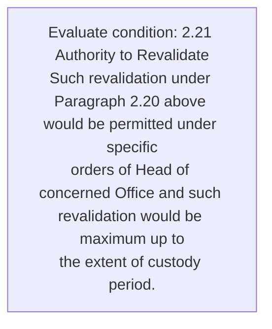
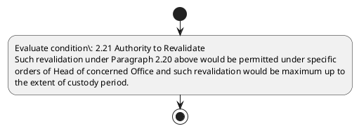

# Chapter 2 / Section 2.21: Authority to Revalidate

**Chapter Title:** General Provisions Regarding Imports and Exports

**Pages:** 9

**Purpose:** 2.21 Authority to Revalidate
Such revalidation under Paragraph 2.20 above would be permitted under specific
orders of Head of concerned Office and such revalidation would be maximum up to
the extent of custody period.

**Purpose Thanglish:** Indha Authority to Revalidate section-la, 2.21 authority to Revalidate
Such revalidation under Paragraph 2.20 above would be permitted under specific
orders of Head of concerned Office and such revalidation would be maximum up to
the extent of custody period.

**Summary:** 2.21 Authority to Revalidate
Such revalidation under Paragraph 2.20 above would be permitted under specific
orders of Head of concerned Office and such revalidation would be maximum up to
the extent of custody period.

**Business Meaning:** 2.21 Authority to Revalidate
Such revalidation under Paragraph 2.20 above would be permitted under specific
orders of Head of concerned Office and such revalidation would be maximum up to
the extent of custody period.

**Business Explanation:** 2.21 Authority to Revalidate
Such revalidation under Paragraph 2.20 above would be permitted under specific
orders of Head of concerned Office and such revalidation would be maximum up to
the extent of custody period.

**Business Explanation Thanglish:** Indha Authority to Revalidate section-la, 2.21 authority to Revalidate
Such revalidation under Paragraph 2.20 above would be permitted under specific
orders of Head of concerned Office and such revalidation would be maximum up to
the extent of custody period.

## Business Logic
- None identified

## Business Rules
- rule_id=CH2-SEC2_21-R001, rule_description=2.21 Authority to Revalidate
Such revalidation under Paragraph 2.20 above would be permitted under specific
orders of Head of concerned Office and such revalidation would be maximum up to
the extent of custody period., trigger=Authority to Revalidate, condition=2.21 Authority to Revalidate
Such revalidation under Paragraph 2.20 above would be permitted under specific
orders of Head of concerned Office and such revalidation would be maximum up to
the extent of custody period., validation=Not explicitly covered in uploaded documents., action=Manual review required., exception=No explicit exception found in uploaded documents., output=DEKAI should produce a compliance decision for 2.21 - Authority to Revalidate.

## Conditions
- 2.21 Authority to Revalidate
Such revalidation under Paragraph 2.20 above would be permitted under specific
orders of Head of concerned Office and such revalidation would be maximum up to
the extent of custody period.

## Condition Logic
- id=2.2.21.1, if=2.21 Authority to Revalidate
Such revalidation under Paragraph 2.20 above would be permitted under specific
orders of Head of concerned Office and such revalidation would be maximum up to
the extent of custody period., then=Route for review, source=2.21 Authority to Revalidate
Such revalidation under Paragraph 2.20 above would be permitted under specific
orders of Head of concerned Office and such revalidation would be maximum up to
the extent of custody period.

## Validations
- None identified

## Exceptions
- None identified

## Dependencies
- 2.20
- 1

## Authorities
- None identified

## Required Documents
- None identified

## Timelines
- None identified

## Actions
- None identified

## Workflow
- Evaluate condition: 2.21 Authority to Revalidate
Such revalidation under Paragraph 2.20 above would be permitted under specific
orders of Head of concerned Office and such revalidation would be maximum up to
the extent of custody period.

## Workflow ASCII
```text
Authority to Revalidate
Evaluate condition: 2.21 Authority to Revalidate
Such revalidation under Paragraph 2.20 above would be permitted under specific
orders of Head of concerned Office and such revalidation would be maximum up to
the extent of custody period.
```

## Decision Tree
- IF section 2.21 applies THEN proceed with standard DGFT workflow

## Decision Tree ASCII
```text
Authority to Revalidate Decision
IF section 2.21 applies THEN proceed with standard DGFT workflow
```

## Examples
- User asks to process Authority to Revalidate; the platform checks conditions, validations, and documents before action.

**Real-world Example:** Example: an importer or exporter invokes Authority to Revalidate, submits the prescribed DGFT records, and DEKAI uses the extracted rules to follow the authority to revalidate process.

**Real-world Example Thanglish:** Indha Authority to Revalidate section-la, Example: an importer or exporter invokes authority to Revalidate, submits the prescribed DGFT records, and DEKAI uses the extracted rules to follow the authority to revalidate process.

## AI Rules
- None identified

## Database Fields
- name=section_code, type=string, required=True, source=parsed_section_heading
- name=section_title, type=string, required=True, source=parsed_section_heading
- name=and_flag, type=boolean, required=False, source=keyword:and
- name=the_flag, type=boolean, required=False, source=keyword:the
- name=such_flag, type=boolean, required=False, source=keyword:Such
- name=head_flag, type=boolean, required=False, source=keyword:Head
- name=under_flag, type=boolean, required=False, source=keyword:under
- name=above_flag, type=boolean, required=False, source=keyword:above
- name=would_flag, type=boolean, required=False, source=keyword:would
- name=orders_flag, type=boolean, required=False, source=keyword:orders

## API Requirements
- method=GET, path=/api/dgft/sections/2.21, purpose=Retrieve knowledge payload for section 2.21, query_params=['include=workflow,decision_tree,validations'], response_fields=['section', 'title', 'summary', 'conditions', 'validations', 'exceptions', 'workflow', 'decision_tree']
- method=POST, path=/api/dgft/Authority-to-Revalidate/validate, purpose=Validate inputs and documents for Authority to Revalidate, request_fields=['section_code', 'section_title'], response_fields=['status', 'errors', 'warnings', 'next_actions']

## UI Screens
- screen_id=Authority_to_Revalidate_overview, name=Authority to Revalidate Overview, purpose=Show section summary, authority, timeline, and eligibility cues., widgets=['summary_card', 'conditions_table', 'authority_badges', 'timeline_panel']
- screen_id=Authority_to_Revalidate_submission, name=Authority to Revalidate Submission, purpose=Capture applicant data and supporting documents., widgets=['dynamic_form', 'document_uploader', 'validation_panel', 'next_action_footer'], fields=['section_code', 'section_title', 'and_flag', 'the_flag', 'such_flag', 'head_flag', 'under_flag', 'above_flag']

## Error Messages
- Validation failed because the section requirements were not fully met.

## FAQ
- question_en=What is the purpose of section 2.21?, answer_en=2.21 Authority to Revalidate
Such revalidation under Paragraph 2.20 above would be permitted under specific
orders of Head of concerned Office and such revalidation would be maximum up to
the extent of custody period., question_thanglish=Indha Authority to Revalidate section-la, What is the purpose of section 2.21?, answer_thanglish=Indha Authority to Revalidate section-la, 2.21 authority to Revalidate
Such revalidation under Paragraph 2.20 above would be permitted under specific
orders of Head of concerned Office and such revalidation would be maximum up to
the extent of custody period.
- question_en=What documents are required under Authority to Revalidate?, answer_en=Not explicitly covered in uploaded documents., question_thanglish=Indha Authority to Revalidate section-la, What documents are required under authority to Revalidate?, answer_thanglish=Indha Authority to Revalidate section-la, Not explicitly covered in uploaded documents.
- question_en=Which authority handles Authority to Revalidate?, answer_en=Not explicitly covered in uploaded documents., question_thanglish=Indha Authority to Revalidate section-la, Which authority handles authority to Revalidate?, answer_thanglish=Indha Authority to Revalidate section-la, Not explicitly covered in uploaded documents.

## Questions Users May Ask
- What does Authority to Revalidate require?
- Which documents are needed for Authority to Revalidate?
- How does DEKAI validate Authority to Revalidate requests?

## Expected AI Answers
- Authority to Revalidate requires the platform to interpret the section text, apply the extracted business rules, and present the correct next action.
- Required documents are inferred from the section text: no explicit documents were detected.
- DEKAI validates Authority to Revalidate by checking conditions, required documents, authority references, and exception clauses before recommending an outcome.

## AI Q&A Examples
- question_en=User asks: How do I comply with Authority to Revalidate?, answer_en=AI answers: DEKAI should evaluate section 2.21, apply the extracted rules, and guide the user through Evaluate condition: 2.21 Authority to Revalidate
Such revalidation under Paragraph 2.20 above would be permitted under specific
orders of Head of concerned Office and such revalidation would be maximum up to
the extent of custody period.., question_thanglish=Indha Authority to Revalidate section-la, User asks: How do I comply with authority to Revalidate?, answer_thanglish=Indha Authority to Revalidate section-la, AI answers: DEKAI should evaluate section 2.21, apply the extracted rules, and guide the user through Evaluate condition: 2.21 authority to Revalidate
Such revalidation under Paragraph 2.20 above would be permitted under specific
orders of Head of concerned Office and such revalidation would be maximum up to
the extent of custody period..
- question_en=User asks: Which validations apply to Authority to Revalidate?, answer_en=AI answers: Applicable validations are not explicitly covered in the uploaded documents., question_thanglish=Indha Authority to Revalidate section-la, User asks: Which validations apply to authority to Revalidate?, answer_thanglish=Indha Authority to Revalidate section-la, AI answers: Applicable validations are not explicitly covered in the uploaded documents.

## DEKAI AI Implementation Notes
- Capture chapter 2, section 2.21, title, and page references as immutable knowledge metadata.
- Bind validations for Authority to Revalidate into a rule engine keyed by the rule IDs extracted for this section.
- Show contextual links to related sections: 2.20, 1.

## DEKAI AI Implementation Notes Thanglish
- Indha Authority to Revalidate section-la, Capture chapter 2, section 2.21, title, and page references as immutable knowledge metadata.
- Indha Authority to Revalidate section-la, Bind validations for authority to Revalidate into a rule engine keyed by the rule IDs extracted for this section.
- Indha Authority to Revalidate section-la, Show contextual links to related sections: 2.20, 1.

## AI Metadata
- Keywords: and, the, Such, Head, under, above, would, orders, Office, extent, period, maximum, custody, specific, Authority, Paragraph, permitted, concerned, Revalidate, revalidation
- Search Keywords: and, the, Such, Head, under, above, would, orders, Office, extent, period, maximum, custody, specific, Authority, Paragraph, permitted, concerned, Revalidate, revalidation
- Intent: Provide knowledge guidance for Authority to Revalidate.
- Tags: 2.21, Authority to Revalidate, dgft
- Related Sections: 2.20, 1
- Related Chapters: 
- Related Rules: 

## Mermaid


## PlantUML

