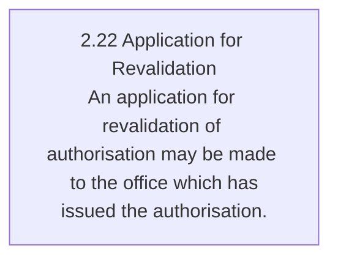
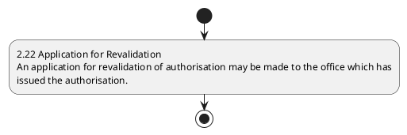

# Chapter 2 / Section 2.22: Application for Revalidation

**Chapter Title:** General Provisions Regarding Imports and Exports

**Pages:** 9

**Purpose:** 2.22 Application for Revalidation
An application for revalidation of authorisation may be made to the office which has
issued the authorisation.

**Purpose Thanglish:** Indha Application for Revalidation section-la, 2.22 application for Revalidation
An application for revalidation of authorisation may be made to the office which has
issued the authorisation.

**Summary:** 2.22 Application for Revalidation
An application for revalidation of authorisation may be made to the office which has
issued the authorisation. PROCEDURE FOR ISSUING DUPLICATE COPIES

**Business Meaning:** 2.22 Application for Revalidation
An application for revalidation of authorisation may be made to the office which has
issued the authorisation.

**Business Explanation:** 2.22 Application for Revalidation
An application for revalidation of authorisation may be made to the office which has
issued the authorisation. PROCEDURE FOR ISSUING DUPLICATE COPIES

**Business Explanation Thanglish:** Indha Application for Revalidation section-la, 2.22 application for Revalidation
An application for revalidation of authorisation may be made to the office which has
issued the authorisation. PROCEDURE FOR ISSUING DUPLICATE COPIES

## Business Logic
- None identified

## Business Rules
- rule_id=CH2-SEC2_22-R001, rule_description=IF validations pass THEN recommend action: 2.22 Application for Revalidation
An application for revalidation of authorisation may be made to the office which has
issued the authorisation., trigger=Application for Revalidation, condition=Section 2.22 is applicable, validation=Not explicitly covered in uploaded documents., action=2.22 Application for Revalidation
An application for revalidation of authorisation may be made to the office which has
issued the authorisation., exception=No explicit exception found in uploaded documents., output=DEKAI should produce a compliance decision for 2.22 - Application for Revalidation.

## Conditions
- None identified

## Condition Logic
- id=2.2.22.1, if=Section 2.22 is applicable, then=2.22 Application for Revalidation
An application for revalidation of authorisation may be made to the office which has
issued the authorisation., source=Derived from uploaded documents

## Validations
- None identified

## Exceptions
- None identified

## Dependencies
- None identified

## Authorities
- None identified

## Required Documents
- 2.22 Application for Revalidation
An application for revalidation of authorisation may be made to the office which has
issued the authorisation.

## Timelines
- None identified

## Actions
- 2.22 Application for Revalidation
An application for revalidation of authorisation may be made to the office which has
issued the authorisation.

## Workflow
- 2.22 Application for Revalidation
An application for revalidation of authorisation may be made to the office which has
issued the authorisation.

## Workflow ASCII
```text
Application for Revalidation
2.22 Application for Revalidation
An application for revalidation of authorisation may be made to the office which has
issued the authorisation.
```

## Decision Tree
- IF section 2.22 applies THEN 2.22 Application for Revalidation
An application for revalidation of authorisation may be made to the office which has
issued the authorisation.

## Decision Tree ASCII
```text
Application for Revalidation Decision
IF section 2.22 applies THEN 2.22 Application for Revalidation
An application for revalidation of authorisation may be made to the office which has
issued the authorisation.
```

## Examples
- User asks to process Application for Revalidation; the platform checks conditions, validations, and documents before action.

**Real-world Example:** Example: an importer or exporter invokes Application for Revalidation, submits 2.22 Application for Revalidation
An application for revalidation of authorisation may be made to the office which has
issued the authorisation., and DEKAI uses the extracted rules to 2.22 application for revalidation
an application for revalidation of authorisation may be made to the office which has
issued the authorisation..

**Real-world Example Thanglish:** Indha Application for Revalidation section-la, Example: an importer or exporter invokes application for Revalidation, submits 2.22 application for Revalidation
An application for revalidation of authorisation may be made to the office which has
issued the authorisation., and DEKAI uses the extracted rules to 2.22 application for revalidation
an application for revalidation of authorisation may be made to the office which has
issued the authorisation..

## AI Rules
- IF validations pass THEN recommend action: 2.22 Application for Revalidation
An application for revalidation of authorisation may be made to the office which has
issued the authorisation.

## Database Fields
- name=section_code, type=string, required=True, source=parsed_section_heading
- name=section_title, type=string, required=True, source=parsed_section_heading
- name=for_flag, type=boolean, required=False, source=keyword:for
- name=may_flag, type=boolean, required=False, source=keyword:may
- name=the_flag, type=boolean, required=False, source=keyword:the
- name=has_flag, type=boolean, required=False, source=keyword:has
- name=made_flag, type=boolean, required=False, source=keyword:made
- name=which_flag, type=boolean, required=False, source=keyword:which
- name=office_flag, type=boolean, required=False, source=keyword:office
- name=issued_flag, type=boolean, required=False, source=keyword:issued
- name=document_1_submitted, type=boolean, required=True, source=2.22 Application for Revalidation
An application for revalidation of authorisation may be made to the office which has
issued the authorisation.

## API Requirements
- method=GET, path=/api/dgft/sections/2.22, purpose=Retrieve knowledge payload for section 2.22, query_params=['include=workflow,decision_tree,validations'], response_fields=['section', 'title', 'summary', 'conditions', 'validations', 'exceptions', 'workflow', 'decision_tree']
- method=POST, path=/api/dgft/Application-for-Revalidation/validate, purpose=Validate inputs and documents for Application for Revalidation, request_fields=['section_code', 'section_title', 'document_1_submitted'], response_fields=['status', 'errors', 'warnings', 'next_actions']
- method=POST, path=/api/dgft/Application-for-Revalidation/execute, purpose=Trigger business action for 2.22 Application for Revalidation
An application for revalidation of authorisation may be made to the office which has
issued the authorisation., request_fields=['section_code', 'section_title', 'document_1_submitted'], response_fields=['reference_id', 'status', 'authority', 'timeline']

## UI Screens
- screen_id=Application_for_Revalidation_overview, name=Application for Revalidation Overview, purpose=Show section summary, authority, timeline, and eligibility cues., widgets=['summary_card', 'conditions_table', 'authority_badges', 'timeline_panel']
- screen_id=Application_for_Revalidation_submission, name=Application for Revalidation Submission, purpose=Capture applicant data and supporting documents., widgets=['dynamic_form', 'document_uploader', 'validation_panel', 'next_action_footer'], fields=['section_code', 'section_title', 'for_flag', 'may_flag', 'the_flag', 'has_flag', 'made_flag', 'which_flag']

## Error Messages
- Validation failed because the section requirements were not fully met.

## FAQ
- question_en=What is the purpose of section 2.22?, answer_en=2.22 Application for Revalidation
An application for revalidation of authorisation may be made to the office which has
issued the authorisation. PROCEDURE FOR ISSUING DUPLICATE COPIES, question_thanglish=Indha Application for Revalidation section-la, What is the purpose of section 2.22?, answer_thanglish=Indha Application for Revalidation section-la, 2.22 application for Revalidation
An application for revalidation of authorisation may be made to the office which has
issued the authorisation. PROCEDURE FOR ISSUING DUPLICATE COPIES
- question_en=What documents are required under Application for Revalidation?, answer_en=2.22 Application for Revalidation
An application for revalidation of authorisation may be made to the office which has
issued the authorisation., question_thanglish=Indha Application for Revalidation section-la, What documents are required under application for Revalidation?, answer_thanglish=Indha Application for Revalidation section-la, 2.22 application for Revalidation
An application for revalidation of authorisation may be made to the office which has
issued the authorisation.
- question_en=Which authority handles Application for Revalidation?, answer_en=Not explicitly covered in uploaded documents., question_thanglish=Indha Application for Revalidation section-la, Which authority handles application for Revalidation?, answer_thanglish=Indha Application for Revalidation section-la, Not explicitly covered in uploaded documents.

## Questions Users May Ask
- What does Application for Revalidation require?
- Which documents are needed for Application for Revalidation?
- How does DEKAI validate Application for Revalidation requests?
- What action should be taken for Application for Revalidation?

## Expected AI Answers
- Application for Revalidation requires the platform to interpret the section text, apply the extracted business rules, and present the correct next action.
- Required documents are inferred from the section text: 2.22 Application for Revalidation
An application for revalidation of authorisation may be made to the office which has
issued the authorisation.
- DEKAI validates Application for Revalidation by checking conditions, required documents, authority references, and exception clauses before recommending an outcome.
- The primary extracted action is: 2.22 Application for Revalidation
An application for revalidation of authorisation may be made to the office which has
issued the authorisation.

## AI Q&A Examples
- question_en=User asks: How do I comply with Application for Revalidation?, answer_en=AI answers: DEKAI should evaluate section 2.22, apply the extracted rules, and guide the user through 2.22 Application for Revalidation
An application for revalidation of authorisation may be made to the office which has
issued the authorisation.., question_thanglish=Indha Application for Revalidation section-la, User asks: How do I comply with application for Revalidation?, answer_thanglish=Indha Application for Revalidation section-la, AI answers: DEKAI should evaluate section 2.22, apply the extracted rules, and guide the user through 2.22 application for Revalidation
An application for revalidation of authorisation may be made to the office which has
issued the authorisation..
- question_en=User asks: Which validations apply to Application for Revalidation?, answer_en=AI answers: Applicable validations are not explicitly covered in the uploaded documents., question_thanglish=Indha Application for Revalidation section-la, User asks: Which validations apply to application for Revalidation?, answer_thanglish=Indha Application for Revalidation section-la, AI answers: Applicable validations are not explicitly covered in the uploaded documents.

## DEKAI AI Implementation Notes
- Capture chapter 2, section 2.22, title, and page references as immutable knowledge metadata.
- Bind validations for Application for Revalidation into a rule engine keyed by the rule IDs extracted for this section.
- Expose document upload controls for: 2.22 Application for Revalidation
An application for revalidation of authorisation may be made to the office which has
issued the authorisation..

## DEKAI AI Implementation Notes Thanglish
- Indha Application for Revalidation section-la, Capture chapter 2, section 2.22, title, and page references as immutable knowledge metadata.
- Indha Application for Revalidation section-la, Bind validations for application for Revalidation into a rule engine keyed by the rule IDs extracted for this section.
- Indha Application for Revalidation section-la, Expose document upload controls for: 2.22 application for Revalidation
An application for revalidation of authorisation may be made to the office which has
issued the authorisation..

## AI Metadata
- Keywords: for, may, the, has, made, which, office, issued, COPIES, ISSUING, PROCEDURE, DUPLICATE, Application, Revalidation, authorisation
- Search Keywords: for, may, the, has, made, which, office, issued, COPIES, ISSUING, PROCEDURE, DUPLICATE, Application, Revalidation, authorisation
- Intent: Support Application for Revalidation processing and compliance validation.
- Tags: 2.22, Application for Revalidation, document-driven, dgft
- Related Sections: 
- Related Chapters: 
- Related Rules: 

## Mermaid


## PlantUML

