# Chapter 2 / Section 2.23: Duplicate copies of Export / Import Authorisation

**Chapter Title:** General Provisions Regarding Imports and Exports

**Pages:** 9, 10

**Purpose:** 2.23 Duplicate copies of Export / Import Authorisation
Where a physical copy of Authorisation/Permissions/ Licence / Certificate / is lost or
misplaced, an application for issue of a duplicate may be made along with self-
pg.

**Purpose Thanglish:** Indha Duplicate copies of Export / Import Authorisation section-la, 2.23 Duplicate copies of export / import Authorisation
Where a physical copy of Authorisation/Permissions/ licence / Certificate / is lost or
misplaced, an application for issue of a duplicate may be made along with self-
pg.

**Summary:** 2.23 Duplicate copies of Export / Import Authorisation
Where a physical copy of Authorisation/Permissions/ Licence / Certificate / is lost or
misplaced, an application for issue of a duplicate may be made along with self-
pg. 18
(i)
If Authorisation/Scrip or any amendment thereof could not be transmitted to
Customs Server within fifteen working days from the date of issue/amendment;
(ii)
If Authorisation/Scrip rejected by Customs server with error Code
(iii)
If request for issue of waiver of Bond/EODC was not considered within the
period specified under Para 11.10 of HBP, where complete application was
submitted within the validity of the Authorisation. In such cases, revalidation shall be allowed from the date of endorsement for the
period of delay or six months, whichever is less.

**Business Meaning:** Duplicate copies of Export / Import Authorisation governs how DGFT business controls should be applied, validated, and enforced.

**Business Explanation:** Duplicate copies of Export / Import Authorisation explains the operating rule set that DEKAI should enforce. Key control points include In such cases, revalidation shall be allowed from the date of endorsement for the
period of delay or six months, whichever is less. The section also drives actions such as 2.23 Duplicate copies of Export / Import Authorisation
Where a physical copy of Authorisation/Permissions/ Licence / Certificate / is lost or
misplaced, an application for issue of a duplicate may be made along with self-
pg..

**Business Explanation Thanglish:** Indha Duplicate copies of Export / Import Authorisation section-la, Duplicate copies of export / import Authorisation explains the operating rule set that DEKAI should enforce. Key control points include In such cases, revalidation kandippa be allowed from the date of endorsement for the
period of delay or six months, whichever is less. The section also drives actions such as 2.23 Duplicate copies of export / import Authorisation
Where a physical copy of Authorisation/Permissions/ licence / Certificate / is lost or
misplaced, an application for issue of a duplicate may be made along with self-
pg..

## Business Logic
- In such cases, revalidation shall be allowed from the date of endorsement for the
period of delay or six months, whichever is less.
- In such a case, RA shall allow revalidation for a period of 6 months (validity of 5
months is subsumed) from the date of endorsement.
- The applicant shall submit request for endorsement of Authorisation/Scrip along with
screen shot of DGFT server as well as Customs Server in support of his claim.
- RA shall
verify the same before revalidation is allowed.
- However, request must be made to RA concerned within a month from the date of
final acceptance of Authorisation/Scrip in the Customs Server.
- Notwithstanding anything contained above, these provisions of revalidation shall not
apply wherever, the authorisation/scrip holder had clear 6 months period in hand for
utilisation.

## Business Rules
- rule_id=CH2-SEC2_23-R001, rule_description=In such cases, revalidation shall be allowed from the date of endorsement for the
period of delay or six months, whichever is less., trigger=Duplicate copies of Export / Import Authorisation, condition=2.23 Duplicate copies of Export / Import Authorisation
Where a physical copy of Authorisation/Permissions/ Licence / Certificate / is lost or
misplaced, an application for issue of a duplicate may be made along with self-
pg., validation=18
(i)
If Authorisation/Scrip or any amendment thereof could not be transmitted to
Customs Server within fifteen working days from the date of issue/amendment;
(ii)
If Authorisation/Scrip rejected by Customs server with error Code
(iii)
If request for issue of waiver of Bond/EODC was not considered within the
period specified under Para 11.10 of HBP, where complete application was
submitted within the validity of the Authorisation., action=2.23 Duplicate copies of Export / Import Authorisation
Where a physical copy of Authorisation/Permissions/ Licence / Certificate / is lost or
misplaced, an application for issue of a duplicate may be made along with self-
pg., exception=It was transmitted to Customs
server on 01.04.2017 by DGFT server but it is accepted by Customs server on
31.10.2017., output=DEKAI should produce a compliance decision for 2.23 - Duplicate copies of Export / Import Authorisation.
- rule_id=CH2-SEC2_23-R002, rule_description=In such a case, RA shall allow revalidation for a period of 6 months (validity of 5
months is subsumed) from the date of endorsement., trigger=Duplicate copies of Export / Import Authorisation, condition=18
(i)
If Authorisation/Scrip or any amendment thereof could not be transmitted to
Customs Server within fifteen working days from the date of issue/amendment;
(ii)
If Authorisation/Scrip rejected by Customs server with error Code
(iii)
If request for issue of waiver of Bond/EODC was not considered within the
period specified under Para 11.10 of HBP, where complete application was
submitted within the validity of the Authorisation., validation=In such cases, revalidation shall be allowed from the date of endorsement for the
period of delay or six months, whichever is less., action=18
(i)
If Authorisation/Scrip or any amendment thereof could not be transmitted to
Customs Server within fifteen working days from the date of issue/amendment;
(ii)
If Authorisation/Scrip rejected by Customs server with error Code
(iii)
If request for issue of waiver of Bond/EODC was not considered within the
period specified under Para 11.10 of HBP, where complete application was
submitted within the validity of the Authorisation., exception=However, request must be made to RA concerned within a month from the date of
final acceptance of Authorisation/Scrip in the Customs Server., output=DEKAI should produce a compliance decision for 2.23 - Duplicate copies of Export / Import Authorisation.
- rule_id=CH2-SEC2_23-R003, rule_description=The applicant shall submit request for endorsement of Authorisation/Scrip along with
screen shot of DGFT server as well as Customs Server in support of his claim., trigger=Duplicate copies of Export / Import Authorisation, condition=RA shall
verify the same before revalidation is allowed., validation=It was transmitted to Customs
server on 01.04.2017 by DGFT server but it is accepted by Customs server on
31.10.2017., action=For example: Authorisation is issued
having initial validity of 12 months on 01.04.2017., exception=Notwithstanding anything contained above, these provisions of revalidation shall not
apply wherever, the authorisation/scrip holder had clear 6 months period in hand for
utilisation., output=DEKAI should produce a compliance decision for 2.23 - Duplicate copies of Export / Import Authorisation.
- rule_id=CH2-SEC2_23-R004, rule_description=RA shall
verify the same before revalidation is allowed., trigger=Duplicate copies of Export / Import Authorisation, condition=Notwithstanding anything contained above, these provisions of revalidation shall not
apply wherever, the authorisation/scrip holder had clear 6 months period in hand for
utilisation., validation=In such a case, RA shall allow revalidation for a period of 6 months (validity of 5
months is subsumed) from the date of endorsement., action=The applicant shall submit request for endorsement of Authorisation/Scrip along with
screen shot of DGFT server as well as Customs Server in support of his claim., exception=Notwithstanding anything contained above, these provisions of revalidation shall not
apply wherever, the authorisation/scrip holder had clear 6 months period in hand for
utilisation., output=DEKAI should produce a compliance decision for 2.23 - Duplicate copies of Export / Import Authorisation.
- rule_id=CH2-SEC2_23-R005, rule_description=However, request must be made to RA concerned within a month from the date of
final acceptance of Authorisation/Scrip in the Customs Server., trigger=Duplicate copies of Export / Import Authorisation, condition=18
declaration, as given in Appendix 2M, to concerned office where the original Licence
was issued., validation=The applicant shall submit request for endorsement of Authorisation/Scrip along with
screen shot of DGFT server as well as Customs Server in support of his claim., action=RA shall
verify the same before revalidation is allowed., exception=Notwithstanding anything contained above, these provisions of revalidation shall not
apply wherever, the authorisation/scrip holder had clear 6 months period in hand for
utilisation., output=DEKAI should produce a compliance decision for 2.23 - Duplicate copies of Export / Import Authorisation.
- rule_id=CH2-SEC2_23-R006, rule_description=Notwithstanding anything contained above, these provisions of revalidation shall not
apply wherever, the authorisation/scrip holder had clear 6 months period in hand for
utilisation., trigger=Duplicate copies of Export / Import Authorisation, condition=18
declaration, as given in Appendix 2M, to concerned office where the original Licence
was issued., validation=RA shall
verify the same before revalidation is allowed., action=Notwithstanding anything contained above, these provisions of revalidation shall not
apply wherever, the authorisation/scrip holder had clear 6 months period in hand for
utilisation., exception=Notwithstanding anything contained above, these provisions of revalidation shall not
apply wherever, the authorisation/scrip holder had clear 6 months period in hand for
utilisation., output=DEKAI should produce a compliance decision for 2.23 - Duplicate copies of Export / Import Authorisation.

## Conditions
- 2.23 Duplicate copies of Export / Import Authorisation
Where a physical copy of Authorisation/Permissions/ Licence / Certificate / is lost or
misplaced, an application for issue of a duplicate may be made along with self-
pg.
- 18
(i)
If Authorisation/Scrip or any amendment thereof could not be transmitted to
Customs Server within fifteen working days from the date of issue/amendment;
(ii)
If Authorisation/Scrip rejected by Customs server with error Code
(iii)
If request for issue of waiver of Bond/EODC was not considered within the
period specified under Para 11.10 of HBP, where complete application was
submitted within the validity of the Authorisation.
- RA shall
verify the same before revalidation is allowed.
- Notwithstanding anything contained above, these provisions of revalidation shall not
apply wherever, the authorisation/scrip holder had clear 6 months period in hand for
utilisation.
- 18
declaration, as given in Appendix 2M, to concerned office where the original Licence
was issued.

## Condition Logic
- id=2.2.23.1, if=2.23 Duplicate copies of Export / Import Authorisation
Where a physical copy of Authorisation/Permissions/ Licence / Certificate / is lost or
misplaced, an application for issue of a duplicate may be made along with self-
pg., then=2.23 Duplicate copies of Export / Import Authorisation
Where a physical copy of Authorisation/Permissions/ Licence / Certificate / is lost or
misplaced, an application for issue of a duplicate may be made along with self-
pg., source=2.23 Duplicate copies of Export / Import Authorisation
Where a physical copy of Authorisation/Permissions/ Licence / Certificate / is lost or
misplaced, an application for issue of a duplicate may be made along with self-
pg.
- id=2.2.23.2, if=18
(i)
If Authorisation/Scrip or any amendment thereof could not be transmitted to
Customs Server within fifteen working days from the date of issue/amendment;
(ii)
If Authorisation/Scrip rejected by Customs server with error Code
(iii)
If request for issue of waiver of Bond/EODC was not considered within the
period specified under Para 11.10 of HBP, where complete application was
submitted within the validity of the Authorisation., then=2.23 Duplicate copies of Export / Import Authorisation
Where a physical copy of Authorisation/Permissions/ Licence / Certificate / is lost or
misplaced, an application for issue of a duplicate may be made along with self-
pg., source=18
(i)
If Authorisation/Scrip or any amendment thereof could not be transmitted to
Customs Server within fifteen working days from the date of issue/amendment;
(ii)
If Authorisation/Scrip rejected by Customs server with error Code
(iii)
If request for issue of waiver of Bond/EODC was not considered within the
period specified under Para 11.10 of HBP, where complete application was
submitted within the validity of the Authorisation.
- id=2.2.23.3, if=RA shall
verify the same before revalidation is allowed., then=2.23 Duplicate copies of Export / Import Authorisation
Where a physical copy of Authorisation/Permissions/ Licence / Certificate / is lost or
misplaced, an application for issue of a duplicate may be made along with self-
pg., source=RA shall
verify the same before revalidation is allowed.
- id=2.2.23.4, if=Notwithstanding anything contained above, these provisions of revalidation shall not
apply wherever, the authorisation/scrip holder had clear 6 months period in hand for
utilisation., then=2.23 Duplicate copies of Export / Import Authorisation
Where a physical copy of Authorisation/Permissions/ Licence / Certificate / is lost or
misplaced, an application for issue of a duplicate may be made along with self-
pg., source=Notwithstanding anything contained above, these provisions of revalidation shall not
apply wherever, the authorisation/scrip holder had clear 6 months period in hand for
utilisation.
- id=2.2.23.5, if=18
declaration, as given in Appendix 2M, to concerned office where the original Licence
was issued., then=2.23 Duplicate copies of Export / Import Authorisation
Where a physical copy of Authorisation/Permissions/ Licence / Certificate / is lost or
misplaced, an application for issue of a duplicate may be made along with self-
pg., source=18
declaration, as given in Appendix 2M, to concerned office where the original Licence
was issued.

## Validations
- 18
(i)
If Authorisation/Scrip or any amendment thereof could not be transmitted to
Customs Server within fifteen working days from the date of issue/amendment;
(ii)
If Authorisation/Scrip rejected by Customs server with error Code
(iii)
If request for issue of waiver of Bond/EODC was not considered within the
period specified under Para 11.10 of HBP, where complete application was
submitted within the validity of the Authorisation.
- In such cases, revalidation shall be allowed from the date of endorsement for the
period of delay or six months, whichever is less.
- It was transmitted to Customs
server on 01.04.2017 by DGFT server but it is accepted by Customs server on
31.10.2017.
- In such a case, RA shall allow revalidation for a period of 6 months (validity of 5
months is subsumed) from the date of endorsement.
- The applicant shall submit request for endorsement of Authorisation/Scrip along with
screen shot of DGFT server as well as Customs Server in support of his claim.
- RA shall
verify the same before revalidation is allowed.
- However, request must be made to RA concerned within a month from the date of
final acceptance of Authorisation/Scrip in the Customs Server.
- Notwithstanding anything contained above, these provisions of revalidation shall not
apply wherever, the authorisation/scrip holder had clear 6 months period in hand for
utilisation.

## Exceptions
- It was transmitted to Customs
server on 01.04.2017 by DGFT server but it is accepted by Customs server on
31.10.2017.
- However, request must be made to RA concerned within a month from the date of
final acceptance of Authorisation/Scrip in the Customs Server.
- Notwithstanding anything contained above, these provisions of revalidation shall not
apply wherever, the authorisation/scrip holder had clear 6 months period in hand for
utilisation.

## Dependencies
- 11.10

## Authorities
- Customs
- If Authorisation/Scrip rejected by Customs
- DGFT
- It was transmitted to Customs
- DGFT server but it is accepted by Customs
- RA
- DGFT server as well as Customs
- Authorisation/Scrip in the Customs

## Required Documents
- Where a physical copy of Authorisation/Permissions/ Licence
- 18
(i)
If Authorisation/Scrip or any amendment thereof could not be transmitted to
Customs Server within fifteen working days from the date of issue/amendment;
(ii)
If Authorisation/Scrip rejected by Customs server with error Code
(iii)
If request for issue of waiver of Bond/EODC was not considered within the
period specified under Para 11.10 of HBP, where complete application was
submitted within the validity of the Authorisation.
- 18
declaration, as given in Appendix 2M, to concerned office where the original Licence
was issued.

## Timelines
- 18
(i)
If Authorisation/Scrip or any amendment thereof could not be transmitted to
Customs Server within fifteen working days from the date of issue/amendment;
(ii)
If Authorisation/Scrip rejected by Customs server with error Code
(iii)
If request for issue of waiver of Bond/EODC was not considered within the
period specified under Para 11.10 of HBP, where complete application was
submitted within the validity of the Authorisation.
- In such cases, revalidation shall be allowed from the date of endorsement for the
period of delay or six months, whichever is less.
- For example: Authorisation is issued
having initial validity of 12 months on 01.04.2017.
- So, the Authorisation holder loses 7 months (still 5 months validity is
left).
- In such a case, RA shall allow revalidation for a period of 6 months (validity of 5
months is subsumed) from the date of endorsement.
- RA shall
verify the same before revalidation is allowed.
- However, request must be made to RA concerned within a month from the date of
final acceptance of Authorisation/Scrip in the Customs Server.
- Notwithstanding anything contained above, these provisions of revalidation shall not
apply wherever, the authorisation/scrip holder had clear 6 months period in hand for
utilisation.

## Actions
- 2.23 Duplicate copies of Export / Import Authorisation
Where a physical copy of Authorisation/Permissions/ Licence / Certificate / is lost or
misplaced, an application for issue of a duplicate may be made along with self-
pg.
- 18
(i)
If Authorisation/Scrip or any amendment thereof could not be transmitted to
Customs Server within fifteen working days from the date of issue/amendment;
(ii)
If Authorisation/Scrip rejected by Customs server with error Code
(iii)
If request for issue of waiver of Bond/EODC was not considered within the
period specified under Para 11.10 of HBP, where complete application was
submitted within the validity of the Authorisation.
- For example: Authorisation is issued
having initial validity of 12 months on 01.04.2017.
- The applicant shall submit request for endorsement of Authorisation/Scrip along with
screen shot of DGFT server as well as Customs Server in support of his claim.
- RA shall
verify the same before revalidation is allowed.
- Notwithstanding anything contained above, these provisions of revalidation shall not
apply wherever, the authorisation/scrip holder had clear 6 months period in hand for
utilisation.
- 18
declaration, as given in Appendix 2M, to concerned office where the original Licence
was issued.

## Workflow
- Evaluate condition: 2.23 Duplicate copies of Export / Import Authorisation
Where a physical copy of Authorisation/Permissions/ Licence / Certificate / is lost or
misplaced, an application for issue of a duplicate may be made along with self-
pg.
- Evaluate condition: 18
(i)
If Authorisation/Scrip or any amendment thereof could not be transmitted to
Customs Server within fifteen working days from the date of issue/amendment;
(ii)
If Authorisation/Scrip rejected by Customs server with error Code
(iii)
If request for issue of waiver of Bond/EODC was not considered within the
period specified under Para 11.10 of HBP, where complete application was
submitted within the validity of the Authorisation.
- Evaluate condition: RA shall
verify the same before revalidation is allowed.
- 2.23 Duplicate copies of Export / Import Authorisation
Where a physical copy of Authorisation/Permissions/ Licence / Certificate / is lost or
misplaced, an application for issue of a duplicate may be made along with self-
pg.
- 18
(i)
If Authorisation/Scrip or any amendment thereof could not be transmitted to
Customs Server within fifteen working days from the date of issue/amendment;
(ii)
If Authorisation/Scrip rejected by Customs server with error Code
(iii)
If request for issue of waiver of Bond/EODC was not considered within the
period specified under Para 11.10 of HBP, where complete application was
submitted within the validity of the Authorisation.
- For example: Authorisation is issued
having initial validity of 12 months on 01.04.2017.
- The applicant shall submit request for endorsement of Authorisation/Scrip along with
screen shot of DGFT server as well as Customs Server in support of his claim.
- RA shall
verify the same before revalidation is allowed.
- Notwithstanding anything contained above, these provisions of revalidation shall not
apply wherever, the authorisation/scrip holder had clear 6 months period in hand for
utilisation.
- Run validation: 18
(i)
If Authorisation/Scrip or any amendment thereof could not be transmitted to
Customs Server within fifteen working days from the date of issue/amendment;
(ii)
If Authorisation/Scrip rejected by Customs server with error Code
(iii)
If request for issue of waiver of Bond/EODC was not considered within the
period specified under Para 11.10 of HBP, where complete application was
submitted within the validity of the Authorisation.
- Run validation: In such cases, revalidation shall be allowed from the date of endorsement for the
period of delay or six months, whichever is less.
- Run validation: It was transmitted to Customs
server on 01.04.2017 by DGFT server but it is accepted by Customs server on
31.10.2017.
- Handle exception: It was transmitted to Customs
server on 01.04.2017 by DGFT server but it is accepted by Customs server on
31.10.2017.

## Workflow ASCII
```text
Duplicate copies of Export / Import Authorisation
Evaluate condition: 2.23 Duplicate copies of Export / Import Authorisation
Where a physical copy of Authorisation/Permissions/ Licence / Certificate / is lost or
misplaced, an application for issue of a duplicate may be made along with self-
pg.
   |
   v
Evaluate condition: 18
(i)
If Authorisation/Scrip or any amendment thereof could not be transmitted to
Customs Server within fifteen working days from the date of issue/amendment;
(ii)
If Authorisation/Scrip rejected by Customs server with error Code
(iii)
If request for issue of waiver of Bond/EODC was not considered within the
period specified under Para 11.10 of HBP, where complete application was
submitted within the validity of the Authorisation.
   |
   v
Evaluate condition: RA shall
verify the same before revalidation is allowed.
   |
   v
2.23 Duplicate copies of Export / Import Authorisation
Where a physical copy of Authorisation/Permissions/ Licence / Certificate / is lost or
misplaced, an application for issue of a duplicate may be made along with self-
pg.
   |
   v
18
(i)
If Authorisation/Scrip or any amendment thereof could not be transmitted to
Customs Server within fifteen working days from the date of issue/amendment;
(ii)
If Authorisation/Scrip rejected by Customs server with error Code
(iii)
If request for issue of waiver of Bond/EODC was not considered within the
period specified under Para 11.10 of HBP, where complete application was
submitted within the validity of the Authorisation.
   |
   v
For example: Authorisation is issued
having initial validity of 12 months on 01.04.2017.
   |
   v
The applicant shall submit request for endorsement of Authorisation/Scrip along with
screen shot of DGFT server as well as Customs Server in support of his claim.
   |
   v
RA shall
verify the same before revalidation is allowed.
   |
   v
Notwithstanding anything contained above, these provisions of revalidation shall not
apply wherever, the authorisation/scrip holder had clear 6 months period in hand for
utilisation.
   |
   v
Run validation: 18
(i)
If Authorisation/Scrip or any amendment thereof could not be transmitted to
Customs Server within fifteen working days from the date of issue/amendment;
(ii)
If Authorisation/Scrip rejected by Customs server with error Code
(iii)
If request for issue of waiver of Bond/EODC was not considered within the
period specified under Para 11.10 of HBP, where complete application was
submitted within the validity of the Authorisation.
   |
   v
Run validation: In such cases, revalidation shall be allowed from the date of endorsement for the
period of delay or six months, whichever is less.
   |
   v
Run validation: It was transmitted to Customs
server on 01.04.2017 by DGFT server but it is accepted by Customs server on
31.10.2017.
   |
   v
Handle exception: It was transmitted to Customs
server on 01.04.2017 by DGFT server but it is accepted by Customs server on
31.10.2017.
```

## Decision Tree
- IF 2.23 Duplicate copies of Export / Import Authorisation
Where a physical copy of Authorisation/Permissions/ Licence / Certificate / is lost or
misplaced, an application for issue of a duplicate may be made along with self-
pg. THEN 2.23 Duplicate copies of Export / Import Authorisation
Where a physical copy of Authorisation/Permissions/ Licence / Certificate / is lost or
misplaced, an application for issue of a duplicate may be made along with self-
pg.
- IF 18
(i)
If Authorisation/Scrip or any amendment thereof could not be transmitted to
Customs Server within fifteen working days from the date of issue/amendment;
(ii)
If Authorisation/Scrip rejected by Customs server with error Code
(iii)
If request for issue of waiver of Bond/EODC was not considered within the
period specified under Para 11.10 of HBP, where complete application was
submitted within the validity of the Authorisation. THEN 2.23 Duplicate copies of Export / Import Authorisation
Where a physical copy of Authorisation/Permissions/ Licence / Certificate / is lost or
misplaced, an application for issue of a duplicate may be made along with self-
pg.
- IF RA shall
verify the same before revalidation is allowed. THEN 2.23 Duplicate copies of Export / Import Authorisation
Where a physical copy of Authorisation/Permissions/ Licence / Certificate / is lost or
misplaced, an application for issue of a duplicate may be made along with self-
pg.
- IF Notwithstanding anything contained above, these provisions of revalidation shall not
apply wherever, the authorisation/scrip holder had clear 6 months period in hand for
utilisation. THEN 2.23 Duplicate copies of Export / Import Authorisation
Where a physical copy of Authorisation/Permissions/ Licence / Certificate / is lost or
misplaced, an application for issue of a duplicate may be made along with self-
pg.
- IF 18
declaration, as given in Appendix 2M, to concerned office where the original Licence
was issued. THEN 2.23 Duplicate copies of Export / Import Authorisation
Where a physical copy of Authorisation/Permissions/ Licence / Certificate / is lost or
misplaced, an application for issue of a duplicate may be made along with self-
pg.
- IF exception applies (It was transmitted to Customs
server on 01.04.2017 by DGFT server but it is accepted by Customs server on
31.10.2017.) THEN route to manual review
- IF exception applies (However, request must be made to RA concerned within a month from the date of
final acceptance of Authorisation/Scrip in the Customs Server.) THEN route to manual review
- IF exception applies (Notwithstanding anything contained above, these provisions of revalidation shall not
apply wherever, the authorisation/scrip holder had clear 6 months period in hand for
utilisation.) THEN route to manual review

## Decision Tree ASCII
```text
Duplicate copies of Export / Import Authorisation Decision
IF 2.23 Duplicate copies of Export / Import Authorisation
Where a physical copy of Authorisation/Permissions/ Licence / Certificate / is lost or
misplaced, an application for issue of a duplicate may be made along with self-
pg. THEN 2.23 Duplicate copies of Export / Import Authorisation
Where a physical copy of Authorisation/Permissions/ Licence / Certificate / is lost or
misplaced, an application for issue of a duplicate may be made along with self-
pg.
   |
   v
IF 18
(i)
If Authorisation/Scrip or any amendment thereof could not be transmitted to
Customs Server within fifteen working days from the date of issue/amendment;
(ii)
If Authorisation/Scrip rejected by Customs server with error Code
(iii)
If request for issue of waiver of Bond/EODC was not considered within the
period specified under Para 11.10 of HBP, where complete application was
submitted within the validity of the Authorisation. THEN 2.23 Duplicate copies of Export / Import Authorisation
Where a physical copy of Authorisation/Permissions/ Licence / Certificate / is lost or
misplaced, an application for issue of a duplicate may be made along with self-
pg.
   |
   v
IF RA shall
verify the same before revalidation is allowed. THEN 2.23 Duplicate copies of Export / Import Authorisation
Where a physical copy of Authorisation/Permissions/ Licence / Certificate / is lost or
misplaced, an application for issue of a duplicate may be made along with self-
pg.
   |
   v
IF Notwithstanding anything contained above, these provisions of revalidation shall not
apply wherever, the authorisation/scrip holder had clear 6 months period in hand for
utilisation. THEN 2.23 Duplicate copies of Export / Import Authorisation
Where a physical copy of Authorisation/Permissions/ Licence / Certificate / is lost or
misplaced, an application for issue of a duplicate may be made along with self-
pg.
   |
   v
IF 18
declaration, as given in Appendix 2M, to concerned office where the original Licence
was issued. THEN 2.23 Duplicate copies of Export / Import Authorisation
Where a physical copy of Authorisation/Permissions/ Licence / Certificate / is lost or
misplaced, an application for issue of a duplicate may be made along with self-
pg.
   |
   v
IF exception applies (It was transmitted to Customs
server on 01.04.2017 by DGFT server but it is accepted by Customs server on
31.10.2017.) THEN route to manual review
   |
   v
IF exception applies (However, request must be made to RA concerned within a month from the date of
final acceptance of Authorisation/Scrip in the Customs Server.) THEN route to manual review
   |
   v
IF exception applies (Notwithstanding anything contained above, these provisions of revalidation shall not
apply wherever, the authorisation/scrip holder had clear 6 months period in hand for
utilisation.) THEN route to manual review
```

## Examples
- For example: Authorisation is issued
having initial validity of 12 months on 01.04.2017.

**Real-world Example:** Example: an importer or exporter invokes Duplicate copies of Export / Import Authorisation, submits Where a physical copy of Authorisation/Permissions/ Licence, 18
(i)
If Authorisation/Scrip or any amendment thereof could not be transmitted to
Customs Server within fifteen working days from the date of issue/amendment;
(ii)
If Authorisation/Scrip rejected by Customs server with error Code
(iii)
If request for issue of waiver of Bond/EODC was not considered within the
period specified under Para 11.10 of HBP, where complete application was
submitted within the validity of the Authorisation., 18
declaration, as given in Appendix 2M, to concerned office where the original Licence
was issued., and DEKAI uses the extracted rules to 2.23 duplicate copies of export / import authorisation
where a physical copy of authorisation/permissions/ licence / certificate / is lost or
misplaced, an application for issue of a duplicate may be made along with self-
pg..

**Real-world Example Thanglish:** Indha Duplicate copies of Export / Import Authorisation section-la, Example: an importer or exporter invokes Duplicate copies of export / import Authorisation, submits Where a physical copy of Authorisation/Permissions/ licence, 18
(i)
If Authorisation/Scrip or any amendment thereof could not be transmitted to
Customs Server within fifteen working days from the date of issue/amendment;
(ii)
If Authorisation/Scrip rejected by Customs server with error Code
(iii)
If request for issue of waiver of Bond/EODC was not considered within the
period specified under Para 11.10 of HBP, where complete application was
submitted within the validity of the Authorisation., 18
declaration, as given in Appendix 2M, to concerned office where the original licence
was issued., and DEKAI uses the extracted rules to 2.23 duplicate copies of export / import authorisation
where a physical copy of authorisation/permissions/ licence / certificate / is lost or
misplaced, an application for issue of a duplicate may be made along with self-
pg..

## AI Rules
- IF detected context matches section rule THEN enforce: In such cases, revalidation shall be allowed from the date of endorsement for the
period of delay or six months, whichever is less.
- IF detected context matches section rule THEN enforce: In such a case, RA shall allow revalidation for a period of 6 months (validity of 5
months is subsumed) from the date of endorsement.
- IF detected context matches section rule THEN enforce: The applicant shall submit request for endorsement of Authorisation/Scrip along with
screen shot of DGFT server as well as Customs Server in support of his claim.
- IF detected context matches section rule THEN enforce: RA shall
verify the same before revalidation is allowed.
- IF detected context matches section rule THEN enforce: However, request must be made to RA concerned within a month from the date of
final acceptance of Authorisation/Scrip in the Customs Server.
- IF detected context matches section rule THEN enforce: Notwithstanding anything contained above, these provisions of revalidation shall not
apply wherever, the authorisation/scrip holder had clear 6 months period in hand for
utilisation.
- IF validations pass THEN recommend action: 2.23 Duplicate copies of Export / Import Authorisation
Where a physical copy of Authorisation/Permissions/ Licence / Certificate / is lost or
misplaced, an application for issue of a duplicate may be made along with self-
pg.

## Database Fields
- name=section_code, type=string, required=True, source=parsed_section_heading
- name=section_title, type=string, required=True, source=parsed_section_heading
- name=for_flag, type=boolean, required=False, source=keyword:for
- name=may_flag, type=boolean, required=False, source=keyword:may
- name=any_flag, type=boolean, required=False, source=keyword:any
- name=not_flag, type=boolean, required=False, source=keyword:not
- name=the_flag, type=boolean, required=False, source=keyword:the
- name=iii_flag, type=boolean, required=False, source=keyword:iii
- name=was_flag, type=boolean, required=False, source=keyword:was
- name=hbp_flag, type=boolean, required=False, source=keyword:HBP
- name=document_1_submitted, type=boolean, required=True, source=Where a physical copy of Authorisation/Permissions/ Licence
- name=document_2_submitted, type=boolean, required=True, source=18
(i)
If Authorisation/Scrip or any amendment thereof could not be transmitted to
Customs Server within fifteen working days from the date of issue/amendment;
(ii)
If Authorisation/Scrip rejected by Customs server with error Code
(iii)
If request for issue of waiver of Bond/EODC was not considered within the
period specified under Para 11.10 of HBP, where complete application was
submitted within the validity of the Authorisation.
- name=document_3_submitted, type=boolean, required=True, source=18
declaration, as given in Appendix 2M, to concerned office where the original Licence
was issued.

## API Requirements
- method=GET, path=/api/dgft/sections/2.23, purpose=Retrieve knowledge payload for section 2.23, query_params=['include=workflow,decision_tree,validations'], response_fields=['section', 'title', 'summary', 'conditions', 'validations', 'exceptions', 'workflow', 'decision_tree']
- method=POST, path=/api/dgft/Duplicate-copies-of-Export-Import-Authorisation/validate, purpose=Validate inputs and documents for Duplicate copies of Export / Import Authorisation, request_fields=['section_code', 'section_title', 'document_1_submitted', 'document_2_submitted', 'document_3_submitted'], response_fields=['status', 'errors', 'warnings', 'next_actions']
- method=POST, path=/api/dgft/Duplicate-copies-of-Export-Import-Authorisation/execute, purpose=Trigger business action for 2.23 Duplicate copies of Export / Import Authorisation
Where a physical copy of Authorisation/Permissions/ Licence / Certificate / is lost or
misplaced, an application for issue of a duplicate may be made along with self-
pg., request_fields=['section_code', 'section_title', 'document_1_submitted', 'document_2_submitted', 'document_3_submitted'], response_fields=['reference_id', 'status', 'authority', 'timeline']

## UI Screens
- screen_id=Duplicate_copies_of_Export_Import_Authorisation_overview, name=Duplicate copies of Export / Import Authorisation Overview, purpose=Show section summary, authority, timeline, and eligibility cues., widgets=['summary_card', 'conditions_table', 'authority_badges', 'timeline_panel']
- screen_id=Duplicate_copies_of_Export_Import_Authorisation_submission, name=Duplicate copies of Export / Import Authorisation Submission, purpose=Capture applicant data and supporting documents., widgets=['dynamic_form', 'document_uploader', 'validation_panel', 'next_action_footer'], fields=['section_code', 'section_title', 'for_flag', 'may_flag', 'any_flag', 'not_flag', 'the_flag', 'iii_flag']
- screen_id=Duplicate_copies_of_Export_Import_Authorisation_exceptions, name=Duplicate copies of Export / Import Authorisation Exception Review, purpose=Explain exception handling and manual review triggers., widgets=['exception_banner', 'decision_tree', 'case_notes']

## Error Messages
- Validation failed because the section requirements were not fully met.

## FAQ
- question_en=What is the purpose of section 2.23?, answer_en=Duplicate copies of Export / Import Authorisation explains the operating rule set that DEKAI should enforce. Key control points include In such cases, revalidation shall be allowed from the date of endorsement for the
period of delay or six months, whichever is less. The section also drives actions such as 2.23 Duplicate copies of Export / Import Authorisation
Where a physical copy of Authorisation/Permissions/ Licence / Certificate / is lost or
misplaced, an application for issue of a duplicate may be made along with self-
pg.., question_thanglish=Indha Duplicate copies of Export / Import Authorisation section-la, What is the purpose of section 2.23?, answer_thanglish=Indha Duplicate copies of Export / Import Authorisation section-la, Duplicate copies of export / import Authorisation explains the operating rule set that DEKAI should enforce. Key control points include In such cases, revalidation kandippa be allowed from the date of endorsement for the
period of delay or six months, whichever is less. The section also drives actions such as 2.23 Duplicate copies of export / import Authorisation
Where a physical copy of Authorisation/Permissions/ licence / Certificate / is lost or
misplaced, an application for issue of a duplicate may be made along with self-
pg..
- question_en=What documents are required under Duplicate copies of Export / Import Authorisation?, answer_en=Where a physical copy of Authorisation/Permissions/ Licence, 18
(i)
If Authorisation/Scrip or any amendment thereof could not be transmitted to
Customs Server within fifteen working days from the date of issue/amendment;
(ii)
If Authorisation/Scrip rejected by Customs server with error Code
(iii)
If request for issue of waiver of Bond/EODC was not considered within the
period specified under Para 11.10 of HBP, where complete application was
submitted within the validity of the Authorisation., 18
declaration, as given in Appendix 2M, to concerned office where the original Licence
was issued., question_thanglish=Indha Duplicate copies of Export / Import Authorisation section-la, What documents are required under Duplicate copies of export / import Authorisation?, answer_thanglish=Indha Duplicate copies of Export / Import Authorisation section-la, Where a physical copy of Authorisation/Permissions/ licence, 18
(i)
If Authorisation/Scrip or any amendment thereof could not be transmitted to
Customs Server within fifteen working days from the date of issue/amendment;
(ii)
If Authorisation/Scrip rejected by Customs server with error Code
(iii)
If request for issue of waiver of Bond/EODC was not considered within the
period specified under Para 11.10 of HBP, where complete application was
submitted within the validity of the Authorisation., 18
declaration, as given in Appendix 2M, to concerned office where the original licence
was issued.
- question_en=Which authority handles Duplicate copies of Export / Import Authorisation?, answer_en=Customs, If Authorisation/Scrip rejected by Customs, DGFT, It was transmitted to Customs, DGFT server but it is accepted by Customs, RA, DGFT server as well as Customs, Authorisation/Scrip in the Customs, question_thanglish=Indha Duplicate copies of Export / Import Authorisation section-la, Which authority handles Duplicate copies of export / import Authorisation?, answer_thanglish=Indha Duplicate copies of Export / Import Authorisation section-la, Customs, If Authorisation/Scrip rejected by Customs, DGFT, It was transmitted to Customs, DGFT server but it is accepted by Customs, RA, DGFT server as well as Customs, Authorisation/Scrip in the Customs

## Questions Users May Ask
- What does Duplicate copies of Export / Import Authorisation require?
- Which documents are needed for Duplicate copies of Export / Import Authorisation?
- How does DEKAI validate Duplicate copies of Export / Import Authorisation requests?
- What action should be taken for Duplicate copies of Export / Import Authorisation?

## Expected AI Answers
- Duplicate copies of Export / Import Authorisation requires the platform to interpret the section text, apply the extracted business rules, and present the correct next action.
- Required documents are inferred from the section text: Where a physical copy of Authorisation/Permissions/ Licence, 18
(i)
If Authorisation/Scrip or any amendment thereof could not be transmitted to
Customs Server within fifteen working days from the date of issue/amendment;
(ii)
If Authorisation/Scrip rejected by Customs server with error Code
(iii)
If request for issue of waiver of Bond/EODC was not considered within the
period specified under Para 11.10 of HBP, where complete application was
submitted within the validity of the Authorisation., 18
declaration, as given in Appendix 2M, to concerned office where the original Licence
was issued.
- DEKAI validates Duplicate copies of Export / Import Authorisation by checking conditions, required documents, authority references, and exception clauses before recommending an outcome.
- The primary extracted action is: 2.23 Duplicate copies of Export / Import Authorisation
Where a physical copy of Authorisation/Permissions/ Licence / Certificate / is lost or
misplaced, an application for issue of a duplicate may be made along with self-
pg.

## AI Q&A Examples
- question_en=User asks: How do I comply with Duplicate copies of Export / Import Authorisation?, answer_en=AI answers: DEKAI should evaluate section 2.23, apply the extracted rules, and guide the user through Evaluate condition: 2.23 Duplicate copies of Export / Import Authorisation
Where a physical copy of Authorisation/Permissions/ Licence / Certificate / is lost or
misplaced, an application for issue of a duplicate may be made along with self-
pg.., question_thanglish=Indha Duplicate copies of Export / Import Authorisation section-la, User asks: How do I comply with Duplicate copies of export / import Authorisation?, answer_thanglish=Indha Duplicate copies of Export / Import Authorisation section-la, AI answers: DEKAI should evaluate section 2.23, apply the extracted rules, and guide the user through Evaluate condition: 2.23 Duplicate copies of export / import Authorisation
Where a physical copy of Authorisation/Permissions/ licence / Certificate / is lost or
misplaced, an application for issue of a duplicate may be made along with self-
pg..
- question_en=User asks: Which validations apply to Duplicate copies of Export / Import Authorisation?, answer_en=AI answers: Applicable validations are 18
(i)
If Authorisation/Scrip or any amendment thereof could not be transmitted to
Customs Server within fifteen working days from the date of issue/amendment;
(ii)
If Authorisation/Scrip rejected by Customs server with error Code
(iii)
If request for issue of waiver of Bond/EODC was not considered within the
period specified under Para 11.10 of HBP, where complete application was
submitted within the validity of the Authorisation., In such cases, revalidation shall be allowed from the date of endorsement for the
period of delay or six months, whichever is less., It was transmitted to Customs
server on 01.04.2017 by DGFT server but it is accepted by Customs server on
31.10.2017., question_thanglish=Indha Duplicate copies of Export / Import Authorisation section-la, User asks: Which validations apply to Duplicate copies of export / import Authorisation?, answer_thanglish=Indha Duplicate copies of Export / Import Authorisation section-la, AI answers: Applicable validations are 18
(i)
If Authorisation/Scrip or any amendment thereof could not be transmitted to
Customs Server within fifteen working days from the date of issue/amendment;
(ii)
If Authorisation/Scrip rejected by Customs server with error Code
(iii)
If request for issue of waiver of Bond/EODC was not considered within the
period specified under Para 11.10 of HBP, where complete application was
submitted within the validity of the Authorisation., In such cases, revalidation kandippa be allowed from the date of endorsement for the
period of delay or six months, whichever is less., It was transmitted to Customs
server on 01.04.2017 by DGFT server but it is accepted by Customs server on
31.10.2017.

## DEKAI AI Implementation Notes
- Capture chapter 2, section 2.23, title, and page references as immutable knowledge metadata.
- Bind validations for Duplicate copies of Export / Import Authorisation into a rule engine keyed by the rule IDs extracted for this section.
- Expose document upload controls for: Where a physical copy of Authorisation/Permissions/ Licence, 18
(i)
If Authorisation/Scrip or any amendment thereof could not be transmitted to
Customs Server within fifteen working days from the date of issue/amendment;
(ii)
If Authorisation/Scrip rejected by Customs server with error Code
(iii)
If request for issue of waiver of Bond/EODC was not considered within the
period specified under Para 11.10 of HBP, where complete application was
submitted within the validity of the Authorisation., 18
declaration, as given in Appendix 2M, to concerned office where the original Licence
was issued..
- Route escalations or approvals to: Customs, If Authorisation/Scrip rejected by Customs, DGFT, It was transmitted to Customs.
- Trigger manual review when exception clauses are detected.

## DEKAI AI Implementation Notes Thanglish
- Indha Duplicate copies of Export / Import Authorisation section-la, Capture chapter 2, section 2.23, title, and page references as immutable knowledge metadata.
- Indha Duplicate copies of Export / Import Authorisation section-la, Bind validations for Duplicate copies of export / import Authorisation into a rule engine keyed by the rule IDs extracted for this section.
- Indha Duplicate copies of Export / Import Authorisation section-la, Expose document upload controls for: Where a physical copy of Authorisation/Permissions/ licence, 18
(i)
If Authorisation/Scrip or any amendment thereof could not be transmitted to
Customs Server within fifteen working days from the date of issue/amendment;
(ii)
If Authorisation/Scrip rejected by Customs server with error Code
(iii)
If request for issue of waiver of Bond/EODC was not considered within the
period specified under Para 11.10 of HBP, where complete application was
submitted within the validity of the Authorisation., 18
declaration, as given in Appendix 2M, to concerned office where the original licence
was issued..
- Indha Duplicate copies of Export / Import Authorisation section-la, Route escalations or approvals to: Customs, If Authorisation/Scrip rejected by Customs, DGFT, It was transmitted to Customs.
- Indha Duplicate copies of Export / Import Authorisation section-la, Trigger manual review when exception clauses are detected.

## AI Metadata
- Keywords: for, may, any, not, the, iii, was, HBP, six, but, his, had, copy, lost, made, with, self, days, from, date
- Search Keywords: for, may, any, not, the, iii, was, HBP, six, but, his, had, copy, lost, made, with, self, days, from, date
- Intent: Support Duplicate copies of Export / Import Authorisation processing and compliance validation.
- Tags: 2.23, Duplicate copies of Export / Import Authorisation, business-rule, document-driven, dgft
- Related Sections: 
- Related Chapters: 
- Related Rules: In such cases, revalidation shall be allowed from the date of endorsement for the
period of delay or six months, whichever is less., In such a case, RA shall allow revalidation for a period of 6 months (validity of 5
months is subsumed) from the date of endorsement., The applicant shall submit request for endorsement of Authorisation/Scrip along with
screen shot of DGFT server as well as Customs Server in support of his claim., RA shall
verify the same before revalidation is allowed., However, request must be made to RA concerned within a month from the date of
final acceptance of Authorisation/Scrip in the Customs Server.

## Mermaid

```mermaid
flowchart TD
    S1["Evaluate condition: 2.23 Duplicate copies of Export / Import Authorisation
Where a physical copy of Authorisation/Permissions/ Licence / Certificate / is lost or
misplaced, an application for issue of a duplicate may be made along with self-
pg."]
    S2["Evaluate condition: 18
(i)
If Authorisation/Scrip or any amendment thereof could not be transmitted to
Customs Server within fifteen working days from the date of issue/amendment;
(ii)
If Authorisation/Scrip rejected by Customs server with error Code
(iii)
If request for issue of waiver of Bond/EODC was not considered within the
period specified under Para 11.10 of HBP, where complete application was
submitted within the validity of the Authorisation."]
    S1 --> S2
    S3["Evaluate condition: RA shall
verify the same before revalidation is allowed."]
    S2 --> S3
    S4["2.23 Duplicate copies of Export / Import Authorisation
Where a physical copy of Authorisation/Permissions/ Licence / Certificate / is lost or
misplaced, an application for issue of a duplicate may be made along with self-
pg."]
    S3 --> S4
    S5["18
(i)
If Authorisation/Scrip or any amendment thereof could not be transmitted to
Customs Server within fifteen working days from the date of issue/amendment;
(ii)
If Authorisation/Scrip rejected by Customs server with error Code
(iii)
If request for issue of waiver of Bond/EODC was not considered within the
period specified under Para 11.10 of HBP, where complete application was
submitted within the validity of the Authorisation."]
    S4 --> S5
    S6["For example: Authorisation is issued
having initial validity of 12 months on 01.04.2017."]
    S5 --> S6
    S7["The applicant shall submit request for endorsement of Authorisation/Scrip along with
screen shot of DGFT server as well as Customs Server in support of his claim."]
    S6 --> S7
    S8["RA shall
verify the same before revalidation is allowed."]
    S7 --> S8
    S9["Notwithstanding anything contained above, these provisions of revalidation shall not
apply wherever, the authorisation/scrip holder had clear 6 months period in hand for
utilisation."]
    S8 --> S9
    S10["Run validation: 18
(i)
If Authorisation/Scrip or any amendment thereof could not be transmitted to
Customs Server within fifteen working days from the date of issue/amendment;
(ii)
If Authorisation/Scrip rejected by Customs server with error Code
(iii)
If request for issue of waiver of Bond/EODC was not considered within the
period specified under Para 11.10 of HBP, where complete application was
submitted within the validity of the Authorisation."]
    S9 --> S10
    S11["Run validation: In such cases, revalidation shall be allowed from the date of endorsement for the
period of delay or six months, whichever is less."]
    S10 --> S11
    S12["Run validation: It was transmitted to Customs
server on 01.04.2017 by DGFT server but it is accepted by Customs server on
31.10.2017."]
    S11 --> S12
    S13["Handle exception: It was transmitted to Customs
server on 01.04.2017 by DGFT server but it is accepted by Customs server on
31.10.2017."]
    S12 --> S13
```


## PlantUML
```plantuml
@startuml
start
:Evaluate condition\: 2.23 Duplicate copies of Export / Import Authorisation
Where a physical copy of Authorisation/Permissions/ Licence / Certificate / is lost or
misplaced, an application for issue of a duplicate may be made along with self-
pg.;
:Evaluate condition\: 18
(i)
If Authorisation/Scrip or any amendment thereof could not be transmitted to
Customs Server within fifteen working days from the date of issue/amendment;
(ii)
If Authorisation/Scrip rejected by Customs server with error Code
(iii)
If request for issue of waiver of Bond/EODC was not considered within the
period specified under Para 11.10 of HBP, where complete application was
submitted within the validity of the Authorisation.;
:Evaluate condition\: RA shall
verify the same before revalidation is allowed.;
:2.23 Duplicate copies of Export / Import Authorisation
Where a physical copy of Authorisation/Permissions/ Licence / Certificate / is lost or
misplaced, an application for issue of a duplicate may be made along with self-
pg.;
:18
(i)
If Authorisation/Scrip or any amendment thereof could not be transmitted to
Customs Server within fifteen working days from the date of issue/amendment;
(ii)
If Authorisation/Scrip rejected by Customs server with error Code
(iii)
If request for issue of waiver of Bond/EODC was not considered within the
period specified under Para 11.10 of HBP, where complete application was
submitted within the validity of the Authorisation.;
:For example\: Authorisation is issued
having initial validity of 12 months on 01.04.2017.;
:The applicant shall submit request for endorsement of Authorisation/Scrip along with
screen shot of DGFT server as well as Customs Server in support of his claim.;
:RA shall
verify the same before revalidation is allowed.;
:Notwithstanding anything contained above, these provisions of revalidation shall not
apply wherever, the authorisation/scrip holder had clear 6 months period in hand for
utilisation.;
:Run validation\: 18
(i)
If Authorisation/Scrip or any amendment thereof could not be transmitted to
Customs Server within fifteen working days from the date of issue/amendment;
(ii)
If Authorisation/Scrip rejected by Customs server with error Code
(iii)
If request for issue of waiver of Bond/EODC was not considered within the
period specified under Para 11.10 of HBP, where complete application was
submitted within the validity of the Authorisation.;
:Run validation\: In such cases, revalidation shall be allowed from the date of endorsement for the
period of delay or six months, whichever is less.;
:Run validation\: It was transmitted to Customs
server on 01.04.2017 by DGFT server but it is accepted by Customs server on
31.10.2017.;
:Handle exception\: It was transmitted to Customs
server on 01.04.2017 by DGFT server but it is accepted by Customs server on
31.10.2017.;
stop
@enduml
```
