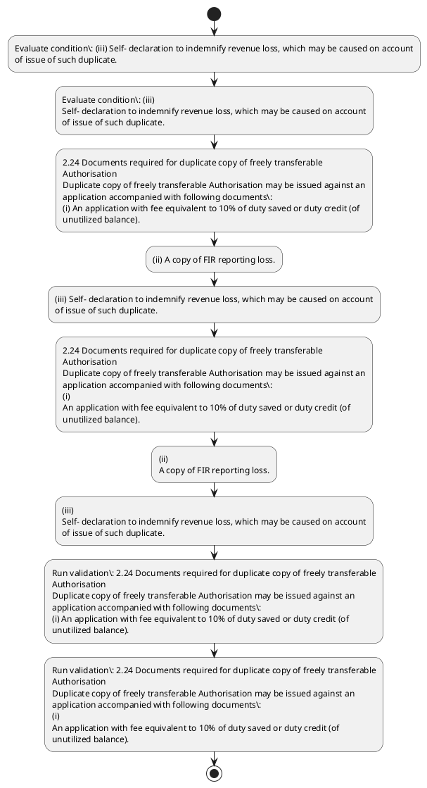

# Chapter 2 / Section 2.24: Documents required for duplicate copy of freely transferable

**Chapter Title:** General Provisions Regarding Imports and Exports

**Pages:** 10

**Purpose:** 2.24 Documents required for duplicate copy of freely transferable
Authorisation
Duplicate copy of freely transferable Authorisation may be issued against an
application accompanied with following documents:
(i) An application with fee equivalent to 10% of duty saved or duty credit (of
unutilized balance).

**Purpose Thanglish:** Indha Documents required for duplicate copy of freely transferable section-la, 2.24 documents required for duplicate copy of freely transferable
Authorisation
Duplicate copy of freely transferable Authorisation may be issued against an
application accompanied with following documents:
(i) An application with fee equivalent to 10% of duty saved or duty credit (of
unutilized balance).

**Summary:** 2.24 Documents required for duplicate copy of freely transferable
Authorisation
Duplicate copy of freely transferable Authorisation may be issued against an
application accompanied with following documents:
(i) An application with fee equivalent to 10% of duty saved or duty credit (of
unutilized balance). (ii) A copy of FIR reporting loss. (iii) Self- declaration to indemnify revenue loss, which may be caused on account
of issue of such duplicate.

**Business Meaning:** 2.24 Documents required for duplicate copy of freely transferable
Authorisation
Duplicate copy of freely transferable Authorisation may be issued against an
application accompanied with following documents:
(i) An application with fee equivalent to 10% of duty saved or duty credit (of
unutilized balance).

**Business Explanation:** 2.24 Documents required for duplicate copy of freely transferable
Authorisation
Duplicate copy of freely transferable Authorisation may be issued against an
application accompanied with following documents:
(i) An application with fee equivalent to 10% of duty saved or duty credit (of
unutilized balance). (ii) A copy of FIR reporting loss. (iii) Self- declaration to indemnify revenue loss, which may be caused on account
of issue of such duplicate.

**Business Explanation Thanglish:** Indha Documents required for duplicate copy of freely transferable section-la, 2.24 documents required for duplicate copy of freely transferable
Authorisation
Duplicate copy of freely transferable Authorisation may be issued against an
application accompanied with following documents:
(i) An application with fee equivalent to 10% of duty saved or duty credit (of
unutilized balance). (ii) A copy of FIR reporting loss. (iii) Self- declaration to indemnify revenue loss, which may be caused on account
of issue of such duplicate.

## Business Logic
- None identified

## Business Rules
- rule_id=CH2-SEC2_24-R001, rule_description=IF validations pass THEN recommend action: 2.24 Documents required for duplicate copy of freely transferable
Authorisation
Duplicate copy of freely transferable Authorisation may be issued against an
application accompanied with following documents:
(i) An application with fee equivalent to 10% of duty saved or duty credit (of
unutilized balance)., trigger=Documents required for duplicate copy of freely transferable, condition=(iii) Self- declaration to indemnify revenue loss, which may be caused on account
of issue of such duplicate., validation=2.24 Documents required for duplicate copy of freely transferable
Authorisation
Duplicate copy of freely transferable Authorisation may be issued against an
application accompanied with following documents:
(i) An application with fee equivalent to 10% of duty saved or duty credit (of
unutilized balance)., action=2.24 Documents required for duplicate copy of freely transferable
Authorisation
Duplicate copy of freely transferable Authorisation may be issued against an
application accompanied with following documents:
(i) An application with fee equivalent to 10% of duty saved or duty credit (of
unutilized balance)., exception=No explicit exception found in uploaded documents., output=DEKAI should produce a compliance decision for 2.24 - Documents required for duplicate copy of freely transferable.

## Conditions
- (iii) Self- declaration to indemnify revenue loss, which may be caused on account
of issue of such duplicate.
- (iii)
Self- declaration to indemnify revenue loss, which may be caused on account
of issue of such duplicate.

## Condition Logic
- id=2.2.24.1, if=(iii) Self- declaration to indemnify revenue loss, which may be caused on account
of issue of such duplicate., then=2.24 Documents required for duplicate copy of freely transferable
Authorisation
Duplicate copy of freely transferable Authorisation may be issued against an
application accompanied with following documents:
(i) An application with fee equivalent to 10% of duty saved or duty credit (of
unutilized balance)., source=(iii) Self- declaration to indemnify revenue loss, which may be caused on account
of issue of such duplicate.
- id=2.2.24.2, if=(iii)
Self- declaration to indemnify revenue loss, which may be caused on account
of issue of such duplicate., then=2.24 Documents required for duplicate copy of freely transferable
Authorisation
Duplicate copy of freely transferable Authorisation may be issued against an
application accompanied with following documents:
(i) An application with fee equivalent to 10% of duty saved or duty credit (of
unutilized balance)., source=(iii)
Self- declaration to indemnify revenue loss, which may be caused on account
of issue of such duplicate.

## Validations
- 2.24 Documents required for duplicate copy of freely transferable
Authorisation
Duplicate copy of freely transferable Authorisation may be issued against an
application accompanied with following documents:
(i) An application with fee equivalent to 10% of duty saved or duty credit (of
unutilized balance).
- 2.24 Documents required for duplicate copy of freely transferable
Authorisation
Duplicate copy of freely transferable Authorisation may be issued against an
application accompanied with following documents:
(i)
An application with fee equivalent to 10% of duty saved or duty credit (of
unutilized balance).

## Exceptions
- None identified

## Dependencies
- None identified

## Authorities
- None identified

## Required Documents
- 2.24 Documents required for duplicate copy of freely transferable
Authorisation
Duplicate copy of freely transferable Authorisation may be issued against an
application accompanied with following documents:
(i) An application with fee equivalent to 10% of duty saved or duty credit (of
unutilized balance).
- (ii) A copy of FIR reporting loss.
- (iii) Self- declaration to indemnify revenue loss, which may be caused on account
of issue of such duplicate.
- 2.24 Documents required for duplicate copy of freely transferable
Authorisation
Duplicate copy of freely transferable Authorisation may be issued against an
application accompanied with following documents:
(i)
An application with fee equivalent to 10% of duty saved or duty credit (of
unutilized balance).
- (ii)
A copy of FIR reporting loss.
- (iii)
Self- declaration to indemnify revenue loss, which may be caused on account
of issue of such duplicate.

## Timelines
- None identified

## Actions
- 2.24 Documents required for duplicate copy of freely transferable
Authorisation
Duplicate copy of freely transferable Authorisation may be issued against an
application accompanied with following documents:
(i) An application with fee equivalent to 10% of duty saved or duty credit (of
unutilized balance).
- (ii) A copy of FIR reporting loss.
- (iii) Self- declaration to indemnify revenue loss, which may be caused on account
of issue of such duplicate.
- 2.24 Documents required for duplicate copy of freely transferable
Authorisation
Duplicate copy of freely transferable Authorisation may be issued against an
application accompanied with following documents:
(i)
An application with fee equivalent to 10% of duty saved or duty credit (of
unutilized balance).
- (ii)
A copy of FIR reporting loss.
- (iii)
Self- declaration to indemnify revenue loss, which may be caused on account
of issue of such duplicate.

## Workflow
- Evaluate condition: (iii) Self- declaration to indemnify revenue loss, which may be caused on account
of issue of such duplicate.
- Evaluate condition: (iii)
Self- declaration to indemnify revenue loss, which may be caused on account
of issue of such duplicate.
- 2.24 Documents required for duplicate copy of freely transferable
Authorisation
Duplicate copy of freely transferable Authorisation may be issued against an
application accompanied with following documents:
(i) An application with fee equivalent to 10% of duty saved or duty credit (of
unutilized balance).
- (ii) A copy of FIR reporting loss.
- (iii) Self- declaration to indemnify revenue loss, which may be caused on account
of issue of such duplicate.
- 2.24 Documents required for duplicate copy of freely transferable
Authorisation
Duplicate copy of freely transferable Authorisation may be issued against an
application accompanied with following documents:
(i)
An application with fee equivalent to 10% of duty saved or duty credit (of
unutilized balance).
- (ii)
A copy of FIR reporting loss.
- (iii)
Self- declaration to indemnify revenue loss, which may be caused on account
of issue of such duplicate.
- Run validation: 2.24 Documents required for duplicate copy of freely transferable
Authorisation
Duplicate copy of freely transferable Authorisation may be issued against an
application accompanied with following documents:
(i) An application with fee equivalent to 10% of duty saved or duty credit (of
unutilized balance).
- Run validation: 2.24 Documents required for duplicate copy of freely transferable
Authorisation
Duplicate copy of freely transferable Authorisation may be issued against an
application accompanied with following documents:
(i)
An application with fee equivalent to 10% of duty saved or duty credit (of
unutilized balance).

## Workflow ASCII
```text
Documents required for duplicate copy of freely transferable
Evaluate condition: (iii) Self- declaration to indemnify revenue loss, which may be caused on account
of issue of such duplicate.
   |
   v
Evaluate condition: (iii)
Self- declaration to indemnify revenue loss, which may be caused on account
of issue of such duplicate.
   |
   v
2.24 Documents required for duplicate copy of freely transferable
Authorisation
Duplicate copy of freely transferable Authorisation may be issued against an
application accompanied with following documents:
(i) An application with fee equivalent to 10% of duty saved or duty credit (of
unutilized balance).
   |
   v
(ii) A copy of FIR reporting loss.
   |
   v
(iii) Self- declaration to indemnify revenue loss, which may be caused on account
of issue of such duplicate.
   |
   v
2.24 Documents required for duplicate copy of freely transferable
Authorisation
Duplicate copy of freely transferable Authorisation may be issued against an
application accompanied with following documents:
(i)
An application with fee equivalent to 10% of duty saved or duty credit (of
unutilized balance).
   |
   v
(ii)
A copy of FIR reporting loss.
   |
   v
(iii)
Self- declaration to indemnify revenue loss, which may be caused on account
of issue of such duplicate.
   |
   v
Run validation: 2.24 Documents required for duplicate copy of freely transferable
Authorisation
Duplicate copy of freely transferable Authorisation may be issued against an
application accompanied with following documents:
(i) An application with fee equivalent to 10% of duty saved or duty credit (of
unutilized balance).
   |
   v
Run validation: 2.24 Documents required for duplicate copy of freely transferable
Authorisation
Duplicate copy of freely transferable Authorisation may be issued against an
application accompanied with following documents:
(i)
An application with fee equivalent to 10% of duty saved or duty credit (of
unutilized balance).
```

## Decision Tree
- IF (iii) Self- declaration to indemnify revenue loss, which may be caused on account
of issue of such duplicate. THEN 2.24 Documents required for duplicate copy of freely transferable
Authorisation
Duplicate copy of freely transferable Authorisation may be issued against an
application accompanied with following documents:
(i) An application with fee equivalent to 10% of duty saved or duty credit (of
unutilized balance).
- IF (iii)
Self- declaration to indemnify revenue loss, which may be caused on account
of issue of such duplicate. THEN 2.24 Documents required for duplicate copy of freely transferable
Authorisation
Duplicate copy of freely transferable Authorisation may be issued against an
application accompanied with following documents:
(i) An application with fee equivalent to 10% of duty saved or duty credit (of
unutilized balance).

## Decision Tree ASCII
```text
Documents required for duplicate copy of freely transferable Decision
IF (iii) Self- declaration to indemnify revenue loss, which may be caused on account
of issue of such duplicate. THEN 2.24 Documents required for duplicate copy of freely transferable
Authorisation
Duplicate copy of freely transferable Authorisation may be issued against an
application accompanied with following documents:
(i) An application with fee equivalent to 10% of duty saved or duty credit (of
unutilized balance).
   |
   v
IF (iii)
Self- declaration to indemnify revenue loss, which may be caused on account
of issue of such duplicate. THEN 2.24 Documents required for duplicate copy of freely transferable
Authorisation
Duplicate copy of freely transferable Authorisation may be issued against an
application accompanied with following documents:
(i) An application with fee equivalent to 10% of duty saved or duty credit (of
unutilized balance).
```

## Examples
- User asks to process Documents required for duplicate copy of freely transferable; the platform checks conditions, validations, and documents before action.

**Real-world Example:** Example: an importer or exporter invokes Documents required for duplicate copy of freely transferable, submits 2.24 Documents required for duplicate copy of freely transferable
Authorisation
Duplicate copy of freely transferable Authorisation may be issued against an
application accompanied with following documents:
(i) An application with fee equivalent to 10% of duty saved or duty credit (of
unutilized balance)., (ii) A copy of FIR reporting loss., (iii) Self- declaration to indemnify revenue loss, which may be caused on account
of issue of such duplicate., and DEKAI uses the extracted rules to 2.24 documents required for duplicate copy of freely transferable
authorisation
duplicate copy of freely transferable authorisation may be issued against an
application accompanied with following documents:
(i) an application with fee equivalent to 10% of duty saved or duty credit (of
unutilized balance)..

**Real-world Example Thanglish:** Indha Documents required for duplicate copy of freely transferable section-la, Example: an importer or exporter invokes documents required for duplicate copy of freely transferable, submits 2.24 documents required for duplicate copy of freely transferable
Authorisation
Duplicate copy of freely transferable Authorisation may be issued against an
application accompanied with following documents:
(i) An application with fee equivalent to 10% of duty saved or duty credit (of
unutilized balance)., (ii) A copy of FIR reporting loss., (iii) Self- declaration to indemnify revenue loss, which may be caused on account
of issue of such duplicate., and DEKAI uses the extracted rules to 2.24 documents required for duplicate copy of freely transferable
authorisation
duplicate copy of freely transferable authorisation may be issued against an
application accompanied with following documents:
(i) an application with fee equivalent to 10% of duty saved or duty credit (of
unutilized balance)..

## AI Rules
- IF validations pass THEN recommend action: 2.24 Documents required for duplicate copy of freely transferable
Authorisation
Duplicate copy of freely transferable Authorisation may be issued against an
application accompanied with following documents:
(i) An application with fee equivalent to 10% of duty saved or duty credit (of
unutilized balance).

## Database Fields
- name=section_code, type=string, required=True, source=parsed_section_heading
- name=section_title, type=string, required=True, source=parsed_section_heading
- name=for_flag, type=boolean, required=False, source=keyword:for
- name=may_flag, type=boolean, required=False, source=keyword:may
- name=fee_flag, type=boolean, required=False, source=keyword:fee
- name=fir_flag, type=boolean, required=False, source=keyword:FIR
- name=iii_flag, type=boolean, required=False, source=keyword:iii
- name=copy_flag, type=boolean, required=False, source=keyword:copy
- name=with_flag, type=boolean, required=False, source=keyword:with
- name=duty_flag, type=boolean, required=False, source=keyword:duty
- name=document_1_submitted, type=boolean, required=True, source=2.24 Documents required for duplicate copy of freely transferable
Authorisation
Duplicate copy of freely transferable Authorisation may be issued against an
application accompanied with following documents:
(i) An application with fee equivalent to 10% of duty saved or duty credit (of
unutilized balance).
- name=document_2_submitted, type=boolean, required=True, source=(ii) A copy of FIR reporting loss.
- name=document_3_submitted, type=boolean, required=True, source=(iii) Self- declaration to indemnify revenue loss, which may be caused on account
of issue of such duplicate.
- name=document_4_submitted, type=boolean, required=True, source=2.24 Documents required for duplicate copy of freely transferable
Authorisation
Duplicate copy of freely transferable Authorisation may be issued against an
application accompanied with following documents:
(i)
An application with fee equivalent to 10% of duty saved or duty credit (of
unutilized balance).
- name=document_5_submitted, type=boolean, required=True, source=(ii)
A copy of FIR reporting loss.
- name=document_6_submitted, type=boolean, required=True, source=(iii)
Self- declaration to indemnify revenue loss, which may be caused on account
of issue of such duplicate.

## API Requirements
- method=GET, path=/api/dgft/sections/2.24, purpose=Retrieve knowledge payload for section 2.24, query_params=['include=workflow,decision_tree,validations'], response_fields=['section', 'title', 'summary', 'conditions', 'validations', 'exceptions', 'workflow', 'decision_tree']
- method=POST, path=/api/dgft/Documents-required-for-duplicate-copy-of-freely-transferable/validate, purpose=Validate inputs and documents for Documents required for duplicate copy of freely transferable, request_fields=['section_code', 'section_title', 'document_1_submitted', 'document_2_submitted', 'document_3_submitted', 'document_4_submitted', 'document_5_submitted', 'document_6_submitted'], response_fields=['status', 'errors', 'warnings', 'next_actions']
- method=POST, path=/api/dgft/Documents-required-for-duplicate-copy-of-freely-transferable/execute, purpose=Trigger business action for 2.24 Documents required for duplicate copy of freely transferable
Authorisation
Duplicate copy of freely transferable Authorisation may be issued against an
application accompanied with following documents:
(i) An application with fee equivalent to 10% of duty saved or duty credit (of
unutilized balance)., request_fields=['section_code', 'section_title', 'document_1_submitted', 'document_2_submitted', 'document_3_submitted', 'document_4_submitted', 'document_5_submitted', 'document_6_submitted'], response_fields=['reference_id', 'status', 'authority', 'timeline']

## UI Screens
- screen_id=Documents_required_for_duplicate_copy_of_freely_transferable_overview, name=Documents required for duplicate copy of freely transferable Overview, purpose=Show section summary, authority, timeline, and eligibility cues., widgets=['summary_card', 'conditions_table', 'authority_badges', 'timeline_panel']
- screen_id=Documents_required_for_duplicate_copy_of_freely_transferable_submission, name=Documents required for duplicate copy of freely transferable Submission, purpose=Capture applicant data and supporting documents., widgets=['dynamic_form', 'document_uploader', 'validation_panel', 'next_action_footer'], fields=['section_code', 'section_title', 'for_flag', 'may_flag', 'fee_flag', 'fir_flag', 'iii_flag', 'copy_flag']

## Error Messages
- Validation failed because the section requirements were not fully met.

## FAQ
- question_en=What is the purpose of section 2.24?, answer_en=2.24 Documents required for duplicate copy of freely transferable
Authorisation
Duplicate copy of freely transferable Authorisation may be issued against an
application accompanied with following documents:
(i) An application with fee equivalent to 10% of duty saved or duty credit (of
unutilized balance). (ii) A copy of FIR reporting loss. (iii) Self- declaration to indemnify revenue loss, which may be caused on account
of issue of such duplicate., question_thanglish=Indha Documents required for duplicate copy of freely transferable section-la, What is the purpose of section 2.24?, answer_thanglish=Indha Documents required for duplicate copy of freely transferable section-la, 2.24 documents required for duplicate copy of freely transferable
Authorisation
Duplicate copy of freely transferable Authorisation may be issued against an
application accompanied with following documents:
(i) An application with fee equivalent to 10% of duty saved or duty credit (of
unutilized balance). (ii) A copy of FIR reporting loss. (iii) Self- declaration to indemnify revenue loss, which may be caused on account
of issue of such duplicate.
- question_en=What documents are required under Documents required for duplicate copy of freely transferable?, answer_en=2.24 Documents required for duplicate copy of freely transferable
Authorisation
Duplicate copy of freely transferable Authorisation may be issued against an
application accompanied with following documents:
(i) An application with fee equivalent to 10% of duty saved or duty credit (of
unutilized balance)., (ii) A copy of FIR reporting loss., (iii) Self- declaration to indemnify revenue loss, which may be caused on account
of issue of such duplicate., 2.24 Documents required for duplicate copy of freely transferable
Authorisation
Duplicate copy of freely transferable Authorisation may be issued against an
application accompanied with following documents:
(i)
An application with fee equivalent to 10% of duty saved or duty credit (of
unutilized balance)., (ii)
A copy of FIR reporting loss., (iii)
Self- declaration to indemnify revenue loss, which may be caused on account
of issue of such duplicate., question_thanglish=Indha Documents required for duplicate copy of freely transferable section-la, What documents are required under documents required for duplicate copy of freely transferable?, answer_thanglish=Indha Documents required for duplicate copy of freely transferable section-la, 2.24 documents required for duplicate copy of freely transferable
Authorisation
Duplicate copy of freely transferable Authorisation may be issued against an
application accompanied with following documents:
(i) An application with fee equivalent to 10% of duty saved or duty credit (of
unutilized balance)., (ii) A copy of FIR reporting loss., (iii) Self- declaration to indemnify revenue loss, which may be caused on account
of issue of such duplicate., 2.24 documents required for duplicate copy of freely transferable
Authorisation
Duplicate copy of freely transferable Authorisation may be issued against an
application accompanied with following documents:
(i)
An application with fee equivalent to 10% of duty saved or duty credit (of
unutilized balance)., (ii)
A copy of FIR reporting loss., (iii)
Self- declaration to indemnify revenue loss, which may be caused on account
of issue of such duplicate.
- question_en=Which authority handles Documents required for duplicate copy of freely transferable?, answer_en=Not explicitly covered in uploaded documents., question_thanglish=Indha Documents required for duplicate copy of freely transferable section-la, Which authority handles documents required for duplicate copy of freely transferable?, answer_thanglish=Indha Documents required for duplicate copy of freely transferable section-la, Not explicitly covered in uploaded documents.

## Questions Users May Ask
- What does Documents required for duplicate copy of freely transferable require?
- Which documents are needed for Documents required for duplicate copy of freely transferable?
- How does DEKAI validate Documents required for duplicate copy of freely transferable requests?
- What action should be taken for Documents required for duplicate copy of freely transferable?

## Expected AI Answers
- Documents required for duplicate copy of freely transferable requires the platform to interpret the section text, apply the extracted business rules, and present the correct next action.
- Required documents are inferred from the section text: 2.24 Documents required for duplicate copy of freely transferable
Authorisation
Duplicate copy of freely transferable Authorisation may be issued against an
application accompanied with following documents:
(i) An application with fee equivalent to 10% of duty saved or duty credit (of
unutilized balance)., (ii) A copy of FIR reporting loss., (iii) Self- declaration to indemnify revenue loss, which may be caused on account
of issue of such duplicate., 2.24 Documents required for duplicate copy of freely transferable
Authorisation
Duplicate copy of freely transferable Authorisation may be issued against an
application accompanied with following documents:
(i)
An application with fee equivalent to 10% of duty saved or duty credit (of
unutilized balance)., (ii)
A copy of FIR reporting loss.
- DEKAI validates Documents required for duplicate copy of freely transferable by checking conditions, required documents, authority references, and exception clauses before recommending an outcome.
- The primary extracted action is: 2.24 Documents required for duplicate copy of freely transferable
Authorisation
Duplicate copy of freely transferable Authorisation may be issued against an
application accompanied with following documents:
(i) An application with fee equivalent to 10% of duty saved or duty credit (of
unutilized balance).

## AI Q&A Examples
- question_en=User asks: How do I comply with Documents required for duplicate copy of freely transferable?, answer_en=AI answers: DEKAI should evaluate section 2.24, apply the extracted rules, and guide the user through Evaluate condition: (iii) Self- declaration to indemnify revenue loss, which may be caused on account
of issue of such duplicate.., question_thanglish=Indha Documents required for duplicate copy of freely transferable section-la, User asks: How do I comply with documents required for duplicate copy of freely transferable?, answer_thanglish=Indha Documents required for duplicate copy of freely transferable section-la, AI answers: DEKAI should evaluate section 2.24, apply the extracted rules, and guide the user through Evaluate condition: (iii) Self- declaration to indemnify revenue loss, which may be caused on account
of issue of such duplicate..
- question_en=User asks: Which validations apply to Documents required for duplicate copy of freely transferable?, answer_en=AI answers: Applicable validations are 2.24 Documents required for duplicate copy of freely transferable
Authorisation
Duplicate copy of freely transferable Authorisation may be issued against an
application accompanied with following documents:
(i) An application with fee equivalent to 10% of duty saved or duty credit (of
unutilized balance)., 2.24 Documents required for duplicate copy of freely transferable
Authorisation
Duplicate copy of freely transferable Authorisation may be issued against an
application accompanied with following documents:
(i)
An application with fee equivalent to 10% of duty saved or duty credit (of
unutilized balance)., question_thanglish=Indha Documents required for duplicate copy of freely transferable section-la, User asks: Which validations apply to documents required for duplicate copy of freely transferable?, answer_thanglish=Indha Documents required for duplicate copy of freely transferable section-la, AI answers: Applicable validations are 2.24 documents required for duplicate copy of freely transferable
Authorisation
Duplicate copy of freely transferable Authorisation may be issued against an
application accompanied with following documents:
(i) An application with fee equivalent to 10% of duty saved or duty credit (of
unutilized balance)., 2.24 documents required for duplicate copy of freely transferable
Authorisation
Duplicate copy of freely transferable Authorisation may be issued against an
application accompanied with following documents:
(i)
An application with fee equivalent to 10% of duty saved or duty credit (of
unutilized balance).

## DEKAI AI Implementation Notes
- Capture chapter 2, section 2.24, title, and page references as immutable knowledge metadata.
- Bind validations for Documents required for duplicate copy of freely transferable into a rule engine keyed by the rule IDs extracted for this section.
- Expose document upload controls for: 2.24 Documents required for duplicate copy of freely transferable
Authorisation
Duplicate copy of freely transferable Authorisation may be issued against an
application accompanied with following documents:
(i) An application with fee equivalent to 10% of duty saved or duty credit (of
unutilized balance)., (ii) A copy of FIR reporting loss., (iii) Self- declaration to indemnify revenue loss, which may be caused on account
of issue of such duplicate., 2.24 Documents required for duplicate copy of freely transferable
Authorisation
Duplicate copy of freely transferable Authorisation may be issued against an
application accompanied with following documents:
(i)
An application with fee equivalent to 10% of duty saved or duty credit (of
unutilized balance)., (ii)
A copy of FIR reporting loss., (iii)
Self- declaration to indemnify revenue loss, which may be caused on account
of issue of such duplicate..

## DEKAI AI Implementation Notes Thanglish
- Indha Documents required for duplicate copy of freely transferable section-la, Capture chapter 2, section 2.24, title, and page references as immutable knowledge metadata.
- Indha Documents required for duplicate copy of freely transferable section-la, Bind validations for documents required for duplicate copy of freely transferable into a rule engine keyed by the rule IDs extracted for this section.
- Indha Documents required for duplicate copy of freely transferable section-la, Expose document upload controls for: 2.24 documents required for duplicate copy of freely transferable
Authorisation
Duplicate copy of freely transferable Authorisation may be issued against an
application accompanied with following documents:
(i) An application with fee equivalent to 10% of duty saved or duty credit (of
unutilized balance)., (ii) A copy of FIR reporting loss., (iii) Self- declaration to indemnify revenue loss, which may be caused on account
of issue of such duplicate., 2.24 documents required for duplicate copy of freely transferable
Authorisation
Duplicate copy of freely transferable Authorisation may be issued against an
application accompanied with following documents:
(i)
An application with fee equivalent to 10% of duty saved or duty credit (of
unutilized balance)., (ii)
A copy of FIR reporting loss., (iii)
Self- declaration to indemnify revenue loss, which may be caused on account
of issue of such duplicate..

## AI Metadata
- Keywords: for, may, fee, FIR, iii, copy, with, duty, loss, Self, such, saved, which, issue, freely, issued, credit, caused, against, balance
- Search Keywords: for, may, fee, FIR, iii, copy, with, duty, loss, Self, such, saved, which, issue, freely, issued, credit, caused, against, balance
- Intent: Support Documents required for duplicate copy of freely transferable processing and compliance validation.
- Tags: 2.24, Documents required for duplicate copy of freely transferable, document-driven, dgft
- Related Sections: 
- Related Chapters: 
- Related Rules: 

## Mermaid

```mermaid
flowchart TD
    S1["Evaluate condition: (iii) Self- declaration to indemnify revenue loss, which may be caused on account
of issue of such duplicate."]
    S2["Evaluate condition: (iii)
Self- declaration to indemnify revenue loss, which may be caused on account
of issue of such duplicate."]
    S1 --> S2
    S3["2.24 Documents required for duplicate copy of freely transferable
Authorisation
Duplicate copy of freely transferable Authorisation may be issued against an
application accompanied with following documents:
(i) An application with fee equivalent to 10% of duty saved or duty credit (of
unutilized balance)."]
    S2 --> S3
    S4["(ii) A copy of FIR reporting loss."]
    S3 --> S4
    S5["(iii) Self- declaration to indemnify revenue loss, which may be caused on account
of issue of such duplicate."]
    S4 --> S5
    S6["2.24 Documents required for duplicate copy of freely transferable
Authorisation
Duplicate copy of freely transferable Authorisation may be issued against an
application accompanied with following documents:
(i)
An application with fee equivalent to 10% of duty saved or duty credit (of
unutilized balance)."]
    S5 --> S6
    S7["(ii)
A copy of FIR reporting loss."]
    S6 --> S7
    S8["(iii)
Self- declaration to indemnify revenue loss, which may be caused on account
of issue of such duplicate."]
    S7 --> S8
    S9["Run validation: 2.24 Documents required for duplicate copy of freely transferable
Authorisation
Duplicate copy of freely transferable Authorisation may be issued against an
application accompanied with following documents:
(i) An application with fee equivalent to 10% of duty saved or duty credit (of
unutilized balance)."]
    S8 --> S9
    S10["Run validation: 2.24 Documents required for duplicate copy of freely transferable
Authorisation
Duplicate copy of freely transferable Authorisation may be issued against an
application accompanied with following documents:
(i)
An application with fee equivalent to 10% of duty saved or duty credit (of
unutilized balance)."]
    S9 --> S10
```


## PlantUML

