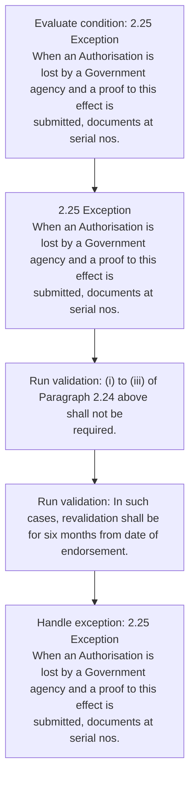
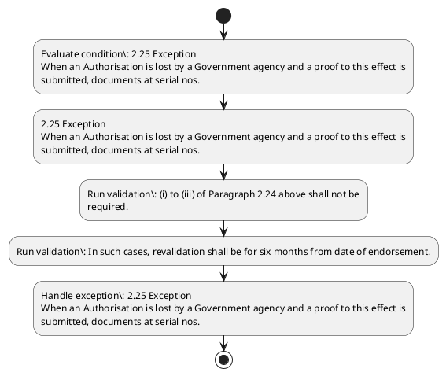

# Chapter 2 / Section 2.25: Exception

**Chapter Title:** General Provisions Regarding Imports and Exports

**Pages:** 10

**Purpose:** 2.25 Exception
When an Authorisation is lost by a Government agency and a proof to this effect is
submitted, documents at serial nos.

**Purpose Thanglish:** Indha Exception section-la, 2.25 Exception
When an Authorisation is lost by a Government agency and a proof to this effect is
submitted, documents at serial nos.

**Summary:** 2.25 Exception
When an Authorisation is lost by a Government agency and a proof to this effect is
submitted, documents at serial nos. (i) to (iii) of Paragraph 2.24 above shall not be
required. In such cases, revalidation shall be for six months from date of endorsement.

**Business Meaning:** Exception governs how DGFT business controls should be applied, validated, and enforced.

**Business Explanation:** Exception explains the operating rule set that DEKAI should enforce. Key control points include (i) to (iii) of Paragraph 2.24 above shall not be
required. The section also drives actions such as 2.25 Exception
When an Authorisation is lost by a Government agency and a proof to this effect is
submitted, documents at serial nos..

**Business Explanation Thanglish:** Indha Exception section-la, Exception explains the operating rule set that DEKAI should enforce. Key control points include (i) to (iii) of Paragraph 2.24 above kandippa not be
required. The section also drives actions such as 2.25 Exception
When an Authorisation is lost by a Government agency and a proof to this effect is
submitted, documents at serial nos..

## Business Logic
- (i) to (iii) of Paragraph 2.24 above shall not be
required.
- In such cases, revalidation shall be for six months from date of endorsement.

## Business Rules
- rule_id=CH2-SEC2_25-R001, rule_description=(i) to (iii) of Paragraph 2.24 above shall not be
required., trigger=Exception, condition=2.25 Exception
When an Authorisation is lost by a Government agency and a proof to this effect is
submitted, documents at serial nos., validation=(i) to (iii) of Paragraph 2.24 above shall not be
required., action=2.25 Exception
When an Authorisation is lost by a Government agency and a proof to this effect is
submitted, documents at serial nos., exception=2.25 Exception
When an Authorisation is lost by a Government agency and a proof to this effect is
submitted, documents at serial nos., output=DEKAI should produce a compliance decision for 2.25 - Exception.
- rule_id=CH2-SEC2_25-R002, rule_description=In such cases, revalidation shall be for six months from date of endorsement., trigger=Exception, condition=2.25 Exception
When an Authorisation is lost by a Government agency and a proof to this effect is
submitted, documents at serial nos., validation=In such cases, revalidation shall be for six months from date of endorsement., action=2.25 Exception
When an Authorisation is lost by a Government agency and a proof to this effect is
submitted, documents at serial nos., exception=2.25 Exception
When an Authorisation is lost by a Government agency and a proof to this effect is
submitted, documents at serial nos., output=DEKAI should produce a compliance decision for 2.25 - Exception.

## Conditions
- 2.25 Exception
When an Authorisation is lost by a Government agency and a proof to this effect is
submitted, documents at serial nos.

## Condition Logic
- id=2.2.25.1, if=2.25 Exception
When an Authorisation is lost by a Government agency and a proof to this effect is
submitted, documents at serial nos., then=2.25 Exception
When an Authorisation is lost by a Government agency and a proof to this effect is
submitted, documents at serial nos., source=2.25 Exception
When an Authorisation is lost by a Government agency and a proof to this effect is
submitted, documents at serial nos.

## Validations
- (i) to (iii) of Paragraph 2.24 above shall not be
required.
- In such cases, revalidation shall be for six months from date of endorsement.

## Exceptions
- 2.25 Exception
When an Authorisation is lost by a Government agency and a proof to this effect is
submitted, documents at serial nos.

## Dependencies
- 2.24

## Authorities
- When an Authorisation is lost by a Government

## Required Documents
- 2.25 Exception
When an Authorisation is lost by a Government agency and a proof to this effect is
submitted, documents at serial nos.

## Timelines
- In such cases, revalidation shall be for six months from date of endorsement.

## Actions
- 2.25 Exception
When an Authorisation is lost by a Government agency and a proof to this effect is
submitted, documents at serial nos.

## Workflow
- Evaluate condition: 2.25 Exception
When an Authorisation is lost by a Government agency and a proof to this effect is
submitted, documents at serial nos.
- 2.25 Exception
When an Authorisation is lost by a Government agency and a proof to this effect is
submitted, documents at serial nos.
- Run validation: (i) to (iii) of Paragraph 2.24 above shall not be
required.
- Run validation: In such cases, revalidation shall be for six months from date of endorsement.
- Handle exception: 2.25 Exception
When an Authorisation is lost by a Government agency and a proof to this effect is
submitted, documents at serial nos.

## Workflow ASCII
```text
Exception
Evaluate condition: 2.25 Exception
When an Authorisation is lost by a Government agency and a proof to this effect is
submitted, documents at serial nos.
   |
   v
2.25 Exception
When an Authorisation is lost by a Government agency and a proof to this effect is
submitted, documents at serial nos.
   |
   v
Run validation: (i) to (iii) of Paragraph 2.24 above shall not be
required.
   |
   v
Run validation: In such cases, revalidation shall be for six months from date of endorsement.
   |
   v
Handle exception: 2.25 Exception
When an Authorisation is lost by a Government agency and a proof to this effect is
submitted, documents at serial nos.
```

## Decision Tree
- IF 2.25 Exception
When an Authorisation is lost by a Government agency and a proof to this effect is
submitted, documents at serial nos. THEN 2.25 Exception
When an Authorisation is lost by a Government agency and a proof to this effect is
submitted, documents at serial nos.
- IF exception applies (2.25 Exception
When an Authorisation is lost by a Government agency and a proof to this effect is
submitted, documents at serial nos.) THEN route to manual review

## Decision Tree ASCII
```text
Exception Decision
IF 2.25 Exception
When an Authorisation is lost by a Government agency and a proof to this effect is
submitted, documents at serial nos. THEN 2.25 Exception
When an Authorisation is lost by a Government agency and a proof to this effect is
submitted, documents at serial nos.
   |
   v
IF exception applies (2.25 Exception
When an Authorisation is lost by a Government agency and a proof to this effect is
submitted, documents at serial nos.) THEN route to manual review
```

## Examples
- User asks to process Exception; the platform checks conditions, validations, and documents before action.

**Real-world Example:** Example: an importer or exporter invokes Exception, submits 2.25 Exception
When an Authorisation is lost by a Government agency and a proof to this effect is
submitted, documents at serial nos., and DEKAI uses the extracted rules to 2.25 exception
when an authorisation is lost by a government agency and a proof to this effect is
submitted, documents at serial nos..

**Real-world Example Thanglish:** Indha Exception section-la, Example: an importer or exporter invokes Exception, submits 2.25 Exception
When an Authorisation is lost by a Government agency and a proof to this effect is
submitted, documents at serial nos., and DEKAI uses the extracted rules to 2.25 exception
when an authorisation is lost by a government agency and a proof to this effect is
submitted, documents at serial nos..

## AI Rules
- IF detected context matches section rule THEN enforce: (i) to (iii) of Paragraph 2.24 above shall not be
required.
- IF detected context matches section rule THEN enforce: In such cases, revalidation shall be for six months from date of endorsement.
- IF validations pass THEN recommend action: 2.25 Exception
When an Authorisation is lost by a Government agency and a proof to this effect is
submitted, documents at serial nos.

## Database Fields
- name=section_code, type=string, required=True, source=parsed_section_heading
- name=section_title, type=string, required=True, source=parsed_section_heading
- name=and_flag, type=boolean, required=False, source=keyword:and
- name=nos_flag, type=boolean, required=False, source=keyword:nos
- name=iii_flag, type=boolean, required=False, source=keyword:iii
- name=not_flag, type=boolean, required=False, source=keyword:not
- name=for_flag, type=boolean, required=False, source=keyword:for
- name=six_flag, type=boolean, required=False, source=keyword:six
- name=when_flag, type=boolean, required=False, source=keyword:When
- name=lost_flag, type=boolean, required=False, source=keyword:lost
- name=document_1_submitted, type=boolean, required=True, source=2.25 Exception
When an Authorisation is lost by a Government agency and a proof to this effect is
submitted, documents at serial nos.

## API Requirements
- method=GET, path=/api/dgft/sections/2.25, purpose=Retrieve knowledge payload for section 2.25, query_params=['include=workflow,decision_tree,validations'], response_fields=['section', 'title', 'summary', 'conditions', 'validations', 'exceptions', 'workflow', 'decision_tree']
- method=POST, path=/api/dgft/Exception/validate, purpose=Validate inputs and documents for Exception, request_fields=['section_code', 'section_title', 'document_1_submitted'], response_fields=['status', 'errors', 'warnings', 'next_actions']
- method=POST, path=/api/dgft/Exception/execute, purpose=Trigger business action for 2.25 Exception
When an Authorisation is lost by a Government agency and a proof to this effect is
submitted, documents at serial nos., request_fields=['section_code', 'section_title', 'document_1_submitted'], response_fields=['reference_id', 'status', 'authority', 'timeline']

## UI Screens
- screen_id=Exception_overview, name=Exception Overview, purpose=Show section summary, authority, timeline, and eligibility cues., widgets=['summary_card', 'conditions_table', 'authority_badges', 'timeline_panel']
- screen_id=Exception_submission, name=Exception Submission, purpose=Capture applicant data and supporting documents., widgets=['dynamic_form', 'document_uploader', 'validation_panel', 'next_action_footer'], fields=['section_code', 'section_title', 'and_flag', 'nos_flag', 'iii_flag', 'not_flag', 'for_flag', 'six_flag']
- screen_id=Exception_exceptions, name=Exception Exception Review, purpose=Explain exception handling and manual review triggers., widgets=['exception_banner', 'decision_tree', 'case_notes']

## Error Messages
- Validation failed because the section requirements were not fully met.

## FAQ
- question_en=What is the purpose of section 2.25?, answer_en=Exception explains the operating rule set that DEKAI should enforce. Key control points include (i) to (iii) of Paragraph 2.24 above shall not be
required. The section also drives actions such as 2.25 Exception
When an Authorisation is lost by a Government agency and a proof to this effect is
submitted, documents at serial nos.., question_thanglish=Indha Exception section-la, What is the purpose of section 2.25?, answer_thanglish=Indha Exception section-la, Exception explains the operating rule set that DEKAI should enforce. Key control points include (i) to (iii) of Paragraph 2.24 above kandippa not be
required. The section also drives actions such as 2.25 Exception
When an Authorisation is lost by a Government agency and a proof to this effect is
submitted, documents at serial nos..
- question_en=What documents are required under Exception?, answer_en=2.25 Exception
When an Authorisation is lost by a Government agency and a proof to this effect is
submitted, documents at serial nos., question_thanglish=Indha Exception section-la, What documents are required under Exception?, answer_thanglish=Indha Exception section-la, 2.25 Exception
When an Authorisation is lost by a Government agency and a proof to this effect is
submitted, documents at serial nos.
- question_en=Which authority handles Exception?, answer_en=When an Authorisation is lost by a Government, question_thanglish=Indha Exception section-la, Which authority handles Exception?, answer_thanglish=Indha Exception section-la, When an Authorisation is lost by a Government

## Questions Users May Ask
- What does Exception require?
- Which documents are needed for Exception?
- How does DEKAI validate Exception requests?
- What action should be taken for Exception?

## Expected AI Answers
- Exception requires the platform to interpret the section text, apply the extracted business rules, and present the correct next action.
- Required documents are inferred from the section text: 2.25 Exception
When an Authorisation is lost by a Government agency and a proof to this effect is
submitted, documents at serial nos.
- DEKAI validates Exception by checking conditions, required documents, authority references, and exception clauses before recommending an outcome.
- The primary extracted action is: 2.25 Exception
When an Authorisation is lost by a Government agency and a proof to this effect is
submitted, documents at serial nos.

## AI Q&A Examples
- question_en=User asks: How do I comply with Exception?, answer_en=AI answers: DEKAI should evaluate section 2.25, apply the extracted rules, and guide the user through Evaluate condition: 2.25 Exception
When an Authorisation is lost by a Government agency and a proof to this effect is
submitted, documents at serial nos.., question_thanglish=Indha Exception section-la, User asks: How do I comply with Exception?, answer_thanglish=Indha Exception section-la, AI answers: DEKAI should evaluate section 2.25, apply the extracted rules, and guide the user through Evaluate condition: 2.25 Exception
When an Authorisation is lost by a Government agency and a proof to this effect is
submitted, documents at serial nos..
- question_en=User asks: Which validations apply to Exception?, answer_en=AI answers: Applicable validations are (i) to (iii) of Paragraph 2.24 above shall not be
required., In such cases, revalidation shall be for six months from date of endorsement., question_thanglish=Indha Exception section-la, User asks: Which validations apply to Exception?, answer_thanglish=Indha Exception section-la, AI answers: Applicable validations are (i) to (iii) of Paragraph 2.24 above kandippa not be
required., In such cases, revalidation kandippa be for six months from date of endorsement.

## DEKAI AI Implementation Notes
- Capture chapter 2, section 2.25, title, and page references as immutable knowledge metadata.
- Bind validations for Exception into a rule engine keyed by the rule IDs extracted for this section.
- Expose document upload controls for: 2.25 Exception
When an Authorisation is lost by a Government agency and a proof to this effect is
submitted, documents at serial nos..
- Route escalations or approvals to: When an Authorisation is lost by a Government.
- Trigger manual review when exception clauses are detected.
- Show contextual links to related sections: 2.24.

## DEKAI AI Implementation Notes Thanglish
- Indha Exception section-la, Capture chapter 2, section 2.25, title, and page references as immutable knowledge metadata.
- Indha Exception section-la, Bind validations for Exception into a rule engine keyed by the rule IDs extracted for this section.
- Indha Exception section-la, Expose document upload controls for: 2.25 Exception
When an Authorisation is lost by a Government agency and a proof to this effect is
submitted, documents at serial nos..
- Indha Exception section-la, Route escalations or approvals to: When an Authorisation is lost by a Government.
- Indha Exception section-la, Trigger manual review when exception clauses are detected.
- Indha Exception section-la, Show contextual links to related sections: 2.24.

## AI Metadata
- Keywords: and, nos, iii, not, for, six, When, lost, this, such, from, date, proof, above, shall, cases, agency, effect, serial, months
- Search Keywords: and, nos, iii, not, for, six, When, lost, this, such, from, date, proof, above, shall, cases, agency, effect, serial, months
- Intent: Support Exception processing and compliance validation.
- Tags: 2.25, Exception, business-rule, document-driven, dgft
- Related Sections: 2.24
- Related Chapters: 
- Related Rules: (i) to (iii) of Paragraph 2.24 above shall not be
required., In such cases, revalidation shall be for six months from date of endorsement.

## Mermaid


## PlantUML

