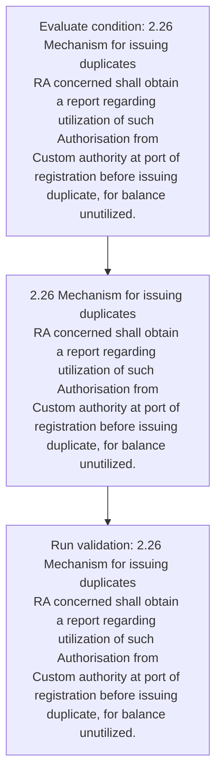
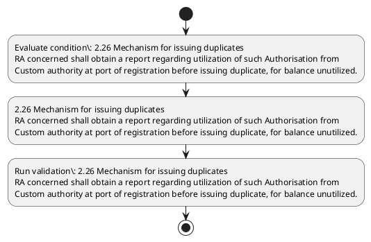

# Chapter 2 / Section 2.26: Mechanism for issuing duplicates

**Chapter Title:** General Provisions Regarding Imports and Exports

**Pages:** 10

**Purpose:** 2.26 Mechanism for issuing duplicates
RA concerned shall obtain a report regarding utilization of such Authorisation from
Custom authority at port of registration before issuing duplicate, for balance unutilized.

**Purpose Thanglish:** Indha Mechanism for issuing duplicates section-la, 2.26 Mechanism for issuing duplicates
RA concerned kandippa obtain a report regarding utilization of such Authorisation from
Custom authority at port of registration before issuing duplicate, for balance unutilized.

**Summary:** 2.26 Mechanism for issuing duplicates
RA concerned shall obtain a report regarding utilization of such Authorisation from
Custom authority at port of registration before issuing duplicate, for balance unutilized.

**Business Meaning:** Mechanism for issuing duplicates governs how DGFT business controls should be applied, validated, and enforced.

**Business Explanation:** Mechanism for issuing duplicates explains the operating rule set that DEKAI should enforce. Key control points include 2.26 Mechanism for issuing duplicates
RA concerned shall obtain a report regarding utilization of such Authorisation from
Custom authority at port of registration before issuing duplicate, for balance unutilized. The section also drives actions such as 2.26 Mechanism for issuing duplicates
RA concerned shall obtain a report regarding utilization of such Authorisation from
Custom authority at port of registration before issuing duplicate, for balance unutilized..

**Business Explanation Thanglish:** Indha Mechanism for issuing duplicates section-la, Mechanism for issuing duplicates explains the operating rule set that DEKAI should enforce. Key control points include 2.26 Mechanism for issuing duplicates
RA concerned kandippa obtain a report regarding utilization of such Authorisation from
Custom authority at port of registration before issuing duplicate, for balance unutilized. The section also drives actions such as 2.26 Mechanism for issuing duplicates
RA concerned kandippa obtain a report regarding utilization of such Authorisation from
Custom authority at port of registration before issuing duplicate, for balance unutilized..

## Business Logic
- 2.26 Mechanism for issuing duplicates
RA concerned shall obtain a report regarding utilization of such Authorisation from
Custom authority at port of registration before issuing duplicate, for balance unutilized.

## Business Rules
- rule_id=CH2-SEC2_26-R001, rule_description=2.26 Mechanism for issuing duplicates
RA concerned shall obtain a report regarding utilization of such Authorisation from
Custom authority at port of registration before issuing duplicate, for balance unutilized., trigger=Mechanism for issuing duplicates, condition=2.26 Mechanism for issuing duplicates
RA concerned shall obtain a report regarding utilization of such Authorisation from
Custom authority at port of registration before issuing duplicate, for balance unutilized., validation=2.26 Mechanism for issuing duplicates
RA concerned shall obtain a report regarding utilization of such Authorisation from
Custom authority at port of registration before issuing duplicate, for balance unutilized., action=2.26 Mechanism for issuing duplicates
RA concerned shall obtain a report regarding utilization of such Authorisation from
Custom authority at port of registration before issuing duplicate, for balance unutilized., exception=No explicit exception found in uploaded documents., output=DEKAI should produce a compliance decision for 2.26 - Mechanism for issuing duplicates.

## Conditions
- 2.26 Mechanism for issuing duplicates
RA concerned shall obtain a report regarding utilization of such Authorisation from
Custom authority at port of registration before issuing duplicate, for balance unutilized.

## Condition Logic
- id=2.2.26.1, if=2.26 Mechanism for issuing duplicates
RA concerned shall obtain a report regarding utilization of such Authorisation from
Custom authority at port of registration before issuing duplicate, for balance unutilized., then=2.26 Mechanism for issuing duplicates
RA concerned shall obtain a report regarding utilization of such Authorisation from
Custom authority at port of registration before issuing duplicate, for balance unutilized., source=2.26 Mechanism for issuing duplicates
RA concerned shall obtain a report regarding utilization of such Authorisation from
Custom authority at port of registration before issuing duplicate, for balance unutilized.

## Validations
- 2.26 Mechanism for issuing duplicates
RA concerned shall obtain a report regarding utilization of such Authorisation from
Custom authority at port of registration before issuing duplicate, for balance unutilized.

## Exceptions
- None identified

## Dependencies
- None identified

## Authorities
- RA

## Required Documents
- None identified

## Timelines
- 2.26 Mechanism for issuing duplicates
RA concerned shall obtain a report regarding utilization of such Authorisation from
Custom authority at port of registration before issuing duplicate, for balance unutilized.

## Actions
- 2.26 Mechanism for issuing duplicates
RA concerned shall obtain a report regarding utilization of such Authorisation from
Custom authority at port of registration before issuing duplicate, for balance unutilized.

## Workflow
- Evaluate condition: 2.26 Mechanism for issuing duplicates
RA concerned shall obtain a report regarding utilization of such Authorisation from
Custom authority at port of registration before issuing duplicate, for balance unutilized.
- 2.26 Mechanism for issuing duplicates
RA concerned shall obtain a report regarding utilization of such Authorisation from
Custom authority at port of registration before issuing duplicate, for balance unutilized.
- Run validation: 2.26 Mechanism for issuing duplicates
RA concerned shall obtain a report regarding utilization of such Authorisation from
Custom authority at port of registration before issuing duplicate, for balance unutilized.

## Workflow ASCII
```text
Mechanism for issuing duplicates
Evaluate condition: 2.26 Mechanism for issuing duplicates
RA concerned shall obtain a report regarding utilization of such Authorisation from
Custom authority at port of registration before issuing duplicate, for balance unutilized.
   |
   v
2.26 Mechanism for issuing duplicates
RA concerned shall obtain a report regarding utilization of such Authorisation from
Custom authority at port of registration before issuing duplicate, for balance unutilized.
   |
   v
Run validation: 2.26 Mechanism for issuing duplicates
RA concerned shall obtain a report regarding utilization of such Authorisation from
Custom authority at port of registration before issuing duplicate, for balance unutilized.
```

## Decision Tree
- IF 2.26 Mechanism for issuing duplicates
RA concerned shall obtain a report regarding utilization of such Authorisation from
Custom authority at port of registration before issuing duplicate, for balance unutilized. THEN 2.26 Mechanism for issuing duplicates
RA concerned shall obtain a report regarding utilization of such Authorisation from
Custom authority at port of registration before issuing duplicate, for balance unutilized.

## Decision Tree ASCII
```text
Mechanism for issuing duplicates Decision
IF 2.26 Mechanism for issuing duplicates
RA concerned shall obtain a report regarding utilization of such Authorisation from
Custom authority at port of registration before issuing duplicate, for balance unutilized. THEN 2.26 Mechanism for issuing duplicates
RA concerned shall obtain a report regarding utilization of such Authorisation from
Custom authority at port of registration before issuing duplicate, for balance unutilized.
```

## Examples
- User asks to process Mechanism for issuing duplicates; the platform checks conditions, validations, and documents before action.

**Real-world Example:** Example: an importer or exporter invokes Mechanism for issuing duplicates, submits the prescribed DGFT records, and DEKAI uses the extracted rules to 2.26 mechanism for issuing duplicates
ra concerned shall obtain a report regarding utilization of such authorisation from
custom authority at port of registration before issuing duplicate, for balance unutilized..

**Real-world Example Thanglish:** Indha Mechanism for issuing duplicates section-la, Example: an importer or exporter invokes Mechanism for issuing duplicates, submits the prescribed DGFT records, and DEKAI uses the extracted rules to 2.26 mechanism for issuing duplicates
ra concerned kandippa obtain a report regarding utilization of such authorisation from
custom authority at port of registration before issuing duplicate, for balance unutilized..

## AI Rules
- IF detected context matches section rule THEN enforce: 2.26 Mechanism for issuing duplicates
RA concerned shall obtain a report regarding utilization of such Authorisation from
Custom authority at port of registration before issuing duplicate, for balance unutilized.
- IF validations pass THEN recommend action: 2.26 Mechanism for issuing duplicates
RA concerned shall obtain a report regarding utilization of such Authorisation from
Custom authority at port of registration before issuing duplicate, for balance unutilized.

## Database Fields
- name=section_code, type=string, required=True, source=parsed_section_heading
- name=section_title, type=string, required=True, source=parsed_section_heading
- name=for_flag, type=boolean, required=False, source=keyword:for
- name=such_flag, type=boolean, required=False, source=keyword:such
- name=from_flag, type=boolean, required=False, source=keyword:from
- name=port_flag, type=boolean, required=False, source=keyword:port
- name=shall_flag, type=boolean, required=False, source=keyword:shall
- name=obtain_flag, type=boolean, required=False, source=keyword:obtain
- name=report_flag, type=boolean, required=False, source=keyword:report
- name=custom_flag, type=boolean, required=False, source=keyword:Custom

## API Requirements
- method=GET, path=/api/dgft/sections/2.26, purpose=Retrieve knowledge payload for section 2.26, query_params=['include=workflow,decision_tree,validations'], response_fields=['section', 'title', 'summary', 'conditions', 'validations', 'exceptions', 'workflow', 'decision_tree']
- method=POST, path=/api/dgft/Mechanism-for-issuing-duplicates/validate, purpose=Validate inputs and documents for Mechanism for issuing duplicates, request_fields=['section_code', 'section_title'], response_fields=['status', 'errors', 'warnings', 'next_actions']
- method=POST, path=/api/dgft/Mechanism-for-issuing-duplicates/execute, purpose=Trigger business action for 2.26 Mechanism for issuing duplicates
RA concerned shall obtain a report regarding utilization of such Authorisation from
Custom authority at port of registration before issuing duplicate, for balance unutilized., request_fields=['section_code', 'section_title'], response_fields=['reference_id', 'status', 'authority', 'timeline']

## UI Screens
- screen_id=Mechanism_for_issuing_duplicates_overview, name=Mechanism for issuing duplicates Overview, purpose=Show section summary, authority, timeline, and eligibility cues., widgets=['summary_card', 'conditions_table', 'authority_badges', 'timeline_panel']
- screen_id=Mechanism_for_issuing_duplicates_submission, name=Mechanism for issuing duplicates Submission, purpose=Capture applicant data and supporting documents., widgets=['dynamic_form', 'document_uploader', 'validation_panel', 'next_action_footer'], fields=['section_code', 'section_title', 'for_flag', 'such_flag', 'from_flag', 'port_flag', 'shall_flag', 'obtain_flag']

## Error Messages
- Validation failed because the section requirements were not fully met.

## FAQ
- question_en=What is the purpose of section 2.26?, answer_en=Mechanism for issuing duplicates explains the operating rule set that DEKAI should enforce. Key control points include 2.26 Mechanism for issuing duplicates
RA concerned shall obtain a report regarding utilization of such Authorisation from
Custom authority at port of registration before issuing duplicate, for balance unutilized. The section also drives actions such as 2.26 Mechanism for issuing duplicates
RA concerned shall obtain a report regarding utilization of such Authorisation from
Custom authority at port of registration before issuing duplicate, for balance unutilized.., question_thanglish=Indha Mechanism for issuing duplicates section-la, What is the purpose of section 2.26?, answer_thanglish=Indha Mechanism for issuing duplicates section-la, Mechanism for issuing duplicates explains the operating rule set that DEKAI should enforce. Key control points include 2.26 Mechanism for issuing duplicates
RA concerned kandippa obtain a report regarding utilization of such Authorisation from
Custom authority at port of registration before issuing duplicate, for balance unutilized. The section also drives actions such as 2.26 Mechanism for issuing duplicates
RA concerned kandippa obtain a report regarding utilization of such Authorisation from
Custom authority at port of registration before issuing duplicate, for balance unutilized..
- question_en=What documents are required under Mechanism for issuing duplicates?, answer_en=Not explicitly covered in uploaded documents., question_thanglish=Indha Mechanism for issuing duplicates section-la, What documents are required under Mechanism for issuing duplicates?, answer_thanglish=Indha Mechanism for issuing duplicates section-la, Not explicitly covered in uploaded documents.
- question_en=Which authority handles Mechanism for issuing duplicates?, answer_en=RA, question_thanglish=Indha Mechanism for issuing duplicates section-la, Which authority handles Mechanism for issuing duplicates?, answer_thanglish=Indha Mechanism for issuing duplicates section-la, RA

## Questions Users May Ask
- What does Mechanism for issuing duplicates require?
- Which documents are needed for Mechanism for issuing duplicates?
- How does DEKAI validate Mechanism for issuing duplicates requests?
- What action should be taken for Mechanism for issuing duplicates?

## Expected AI Answers
- Mechanism for issuing duplicates requires the platform to interpret the section text, apply the extracted business rules, and present the correct next action.
- Required documents are inferred from the section text: no explicit documents were detected.
- DEKAI validates Mechanism for issuing duplicates by checking conditions, required documents, authority references, and exception clauses before recommending an outcome.
- The primary extracted action is: 2.26 Mechanism for issuing duplicates
RA concerned shall obtain a report regarding utilization of such Authorisation from
Custom authority at port of registration before issuing duplicate, for balance unutilized.

## AI Q&A Examples
- question_en=User asks: How do I comply with Mechanism for issuing duplicates?, answer_en=AI answers: DEKAI should evaluate section 2.26, apply the extracted rules, and guide the user through Evaluate condition: 2.26 Mechanism for issuing duplicates
RA concerned shall obtain a report regarding utilization of such Authorisation from
Custom authority at port of registration before issuing duplicate, for balance unutilized.., question_thanglish=Indha Mechanism for issuing duplicates section-la, User asks: How do I comply with Mechanism for issuing duplicates?, answer_thanglish=Indha Mechanism for issuing duplicates section-la, AI answers: DEKAI should evaluate section 2.26, apply the extracted rules, and guide the user through Evaluate condition: 2.26 Mechanism for issuing duplicates
RA concerned kandippa obtain a report regarding utilization of such Authorisation from
Custom authority at port of registration before issuing duplicate, for balance unutilized..
- question_en=User asks: Which validations apply to Mechanism for issuing duplicates?, answer_en=AI answers: Applicable validations are 2.26 Mechanism for issuing duplicates
RA concerned shall obtain a report regarding utilization of such Authorisation from
Custom authority at port of registration before issuing duplicate, for balance unutilized., question_thanglish=Indha Mechanism for issuing duplicates section-la, User asks: Which validations apply to Mechanism for issuing duplicates?, answer_thanglish=Indha Mechanism for issuing duplicates section-la, AI answers: Applicable validations are 2.26 Mechanism for issuing duplicates
RA concerned kandippa obtain a report regarding utilization of such Authorisation from
Custom authority at port of registration before issuing duplicate, for balance unutilized.

## DEKAI AI Implementation Notes
- Capture chapter 2, section 2.26, title, and page references as immutable knowledge metadata.
- Bind validations for Mechanism for issuing duplicates into a rule engine keyed by the rule IDs extracted for this section.
- Route escalations or approvals to: RA.

## DEKAI AI Implementation Notes Thanglish
- Indha Mechanism for issuing duplicates section-la, Capture chapter 2, section 2.26, title, and page references as immutable knowledge metadata.
- Indha Mechanism for issuing duplicates section-la, Bind validations for Mechanism for issuing duplicates into a rule engine keyed by the rule IDs extracted for this section.
- Indha Mechanism for issuing duplicates section-la, Route escalations or approvals to: RA.

## AI Metadata
- Keywords: for, such, from, port, shall, obtain, report, Custom, before, issuing, balance, Mechanism, concerned, regarding, authority, duplicate, duplicates, unutilized, utilization, registration
- Search Keywords: for, such, from, port, shall, obtain, report, Custom, before, issuing, balance, Mechanism, concerned, regarding, authority, duplicate, duplicates, unutilized, utilization, registration
- Intent: Support Mechanism for issuing duplicates processing and compliance validation.
- Tags: 2.26, Mechanism for issuing duplicates, business-rule, dgft
- Related Sections: 
- Related Chapters: 
- Related Rules: 2.26 Mechanism for issuing duplicates
RA concerned shall obtain a report regarding utilization of such Authorisation from
Custom authority at port of registration before issuing duplicate, for balance unutilized.

## Mermaid


## PlantUML

