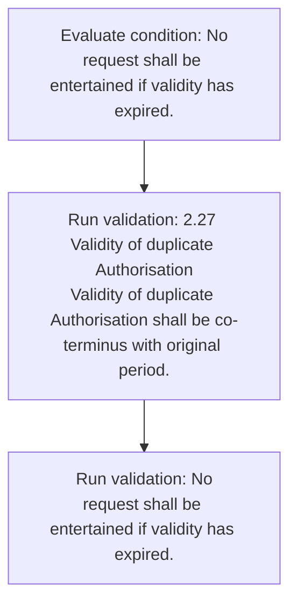
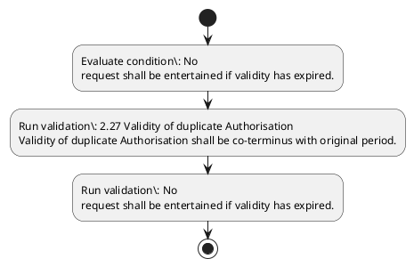

# Chapter 2 / Section 2.27: Validity of duplicate Authorisation

**Chapter Title:** General Provisions Regarding Imports and Exports

**Pages:** 10

**Purpose:** 2.27 Validity of duplicate Authorisation
Validity of duplicate Authorisation shall be co-terminus with original period.

**Purpose Thanglish:** Indha Validity of duplicate Authorisation section-la, 2.27 Validity of duplicate Authorisation
Validity of duplicate Authorisation kandippa be co-terminus with original period.

**Summary:** 2.27 Validity of duplicate Authorisation
Validity of duplicate Authorisation shall be co-terminus with original period. No
request shall be entertained if validity has expired.

**Business Meaning:** Validity of duplicate Authorisation governs how DGFT business controls should be applied, validated, and enforced.

**Business Explanation:** Validity of duplicate Authorisation explains the operating rule set that DEKAI should enforce. Key control points include 2.27 Validity of duplicate Authorisation
Validity of duplicate Authorisation shall be co-terminus with original period.

**Business Explanation Thanglish:** Indha Validity of duplicate Authorisation section-la, Validity of duplicate Authorisation explains the operating rule set that DEKAI should enforce. Key control points include 2.27 Validity of duplicate Authorisation
Validity of duplicate Authorisation kandippa be co-terminus with original period.

## Business Logic
- 2.27 Validity of duplicate Authorisation
Validity of duplicate Authorisation shall be co-terminus with original period.
- No
request shall be entertained if validity has expired.

## Business Rules
- rule_id=CH2-SEC2_27-R001, rule_description=2.27 Validity of duplicate Authorisation
Validity of duplicate Authorisation shall be co-terminus with original period., trigger=Validity of duplicate Authorisation, condition=No
request shall be entertained if validity has expired., validation=2.27 Validity of duplicate Authorisation
Validity of duplicate Authorisation shall be co-terminus with original period., action=Manual review required., exception=No explicit exception found in uploaded documents., output=DEKAI should produce a compliance decision for 2.27 - Validity of duplicate Authorisation.
- rule_id=CH2-SEC2_27-R002, rule_description=No
request shall be entertained if validity has expired., trigger=Validity of duplicate Authorisation, condition=No
request shall be entertained if validity has expired., validation=No
request shall be entertained if validity has expired., action=Manual review required., exception=No explicit exception found in uploaded documents., output=DEKAI should produce a compliance decision for 2.27 - Validity of duplicate Authorisation.

## Conditions
- No
request shall be entertained if validity has expired.

## Condition Logic
- id=2.2.27.1, if=No
request shall be entertained if validity has expired., then=Route for review, source=No
request shall be entertained if validity has expired.

## Validations
- 2.27 Validity of duplicate Authorisation
Validity of duplicate Authorisation shall be co-terminus with original period.
- No
request shall be entertained if validity has expired.

## Exceptions
- None identified

## Dependencies
- None identified

## Authorities
- None identified

## Required Documents
- None identified

## Timelines
- None identified

## Actions
- None identified

## Workflow
- Evaluate condition: No
request shall be entertained if validity has expired.
- Run validation: 2.27 Validity of duplicate Authorisation
Validity of duplicate Authorisation shall be co-terminus with original period.
- Run validation: No
request shall be entertained if validity has expired.

## Workflow ASCII
```text
Validity of duplicate Authorisation
Evaluate condition: No
request shall be entertained if validity has expired.
   |
   v
Run validation: 2.27 Validity of duplicate Authorisation
Validity of duplicate Authorisation shall be co-terminus with original period.
   |
   v
Run validation: No
request shall be entertained if validity has expired.
```

## Decision Tree
- IF section 2.27 applies THEN proceed with standard DGFT workflow

## Decision Tree ASCII
```text
Validity of duplicate Authorisation Decision
IF section 2.27 applies THEN proceed with standard DGFT workflow
```

## Examples
- User asks to process Validity of duplicate Authorisation; the platform checks conditions, validations, and documents before action.

**Real-world Example:** Example: an importer or exporter invokes Validity of duplicate Authorisation, submits the prescribed DGFT records, and DEKAI uses the extracted rules to follow the validity of duplicate authorisation process.

**Real-world Example Thanglish:** Indha Validity of duplicate Authorisation section-la, Example: an importer or exporter invokes Validity of duplicate Authorisation, submits the prescribed DGFT records, and DEKAI uses the extracted rules to follow the validity of duplicate authorisation process.

## AI Rules
- IF detected context matches section rule THEN enforce: 2.27 Validity of duplicate Authorisation
Validity of duplicate Authorisation shall be co-terminus with original period.
- IF detected context matches section rule THEN enforce: No
request shall be entertained if validity has expired.

## Database Fields
- name=section_code, type=string, required=True, source=parsed_section_heading
- name=section_title, type=string, required=True, source=parsed_section_heading
- name=has_flag, type=boolean, required=False, source=keyword:has
- name=with_flag, type=boolean, required=False, source=keyword:with
- name=shall_flag, type=boolean, required=False, source=keyword:shall
- name=period_flag, type=boolean, required=False, source=keyword:period
- name=request_flag, type=boolean, required=False, source=keyword:request
- name=expired_flag, type=boolean, required=False, source=keyword:expired
- name=validity_flag, type=boolean, required=False, source=keyword:Validity
- name=original_flag, type=boolean, required=False, source=keyword:original

## API Requirements
- method=GET, path=/api/dgft/sections/2.27, purpose=Retrieve knowledge payload for section 2.27, query_params=['include=workflow,decision_tree,validations'], response_fields=['section', 'title', 'summary', 'conditions', 'validations', 'exceptions', 'workflow', 'decision_tree']
- method=POST, path=/api/dgft/Validity-of-duplicate-Authorisation/validate, purpose=Validate inputs and documents for Validity of duplicate Authorisation, request_fields=['section_code', 'section_title'], response_fields=['status', 'errors', 'warnings', 'next_actions']

## UI Screens
- screen_id=Validity_of_duplicate_Authorisation_overview, name=Validity of duplicate Authorisation Overview, purpose=Show section summary, authority, timeline, and eligibility cues., widgets=['summary_card', 'conditions_table', 'authority_badges', 'timeline_panel']
- screen_id=Validity_of_duplicate_Authorisation_submission, name=Validity of duplicate Authorisation Submission, purpose=Capture applicant data and supporting documents., widgets=['dynamic_form', 'document_uploader', 'validation_panel', 'next_action_footer'], fields=['section_code', 'section_title', 'has_flag', 'with_flag', 'shall_flag', 'period_flag', 'request_flag', 'expired_flag']

## Error Messages
- Validation failed because the section requirements were not fully met.

## FAQ
- question_en=What is the purpose of section 2.27?, answer_en=Validity of duplicate Authorisation explains the operating rule set that DEKAI should enforce. Key control points include 2.27 Validity of duplicate Authorisation
Validity of duplicate Authorisation shall be co-terminus with original period., question_thanglish=Indha Validity of duplicate Authorisation section-la, What is the purpose of section 2.27?, answer_thanglish=Indha Validity of duplicate Authorisation section-la, Validity of duplicate Authorisation explains the operating rule set that DEKAI should enforce. Key control points include 2.27 Validity of duplicate Authorisation
Validity of duplicate Authorisation kandippa be co-terminus with original period.
- question_en=What documents are required under Validity of duplicate Authorisation?, answer_en=Not explicitly covered in uploaded documents., question_thanglish=Indha Validity of duplicate Authorisation section-la, What documents are required under Validity of duplicate Authorisation?, answer_thanglish=Indha Validity of duplicate Authorisation section-la, Not explicitly covered in uploaded documents.
- question_en=Which authority handles Validity of duplicate Authorisation?, answer_en=Not explicitly covered in uploaded documents., question_thanglish=Indha Validity of duplicate Authorisation section-la, Which authority handles Validity of duplicate Authorisation?, answer_thanglish=Indha Validity of duplicate Authorisation section-la, Not explicitly covered in uploaded documents.

## Questions Users May Ask
- What does Validity of duplicate Authorisation require?
- Which documents are needed for Validity of duplicate Authorisation?
- How does DEKAI validate Validity of duplicate Authorisation requests?

## Expected AI Answers
- Validity of duplicate Authorisation requires the platform to interpret the section text, apply the extracted business rules, and present the correct next action.
- Required documents are inferred from the section text: no explicit documents were detected.
- DEKAI validates Validity of duplicate Authorisation by checking conditions, required documents, authority references, and exception clauses before recommending an outcome.

## AI Q&A Examples
- question_en=User asks: How do I comply with Validity of duplicate Authorisation?, answer_en=AI answers: DEKAI should evaluate section 2.27, apply the extracted rules, and guide the user through Evaluate condition: No
request shall be entertained if validity has expired.., question_thanglish=Indha Validity of duplicate Authorisation section-la, User asks: How do I comply with Validity of duplicate Authorisation?, answer_thanglish=Indha Validity of duplicate Authorisation section-la, AI answers: DEKAI should evaluate section 2.27, apply the extracted rules, and guide the user through Evaluate condition: No
request kandippa be entertained if validity has expired..
- question_en=User asks: Which validations apply to Validity of duplicate Authorisation?, answer_en=AI answers: Applicable validations are 2.27 Validity of duplicate Authorisation
Validity of duplicate Authorisation shall be co-terminus with original period., No
request shall be entertained if validity has expired., question_thanglish=Indha Validity of duplicate Authorisation section-la, User asks: Which validations apply to Validity of duplicate Authorisation?, answer_thanglish=Indha Validity of duplicate Authorisation section-la, AI answers: Applicable validations are 2.27 Validity of duplicate Authorisation
Validity of duplicate Authorisation kandippa be co-terminus with original period., No
request kandippa be entertained if validity has expired.

## DEKAI AI Implementation Notes
- Capture chapter 2, section 2.27, title, and page references as immutable knowledge metadata.
- Bind validations for Validity of duplicate Authorisation into a rule engine keyed by the rule IDs extracted for this section.

## DEKAI AI Implementation Notes Thanglish
- Indha Validity of duplicate Authorisation section-la, Capture chapter 2, section 2.27, title, and page references as immutable knowledge metadata.
- Indha Validity of duplicate Authorisation section-la, Bind validations for Validity of duplicate Authorisation into a rule engine keyed by the rule IDs extracted for this section.

## AI Metadata
- Keywords: has, with, shall, period, request, expired, Validity, original, duplicate, co-terminus, entertained, Authorisation
- Search Keywords: has, with, shall, period, request, expired, Validity, original, duplicate, co-terminus, entertained, Authorisation
- Intent: Provide knowledge guidance for Validity of duplicate Authorisation.
- Tags: 2.27, Validity of duplicate Authorisation, business-rule, dgft
- Related Sections: 
- Related Chapters: 
- Related Rules: 2.27 Validity of duplicate Authorisation
Validity of duplicate Authorisation shall be co-terminus with original period., No
request shall be entertained if validity has expired.

## Mermaid


## PlantUML

