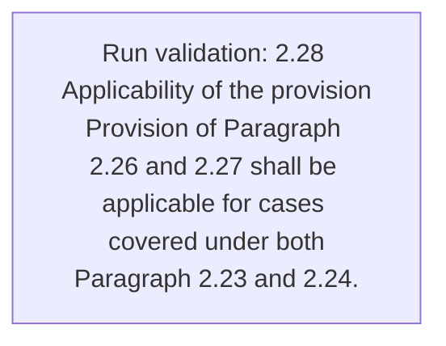
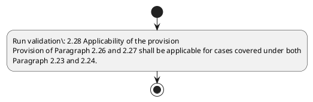

# Chapter 2 / Section 2.28: Applicability of the provision

**Chapter Title:** General Provisions Regarding Imports and Exports

**Pages:** 10

**Purpose:** 2.28 Applicability of the provision
Provision of Paragraph 2.26 and 2.27 shall be applicable for cases covered under both
Paragraph 2.23 and 2.24.

**Purpose Thanglish:** Indha Applicability of the provision section-la, 2.28 Applicability of the provision
Provision of Paragraph 2.26 and 2.27 kandippa be applicable for cases covered under both
Paragraph 2.23 and 2.24.

**Summary:** 2.28 Applicability of the provision
Provision of Paragraph 2.26 and 2.27 shall be applicable for cases covered under both
Paragraph 2.23 and 2.24. BANK GUARANTEE /LUT/ CORPORATE GUARANTEE

**Business Meaning:** Applicability of the provision governs how DGFT business controls should be applied, validated, and enforced.

**Business Explanation:** Applicability of the provision explains the operating rule set that DEKAI should enforce. Key control points include 2.28 Applicability of the provision
Provision of Paragraph 2.26 and 2.27 shall be applicable for cases covered under both
Paragraph 2.23 and 2.24.

**Business Explanation Thanglish:** Indha Applicability of the provision section-la, Applicability of the provision explains the operating rule set that DEKAI should enforce. Key control points include 2.28 Applicability of the provision
Provision of Paragraph 2.26 and 2.27 kandippa be applicable for cases covered under both
Paragraph 2.23 and 2.24.

## Business Logic
- 2.28 Applicability of the provision
Provision of Paragraph 2.26 and 2.27 shall be applicable for cases covered under both
Paragraph 2.23 and 2.24.

## Business Rules
- rule_id=CH2-SEC2_28-R001, rule_description=2.28 Applicability of the provision
Provision of Paragraph 2.26 and 2.27 shall be applicable for cases covered under both
Paragraph 2.23 and 2.24., trigger=Applicability of the provision, condition=Not explicitly covered in uploaded documents., validation=2.28 Applicability of the provision
Provision of Paragraph 2.26 and 2.27 shall be applicable for cases covered under both
Paragraph 2.23 and 2.24., action=Manual review required., exception=No explicit exception found in uploaded documents., output=DEKAI should produce a compliance decision for 2.28 - Applicability of the provision.

## Conditions
- None identified

## Condition Logic
- None identified

## Validations
- 2.28 Applicability of the provision
Provision of Paragraph 2.26 and 2.27 shall be applicable for cases covered under both
Paragraph 2.23 and 2.24.

## Exceptions
- None identified

## Dependencies
- 2.26
- 2.23
- 2.24
- 2.27

## Authorities
- None identified

## Required Documents
- None identified

## Timelines
- None identified

## Actions
- None identified

## Workflow
- Run validation: 2.28 Applicability of the provision
Provision of Paragraph 2.26 and 2.27 shall be applicable for cases covered under both
Paragraph 2.23 and 2.24.

## Workflow ASCII
```text
Applicability of the provision
Run validation: 2.28 Applicability of the provision
Provision of Paragraph 2.26 and 2.27 shall be applicable for cases covered under both
Paragraph 2.23 and 2.24.
```

## Decision Tree
- IF section 2.28 applies THEN proceed with standard DGFT workflow

## Decision Tree ASCII
```text
Applicability of the provision Decision
IF section 2.28 applies THEN proceed with standard DGFT workflow
```

## Examples
- User asks to process Applicability of the provision; the platform checks conditions, validations, and documents before action.

**Real-world Example:** Example: an importer or exporter invokes Applicability of the provision, submits the prescribed DGFT records, and DEKAI uses the extracted rules to follow the applicability of the provision process.

**Real-world Example Thanglish:** Indha Applicability of the provision section-la, Example: an importer or exporter invokes Applicability of the provision, submits the prescribed DGFT records, and DEKAI uses the extracted rules to follow the applicability of the provision process.

## AI Rules
- IF detected context matches section rule THEN enforce: 2.28 Applicability of the provision
Provision of Paragraph 2.26 and 2.27 shall be applicable for cases covered under both
Paragraph 2.23 and 2.24.

## Database Fields
- name=section_code, type=string, required=True, source=parsed_section_heading
- name=section_title, type=string, required=True, source=parsed_section_heading
- name=the_flag, type=boolean, required=False, source=keyword:the
- name=and_flag, type=boolean, required=False, source=keyword:and
- name=for_flag, type=boolean, required=False, source=keyword:for
- name=lut_flag, type=boolean, required=False, source=keyword:LUT
- name=both_flag, type=boolean, required=False, source=keyword:both
- name=bank_flag, type=boolean, required=False, source=keyword:BANK
- name=shall_flag, type=boolean, required=False, source=keyword:shall
- name=cases_flag, type=boolean, required=False, source=keyword:cases

## API Requirements
- method=GET, path=/api/dgft/sections/2.28, purpose=Retrieve knowledge payload for section 2.28, query_params=['include=workflow,decision_tree,validations'], response_fields=['section', 'title', 'summary', 'conditions', 'validations', 'exceptions', 'workflow', 'decision_tree']
- method=POST, path=/api/dgft/Applicability-of-the-provision/validate, purpose=Validate inputs and documents for Applicability of the provision, request_fields=['section_code', 'section_title'], response_fields=['status', 'errors', 'warnings', 'next_actions']

## UI Screens
- screen_id=Applicability_of_the_provision_overview, name=Applicability of the provision Overview, purpose=Show section summary, authority, timeline, and eligibility cues., widgets=['summary_card', 'conditions_table', 'authority_badges', 'timeline_panel']
- screen_id=Applicability_of_the_provision_submission, name=Applicability of the provision Submission, purpose=Capture applicant data and supporting documents., widgets=['dynamic_form', 'document_uploader', 'validation_panel', 'next_action_footer'], fields=['section_code', 'section_title', 'the_flag', 'and_flag', 'for_flag', 'lut_flag', 'both_flag', 'bank_flag']

## Error Messages
- Validation failed because the section requirements were not fully met.

## FAQ
- question_en=What is the purpose of section 2.28?, answer_en=Applicability of the provision explains the operating rule set that DEKAI should enforce. Key control points include 2.28 Applicability of the provision
Provision of Paragraph 2.26 and 2.27 shall be applicable for cases covered under both
Paragraph 2.23 and 2.24., question_thanglish=Indha Applicability of the provision section-la, What is the purpose of section 2.28?, answer_thanglish=Indha Applicability of the provision section-la, Applicability of the provision explains the operating rule set that DEKAI should enforce. Key control points include 2.28 Applicability of the provision
Provision of Paragraph 2.26 and 2.27 kandippa be applicable for cases covered under both
Paragraph 2.23 and 2.24.
- question_en=What documents are required under Applicability of the provision?, answer_en=Not explicitly covered in uploaded documents., question_thanglish=Indha Applicability of the provision section-la, What documents are required under Applicability of the provision?, answer_thanglish=Indha Applicability of the provision section-la, Not explicitly covered in uploaded documents.
- question_en=Which authority handles Applicability of the provision?, answer_en=Not explicitly covered in uploaded documents., question_thanglish=Indha Applicability of the provision section-la, Which authority handles Applicability of the provision?, answer_thanglish=Indha Applicability of the provision section-la, Not explicitly covered in uploaded documents.

## Questions Users May Ask
- What does Applicability of the provision require?
- Which documents are needed for Applicability of the provision?
- How does DEKAI validate Applicability of the provision requests?

## Expected AI Answers
- Applicability of the provision requires the platform to interpret the section text, apply the extracted business rules, and present the correct next action.
- Required documents are inferred from the section text: no explicit documents were detected.
- DEKAI validates Applicability of the provision by checking conditions, required documents, authority references, and exception clauses before recommending an outcome.

## AI Q&A Examples
- question_en=User asks: How do I comply with Applicability of the provision?, answer_en=AI answers: DEKAI should evaluate section 2.28, apply the extracted rules, and guide the user through Run validation: 2.28 Applicability of the provision
Provision of Paragraph 2.26 and 2.27 shall be applicable for cases covered under both
Paragraph 2.23 and 2.24.., question_thanglish=Indha Applicability of the provision section-la, User asks: How do I comply with Applicability of the provision?, answer_thanglish=Indha Applicability of the provision section-la, AI answers: DEKAI should evaluate section 2.28, apply the extracted rules, and guide the user through Run validation: 2.28 Applicability of the provision
Provision of Paragraph 2.26 and 2.27 kandippa be applicable for cases covered under both
Paragraph 2.23 and 2.24..
- question_en=User asks: Which validations apply to Applicability of the provision?, answer_en=AI answers: Applicable validations are 2.28 Applicability of the provision
Provision of Paragraph 2.26 and 2.27 shall be applicable for cases covered under both
Paragraph 2.23 and 2.24., question_thanglish=Indha Applicability of the provision section-la, User asks: Which validations apply to Applicability of the provision?, answer_thanglish=Indha Applicability of the provision section-la, AI answers: Applicable validations are 2.28 Applicability of the provision
Provision of Paragraph 2.26 and 2.27 kandippa be applicable for cases covered under both
Paragraph 2.23 and 2.24.

## DEKAI AI Implementation Notes
- Capture chapter 2, section 2.28, title, and page references as immutable knowledge metadata.
- Bind validations for Applicability of the provision into a rule engine keyed by the rule IDs extracted for this section.
- Show contextual links to related sections: 2.23, 2.24, 2.26, 2.27.

## DEKAI AI Implementation Notes Thanglish
- Indha Applicability of the provision section-la, Capture chapter 2, section 2.28, title, and page references as immutable knowledge metadata.
- Indha Applicability of the provision section-la, Bind validations for Applicability of the provision into a rule engine keyed by the rule IDs extracted for this section.
- Indha Applicability of the provision section-la, Show contextual links to related sections: 2.23, 2.24, 2.26, 2.27.

## AI Metadata
- Keywords: the, and, for, LUT, both, BANK, shall, cases, under, covered, provision, Paragraph, GUARANTEE, CORPORATE, applicable, Applicability
- Search Keywords: the, and, for, LUT, both, BANK, shall, cases, under, covered, provision, Paragraph, GUARANTEE, CORPORATE, applicable, Applicability
- Intent: Provide knowledge guidance for Applicability of the provision.
- Tags: 2.28, Applicability of the provision, business-rule, dgft
- Related Sections: 2.23, 2.24, 2.26, 2.27
- Related Chapters: 
- Related Rules: 2.28 Applicability of the provision
Provision of Paragraph 2.26 and 2.27 shall be applicable for cases covered under both
Paragraph 2.23 and 2.24.

## Mermaid


## PlantUML

