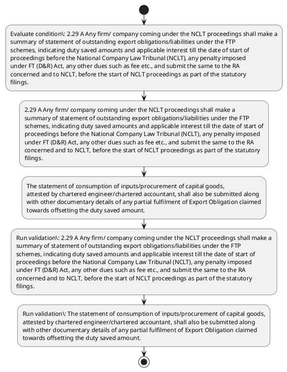

# Chapter 2 / Section 2.29: A Any firm/ company coming under the NCLT proceedings shall make a

**Chapter Title:** General Provisions Regarding Imports and Exports

**Pages:** 11

**Purpose:** 2.29 A Any firm/ company coming under the NCLT proceedings shall make a
summary of statement of outstanding export obligations/liabilities under the FTP
schemes, indicating duty saved amounts and applicable interest till the date of start of
proceedings before the National Company Law Tribunal (NCLT), any penalty imposed
under FT (D&R) Act, any other dues such as fee etc., and submit the same to the RA
concerned and to NCLT, before the start of NCLT proceedings as part of the statutory
filings.

**Purpose Thanglish:** Indha A Any firm/ company coming under the NCLT proceedings shall make a section-la, 2.29 A Any firm/ company coming under the NCLT proceedings kandippa make a
summary of statement of outstanding export obligations/liabilities under the FTP
schemes, indicating duty saved amounts and applicable interest till the date of start of
proceedings before the National Company Law Tribunal (NCLT), any penalty imposed
under FT (D&R) Act, any other dues such as fee etc., and submit the same to the RA
concerned and to NCLT, before the start of NCLT proceedings as part of the statutory
filings.

**Summary:** 2.29 A Any firm/ company coming under the NCLT proceedings shall make a
summary of statement of outstanding export obligations/liabilities under the FTP
schemes, indicating duty saved amounts and applicable interest till the date of start of
proceedings before the National Company Law Tribunal (NCLT), any penalty imposed
under FT (D&R) Act, any other dues such as fee etc., and submit the same to the RA
concerned and to NCLT, before the start of NCLT proceedings as part of the statutory
filings. The statement of consumption of inputs/procurement of capital goods,
attested by chartered engineer/chartered accountant, shall also be submitted along
with other documentary details of any partial fulfilment of Export Obligation claimed
towards offsetting the duty saved amount.

**Business Meaning:** A Any firm/ company coming under the NCLT proceedings shall make a governs how DGFT business controls should be applied, validated, and enforced.

**Business Explanation:** A Any firm/ company coming under the NCLT proceedings shall make a explains the operating rule set that DEKAI should enforce. Key control points include 2.29 A Any firm/ company coming under the NCLT proceedings shall make a
summary of statement of outstanding export obligations/liabilities under the FTP
schemes, indicating duty saved amounts and applicable interest till the date of start of
proceedings before the National Company Law Tribunal (NCLT), any penalty imposed
under FT (D&R) Act, any other dues such as fee etc., and submit the same to the RA
concerned and to NCLT, before the start of NCLT proceedings as part of the statutory
filings. The section also drives actions such as 2.29 A Any firm/ company coming under the NCLT proceedings shall make a
summary of statement of outstanding export obligations/liabilities under the FTP
schemes, indicating duty saved amounts and applicable interest till the date of start of
proceedings before the National Company Law Tribunal (NCLT), any penalty imposed
under FT (D&R) Act, any other dues such as fee etc., and submit the same to the RA
concerned and to NCLT, before the start of NCLT proceedings as part of the statutory
filings..

**Business Explanation Thanglish:** Indha A Any firm/ company coming under the NCLT proceedings shall make a section-la, A Any firm/ company coming under the NCLT proceedings kandippa make a explains the operating rule set that DEKAI should enforce. Key control points include 2.29 A Any firm/ company coming under the NCLT proceedings kandippa make a
summary of statement of outstanding export obligations/liabilities under the FTP
schemes, indicating duty saved amounts and applicable interest till the date of start of
proceedings before the National Company Law Tribunal (NCLT), any penalty imposed
under FT (D&R) Act, any other dues such as fee etc., and submit the same to the RA
concerned and to NCLT, before the start of NCLT proceedings as part of the statutory
filings. The section also drives actions such as 2.29 A Any firm/ company coming under the NCLT proceedings kandippa make a
summary of statement of outstanding export obligations/liabilities under the FTP
schemes, indicating duty saved amounts and applicable interest till the date of start of
proceedings before the National Company Law Tribunal (NCLT), any penalty imposed
under FT (D&R) Act, any other dues such as fee etc., and submit the same to the RA
concerned and to NCLT, before the start of NCLT proceedings as part of the statutory
filings..

## Business Logic
- 2.29 A Any firm/ company coming under the NCLT proceedings shall make a
summary of statement of outstanding export obligations/liabilities under the FTP
schemes, indicating duty saved amounts and applicable interest till the date of start of
proceedings before the National Company Law Tribunal (NCLT), any penalty imposed
under FT (D&R) Act, any other dues such as fee etc., and submit the same to the RA
concerned and to NCLT, before the start of NCLT proceedings as part of the statutory
filings.
- The statement of consumption of inputs/procurement of capital goods,
attested by chartered engineer/chartered accountant, shall also be submitted along
with other documentary details of any partial fulfilment of Export Obligation claimed
towards offsetting the duty saved amount.

## Business Rules
- rule_id=CH2-SEC2_29-R001, rule_description=2.29 A Any firm/ company coming under the NCLT proceedings shall make a
summary of statement of outstanding export obligations/liabilities under the FTP
schemes, indicating duty saved amounts and applicable interest till the date of start of
proceedings before the National Company Law Tribunal (NCLT), any penalty imposed
under FT (D&R) Act, any other dues such as fee etc., and submit the same to the RA
concerned and to NCLT, before the start of NCLT proceedings as part of the statutory
filings., trigger=A Any firm/ company coming under the NCLT proceedings shall make a, condition=2.29 A Any firm/ company coming under the NCLT proceedings shall make a
summary of statement of outstanding export obligations/liabilities under the FTP
schemes, indicating duty saved amounts and applicable interest till the date of start of
proceedings before the National Company Law Tribunal (NCLT), any penalty imposed
under FT (D&R) Act, any other dues such as fee etc., and submit the same to the RA
concerned and to NCLT, before the start of NCLT proceedings as part of the statutory
filings., validation=2.29 A Any firm/ company coming under the NCLT proceedings shall make a
summary of statement of outstanding export obligations/liabilities under the FTP
schemes, indicating duty saved amounts and applicable interest till the date of start of
proceedings before the National Company Law Tribunal (NCLT), any penalty imposed
under FT (D&R) Act, any other dues such as fee etc., and submit the same to the RA
concerned and to NCLT, before the start of NCLT proceedings as part of the statutory
filings., action=2.29 A Any firm/ company coming under the NCLT proceedings shall make a
summary of statement of outstanding export obligations/liabilities under the FTP
schemes, indicating duty saved amounts and applicable interest till the date of start of
proceedings before the National Company Law Tribunal (NCLT), any penalty imposed
under FT (D&R) Act, any other dues such as fee etc., and submit the same to the RA
concerned and to NCLT, before the start of NCLT proceedings as part of the statutory
filings., exception=No explicit exception found in uploaded documents., output=DEKAI should produce a compliance decision for 2.29 - A Any firm/ company coming under the NCLT proceedings shall make a.
- rule_id=CH2-SEC2_29-R002, rule_description=The statement of consumption of inputs/procurement of capital goods,
attested by chartered engineer/chartered accountant, shall also be submitted along
with other documentary details of any partial fulfilment of Export Obligation claimed
towards offsetting the duty saved amount., trigger=A Any firm/ company coming under the NCLT proceedings shall make a, condition=2.29 A Any firm/ company coming under the NCLT proceedings shall make a
summary of statement of outstanding export obligations/liabilities under the FTP
schemes, indicating duty saved amounts and applicable interest till the date of start of
proceedings before the National Company Law Tribunal (NCLT), any penalty imposed
under FT (D&R) Act, any other dues such as fee etc., and submit the same to the RA
concerned and to NCLT, before the start of NCLT proceedings as part of the statutory
filings., validation=The statement of consumption of inputs/procurement of capital goods,
attested by chartered engineer/chartered accountant, shall also be submitted along
with other documentary details of any partial fulfilment of Export Obligation claimed
towards offsetting the duty saved amount., action=The statement of consumption of inputs/procurement of capital goods,
attested by chartered engineer/chartered accountant, shall also be submitted along
with other documentary details of any partial fulfilment of Export Obligation claimed
towards offsetting the duty saved amount., exception=No explicit exception found in uploaded documents., output=DEKAI should produce a compliance decision for 2.29 - A Any firm/ company coming under the NCLT proceedings shall make a.

## Conditions
- 2.29 A Any firm/ company coming under the NCLT proceedings shall make a
summary of statement of outstanding export obligations/liabilities under the FTP
schemes, indicating duty saved amounts and applicable interest till the date of start of
proceedings before the National Company Law Tribunal (NCLT), any penalty imposed
under FT (D&R) Act, any other dues such as fee etc., and submit the same to the RA
concerned and to NCLT, before the start of NCLT proceedings as part of the statutory
filings.

## Condition Logic
- id=2.2.29.1, if=2.29 A Any firm/ company coming under the NCLT proceedings shall make a
summary of statement of outstanding export obligations/liabilities under the FTP
schemes, indicating duty saved amounts and applicable interest till the date of start of
proceedings before the National Company Law Tribunal (NCLT), any penalty imposed
under FT (D&R) Act, any other dues such as fee etc., and submit the same to the RA
concerned and to NCLT, before the start of NCLT proceedings as part of the statutory
filings., then=2.29 A Any firm/ company coming under the NCLT proceedings shall make a
summary of statement of outstanding export obligations/liabilities under the FTP
schemes, indicating duty saved amounts and applicable interest till the date of start of
proceedings before the National Company Law Tribunal (NCLT), any penalty imposed
under FT (D&R) Act, any other dues such as fee etc., and submit the same to the RA
concerned and to NCLT, before the start of NCLT proceedings as part of the statutory
filings., source=2.29 A Any firm/ company coming under the NCLT proceedings shall make a
summary of statement of outstanding export obligations/liabilities under the FTP
schemes, indicating duty saved amounts and applicable interest till the date of start of
proceedings before the National Company Law Tribunal (NCLT), any penalty imposed
under FT (D&R) Act, any other dues such as fee etc., and submit the same to the RA
concerned and to NCLT, before the start of NCLT proceedings as part of the statutory
filings.

## Validations
- 2.29 A Any firm/ company coming under the NCLT proceedings shall make a
summary of statement of outstanding export obligations/liabilities under the FTP
schemes, indicating duty saved amounts and applicable interest till the date of start of
proceedings before the National Company Law Tribunal (NCLT), any penalty imposed
under FT (D&R) Act, any other dues such as fee etc., and submit the same to the RA
concerned and to NCLT, before the start of NCLT proceedings as part of the statutory
filings.
- The statement of consumption of inputs/procurement of capital goods,
attested by chartered engineer/chartered accountant, shall also be submitted along
with other documentary details of any partial fulfilment of Export Obligation claimed
towards offsetting the duty saved amount.

## Exceptions
- None identified

## Dependencies
- None identified

## Authorities
- RA

## Required Documents
- 2.29 A Any firm/ company coming under the NCLT proceedings shall make a
summary of statement of outstanding export obligations/liabilities under the FTP
schemes, indicating duty saved amounts and applicable interest till the date of start of
proceedings before the National Company Law Tribunal (NCLT), any penalty imposed
under FT (D&R) Act, any other dues such as fee etc., and submit the same to the RA
concerned and to NCLT, before the start of NCLT proceedings as part of the statutory
filings.
- The statement of consumption of inputs/procurement of capital goods,
attested by chartered engineer/chartered accountant, shall also be submitted along
with other documentary details of any partial fulfilment of Export Obligation claimed
towards offsetting the duty saved amount.

## Timelines
- 2.29 A Any firm/ company coming under the NCLT proceedings shall make a
summary of statement of outstanding export obligations/liabilities under the FTP
schemes, indicating duty saved amounts and applicable interest till the date of start of
proceedings before the National Company Law Tribunal (NCLT), any penalty imposed
under FT (D&R) Act, any other dues such as fee etc., and submit the same to the RA
concerned and to NCLT, before the start of NCLT proceedings as part of the statutory
filings.

## Actions
- 2.29 A Any firm/ company coming under the NCLT proceedings shall make a
summary of statement of outstanding export obligations/liabilities under the FTP
schemes, indicating duty saved amounts and applicable interest till the date of start of
proceedings before the National Company Law Tribunal (NCLT), any penalty imposed
under FT (D&R) Act, any other dues such as fee etc., and submit the same to the RA
concerned and to NCLT, before the start of NCLT proceedings as part of the statutory
filings.
- The statement of consumption of inputs/procurement of capital goods,
attested by chartered engineer/chartered accountant, shall also be submitted along
with other documentary details of any partial fulfilment of Export Obligation claimed
towards offsetting the duty saved amount.

## Workflow
- Evaluate condition: 2.29 A Any firm/ company coming under the NCLT proceedings shall make a
summary of statement of outstanding export obligations/liabilities under the FTP
schemes, indicating duty saved amounts and applicable interest till the date of start of
proceedings before the National Company Law Tribunal (NCLT), any penalty imposed
under FT (D&R) Act, any other dues such as fee etc., and submit the same to the RA
concerned and to NCLT, before the start of NCLT proceedings as part of the statutory
filings.
- 2.29 A Any firm/ company coming under the NCLT proceedings shall make a
summary of statement of outstanding export obligations/liabilities under the FTP
schemes, indicating duty saved amounts and applicable interest till the date of start of
proceedings before the National Company Law Tribunal (NCLT), any penalty imposed
under FT (D&R) Act, any other dues such as fee etc., and submit the same to the RA
concerned and to NCLT, before the start of NCLT proceedings as part of the statutory
filings.
- The statement of consumption of inputs/procurement of capital goods,
attested by chartered engineer/chartered accountant, shall also be submitted along
with other documentary details of any partial fulfilment of Export Obligation claimed
towards offsetting the duty saved amount.
- Run validation: 2.29 A Any firm/ company coming under the NCLT proceedings shall make a
summary of statement of outstanding export obligations/liabilities under the FTP
schemes, indicating duty saved amounts and applicable interest till the date of start of
proceedings before the National Company Law Tribunal (NCLT), any penalty imposed
under FT (D&R) Act, any other dues such as fee etc., and submit the same to the RA
concerned and to NCLT, before the start of NCLT proceedings as part of the statutory
filings.
- Run validation: The statement of consumption of inputs/procurement of capital goods,
attested by chartered engineer/chartered accountant, shall also be submitted along
with other documentary details of any partial fulfilment of Export Obligation claimed
towards offsetting the duty saved amount.

## Workflow ASCII
```text
A Any firm/ company coming under the NCLT proceedings shall make a
Evaluate condition: 2.29 A Any firm/ company coming under the NCLT proceedings shall make a
summary of statement of outstanding export obligations/liabilities under the FTP
schemes, indicating duty saved amounts and applicable interest till the date of start of
proceedings before the National Company Law Tribunal (NCLT), any penalty imposed
under FT (D&R) Act, any other dues such as fee etc., and submit the same to the RA
concerned and to NCLT, before the start of NCLT proceedings as part of the statutory
filings.
   |
   v
2.29 A Any firm/ company coming under the NCLT proceedings shall make a
summary of statement of outstanding export obligations/liabilities under the FTP
schemes, indicating duty saved amounts and applicable interest till the date of start of
proceedings before the National Company Law Tribunal (NCLT), any penalty imposed
under FT (D&R) Act, any other dues such as fee etc., and submit the same to the RA
concerned and to NCLT, before the start of NCLT proceedings as part of the statutory
filings.
   |
   v
The statement of consumption of inputs/procurement of capital goods,
attested by chartered engineer/chartered accountant, shall also be submitted along
with other documentary details of any partial fulfilment of Export Obligation claimed
towards offsetting the duty saved amount.
   |
   v
Run validation: 2.29 A Any firm/ company coming under the NCLT proceedings shall make a
summary of statement of outstanding export obligations/liabilities under the FTP
schemes, indicating duty saved amounts and applicable interest till the date of start of
proceedings before the National Company Law Tribunal (NCLT), any penalty imposed
under FT (D&R) Act, any other dues such as fee etc., and submit the same to the RA
concerned and to NCLT, before the start of NCLT proceedings as part of the statutory
filings.
   |
   v
Run validation: The statement of consumption of inputs/procurement of capital goods,
attested by chartered engineer/chartered accountant, shall also be submitted along
with other documentary details of any partial fulfilment of Export Obligation claimed
towards offsetting the duty saved amount.
```

## Decision Tree
- IF 2.29 A Any firm/ company coming under the NCLT proceedings shall make a
summary of statement of outstanding export obligations/liabilities under the FTP
schemes, indicating duty saved amounts and applicable interest till the date of start of
proceedings before the National Company Law Tribunal (NCLT), any penalty imposed
under FT (D&R) Act, any other dues such as fee etc., and submit the same to the RA
concerned and to NCLT, before the start of NCLT proceedings as part of the statutory
filings. THEN 2.29 A Any firm/ company coming under the NCLT proceedings shall make a
summary of statement of outstanding export obligations/liabilities under the FTP
schemes, indicating duty saved amounts and applicable interest till the date of start of
proceedings before the National Company Law Tribunal (NCLT), any penalty imposed
under FT (D&R) Act, any other dues such as fee etc., and submit the same to the RA
concerned and to NCLT, before the start of NCLT proceedings as part of the statutory
filings.

## Decision Tree ASCII
```text
A Any firm/ company coming under the NCLT proceedings shall make a Decision
IF 2.29 A Any firm/ company coming under the NCLT proceedings shall make a
summary of statement of outstanding export obligations/liabilities under the FTP
schemes, indicating duty saved amounts and applicable interest till the date of start of
proceedings before the National Company Law Tribunal (NCLT), any penalty imposed
under FT (D&R) Act, any other dues such as fee etc., and submit the same to the RA
concerned and to NCLT, before the start of NCLT proceedings as part of the statutory
filings. THEN 2.29 A Any firm/ company coming under the NCLT proceedings shall make a
summary of statement of outstanding export obligations/liabilities under the FTP
schemes, indicating duty saved amounts and applicable interest till the date of start of
proceedings before the National Company Law Tribunal (NCLT), any penalty imposed
under FT (D&R) Act, any other dues such as fee etc., and submit the same to the RA
concerned and to NCLT, before the start of NCLT proceedings as part of the statutory
filings.
```

## Examples
- 2.29 A Any firm/ company coming under the NCLT proceedings shall make a
summary of statement of outstanding export obligations/liabilities under the FTP
schemes, indicating duty saved amounts and applicable interest till the date of start of
proceedings before the National Company Law Tribunal (NCLT), any penalty imposed
under FT (D&R) Act, any other dues such as fee etc., and submit the same to the RA
concerned and to NCLT, before the start of NCLT proceedings as part of the statutory
filings.

**Real-world Example:** Example: an importer or exporter invokes A Any firm/ company coming under the NCLT proceedings shall make a, submits 2.29 A Any firm/ company coming under the NCLT proceedings shall make a
summary of statement of outstanding export obligations/liabilities under the FTP
schemes, indicating duty saved amounts and applicable interest till the date of start of
proceedings before the National Company Law Tribunal (NCLT), any penalty imposed
under FT (D&R) Act, any other dues such as fee etc., and submit the same to the RA
concerned and to NCLT, before the start of NCLT proceedings as part of the statutory
filings., The statement of consumption of inputs/procurement of capital goods,
attested by chartered engineer/chartered accountant, shall also be submitted along
with other documentary details of any partial fulfilment of Export Obligation claimed
towards offsetting the duty saved amount., and DEKAI uses the extracted rules to 2.29 a any firm/ company coming under the nclt proceedings shall make a
summary of statement of outstanding export obligations/liabilities under the ftp
schemes, indicating duty saved amounts and applicable interest till the date of start of
proceedings before the national company law tribunal (nclt), any penalty imposed
under ft (d&r) act, any other dues such as fee etc., and submit the same to the ra
concerned and to nclt, before the start of nclt proceedings as part of the statutory
filings..

**Real-world Example Thanglish:** Indha A Any firm/ company coming under the NCLT proceedings shall make a section-la, Example: an importer or exporter invokes A Any firm/ company coming under the NCLT proceedings kandippa make a, submits 2.29 A Any firm/ company coming under the NCLT proceedings kandippa make a
summary of statement of outstanding export obligations/liabilities under the FTP
schemes, indicating duty saved amounts and applicable interest till the date of start of
proceedings before the National Company Law Tribunal (NCLT), any penalty imposed
under FT (D&R) Act, any other dues such as fee etc., and submit the same to the RA
concerned and to NCLT, before the start of NCLT proceedings as part of the statutory
filings., The statement of consumption of inputs/procurement of capital goods,
attested by chartered engineer/chartered accountant, kandippa also be submitted along
with other documentary details of any partial fulfilment of export Obligation claimed
towards offsetting the duty saved amount., and DEKAI uses the extracted rules to 2.29 a any firm/ company coming under the nclt proceedings kandippa make a
summary of statement of outstanding export obligations/liabilities under the ftp
schemes, indicating duty saved amounts and applicable interest till the date of start of
proceedings before the national company law tribunal (nclt), any penalty imposed
under ft (d&r) act, any other dues such as fee etc., and submit the same to the ra
concerned and to nclt, before the start of nclt proceedings as part of the statutory
filings..

## AI Rules
- IF detected context matches section rule THEN enforce: 2.29 A Any firm/ company coming under the NCLT proceedings shall make a
summary of statement of outstanding export obligations/liabilities under the FTP
schemes, indicating duty saved amounts and applicable interest till the date of start of
proceedings before the National Company Law Tribunal (NCLT), any penalty imposed
under FT (D&R) Act, any other dues such as fee etc., and submit the same to the RA
concerned and to NCLT, before the start of NCLT proceedings as part of the statutory
filings.
- IF detected context matches section rule THEN enforce: The statement of consumption of inputs/procurement of capital goods,
attested by chartered engineer/chartered accountant, shall also be submitted along
with other documentary details of any partial fulfilment of Export Obligation claimed
towards offsetting the duty saved amount.
- IF validations pass THEN recommend action: 2.29 A Any firm/ company coming under the NCLT proceedings shall make a
summary of statement of outstanding export obligations/liabilities under the FTP
schemes, indicating duty saved amounts and applicable interest till the date of start of
proceedings before the National Company Law Tribunal (NCLT), any penalty imposed
under FT (D&R) Act, any other dues such as fee etc., and submit the same to the RA
concerned and to NCLT, before the start of NCLT proceedings as part of the statutory
filings.

## Database Fields
- name=section_code, type=string, required=True, source=parsed_section_heading
- name=section_title, type=string, required=True, source=parsed_section_heading
- name=any_flag, type=boolean, required=False, source=keyword:Any
- name=the_flag, type=boolean, required=False, source=keyword:the
- name=ftp_flag, type=boolean, required=False, source=keyword:FTP
- name=and_flag, type=boolean, required=False, source=keyword:and
- name=law_flag, type=boolean, required=False, source=keyword:Law
- name=d&r_flag, type=boolean, required=False, source=keyword:D&R
- name=act_flag, type=boolean, required=False, source=keyword:Act
- name=fee_flag, type=boolean, required=False, source=keyword:fee
- name=document_1_submitted, type=boolean, required=True, source=2.29 A Any firm/ company coming under the NCLT proceedings shall make a
summary of statement of outstanding export obligations/liabilities under the FTP
schemes, indicating duty saved amounts and applicable interest till the date of start of
proceedings before the National Company Law Tribunal (NCLT), any penalty imposed
under FT (D&R) Act, any other dues such as fee etc., and submit the same to the RA
concerned and to NCLT, before the start of NCLT proceedings as part of the statutory
filings.
- name=document_2_submitted, type=boolean, required=True, source=The statement of consumption of inputs/procurement of capital goods,
attested by chartered engineer/chartered accountant, shall also be submitted along
with other documentary details of any partial fulfilment of Export Obligation claimed
towards offsetting the duty saved amount.

## API Requirements
- method=GET, path=/api/dgft/sections/2.29, purpose=Retrieve knowledge payload for section 2.29, query_params=['include=workflow,decision_tree,validations'], response_fields=['section', 'title', 'summary', 'conditions', 'validations', 'exceptions', 'workflow', 'decision_tree']
- method=POST, path=/api/dgft/A-Any-firm-company-coming-under-the-NCLT-proceedings-shall-make-a/validate, purpose=Validate inputs and documents for A Any firm/ company coming under the NCLT proceedings shall make a, request_fields=['section_code', 'section_title', 'document_1_submitted', 'document_2_submitted'], response_fields=['status', 'errors', 'warnings', 'next_actions']
- method=POST, path=/api/dgft/A-Any-firm-company-coming-under-the-NCLT-proceedings-shall-make-a/execute, purpose=Trigger business action for 2.29 A Any firm/ company coming under the NCLT proceedings shall make a
summary of statement of outstanding export obligations/liabilities under the FTP
schemes, indicating duty saved amounts and applicable interest till the date of start of
proceedings before the National Company Law Tribunal (NCLT), any penalty imposed
under FT (D&R) Act, any other dues such as fee etc., and submit the same to the RA
concerned and to NCLT, before the start of NCLT proceedings as part of the statutory
filings., request_fields=['section_code', 'section_title', 'document_1_submitted', 'document_2_submitted'], response_fields=['reference_id', 'status', 'authority', 'timeline']

## UI Screens
- screen_id=A_Any_firm_company_coming_under_the_NCLT_proceedings_shall_make_a_overview, name=A Any firm/ company coming under the NCLT proceedings shall make a Overview, purpose=Show section summary, authority, timeline, and eligibility cues., widgets=['summary_card', 'conditions_table', 'authority_badges', 'timeline_panel']
- screen_id=A_Any_firm_company_coming_under_the_NCLT_proceedings_shall_make_a_submission, name=A Any firm/ company coming under the NCLT proceedings shall make a Submission, purpose=Capture applicant data and supporting documents., widgets=['dynamic_form', 'document_uploader', 'validation_panel', 'next_action_footer'], fields=['section_code', 'section_title', 'any_flag', 'the_flag', 'ftp_flag', 'and_flag', 'law_flag', 'd&r_flag']

## Error Messages
- Validation failed because the section requirements were not fully met.

## FAQ
- question_en=What is the purpose of section 2.29?, answer_en=A Any firm/ company coming under the NCLT proceedings shall make a explains the operating rule set that DEKAI should enforce. Key control points include 2.29 A Any firm/ company coming under the NCLT proceedings shall make a
summary of statement of outstanding export obligations/liabilities under the FTP
schemes, indicating duty saved amounts and applicable interest till the date of start of
proceedings before the National Company Law Tribunal (NCLT), any penalty imposed
under FT (D&R) Act, any other dues such as fee etc., and submit the same to the RA
concerned and to NCLT, before the start of NCLT proceedings as part of the statutory
filings. The section also drives actions such as 2.29 A Any firm/ company coming under the NCLT proceedings shall make a
summary of statement of outstanding export obligations/liabilities under the FTP
schemes, indicating duty saved amounts and applicable interest till the date of start of
proceedings before the National Company Law Tribunal (NCLT), any penalty imposed
under FT (D&R) Act, any other dues such as fee etc., and submit the same to the RA
concerned and to NCLT, before the start of NCLT proceedings as part of the statutory
filings.., question_thanglish=Indha A Any firm/ company coming under the NCLT proceedings shall make a section-la, What is the purpose of section 2.29?, answer_thanglish=Indha A Any firm/ company coming under the NCLT proceedings shall make a section-la, A Any firm/ company coming under the NCLT proceedings kandippa make a explains the operating rule set that DEKAI should enforce. Key control points include 2.29 A Any firm/ company coming under the NCLT proceedings kandippa make a
summary of statement of outstanding export obligations/liabilities under the FTP
schemes, indicating duty saved amounts and applicable interest till the date of start of
proceedings before the National Company Law Tribunal (NCLT), any penalty imposed
under FT (D&R) Act, any other dues such as fee etc., and submit the same to the RA
concerned and to NCLT, before the start of NCLT proceedings as part of the statutory
filings. The section also drives actions such as 2.29 A Any firm/ company coming under the NCLT proceedings kandippa make a
summary of statement of outstanding export obligations/liabilities under the FTP
schemes, indicating duty saved amounts and applicable interest till the date of start of
proceedings before the National Company Law Tribunal (NCLT), any penalty imposed
under FT (D&R) Act, any other dues such as fee etc., and submit the same to the RA
concerned and to NCLT, before the start of NCLT proceedings as part of the statutory
filings..
- question_en=What documents are required under A Any firm/ company coming under the NCLT proceedings shall make a?, answer_en=2.29 A Any firm/ company coming under the NCLT proceedings shall make a
summary of statement of outstanding export obligations/liabilities under the FTP
schemes, indicating duty saved amounts and applicable interest till the date of start of
proceedings before the National Company Law Tribunal (NCLT), any penalty imposed
under FT (D&R) Act, any other dues such as fee etc., and submit the same to the RA
concerned and to NCLT, before the start of NCLT proceedings as part of the statutory
filings., The statement of consumption of inputs/procurement of capital goods,
attested by chartered engineer/chartered accountant, shall also be submitted along
with other documentary details of any partial fulfilment of Export Obligation claimed
towards offsetting the duty saved amount., question_thanglish=Indha A Any firm/ company coming under the NCLT proceedings shall make a section-la, What documents are required under A Any firm/ company coming under the NCLT proceedings kandippa make a?, answer_thanglish=Indha A Any firm/ company coming under the NCLT proceedings shall make a section-la, 2.29 A Any firm/ company coming under the NCLT proceedings kandippa make a
summary of statement of outstanding export obligations/liabilities under the FTP
schemes, indicating duty saved amounts and applicable interest till the date of start of
proceedings before the National Company Law Tribunal (NCLT), any penalty imposed
under FT (D&R) Act, any other dues such as fee etc., and submit the same to the RA
concerned and to NCLT, before the start of NCLT proceedings as part of the statutory
filings., The statement of consumption of inputs/procurement of capital goods,
attested by chartered engineer/chartered accountant, kandippa also be submitted along
with other documentary details of any partial fulfilment of export Obligation claimed
towards offsetting the duty saved amount.
- question_en=Which authority handles A Any firm/ company coming under the NCLT proceedings shall make a?, answer_en=RA, question_thanglish=Indha A Any firm/ company coming under the NCLT proceedings shall make a section-la, Which authority handles A Any firm/ company coming under the NCLT proceedings kandippa make a?, answer_thanglish=Indha A Any firm/ company coming under the NCLT proceedings shall make a section-la, RA

## Questions Users May Ask
- What does A Any firm/ company coming under the NCLT proceedings shall make a require?
- Which documents are needed for A Any firm/ company coming under the NCLT proceedings shall make a?
- How does DEKAI validate A Any firm/ company coming under the NCLT proceedings shall make a requests?
- What action should be taken for A Any firm/ company coming under the NCLT proceedings shall make a?

## Expected AI Answers
- A Any firm/ company coming under the NCLT proceedings shall make a requires the platform to interpret the section text, apply the extracted business rules, and present the correct next action.
- Required documents are inferred from the section text: 2.29 A Any firm/ company coming under the NCLT proceedings shall make a
summary of statement of outstanding export obligations/liabilities under the FTP
schemes, indicating duty saved amounts and applicable interest till the date of start of
proceedings before the National Company Law Tribunal (NCLT), any penalty imposed
under FT (D&R) Act, any other dues such as fee etc., and submit the same to the RA
concerned and to NCLT, before the start of NCLT proceedings as part of the statutory
filings., The statement of consumption of inputs/procurement of capital goods,
attested by chartered engineer/chartered accountant, shall also be submitted along
with other documentary details of any partial fulfilment of Export Obligation claimed
towards offsetting the duty saved amount.
- DEKAI validates A Any firm/ company coming under the NCLT proceedings shall make a by checking conditions, required documents, authority references, and exception clauses before recommending an outcome.
- The primary extracted action is: 2.29 A Any firm/ company coming under the NCLT proceedings shall make a
summary of statement of outstanding export obligations/liabilities under the FTP
schemes, indicating duty saved amounts and applicable interest till the date of start of
proceedings before the National Company Law Tribunal (NCLT), any penalty imposed
under FT (D&R) Act, any other dues such as fee etc., and submit the same to the RA
concerned and to NCLT, before the start of NCLT proceedings as part of the statutory
filings.

## AI Q&A Examples
- question_en=User asks: How do I comply with A Any firm/ company coming under the NCLT proceedings shall make a?, answer_en=AI answers: DEKAI should evaluate section 2.29, apply the extracted rules, and guide the user through Evaluate condition: 2.29 A Any firm/ company coming under the NCLT proceedings shall make a
summary of statement of outstanding export obligations/liabilities under the FTP
schemes, indicating duty saved amounts and applicable interest till the date of start of
proceedings before the National Company Law Tribunal (NCLT), any penalty imposed
under FT (D&R) Act, any other dues such as fee etc., and submit the same to the RA
concerned and to NCLT, before the start of NCLT proceedings as part of the statutory
filings.., question_thanglish=Indha A Any firm/ company coming under the NCLT proceedings shall make a section-la, User asks: How do I comply with A Any firm/ company coming under the NCLT proceedings kandippa make a?, answer_thanglish=Indha A Any firm/ company coming under the NCLT proceedings shall make a section-la, AI answers: DEKAI should evaluate section 2.29, apply the extracted rules, and guide the user through Evaluate condition: 2.29 A Any firm/ company coming under the NCLT proceedings kandippa make a
summary of statement of outstanding export obligations/liabilities under the FTP
schemes, indicating duty saved amounts and applicable interest till the date of start of
proceedings before the National Company Law Tribunal (NCLT), any penalty imposed
under FT (D&R) Act, any other dues such as fee etc., and submit the same to the RA
concerned and to NCLT, before the start of NCLT proceedings as part of the statutory
filings..
- question_en=User asks: Which validations apply to A Any firm/ company coming under the NCLT proceedings shall make a?, answer_en=AI answers: Applicable validations are 2.29 A Any firm/ company coming under the NCLT proceedings shall make a
summary of statement of outstanding export obligations/liabilities under the FTP
schemes, indicating duty saved amounts and applicable interest till the date of start of
proceedings before the National Company Law Tribunal (NCLT), any penalty imposed
under FT (D&R) Act, any other dues such as fee etc., and submit the same to the RA
concerned and to NCLT, before the start of NCLT proceedings as part of the statutory
filings., The statement of consumption of inputs/procurement of capital goods,
attested by chartered engineer/chartered accountant, shall also be submitted along
with other documentary details of any partial fulfilment of Export Obligation claimed
towards offsetting the duty saved amount., question_thanglish=Indha A Any firm/ company coming under the NCLT proceedings shall make a section-la, User asks: Which validations apply to A Any firm/ company coming under the NCLT proceedings kandippa make a?, answer_thanglish=Indha A Any firm/ company coming under the NCLT proceedings shall make a section-la, AI answers: Applicable validations are 2.29 A Any firm/ company coming under the NCLT proceedings kandippa make a
summary of statement of outstanding export obligations/liabilities under the FTP
schemes, indicating duty saved amounts and applicable interest till the date of start of
proceedings before the National Company Law Tribunal (NCLT), any penalty imposed
under FT (D&R) Act, any other dues such as fee etc., and submit the same to the RA
concerned and to NCLT, before the start of NCLT proceedings as part of the statutory
filings., The statement of consumption of inputs/procurement of capital goods,
attested by chartered engineer/chartered accountant, kandippa also be submitted along
with other documentary details of any partial fulfilment of export Obligation claimed
towards offsetting the duty saved amount.

## DEKAI AI Implementation Notes
- Capture chapter 2, section 2.29, title, and page references as immutable knowledge metadata.
- Bind validations for A Any firm/ company coming under the NCLT proceedings shall make a into a rule engine keyed by the rule IDs extracted for this section.
- Expose document upload controls for: 2.29 A Any firm/ company coming under the NCLT proceedings shall make a
summary of statement of outstanding export obligations/liabilities under the FTP
schemes, indicating duty saved amounts and applicable interest till the date of start of
proceedings before the National Company Law Tribunal (NCLT), any penalty imposed
under FT (D&R) Act, any other dues such as fee etc., and submit the same to the RA
concerned and to NCLT, before the start of NCLT proceedings as part of the statutory
filings., The statement of consumption of inputs/procurement of capital goods,
attested by chartered engineer/chartered accountant, shall also be submitted along
with other documentary details of any partial fulfilment of Export Obligation claimed
towards offsetting the duty saved amount..
- Route escalations or approvals to: RA.

## DEKAI AI Implementation Notes Thanglish
- Indha A Any firm/ company coming under the NCLT proceedings shall make a section-la, Capture chapter 2, section 2.29, title, and page references as immutable knowledge metadata.
- Indha A Any firm/ company coming under the NCLT proceedings shall make a section-la, Bind validations for A Any firm/ company coming under the NCLT proceedings kandippa make a into a rule engine keyed by the rule IDs extracted for this section.
- Indha A Any firm/ company coming under the NCLT proceedings shall make a section-la, Expose document upload controls for: 2.29 A Any firm/ company coming under the NCLT proceedings kandippa make a
summary of statement of outstanding export obligations/liabilities under the FTP
schemes, indicating duty saved amounts and applicable interest till the date of start of
proceedings before the National Company Law Tribunal (NCLT), any penalty imposed
under FT (D&R) Act, any other dues such as fee etc., and submit the same to the RA
concerned and to NCLT, before the start of NCLT proceedings as part of the statutory
filings., The statement of consumption of inputs/procurement of capital goods,
attested by chartered engineer/chartered accountant, kandippa also be submitted along
with other documentary details of any partial fulfilment of export Obligation claimed
towards offsetting the duty saved amount..
- Indha A Any firm/ company coming under the NCLT proceedings shall make a section-la, Route escalations or approvals to: RA.

## AI Metadata
- Keywords: Any, the, FTP, and, Law, D&R, Act, fee, etc, firm, NCLT, make, duty, till, date, dues, such, same, part, also
- Search Keywords: Any, the, FTP, and, Law, D&R, Act, fee, etc, firm, NCLT, make, duty, till, date, dues, such, same, part, also
- Intent: Support A Any firm/ company coming under the NCLT proceedings shall make a processing and compliance validation.
- Tags: 2.29, A Any firm/ company coming under the NCLT proceedings shall make a, business-rule, document-driven, dgft
- Related Sections: 
- Related Chapters: 
- Related Rules: 2.29 A Any firm/ company coming under the NCLT proceedings shall make a
summary of statement of outstanding export obligations/liabilities under the FTP
schemes, indicating duty saved amounts and applicable interest till the date of start of
proceedings before the National Company Law Tribunal (NCLT), any penalty imposed
under FT (D&R) Act, any other dues such as fee etc., and submit the same to the RA
concerned and to NCLT, before the start of NCLT proceedings as part of the statutory
filings., The statement of consumption of inputs/procurement of capital goods,
attested by chartered engineer/chartered accountant, shall also be submitted along
with other documentary details of any partial fulfilment of Export Obligation claimed
towards offsetting the duty saved amount.

## Mermaid

```mermaid
flowchart TD
    S1["Evaluate condition: 2.29 A Any firm/ company coming under the NCLT proceedings shall make a
summary of statement of outstanding export obligations/liabilities under the FTP
schemes, indicating duty saved amounts and applicable interest till the date of start of
proceedings before the National Company Law Tribunal (NCLT), any penalty imposed
under FT (D&R) Act, any other dues such as fee etc., and submit the same to the RA
concerned and to NCLT, before the start of NCLT proceedings as part of the statutory
filings."]
    S2["2.29 A Any firm/ company coming under the NCLT proceedings shall make a
summary of statement of outstanding export obligations/liabilities under the FTP
schemes, indicating duty saved amounts and applicable interest till the date of start of
proceedings before the National Company Law Tribunal (NCLT), any penalty imposed
under FT (D&R) Act, any other dues such as fee etc., and submit the same to the RA
concerned and to NCLT, before the start of NCLT proceedings as part of the statutory
filings."]
    S1 --> S2
    S3["The statement of consumption of inputs/procurement of capital goods,
attested by chartered engineer/chartered accountant, shall also be submitted along
with other documentary details of any partial fulfilment of Export Obligation claimed
towards offsetting the duty saved amount."]
    S2 --> S3
    S4["Run validation: 2.29 A Any firm/ company coming under the NCLT proceedings shall make a
summary of statement of outstanding export obligations/liabilities under the FTP
schemes, indicating duty saved amounts and applicable interest till the date of start of
proceedings before the National Company Law Tribunal (NCLT), any penalty imposed
under FT (D&R) Act, any other dues such as fee etc., and submit the same to the RA
concerned and to NCLT, before the start of NCLT proceedings as part of the statutory
filings."]
    S3 --> S4
    S5["Run validation: The statement of consumption of inputs/procurement of capital goods,
attested by chartered engineer/chartered accountant, shall also be submitted along
with other documentary details of any partial fulfilment of Export Obligation claimed
towards offsetting the duty saved amount."]
    S4 --> S5
```


## PlantUML

