# Chapter 2 / Section 2.29: Execution of BG/Legal undertaking for Advance Authorisation/

**Chapter Title:** General Provisions Regarding Imports and Exports

**Pages:** 10, 11

**Purpose:** 2.29 Execution of BG/Legal undertaking for Advance Authorisation/
EPCG Authorisation
(a) Before clearance of goods through Customs, Authorisation holder shall execute
a BG/LUT with Customs Authorities.

**Purpose Thanglish:** Indha Execution of BG/Legal undertaking for Advance Authorisation/ section-la, 2.29 Execution of BG/Legal undertaking for Advance Authorisation/
EPCG Authorisation
(a) Before clearance of goods through Customs, Authorisation holder kandippa execute
a BG/LUT with Customs Authorities.

**Summary:** 2.29 Execution of BG/Legal undertaking for Advance Authorisation/
EPCG Authorisation
(a) Before clearance of goods through Customs, Authorisation holder shall execute
a BG/LUT with Customs Authorities. In such cases, RA shall endorse the
pg. 19
declaration, as given in Appendix 2M, to concerned office where the original Licence
was issued.

**Business Meaning:** Execution of BG/Legal undertaking for Advance Authorisation/ governs how DGFT business controls should be applied, validated, and enforced.

**Business Explanation:** Execution of BG/Legal undertaking for Advance Authorisation/ explains the operating rule set that DEKAI should enforce. Key control points include 2.29 Execution of BG/Legal undertaking for Advance Authorisation/
EPCG Authorisation
(a) Before clearance of goods through Customs, Authorisation holder shall execute
a BG/LUT with Customs Authorities. The section also drives actions such as 19
declaration, as given in Appendix 2M, to concerned office where the original Licence
was issued..

**Business Explanation Thanglish:** Indha Execution of BG/Legal undertaking for Advance Authorisation/ section-la, Execution of BG/Legal undertaking for Advance Authorisation/ explains the operating rule set that DEKAI should enforce. Key control points include 2.29 Execution of BG/Legal undertaking for Advance Authorisation/
EPCG Authorisation
(a) Before clearance of goods through Customs, Authorisation holder kandippa execute
a BG/LUT with Customs Authorities. The section also drives actions such as 19
declaration, as given in Appendix 2M, to concerned office where the original licence
was issued..

## Business Logic
- 2.29 Execution of BG/Legal undertaking for Advance Authorisation/
EPCG Authorisation
(a) Before clearance of goods through Customs, Authorisation holder shall execute
a BG/LUT with Customs Authorities.
- In such cases, RA shall endorse the
pg.
- 2.29 Execution of BG/Legal undertaking for Advance Authorisation/
EPCG Authorisation
(a)
Before clearance of goods through Customs, Authorisation holder shall execute
a BG/LUT with Customs Authorities.
- (b) In case of indigenous sourcing, Authorisation holder shall furnish BG/ LUT to RA
as per Customs Circular No.58/2004 dated 31.10.04, as amended from time to
time.
- In case, the firm has already executed BG/LUT for the full value of the
licence/ certificate/ authorisation/ permission (covering the items indigenously
procured) to the Customs and furnishes proof of the same to Regional Authority
(RA), no BG/LUT shall be required to be executed with the RA.
- The RA concerned
shall endorse on the authorisation that the Customs Authority shall
release/redeem BG/LUT only after receipt of NOC or EODC from the RA
concerned.
- RA shall endorse a copy of the same along with a forwarding letter to
the Customs Authority at the Port of registration for their information and
record.

## Business Rules
- rule_id=CH2-SEC2_29-R001, rule_description=2.29 Execution of BG/Legal undertaking for Advance Authorisation/
EPCG Authorisation
(a) Before clearance of goods through Customs, Authorisation holder shall execute
a BG/LUT with Customs Authorities., trigger=Execution of BG/Legal undertaking for Advance Authorisation/, condition=2.29 Execution of BG/Legal undertaking for Advance Authorisation/
EPCG Authorisation
(a) Before clearance of goods through Customs, Authorisation holder shall execute
a BG/LUT with Customs Authorities., validation=2.29 Execution of BG/Legal undertaking for Advance Authorisation/
EPCG Authorisation
(a) Before clearance of goods through Customs, Authorisation holder shall execute
a BG/LUT with Customs Authorities., action=19
declaration, as given in Appendix 2M, to concerned office where the original Licence
was issued., exception=No explicit exception found in uploaded documents., output=DEKAI should produce a compliance decision for 2.29 - Execution of BG/Legal undertaking for Advance Authorisation/.
- rule_id=CH2-SEC2_29-R002, rule_description=In such cases, RA shall endorse the
pg., trigger=Execution of BG/Legal undertaking for Advance Authorisation/, condition=19
declaration, as given in Appendix 2M, to concerned office where the original Licence
was issued., validation=In such cases, RA shall endorse the
pg., action=(b) In case of indigenous sourcing, Authorisation holder shall furnish BG/ LUT to RA
as per Customs Circular No.58/2004 dated 31.10.04, as amended from time to
time., exception=No explicit exception found in uploaded documents., output=DEKAI should produce a compliance decision for 2.29 - Execution of BG/Legal undertaking for Advance Authorisation/.
- rule_id=CH2-SEC2_29-R003, rule_description=2.29 Execution of BG/Legal undertaking for Advance Authorisation/
EPCG Authorisation
(a)
Before clearance of goods through Customs, Authorisation holder shall execute
a BG/LUT with Customs Authorities., trigger=Execution of BG/Legal undertaking for Advance Authorisation/, condition=2.29 Execution of BG/Legal undertaking for Advance Authorisation/
EPCG Authorisation
(a)
Before clearance of goods through Customs, Authorisation holder shall execute
a BG/LUT with Customs Authorities., validation=2.29 Execution of BG/Legal undertaking for Advance Authorisation/
EPCG Authorisation
(a)
Before clearance of goods through Customs, Authorisation holder shall execute
a BG/LUT with Customs Authorities., action=In case, the firm has already executed BG/LUT for the full value of the
licence/ certificate/ authorisation/ permission (covering the items indigenously
procured) to the Customs and furnishes proof of the same to Regional Authority
(RA), no BG/LUT shall be required to be executed with the RA., exception=No explicit exception found in uploaded documents., output=DEKAI should produce a compliance decision for 2.29 - Execution of BG/Legal undertaking for Advance Authorisation/.
- rule_id=CH2-SEC2_29-R004, rule_description=(b) In case of indigenous sourcing, Authorisation holder shall furnish BG/ LUT to RA
as per Customs Circular No.58/2004 dated 31.10.04, as amended from time to
time., trigger=Execution of BG/Legal undertaking for Advance Authorisation/, condition=(b) In case of indigenous sourcing, Authorisation holder shall furnish BG/ LUT to RA
as per Customs Circular No.58/2004 dated 31.10.04, as amended from time to
time., validation=(b) In case of indigenous sourcing, Authorisation holder shall furnish BG/ LUT to RA
as per Customs Circular No.58/2004 dated 31.10.04, as amended from time to
time., action=(c) A status holder or a PSU may also submit Corporate Guarantee in lieu of Bank
Guarantee/LUT in terms of the provisions of relevant Customs Circular in this
regard., exception=No explicit exception found in uploaded documents., output=DEKAI should produce a compliance decision for 2.29 - Execution of BG/Legal undertaking for Advance Authorisation/.
- rule_id=CH2-SEC2_29-R005, rule_description=In case, the firm has already executed BG/LUT for the full value of the
licence/ certificate/ authorisation/ permission (covering the items indigenously
procured) to the Customs and furnishes proof of the same to Regional Authority
(RA), no BG/LUT shall be required to be executed with the RA., trigger=Execution of BG/Legal undertaking for Advance Authorisation/, condition=In case, the firm has already executed BG/LUT for the full value of the
licence/ certificate/ authorisation/ permission (covering the items indigenously
procured) to the Customs and furnishes proof of the same to Regional Authority
(RA), no BG/LUT shall be required to be executed with the RA., validation=In case, the firm has already executed BG/LUT for the full value of the
licence/ certificate/ authorisation/ permission (covering the items indigenously
procured) to the Customs and furnishes proof of the same to Regional Authority
(RA), no BG/LUT shall be required to be executed with the RA., action=(c) A status holder or a PSU may also submit Corporate Guarantee in lieu of Bank
Guarantee/LUT in terms of the provisions of relevant Customs Circular in this
regard., exception=No explicit exception found in uploaded documents., output=DEKAI should produce a compliance decision for 2.29 - Execution of BG/Legal undertaking for Advance Authorisation/.
- rule_id=CH2-SEC2_29-R006, rule_description=The RA concerned
shall endorse on the authorisation that the Customs Authority shall
release/redeem BG/LUT only after receipt of NOC or EODC from the RA
concerned., trigger=Execution of BG/Legal undertaking for Advance Authorisation/, condition=The RA concerned
shall endorse on the authorisation that the Customs Authority shall
release/redeem BG/LUT only after receipt of NOC or EODC from the RA
concerned., validation=The RA concerned
shall endorse on the authorisation that the Customs Authority shall
release/redeem BG/LUT only after receipt of NOC or EODC from the RA
concerned., action=(c) A status holder or a PSU may also submit Corporate Guarantee in lieu of Bank
Guarantee/LUT in terms of the provisions of relevant Customs Circular in this
regard., exception=No explicit exception found in uploaded documents., output=DEKAI should produce a compliance decision for 2.29 - Execution of BG/Legal undertaking for Advance Authorisation/.
- rule_id=CH2-SEC2_29-R007, rule_description=RA shall endorse a copy of the same along with a forwarding letter to
the Customs Authority at the Port of registration for their information and
record., trigger=Execution of BG/Legal undertaking for Advance Authorisation/, condition=The RA concerned
shall endorse on the authorisation that the Customs Authority shall
release/redeem BG/LUT only after receipt of NOC or EODC from the RA
concerned., validation=RA shall endorse a copy of the same along with a forwarding letter to
the Customs Authority at the Port of registration for their information and
record., action=(c) A status holder or a PSU may also submit Corporate Guarantee in lieu of Bank
Guarantee/LUT in terms of the provisions of relevant Customs Circular in this
regard., exception=No explicit exception found in uploaded documents., output=DEKAI should produce a compliance decision for 2.29 - Execution of BG/Legal undertaking for Advance Authorisation/.

## Conditions
- 2.29 Execution of BG/Legal undertaking for Advance Authorisation/
EPCG Authorisation
(a) Before clearance of goods through Customs, Authorisation holder shall execute
a BG/LUT with Customs Authorities.
- 19
declaration, as given in Appendix 2M, to concerned office where the original Licence
was issued.
- 2.29 Execution of BG/Legal undertaking for Advance Authorisation/
EPCG Authorisation
(a)
Before clearance of goods through Customs, Authorisation holder shall execute
a BG/LUT with Customs Authorities.
- (b) In case of indigenous sourcing, Authorisation holder shall furnish BG/ LUT to RA
as per Customs Circular No.58/2004 dated 31.10.04, as amended from time to
time.
- In case, the firm has already executed BG/LUT for the full value of the
licence/ certificate/ authorisation/ permission (covering the items indigenously
procured) to the Customs and furnishes proof of the same to Regional Authority
(RA), no BG/LUT shall be required to be executed with the RA.
- The RA concerned
shall endorse on the authorisation that the Customs Authority shall
release/redeem BG/LUT only after receipt of NOC or EODC from the RA
concerned.

## Condition Logic
- id=2.2.29.1, if=2.29 Execution of BG/Legal undertaking for Advance Authorisation/
EPCG Authorisation
(a) Before clearance of goods through Customs, Authorisation holder shall execute
a BG/LUT with Customs Authorities., then=19
declaration, as given in Appendix 2M, to concerned office where the original Licence
was issued., source=2.29 Execution of BG/Legal undertaking for Advance Authorisation/
EPCG Authorisation
(a) Before clearance of goods through Customs, Authorisation holder shall execute
a BG/LUT with Customs Authorities.
- id=2.2.29.2, if=19
declaration, as given in Appendix 2M, to concerned office where the original Licence
was issued., then=19
declaration, as given in Appendix 2M, to concerned office where the original Licence
was issued., source=19
declaration, as given in Appendix 2M, to concerned office where the original Licence
was issued.
- id=2.2.29.3, if=2.29 Execution of BG/Legal undertaking for Advance Authorisation/
EPCG Authorisation
(a)
Before clearance of goods through Customs, Authorisation holder shall execute
a BG/LUT with Customs Authorities., then=19
declaration, as given in Appendix 2M, to concerned office where the original Licence
was issued., source=2.29 Execution of BG/Legal undertaking for Advance Authorisation/
EPCG Authorisation
(a)
Before clearance of goods through Customs, Authorisation holder shall execute
a BG/LUT with Customs Authorities.
- id=2.2.29.4, if=(b) In case of indigenous sourcing, Authorisation holder shall furnish BG/ LUT to RA
as per Customs Circular No.58/2004 dated 31.10.04, as amended from time to
time., then=19
declaration, as given in Appendix 2M, to concerned office where the original Licence
was issued., source=(b) In case of indigenous sourcing, Authorisation holder shall furnish BG/ LUT to RA
as per Customs Circular No.58/2004 dated 31.10.04, as amended from time to
time.
- id=2.2.29.5, if=In case, the firm has already executed BG/LUT for the full value of the
licence/ certificate/ authorisation/ permission (covering the items indigenously
procured) to the Customs and furnishes proof of the same to Regional Authority
(RA), no BG/LUT shall be required to be executed with the RA., then=19
declaration, as given in Appendix 2M, to concerned office where the original Licence
was issued., source=In case, the firm has already executed BG/LUT for the full value of the
licence/ certificate/ authorisation/ permission (covering the items indigenously
procured) to the Customs and furnishes proof of the same to Regional Authority
(RA), no BG/LUT shall be required to be executed with the RA.
- id=2.2.29.6, if=The RA concerned
shall endorse on the authorisation that the Customs Authority shall
release/redeem BG/LUT only after receipt of NOC or EODC from the RA
concerned., then=19
declaration, as given in Appendix 2M, to concerned office where the original Licence
was issued., source=The RA concerned
shall endorse on the authorisation that the Customs Authority shall
release/redeem BG/LUT only after receipt of NOC or EODC from the RA
concerned.

## Validations
- 2.29 Execution of BG/Legal undertaking for Advance Authorisation/
EPCG Authorisation
(a) Before clearance of goods through Customs, Authorisation holder shall execute
a BG/LUT with Customs Authorities.
- In such cases, RA shall endorse the
pg.
- 2.29 Execution of BG/Legal undertaking for Advance Authorisation/
EPCG Authorisation
(a)
Before clearance of goods through Customs, Authorisation holder shall execute
a BG/LUT with Customs Authorities.
- (b) In case of indigenous sourcing, Authorisation holder shall furnish BG/ LUT to RA
as per Customs Circular No.58/2004 dated 31.10.04, as amended from time to
time.
- In case, the firm has already executed BG/LUT for the full value of the
licence/ certificate/ authorisation/ permission (covering the items indigenously
procured) to the Customs and furnishes proof of the same to Regional Authority
(RA), no BG/LUT shall be required to be executed with the RA.
- The RA concerned
shall endorse on the authorisation that the Customs Authority shall
release/redeem BG/LUT only after receipt of NOC or EODC from the RA
concerned.
- RA shall endorse a copy of the same along with a forwarding letter to
the Customs Authority at the Port of registration for their information and
record.

## Exceptions
- None identified

## Dependencies
- None identified

## Authorities
- Customs
- Before clearance of goods through Customs
- BG/LUT with Customs Authorities
- RA
- Customs Authorities
- Authorisation holder shall furnish BG/ LUT to RA
- Regional Authority
- Customs and furnishes proof of the same to Regional Authority
- BG/LUT shall be required to be executed with the RA
- Customs Authority
- The RA
- BG/LUT only after receipt of NOC or EODC from the RA
- Guarantee/LUT in terms of the provisions of relevant Customs

## Required Documents
- 2.29 Execution of BG/Legal undertaking for Advance Authorisation/
EPCG Authorisation
(a) Before clearance of goods through Customs, Authorisation holder shall execute
a BG/LUT with Customs Authorities.
- 19
declaration, as given in Appendix 2M, to concerned office where the original Licence
was issued.
- 2.29 Execution of BG/Legal undertaking for Advance Authorisation/
EPCG Authorisation
(a)
Before clearance of goods through Customs, Authorisation holder shall execute
a BG/LUT with Customs Authorities.
- 19
following condition on the licence/ Authorisation: "BG / LUT as applicable, to be
executed with concerned Customs Authorities”.
- In case, the firm has already executed BG/LUT for the full value of the
licence/ certificate/ authorisation/ permission (covering the items indigenously
procured) to the Customs and furnishes proof of the same to Regional Authority
(RA), no BG/LUT shall be required to be executed with the RA.
- RA shall endorse a copy of the same along with a forwarding letter to
the Customs Authority at the Port of registration for their information and
record.

## Timelines
- 2.29 Execution of BG/Legal undertaking for Advance Authorisation/
EPCG Authorisation
(a) Before clearance of goods through Customs, Authorisation holder shall execute
a BG/LUT with Customs Authorities.
- 2.29 Execution of BG/Legal undertaking for Advance Authorisation/
EPCG Authorisation
(a)
Before clearance of goods through Customs, Authorisation holder shall execute
a BG/LUT with Customs Authorities.
- The RA concerned
shall endorse on the authorisation that the Customs Authority shall
release/redeem BG/LUT only after receipt of NOC or EODC from the RA
concerned.

## Actions
- 19
declaration, as given in Appendix 2M, to concerned office where the original Licence
was issued.
- (b) In case of indigenous sourcing, Authorisation holder shall furnish BG/ LUT to RA
as per Customs Circular No.58/2004 dated 31.10.04, as amended from time to
time.
- In case, the firm has already executed BG/LUT for the full value of the
licence/ certificate/ authorisation/ permission (covering the items indigenously
procured) to the Customs and furnishes proof of the same to Regional Authority
(RA), no BG/LUT shall be required to be executed with the RA.
- (c) A status holder or a PSU may also submit Corporate Guarantee in lieu of Bank
Guarantee/LUT in terms of the provisions of relevant Customs Circular in this
regard.

## Workflow
- Evaluate condition: 2.29 Execution of BG/Legal undertaking for Advance Authorisation/
EPCG Authorisation
(a) Before clearance of goods through Customs, Authorisation holder shall execute
a BG/LUT with Customs Authorities.
- Evaluate condition: 19
declaration, as given in Appendix 2M, to concerned office where the original Licence
was issued.
- Evaluate condition: 2.29 Execution of BG/Legal undertaking for Advance Authorisation/
EPCG Authorisation
(a)
Before clearance of goods through Customs, Authorisation holder shall execute
a BG/LUT with Customs Authorities.
- 19
declaration, as given in Appendix 2M, to concerned office where the original Licence
was issued.
- (b) In case of indigenous sourcing, Authorisation holder shall furnish BG/ LUT to RA
as per Customs Circular No.58/2004 dated 31.10.04, as amended from time to
time.
- In case, the firm has already executed BG/LUT for the full value of the
licence/ certificate/ authorisation/ permission (covering the items indigenously
procured) to the Customs and furnishes proof of the same to Regional Authority
(RA), no BG/LUT shall be required to be executed with the RA.
- (c) A status holder or a PSU may also submit Corporate Guarantee in lieu of Bank
Guarantee/LUT in terms of the provisions of relevant Customs Circular in this
regard.
- Run validation: 2.29 Execution of BG/Legal undertaking for Advance Authorisation/
EPCG Authorisation
(a) Before clearance of goods through Customs, Authorisation holder shall execute
a BG/LUT with Customs Authorities.
- Run validation: In such cases, RA shall endorse the
pg.
- Run validation: 2.29 Execution of BG/Legal undertaking for Advance Authorisation/
EPCG Authorisation
(a)
Before clearance of goods through Customs, Authorisation holder shall execute
a BG/LUT with Customs Authorities.

## Workflow ASCII
```text
Execution of BG/Legal undertaking for Advance Authorisation/
Evaluate condition: 2.29 Execution of BG/Legal undertaking for Advance Authorisation/
EPCG Authorisation
(a) Before clearance of goods through Customs, Authorisation holder shall execute
a BG/LUT with Customs Authorities.
   |
   v
Evaluate condition: 19
declaration, as given in Appendix 2M, to concerned office where the original Licence
was issued.
   |
   v
Evaluate condition: 2.29 Execution of BG/Legal undertaking for Advance Authorisation/
EPCG Authorisation
(a)
Before clearance of goods through Customs, Authorisation holder shall execute
a BG/LUT with Customs Authorities.
   |
   v
19
declaration, as given in Appendix 2M, to concerned office where the original Licence
was issued.
   |
   v
(b) In case of indigenous sourcing, Authorisation holder shall furnish BG/ LUT to RA
as per Customs Circular No.58/2004 dated 31.10.04, as amended from time to
time.
   |
   v
In case, the firm has already executed BG/LUT for the full value of the
licence/ certificate/ authorisation/ permission (covering the items indigenously
procured) to the Customs and furnishes proof of the same to Regional Authority
(RA), no BG/LUT shall be required to be executed with the RA.
   |
   v
(c) A status holder or a PSU may also submit Corporate Guarantee in lieu of Bank
Guarantee/LUT in terms of the provisions of relevant Customs Circular in this
regard.
   |
   v
Run validation: 2.29 Execution of BG/Legal undertaking for Advance Authorisation/
EPCG Authorisation
(a) Before clearance of goods through Customs, Authorisation holder shall execute
a BG/LUT with Customs Authorities.
   |
   v
Run validation: In such cases, RA shall endorse the
pg.
   |
   v
Run validation: 2.29 Execution of BG/Legal undertaking for Advance Authorisation/
EPCG Authorisation
(a)
Before clearance of goods through Customs, Authorisation holder shall execute
a BG/LUT with Customs Authorities.
```

## Decision Tree
- IF 2.29 Execution of BG/Legal undertaking for Advance Authorisation/
EPCG Authorisation
(a) Before clearance of goods through Customs, Authorisation holder shall execute
a BG/LUT with Customs Authorities. THEN 19
declaration, as given in Appendix 2M, to concerned office where the original Licence
was issued.
- IF 19
declaration, as given in Appendix 2M, to concerned office where the original Licence
was issued. THEN 19
declaration, as given in Appendix 2M, to concerned office where the original Licence
was issued.
- IF 2.29 Execution of BG/Legal undertaking for Advance Authorisation/
EPCG Authorisation
(a)
Before clearance of goods through Customs, Authorisation holder shall execute
a BG/LUT with Customs Authorities. THEN 19
declaration, as given in Appendix 2M, to concerned office where the original Licence
was issued.
- IF (b) In case of indigenous sourcing, Authorisation holder shall furnish BG/ LUT to RA
as per Customs Circular No.58/2004 dated 31.10.04, as amended from time to
time. THEN 19
declaration, as given in Appendix 2M, to concerned office where the original Licence
was issued.
- IF In case, the firm has already executed BG/LUT for the full value of the
licence/ certificate/ authorisation/ permission (covering the items indigenously
procured) to the Customs and furnishes proof of the same to Regional Authority
(RA), no BG/LUT shall be required to be executed with the RA. THEN 19
declaration, as given in Appendix 2M, to concerned office where the original Licence
was issued.

## Decision Tree ASCII
```text
Execution of BG/Legal undertaking for Advance Authorisation/ Decision
IF 2.29 Execution of BG/Legal undertaking for Advance Authorisation/
EPCG Authorisation
(a) Before clearance of goods through Customs, Authorisation holder shall execute
a BG/LUT with Customs Authorities. THEN 19
declaration, as given in Appendix 2M, to concerned office where the original Licence
was issued.
   |
   v
IF 19
declaration, as given in Appendix 2M, to concerned office where the original Licence
was issued. THEN 19
declaration, as given in Appendix 2M, to concerned office where the original Licence
was issued.
   |
   v
IF 2.29 Execution of BG/Legal undertaking for Advance Authorisation/
EPCG Authorisation
(a)
Before clearance of goods through Customs, Authorisation holder shall execute
a BG/LUT with Customs Authorities. THEN 19
declaration, as given in Appendix 2M, to concerned office where the original Licence
was issued.
   |
   v
IF (b) In case of indigenous sourcing, Authorisation holder shall furnish BG/ LUT to RA
as per Customs Circular No.58/2004 dated 31.10.04, as amended from time to
time. THEN 19
declaration, as given in Appendix 2M, to concerned office where the original Licence
was issued.
   |
   v
IF In case, the firm has already executed BG/LUT for the full value of the
licence/ certificate/ authorisation/ permission (covering the items indigenously
procured) to the Customs and furnishes proof of the same to Regional Authority
(RA), no BG/LUT shall be required to be executed with the RA. THEN 19
declaration, as given in Appendix 2M, to concerned office where the original Licence
was issued.
```

## Examples
- User asks to process Execution of BG/Legal undertaking for Advance Authorisation/; the platform checks conditions, validations, and documents before action.

**Real-world Example:** Example: an importer or exporter invokes Execution of BG/Legal undertaking for Advance Authorisation/, submits 2.29 Execution of BG/Legal undertaking for Advance Authorisation/
EPCG Authorisation
(a) Before clearance of goods through Customs, Authorisation holder shall execute
a BG/LUT with Customs Authorities., 19
declaration, as given in Appendix 2M, to concerned office where the original Licence
was issued., 2.29 Execution of BG/Legal undertaking for Advance Authorisation/
EPCG Authorisation
(a)
Before clearance of goods through Customs, Authorisation holder shall execute
a BG/LUT with Customs Authorities., and DEKAI uses the extracted rules to 19
declaration, as given in appendix 2m, to concerned office where the original licence
was issued..

**Real-world Example Thanglish:** Indha Execution of BG/Legal undertaking for Advance Authorisation/ section-la, Example: an importer or exporter invokes Execution of BG/Legal undertaking for Advance Authorisation/, submits 2.29 Execution of BG/Legal undertaking for Advance Authorisation/
EPCG Authorisation
(a) Before clearance of goods through Customs, Authorisation holder kandippa execute
a BG/LUT with Customs Authorities., 19
declaration, as given in Appendix 2M, to concerned office where the original licence
was issued., 2.29 Execution of BG/Legal undertaking for Advance Authorisation/
EPCG Authorisation
(a)
Before clearance of goods through Customs, Authorisation holder kandippa execute
a BG/LUT with Customs Authorities., and DEKAI uses the extracted rules to 19
declaration, as given in appendix 2m, to concerned office where the original licence
was issued..

## AI Rules
- IF detected context matches section rule THEN enforce: 2.29 Execution of BG/Legal undertaking for Advance Authorisation/
EPCG Authorisation
(a) Before clearance of goods through Customs, Authorisation holder shall execute
a BG/LUT with Customs Authorities.
- IF detected context matches section rule THEN enforce: In such cases, RA shall endorse the
pg.
- IF detected context matches section rule THEN enforce: 2.29 Execution of BG/Legal undertaking for Advance Authorisation/
EPCG Authorisation
(a)
Before clearance of goods through Customs, Authorisation holder shall execute
a BG/LUT with Customs Authorities.
- IF detected context matches section rule THEN enforce: (b) In case of indigenous sourcing, Authorisation holder shall furnish BG/ LUT to RA
as per Customs Circular No.58/2004 dated 31.10.04, as amended from time to
time.
- IF detected context matches section rule THEN enforce: In case, the firm has already executed BG/LUT for the full value of the
licence/ certificate/ authorisation/ permission (covering the items indigenously
procured) to the Customs and furnishes proof of the same to Regional Authority
(RA), no BG/LUT shall be required to be executed with the RA.
- IF detected context matches section rule THEN enforce: The RA concerned
shall endorse on the authorisation that the Customs Authority shall
release/redeem BG/LUT only after receipt of NOC or EODC from the RA
concerned.
- IF validations pass THEN recommend action: 19
declaration, as given in Appendix 2M, to concerned office where the original Licence
was issued.

## Database Fields
- name=section_code, type=string, required=True, source=parsed_section_heading
- name=section_title, type=string, required=True, source=parsed_section_heading
- name=for_flag, type=boolean, required=False, source=keyword:for
- name=the_flag, type=boolean, required=False, source=keyword:the
- name=was_flag, type=boolean, required=False, source=keyword:was
- name=lut_flag, type=boolean, required=False, source=keyword:LUT
- name=per_flag, type=boolean, required=False, source=keyword:per
- name=has_flag, type=boolean, required=False, source=keyword:has
- name=and_flag, type=boolean, required=False, source=keyword:and
- name=noc_flag, type=boolean, required=False, source=keyword:NOC
- name=document_1_submitted, type=boolean, required=True, source=2.29 Execution of BG/Legal undertaking for Advance Authorisation/
EPCG Authorisation
(a) Before clearance of goods through Customs, Authorisation holder shall execute
a BG/LUT with Customs Authorities.
- name=document_2_submitted, type=boolean, required=True, source=19
declaration, as given in Appendix 2M, to concerned office where the original Licence
was issued.
- name=document_3_submitted, type=boolean, required=True, source=2.29 Execution of BG/Legal undertaking for Advance Authorisation/
EPCG Authorisation
(a)
Before clearance of goods through Customs, Authorisation holder shall execute
a BG/LUT with Customs Authorities.
- name=document_4_submitted, type=boolean, required=True, source=19
following condition on the licence/ Authorisation: "BG / LUT as applicable, to be
executed with concerned Customs Authorities”.
- name=document_5_submitted, type=boolean, required=True, source=In case, the firm has already executed BG/LUT for the full value of the
licence/ certificate/ authorisation/ permission (covering the items indigenously
procured) to the Customs and furnishes proof of the same to Regional Authority
(RA), no BG/LUT shall be required to be executed with the RA.
- name=document_6_submitted, type=boolean, required=True, source=RA shall endorse a copy of the same along with a forwarding letter to
the Customs Authority at the Port of registration for their information and
record.

## API Requirements
- method=GET, path=/api/dgft/sections/2.29, purpose=Retrieve knowledge payload for section 2.29, query_params=['include=workflow,decision_tree,validations'], response_fields=['section', 'title', 'summary', 'conditions', 'validations', 'exceptions', 'workflow', 'decision_tree']
- method=POST, path=/api/dgft/Execution-of-BG-Legal-undertaking-for-Advance-Authorisation/validate, purpose=Validate inputs and documents for Execution of BG/Legal undertaking for Advance Authorisation/, request_fields=['section_code', 'section_title', 'document_1_submitted', 'document_2_submitted', 'document_3_submitted', 'document_4_submitted', 'document_5_submitted', 'document_6_submitted'], response_fields=['status', 'errors', 'warnings', 'next_actions']
- method=POST, path=/api/dgft/Execution-of-BG-Legal-undertaking-for-Advance-Authorisation/execute, purpose=Trigger business action for 19
declaration, as given in Appendix 2M, to concerned office where the original Licence
was issued., request_fields=['section_code', 'section_title', 'document_1_submitted', 'document_2_submitted', 'document_3_submitted', 'document_4_submitted', 'document_5_submitted', 'document_6_submitted'], response_fields=['reference_id', 'status', 'authority', 'timeline']

## UI Screens
- screen_id=Execution_of_BG_Legal_undertaking_for_Advance_Authorisation_overview, name=Execution of BG/Legal undertaking for Advance Authorisation/ Overview, purpose=Show section summary, authority, timeline, and eligibility cues., widgets=['summary_card', 'conditions_table', 'authority_badges', 'timeline_panel']
- screen_id=Execution_of_BG_Legal_undertaking_for_Advance_Authorisation_submission, name=Execution of BG/Legal undertaking for Advance Authorisation/ Submission, purpose=Capture applicant data and supporting documents., widgets=['dynamic_form', 'document_uploader', 'validation_panel', 'next_action_footer'], fields=['section_code', 'section_title', 'for_flag', 'the_flag', 'was_flag', 'lut_flag', 'per_flag', 'has_flag']

## Error Messages
- Validation failed because the section requirements were not fully met.

## FAQ
- question_en=What is the purpose of section 2.29?, answer_en=Execution of BG/Legal undertaking for Advance Authorisation/ explains the operating rule set that DEKAI should enforce. Key control points include 2.29 Execution of BG/Legal undertaking for Advance Authorisation/
EPCG Authorisation
(a) Before clearance of goods through Customs, Authorisation holder shall execute
a BG/LUT with Customs Authorities. The section also drives actions such as 19
declaration, as given in Appendix 2M, to concerned office where the original Licence
was issued.., question_thanglish=Indha Execution of BG/Legal undertaking for Advance Authorisation/ section-la, What is the purpose of section 2.29?, answer_thanglish=Indha Execution of BG/Legal undertaking for Advance Authorisation/ section-la, Execution of BG/Legal undertaking for Advance Authorisation/ explains the operating rule set that DEKAI should enforce. Key control points include 2.29 Execution of BG/Legal undertaking for Advance Authorisation/
EPCG Authorisation
(a) Before clearance of goods through Customs, Authorisation holder kandippa execute
a BG/LUT with Customs Authorities. The section also drives actions such as 19
declaration, as given in Appendix 2M, to concerned office where the original licence
was issued..
- question_en=What documents are required under Execution of BG/Legal undertaking for Advance Authorisation/?, answer_en=2.29 Execution of BG/Legal undertaking for Advance Authorisation/
EPCG Authorisation
(a) Before clearance of goods through Customs, Authorisation holder shall execute
a BG/LUT with Customs Authorities., 19
declaration, as given in Appendix 2M, to concerned office where the original Licence
was issued., 2.29 Execution of BG/Legal undertaking for Advance Authorisation/
EPCG Authorisation
(a)
Before clearance of goods through Customs, Authorisation holder shall execute
a BG/LUT with Customs Authorities., 19
following condition on the licence/ Authorisation: "BG / LUT as applicable, to be
executed with concerned Customs Authorities”., In case, the firm has already executed BG/LUT for the full value of the
licence/ certificate/ authorisation/ permission (covering the items indigenously
procured) to the Customs and furnishes proof of the same to Regional Authority
(RA), no BG/LUT shall be required to be executed with the RA., RA shall endorse a copy of the same along with a forwarding letter to
the Customs Authority at the Port of registration for their information and
record., question_thanglish=Indha Execution of BG/Legal undertaking for Advance Authorisation/ section-la, What documents are required under Execution of BG/Legal undertaking for Advance Authorisation/?, answer_thanglish=Indha Execution of BG/Legal undertaking for Advance Authorisation/ section-la, 2.29 Execution of BG/Legal undertaking for Advance Authorisation/
EPCG Authorisation
(a) Before clearance of goods through Customs, Authorisation holder kandippa execute
a BG/LUT with Customs Authorities., 19
declaration, as given in Appendix 2M, to concerned office where the original licence
was issued., 2.29 Execution of BG/Legal undertaking for Advance Authorisation/
EPCG Authorisation
(a)
Before clearance of goods through Customs, Authorisation holder kandippa execute
a BG/LUT with Customs Authorities., 19
following condition on the licence/ Authorisation: "BG / LUT as applicable, to be
executed with concerned Customs Authorities”., In case, the firm has already executed BG/LUT for the full value of the
licence/ certificate/ authorisation/ permission (covering the items indigenously
procured) to the Customs and furnishes proof of the same to Regional authority
(RA), no BG/LUT kandippa be required to be executed with the RA., RA kandippa endorse a copy of the same along with a forwarding letter to
the Customs authority at the Port of registration for their information and
record.
- question_en=Which authority handles Execution of BG/Legal undertaking for Advance Authorisation/?, answer_en=Customs, Before clearance of goods through Customs, BG/LUT with Customs Authorities, RA, Customs Authorities, Authorisation holder shall furnish BG/ LUT to RA, Regional Authority, Customs and furnishes proof of the same to Regional Authority, BG/LUT shall be required to be executed with the RA, Customs Authority, The RA, BG/LUT only after receipt of NOC or EODC from the RA, Guarantee/LUT in terms of the provisions of relevant Customs, question_thanglish=Indha Execution of BG/Legal undertaking for Advance Authorisation/ section-la, Which authority handles Execution of BG/Legal undertaking for Advance Authorisation/?, answer_thanglish=Indha Execution of BG/Legal undertaking for Advance Authorisation/ section-la, Customs, Before clearance of goods through Customs, BG/LUT with Customs Authorities, RA, Customs Authorities, Authorisation holder kandippa furnish BG/ LUT to RA, Regional authority, Customs and furnishes proof of the same to Regional authority, BG/LUT kandippa be required to be executed with the RA, Customs authority, The RA, BG/LUT only after receipt of NOC or EODC from the RA, Guarantee/LUT in terms of the provisions of relevant Customs

## Questions Users May Ask
- What does Execution of BG/Legal undertaking for Advance Authorisation/ require?
- Which documents are needed for Execution of BG/Legal undertaking for Advance Authorisation/?
- How does DEKAI validate Execution of BG/Legal undertaking for Advance Authorisation/ requests?
- What action should be taken for Execution of BG/Legal undertaking for Advance Authorisation/?

## Expected AI Answers
- Execution of BG/Legal undertaking for Advance Authorisation/ requires the platform to interpret the section text, apply the extracted business rules, and present the correct next action.
- Required documents are inferred from the section text: 2.29 Execution of BG/Legal undertaking for Advance Authorisation/
EPCG Authorisation
(a) Before clearance of goods through Customs, Authorisation holder shall execute
a BG/LUT with Customs Authorities., 19
declaration, as given in Appendix 2M, to concerned office where the original Licence
was issued., 2.29 Execution of BG/Legal undertaking for Advance Authorisation/
EPCG Authorisation
(a)
Before clearance of goods through Customs, Authorisation holder shall execute
a BG/LUT with Customs Authorities., 19
following condition on the licence/ Authorisation: "BG / LUT as applicable, to be
executed with concerned Customs Authorities”., In case, the firm has already executed BG/LUT for the full value of the
licence/ certificate/ authorisation/ permission (covering the items indigenously
procured) to the Customs and furnishes proof of the same to Regional Authority
(RA), no BG/LUT shall be required to be executed with the RA.
- DEKAI validates Execution of BG/Legal undertaking for Advance Authorisation/ by checking conditions, required documents, authority references, and exception clauses before recommending an outcome.
- The primary extracted action is: 19
declaration, as given in Appendix 2M, to concerned office where the original Licence
was issued.

## AI Q&A Examples
- question_en=User asks: How do I comply with Execution of BG/Legal undertaking for Advance Authorisation/?, answer_en=AI answers: DEKAI should evaluate section 2.29, apply the extracted rules, and guide the user through Evaluate condition: 2.29 Execution of BG/Legal undertaking for Advance Authorisation/
EPCG Authorisation
(a) Before clearance of goods through Customs, Authorisation holder shall execute
a BG/LUT with Customs Authorities.., question_thanglish=Indha Execution of BG/Legal undertaking for Advance Authorisation/ section-la, User asks: How do I comply with Execution of BG/Legal undertaking for Advance Authorisation/?, answer_thanglish=Indha Execution of BG/Legal undertaking for Advance Authorisation/ section-la, AI answers: DEKAI should evaluate section 2.29, apply the extracted rules, and guide the user through Evaluate condition: 2.29 Execution of BG/Legal undertaking for Advance Authorisation/
EPCG Authorisation
(a) Before clearance of goods through Customs, Authorisation holder kandippa execute
a BG/LUT with Customs Authorities..
- question_en=User asks: Which validations apply to Execution of BG/Legal undertaking for Advance Authorisation/?, answer_en=AI answers: Applicable validations are 2.29 Execution of BG/Legal undertaking for Advance Authorisation/
EPCG Authorisation
(a) Before clearance of goods through Customs, Authorisation holder shall execute
a BG/LUT with Customs Authorities., In such cases, RA shall endorse the
pg., 2.29 Execution of BG/Legal undertaking for Advance Authorisation/
EPCG Authorisation
(a)
Before clearance of goods through Customs, Authorisation holder shall execute
a BG/LUT with Customs Authorities., question_thanglish=Indha Execution of BG/Legal undertaking for Advance Authorisation/ section-la, User asks: Which validations apply to Execution of BG/Legal undertaking for Advance Authorisation/?, answer_thanglish=Indha Execution of BG/Legal undertaking for Advance Authorisation/ section-la, AI answers: Applicable validations are 2.29 Execution of BG/Legal undertaking for Advance Authorisation/
EPCG Authorisation
(a) Before clearance of goods through Customs, Authorisation holder kandippa execute
a BG/LUT with Customs Authorities., In such cases, RA kandippa endorse the
pg., 2.29 Execution of BG/Legal undertaking for Advance Authorisation/
EPCG Authorisation
(a)
Before clearance of goods through Customs, Authorisation holder kandippa execute
a BG/LUT with Customs Authorities.

## DEKAI AI Implementation Notes
- Capture chapter 2, section 2.29, title, and page references as immutable knowledge metadata.
- Bind validations for Execution of BG/Legal undertaking for Advance Authorisation/ into a rule engine keyed by the rule IDs extracted for this section.
- Expose document upload controls for: 2.29 Execution of BG/Legal undertaking for Advance Authorisation/
EPCG Authorisation
(a) Before clearance of goods through Customs, Authorisation holder shall execute
a BG/LUT with Customs Authorities., 19
declaration, as given in Appendix 2M, to concerned office where the original Licence
was issued., 2.29 Execution of BG/Legal undertaking for Advance Authorisation/
EPCG Authorisation
(a)
Before clearance of goods through Customs, Authorisation holder shall execute
a BG/LUT with Customs Authorities., 19
following condition on the licence/ Authorisation: "BG / LUT as applicable, to be
executed with concerned Customs Authorities”., In case, the firm has already executed BG/LUT for the full value of the
licence/ certificate/ authorisation/ permission (covering the items indigenously
procured) to the Customs and furnishes proof of the same to Regional Authority
(RA), no BG/LUT shall be required to be executed with the RA., RA shall endorse a copy of the same along with a forwarding letter to
the Customs Authority at the Port of registration for their information and
record..
- Route escalations or approvals to: Customs, Before clearance of goods through Customs, BG/LUT with Customs Authorities, RA.

## DEKAI AI Implementation Notes Thanglish
- Indha Execution of BG/Legal undertaking for Advance Authorisation/ section-la, Capture chapter 2, section 2.29, title, and page references as immutable knowledge metadata.
- Indha Execution of BG/Legal undertaking for Advance Authorisation/ section-la, Bind validations for Execution of BG/Legal undertaking for Advance Authorisation/ into a rule engine keyed by the rule IDs extracted for this section.
- Indha Execution of BG/Legal undertaking for Advance Authorisation/ section-la, Expose document upload controls for: 2.29 Execution of BG/Legal undertaking for Advance Authorisation/
EPCG Authorisation
(a) Before clearance of goods through Customs, Authorisation holder kandippa execute
a BG/LUT with Customs Authorities., 19
declaration, as given in Appendix 2M, to concerned office where the original licence
was issued., 2.29 Execution of BG/Legal undertaking for Advance Authorisation/
EPCG Authorisation
(a)
Before clearance of goods through Customs, Authorisation holder kandippa execute
a BG/LUT with Customs Authorities., 19
following condition on the licence/ Authorisation: "BG / LUT as applicable, to be
executed with concerned Customs Authorities”., In case, the firm has already executed BG/LUT for the full value of the
licence/ certificate/ authorisation/ permission (covering the items indigenously
procured) to the Customs and furnishes proof of the same to Regional authority
(RA), no BG/LUT kandippa be required to be executed with the RA., RA kandippa endorse a copy of the same along with a forwarding letter to
the Customs authority at the Port of registration for their information and
record..
- Indha Execution of BG/Legal undertaking for Advance Authorisation/ section-la, Route escalations or approvals to: Customs, Before clearance of goods through Customs, BG/LUT with Customs Authorities, RA.

## AI Metadata
- Keywords: for, the, was, LUT, per, has, and, NOC, PSU, may, EPCG, with, such, case, from, time, firm, full, same, that
- Search Keywords: for, the, was, LUT, per, has, and, NOC, PSU, may, EPCG, with, such, case, from, time, firm, full, same, that
- Intent: Support Execution of BG/Legal undertaking for Advance Authorisation/ processing and compliance validation.
- Tags: 2.29, Execution of BG/Legal undertaking for Advance Authorisation/, business-rule, document-driven, dgft
- Related Sections: 
- Related Chapters: 
- Related Rules: 2.29 Execution of BG/Legal undertaking for Advance Authorisation/
EPCG Authorisation
(a) Before clearance of goods through Customs, Authorisation holder shall execute
a BG/LUT with Customs Authorities., In such cases, RA shall endorse the
pg., 2.29 Execution of BG/Legal undertaking for Advance Authorisation/
EPCG Authorisation
(a)
Before clearance of goods through Customs, Authorisation holder shall execute
a BG/LUT with Customs Authorities., (b) In case of indigenous sourcing, Authorisation holder shall furnish BG/ LUT to RA
as per Customs Circular No.58/2004 dated 31.10.04, as amended from time to
time., In case, the firm has already executed BG/LUT for the full value of the
licence/ certificate/ authorisation/ permission (covering the items indigenously
procured) to the Customs and furnishes proof of the same to Regional Authority
(RA), no BG/LUT shall be required to be executed with the RA.

## Mermaid

```mermaid
flowchart TD
    S1["Evaluate condition: 2.29 Execution of BG/Legal undertaking for Advance Authorisation/
EPCG Authorisation
(a) Before clearance of goods through Customs, Authorisation holder shall execute
a BG/LUT with Customs Authorities."]
    S2["Evaluate condition: 19
declaration, as given in Appendix 2M, to concerned office where the original Licence
was issued."]
    S1 --> S2
    S3["Evaluate condition: 2.29 Execution of BG/Legal undertaking for Advance Authorisation/
EPCG Authorisation
(a)
Before clearance of goods through Customs, Authorisation holder shall execute
a BG/LUT with Customs Authorities."]
    S2 --> S3
    S4["19
declaration, as given in Appendix 2M, to concerned office where the original Licence
was issued."]
    S3 --> S4
    S5["(b) In case of indigenous sourcing, Authorisation holder shall furnish BG/ LUT to RA
as per Customs Circular No.58/2004 dated 31.10.04, as amended from time to
time."]
    S4 --> S5
    S6["In case, the firm has already executed BG/LUT for the full value of the
licence/ certificate/ authorisation/ permission (covering the items indigenously
procured) to the Customs and furnishes proof of the same to Regional Authority
(RA), no BG/LUT shall be required to be executed with the RA."]
    S5 --> S6
    S7["(c) A status holder or a PSU may also submit Corporate Guarantee in lieu of Bank
Guarantee/LUT in terms of the provisions of relevant Customs Circular in this
regard."]
    S6 --> S7
    S8["Run validation: 2.29 Execution of BG/Legal undertaking for Advance Authorisation/
EPCG Authorisation
(a) Before clearance of goods through Customs, Authorisation holder shall execute
a BG/LUT with Customs Authorities."]
    S7 --> S8
    S9["Run validation: In such cases, RA shall endorse the
pg."]
    S8 --> S9
    S10["Run validation: 2.29 Execution of BG/Legal undertaking for Advance Authorisation/
EPCG Authorisation
(a)
Before clearance of goods through Customs, Authorisation holder shall execute
a BG/LUT with Customs Authorities."]
    S9 --> S10
```


## PlantUML
```plantuml
@startuml
start
:Evaluate condition\: 2.29 Execution of BG/Legal undertaking for Advance Authorisation/
EPCG Authorisation
(a) Before clearance of goods through Customs, Authorisation holder shall execute
a BG/LUT with Customs Authorities.;
:Evaluate condition\: 19
declaration, as given in Appendix 2M, to concerned office where the original Licence
was issued.;
:Evaluate condition\: 2.29 Execution of BG/Legal undertaking for Advance Authorisation/
EPCG Authorisation
(a)
Before clearance of goods through Customs, Authorisation holder shall execute
a BG/LUT with Customs Authorities.;
:19
declaration, as given in Appendix 2M, to concerned office where the original Licence
was issued.;
:(b) In case of indigenous sourcing, Authorisation holder shall furnish BG/ LUT to RA
as per Customs Circular No.58/2004 dated 31.10.04, as amended from time to
time.;
:In case, the firm has already executed BG/LUT for the full value of the
licence/ certificate/ authorisation/ permission (covering the items indigenously
procured) to the Customs and furnishes proof of the same to Regional Authority
(RA), no BG/LUT shall be required to be executed with the RA.;
:(c) A status holder or a PSU may also submit Corporate Guarantee in lieu of Bank
Guarantee/LUT in terms of the provisions of relevant Customs Circular in this
regard.;
:Run validation\: 2.29 Execution of BG/Legal undertaking for Advance Authorisation/
EPCG Authorisation
(a) Before clearance of goods through Customs, Authorisation holder shall execute
a BG/LUT with Customs Authorities.;
:Run validation\: In such cases, RA shall endorse the
pg.;
:Run validation\: 2.29 Execution of BG/Legal undertaking for Advance Authorisation/
EPCG Authorisation
(a)
Before clearance of goods through Customs, Authorisation holder shall execute
a BG/LUT with Customs Authorities.;
stop
@enduml
```
