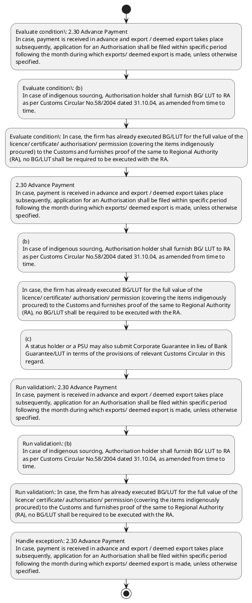

# Chapter 2 / Section 2.30: Advance Payment

**Chapter Title:** General Provisions Regarding Imports and Exports

**Pages:** 11

**Purpose:** 2.30 Advance Payment
In case, payment is received in advance and export / deemed export takes place
subsequently, application for an Authorisation shall be filed within specific period
following the month during which exports/ deemed export is made, unless otherwise
specified.

**Purpose Thanglish:** Indha Advance Payment section-la, 2.30 Advance Payment
In case, payment is received in advance and export / deemed export takes place
subsequently, application for an Authorisation kandippa be filed within specific period
following the month during which exports/ deemed export is made, unless otherwise
specified.

**Summary:** 2.30 Advance Payment
In case, payment is received in advance and export / deemed export takes place
subsequently, application for an Authorisation shall be filed within specific period
following the month during which exports/ deemed export is made, unless otherwise
specified. pg. 20
following condition on the licence/ Authorisation: "BG / LUT as applicable, to be
executed with concerned Customs Authorities”.

**Business Meaning:** Advance Payment governs how DGFT business controls should be applied, validated, and enforced.

**Business Explanation:** Advance Payment explains the operating rule set that DEKAI should enforce. Key control points include 2.30 Advance Payment
In case, payment is received in advance and export / deemed export takes place
subsequently, application for an Authorisation shall be filed within specific period
following the month during which exports/ deemed export is made, unless otherwise
specified. The section also drives actions such as 2.30 Advance Payment
In case, payment is received in advance and export / deemed export takes place
subsequently, application for an Authorisation shall be filed within specific period
following the month during which exports/ deemed export is made, unless otherwise
specified..

**Business Explanation Thanglish:** Indha Advance Payment section-la, Advance Payment explains the operating rule set that DEKAI should enforce. Key control points include 2.30 Advance Payment
In case, payment is received in advance and export / deemed export takes place
subsequently, application for an Authorisation kandippa be filed within specific period
following the month during which exports/ deemed export is made, unless otherwise
specified. The section also drives actions such as 2.30 Advance Payment
In case, payment is received in advance and export / deemed export takes place
subsequently, application for an Authorisation kandippa be filed within specific period
following the month during which exports/ deemed export is made, unless otherwise
specified..

## Business Logic
- 2.30 Advance Payment
In case, payment is received in advance and export / deemed export takes place
subsequently, application for an Authorisation shall be filed within specific period
following the month during which exports/ deemed export is made, unless otherwise
specified.
- (b)
In case of indigenous sourcing, Authorisation holder shall furnish BG/ LUT to RA
as per Customs Circular No.58/2004 dated 31.10.04, as amended from time to
time.
- In case, the firm has already executed BG/LUT for the full value of the
licence/ certificate/ authorisation/ permission (covering the items indigenously
procured) to the Customs and furnishes proof of the same to Regional Authority
(RA), no BG/LUT shall be required to be executed with the RA.
- The RA concerned
shall endorse on the authorisation that the Customs Authority shall
release/redeem BG/LUT only after receipt of NOC or EODC from the RA
concerned.
- RA shall endorse a copy of the same along with a forwarding letter to
the Customs Authority at the Port of registration for their information and
record.

## Business Rules
- rule_id=CH2-SEC2_30-R001, rule_description=2.30 Advance Payment
In case, payment is received in advance and export / deemed export takes place
subsequently, application for an Authorisation shall be filed within specific period
following the month during which exports/ deemed export is made, unless otherwise
specified., trigger=Advance Payment, condition=2.30 Advance Payment
In case, payment is received in advance and export / deemed export takes place
subsequently, application for an Authorisation shall be filed within specific period
following the month during which exports/ deemed export is made, unless otherwise
specified., validation=2.30 Advance Payment
In case, payment is received in advance and export / deemed export takes place
subsequently, application for an Authorisation shall be filed within specific period
following the month during which exports/ deemed export is made, unless otherwise
specified., action=2.30 Advance Payment
In case, payment is received in advance and export / deemed export takes place
subsequently, application for an Authorisation shall be filed within specific period
following the month during which exports/ deemed export is made, unless otherwise
specified., exception=2.30 Advance Payment
In case, payment is received in advance and export / deemed export takes place
subsequently, application for an Authorisation shall be filed within specific period
following the month during which exports/ deemed export is made, unless otherwise
specified., output=DEKAI should produce a compliance decision for 2.30 - Advance Payment.
- rule_id=CH2-SEC2_30-R002, rule_description=(b)
In case of indigenous sourcing, Authorisation holder shall furnish BG/ LUT to RA
as per Customs Circular No.58/2004 dated 31.10.04, as amended from time to
time., trigger=Advance Payment, condition=(b)
In case of indigenous sourcing, Authorisation holder shall furnish BG/ LUT to RA
as per Customs Circular No.58/2004 dated 31.10.04, as amended from time to
time., validation=(b)
In case of indigenous sourcing, Authorisation holder shall furnish BG/ LUT to RA
as per Customs Circular No.58/2004 dated 31.10.04, as amended from time to
time., action=(b)
In case of indigenous sourcing, Authorisation holder shall furnish BG/ LUT to RA
as per Customs Circular No.58/2004 dated 31.10.04, as amended from time to
time., exception=2.30 Advance Payment
In case, payment is received in advance and export / deemed export takes place
subsequently, application for an Authorisation shall be filed within specific period
following the month during which exports/ deemed export is made, unless otherwise
specified., output=DEKAI should produce a compliance decision for 2.30 - Advance Payment.
- rule_id=CH2-SEC2_30-R003, rule_description=In case, the firm has already executed BG/LUT for the full value of the
licence/ certificate/ authorisation/ permission (covering the items indigenously
procured) to the Customs and furnishes proof of the same to Regional Authority
(RA), no BG/LUT shall be required to be executed with the RA., trigger=Advance Payment, condition=In case, the firm has already executed BG/LUT for the full value of the
licence/ certificate/ authorisation/ permission (covering the items indigenously
procured) to the Customs and furnishes proof of the same to Regional Authority
(RA), no BG/LUT shall be required to be executed with the RA., validation=In case, the firm has already executed BG/LUT for the full value of the
licence/ certificate/ authorisation/ permission (covering the items indigenously
procured) to the Customs and furnishes proof of the same to Regional Authority
(RA), no BG/LUT shall be required to be executed with the RA., action=In case, the firm has already executed BG/LUT for the full value of the
licence/ certificate/ authorisation/ permission (covering the items indigenously
procured) to the Customs and furnishes proof of the same to Regional Authority
(RA), no BG/LUT shall be required to be executed with the RA., exception=2.30 Advance Payment
In case, payment is received in advance and export / deemed export takes place
subsequently, application for an Authorisation shall be filed within specific period
following the month during which exports/ deemed export is made, unless otherwise
specified., output=DEKAI should produce a compliance decision for 2.30 - Advance Payment.
- rule_id=CH2-SEC2_30-R004, rule_description=The RA concerned
shall endorse on the authorisation that the Customs Authority shall
release/redeem BG/LUT only after receipt of NOC or EODC from the RA
concerned., trigger=Advance Payment, condition=The RA concerned
shall endorse on the authorisation that the Customs Authority shall
release/redeem BG/LUT only after receipt of NOC or EODC from the RA
concerned., validation=The RA concerned
shall endorse on the authorisation that the Customs Authority shall
release/redeem BG/LUT only after receipt of NOC or EODC from the RA
concerned., action=(c)
A status holder or a PSU may also submit Corporate Guarantee in lieu of Bank
Guarantee/LUT in terms of the provisions of relevant Customs Circular in this
regard., exception=2.30 Advance Payment
In case, payment is received in advance and export / deemed export takes place
subsequently, application for an Authorisation shall be filed within specific period
following the month during which exports/ deemed export is made, unless otherwise
specified., output=DEKAI should produce a compliance decision for 2.30 - Advance Payment.
- rule_id=CH2-SEC2_30-R005, rule_description=RA shall endorse a copy of the same along with a forwarding letter to
the Customs Authority at the Port of registration for their information and
record., trigger=Advance Payment, condition=The RA concerned
shall endorse on the authorisation that the Customs Authority shall
release/redeem BG/LUT only after receipt of NOC or EODC from the RA
concerned., validation=RA shall endorse a copy of the same along with a forwarding letter to
the Customs Authority at the Port of registration for their information and
record., action=(c)
A status holder or a PSU may also submit Corporate Guarantee in lieu of Bank
Guarantee/LUT in terms of the provisions of relevant Customs Circular in this
regard., exception=2.30 Advance Payment
In case, payment is received in advance and export / deemed export takes place
subsequently, application for an Authorisation shall be filed within specific period
following the month during which exports/ deemed export is made, unless otherwise
specified., output=DEKAI should produce a compliance decision for 2.30 - Advance Payment.

## Conditions
- 2.30 Advance Payment
In case, payment is received in advance and export / deemed export takes place
subsequently, application for an Authorisation shall be filed within specific period
following the month during which exports/ deemed export is made, unless otherwise
specified.
- (b)
In case of indigenous sourcing, Authorisation holder shall furnish BG/ LUT to RA
as per Customs Circular No.58/2004 dated 31.10.04, as amended from time to
time.
- In case, the firm has already executed BG/LUT for the full value of the
licence/ certificate/ authorisation/ permission (covering the items indigenously
procured) to the Customs and furnishes proof of the same to Regional Authority
(RA), no BG/LUT shall be required to be executed with the RA.
- The RA concerned
shall endorse on the authorisation that the Customs Authority shall
release/redeem BG/LUT only after receipt of NOC or EODC from the RA
concerned.

## Condition Logic
- id=2.2.30.1, if=2.30 Advance Payment
In case, payment is received in advance and export / deemed export takes place
subsequently, application for an Authorisation shall be filed within specific period
following the month during which exports/ deemed export is made, unless otherwise
specified., then=2.30 Advance Payment
In case, payment is received in advance and export / deemed export takes place
subsequently, application for an Authorisation shall be filed within specific period
following the month during which exports/ deemed export is made, unless otherwise
specified., source=2.30 Advance Payment
In case, payment is received in advance and export / deemed export takes place
subsequently, application for an Authorisation shall be filed within specific period
following the month during which exports/ deemed export is made, unless otherwise
specified.
- id=2.2.30.2, if=(b)
In case of indigenous sourcing, Authorisation holder shall furnish BG/ LUT to RA
as per Customs Circular No.58/2004 dated 31.10.04, as amended from time to
time., then=2.30 Advance Payment
In case, payment is received in advance and export / deemed export takes place
subsequently, application for an Authorisation shall be filed within specific period
following the month during which exports/ deemed export is made, unless otherwise
specified., source=(b)
In case of indigenous sourcing, Authorisation holder shall furnish BG/ LUT to RA
as per Customs Circular No.58/2004 dated 31.10.04, as amended from time to
time.
- id=2.2.30.3, if=In case, the firm has already executed BG/LUT for the full value of the
licence/ certificate/ authorisation/ permission (covering the items indigenously
procured) to the Customs and furnishes proof of the same to Regional Authority
(RA), no BG/LUT shall be required to be executed with the RA., then=2.30 Advance Payment
In case, payment is received in advance and export / deemed export takes place
subsequently, application for an Authorisation shall be filed within specific period
following the month during which exports/ deemed export is made, unless otherwise
specified., source=In case, the firm has already executed BG/LUT for the full value of the
licence/ certificate/ authorisation/ permission (covering the items indigenously
procured) to the Customs and furnishes proof of the same to Regional Authority
(RA), no BG/LUT shall be required to be executed with the RA.
- id=2.2.30.4, if=The RA concerned
shall endorse on the authorisation that the Customs Authority shall
release/redeem BG/LUT only after receipt of NOC or EODC from the RA
concerned., then=2.30 Advance Payment
In case, payment is received in advance and export / deemed export takes place
subsequently, application for an Authorisation shall be filed within specific period
following the month during which exports/ deemed export is made, unless otherwise
specified., source=The RA concerned
shall endorse on the authorisation that the Customs Authority shall
release/redeem BG/LUT only after receipt of NOC or EODC from the RA
concerned.

## Validations
- 2.30 Advance Payment
In case, payment is received in advance and export / deemed export takes place
subsequently, application for an Authorisation shall be filed within specific period
following the month during which exports/ deemed export is made, unless otherwise
specified.
- (b)
In case of indigenous sourcing, Authorisation holder shall furnish BG/ LUT to RA
as per Customs Circular No.58/2004 dated 31.10.04, as amended from time to
time.
- In case, the firm has already executed BG/LUT for the full value of the
licence/ certificate/ authorisation/ permission (covering the items indigenously
procured) to the Customs and furnishes proof of the same to Regional Authority
(RA), no BG/LUT shall be required to be executed with the RA.
- The RA concerned
shall endorse on the authorisation that the Customs Authority shall
release/redeem BG/LUT only after receipt of NOC or EODC from the RA
concerned.
- RA shall endorse a copy of the same along with a forwarding letter to
the Customs Authority at the Port of registration for their information and
record.

## Exceptions
- 2.30 Advance Payment
In case, payment is received in advance and export / deemed export takes place
subsequently, application for an Authorisation shall be filed within specific period
following the month during which exports/ deemed export is made, unless otherwise
specified.

## Dependencies
- 1

## Authorities
- Customs
- Customs Authorities
- RA
- Authorisation holder shall furnish BG/ LUT to RA
- Regional Authority
- Customs and furnishes proof of the same to Regional Authority
- BG/LUT shall be required to be executed with the RA
- Customs Authority
- The RA
- BG/LUT only after receipt of NOC or EODC from the RA
- Guarantee/LUT in terms of the provisions of relevant Customs

## Required Documents
- 2.30 Advance Payment
In case, payment is received in advance and export / deemed export takes place
subsequently, application for an Authorisation shall be filed within specific period
following the month during which exports/ deemed export is made, unless otherwise
specified.
- 20
following condition on the licence/ Authorisation: "BG / LUT as applicable, to be
executed with concerned Customs Authorities”.
- In case, the firm has already executed BG/LUT for the full value of the
licence/ certificate/ authorisation/ permission (covering the items indigenously
procured) to the Customs and furnishes proof of the same to Regional Authority
(RA), no BG/LUT shall be required to be executed with the RA.
- RA shall endorse a copy of the same along with a forwarding letter to
the Customs Authority at the Port of registration for their information and
record.

## Timelines
- 2.30 Advance Payment
In case, payment is received in advance and export / deemed export takes place
subsequently, application for an Authorisation shall be filed within specific period
following the month during which exports/ deemed export is made, unless otherwise
specified.
- The RA concerned
shall endorse on the authorisation that the Customs Authority shall
release/redeem BG/LUT only after receipt of NOC or EODC from the RA
concerned.

## Actions
- 2.30 Advance Payment
In case, payment is received in advance and export / deemed export takes place
subsequently, application for an Authorisation shall be filed within specific period
following the month during which exports/ deemed export is made, unless otherwise
specified.
- (b)
In case of indigenous sourcing, Authorisation holder shall furnish BG/ LUT to RA
as per Customs Circular No.58/2004 dated 31.10.04, as amended from time to
time.
- In case, the firm has already executed BG/LUT for the full value of the
licence/ certificate/ authorisation/ permission (covering the items indigenously
procured) to the Customs and furnishes proof of the same to Regional Authority
(RA), no BG/LUT shall be required to be executed with the RA.
- (c)
A status holder or a PSU may also submit Corporate Guarantee in lieu of Bank
Guarantee/LUT in terms of the provisions of relevant Customs Circular in this
regard.

## Workflow
- Evaluate condition: 2.30 Advance Payment
In case, payment is received in advance and export / deemed export takes place
subsequently, application for an Authorisation shall be filed within specific period
following the month during which exports/ deemed export is made, unless otherwise
specified.
- Evaluate condition: (b)
In case of indigenous sourcing, Authorisation holder shall furnish BG/ LUT to RA
as per Customs Circular No.58/2004 dated 31.10.04, as amended from time to
time.
- Evaluate condition: In case, the firm has already executed BG/LUT for the full value of the
licence/ certificate/ authorisation/ permission (covering the items indigenously
procured) to the Customs and furnishes proof of the same to Regional Authority
(RA), no BG/LUT shall be required to be executed with the RA.
- 2.30 Advance Payment
In case, payment is received in advance and export / deemed export takes place
subsequently, application for an Authorisation shall be filed within specific period
following the month during which exports/ deemed export is made, unless otherwise
specified.
- (b)
In case of indigenous sourcing, Authorisation holder shall furnish BG/ LUT to RA
as per Customs Circular No.58/2004 dated 31.10.04, as amended from time to
time.
- In case, the firm has already executed BG/LUT for the full value of the
licence/ certificate/ authorisation/ permission (covering the items indigenously
procured) to the Customs and furnishes proof of the same to Regional Authority
(RA), no BG/LUT shall be required to be executed with the RA.
- (c)
A status holder or a PSU may also submit Corporate Guarantee in lieu of Bank
Guarantee/LUT in terms of the provisions of relevant Customs Circular in this
regard.
- Run validation: 2.30 Advance Payment
In case, payment is received in advance and export / deemed export takes place
subsequently, application for an Authorisation shall be filed within specific period
following the month during which exports/ deemed export is made, unless otherwise
specified.
- Run validation: (b)
In case of indigenous sourcing, Authorisation holder shall furnish BG/ LUT to RA
as per Customs Circular No.58/2004 dated 31.10.04, as amended from time to
time.
- Run validation: In case, the firm has already executed BG/LUT for the full value of the
licence/ certificate/ authorisation/ permission (covering the items indigenously
procured) to the Customs and furnishes proof of the same to Regional Authority
(RA), no BG/LUT shall be required to be executed with the RA.
- Handle exception: 2.30 Advance Payment
In case, payment is received in advance and export / deemed export takes place
subsequently, application for an Authorisation shall be filed within specific period
following the month during which exports/ deemed export is made, unless otherwise
specified.

## Workflow ASCII
```text
Advance Payment
Evaluate condition: 2.30 Advance Payment
In case, payment is received in advance and export / deemed export takes place
subsequently, application for an Authorisation shall be filed within specific period
following the month during which exports/ deemed export is made, unless otherwise
specified.
   |
   v
Evaluate condition: (b)
In case of indigenous sourcing, Authorisation holder shall furnish BG/ LUT to RA
as per Customs Circular No.58/2004 dated 31.10.04, as amended from time to
time.
   |
   v
Evaluate condition: In case, the firm has already executed BG/LUT for the full value of the
licence/ certificate/ authorisation/ permission (covering the items indigenously
procured) to the Customs and furnishes proof of the same to Regional Authority
(RA), no BG/LUT shall be required to be executed with the RA.
   |
   v
2.30 Advance Payment
In case, payment is received in advance and export / deemed export takes place
subsequently, application for an Authorisation shall be filed within specific period
following the month during which exports/ deemed export is made, unless otherwise
specified.
   |
   v
(b)
In case of indigenous sourcing, Authorisation holder shall furnish BG/ LUT to RA
as per Customs Circular No.58/2004 dated 31.10.04, as amended from time to
time.
   |
   v
In case, the firm has already executed BG/LUT for the full value of the
licence/ certificate/ authorisation/ permission (covering the items indigenously
procured) to the Customs and furnishes proof of the same to Regional Authority
(RA), no BG/LUT shall be required to be executed with the RA.
   |
   v
(c)
A status holder or a PSU may also submit Corporate Guarantee in lieu of Bank
Guarantee/LUT in terms of the provisions of relevant Customs Circular in this
regard.
   |
   v
Run validation: 2.30 Advance Payment
In case, payment is received in advance and export / deemed export takes place
subsequently, application for an Authorisation shall be filed within specific period
following the month during which exports/ deemed export is made, unless otherwise
specified.
   |
   v
Run validation: (b)
In case of indigenous sourcing, Authorisation holder shall furnish BG/ LUT to RA
as per Customs Circular No.58/2004 dated 31.10.04, as amended from time to
time.
   |
   v
Run validation: In case, the firm has already executed BG/LUT for the full value of the
licence/ certificate/ authorisation/ permission (covering the items indigenously
procured) to the Customs and furnishes proof of the same to Regional Authority
(RA), no BG/LUT shall be required to be executed with the RA.
   |
   v
Handle exception: 2.30 Advance Payment
In case, payment is received in advance and export / deemed export takes place
subsequently, application for an Authorisation shall be filed within specific period
following the month during which exports/ deemed export is made, unless otherwise
specified.
```

## Decision Tree
- IF 2.30 Advance Payment
In case, payment is received in advance and export / deemed export takes place
subsequently, application for an Authorisation shall be filed within specific period
following the month during which exports/ deemed export is made, unless otherwise
specified. THEN 2.30 Advance Payment
In case, payment is received in advance and export / deemed export takes place
subsequently, application for an Authorisation shall be filed within specific period
following the month during which exports/ deemed export is made, unless otherwise
specified.
- IF (b)
In case of indigenous sourcing, Authorisation holder shall furnish BG/ LUT to RA
as per Customs Circular No.58/2004 dated 31.10.04, as amended from time to
time. THEN 2.30 Advance Payment
In case, payment is received in advance and export / deemed export takes place
subsequently, application for an Authorisation shall be filed within specific period
following the month during which exports/ deemed export is made, unless otherwise
specified.
- IF In case, the firm has already executed BG/LUT for the full value of the
licence/ certificate/ authorisation/ permission (covering the items indigenously
procured) to the Customs and furnishes proof of the same to Regional Authority
(RA), no BG/LUT shall be required to be executed with the RA. THEN 2.30 Advance Payment
In case, payment is received in advance and export / deemed export takes place
subsequently, application for an Authorisation shall be filed within specific period
following the month during which exports/ deemed export is made, unless otherwise
specified.
- IF The RA concerned
shall endorse on the authorisation that the Customs Authority shall
release/redeem BG/LUT only after receipt of NOC or EODC from the RA
concerned. THEN 2.30 Advance Payment
In case, payment is received in advance and export / deemed export takes place
subsequently, application for an Authorisation shall be filed within specific period
following the month during which exports/ deemed export is made, unless otherwise
specified.
- IF exception applies (2.30 Advance Payment
In case, payment is received in advance and export / deemed export takes place
subsequently, application for an Authorisation shall be filed within specific period
following the month during which exports/ deemed export is made, unless otherwise
specified.) THEN route to manual review

## Decision Tree ASCII
```text
Advance Payment Decision
IF 2.30 Advance Payment
In case, payment is received in advance and export / deemed export takes place
subsequently, application for an Authorisation shall be filed within specific period
following the month during which exports/ deemed export is made, unless otherwise
specified. THEN 2.30 Advance Payment
In case, payment is received in advance and export / deemed export takes place
subsequently, application for an Authorisation shall be filed within specific period
following the month during which exports/ deemed export is made, unless otherwise
specified.
   |
   v
IF (b)
In case of indigenous sourcing, Authorisation holder shall furnish BG/ LUT to RA
as per Customs Circular No.58/2004 dated 31.10.04, as amended from time to
time. THEN 2.30 Advance Payment
In case, payment is received in advance and export / deemed export takes place
subsequently, application for an Authorisation shall be filed within specific period
following the month during which exports/ deemed export is made, unless otherwise
specified.
   |
   v
IF In case, the firm has already executed BG/LUT for the full value of the
licence/ certificate/ authorisation/ permission (covering the items indigenously
procured) to the Customs and furnishes proof of the same to Regional Authority
(RA), no BG/LUT shall be required to be executed with the RA. THEN 2.30 Advance Payment
In case, payment is received in advance and export / deemed export takes place
subsequently, application for an Authorisation shall be filed within specific period
following the month during which exports/ deemed export is made, unless otherwise
specified.
   |
   v
IF The RA concerned
shall endorse on the authorisation that the Customs Authority shall
release/redeem BG/LUT only after receipt of NOC or EODC from the RA
concerned. THEN 2.30 Advance Payment
In case, payment is received in advance and export / deemed export takes place
subsequently, application for an Authorisation shall be filed within specific period
following the month during which exports/ deemed export is made, unless otherwise
specified.
   |
   v
IF exception applies (2.30 Advance Payment
In case, payment is received in advance and export / deemed export takes place
subsequently, application for an Authorisation shall be filed within specific period
following the month during which exports/ deemed export is made, unless otherwise
specified.) THEN route to manual review
```

## Examples
- User asks to process Advance Payment; the platform checks conditions, validations, and documents before action.

**Real-world Example:** Example: an importer or exporter invokes Advance Payment, submits 2.30 Advance Payment
In case, payment is received in advance and export / deemed export takes place
subsequently, application for an Authorisation shall be filed within specific period
following the month during which exports/ deemed export is made, unless otherwise
specified., 20
following condition on the licence/ Authorisation: "BG / LUT as applicable, to be
executed with concerned Customs Authorities”., In case, the firm has already executed BG/LUT for the full value of the
licence/ certificate/ authorisation/ permission (covering the items indigenously
procured) to the Customs and furnishes proof of the same to Regional Authority
(RA), no BG/LUT shall be required to be executed with the RA., and DEKAI uses the extracted rules to 2.30 advance payment
in case, payment is received in advance and export / deemed export takes place
subsequently, application for an authorisation shall be filed within specific period
following the month during which exports/ deemed export is made, unless otherwise
specified..

**Real-world Example Thanglish:** Indha Advance Payment section-la, Example: an importer or exporter invokes Advance Payment, submits 2.30 Advance Payment
In case, payment is received in advance and export / deemed export takes place
subsequently, application for an Authorisation kandippa be filed within specific period
following the month during which exports/ deemed export is made, unless otherwise
specified., 20
following condition on the licence/ Authorisation: "BG / LUT as applicable, to be
executed with concerned Customs Authorities”., In case, the firm has already executed BG/LUT for the full value of the
licence/ certificate/ authorisation/ permission (covering the items indigenously
procured) to the Customs and furnishes proof of the same to Regional authority
(RA), no BG/LUT kandippa be required to be executed with the RA., and DEKAI uses the extracted rules to 2.30 advance payment
in case, payment is received in advance and export / deemed export takes place
subsequently, application for an authorisation kandippa be filed within specific period
following the month during which exports/ deemed export is made, unless otherwise
specified..

## AI Rules
- IF detected context matches section rule THEN enforce: 2.30 Advance Payment
In case, payment is received in advance and export / deemed export takes place
subsequently, application for an Authorisation shall be filed within specific period
following the month during which exports/ deemed export is made, unless otherwise
specified.
- IF detected context matches section rule THEN enforce: (b)
In case of indigenous sourcing, Authorisation holder shall furnish BG/ LUT to RA
as per Customs Circular No.58/2004 dated 31.10.04, as amended from time to
time.
- IF detected context matches section rule THEN enforce: In case, the firm has already executed BG/LUT for the full value of the
licence/ certificate/ authorisation/ permission (covering the items indigenously
procured) to the Customs and furnishes proof of the same to Regional Authority
(RA), no BG/LUT shall be required to be executed with the RA.
- IF detected context matches section rule THEN enforce: The RA concerned
shall endorse on the authorisation that the Customs Authority shall
release/redeem BG/LUT only after receipt of NOC or EODC from the RA
concerned.
- IF detected context matches section rule THEN enforce: RA shall endorse a copy of the same along with a forwarding letter to
the Customs Authority at the Port of registration for their information and
record.
- IF validations pass THEN recommend action: 2.30 Advance Payment
In case, payment is received in advance and export / deemed export takes place
subsequently, application for an Authorisation shall be filed within specific period
following the month during which exports/ deemed export is made, unless otherwise
specified.

## Database Fields
- name=section_code, type=string, required=True, source=parsed_section_heading
- name=section_title, type=string, required=True, source=parsed_section_heading
- name=and_flag, type=boolean, required=False, source=keyword:and
- name=for_flag, type=boolean, required=False, source=keyword:for
- name=the_flag, type=boolean, required=False, source=keyword:the
- name=lut_flag, type=boolean, required=False, source=keyword:LUT
- name=per_flag, type=boolean, required=False, source=keyword:per
- name=has_flag, type=boolean, required=False, source=keyword:has
- name=noc_flag, type=boolean, required=False, source=keyword:NOC
- name=psu_flag, type=boolean, required=False, source=keyword:PSU
- name=document_1_submitted, type=boolean, required=True, source=2.30 Advance Payment
In case, payment is received in advance and export / deemed export takes place
subsequently, application for an Authorisation shall be filed within specific period
following the month during which exports/ deemed export is made, unless otherwise
specified.
- name=document_2_submitted, type=boolean, required=True, source=20
following condition on the licence/ Authorisation: "BG / LUT as applicable, to be
executed with concerned Customs Authorities”.
- name=document_3_submitted, type=boolean, required=True, source=In case, the firm has already executed BG/LUT for the full value of the
licence/ certificate/ authorisation/ permission (covering the items indigenously
procured) to the Customs and furnishes proof of the same to Regional Authority
(RA), no BG/LUT shall be required to be executed with the RA.
- name=document_4_submitted, type=boolean, required=True, source=RA shall endorse a copy of the same along with a forwarding letter to
the Customs Authority at the Port of registration for their information and
record.

## API Requirements
- method=GET, path=/api/dgft/sections/2.30, purpose=Retrieve knowledge payload for section 2.30, query_params=['include=workflow,decision_tree,validations'], response_fields=['section', 'title', 'summary', 'conditions', 'validations', 'exceptions', 'workflow', 'decision_tree']
- method=POST, path=/api/dgft/Advance-Payment/validate, purpose=Validate inputs and documents for Advance Payment, request_fields=['section_code', 'section_title', 'document_1_submitted', 'document_2_submitted', 'document_3_submitted', 'document_4_submitted'], response_fields=['status', 'errors', 'warnings', 'next_actions']
- method=POST, path=/api/dgft/Advance-Payment/execute, purpose=Trigger business action for 2.30 Advance Payment
In case, payment is received in advance and export / deemed export takes place
subsequently, application for an Authorisation shall be filed within specific period
following the month during which exports/ deemed export is made, unless otherwise
specified., request_fields=['section_code', 'section_title', 'document_1_submitted', 'document_2_submitted', 'document_3_submitted', 'document_4_submitted'], response_fields=['reference_id', 'status', 'authority', 'timeline']

## UI Screens
- screen_id=Advance_Payment_overview, name=Advance Payment Overview, purpose=Show section summary, authority, timeline, and eligibility cues., widgets=['summary_card', 'conditions_table', 'authority_badges', 'timeline_panel']
- screen_id=Advance_Payment_submission, name=Advance Payment Submission, purpose=Capture applicant data and supporting documents., widgets=['dynamic_form', 'document_uploader', 'validation_panel', 'next_action_footer'], fields=['section_code', 'section_title', 'and_flag', 'for_flag', 'the_flag', 'lut_flag', 'per_flag', 'has_flag']
- screen_id=Advance_Payment_exceptions, name=Advance Payment Exception Review, purpose=Explain exception handling and manual review triggers., widgets=['exception_banner', 'decision_tree', 'case_notes']

## Error Messages
- Validation failed because the section requirements were not fully met.

## FAQ
- question_en=What is the purpose of section 2.30?, answer_en=Advance Payment explains the operating rule set that DEKAI should enforce. Key control points include 2.30 Advance Payment
In case, payment is received in advance and export / deemed export takes place
subsequently, application for an Authorisation shall be filed within specific period
following the month during which exports/ deemed export is made, unless otherwise
specified. The section also drives actions such as 2.30 Advance Payment
In case, payment is received in advance and export / deemed export takes place
subsequently, application for an Authorisation shall be filed within specific period
following the month during which exports/ deemed export is made, unless otherwise
specified.., question_thanglish=Indha Advance Payment section-la, What is the purpose of section 2.30?, answer_thanglish=Indha Advance Payment section-la, Advance Payment explains the operating rule set that DEKAI should enforce. Key control points include 2.30 Advance Payment
In case, payment is received in advance and export / deemed export takes place
subsequently, application for an Authorisation kandippa be filed within specific period
following the month during which exports/ deemed export is made, unless otherwise
specified. The section also drives actions such as 2.30 Advance Payment
In case, payment is received in advance and export / deemed export takes place
subsequently, application for an Authorisation kandippa be filed within specific period
following the month during which exports/ deemed export is made, unless otherwise
specified..
- question_en=What documents are required under Advance Payment?, answer_en=2.30 Advance Payment
In case, payment is received in advance and export / deemed export takes place
subsequently, application for an Authorisation shall be filed within specific period
following the month during which exports/ deemed export is made, unless otherwise
specified., 20
following condition on the licence/ Authorisation: "BG / LUT as applicable, to be
executed with concerned Customs Authorities”., In case, the firm has already executed BG/LUT for the full value of the
licence/ certificate/ authorisation/ permission (covering the items indigenously
procured) to the Customs and furnishes proof of the same to Regional Authority
(RA), no BG/LUT shall be required to be executed with the RA., RA shall endorse a copy of the same along with a forwarding letter to
the Customs Authority at the Port of registration for their information and
record., question_thanglish=Indha Advance Payment section-la, What documents are required under Advance Payment?, answer_thanglish=Indha Advance Payment section-la, 2.30 Advance Payment
In case, payment is received in advance and export / deemed export takes place
subsequently, application for an Authorisation kandippa be filed within specific period
following the month during which exports/ deemed export is made, unless otherwise
specified., 20
following condition on the licence/ Authorisation: "BG / LUT as applicable, to be
executed with concerned Customs Authorities”., In case, the firm has already executed BG/LUT for the full value of the
licence/ certificate/ authorisation/ permission (covering the items indigenously
procured) to the Customs and furnishes proof of the same to Regional authority
(RA), no BG/LUT kandippa be required to be executed with the RA., RA kandippa endorse a copy of the same along with a forwarding letter to
the Customs authority at the Port of registration for their information and
record.
- question_en=Which authority handles Advance Payment?, answer_en=Customs, Customs Authorities, RA, Authorisation holder shall furnish BG/ LUT to RA, Regional Authority, Customs and furnishes proof of the same to Regional Authority, BG/LUT shall be required to be executed with the RA, Customs Authority, The RA, BG/LUT only after receipt of NOC or EODC from the RA, Guarantee/LUT in terms of the provisions of relevant Customs, question_thanglish=Indha Advance Payment section-la, Which authority handles Advance Payment?, answer_thanglish=Indha Advance Payment section-la, Customs, Customs Authorities, RA, Authorisation holder kandippa furnish BG/ LUT to RA, Regional authority, Customs and furnishes proof of the same to Regional authority, BG/LUT kandippa be required to be executed with the RA, Customs authority, The RA, BG/LUT only after receipt of NOC or EODC from the RA, Guarantee/LUT in terms of the provisions of relevant Customs

## Questions Users May Ask
- What does Advance Payment require?
- Which documents are needed for Advance Payment?
- How does DEKAI validate Advance Payment requests?
- What action should be taken for Advance Payment?

## Expected AI Answers
- Advance Payment requires the platform to interpret the section text, apply the extracted business rules, and present the correct next action.
- Required documents are inferred from the section text: 2.30 Advance Payment
In case, payment is received in advance and export / deemed export takes place
subsequently, application for an Authorisation shall be filed within specific period
following the month during which exports/ deemed export is made, unless otherwise
specified., 20
following condition on the licence/ Authorisation: "BG / LUT as applicable, to be
executed with concerned Customs Authorities”., In case, the firm has already executed BG/LUT for the full value of the
licence/ certificate/ authorisation/ permission (covering the items indigenously
procured) to the Customs and furnishes proof of the same to Regional Authority
(RA), no BG/LUT shall be required to be executed with the RA., RA shall endorse a copy of the same along with a forwarding letter to
the Customs Authority at the Port of registration for their information and
record.
- DEKAI validates Advance Payment by checking conditions, required documents, authority references, and exception clauses before recommending an outcome.
- The primary extracted action is: 2.30 Advance Payment
In case, payment is received in advance and export / deemed export takes place
subsequently, application for an Authorisation shall be filed within specific period
following the month during which exports/ deemed export is made, unless otherwise
specified.

## AI Q&A Examples
- question_en=User asks: How do I comply with Advance Payment?, answer_en=AI answers: DEKAI should evaluate section 2.30, apply the extracted rules, and guide the user through Evaluate condition: 2.30 Advance Payment
In case, payment is received in advance and export / deemed export takes place
subsequently, application for an Authorisation shall be filed within specific period
following the month during which exports/ deemed export is made, unless otherwise
specified.., question_thanglish=Indha Advance Payment section-la, User asks: How do I comply with Advance Payment?, answer_thanglish=Indha Advance Payment section-la, AI answers: DEKAI should evaluate section 2.30, apply the extracted rules, and guide the user through Evaluate condition: 2.30 Advance Payment
In case, payment is received in advance and export / deemed export takes place
subsequently, application for an Authorisation kandippa be filed within specific period
following the month during which exports/ deemed export is made, unless otherwise
specified..
- question_en=User asks: Which validations apply to Advance Payment?, answer_en=AI answers: Applicable validations are 2.30 Advance Payment
In case, payment is received in advance and export / deemed export takes place
subsequently, application for an Authorisation shall be filed within specific period
following the month during which exports/ deemed export is made, unless otherwise
specified., (b)
In case of indigenous sourcing, Authorisation holder shall furnish BG/ LUT to RA
as per Customs Circular No.58/2004 dated 31.10.04, as amended from time to
time., In case, the firm has already executed BG/LUT for the full value of the
licence/ certificate/ authorisation/ permission (covering the items indigenously
procured) to the Customs and furnishes proof of the same to Regional Authority
(RA), no BG/LUT shall be required to be executed with the RA., question_thanglish=Indha Advance Payment section-la, User asks: Which validations apply to Advance Payment?, answer_thanglish=Indha Advance Payment section-la, AI answers: Applicable validations are 2.30 Advance Payment
In case, payment is received in advance and export / deemed export takes place
subsequently, application for an Authorisation kandippa be filed within specific period
following the month during which exports/ deemed export is made, unless otherwise
specified., (b)
In case of indigenous sourcing, Authorisation holder kandippa furnish BG/ LUT to RA
as per Customs Circular No.58/2004 dated 31.10.04, as amended from time to
time., In case, the firm has already executed BG/LUT for the full value of the
licence/ certificate/ authorisation/ permission (covering the items indigenously
procured) to the Customs and furnishes proof of the same to Regional authority
(RA), no BG/LUT kandippa be required to be executed with the RA.

## DEKAI AI Implementation Notes
- Capture chapter 2, section 2.30, title, and page references as immutable knowledge metadata.
- Bind validations for Advance Payment into a rule engine keyed by the rule IDs extracted for this section.
- Expose document upload controls for: 2.30 Advance Payment
In case, payment is received in advance and export / deemed export takes place
subsequently, application for an Authorisation shall be filed within specific period
following the month during which exports/ deemed export is made, unless otherwise
specified., 20
following condition on the licence/ Authorisation: "BG / LUT as applicable, to be
executed with concerned Customs Authorities”., In case, the firm has already executed BG/LUT for the full value of the
licence/ certificate/ authorisation/ permission (covering the items indigenously
procured) to the Customs and furnishes proof of the same to Regional Authority
(RA), no BG/LUT shall be required to be executed with the RA., RA shall endorse a copy of the same along with a forwarding letter to
the Customs Authority at the Port of registration for their information and
record..
- Route escalations or approvals to: Customs, Customs Authorities, RA, Authorisation holder shall furnish BG/ LUT to RA.
- Trigger manual review when exception clauses are detected.
- Show contextual links to related sections: 1.

## DEKAI AI Implementation Notes Thanglish
- Indha Advance Payment section-la, Capture chapter 2, section 2.30, title, and page references as immutable knowledge metadata.
- Indha Advance Payment section-la, Bind validations for Advance Payment into a rule engine keyed by the rule IDs extracted for this section.
- Indha Advance Payment section-la, Expose document upload controls for: 2.30 Advance Payment
In case, payment is received in advance and export / deemed export takes place
subsequently, application for an Authorisation kandippa be filed within specific period
following the month during which exports/ deemed export is made, unless otherwise
specified., 20
following condition on the licence/ Authorisation: "BG / LUT as applicable, to be
executed with concerned Customs Authorities”., In case, the firm has already executed BG/LUT for the full value of the
licence/ certificate/ authorisation/ permission (covering the items indigenously
procured) to the Customs and furnishes proof of the same to Regional authority
(RA), no BG/LUT kandippa be required to be executed with the RA., RA kandippa endorse a copy of the same along with a forwarding letter to
the Customs authority at the Port of registration for their information and
record..
- Indha Advance Payment section-la, Route escalations or approvals to: Customs, Customs Authorities, RA, Authorisation holder kandippa furnish BG/ LUT to RA.
- Indha Advance Payment section-la, Trigger manual review when exception clauses are detected.
- Indha Advance Payment section-la, Show contextual links to related sections: 1.

## AI Metadata
- Keywords: and, for, the, LUT, per, has, NOC, PSU, may, case, made, with, from, time, firm, full, same, that, only, EODC
- Search Keywords: and, for, the, LUT, per, has, NOC, PSU, may, case, made, with, from, time, firm, full, same, that, only, EODC
- Intent: Support Advance Payment processing and compliance validation.
- Tags: 2.30, Advance Payment, business-rule, document-driven, dgft
- Related Sections: 1
- Related Chapters: 
- Related Rules: 2.30 Advance Payment
In case, payment is received in advance and export / deemed export takes place
subsequently, application for an Authorisation shall be filed within specific period
following the month during which exports/ deemed export is made, unless otherwise
specified., (b)
In case of indigenous sourcing, Authorisation holder shall furnish BG/ LUT to RA
as per Customs Circular No.58/2004 dated 31.10.04, as amended from time to
time., In case, the firm has already executed BG/LUT for the full value of the
licence/ certificate/ authorisation/ permission (covering the items indigenously
procured) to the Customs and furnishes proof of the same to Regional Authority
(RA), no BG/LUT shall be required to be executed with the RA., The RA concerned
shall endorse on the authorisation that the Customs Authority shall
release/redeem BG/LUT only after receipt of NOC or EODC from the RA
concerned., RA shall endorse a copy of the same along with a forwarding letter to
the Customs Authority at the Port of registration for their information and
record.

## Mermaid

```mermaid
flowchart TD
    S1["Evaluate condition: 2.30 Advance Payment
In case, payment is received in advance and export / deemed export takes place
subsequently, application for an Authorisation shall be filed within specific period
following the month during which exports/ deemed export is made, unless otherwise
specified."]
    S2["Evaluate condition: (b)
In case of indigenous sourcing, Authorisation holder shall furnish BG/ LUT to RA
as per Customs Circular No.58/2004 dated 31.10.04, as amended from time to
time."]
    S1 --> S2
    S3["Evaluate condition: In case, the firm has already executed BG/LUT for the full value of the
licence/ certificate/ authorisation/ permission (covering the items indigenously
procured) to the Customs and furnishes proof of the same to Regional Authority
(RA), no BG/LUT shall be required to be executed with the RA."]
    S2 --> S3
    S4["2.30 Advance Payment
In case, payment is received in advance and export / deemed export takes place
subsequently, application for an Authorisation shall be filed within specific period
following the month during which exports/ deemed export is made, unless otherwise
specified."]
    S3 --> S4
    S5["(b)
In case of indigenous sourcing, Authorisation holder shall furnish BG/ LUT to RA
as per Customs Circular No.58/2004 dated 31.10.04, as amended from time to
time."]
    S4 --> S5
    S6["In case, the firm has already executed BG/LUT for the full value of the
licence/ certificate/ authorisation/ permission (covering the items indigenously
procured) to the Customs and furnishes proof of the same to Regional Authority
(RA), no BG/LUT shall be required to be executed with the RA."]
    S5 --> S6
    S7["(c)
A status holder or a PSU may also submit Corporate Guarantee in lieu of Bank
Guarantee/LUT in terms of the provisions of relevant Customs Circular in this
regard."]
    S6 --> S7
    S8["Run validation: 2.30 Advance Payment
In case, payment is received in advance and export / deemed export takes place
subsequently, application for an Authorisation shall be filed within specific period
following the month during which exports/ deemed export is made, unless otherwise
specified."]
    S7 --> S8
    S9["Run validation: (b)
In case of indigenous sourcing, Authorisation holder shall furnish BG/ LUT to RA
as per Customs Circular No.58/2004 dated 31.10.04, as amended from time to
time."]
    S8 --> S9
    S10["Run validation: In case, the firm has already executed BG/LUT for the full value of the
licence/ certificate/ authorisation/ permission (covering the items indigenously
procured) to the Customs and furnishes proof of the same to Regional Authority
(RA), no BG/LUT shall be required to be executed with the RA."]
    S9 --> S10
    S11["Handle exception: 2.30 Advance Payment
In case, payment is received in advance and export / deemed export takes place
subsequently, application for an Authorisation shall be filed within specific period
following the month during which exports/ deemed export is made, unless otherwise
specified."]
    S10 --> S11
```


## PlantUML

