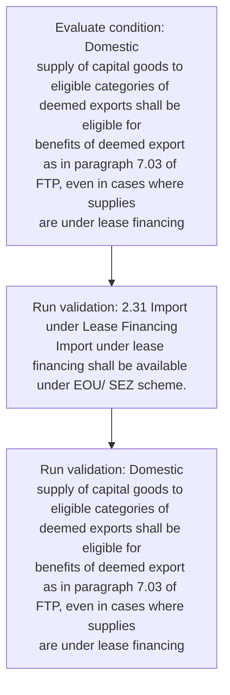
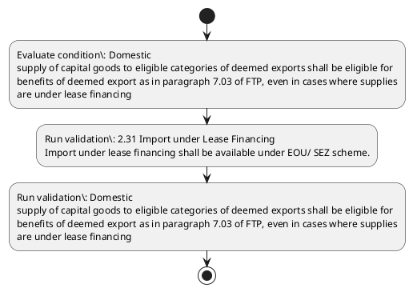

# Chapter 2 / Section 2.31: Import under Lease Financing

**Chapter Title:** General Provisions Regarding Imports and Exports

**Pages:** 12

**Purpose:** 2.31 Import under Lease Financing
Import under lease financing shall be available under EOU/ SEZ scheme.

**Purpose Thanglish:** Indha Import under Lease Financing section-la, 2.31 import under Lease Financing
import under lease financing kandippa be available under EOU/ SEZ scheme.

**Summary:** 2.31 Import under Lease Financing
Import under lease financing shall be available under EOU/ SEZ scheme. Domestic
supply of capital goods to eligible categories of deemed exports shall be eligible for
benefits of deemed export as in paragraph 7.03 of FTP, even in cases where supplies
are under lease financing

**Business Meaning:** Import under Lease Financing governs how DGFT business controls should be applied, validated, and enforced.

**Business Explanation:** Import under Lease Financing explains the operating rule set that DEKAI should enforce. Key control points include 2.31 Import under Lease Financing
Import under lease financing shall be available under EOU/ SEZ scheme.

**Business Explanation Thanglish:** Indha Import under Lease Financing section-la, import under Lease Financing explains the operating rule set that DEKAI should enforce. Key control points include 2.31 import under Lease Financing
import under lease financing kandippa be available under EOU/ SEZ scheme.

## Business Logic
- 2.31 Import under Lease Financing
Import under lease financing shall be available under EOU/ SEZ scheme.
- Domestic
supply of capital goods to eligible categories of deemed exports shall be eligible for
benefits of deemed export as in paragraph 7.03 of FTP, even in cases where supplies
are under lease financing

## Business Rules
- rule_id=CH2-SEC2_31-R001, rule_description=2.31 Import under Lease Financing
Import under lease financing shall be available under EOU/ SEZ scheme., trigger=Import under Lease Financing, condition=Domestic
supply of capital goods to eligible categories of deemed exports shall be eligible for
benefits of deemed export as in paragraph 7.03 of FTP, even in cases where supplies
are under lease financing, validation=2.31 Import under Lease Financing
Import under lease financing shall be available under EOU/ SEZ scheme., action=Manual review required., exception=No explicit exception found in uploaded documents., output=DEKAI should produce a compliance decision for 2.31 - Import under Lease Financing.
- rule_id=CH2-SEC2_31-R002, rule_description=Domestic
supply of capital goods to eligible categories of deemed exports shall be eligible for
benefits of deemed export as in paragraph 7.03 of FTP, even in cases where supplies
are under lease financing, trigger=Import under Lease Financing, condition=Domestic
supply of capital goods to eligible categories of deemed exports shall be eligible for
benefits of deemed export as in paragraph 7.03 of FTP, even in cases where supplies
are under lease financing, validation=Domestic
supply of capital goods to eligible categories of deemed exports shall be eligible for
benefits of deemed export as in paragraph 7.03 of FTP, even in cases where supplies
are under lease financing, action=Manual review required., exception=No explicit exception found in uploaded documents., output=DEKAI should produce a compliance decision for 2.31 - Import under Lease Financing.

## Conditions
- Domestic
supply of capital goods to eligible categories of deemed exports shall be eligible for
benefits of deemed export as in paragraph 7.03 of FTP, even in cases where supplies
are under lease financing

## Condition Logic
- id=2.2.31.1, if=Domestic
supply of capital goods to eligible categories of deemed exports shall be eligible for
benefits of deemed export as in paragraph 7.03 of FTP, even in cases where supplies
are under lease financing, then=Route for review, source=Domestic
supply of capital goods to eligible categories of deemed exports shall be eligible for
benefits of deemed export as in paragraph 7.03 of FTP, even in cases where supplies
are under lease financing

## Validations
- 2.31 Import under Lease Financing
Import under lease financing shall be available under EOU/ SEZ scheme.
- Domestic
supply of capital goods to eligible categories of deemed exports shall be eligible for
benefits of deemed export as in paragraph 7.03 of FTP, even in cases where supplies
are under lease financing

## Exceptions
- None identified

## Dependencies
- 7.03

## Authorities
- None identified

## Required Documents
- None identified

## Timelines
- None identified

## Actions
- None identified

## Workflow
- Evaluate condition: Domestic
supply of capital goods to eligible categories of deemed exports shall be eligible for
benefits of deemed export as in paragraph 7.03 of FTP, even in cases where supplies
are under lease financing
- Run validation: 2.31 Import under Lease Financing
Import under lease financing shall be available under EOU/ SEZ scheme.
- Run validation: Domestic
supply of capital goods to eligible categories of deemed exports shall be eligible for
benefits of deemed export as in paragraph 7.03 of FTP, even in cases where supplies
are under lease financing

## Workflow ASCII
```text
Import under Lease Financing
Evaluate condition: Domestic
supply of capital goods to eligible categories of deemed exports shall be eligible for
benefits of deemed export as in paragraph 7.03 of FTP, even in cases where supplies
are under lease financing
   |
   v
Run validation: 2.31 Import under Lease Financing
Import under lease financing shall be available under EOU/ SEZ scheme.
   |
   v
Run validation: Domestic
supply of capital goods to eligible categories of deemed exports shall be eligible for
benefits of deemed export as in paragraph 7.03 of FTP, even in cases where supplies
are under lease financing
```

## Decision Tree
- IF section 2.31 applies THEN proceed with standard DGFT workflow

## Decision Tree ASCII
```text
Import under Lease Financing Decision
IF section 2.31 applies THEN proceed with standard DGFT workflow
```

## Examples
- User asks to process Import under Lease Financing; the platform checks conditions, validations, and documents before action.

**Real-world Example:** Example: an importer or exporter invokes Import under Lease Financing, submits the prescribed DGFT records, and DEKAI uses the extracted rules to follow the import under lease financing process.

**Real-world Example Thanglish:** Indha Import under Lease Financing section-la, Example: an importer or exporter invokes import under Lease Financing, submits the prescribed DGFT records, and DEKAI uses the extracted rules to follow the import under lease financing process.

## AI Rules
- IF detected context matches section rule THEN enforce: 2.31 Import under Lease Financing
Import under lease financing shall be available under EOU/ SEZ scheme.
- IF detected context matches section rule THEN enforce: Domestic
supply of capital goods to eligible categories of deemed exports shall be eligible for
benefits of deemed export as in paragraph 7.03 of FTP, even in cases where supplies
are under lease financing

## Database Fields
- name=section_code, type=string, required=True, source=parsed_section_heading
- name=section_title, type=string, required=True, source=parsed_section_heading
- name=eou_flag, type=boolean, required=False, source=keyword:EOU
- name=sez_flag, type=boolean, required=False, source=keyword:SEZ
- name=for_flag, type=boolean, required=False, source=keyword:for
- name=ftp_flag, type=boolean, required=False, source=keyword:FTP
- name=are_flag, type=boolean, required=False, source=keyword:are
- name=even_flag, type=boolean, required=False, source=keyword:even
- name=under_flag, type=boolean, required=False, source=keyword:under
- name=lease_flag, type=boolean, required=False, source=keyword:Lease

## API Requirements
- method=GET, path=/api/dgft/sections/2.31, purpose=Retrieve knowledge payload for section 2.31, query_params=['include=workflow,decision_tree,validations'], response_fields=['section', 'title', 'summary', 'conditions', 'validations', 'exceptions', 'workflow', 'decision_tree']
- method=POST, path=/api/dgft/Import-under-Lease-Financing/validate, purpose=Validate inputs and documents for Import under Lease Financing, request_fields=['section_code', 'section_title'], response_fields=['status', 'errors', 'warnings', 'next_actions']

## UI Screens
- screen_id=Import_under_Lease_Financing_overview, name=Import under Lease Financing Overview, purpose=Show section summary, authority, timeline, and eligibility cues., widgets=['summary_card', 'conditions_table', 'authority_badges', 'timeline_panel']
- screen_id=Import_under_Lease_Financing_submission, name=Import under Lease Financing Submission, purpose=Capture applicant data and supporting documents., widgets=['dynamic_form', 'document_uploader', 'validation_panel', 'next_action_footer'], fields=['section_code', 'section_title', 'eou_flag', 'sez_flag', 'for_flag', 'ftp_flag', 'are_flag', 'even_flag']

## Error Messages
- Validation failed because the section requirements were not fully met.

## FAQ
- question_en=What is the purpose of section 2.31?, answer_en=Import under Lease Financing explains the operating rule set that DEKAI should enforce. Key control points include 2.31 Import under Lease Financing
Import under lease financing shall be available under EOU/ SEZ scheme., question_thanglish=Indha Import under Lease Financing section-la, What is the purpose of section 2.31?, answer_thanglish=Indha Import under Lease Financing section-la, import under Lease Financing explains the operating rule set that DEKAI should enforce. Key control points include 2.31 import under Lease Financing
import under lease financing kandippa be available under EOU/ SEZ scheme.
- question_en=What documents are required under Import under Lease Financing?, answer_en=Not explicitly covered in uploaded documents., question_thanglish=Indha Import under Lease Financing section-la, What documents are required under import under Lease Financing?, answer_thanglish=Indha Import under Lease Financing section-la, Not explicitly covered in uploaded documents.
- question_en=Which authority handles Import under Lease Financing?, answer_en=Not explicitly covered in uploaded documents., question_thanglish=Indha Import under Lease Financing section-la, Which authority handles import under Lease Financing?, answer_thanglish=Indha Import under Lease Financing section-la, Not explicitly covered in uploaded documents.

## Questions Users May Ask
- What does Import under Lease Financing require?
- Which documents are needed for Import under Lease Financing?
- How does DEKAI validate Import under Lease Financing requests?

## Expected AI Answers
- Import under Lease Financing requires the platform to interpret the section text, apply the extracted business rules, and present the correct next action.
- Required documents are inferred from the section text: no explicit documents were detected.
- DEKAI validates Import under Lease Financing by checking conditions, required documents, authority references, and exception clauses before recommending an outcome.

## AI Q&A Examples
- question_en=User asks: How do I comply with Import under Lease Financing?, answer_en=AI answers: DEKAI should evaluate section 2.31, apply the extracted rules, and guide the user through Evaluate condition: Domestic
supply of capital goods to eligible categories of deemed exports shall be eligible for
benefits of deemed export as in paragraph 7.03 of FTP, even in cases where supplies
are under lease financing., question_thanglish=Indha Import under Lease Financing section-la, User asks: How do I comply with import under Lease Financing?, answer_thanglish=Indha Import under Lease Financing section-la, AI answers: DEKAI should evaluate section 2.31, apply the extracted rules, and guide the user through Evaluate condition: Domestic
supply of capital goods to eligible categories of deemed exports kandippa be eligible for
benefits of deemed export as in paragraph 7.03 of FTP, even in cases where supplies
are under lease financing.
- question_en=User asks: Which validations apply to Import under Lease Financing?, answer_en=AI answers: Applicable validations are 2.31 Import under Lease Financing
Import under lease financing shall be available under EOU/ SEZ scheme., Domestic
supply of capital goods to eligible categories of deemed exports shall be eligible for
benefits of deemed export as in paragraph 7.03 of FTP, even in cases where supplies
are under lease financing, question_thanglish=Indha Import under Lease Financing section-la, User asks: Which validations apply to import under Lease Financing?, answer_thanglish=Indha Import under Lease Financing section-la, AI answers: Applicable validations are 2.31 import under Lease Financing
import under lease financing kandippa be available under EOU/ SEZ scheme., Domestic
supply of capital goods to eligible categories of deemed exports kandippa be eligible for
benefits of deemed export as in paragraph 7.03 of FTP, even in cases where supplies
are under lease financing

## DEKAI AI Implementation Notes
- Capture chapter 2, section 2.31, title, and page references as immutable knowledge metadata.
- Bind validations for Import under Lease Financing into a rule engine keyed by the rule IDs extracted for this section.

## DEKAI AI Implementation Notes Thanglish
- Indha Import under Lease Financing section-la, Capture chapter 2, section 2.31, title, and page references as immutable knowledge metadata.
- Indha Import under Lease Financing section-la, Bind validations for import under Lease Financing into a rule engine keyed by the rule IDs extracted for this section.

## AI Metadata
- Keywords: EOU, SEZ, for, FTP, are, even, under, Lease, shall, goods, cases, where, Import, scheme, supply, deemed, export, capital, exports, Domestic
- Search Keywords: EOU, SEZ, for, FTP, are, even, under, Lease, shall, goods, cases, where, Import, scheme, supply, deemed, export, capital, exports, Domestic
- Intent: Provide knowledge guidance for Import under Lease Financing.
- Tags: 2.31, Import under Lease Financing, business-rule, dgft
- Related Sections: 
- Related Chapters: 
- Related Rules: 2.31 Import under Lease Financing
Import under lease financing shall be available under EOU/ SEZ scheme., Domestic
supply of capital goods to eligible categories of deemed exports shall be eligible for
benefits of deemed export as in paragraph 7.03 of FTP, even in cases where supplies
are under lease financing

## Mermaid


## PlantUML

