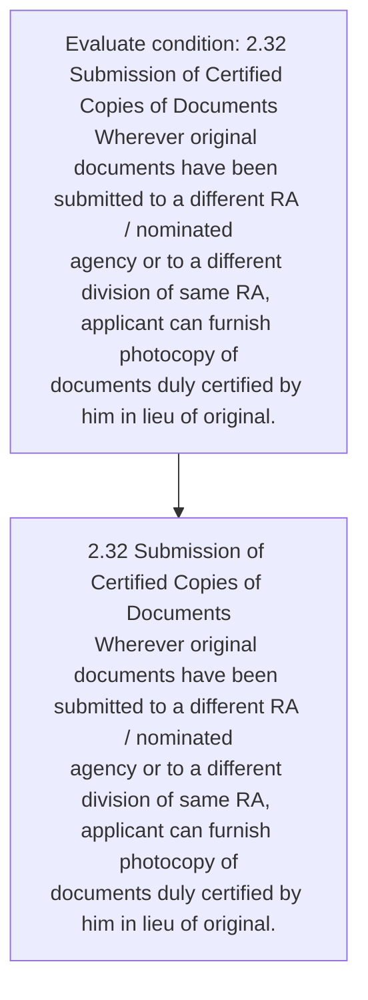
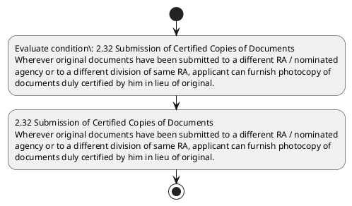

# Chapter 2 / Section 2.32: Submission of Certified Copies of Documents

**Chapter Title:** General Provisions Regarding Imports and Exports

**Pages:** 12

**Purpose:** 2.32 Submission of Certified Copies of Documents
Wherever original documents have been submitted to a different RA / nominated
agency or to a different division of same RA, applicant can furnish photocopy of
documents duly certified by him in lieu of original.

**Purpose Thanglish:** Indha Submission of Certified Copies of Documents section-la, 2.32 Submission of Certified Copies of documents
Wherever original documents have been submitted to a different RA / nominated
agency or to a different division of same RA, applicant can furnish photocopy of
documents duly certified by him in lieu of original.

**Summary:** 2.32 Submission of Certified Copies of Documents
Wherever original documents have been submitted to a different RA / nominated
agency or to a different division of same RA, applicant can furnish photocopy of
documents duly certified by him in lieu of original. WAREHOUSING FACILITY

**Business Meaning:** 2.32 Submission of Certified Copies of Documents
Wherever original documents have been submitted to a different RA / nominated
agency or to a different division of same RA, applicant can furnish photocopy of
documents duly certified by him in lieu of original.

**Business Explanation:** 2.32 Submission of Certified Copies of Documents
Wherever original documents have been submitted to a different RA / nominated
agency or to a different division of same RA, applicant can furnish photocopy of
documents duly certified by him in lieu of original. WAREHOUSING FACILITY

**Business Explanation Thanglish:** Indha Submission of Certified Copies of Documents section-la, 2.32 Submission of Certified Copies of documents
Wherever original documents have been submitted to a different RA / nominated
agency or to a different division of same RA, applicant can furnish photocopy of
documents duly certified by him in lieu of original. WAREHOUSING FACILITY

## Business Logic
- None identified

## Business Rules
- rule_id=CH2-SEC2_32-R001, rule_description=IF validations pass THEN recommend action: 2.32 Submission of Certified Copies of Documents
Wherever original documents have been submitted to a different RA / nominated
agency or to a different division of same RA, applicant can furnish photocopy of
documents duly certified by him in lieu of original., trigger=Submission of Certified Copies of Documents, condition=2.32 Submission of Certified Copies of Documents
Wherever original documents have been submitted to a different RA / nominated
agency or to a different division of same RA, applicant can furnish photocopy of
documents duly certified by him in lieu of original., validation=Not explicitly covered in uploaded documents., action=2.32 Submission of Certified Copies of Documents
Wherever original documents have been submitted to a different RA / nominated
agency or to a different division of same RA, applicant can furnish photocopy of
documents duly certified by him in lieu of original., exception=No explicit exception found in uploaded documents., output=DEKAI should produce a compliance decision for 2.32 - Submission of Certified Copies of Documents.

## Conditions
- 2.32 Submission of Certified Copies of Documents
Wherever original documents have been submitted to a different RA / nominated
agency or to a different division of same RA, applicant can furnish photocopy of
documents duly certified by him in lieu of original.

## Condition Logic
- id=2.2.32.1, if=2.32 Submission of Certified Copies of Documents
Wherever original documents have been submitted to a different RA / nominated
agency or to a different division of same RA, applicant can furnish photocopy of
documents duly certified by him in lieu of original., then=2.32 Submission of Certified Copies of Documents
Wherever original documents have been submitted to a different RA / nominated
agency or to a different division of same RA, applicant can furnish photocopy of
documents duly certified by him in lieu of original., source=2.32 Submission of Certified Copies of Documents
Wherever original documents have been submitted to a different RA / nominated
agency or to a different division of same RA, applicant can furnish photocopy of
documents duly certified by him in lieu of original.

## Validations
- None identified

## Exceptions
- None identified

## Dependencies
- None identified

## Authorities
- RA
- Wherever original documents have been submitted to a different RA

## Required Documents
- 2.32 Submission of Certified Copies of Documents
Wherever original documents have been submitted to a different RA / nominated
agency or to a different division of same RA, applicant can furnish photocopy of
documents duly certified by him in lieu of original.

## Timelines
- None identified

## Actions
- 2.32 Submission of Certified Copies of Documents
Wherever original documents have been submitted to a different RA / nominated
agency or to a different division of same RA, applicant can furnish photocopy of
documents duly certified by him in lieu of original.

## Workflow
- Evaluate condition: 2.32 Submission of Certified Copies of Documents
Wherever original documents have been submitted to a different RA / nominated
agency or to a different division of same RA, applicant can furnish photocopy of
documents duly certified by him in lieu of original.
- 2.32 Submission of Certified Copies of Documents
Wherever original documents have been submitted to a different RA / nominated
agency or to a different division of same RA, applicant can furnish photocopy of
documents duly certified by him in lieu of original.

## Workflow ASCII
```text
Submission of Certified Copies of Documents
Evaluate condition: 2.32 Submission of Certified Copies of Documents
Wherever original documents have been submitted to a different RA / nominated
agency or to a different division of same RA, applicant can furnish photocopy of
documents duly certified by him in lieu of original.
   |
   v
2.32 Submission of Certified Copies of Documents
Wherever original documents have been submitted to a different RA / nominated
agency or to a different division of same RA, applicant can furnish photocopy of
documents duly certified by him in lieu of original.
```

## Decision Tree
- IF 2.32 Submission of Certified Copies of Documents
Wherever original documents have been submitted to a different RA / nominated
agency or to a different division of same RA, applicant can furnish photocopy of
documents duly certified by him in lieu of original. THEN 2.32 Submission of Certified Copies of Documents
Wherever original documents have been submitted to a different RA / nominated
agency or to a different division of same RA, applicant can furnish photocopy of
documents duly certified by him in lieu of original.

## Decision Tree ASCII
```text
Submission of Certified Copies of Documents Decision
IF 2.32 Submission of Certified Copies of Documents
Wherever original documents have been submitted to a different RA / nominated
agency or to a different division of same RA, applicant can furnish photocopy of
documents duly certified by him in lieu of original. THEN 2.32 Submission of Certified Copies of Documents
Wherever original documents have been submitted to a different RA / nominated
agency or to a different division of same RA, applicant can furnish photocopy of
documents duly certified by him in lieu of original.
```

## Examples
- User asks to process Submission of Certified Copies of Documents; the platform checks conditions, validations, and documents before action.

**Real-world Example:** Example: an importer or exporter invokes Submission of Certified Copies of Documents, submits 2.32 Submission of Certified Copies of Documents
Wherever original documents have been submitted to a different RA / nominated
agency or to a different division of same RA, applicant can furnish photocopy of
documents duly certified by him in lieu of original., and DEKAI uses the extracted rules to 2.32 submission of certified copies of documents
wherever original documents have been submitted to a different ra / nominated
agency or to a different division of same ra, applicant can furnish photocopy of
documents duly certified by him in lieu of original..

**Real-world Example Thanglish:** Indha Submission of Certified Copies of Documents section-la, Example: an importer or exporter invokes Submission of Certified Copies of documents, submits 2.32 Submission of Certified Copies of documents
Wherever original documents have been submitted to a different RA / nominated
agency or to a different division of same RA, applicant can furnish photocopy of
documents duly certified by him in lieu of original., and DEKAI uses the extracted rules to 2.32 submission of certified copies of documents
wherever original documents have been submitted to a different ra / nominated
agency or to a different division of same ra, applicant can furnish photocopy of
documents duly certified by him in lieu of original..

## AI Rules
- IF validations pass THEN recommend action: 2.32 Submission of Certified Copies of Documents
Wherever original documents have been submitted to a different RA / nominated
agency or to a different division of same RA, applicant can furnish photocopy of
documents duly certified by him in lieu of original.

## Database Fields
- name=section_code, type=string, required=True, source=parsed_section_heading
- name=section_title, type=string, required=True, source=parsed_section_heading
- name=can_flag, type=boolean, required=False, source=keyword:can
- name=him_flag, type=boolean, required=False, source=keyword:him
- name=have_flag, type=boolean, required=False, source=keyword:have
- name=been_flag, type=boolean, required=False, source=keyword:been
- name=same_flag, type=boolean, required=False, source=keyword:same
- name=duly_flag, type=boolean, required=False, source=keyword:duly
- name=lieu_flag, type=boolean, required=False, source=keyword:lieu
- name=copies_flag, type=boolean, required=False, source=keyword:Copies
- name=document_1_submitted, type=boolean, required=True, source=2.32 Submission of Certified Copies of Documents
Wherever original documents have been submitted to a different RA / nominated
agency or to a different division of same RA, applicant can furnish photocopy of
documents duly certified by him in lieu of original.

## API Requirements
- method=GET, path=/api/dgft/sections/2.32, purpose=Retrieve knowledge payload for section 2.32, query_params=['include=workflow,decision_tree,validations'], response_fields=['section', 'title', 'summary', 'conditions', 'validations', 'exceptions', 'workflow', 'decision_tree']
- method=POST, path=/api/dgft/Submission-of-Certified-Copies-of-Documents/validate, purpose=Validate inputs and documents for Submission of Certified Copies of Documents, request_fields=['section_code', 'section_title', 'document_1_submitted'], response_fields=['status', 'errors', 'warnings', 'next_actions']
- method=POST, path=/api/dgft/Submission-of-Certified-Copies-of-Documents/execute, purpose=Trigger business action for 2.32 Submission of Certified Copies of Documents
Wherever original documents have been submitted to a different RA / nominated
agency or to a different division of same RA, applicant can furnish photocopy of
documents duly certified by him in lieu of original., request_fields=['section_code', 'section_title', 'document_1_submitted'], response_fields=['reference_id', 'status', 'authority', 'timeline']

## UI Screens
- screen_id=Submission_of_Certified_Copies_of_Documents_overview, name=Submission of Certified Copies of Documents Overview, purpose=Show section summary, authority, timeline, and eligibility cues., widgets=['summary_card', 'conditions_table', 'authority_badges', 'timeline_panel']
- screen_id=Submission_of_Certified_Copies_of_Documents_submission, name=Submission of Certified Copies of Documents Submission, purpose=Capture applicant data and supporting documents., widgets=['dynamic_form', 'document_uploader', 'validation_panel', 'next_action_footer'], fields=['section_code', 'section_title', 'can_flag', 'him_flag', 'have_flag', 'been_flag', 'same_flag', 'duly_flag']

## Error Messages
- Validation failed because the section requirements were not fully met.

## FAQ
- question_en=What is the purpose of section 2.32?, answer_en=2.32 Submission of Certified Copies of Documents
Wherever original documents have been submitted to a different RA / nominated
agency or to a different division of same RA, applicant can furnish photocopy of
documents duly certified by him in lieu of original. WAREHOUSING FACILITY, question_thanglish=Indha Submission of Certified Copies of Documents section-la, What is the purpose of section 2.32?, answer_thanglish=Indha Submission of Certified Copies of Documents section-la, 2.32 Submission of Certified Copies of documents
Wherever original documents have been submitted to a different RA / nominated
agency or to a different division of same RA, applicant can furnish photocopy of
documents duly certified by him in lieu of original. WAREHOUSING FACILITY
- question_en=What documents are required under Submission of Certified Copies of Documents?, answer_en=2.32 Submission of Certified Copies of Documents
Wherever original documents have been submitted to a different RA / nominated
agency or to a different division of same RA, applicant can furnish photocopy of
documents duly certified by him in lieu of original., question_thanglish=Indha Submission of Certified Copies of Documents section-la, What documents are required under Submission of Certified Copies of documents?, answer_thanglish=Indha Submission of Certified Copies of Documents section-la, 2.32 Submission of Certified Copies of documents
Wherever original documents have been submitted to a different RA / nominated
agency or to a different division of same RA, applicant can furnish photocopy of
documents duly certified by him in lieu of original.
- question_en=Which authority handles Submission of Certified Copies of Documents?, answer_en=RA, Wherever original documents have been submitted to a different RA, question_thanglish=Indha Submission of Certified Copies of Documents section-la, Which authority handles Submission of Certified Copies of documents?, answer_thanglish=Indha Submission of Certified Copies of Documents section-la, RA, Wherever original documents have been submitted to a different RA

## Questions Users May Ask
- What does Submission of Certified Copies of Documents require?
- Which documents are needed for Submission of Certified Copies of Documents?
- How does DEKAI validate Submission of Certified Copies of Documents requests?
- What action should be taken for Submission of Certified Copies of Documents?

## Expected AI Answers
- Submission of Certified Copies of Documents requires the platform to interpret the section text, apply the extracted business rules, and present the correct next action.
- Required documents are inferred from the section text: 2.32 Submission of Certified Copies of Documents
Wherever original documents have been submitted to a different RA / nominated
agency or to a different division of same RA, applicant can furnish photocopy of
documents duly certified by him in lieu of original.
- DEKAI validates Submission of Certified Copies of Documents by checking conditions, required documents, authority references, and exception clauses before recommending an outcome.
- The primary extracted action is: 2.32 Submission of Certified Copies of Documents
Wherever original documents have been submitted to a different RA / nominated
agency or to a different division of same RA, applicant can furnish photocopy of
documents duly certified by him in lieu of original.

## AI Q&A Examples
- question_en=User asks: How do I comply with Submission of Certified Copies of Documents?, answer_en=AI answers: DEKAI should evaluate section 2.32, apply the extracted rules, and guide the user through Evaluate condition: 2.32 Submission of Certified Copies of Documents
Wherever original documents have been submitted to a different RA / nominated
agency or to a different division of same RA, applicant can furnish photocopy of
documents duly certified by him in lieu of original.., question_thanglish=Indha Submission of Certified Copies of Documents section-la, User asks: How do I comply with Submission of Certified Copies of documents?, answer_thanglish=Indha Submission of Certified Copies of Documents section-la, AI answers: DEKAI should evaluate section 2.32, apply the extracted rules, and guide the user through Evaluate condition: 2.32 Submission of Certified Copies of documents
Wherever original documents have been submitted to a different RA / nominated
agency or to a different division of same RA, applicant can furnish photocopy of
documents duly certified by him in lieu of original..
- question_en=User asks: Which validations apply to Submission of Certified Copies of Documents?, answer_en=AI answers: Applicable validations are not explicitly covered in the uploaded documents., question_thanglish=Indha Submission of Certified Copies of Documents section-la, User asks: Which validations apply to Submission of Certified Copies of documents?, answer_thanglish=Indha Submission of Certified Copies of Documents section-la, AI answers: Applicable validations are not explicitly covered in the uploaded documents.

## DEKAI AI Implementation Notes
- Capture chapter 2, section 2.32, title, and page references as immutable knowledge metadata.
- Bind validations for Submission of Certified Copies of Documents into a rule engine keyed by the rule IDs extracted for this section.
- Expose document upload controls for: 2.32 Submission of Certified Copies of Documents
Wherever original documents have been submitted to a different RA / nominated
agency or to a different division of same RA, applicant can furnish photocopy of
documents duly certified by him in lieu of original..
- Route escalations or approvals to: RA, Wherever original documents have been submitted to a different RA.

## DEKAI AI Implementation Notes Thanglish
- Indha Submission of Certified Copies of Documents section-la, Capture chapter 2, section 2.32, title, and page references as immutable knowledge metadata.
- Indha Submission of Certified Copies of Documents section-la, Bind validations for Submission of Certified Copies of documents into a rule engine keyed by the rule IDs extracted for this section.
- Indha Submission of Certified Copies of Documents section-la, Expose document upload controls for: 2.32 Submission of Certified Copies of documents
Wherever original documents have been submitted to a different RA / nominated
agency or to a different division of same RA, applicant can furnish photocopy of
documents duly certified by him in lieu of original..
- Indha Submission of Certified Copies of Documents section-la, Route escalations or approvals to: RA, Wherever original documents have been submitted to a different RA.

## AI Metadata
- Keywords: can, him, have, been, same, duly, lieu, Copies, agency, furnish, Wherever, original, division, FACILITY, Certified, Documents, submitted, different, nominated, applicant
- Search Keywords: can, him, have, been, same, duly, lieu, Copies, agency, furnish, Wherever, original, division, FACILITY, Certified, Documents, submitted, different, nominated, applicant
- Intent: Support Submission of Certified Copies of Documents processing and compliance validation.
- Tags: 2.32, Submission of Certified Copies of Documents, document-driven, dgft
- Related Sections: 
- Related Chapters: 
- Related Rules: 

## Mermaid


## PlantUML

