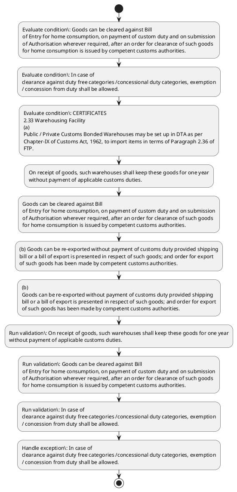

# Chapter 2 / Section 2.33: Warehousing Facility

**Chapter Title:** General Provisions Regarding Imports and Exports

**Pages:** 12

**Purpose:** 2.33 Warehousing Facility
(a) Public / Private Customs Bonded Warehouses may be set up in DTA as per
Chapter-IX of Customs Act, 1962, to import items in terms of Paragraph 2.36 of
FTP.

**Purpose Thanglish:** Indha Warehousing Facility section-la, 2.33 Warehousing Facility
(a) Public / Private Customs Bonded Warehouses may be set up in DTA as per
Chapter-IX of Customs Act, 1962, to import items in terms of Paragraph 2.36 of
FTP.

**Summary:** 2.33 Warehousing Facility
(a) Public / Private Customs Bonded Warehouses may be set up in DTA as per
Chapter-IX of Customs Act, 1962, to import items in terms of Paragraph 2.36 of
FTP. On receipt of goods, such warehouses shall keep these goods for one year
without payment of applicable customs duties. Goods can be cleared against Bill
of Entry for home consumption, on payment of custom duty and on submission
of Authorisation wherever required, after an order for clearance of such goods
for home consumption is issued by competent customs authorities.

**Business Meaning:** Warehousing Facility governs how DGFT business controls should be applied, validated, and enforced.

**Business Explanation:** Warehousing Facility explains the operating rule set that DEKAI should enforce. Key control points include On receipt of goods, such warehouses shall keep these goods for one year
without payment of applicable customs duties. The section also drives actions such as On receipt of goods, such warehouses shall keep these goods for one year
without payment of applicable customs duties..

**Business Explanation Thanglish:** Indha Warehousing Facility section-la, Warehousing Facility explains the operating rule set that DEKAI should enforce. Key control points include On receipt of goods, such warehouses kandippa keep these goods for one year
without payment of applicable customs duties. The section also drives actions such as On receipt of goods, such warehouses kandippa keep these goods for one year
without payment of applicable customs duties..

## Business Logic
- On receipt of goods, such warehouses shall keep these goods for one year
without payment of applicable customs duties.
- In case of
clearance against duty free categories /concessional duty categories, exemption
/ concession from duty shall be allowed.

## Business Rules
- rule_id=CH2-SEC2_33-R001, rule_description=On receipt of goods, such warehouses shall keep these goods for one year
without payment of applicable customs duties., trigger=Warehousing Facility, condition=Goods can be cleared against Bill
of Entry for home consumption, on payment of custom duty and on submission
of Authorisation wherever required, after an order for clearance of such goods
for home consumption is issued by competent customs authorities., validation=On receipt of goods, such warehouses shall keep these goods for one year
without payment of applicable customs duties., action=On receipt of goods, such warehouses shall keep these goods for one year
without payment of applicable customs duties., exception=In case of
clearance against duty free categories /concessional duty categories, exemption
/ concession from duty shall be allowed., output=DEKAI should produce a compliance decision for 2.33 - Warehousing Facility.
- rule_id=CH2-SEC2_33-R002, rule_description=In case of
clearance against duty free categories /concessional duty categories, exemption
/ concession from duty shall be allowed., trigger=Warehousing Facility, condition=In case of
clearance against duty free categories /concessional duty categories, exemption
/ concession from duty shall be allowed., validation=Goods can be cleared against Bill
of Entry for home consumption, on payment of custom duty and on submission
of Authorisation wherever required, after an order for clearance of such goods
for home consumption is issued by competent customs authorities., action=Goods can be cleared against Bill
of Entry for home consumption, on payment of custom duty and on submission
of Authorisation wherever required, after an order for clearance of such goods
for home consumption is issued by competent customs authorities., exception=In case of
clearance against duty free categories /concessional duty categories, exemption
/ concession from duty shall be allowed., output=DEKAI should produce a compliance decision for 2.33 - Warehousing Facility.

## Conditions
- Goods can be cleared against Bill
of Entry for home consumption, on payment of custom duty and on submission
of Authorisation wherever required, after an order for clearance of such goods
for home consumption is issued by competent customs authorities.
- In case of
clearance against duty free categories /concessional duty categories, exemption
/ concession from duty shall be allowed.
- CERTIFICATES
2.33 Warehousing Facility
(a)
Public / Private Customs Bonded Warehouses may be set up in DTA as per
Chapter-IX of Customs Act, 1962, to import items in terms of Paragraph 2.36 of
FTP.
- CERTIFICATES

## Condition Logic
- id=2.2.33.1, if=Goods can be cleared against Bill
of Entry for home consumption, on payment of custom duty and on submission
of Authorisation wherever required, after an order for clearance of such goods
for home consumption is issued by competent customs authorities., then=On receipt of goods, such warehouses shall keep these goods for one year
without payment of applicable customs duties., source=Goods can be cleared against Bill
of Entry for home consumption, on payment of custom duty and on submission
of Authorisation wherever required, after an order for clearance of such goods
for home consumption is issued by competent customs authorities.
- id=2.2.33.2, if=In case of
clearance against duty free categories /concessional duty categories, exemption
/ concession from duty shall be allowed., then=On receipt of goods, such warehouses shall keep these goods for one year
without payment of applicable customs duties., source=In case of
clearance against duty free categories /concessional duty categories, exemption
/ concession from duty shall be allowed.
- id=2.2.33.3, if=CERTIFICATES
2.33 Warehousing Facility
(a)
Public / Private Customs Bonded Warehouses may be set up in DTA as per
Chapter-IX of Customs Act, 1962, to import items in terms of Paragraph 2.36 of
FTP., then=On receipt of goods, such warehouses shall keep these goods for one year
without payment of applicable customs duties., source=CERTIFICATES
2.33 Warehousing Facility
(a)
Public / Private Customs Bonded Warehouses may be set up in DTA as per
Chapter-IX of Customs Act, 1962, to import items in terms of Paragraph 2.36 of
FTP.
- id=2.2.33.4, if=CERTIFICATES, then=On receipt of goods, such warehouses shall keep these goods for one year
without payment of applicable customs duties., source=CERTIFICATES

## Validations
- On receipt of goods, such warehouses shall keep these goods for one year
without payment of applicable customs duties.
- Goods can be cleared against Bill
of Entry for home consumption, on payment of custom duty and on submission
of Authorisation wherever required, after an order for clearance of such goods
for home consumption is issued by competent customs authorities.
- In case of
clearance against duty free categories /concessional duty categories, exemption
/ concession from duty shall be allowed.

## Exceptions
- In case of
clearance against duty free categories /concessional duty categories, exemption
/ concession from duty shall be allowed.

## Dependencies
- 2.36

## Authorities
- Customs
- Public / Private Customs
- Chapter-IX of Customs

## Required Documents
- Goods can be cleared against Bill
- (b) Goods can be re-exported without payment of customs duty provided shipping
bill or a bill of export is presented in respect of such goods; and order for export
of such goods has been made by competent customs authorities.
- CERTIFICATES
2.33 Warehousing Facility
(a)
Public / Private Customs Bonded Warehouses may be set up in DTA as per
Chapter-IX of Customs Act, 1962, to import items in terms of Paragraph 2.36 of
FTP.
- (b)
Goods can be re-exported without payment of customs duty provided shipping
bill or a bill of export is presented in respect of such goods; and order for export
of such goods has been made by competent customs authorities.
- CERTIFICATES

## Timelines
- Goods can be cleared against Bill
of Entry for home consumption, on payment of custom duty and on submission
of Authorisation wherever required, after an order for clearance of such goods
for home consumption is issued by competent customs authorities.

## Actions
- On receipt of goods, such warehouses shall keep these goods for one year
without payment of applicable customs duties.
- Goods can be cleared against Bill
of Entry for home consumption, on payment of custom duty and on submission
of Authorisation wherever required, after an order for clearance of such goods
for home consumption is issued by competent customs authorities.
- (b) Goods can be re-exported without payment of customs duty provided shipping
bill or a bill of export is presented in respect of such goods; and order for export
of such goods has been made by competent customs authorities.
- (b)
Goods can be re-exported without payment of customs duty provided shipping
bill or a bill of export is presented in respect of such goods; and order for export
of such goods has been made by competent customs authorities.

## Workflow
- Evaluate condition: Goods can be cleared against Bill
of Entry for home consumption, on payment of custom duty and on submission
of Authorisation wherever required, after an order for clearance of such goods
for home consumption is issued by competent customs authorities.
- Evaluate condition: In case of
clearance against duty free categories /concessional duty categories, exemption
/ concession from duty shall be allowed.
- Evaluate condition: CERTIFICATES
2.33 Warehousing Facility
(a)
Public / Private Customs Bonded Warehouses may be set up in DTA as per
Chapter-IX of Customs Act, 1962, to import items in terms of Paragraph 2.36 of
FTP.
- On receipt of goods, such warehouses shall keep these goods for one year
without payment of applicable customs duties.
- Goods can be cleared against Bill
of Entry for home consumption, on payment of custom duty and on submission
of Authorisation wherever required, after an order for clearance of such goods
for home consumption is issued by competent customs authorities.
- (b) Goods can be re-exported without payment of customs duty provided shipping
bill or a bill of export is presented in respect of such goods; and order for export
of such goods has been made by competent customs authorities.
- (b)
Goods can be re-exported without payment of customs duty provided shipping
bill or a bill of export is presented in respect of such goods; and order for export
of such goods has been made by competent customs authorities.
- Run validation: On receipt of goods, such warehouses shall keep these goods for one year
without payment of applicable customs duties.
- Run validation: Goods can be cleared against Bill
of Entry for home consumption, on payment of custom duty and on submission
of Authorisation wherever required, after an order for clearance of such goods
for home consumption is issued by competent customs authorities.
- Run validation: In case of
clearance against duty free categories /concessional duty categories, exemption
/ concession from duty shall be allowed.
- Handle exception: In case of
clearance against duty free categories /concessional duty categories, exemption
/ concession from duty shall be allowed.

## Workflow ASCII
```text
Warehousing Facility
Evaluate condition: Goods can be cleared against Bill
of Entry for home consumption, on payment of custom duty and on submission
of Authorisation wherever required, after an order for clearance of such goods
for home consumption is issued by competent customs authorities.
   |
   v
Evaluate condition: In case of
clearance against duty free categories /concessional duty categories, exemption
/ concession from duty shall be allowed.
   |
   v
Evaluate condition: CERTIFICATES
2.33 Warehousing Facility
(a)
Public / Private Customs Bonded Warehouses may be set up in DTA as per
Chapter-IX of Customs Act, 1962, to import items in terms of Paragraph 2.36 of
FTP.
   |
   v
On receipt of goods, such warehouses shall keep these goods for one year
without payment of applicable customs duties.
   |
   v
Goods can be cleared against Bill
of Entry for home consumption, on payment of custom duty and on submission
of Authorisation wherever required, after an order for clearance of such goods
for home consumption is issued by competent customs authorities.
   |
   v
(b) Goods can be re-exported without payment of customs duty provided shipping
bill or a bill of export is presented in respect of such goods; and order for export
of such goods has been made by competent customs authorities.
   |
   v
(b)
Goods can be re-exported without payment of customs duty provided shipping
bill or a bill of export is presented in respect of such goods; and order for export
of such goods has been made by competent customs authorities.
   |
   v
Run validation: On receipt of goods, such warehouses shall keep these goods for one year
without payment of applicable customs duties.
   |
   v
Run validation: Goods can be cleared against Bill
of Entry for home consumption, on payment of custom duty and on submission
of Authorisation wherever required, after an order for clearance of such goods
for home consumption is issued by competent customs authorities.
   |
   v
Run validation: In case of
clearance against duty free categories /concessional duty categories, exemption
/ concession from duty shall be allowed.
   |
   v
Handle exception: In case of
clearance against duty free categories /concessional duty categories, exemption
/ concession from duty shall be allowed.
```

## Decision Tree
- IF Goods can be cleared against Bill
of Entry for home consumption, on payment of custom duty and on submission
of Authorisation wherever required, after an order for clearance of such goods
for home consumption is issued by competent customs authorities. THEN On receipt of goods, such warehouses shall keep these goods for one year
without payment of applicable customs duties.
- IF In case of
clearance against duty free categories /concessional duty categories, exemption
/ concession from duty shall be allowed. THEN On receipt of goods, such warehouses shall keep these goods for one year
without payment of applicable customs duties.
- IF CERTIFICATES
2.33 Warehousing Facility
(a)
Public / Private Customs Bonded Warehouses may be set up in DTA as per
Chapter-IX of Customs Act, 1962, to import items in terms of Paragraph 2.36 of
FTP. THEN On receipt of goods, such warehouses shall keep these goods for one year
without payment of applicable customs duties.
- IF CERTIFICATES THEN On receipt of goods, such warehouses shall keep these goods for one year
without payment of applicable customs duties.
- IF exception applies (In case of
clearance against duty free categories /concessional duty categories, exemption
/ concession from duty shall be allowed.) THEN route to manual review

## Decision Tree ASCII
```text
Warehousing Facility Decision
IF Goods can be cleared against Bill
of Entry for home consumption, on payment of custom duty and on submission
of Authorisation wherever required, after an order for clearance of such goods
for home consumption is issued by competent customs authorities. THEN On receipt of goods, such warehouses shall keep these goods for one year
without payment of applicable customs duties.
   |
   v
IF In case of
clearance against duty free categories /concessional duty categories, exemption
/ concession from duty shall be allowed. THEN On receipt of goods, such warehouses shall keep these goods for one year
without payment of applicable customs duties.
   |
   v
IF CERTIFICATES
2.33 Warehousing Facility
(a)
Public / Private Customs Bonded Warehouses may be set up in DTA as per
Chapter-IX of Customs Act, 1962, to import items in terms of Paragraph 2.36 of
FTP. THEN On receipt of goods, such warehouses shall keep these goods for one year
without payment of applicable customs duties.
   |
   v
IF CERTIFICATES THEN On receipt of goods, such warehouses shall keep these goods for one year
without payment of applicable customs duties.
   |
   v
IF exception applies (In case of
clearance against duty free categories /concessional duty categories, exemption
/ concession from duty shall be allowed.) THEN route to manual review
```

## Examples
- User asks to process Warehousing Facility; the platform checks conditions, validations, and documents before action.

**Real-world Example:** Example: an importer or exporter invokes Warehousing Facility, submits Goods can be cleared against Bill, (b) Goods can be re-exported without payment of customs duty provided shipping
bill or a bill of export is presented in respect of such goods; and order for export
of such goods has been made by competent customs authorities., CERTIFICATES
2.33 Warehousing Facility
(a)
Public / Private Customs Bonded Warehouses may be set up in DTA as per
Chapter-IX of Customs Act, 1962, to import items in terms of Paragraph 2.36 of
FTP., and DEKAI uses the extracted rules to on receipt of goods, such warehouses shall keep these goods for one year
without payment of applicable customs duties..

**Real-world Example Thanglish:** Indha Warehousing Facility section-la, Example: an importer or exporter invokes Warehousing Facility, submits Goods can be cleared against Bill, (b) Goods can be re-exported without payment of customs duty provided shipping
bill or a bill of export is presented in respect of such goods; and order for export
of such goods has been made by competent customs authorities., CERTIFICATES
2.33 Warehousing Facility
(a)
Public / Private Customs Bonded Warehouses may be set up in DTA as per
Chapter-IX of Customs Act, 1962, to import items in terms of Paragraph 2.36 of
FTP., and DEKAI uses the extracted rules to on receipt of goods, such warehouses kandippa keep these goods for one year
without payment of applicable customs duties..

## AI Rules
- IF detected context matches section rule THEN enforce: On receipt of goods, such warehouses shall keep these goods for one year
without payment of applicable customs duties.
- IF detected context matches section rule THEN enforce: In case of
clearance against duty free categories /concessional duty categories, exemption
/ concession from duty shall be allowed.
- IF validations pass THEN recommend action: On receipt of goods, such warehouses shall keep these goods for one year
without payment of applicable customs duties.

## Database Fields
- name=section_code, type=string, required=True, source=parsed_section_heading
- name=section_title, type=string, required=True, source=parsed_section_heading
- name=may_flag, type=boolean, required=False, source=keyword:may
- name=set_flag, type=boolean, required=False, source=keyword:set
- name=dta_flag, type=boolean, required=False, source=keyword:DTA
- name=per_flag, type=boolean, required=False, source=keyword:per
- name=act_flag, type=boolean, required=False, source=keyword:Act
- name=ftp_flag, type=boolean, required=False, source=keyword:FTP
- name=for_flag, type=boolean, required=False, source=keyword:for
- name=one_flag, type=boolean, required=False, source=keyword:one
- name=document_1_submitted, type=boolean, required=True, source=Goods can be cleared against Bill
- name=document_2_submitted, type=boolean, required=True, source=(b) Goods can be re-exported without payment of customs duty provided shipping
bill or a bill of export is presented in respect of such goods; and order for export
of such goods has been made by competent customs authorities.
- name=document_3_submitted, type=boolean, required=True, source=CERTIFICATES
2.33 Warehousing Facility
(a)
Public / Private Customs Bonded Warehouses may be set up in DTA as per
Chapter-IX of Customs Act, 1962, to import items in terms of Paragraph 2.36 of
FTP.
- name=document_4_submitted, type=boolean, required=True, source=(b)
Goods can be re-exported without payment of customs duty provided shipping
bill or a bill of export is presented in respect of such goods; and order for export
of such goods has been made by competent customs authorities.
- name=document_5_submitted, type=boolean, required=True, source=CERTIFICATES

## API Requirements
- method=GET, path=/api/dgft/sections/2.33, purpose=Retrieve knowledge payload for section 2.33, query_params=['include=workflow,decision_tree,validations'], response_fields=['section', 'title', 'summary', 'conditions', 'validations', 'exceptions', 'workflow', 'decision_tree']
- method=POST, path=/api/dgft/Warehousing-Facility/validate, purpose=Validate inputs and documents for Warehousing Facility, request_fields=['section_code', 'section_title', 'document_1_submitted', 'document_2_submitted', 'document_3_submitted', 'document_4_submitted', 'document_5_submitted'], response_fields=['status', 'errors', 'warnings', 'next_actions']
- method=POST, path=/api/dgft/Warehousing-Facility/execute, purpose=Trigger business action for On receipt of goods, such warehouses shall keep these goods for one year
without payment of applicable customs duties., request_fields=['section_code', 'section_title', 'document_1_submitted', 'document_2_submitted', 'document_3_submitted', 'document_4_submitted', 'document_5_submitted'], response_fields=['reference_id', 'status', 'authority', 'timeline']

## UI Screens
- screen_id=Warehousing_Facility_overview, name=Warehousing Facility Overview, purpose=Show section summary, authority, timeline, and eligibility cues., widgets=['summary_card', 'conditions_table', 'authority_badges', 'timeline_panel']
- screen_id=Warehousing_Facility_submission, name=Warehousing Facility Submission, purpose=Capture applicant data and supporting documents., widgets=['dynamic_form', 'document_uploader', 'validation_panel', 'next_action_footer'], fields=['section_code', 'section_title', 'may_flag', 'set_flag', 'dta_flag', 'per_flag', 'act_flag', 'ftp_flag']
- screen_id=Warehousing_Facility_exceptions, name=Warehousing Facility Exception Review, purpose=Explain exception handling and manual review triggers., widgets=['exception_banner', 'decision_tree', 'case_notes']

## Error Messages
- Validation failed because the section requirements were not fully met.

## FAQ
- question_en=What is the purpose of section 2.33?, answer_en=Warehousing Facility explains the operating rule set that DEKAI should enforce. Key control points include On receipt of goods, such warehouses shall keep these goods for one year
without payment of applicable customs duties. The section also drives actions such as On receipt of goods, such warehouses shall keep these goods for one year
without payment of applicable customs duties.., question_thanglish=Indha Warehousing Facility section-la, What is the purpose of section 2.33?, answer_thanglish=Indha Warehousing Facility section-la, Warehousing Facility explains the operating rule set that DEKAI should enforce. Key control points include On receipt of goods, such warehouses kandippa keep these goods for one year
without payment of applicable customs duties. The section also drives actions such as On receipt of goods, such warehouses kandippa keep these goods for one year
without payment of applicable customs duties..
- question_en=What documents are required under Warehousing Facility?, answer_en=Goods can be cleared against Bill, (b) Goods can be re-exported without payment of customs duty provided shipping
bill or a bill of export is presented in respect of such goods; and order for export
of such goods has been made by competent customs authorities., CERTIFICATES
2.33 Warehousing Facility
(a)
Public / Private Customs Bonded Warehouses may be set up in DTA as per
Chapter-IX of Customs Act, 1962, to import items in terms of Paragraph 2.36 of
FTP., (b)
Goods can be re-exported without payment of customs duty provided shipping
bill or a bill of export is presented in respect of such goods; and order for export
of such goods has been made by competent customs authorities., CERTIFICATES, question_thanglish=Indha Warehousing Facility section-la, What documents are required under Warehousing Facility?, answer_thanglish=Indha Warehousing Facility section-la, Goods can be cleared against Bill, (b) Goods can be re-exported without payment of customs duty provided shipping
bill or a bill of export is presented in respect of such goods; and order for export
of such goods has been made by competent customs authorities., CERTIFICATES
2.33 Warehousing Facility
(a)
Public / Private Customs Bonded Warehouses may be set up in DTA as per
Chapter-IX of Customs Act, 1962, to import items in terms of Paragraph 2.36 of
FTP., (b)
Goods can be re-exported without payment of customs duty provided shipping
bill or a bill of export is presented in respect of such goods; and order for export
of such goods has been made by competent customs authorities., CERTIFICATES
- question_en=Which authority handles Warehousing Facility?, answer_en=Customs, Public / Private Customs, Chapter-IX of Customs, question_thanglish=Indha Warehousing Facility section-la, Which authority handles Warehousing Facility?, answer_thanglish=Indha Warehousing Facility section-la, Customs, Public / Private Customs, Chapter-IX of Customs

## Questions Users May Ask
- What does Warehousing Facility require?
- Which documents are needed for Warehousing Facility?
- How does DEKAI validate Warehousing Facility requests?
- What action should be taken for Warehousing Facility?

## Expected AI Answers
- Warehousing Facility requires the platform to interpret the section text, apply the extracted business rules, and present the correct next action.
- Required documents are inferred from the section text: Goods can be cleared against Bill, (b) Goods can be re-exported without payment of customs duty provided shipping
bill or a bill of export is presented in respect of such goods; and order for export
of such goods has been made by competent customs authorities., CERTIFICATES
2.33 Warehousing Facility
(a)
Public / Private Customs Bonded Warehouses may be set up in DTA as per
Chapter-IX of Customs Act, 1962, to import items in terms of Paragraph 2.36 of
FTP., (b)
Goods can be re-exported without payment of customs duty provided shipping
bill or a bill of export is presented in respect of such goods; and order for export
of such goods has been made by competent customs authorities., CERTIFICATES
- DEKAI validates Warehousing Facility by checking conditions, required documents, authority references, and exception clauses before recommending an outcome.
- The primary extracted action is: On receipt of goods, such warehouses shall keep these goods for one year
without payment of applicable customs duties.

## AI Q&A Examples
- question_en=User asks: How do I comply with Warehousing Facility?, answer_en=AI answers: DEKAI should evaluate section 2.33, apply the extracted rules, and guide the user through Evaluate condition: Goods can be cleared against Bill
of Entry for home consumption, on payment of custom duty and on submission
of Authorisation wherever required, after an order for clearance of such goods
for home consumption is issued by competent customs authorities.., question_thanglish=Indha Warehousing Facility section-la, User asks: How do I comply with Warehousing Facility?, answer_thanglish=Indha Warehousing Facility section-la, AI answers: DEKAI should evaluate section 2.33, apply the extracted rules, and guide the user through Evaluate condition: Goods can be cleared against Bill
of Entry for home consumption, on payment of custom duty and on submission
of Authorisation wherever required, after an order for clearance of such goods
for home consumption is issued by competent customs authorities..
- question_en=User asks: Which validations apply to Warehousing Facility?, answer_en=AI answers: Applicable validations are On receipt of goods, such warehouses shall keep these goods for one year
without payment of applicable customs duties., Goods can be cleared against Bill
of Entry for home consumption, on payment of custom duty and on submission
of Authorisation wherever required, after an order for clearance of such goods
for home consumption is issued by competent customs authorities., In case of
clearance against duty free categories /concessional duty categories, exemption
/ concession from duty shall be allowed., question_thanglish=Indha Warehousing Facility section-la, User asks: Which validations apply to Warehousing Facility?, answer_thanglish=Indha Warehousing Facility section-la, AI answers: Applicable validations are On receipt of goods, such warehouses kandippa keep these goods for one year
without payment of applicable customs duties., Goods can be cleared against Bill
of Entry for home consumption, on payment of custom duty and on submission
of Authorisation wherever required, after an order for clearance of such goods
for home consumption is issued by competent customs authorities., In case of
clearance against duty free categories /concessional duty categories, exemption
/ concession from duty kandippa be allowed.

## DEKAI AI Implementation Notes
- Capture chapter 2, section 2.33, title, and page references as immutable knowledge metadata.
- Bind validations for Warehousing Facility into a rule engine keyed by the rule IDs extracted for this section.
- Expose document upload controls for: Goods can be cleared against Bill, (b) Goods can be re-exported without payment of customs duty provided shipping
bill or a bill of export is presented in respect of such goods; and order for export
of such goods has been made by competent customs authorities., CERTIFICATES
2.33 Warehousing Facility
(a)
Public / Private Customs Bonded Warehouses may be set up in DTA as per
Chapter-IX of Customs Act, 1962, to import items in terms of Paragraph 2.36 of
FTP., (b)
Goods can be re-exported without payment of customs duty provided shipping
bill or a bill of export is presented in respect of such goods; and order for export
of such goods has been made by competent customs authorities., CERTIFICATES.
- Route escalations or approvals to: Customs, Public / Private Customs, Chapter-IX of Customs.
- Trigger manual review when exception clauses are detected.
- Show contextual links to related sections: 2.36.

## DEKAI AI Implementation Notes Thanglish
- Indha Warehousing Facility section-la, Capture chapter 2, section 2.33, title, and page references as immutable knowledge metadata.
- Indha Warehousing Facility section-la, Bind validations for Warehousing Facility into a rule engine keyed by the rule IDs extracted for this section.
- Indha Warehousing Facility section-la, Expose document upload controls for: Goods can be cleared against Bill, (b) Goods can be re-exported without payment of customs duty provided shipping
bill or a bill of export is presented in respect of such goods; and order for export
of such goods has been made by competent customs authorities., CERTIFICATES
2.33 Warehousing Facility
(a)
Public / Private Customs Bonded Warehouses may be set up in DTA as per
Chapter-IX of Customs Act, 1962, to import items in terms of Paragraph 2.36 of
FTP., (b)
Goods can be re-exported without payment of customs duty provided shipping
bill or a bill of export is presented in respect of such goods; and order for export
of such goods has been made by competent customs authorities., CERTIFICATES.
- Indha Warehousing Facility section-la, Route escalations or approvals to: Customs, Public / Private Customs, Chapter-IX of Customs.
- Indha Warehousing Facility section-la, Trigger manual review when exception clauses are detected.
- Indha Warehousing Facility section-la, Show contextual links to related sections: 2.36.

## AI Metadata
- Keywords: may, set, DTA, per, Act, FTP, for, one, can, and, has, such, keep, year, Bill, home, duty, case, free, from
- Search Keywords: may, set, DTA, per, Act, FTP, for, one, can, and, has, such, keep, year, Bill, home, duty, case, free, from
- Intent: Support Warehousing Facility processing and compliance validation.
- Tags: 2.33, Warehousing Facility, business-rule, document-driven, dgft
- Related Sections: 2.36
- Related Chapters: 
- Related Rules: On receipt of goods, such warehouses shall keep these goods for one year
without payment of applicable customs duties., In case of
clearance against duty free categories /concessional duty categories, exemption
/ concession from duty shall be allowed.

## Mermaid

```mermaid
flowchart TD
    S1["Evaluate condition: Goods can be cleared against Bill
of Entry for home consumption, on payment of custom duty and on submission
of Authorisation wherever required, after an order for clearance of such goods
for home consumption is issued by competent customs authorities."]
    S2["Evaluate condition: In case of
clearance against duty free categories /concessional duty categories, exemption
/ concession from duty shall be allowed."]
    S1 --> S2
    S3["Evaluate condition: CERTIFICATES
2.33 Warehousing Facility
(a)
Public / Private Customs Bonded Warehouses may be set up in DTA as per
Chapter-IX of Customs Act, 1962, to import items in terms of Paragraph 2.36 of
FTP."]
    S2 --> S3
    S4["On receipt of goods, such warehouses shall keep these goods for one year
without payment of applicable customs duties."]
    S3 --> S4
    S5["Goods can be cleared against Bill
of Entry for home consumption, on payment of custom duty and on submission
of Authorisation wherever required, after an order for clearance of such goods
for home consumption is issued by competent customs authorities."]
    S4 --> S5
    S6["(b) Goods can be re-exported without payment of customs duty provided shipping
bill or a bill of export is presented in respect of such goods; and order for export
of such goods has been made by competent customs authorities."]
    S5 --> S6
    S7["(b)
Goods can be re-exported without payment of customs duty provided shipping
bill or a bill of export is presented in respect of such goods; and order for export
of such goods has been made by competent customs authorities."]
    S6 --> S7
    S8["Run validation: On receipt of goods, such warehouses shall keep these goods for one year
without payment of applicable customs duties."]
    S7 --> S8
    S9["Run validation: Goods can be cleared against Bill
of Entry for home consumption, on payment of custom duty and on submission
of Authorisation wherever required, after an order for clearance of such goods
for home consumption is issued by competent customs authorities."]
    S8 --> S9
    S10["Run validation: In case of
clearance against duty free categories /concessional duty categories, exemption
/ concession from duty shall be allowed."]
    S9 --> S10
    S11["Handle exception: In case of
clearance against duty free categories /concessional duty categories, exemption
/ concession from duty shall be allowed."]
    S10 --> S11
```


## PlantUML

