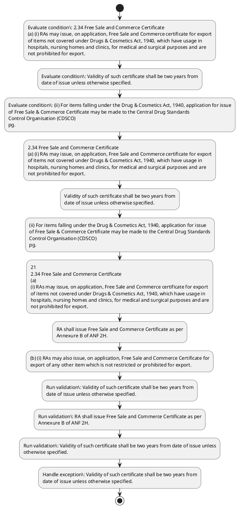

# Chapter 2 / Section 2.34: Free Sale and Commerce Certificate

**Chapter Title:** General Provisions Regarding Imports and Exports

**Pages:** 12, 13

**Purpose:** 2.34 Free Sale and Commerce Certificate
(a) (i) RAs may issue, on application, Free Sale and Commerce certificate for export
of items not covered under Drugs & Cosmetics Act, 1940, which have usage in
hospitals, nursing homes and clinics, for medical and surgical purposes and are
not prohibited for export.

**Purpose Thanglish:** Indha Free Sale and Commerce Certificate section-la, 2.34 Free Sale and Commerce Certificate
(a) (i) RAs may issue, on application, Free Sale and Commerce certificate for export
of items not covered under Drugs & Cosmetics Act, 1940, which have usage in
hospitals, nursing homes and clinics, for medical and surgical purposes and are
not prohibited for export.

**Summary:** 2.34 Free Sale and Commerce Certificate
(a) (i) RAs may issue, on application, Free Sale and Commerce certificate for export
of items not covered under Drugs & Cosmetics Act, 1940, which have usage in
hospitals, nursing homes and clinics, for medical and surgical purposes and are
not prohibited for export. Validity of such certificate shall be two years from
date of issue unless otherwise specified. (ii) For items falling under the Drug & Cosmetics Act, 1940, application for issue
of Free Sale & Commerce Certificate may be made to the Central Drug Standards
Control Organisation (CDSCO)
pg.

**Business Meaning:** Free Sale and Commerce Certificate governs how DGFT business controls should be applied, validated, and enforced.

**Business Explanation:** Free Sale and Commerce Certificate explains the operating rule set that DEKAI should enforce. Key control points include Validity of such certificate shall be two years from
date of issue unless otherwise specified. The section also drives actions such as 2.34 Free Sale and Commerce Certificate
(a) (i) RAs may issue, on application, Free Sale and Commerce certificate for export
of items not covered under Drugs & Cosmetics Act, 1940, which have usage in
hospitals, nursing homes and clinics, for medical and surgical purposes and are
not prohibited for export..

**Business Explanation Thanglish:** Indha Free Sale and Commerce Certificate section-la, Free Sale and Commerce Certificate explains the operating rule set that DEKAI should enforce. Key control points include Validity of such certificate kandippa be two years from
date of issue unless otherwise specified. The section also drives actions such as 2.34 Free Sale and Commerce Certificate
(a) (i) RAs may issue, on application, Free Sale and Commerce certificate for export
of items not covered under Drugs & Cosmetics Act, 1940, which have usage in
hospitals, nursing homes and clinics, for medical and surgical purposes and are
not prohibited for export..

## Business Logic
- Validity of such certificate shall be two years from
date of issue unless otherwise specified.
- RA shall issue Free Sale and Commerce Certificate as per
Annexure B of ANF 2H.
- Validity of such certificate shall be two years from date of issue unless
otherwise specified.
- RA shall issue Free Sale and
Commerce Certificate as per Annexure B of ANF 2H.

## Business Rules
- rule_id=CH2-SEC2_34-R001, rule_description=Validity of such certificate shall be two years from
date of issue unless otherwise specified., trigger=Free Sale and Commerce Certificate, condition=2.34 Free Sale and Commerce Certificate
(a) (i) RAs may issue, on application, Free Sale and Commerce certificate for export
of items not covered under Drugs & Cosmetics Act, 1940, which have usage in
hospitals, nursing homes and clinics, for medical and surgical purposes and are
not prohibited for export., validation=Validity of such certificate shall be two years from
date of issue unless otherwise specified., action=2.34 Free Sale and Commerce Certificate
(a) (i) RAs may issue, on application, Free Sale and Commerce certificate for export
of items not covered under Drugs & Cosmetics Act, 1940, which have usage in
hospitals, nursing homes and clinics, for medical and surgical purposes and are
not prohibited for export., exception=Validity of such certificate shall be two years from
date of issue unless otherwise specified., output=DEKAI should produce a compliance decision for 2.34 - Free Sale and Commerce Certificate.
- rule_id=CH2-SEC2_34-R002, rule_description=RA shall issue Free Sale and Commerce Certificate as per
Annexure B of ANF 2H., trigger=Free Sale and Commerce Certificate, condition=Validity of such certificate shall be two years from
date of issue unless otherwise specified., validation=RA shall issue Free Sale and Commerce Certificate as per
Annexure B of ANF 2H., action=Validity of such certificate shall be two years from
date of issue unless otherwise specified., exception=Validity of such certificate shall be two years from date of issue unless
otherwise specified., output=DEKAI should produce a compliance decision for 2.34 - Free Sale and Commerce Certificate.
- rule_id=CH2-SEC2_34-R003, rule_description=Validity of such certificate shall be two years from date of issue unless
otherwise specified., trigger=Free Sale and Commerce Certificate, condition=(ii) For items falling under the Drug & Cosmetics Act, 1940, application for issue
of Free Sale & Commerce Certificate may be made to the Central Drug Standards
Control Organisation (CDSCO)
pg., validation=Validity of such certificate shall be two years from date of issue unless
otherwise specified., action=(ii) For items falling under the Drug & Cosmetics Act, 1940, application for issue
of Free Sale & Commerce Certificate may be made to the Central Drug Standards
Control Organisation (CDSCO)
pg., exception=Validity of such certificate shall be two years from date of issue unless
otherwise specified., output=DEKAI should produce a compliance decision for 2.34 - Free Sale and Commerce Certificate.
- rule_id=CH2-SEC2_34-R004, rule_description=RA shall issue Free Sale and
Commerce Certificate as per Annexure B of ANF 2H., trigger=Free Sale and Commerce Certificate, condition=21
2.34 Free Sale and Commerce Certificate
(a)
(i) RAs may issue, on application, Free Sale and Commerce certificate for export
of items not covered under Drugs & Cosmetics Act, 1940, which have usage in
hospitals, nursing homes and clinics, for medical and surgical purposes and are
not prohibited for export., validation=RA shall issue Free Sale and
Commerce Certificate as per Annexure B of ANF 2H., action=21
2.34 Free Sale and Commerce Certificate
(a)
(i) RAs may issue, on application, Free Sale and Commerce certificate for export
of items not covered under Drugs & Cosmetics Act, 1940, which have usage in
hospitals, nursing homes and clinics, for medical and surgical purposes and are
not prohibited for export., exception=Validity of such certificate shall be two years from date of issue unless
otherwise specified., output=DEKAI should produce a compliance decision for 2.34 - Free Sale and Commerce Certificate.

## Conditions
- 2.34 Free Sale and Commerce Certificate
(a) (i) RAs may issue, on application, Free Sale and Commerce certificate for export
of items not covered under Drugs & Cosmetics Act, 1940, which have usage in
hospitals, nursing homes and clinics, for medical and surgical purposes and are
not prohibited for export.
- Validity of such certificate shall be two years from
date of issue unless otherwise specified.
- (ii) For items falling under the Drug & Cosmetics Act, 1940, application for issue
of Free Sale & Commerce Certificate may be made to the Central Drug Standards
Control Organisation (CDSCO)
pg.
- 21
2.34 Free Sale and Commerce Certificate
(a)
(i) RAs may issue, on application, Free Sale and Commerce certificate for export
of items not covered under Drugs & Cosmetics Act, 1940, which have usage in
hospitals, nursing homes and clinics, for medical and surgical purposes and are
not prohibited for export.
- 21
(iii) An application for grant of Free Sale and Commerce Certificate may be made to
RA concerned as per format in ANF 2H of Appendices and Aayat Niryat Forms with
Annexure A therein.
- RA shall issue Free Sale and Commerce Certificate as per
Annexure B of ANF 2H.
- (b) (i) RAs may also issue, on application, Free Sale and Commerce Certificate for
export of any other item which is not restricted or prohibited for export.
- Validity of such certificate shall be two years from date of issue unless
otherwise specified.
- (ii) An application for grant of Free Sale and Commerce Certificate for these
items may be made to RA concerned as per format in ANF 2H of Appendices and
Aayat Niryat Forms along with Annexure A therein.
- RA shall issue Free Sale and
Commerce Certificate as per Annexure B of ANF 2H.

## Condition Logic
- id=2.2.34.1, if=2.34 Free Sale and Commerce Certificate
(a) (i) RAs may issue, on application, Free Sale and Commerce certificate for export
of items not covered under Drugs & Cosmetics Act, 1940, which have usage in
hospitals, nursing homes and clinics, for medical and surgical purposes and are
not prohibited for export., then=2.34 Free Sale and Commerce Certificate
(a) (i) RAs may issue, on application, Free Sale and Commerce certificate for export
of items not covered under Drugs & Cosmetics Act, 1940, which have usage in
hospitals, nursing homes and clinics, for medical and surgical purposes and are
not prohibited for export., source=2.34 Free Sale and Commerce Certificate
(a) (i) RAs may issue, on application, Free Sale and Commerce certificate for export
of items not covered under Drugs & Cosmetics Act, 1940, which have usage in
hospitals, nursing homes and clinics, for medical and surgical purposes and are
not prohibited for export.
- id=2.2.34.2, if=Validity of such certificate shall be two years from
date of issue unless otherwise specified., then=2.34 Free Sale and Commerce Certificate
(a) (i) RAs may issue, on application, Free Sale and Commerce certificate for export
of items not covered under Drugs & Cosmetics Act, 1940, which have usage in
hospitals, nursing homes and clinics, for medical and surgical purposes and are
not prohibited for export., source=Validity of such certificate shall be two years from
date of issue unless otherwise specified.
- id=2.2.34.3, if=(ii) For items falling under the Drug & Cosmetics Act, 1940, application for issue
of Free Sale & Commerce Certificate may be made to the Central Drug Standards
Control Organisation (CDSCO)
pg., then=2.34 Free Sale and Commerce Certificate
(a) (i) RAs may issue, on application, Free Sale and Commerce certificate for export
of items not covered under Drugs & Cosmetics Act, 1940, which have usage in
hospitals, nursing homes and clinics, for medical and surgical purposes and are
not prohibited for export., source=(ii) For items falling under the Drug & Cosmetics Act, 1940, application for issue
of Free Sale & Commerce Certificate may be made to the Central Drug Standards
Control Organisation (CDSCO)
pg.
- id=2.2.34.4, if=21
2.34 Free Sale and Commerce Certificate
(a)
(i) RAs may issue, on application, Free Sale and Commerce certificate for export
of items not covered under Drugs & Cosmetics Act, 1940, which have usage in
hospitals, nursing homes and clinics, for medical and surgical purposes and are
not prohibited for export., then=2.34 Free Sale and Commerce Certificate
(a) (i) RAs may issue, on application, Free Sale and Commerce certificate for export
of items not covered under Drugs & Cosmetics Act, 1940, which have usage in
hospitals, nursing homes and clinics, for medical and surgical purposes and are
not prohibited for export., source=21
2.34 Free Sale and Commerce Certificate
(a)
(i) RAs may issue, on application, Free Sale and Commerce certificate for export
of items not covered under Drugs & Cosmetics Act, 1940, which have usage in
hospitals, nursing homes and clinics, for medical and surgical purposes and are
not prohibited for export.
- id=2.2.34.5, if=21
(iii) An application for grant of Free Sale and Commerce Certificate may be made to
RA concerned as per format in ANF 2H of Appendices and Aayat Niryat Forms with
Annexure A therein., then=2.34 Free Sale and Commerce Certificate
(a) (i) RAs may issue, on application, Free Sale and Commerce certificate for export
of items not covered under Drugs & Cosmetics Act, 1940, which have usage in
hospitals, nursing homes and clinics, for medical and surgical purposes and are
not prohibited for export., source=21
(iii) An application for grant of Free Sale and Commerce Certificate may be made to
RA concerned as per format in ANF 2H of Appendices and Aayat Niryat Forms with
Annexure A therein.
- id=2.2.34.6, if=RA shall issue Free Sale and Commerce Certificate as per
Annexure B of ANF 2H., then=2.34 Free Sale and Commerce Certificate
(a) (i) RAs may issue, on application, Free Sale and Commerce certificate for export
of items not covered under Drugs & Cosmetics Act, 1940, which have usage in
hospitals, nursing homes and clinics, for medical and surgical purposes and are
not prohibited for export., source=RA shall issue Free Sale and Commerce Certificate as per
Annexure B of ANF 2H.
- id=2.2.34.7, if=(b) (i) RAs may also issue, on application, Free Sale and Commerce Certificate for
export of any other item which is not restricted or prohibited for export., then=2.34 Free Sale and Commerce Certificate
(a) (i) RAs may issue, on application, Free Sale and Commerce certificate for export
of items not covered under Drugs & Cosmetics Act, 1940, which have usage in
hospitals, nursing homes and clinics, for medical and surgical purposes and are
not prohibited for export., source=(b) (i) RAs may also issue, on application, Free Sale and Commerce Certificate for
export of any other item which is not restricted or prohibited for export.
- id=2.2.34.8, if=Validity of such certificate shall be two years from date of issue unless
otherwise specified., then=2.34 Free Sale and Commerce Certificate
(a) (i) RAs may issue, on application, Free Sale and Commerce certificate for export
of items not covered under Drugs & Cosmetics Act, 1940, which have usage in
hospitals, nursing homes and clinics, for medical and surgical purposes and are
not prohibited for export., source=Validity of such certificate shall be two years from date of issue unless
otherwise specified.
- id=2.2.34.9, if=(ii) An application for grant of Free Sale and Commerce Certificate for these
items may be made to RA concerned as per format in ANF 2H of Appendices and
Aayat Niryat Forms along with Annexure A therein., then=2.34 Free Sale and Commerce Certificate
(a) (i) RAs may issue, on application, Free Sale and Commerce certificate for export
of items not covered under Drugs & Cosmetics Act, 1940, which have usage in
hospitals, nursing homes and clinics, for medical and surgical purposes and are
not prohibited for export., source=(ii) An application for grant of Free Sale and Commerce Certificate for these
items may be made to RA concerned as per format in ANF 2H of Appendices and
Aayat Niryat Forms along with Annexure A therein.
- id=2.2.34.10, if=RA shall issue Free Sale and
Commerce Certificate as per Annexure B of ANF 2H., then=2.34 Free Sale and Commerce Certificate
(a) (i) RAs may issue, on application, Free Sale and Commerce certificate for export
of items not covered under Drugs & Cosmetics Act, 1940, which have usage in
hospitals, nursing homes and clinics, for medical and surgical purposes and are
not prohibited for export., source=RA shall issue Free Sale and
Commerce Certificate as per Annexure B of ANF 2H.

## Validations
- Validity of such certificate shall be two years from
date of issue unless otherwise specified.
- RA shall issue Free Sale and Commerce Certificate as per
Annexure B of ANF 2H.
- Validity of such certificate shall be two years from date of issue unless
otherwise specified.
- RA shall issue Free Sale and
Commerce Certificate as per Annexure B of ANF 2H.

## Exceptions
- Validity of such certificate shall be two years from
date of issue unless otherwise specified.
- Validity of such certificate shall be two years from date of issue unless
otherwise specified.

## Dependencies
- 1

## Authorities
- RA

## Required Documents
- Free Sale and Commerce Certificate
- Validity of such certificate shall be two years from
date of issue unless otherwise specified.
- Free Sale & Commerce Certificate
- An application for grant of Free Sale and Commerce Certificate
- RA shall issue Free Sale and Commerce Certificate
- Validity of such certificate shall be two years from date of issue unless
otherwise specified.
- Aayat Niryat Forms along with Annexure
- Commerce Certificate as per Annexure

## Timelines
- Validity of such certificate shall be two years from
date of issue unless otherwise specified.
- Validity of such certificate shall be two years from date of issue unless
otherwise specified.

## Actions
- 2.34 Free Sale and Commerce Certificate
(a) (i) RAs may issue, on application, Free Sale and Commerce certificate for export
of items not covered under Drugs & Cosmetics Act, 1940, which have usage in
hospitals, nursing homes and clinics, for medical and surgical purposes and are
not prohibited for export.
- Validity of such certificate shall be two years from
date of issue unless otherwise specified.
- (ii) For items falling under the Drug & Cosmetics Act, 1940, application for issue
of Free Sale & Commerce Certificate may be made to the Central Drug Standards
Control Organisation (CDSCO)
pg.
- 21
2.34 Free Sale and Commerce Certificate
(a)
(i) RAs may issue, on application, Free Sale and Commerce certificate for export
of items not covered under Drugs & Cosmetics Act, 1940, which have usage in
hospitals, nursing homes and clinics, for medical and surgical purposes and are
not prohibited for export.
- RA shall issue Free Sale and Commerce Certificate as per
Annexure B of ANF 2H.
- (b) (i) RAs may also issue, on application, Free Sale and Commerce Certificate for
export of any other item which is not restricted or prohibited for export.
- Validity of such certificate shall be two years from date of issue unless
otherwise specified.
- RA shall issue Free Sale and
Commerce Certificate as per Annexure B of ANF 2H.

## Workflow
- Evaluate condition: 2.34 Free Sale and Commerce Certificate
(a) (i) RAs may issue, on application, Free Sale and Commerce certificate for export
of items not covered under Drugs & Cosmetics Act, 1940, which have usage in
hospitals, nursing homes and clinics, for medical and surgical purposes and are
not prohibited for export.
- Evaluate condition: Validity of such certificate shall be two years from
date of issue unless otherwise specified.
- Evaluate condition: (ii) For items falling under the Drug & Cosmetics Act, 1940, application for issue
of Free Sale & Commerce Certificate may be made to the Central Drug Standards
Control Organisation (CDSCO)
pg.
- 2.34 Free Sale and Commerce Certificate
(a) (i) RAs may issue, on application, Free Sale and Commerce certificate for export
of items not covered under Drugs & Cosmetics Act, 1940, which have usage in
hospitals, nursing homes and clinics, for medical and surgical purposes and are
not prohibited for export.
- Validity of such certificate shall be two years from
date of issue unless otherwise specified.
- (ii) For items falling under the Drug & Cosmetics Act, 1940, application for issue
of Free Sale & Commerce Certificate may be made to the Central Drug Standards
Control Organisation (CDSCO)
pg.
- 21
2.34 Free Sale and Commerce Certificate
(a)
(i) RAs may issue, on application, Free Sale and Commerce certificate for export
of items not covered under Drugs & Cosmetics Act, 1940, which have usage in
hospitals, nursing homes and clinics, for medical and surgical purposes and are
not prohibited for export.
- RA shall issue Free Sale and Commerce Certificate as per
Annexure B of ANF 2H.
- (b) (i) RAs may also issue, on application, Free Sale and Commerce Certificate for
export of any other item which is not restricted or prohibited for export.
- Run validation: Validity of such certificate shall be two years from
date of issue unless otherwise specified.
- Run validation: RA shall issue Free Sale and Commerce Certificate as per
Annexure B of ANF 2H.
- Run validation: Validity of such certificate shall be two years from date of issue unless
otherwise specified.
- Handle exception: Validity of such certificate shall be two years from
date of issue unless otherwise specified.

## Workflow ASCII
```text
Free Sale and Commerce Certificate
Evaluate condition: 2.34 Free Sale and Commerce Certificate
(a) (i) RAs may issue, on application, Free Sale and Commerce certificate for export
of items not covered under Drugs & Cosmetics Act, 1940, which have usage in
hospitals, nursing homes and clinics, for medical and surgical purposes and are
not prohibited for export.
   |
   v
Evaluate condition: Validity of such certificate shall be two years from
date of issue unless otherwise specified.
   |
   v
Evaluate condition: (ii) For items falling under the Drug & Cosmetics Act, 1940, application for issue
of Free Sale & Commerce Certificate may be made to the Central Drug Standards
Control Organisation (CDSCO)
pg.
   |
   v
2.34 Free Sale and Commerce Certificate
(a) (i) RAs may issue, on application, Free Sale and Commerce certificate for export
of items not covered under Drugs & Cosmetics Act, 1940, which have usage in
hospitals, nursing homes and clinics, for medical and surgical purposes and are
not prohibited for export.
   |
   v
Validity of such certificate shall be two years from
date of issue unless otherwise specified.
   |
   v
(ii) For items falling under the Drug & Cosmetics Act, 1940, application for issue
of Free Sale & Commerce Certificate may be made to the Central Drug Standards
Control Organisation (CDSCO)
pg.
   |
   v
21
2.34 Free Sale and Commerce Certificate
(a)
(i) RAs may issue, on application, Free Sale and Commerce certificate for export
of items not covered under Drugs & Cosmetics Act, 1940, which have usage in
hospitals, nursing homes and clinics, for medical and surgical purposes and are
not prohibited for export.
   |
   v
RA shall issue Free Sale and Commerce Certificate as per
Annexure B of ANF 2H.
   |
   v
(b) (i) RAs may also issue, on application, Free Sale and Commerce Certificate for
export of any other item which is not restricted or prohibited for export.
   |
   v
Run validation: Validity of such certificate shall be two years from
date of issue unless otherwise specified.
   |
   v
Run validation: RA shall issue Free Sale and Commerce Certificate as per
Annexure B of ANF 2H.
   |
   v
Run validation: Validity of such certificate shall be two years from date of issue unless
otherwise specified.
   |
   v
Handle exception: Validity of such certificate shall be two years from
date of issue unless otherwise specified.
```

## Decision Tree
- IF 2.34 Free Sale and Commerce Certificate
(a) (i) RAs may issue, on application, Free Sale and Commerce certificate for export
of items not covered under Drugs & Cosmetics Act, 1940, which have usage in
hospitals, nursing homes and clinics, for medical and surgical purposes and are
not prohibited for export. THEN 2.34 Free Sale and Commerce Certificate
(a) (i) RAs may issue, on application, Free Sale and Commerce certificate for export
of items not covered under Drugs & Cosmetics Act, 1940, which have usage in
hospitals, nursing homes and clinics, for medical and surgical purposes and are
not prohibited for export.
- IF Validity of such certificate shall be two years from
date of issue unless otherwise specified. THEN 2.34 Free Sale and Commerce Certificate
(a) (i) RAs may issue, on application, Free Sale and Commerce certificate for export
of items not covered under Drugs & Cosmetics Act, 1940, which have usage in
hospitals, nursing homes and clinics, for medical and surgical purposes and are
not prohibited for export.
- IF (ii) For items falling under the Drug & Cosmetics Act, 1940, application for issue
of Free Sale & Commerce Certificate may be made to the Central Drug Standards
Control Organisation (CDSCO)
pg. THEN 2.34 Free Sale and Commerce Certificate
(a) (i) RAs may issue, on application, Free Sale and Commerce certificate for export
of items not covered under Drugs & Cosmetics Act, 1940, which have usage in
hospitals, nursing homes and clinics, for medical and surgical purposes and are
not prohibited for export.
- IF 21
2.34 Free Sale and Commerce Certificate
(a)
(i) RAs may issue, on application, Free Sale and Commerce certificate for export
of items not covered under Drugs & Cosmetics Act, 1940, which have usage in
hospitals, nursing homes and clinics, for medical and surgical purposes and are
not prohibited for export. THEN 2.34 Free Sale and Commerce Certificate
(a) (i) RAs may issue, on application, Free Sale and Commerce certificate for export
of items not covered under Drugs & Cosmetics Act, 1940, which have usage in
hospitals, nursing homes and clinics, for medical and surgical purposes and are
not prohibited for export.
- IF 21
(iii) An application for grant of Free Sale and Commerce Certificate may be made to
RA concerned as per format in ANF 2H of Appendices and Aayat Niryat Forms with
Annexure A therein. THEN 2.34 Free Sale and Commerce Certificate
(a) (i) RAs may issue, on application, Free Sale and Commerce certificate for export
of items not covered under Drugs & Cosmetics Act, 1940, which have usage in
hospitals, nursing homes and clinics, for medical and surgical purposes and are
not prohibited for export.
- IF exception applies (Validity of such certificate shall be two years from
date of issue unless otherwise specified.) THEN route to manual review
- IF exception applies (Validity of such certificate shall be two years from date of issue unless
otherwise specified.) THEN route to manual review

## Decision Tree ASCII
```text
Free Sale and Commerce Certificate Decision
IF 2.34 Free Sale and Commerce Certificate
(a) (i) RAs may issue, on application, Free Sale and Commerce certificate for export
of items not covered under Drugs & Cosmetics Act, 1940, which have usage in
hospitals, nursing homes and clinics, for medical and surgical purposes and are
not prohibited for export. THEN 2.34 Free Sale and Commerce Certificate
(a) (i) RAs may issue, on application, Free Sale and Commerce certificate for export
of items not covered under Drugs & Cosmetics Act, 1940, which have usage in
hospitals, nursing homes and clinics, for medical and surgical purposes and are
not prohibited for export.
   |
   v
IF Validity of such certificate shall be two years from
date of issue unless otherwise specified. THEN 2.34 Free Sale and Commerce Certificate
(a) (i) RAs may issue, on application, Free Sale and Commerce certificate for export
of items not covered under Drugs & Cosmetics Act, 1940, which have usage in
hospitals, nursing homes and clinics, for medical and surgical purposes and are
not prohibited for export.
   |
   v
IF (ii) For items falling under the Drug & Cosmetics Act, 1940, application for issue
of Free Sale & Commerce Certificate may be made to the Central Drug Standards
Control Organisation (CDSCO)
pg. THEN 2.34 Free Sale and Commerce Certificate
(a) (i) RAs may issue, on application, Free Sale and Commerce certificate for export
of items not covered under Drugs & Cosmetics Act, 1940, which have usage in
hospitals, nursing homes and clinics, for medical and surgical purposes and are
not prohibited for export.
   |
   v
IF 21
2.34 Free Sale and Commerce Certificate
(a)
(i) RAs may issue, on application, Free Sale and Commerce certificate for export
of items not covered under Drugs & Cosmetics Act, 1940, which have usage in
hospitals, nursing homes and clinics, for medical and surgical purposes and are
not prohibited for export. THEN 2.34 Free Sale and Commerce Certificate
(a) (i) RAs may issue, on application, Free Sale and Commerce certificate for export
of items not covered under Drugs & Cosmetics Act, 1940, which have usage in
hospitals, nursing homes and clinics, for medical and surgical purposes and are
not prohibited for export.
   |
   v
IF 21
(iii) An application for grant of Free Sale and Commerce Certificate may be made to
RA concerned as per format in ANF 2H of Appendices and Aayat Niryat Forms with
Annexure A therein. THEN 2.34 Free Sale and Commerce Certificate
(a) (i) RAs may issue, on application, Free Sale and Commerce certificate for export
of items not covered under Drugs & Cosmetics Act, 1940, which have usage in
hospitals, nursing homes and clinics, for medical and surgical purposes and are
not prohibited for export.
   |
   v
IF exception applies (Validity of such certificate shall be two years from
date of issue unless otherwise specified.) THEN route to manual review
   |
   v
IF exception applies (Validity of such certificate shall be two years from date of issue unless
otherwise specified.) THEN route to manual review
```

## Examples
- User asks to process Free Sale and Commerce Certificate; the platform checks conditions, validations, and documents before action.

**Real-world Example:** Example: an importer or exporter invokes Free Sale and Commerce Certificate, submits Free Sale and Commerce Certificate, Validity of such certificate shall be two years from
date of issue unless otherwise specified., Free Sale & Commerce Certificate, and DEKAI uses the extracted rules to 2.34 free sale and commerce certificate
(a) (i) ras may issue, on application, free sale and commerce certificate for export
of items not covered under drugs & cosmetics act, 1940, which have usage in
hospitals, nursing homes and clinics, for medical and surgical purposes and are
not prohibited for export..

**Real-world Example Thanglish:** Indha Free Sale and Commerce Certificate section-la, Example: an importer or exporter invokes Free Sale and Commerce Certificate, submits Free Sale and Commerce Certificate, Validity of such certificate kandippa be two years from
date of issue unless otherwise specified., Free Sale & Commerce Certificate, and DEKAI uses the extracted rules to 2.34 free sale and commerce certificate
(a) (i) ras may issue, on application, free sale and commerce certificate for export
of items not covered under drugs & cosmetics act, 1940, which have usage in
hospitals, nursing homes and clinics, for medical and surgical purposes and are
not prohibited for export..

## AI Rules
- IF detected context matches section rule THEN enforce: Validity of such certificate shall be two years from
date of issue unless otherwise specified.
- IF detected context matches section rule THEN enforce: RA shall issue Free Sale and Commerce Certificate as per
Annexure B of ANF 2H.
- IF detected context matches section rule THEN enforce: Validity of such certificate shall be two years from date of issue unless
otherwise specified.
- IF detected context matches section rule THEN enforce: RA shall issue Free Sale and
Commerce Certificate as per Annexure B of ANF 2H.
- IF validations pass THEN recommend action: 2.34 Free Sale and Commerce Certificate
(a) (i) RAs may issue, on application, Free Sale and Commerce certificate for export
of items not covered under Drugs & Cosmetics Act, 1940, which have usage in
hospitals, nursing homes and clinics, for medical and surgical purposes and are
not prohibited for export.

## Database Fields
- name=section_code, type=string, required=True, source=parsed_section_heading
- name=section_title, type=string, required=True, source=parsed_section_heading
- name=and_flag, type=boolean, required=False, source=keyword:and
- name=ras_flag, type=boolean, required=False, source=keyword:RAs
- name=may_flag, type=boolean, required=False, source=keyword:may
- name=for_flag, type=boolean, required=False, source=keyword:for
- name=not_flag, type=boolean, required=False, source=keyword:not
- name=act_flag, type=boolean, required=False, source=keyword:Act
- name=are_flag, type=boolean, required=False, source=keyword:are
- name=two_flag, type=boolean, required=False, source=keyword:two
- name=document_1_submitted, type=boolean, required=True, source=Free Sale and Commerce Certificate
- name=document_2_submitted, type=boolean, required=True, source=Validity of such certificate shall be two years from
date of issue unless otherwise specified.
- name=document_3_submitted, type=boolean, required=True, source=Free Sale & Commerce Certificate
- name=document_4_submitted, type=boolean, required=True, source=An application for grant of Free Sale and Commerce Certificate
- name=document_5_submitted, type=boolean, required=True, source=RA shall issue Free Sale and Commerce Certificate
- name=document_6_submitted, type=boolean, required=True, source=Validity of such certificate shall be two years from date of issue unless
otherwise specified.

## API Requirements
- method=GET, path=/api/dgft/sections/2.34, purpose=Retrieve knowledge payload for section 2.34, query_params=['include=workflow,decision_tree,validations'], response_fields=['section', 'title', 'summary', 'conditions', 'validations', 'exceptions', 'workflow', 'decision_tree']
- method=POST, path=/api/dgft/Free-Sale-and-Commerce-Certificate/validate, purpose=Validate inputs and documents for Free Sale and Commerce Certificate, request_fields=['section_code', 'section_title', 'document_1_submitted', 'document_2_submitted', 'document_3_submitted', 'document_4_submitted', 'document_5_submitted', 'document_6_submitted'], response_fields=['status', 'errors', 'warnings', 'next_actions']
- method=POST, path=/api/dgft/Free-Sale-and-Commerce-Certificate/execute, purpose=Trigger business action for 2.34 Free Sale and Commerce Certificate
(a) (i) RAs may issue, on application, Free Sale and Commerce certificate for export
of items not covered under Drugs & Cosmetics Act, 1940, which have usage in
hospitals, nursing homes and clinics, for medical and surgical purposes and are
not prohibited for export., request_fields=['section_code', 'section_title', 'document_1_submitted', 'document_2_submitted', 'document_3_submitted', 'document_4_submitted', 'document_5_submitted', 'document_6_submitted'], response_fields=['reference_id', 'status', 'authority', 'timeline']

## UI Screens
- screen_id=Free_Sale_and_Commerce_Certificate_overview, name=Free Sale and Commerce Certificate Overview, purpose=Show section summary, authority, timeline, and eligibility cues., widgets=['summary_card', 'conditions_table', 'authority_badges', 'timeline_panel']
- screen_id=Free_Sale_and_Commerce_Certificate_submission, name=Free Sale and Commerce Certificate Submission, purpose=Capture applicant data and supporting documents., widgets=['dynamic_form', 'document_uploader', 'validation_panel', 'next_action_footer'], fields=['section_code', 'section_title', 'and_flag', 'ras_flag', 'may_flag', 'for_flag', 'not_flag', 'act_flag']
- screen_id=Free_Sale_and_Commerce_Certificate_exceptions, name=Free Sale and Commerce Certificate Exception Review, purpose=Explain exception handling and manual review triggers., widgets=['exception_banner', 'decision_tree', 'case_notes']

## Error Messages
- Validation failed because the section requirements were not fully met.

## FAQ
- question_en=What is the purpose of section 2.34?, answer_en=Free Sale and Commerce Certificate explains the operating rule set that DEKAI should enforce. Key control points include Validity of such certificate shall be two years from
date of issue unless otherwise specified. The section also drives actions such as 2.34 Free Sale and Commerce Certificate
(a) (i) RAs may issue, on application, Free Sale and Commerce certificate for export
of items not covered under Drugs & Cosmetics Act, 1940, which have usage in
hospitals, nursing homes and clinics, for medical and surgical purposes and are
not prohibited for export.., question_thanglish=Indha Free Sale and Commerce Certificate section-la, What is the purpose of section 2.34?, answer_thanglish=Indha Free Sale and Commerce Certificate section-la, Free Sale and Commerce Certificate explains the operating rule set that DEKAI should enforce. Key control points include Validity of such certificate kandippa be two years from
date of issue unless otherwise specified. The section also drives actions such as 2.34 Free Sale and Commerce Certificate
(a) (i) RAs may issue, on application, Free Sale and Commerce certificate for export
of items not covered under Drugs & Cosmetics Act, 1940, which have usage in
hospitals, nursing homes and clinics, for medical and surgical purposes and are
not prohibited for export..
- question_en=What documents are required under Free Sale and Commerce Certificate?, answer_en=Free Sale and Commerce Certificate, Validity of such certificate shall be two years from
date of issue unless otherwise specified., Free Sale & Commerce Certificate, An application for grant of Free Sale and Commerce Certificate, RA shall issue Free Sale and Commerce Certificate, Validity of such certificate shall be two years from date of issue unless
otherwise specified., Aayat Niryat Forms along with Annexure, Commerce Certificate as per Annexure, question_thanglish=Indha Free Sale and Commerce Certificate section-la, What documents are required under Free Sale and Commerce Certificate?, answer_thanglish=Indha Free Sale and Commerce Certificate section-la, Free Sale and Commerce Certificate, Validity of such certificate kandippa be two years from
date of issue unless otherwise specified., Free Sale & Commerce Certificate, An application for grant of Free Sale and Commerce Certificate, RA kandippa issue Free Sale and Commerce Certificate, Validity of such certificate kandippa be two years from date of issue unless
otherwise specified., Aayat Niryat Forms along with Annexure, Commerce Certificate as per Annexure
- question_en=Which authority handles Free Sale and Commerce Certificate?, answer_en=RA, question_thanglish=Indha Free Sale and Commerce Certificate section-la, Which authority handles Free Sale and Commerce Certificate?, answer_thanglish=Indha Free Sale and Commerce Certificate section-la, RA

## Questions Users May Ask
- What does Free Sale and Commerce Certificate require?
- Which documents are needed for Free Sale and Commerce Certificate?
- How does DEKAI validate Free Sale and Commerce Certificate requests?
- What action should be taken for Free Sale and Commerce Certificate?

## Expected AI Answers
- Free Sale and Commerce Certificate requires the platform to interpret the section text, apply the extracted business rules, and present the correct next action.
- Required documents are inferred from the section text: Free Sale and Commerce Certificate, Validity of such certificate shall be two years from
date of issue unless otherwise specified., Free Sale & Commerce Certificate, An application for grant of Free Sale and Commerce Certificate, RA shall issue Free Sale and Commerce Certificate
- DEKAI validates Free Sale and Commerce Certificate by checking conditions, required documents, authority references, and exception clauses before recommending an outcome.
- The primary extracted action is: 2.34 Free Sale and Commerce Certificate
(a) (i) RAs may issue, on application, Free Sale and Commerce certificate for export
of items not covered under Drugs & Cosmetics Act, 1940, which have usage in
hospitals, nursing homes and clinics, for medical and surgical purposes and are
not prohibited for export.

## AI Q&A Examples
- question_en=User asks: How do I comply with Free Sale and Commerce Certificate?, answer_en=AI answers: DEKAI should evaluate section 2.34, apply the extracted rules, and guide the user through Evaluate condition: 2.34 Free Sale and Commerce Certificate
(a) (i) RAs may issue, on application, Free Sale and Commerce certificate for export
of items not covered under Drugs & Cosmetics Act, 1940, which have usage in
hospitals, nursing homes and clinics, for medical and surgical purposes and are
not prohibited for export.., question_thanglish=Indha Free Sale and Commerce Certificate section-la, User asks: How do I comply with Free Sale and Commerce Certificate?, answer_thanglish=Indha Free Sale and Commerce Certificate section-la, AI answers: DEKAI should evaluate section 2.34, apply the extracted rules, and guide the user through Evaluate condition: 2.34 Free Sale and Commerce Certificate
(a) (i) RAs may issue, on application, Free Sale and Commerce certificate for export
of items not covered under Drugs & Cosmetics Act, 1940, which have usage in
hospitals, nursing homes and clinics, for medical and surgical purposes and are
not prohibited for export..
- question_en=User asks: Which validations apply to Free Sale and Commerce Certificate?, answer_en=AI answers: Applicable validations are Validity of such certificate shall be two years from
date of issue unless otherwise specified., RA shall issue Free Sale and Commerce Certificate as per
Annexure B of ANF 2H., Validity of such certificate shall be two years from date of issue unless
otherwise specified., question_thanglish=Indha Free Sale and Commerce Certificate section-la, User asks: Which validations apply to Free Sale and Commerce Certificate?, answer_thanglish=Indha Free Sale and Commerce Certificate section-la, AI answers: Applicable validations are Validity of such certificate kandippa be two years from
date of issue unless otherwise specified., RA kandippa issue Free Sale and Commerce Certificate as per
Annexure B of ANF 2H., Validity of such certificate kandippa be two years from date of issue unless
otherwise specified.

## DEKAI AI Implementation Notes
- Capture chapter 2, section 2.34, title, and page references as immutable knowledge metadata.
- Bind validations for Free Sale and Commerce Certificate into a rule engine keyed by the rule IDs extracted for this section.
- Expose document upload controls for: Free Sale and Commerce Certificate, Validity of such certificate shall be two years from
date of issue unless otherwise specified., Free Sale & Commerce Certificate, An application for grant of Free Sale and Commerce Certificate, RA shall issue Free Sale and Commerce Certificate, Validity of such certificate shall be two years from date of issue unless
otherwise specified..
- Route escalations or approvals to: RA.
- Trigger manual review when exception clauses are detected.
- Show contextual links to related sections: 1.

## DEKAI AI Implementation Notes Thanglish
- Indha Free Sale and Commerce Certificate section-la, Capture chapter 2, section 2.34, title, and page references as immutable knowledge metadata.
- Indha Free Sale and Commerce Certificate section-la, Bind validations for Free Sale and Commerce Certificate into a rule engine keyed by the rule IDs extracted for this section.
- Indha Free Sale and Commerce Certificate section-la, Expose document upload controls for: Free Sale and Commerce Certificate, Validity of such certificate kandippa be two years from
date of issue unless otherwise specified., Free Sale & Commerce Certificate, An application for grant of Free Sale and Commerce Certificate, RA kandippa issue Free Sale and Commerce Certificate, Validity of such certificate kandippa be two years from date of issue unless
otherwise specified..
- Indha Free Sale and Commerce Certificate section-la, Route escalations or approvals to: RA.
- Indha Free Sale and Commerce Certificate section-la, Trigger manual review when exception clauses are detected.
- Indha Free Sale and Commerce Certificate section-la, Show contextual links to related sections: 1.

## AI Metadata
- Keywords: and, RAs, may, for, not, Act, are, two, the, iii, per, ANF, any, Free, Sale, have, such, from, date, Drug
- Search Keywords: and, RAs, may, for, not, Act, are, two, the, iii, per, ANF, any, Free, Sale, have, such, from, date, Drug
- Intent: Support Free Sale and Commerce Certificate processing and compliance validation.
- Tags: 2.34, Free Sale and Commerce Certificate, business-rule, document-driven, dgft
- Related Sections: 1
- Related Chapters: 
- Related Rules: Validity of such certificate shall be two years from
date of issue unless otherwise specified., RA shall issue Free Sale and Commerce Certificate as per
Annexure B of ANF 2H., Validity of such certificate shall be two years from date of issue unless
otherwise specified., RA shall issue Free Sale and
Commerce Certificate as per Annexure B of ANF 2H.

## Mermaid

```mermaid
flowchart TD
    S1["Evaluate condition: 2.34 Free Sale and Commerce Certificate
(a) (i) RAs may issue, on application, Free Sale and Commerce certificate for export
of items not covered under Drugs & Cosmetics Act, 1940, which have usage in
hospitals, nursing homes and clinics, for medical and surgical purposes and are
not prohibited for export."]
    S2["Evaluate condition: Validity of such certificate shall be two years from
date of issue unless otherwise specified."]
    S1 --> S2
    S3["Evaluate condition: (ii) For items falling under the Drug & Cosmetics Act, 1940, application for issue
of Free Sale & Commerce Certificate may be made to the Central Drug Standards
Control Organisation (CDSCO)
pg."]
    S2 --> S3
    S4["2.34 Free Sale and Commerce Certificate
(a) (i) RAs may issue, on application, Free Sale and Commerce certificate for export
of items not covered under Drugs & Cosmetics Act, 1940, which have usage in
hospitals, nursing homes and clinics, for medical and surgical purposes and are
not prohibited for export."]
    S3 --> S4
    S5["Validity of such certificate shall be two years from
date of issue unless otherwise specified."]
    S4 --> S5
    S6["(ii) For items falling under the Drug & Cosmetics Act, 1940, application for issue
of Free Sale & Commerce Certificate may be made to the Central Drug Standards
Control Organisation (CDSCO)
pg."]
    S5 --> S6
    S7["21
2.34 Free Sale and Commerce Certificate
(a)
(i) RAs may issue, on application, Free Sale and Commerce certificate for export
of items not covered under Drugs & Cosmetics Act, 1940, which have usage in
hospitals, nursing homes and clinics, for medical and surgical purposes and are
not prohibited for export."]
    S6 --> S7
    S8["RA shall issue Free Sale and Commerce Certificate as per
Annexure B of ANF 2H."]
    S7 --> S8
    S9["(b) (i) RAs may also issue, on application, Free Sale and Commerce Certificate for
export of any other item which is not restricted or prohibited for export."]
    S8 --> S9
    S10["Run validation: Validity of such certificate shall be two years from
date of issue unless otherwise specified."]
    S9 --> S10
    S11["Run validation: RA shall issue Free Sale and Commerce Certificate as per
Annexure B of ANF 2H."]
    S10 --> S11
    S12["Run validation: Validity of such certificate shall be two years from date of issue unless
otherwise specified."]
    S11 --> S12
    S13["Handle exception: Validity of such certificate shall be two years from
date of issue unless otherwise specified."]
    S12 --> S13
```


## PlantUML

