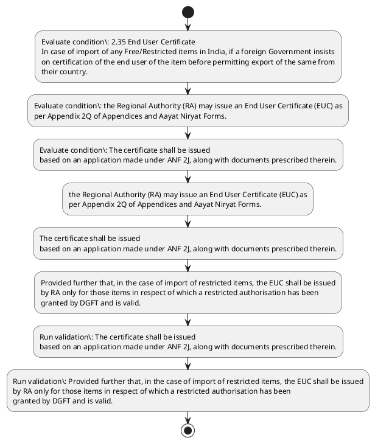

# Chapter 2 / Section 2.35: End User Certificate

**Chapter Title:** General Provisions Regarding Imports and Exports

**Pages:** 13

**Purpose:** The certificate shall be issued
based on an application made under ANF 2J, along with documents prescribed therein.

**Purpose Thanglish:** Indha End User Certificate section-la, The certificate kandippa be issued
based on an application made under ANF 2J, along with documents prescribed therein.

**Summary:** 2.35 End User Certificate
In case of import of any Free/Restricted items in India, if a foreign Government insists
on certification of the end user of the item before permitting export of the same from
their country. the Regional Authority (RA) may issue an End User Certificate (EUC) as
per Appendix 2Q of Appendices and Aayat Niryat Forms. The certificate shall be issued
based on an application made under ANF 2J, along with documents prescribed therein.

**Business Meaning:** End User Certificate governs how DGFT business controls should be applied, validated, and enforced.

**Business Explanation:** End User Certificate explains the operating rule set that DEKAI should enforce. Key control points include The certificate shall be issued
based on an application made under ANF 2J, along with documents prescribed therein. The section also drives actions such as the Regional Authority (RA) may issue an End User Certificate (EUC) as
per Appendix 2Q of Appendices and Aayat Niryat Forms..

**Business Explanation Thanglish:** Indha End User Certificate section-la, End User Certificate explains the operating rule set that DEKAI should enforce. Key control points include The certificate kandippa be issued
based on an application made under ANF 2J, along with documents prescribed therein. The section also drives actions such as the Regional authority (RA) may issue an End User Certificate (EUC) as
per Appendix 2Q of Appendices and Aayat Niryat Forms..

## Business Logic
- The certificate shall be issued
based on an application made under ANF 2J, along with documents prescribed therein.
- Provided further that, in the case of import of restricted items, the EUC shall be issued
by RA only for those items in respect of which a restricted authorisation has been
granted by DGFT and is valid.
- The quantity and value in the EUC should be limited to
the quantity and value specified in the said restricted authorisation.

## Business Rules
- rule_id=CH2-SEC2_35-R001, rule_description=The certificate shall be issued
based on an application made under ANF 2J, along with documents prescribed therein., trigger=End User Certificate, condition=2.35 End User Certificate
In case of import of any Free/Restricted items in India, if a foreign Government insists
on certification of the end user of the item before permitting export of the same from
their country., validation=The certificate shall be issued
based on an application made under ANF 2J, along with documents prescribed therein., action=the Regional Authority (RA) may issue an End User Certificate (EUC) as
per Appendix 2Q of Appendices and Aayat Niryat Forms., exception=No explicit exception found in uploaded documents., output=DEKAI should produce a compliance decision for 2.35 - End User Certificate.
- rule_id=CH2-SEC2_35-R002, rule_description=Provided further that, in the case of import of restricted items, the EUC shall be issued
by RA only for those items in respect of which a restricted authorisation has been
granted by DGFT and is valid., trigger=End User Certificate, condition=the Regional Authority (RA) may issue an End User Certificate (EUC) as
per Appendix 2Q of Appendices and Aayat Niryat Forms., validation=Provided further that, in the case of import of restricted items, the EUC shall be issued
by RA only for those items in respect of which a restricted authorisation has been
granted by DGFT and is valid., action=The certificate shall be issued
based on an application made under ANF 2J, along with documents prescribed therein., exception=No explicit exception found in uploaded documents., output=DEKAI should produce a compliance decision for 2.35 - End User Certificate.
- rule_id=CH2-SEC2_35-R003, rule_description=The quantity and value in the EUC should be limited to
the quantity and value specified in the said restricted authorisation., trigger=End User Certificate, condition=The certificate shall be issued
based on an application made under ANF 2J, along with documents prescribed therein., validation=Provided further that, in the case of import of restricted items, the EUC shall be issued
by RA only for those items in respect of which a restricted authorisation has been
granted by DGFT and is valid., action=Provided further that, in the case of import of restricted items, the EUC shall be issued
by RA only for those items in respect of which a restricted authorisation has been
granted by DGFT and is valid., exception=No explicit exception found in uploaded documents., output=DEKAI should produce a compliance decision for 2.35 - End User Certificate.

## Conditions
- 2.35 End User Certificate
In case of import of any Free/Restricted items in India, if a foreign Government insists
on certification of the end user of the item before permitting export of the same from
their country.
- the Regional Authority (RA) may issue an End User Certificate (EUC) as
per Appendix 2Q of Appendices and Aayat Niryat Forms.
- The certificate shall be issued
based on an application made under ANF 2J, along with documents prescribed therein.
- The quantity and value in the EUC should be limited to
the quantity and value specified in the said restricted authorisation.

## Condition Logic
- id=2.2.35.1, if=2.35 End User Certificate
In case of import of any Free/Restricted items in India, if a foreign Government insists
on certification of the end user of the item before permitting export of the same from
their country., then=the Regional Authority (RA) may issue an End User Certificate (EUC) as
per Appendix 2Q of Appendices and Aayat Niryat Forms., source=2.35 End User Certificate
In case of import of any Free/Restricted items in India, if a foreign Government insists
on certification of the end user of the item before permitting export of the same from
their country.
- id=2.2.35.2, if=the Regional Authority (RA) may issue an End User Certificate (EUC) as
per Appendix 2Q of Appendices and Aayat Niryat Forms., then=the Regional Authority (RA) may issue an End User Certificate (EUC) as
per Appendix 2Q of Appendices and Aayat Niryat Forms., source=the Regional Authority (RA) may issue an End User Certificate (EUC) as
per Appendix 2Q of Appendices and Aayat Niryat Forms.
- id=2.2.35.3, if=The certificate shall be issued
based on an application made under ANF 2J, along with documents prescribed therein., then=the Regional Authority (RA) may issue an End User Certificate (EUC) as
per Appendix 2Q of Appendices and Aayat Niryat Forms., source=The certificate shall be issued
based on an application made under ANF 2J, along with documents prescribed therein.
- id=2.2.35.4, if=The quantity and value in the EUC should be limited to
the quantity and value specified in the said restricted authorisation., then=the Regional Authority (RA) may issue an End User Certificate (EUC) as
per Appendix 2Q of Appendices and Aayat Niryat Forms., source=The quantity and value in the EUC should be limited to
the quantity and value specified in the said restricted authorisation.

## Validations
- The certificate shall be issued
based on an application made under ANF 2J, along with documents prescribed therein.
- Provided further that, in the case of import of restricted items, the EUC shall be issued
by RA only for those items in respect of which a restricted authorisation has been
granted by DGFT and is valid.

## Exceptions
- None identified

## Dependencies
- None identified

## Authorities
- RA
- Regional Authority
- Regional Authority (RA
- DGFT

## Required Documents
- End User Certificate
- Regional Authority (RA) may issue an End User Certificate
- The certificate shall be issued
based on an application made under ANF 2J, along with documents prescribed therein.

## Timelines
- 2.35 End User Certificate
In case of import of any Free/Restricted items in India, if a foreign Government insists
on certification of the end user of the item before permitting export of the same from
their country.

## Actions
- the Regional Authority (RA) may issue an End User Certificate (EUC) as
per Appendix 2Q of Appendices and Aayat Niryat Forms.
- The certificate shall be issued
based on an application made under ANF 2J, along with documents prescribed therein.
- Provided further that, in the case of import of restricted items, the EUC shall be issued
by RA only for those items in respect of which a restricted authorisation has been
granted by DGFT and is valid.

## Workflow
- Evaluate condition: 2.35 End User Certificate
In case of import of any Free/Restricted items in India, if a foreign Government insists
on certification of the end user of the item before permitting export of the same from
their country.
- Evaluate condition: the Regional Authority (RA) may issue an End User Certificate (EUC) as
per Appendix 2Q of Appendices and Aayat Niryat Forms.
- Evaluate condition: The certificate shall be issued
based on an application made under ANF 2J, along with documents prescribed therein.
- the Regional Authority (RA) may issue an End User Certificate (EUC) as
per Appendix 2Q of Appendices and Aayat Niryat Forms.
- The certificate shall be issued
based on an application made under ANF 2J, along with documents prescribed therein.
- Provided further that, in the case of import of restricted items, the EUC shall be issued
by RA only for those items in respect of which a restricted authorisation has been
granted by DGFT and is valid.
- Run validation: The certificate shall be issued
based on an application made under ANF 2J, along with documents prescribed therein.
- Run validation: Provided further that, in the case of import of restricted items, the EUC shall be issued
by RA only for those items in respect of which a restricted authorisation has been
granted by DGFT and is valid.

## Workflow ASCII
```text
End User Certificate
Evaluate condition: 2.35 End User Certificate
In case of import of any Free/Restricted items in India, if a foreign Government insists
on certification of the end user of the item before permitting export of the same from
their country.
   |
   v
Evaluate condition: the Regional Authority (RA) may issue an End User Certificate (EUC) as
per Appendix 2Q of Appendices and Aayat Niryat Forms.
   |
   v
Evaluate condition: The certificate shall be issued
based on an application made under ANF 2J, along with documents prescribed therein.
   |
   v
the Regional Authority (RA) may issue an End User Certificate (EUC) as
per Appendix 2Q of Appendices and Aayat Niryat Forms.
   |
   v
The certificate shall be issued
based on an application made under ANF 2J, along with documents prescribed therein.
   |
   v
Provided further that, in the case of import of restricted items, the EUC shall be issued
by RA only for those items in respect of which a restricted authorisation has been
granted by DGFT and is valid.
   |
   v
Run validation: The certificate shall be issued
based on an application made under ANF 2J, along with documents prescribed therein.
   |
   v
Run validation: Provided further that, in the case of import of restricted items, the EUC shall be issued
by RA only for those items in respect of which a restricted authorisation has been
granted by DGFT and is valid.
```

## Decision Tree
- IF 2.35 End User Certificate
In case of import of any Free/Restricted items in India, if a foreign Government insists
on certification of the end user of the item before permitting export of the same from
their country. THEN the Regional Authority (RA) may issue an End User Certificate (EUC) as
per Appendix 2Q of Appendices and Aayat Niryat Forms.
- IF the Regional Authority (RA) may issue an End User Certificate (EUC) as
per Appendix 2Q of Appendices and Aayat Niryat Forms. THEN the Regional Authority (RA) may issue an End User Certificate (EUC) as
per Appendix 2Q of Appendices and Aayat Niryat Forms.
- IF The certificate shall be issued
based on an application made under ANF 2J, along with documents prescribed therein. THEN the Regional Authority (RA) may issue an End User Certificate (EUC) as
per Appendix 2Q of Appendices and Aayat Niryat Forms.
- IF The quantity and value in the EUC should be limited to
the quantity and value specified in the said restricted authorisation. THEN the Regional Authority (RA) may issue an End User Certificate (EUC) as
per Appendix 2Q of Appendices and Aayat Niryat Forms.

## Decision Tree ASCII
```text
End User Certificate Decision
IF 2.35 End User Certificate
In case of import of any Free/Restricted items in India, if a foreign Government insists
on certification of the end user of the item before permitting export of the same from
their country. THEN the Regional Authority (RA) may issue an End User Certificate (EUC) as
per Appendix 2Q of Appendices and Aayat Niryat Forms.
   |
   v
IF the Regional Authority (RA) may issue an End User Certificate (EUC) as
per Appendix 2Q of Appendices and Aayat Niryat Forms. THEN the Regional Authority (RA) may issue an End User Certificate (EUC) as
per Appendix 2Q of Appendices and Aayat Niryat Forms.
   |
   v
IF The certificate shall be issued
based on an application made under ANF 2J, along with documents prescribed therein. THEN the Regional Authority (RA) may issue an End User Certificate (EUC) as
per Appendix 2Q of Appendices and Aayat Niryat Forms.
   |
   v
IF The quantity and value in the EUC should be limited to
the quantity and value specified in the said restricted authorisation. THEN the Regional Authority (RA) may issue an End User Certificate (EUC) as
per Appendix 2Q of Appendices and Aayat Niryat Forms.
```

## Examples
- User asks to process End User Certificate; the platform checks conditions, validations, and documents before action.

**Real-world Example:** Example: an importer or exporter invokes End User Certificate, submits End User Certificate, Regional Authority (RA) may issue an End User Certificate, The certificate shall be issued
based on an application made under ANF 2J, along with documents prescribed therein., and DEKAI uses the extracted rules to the regional authority (ra) may issue an end user certificate (euc) as
per appendix 2q of appendices and aayat niryat forms..

**Real-world Example Thanglish:** Indha End User Certificate section-la, Example: an importer or exporter invokes End User Certificate, submits End User Certificate, Regional authority (RA) may issue an End User Certificate, The certificate kandippa be issued
based on an application made under ANF 2J, along with documents prescribed therein., and DEKAI uses the extracted rules to the regional authority (ra) may issue an end user certificate (euc) as
per appendix 2q of appendices and aayat niryat forms..

## AI Rules
- IF detected context matches section rule THEN enforce: The certificate shall be issued
based on an application made under ANF 2J, along with documents prescribed therein.
- IF detected context matches section rule THEN enforce: Provided further that, in the case of import of restricted items, the EUC shall be issued
by RA only for those items in respect of which a restricted authorisation has been
granted by DGFT and is valid.
- IF detected context matches section rule THEN enforce: The quantity and value in the EUC should be limited to
the quantity and value specified in the said restricted authorisation.
- IF validations pass THEN recommend action: the Regional Authority (RA) may issue an End User Certificate (EUC) as
per Appendix 2Q of Appendices and Aayat Niryat Forms.

## Database Fields
- name=section_code, type=string, required=True, source=parsed_section_heading
- name=section_title, type=string, required=True, source=parsed_section_heading
- name=end_flag, type=boolean, required=False, source=keyword:End
- name=any_flag, type=boolean, required=False, source=keyword:any
- name=the_flag, type=boolean, required=False, source=keyword:the
- name=may_flag, type=boolean, required=False, source=keyword:may
- name=euc_flag, type=boolean, required=False, source=keyword:EUC
- name=per_flag, type=boolean, required=False, source=keyword:per
- name=and_flag, type=boolean, required=False, source=keyword:and
- name=anf_flag, type=boolean, required=False, source=keyword:ANF
- name=document_1_submitted, type=boolean, required=True, source=End User Certificate
- name=document_2_submitted, type=boolean, required=True, source=Regional Authority (RA) may issue an End User Certificate
- name=document_3_submitted, type=boolean, required=True, source=The certificate shall be issued
based on an application made under ANF 2J, along with documents prescribed therein.

## API Requirements
- method=GET, path=/api/dgft/sections/2.35, purpose=Retrieve knowledge payload for section 2.35, query_params=['include=workflow,decision_tree,validations'], response_fields=['section', 'title', 'summary', 'conditions', 'validations', 'exceptions', 'workflow', 'decision_tree']
- method=POST, path=/api/dgft/End-User-Certificate/validate, purpose=Validate inputs and documents for End User Certificate, request_fields=['section_code', 'section_title', 'document_1_submitted', 'document_2_submitted', 'document_3_submitted'], response_fields=['status', 'errors', 'warnings', 'next_actions']
- method=POST, path=/api/dgft/End-User-Certificate/execute, purpose=Trigger business action for the Regional Authority (RA) may issue an End User Certificate (EUC) as
per Appendix 2Q of Appendices and Aayat Niryat Forms., request_fields=['section_code', 'section_title', 'document_1_submitted', 'document_2_submitted', 'document_3_submitted'], response_fields=['reference_id', 'status', 'authority', 'timeline']

## UI Screens
- screen_id=End_User_Certificate_overview, name=End User Certificate Overview, purpose=Show section summary, authority, timeline, and eligibility cues., widgets=['summary_card', 'conditions_table', 'authority_badges', 'timeline_panel']
- screen_id=End_User_Certificate_submission, name=End User Certificate Submission, purpose=Capture applicant data and supporting documents., widgets=['dynamic_form', 'document_uploader', 'validation_panel', 'next_action_footer'], fields=['section_code', 'section_title', 'end_flag', 'any_flag', 'the_flag', 'may_flag', 'euc_flag', 'per_flag']

## Error Messages
- Validation failed because the section requirements were not fully met.

## FAQ
- question_en=What is the purpose of section 2.35?, answer_en=End User Certificate explains the operating rule set that DEKAI should enforce. Key control points include The certificate shall be issued
based on an application made under ANF 2J, along with documents prescribed therein. The section also drives actions such as the Regional Authority (RA) may issue an End User Certificate (EUC) as
per Appendix 2Q of Appendices and Aayat Niryat Forms.., question_thanglish=Indha End User Certificate section-la, What is the purpose of section 2.35?, answer_thanglish=Indha End User Certificate section-la, End User Certificate explains the operating rule set that DEKAI should enforce. Key control points include The certificate kandippa be issued
based on an application made under ANF 2J, along with documents prescribed therein. The section also drives actions such as the Regional authority (RA) may issue an End User Certificate (EUC) as
per Appendix 2Q of Appendices and Aayat Niryat Forms..
- question_en=What documents are required under End User Certificate?, answer_en=End User Certificate, Regional Authority (RA) may issue an End User Certificate, The certificate shall be issued
based on an application made under ANF 2J, along with documents prescribed therein., question_thanglish=Indha End User Certificate section-la, What documents are required under End User Certificate?, answer_thanglish=Indha End User Certificate section-la, End User Certificate, Regional authority (RA) may issue an End User Certificate, The certificate kandippa be issued
based on an application made under ANF 2J, along with documents prescribed therein.
- question_en=Which authority handles End User Certificate?, answer_en=RA, Regional Authority, Regional Authority (RA, DGFT, question_thanglish=Indha End User Certificate section-la, Which authority handles End User Certificate?, answer_thanglish=Indha End User Certificate section-la, RA, Regional authority, Regional authority (RA, DGFT

## Questions Users May Ask
- What does End User Certificate require?
- Which documents are needed for End User Certificate?
- How does DEKAI validate End User Certificate requests?
- What action should be taken for End User Certificate?

## Expected AI Answers
- End User Certificate requires the platform to interpret the section text, apply the extracted business rules, and present the correct next action.
- Required documents are inferred from the section text: End User Certificate, Regional Authority (RA) may issue an End User Certificate, The certificate shall be issued
based on an application made under ANF 2J, along with documents prescribed therein.
- DEKAI validates End User Certificate by checking conditions, required documents, authority references, and exception clauses before recommending an outcome.
- The primary extracted action is: the Regional Authority (RA) may issue an End User Certificate (EUC) as
per Appendix 2Q of Appendices and Aayat Niryat Forms.

## AI Q&A Examples
- question_en=User asks: How do I comply with End User Certificate?, answer_en=AI answers: DEKAI should evaluate section 2.35, apply the extracted rules, and guide the user through Evaluate condition: 2.35 End User Certificate
In case of import of any Free/Restricted items in India, if a foreign Government insists
on certification of the end user of the item before permitting export of the same from
their country.., question_thanglish=Indha End User Certificate section-la, User asks: How do I comply with End User Certificate?, answer_thanglish=Indha End User Certificate section-la, AI answers: DEKAI should evaluate section 2.35, apply the extracted rules, and guide the user through Evaluate condition: 2.35 End User Certificate
In case of import of any Free/Restricted items in India, if a foreign Government insists
on certification of the end user of the item before permitting export of the same from
their country..
- question_en=User asks: Which validations apply to End User Certificate?, answer_en=AI answers: Applicable validations are The certificate shall be issued
based on an application made under ANF 2J, along with documents prescribed therein., Provided further that, in the case of import of restricted items, the EUC shall be issued
by RA only for those items in respect of which a restricted authorisation has been
granted by DGFT and is valid., question_thanglish=Indha End User Certificate section-la, User asks: Which validations apply to End User Certificate?, answer_thanglish=Indha End User Certificate section-la, AI answers: Applicable validations are The certificate kandippa be issued
based on an application made under ANF 2J, along with documents prescribed therein., Provided further that, in the case of import of restricted items, the EUC kandippa be issued
by RA only for those items in respect of which a restricted authorisation has been
granted by DGFT and is valid.

## DEKAI AI Implementation Notes
- Capture chapter 2, section 2.35, title, and page references as immutable knowledge metadata.
- Bind validations for End User Certificate into a rule engine keyed by the rule IDs extracted for this section.
- Expose document upload controls for: End User Certificate, Regional Authority (RA) may issue an End User Certificate, The certificate shall be issued
based on an application made under ANF 2J, along with documents prescribed therein..
- Route escalations or approvals to: RA, Regional Authority, Regional Authority (RA, DGFT.

## DEKAI AI Implementation Notes Thanglish
- Indha End User Certificate section-la, Capture chapter 2, section 2.35, title, and page references as immutable knowledge metadata.
- Indha End User Certificate section-la, Bind validations for End User Certificate into a rule engine keyed by the rule IDs extracted for this section.
- Indha End User Certificate section-la, Expose document upload controls for: End User Certificate, Regional authority (RA) may issue an End User Certificate, The certificate kandippa be issued
based on an application made under ANF 2J, along with documents prescribed therein..
- Indha End User Certificate section-la, Route escalations or approvals to: RA, Regional authority, Regional authority (RA, DGFT.

## AI Metadata
- Keywords: End, any, the, may, EUC, per, and, ANF, for, has, User, case, item, same, from, made, with, that, only, been
- Search Keywords: End, any, the, may, EUC, per, and, ANF, for, has, User, case, item, same, from, made, with, that, only, been
- Intent: Support End User Certificate processing and compliance validation.
- Tags: 2.35, End User Certificate, business-rule, document-driven, dgft
- Related Sections: 
- Related Chapters: 
- Related Rules: The certificate shall be issued
based on an application made under ANF 2J, along with documents prescribed therein., Provided further that, in the case of import of restricted items, the EUC shall be issued
by RA only for those items in respect of which a restricted authorisation has been
granted by DGFT and is valid., The quantity and value in the EUC should be limited to
the quantity and value specified in the said restricted authorisation.

## Mermaid

```mermaid
flowchart TD
    S1["Evaluate condition: 2.35 End User Certificate
In case of import of any Free/Restricted items in India, if a foreign Government insists
on certification of the end user of the item before permitting export of the same from
their country."]
    S2["Evaluate condition: the Regional Authority (RA) may issue an End User Certificate (EUC) as
per Appendix 2Q of Appendices and Aayat Niryat Forms."]
    S1 --> S2
    S3["Evaluate condition: The certificate shall be issued
based on an application made under ANF 2J, along with documents prescribed therein."]
    S2 --> S3
    S4["the Regional Authority (RA) may issue an End User Certificate (EUC) as
per Appendix 2Q of Appendices and Aayat Niryat Forms."]
    S3 --> S4
    S5["The certificate shall be issued
based on an application made under ANF 2J, along with documents prescribed therein."]
    S4 --> S5
    S6["Provided further that, in the case of import of restricted items, the EUC shall be issued
by RA only for those items in respect of which a restricted authorisation has been
granted by DGFT and is valid."]
    S5 --> S6
    S7["Run validation: The certificate shall be issued
based on an application made under ANF 2J, along with documents prescribed therein."]
    S6 --> S7
    S8["Run validation: Provided further that, in the case of import of restricted items, the EUC shall be issued
by RA only for those items in respect of which a restricted authorisation has been
granted by DGFT and is valid."]
    S7 --> S8
```


## PlantUML

