# Chapter 2 / Section 2.36: Imports under Indo-US Memorandum of Understanding

**Chapter Title:** General Provisions Regarding Imports and Exports

**Pages:** 13, 14

**Purpose:** 2.36 Imports under Indo-US Memorandum of Understanding
(a) Import of specified capital goods, raw materials and components, from United
States of America (USA) is subject to US Export Control Regulations.

**Purpose Thanglish:** Indha Imports under Indo-US Memorandum of Understanding section-la, 2.36 Imports under Indo-US Memorandum of Understanding
(a) import of specified capital goods, raw materials and components, from United
States of America (USA) is subject to US export Control Regulations.

**Summary:** 2.36 Imports under Indo-US Memorandum of Understanding
(a) Import of specified capital goods, raw materials and components, from United
States of America (USA) is subject to US Export Control Regulations. US
suppliers of such items are required to obtain an export authorisation based on
import certificate issued in India. The following are designated Import
Certificate Issuing Authorities (ICIA):
(i) Department of Electronics (Do E), for computer and computer-based
systems
(ii) Department for Promotion of Industry and Internal Trade (DPIIT),
Technical Support Wing (TSW), for organised sector units registered
under it, except for computers and computer-based systems;
(iii) Ministry of Defence (Mo D), for defence related items;
(iv) DGFT for small scale industries and entities not covered above as well as
on behalf of any of the above;
pg.

**Business Meaning:** Imports under Indo-US Memorandum of Understanding governs how DGFT business controls should be applied, validated, and enforced.

**Business Explanation:** Imports under Indo-US Memorandum of Understanding explains the operating rule set that DEKAI should enforce. Key control points include 2.36 Imports under Indo-US Memorandum of Understanding
(a) Import of specified capital goods, raw materials and components, from United
States of America (USA) is subject to US Export Control Regulations. The section also drives actions such as US
suppliers of such items are required to obtain an export authorisation based on
import certificate issued in India..

**Business Explanation Thanglish:** Indha Imports under Indo-US Memorandum of Understanding section-la, Imports under Indo-US Memorandum of Understanding explains the operating rule set that DEKAI should enforce. Key control points include 2.36 Imports under Indo-US Memorandum of Understanding
(a) import of specified capital goods, raw materials and components, from United
States of America (USA) is subject to US export Control Regulations. The section also drives actions such as US
suppliers of such items are required to obtain an export authorisation based on
import certificate issued in India..

## Business Logic
- 2.36 Imports under Indo-US Memorandum of Understanding
(a) Import of specified capital goods, raw materials and components, from United
States of America (USA) is subject to US Export Control Regulations.
- US
suppliers of such items are required to obtain an export authorisation based on
import certificate issued in India.
- RA shall issue Free Sale and Commerce Certificate as per
Annexure B of ANF 2H.
- Validity of such certificate shall be two years from date of issue unless
otherwise specified.
- RA shall issue Free Sale and
Commerce Certificate as per Annexure B of ANF 2H.
- 2.36 Imports under Indo-US Memorandum of Understanding
(a)
Import of specified capital goods, raw materials and components, from United
States of America (USA) is subject to US Export Control Regulations.
- (b) Application for an import certificate shall be made in ANF 2K(i).
- (d) India’s import and export with regard to USA’s unilateral export control items
[Crime Control (CC) Items as listed in Appendix 2P(ii)(a) and Regional Security
(RS) items as listed in Appendix 2P(ii)(b)] will be governed by the following
regulations:
Items listed at both Appendix 2P (ii)(a) and Appendix 2P(ii)(b) will be allowed
by DGFT for import from USA provided the importer submits the following
documents in ANF 2K(i):
(i) documentary proof of Bill of Lading indicating Port of USA,
(ii) legal undertaking that goods shall not be exported/ alienated; and
(iii) Import is with Actual User condition.
- (f) Import /export of such items shall be allowed only through EDI enabled ports
of India.

## Business Rules
- rule_id=CH2-SEC2_36-R001, rule_description=2.36 Imports under Indo-US Memorandum of Understanding
(a) Import of specified capital goods, raw materials and components, from United
States of America (USA) is subject to US Export Control Regulations., trigger=Imports under Indo-US Memorandum of Understanding, condition=2.36 Imports under Indo-US Memorandum of Understanding
(a) Import of specified capital goods, raw materials and components, from United
States of America (USA) is subject to US Export Control Regulations., validation=US
suppliers of such items are required to obtain an export authorisation based on
import certificate issued in India., action=US
suppliers of such items are required to obtain an export authorisation based on
import certificate issued in India., exception=The following are designated Import
Certificate Issuing Authorities (ICIA):
(i) Department of Electronics (Do E), for computer and computer-based
systems
(ii) Department for Promotion of Industry and Internal Trade (DPIIT),
Technical Support Wing (TSW), for organised sector units registered
under it, except for computers and computer-based systems;
(iii) Ministry of Defence (Mo D), for defence related items;
(iv) DGFT for small scale industries and entities not covered above as well as
on behalf of any of the above;
pg., output=DEKAI should produce a compliance decision for 2.36 - Imports under Indo-US Memorandum of Understanding.
- rule_id=CH2-SEC2_36-R002, rule_description=US
suppliers of such items are required to obtain an export authorisation based on
import certificate issued in India., trigger=Imports under Indo-US Memorandum of Understanding, condition=US
suppliers of such items are required to obtain an export authorisation based on
import certificate issued in India., validation=RA shall issue Free Sale and Commerce Certificate as per
Annexure B of ANF 2H., action=The following are designated Import
Certificate Issuing Authorities (ICIA):
(i) Department of Electronics (Do E), for computer and computer-based
systems
(ii) Department for Promotion of Industry and Internal Trade (DPIIT),
Technical Support Wing (TSW), for organised sector units registered
under it, except for computers and computer-based systems;
(iii) Ministry of Defence (Mo D), for defence related items;
(iv) DGFT for small scale industries and entities not covered above as well as
on behalf of any of the above;
pg., exception=Validity of such certificate shall be two years from date of issue unless
otherwise specified., output=DEKAI should produce a compliance decision for 2.36 - Imports under Indo-US Memorandum of Understanding.
- rule_id=CH2-SEC2_36-R003, rule_description=RA shall issue Free Sale and Commerce Certificate as per
Annexure B of ANF 2H., trigger=Imports under Indo-US Memorandum of Understanding, condition=The following are designated Import
Certificate Issuing Authorities (ICIA):
(i) Department of Electronics (Do E), for computer and computer-based
systems
(ii) Department for Promotion of Industry and Internal Trade (DPIIT),
Technical Support Wing (TSW), for organised sector units registered
under it, except for computers and computer-based systems;
(iii) Ministry of Defence (Mo D), for defence related items;
(iv) DGFT for small scale industries and entities not covered above as well as
on behalf of any of the above;
pg., validation=Validity of such certificate shall be two years from date of issue unless
otherwise specified., action=RA shall issue Free Sale and Commerce Certificate as per
Annexure B of ANF 2H., exception=The following are designated Import
Certificate Issuing Authorities (ICIA):
(i)
Department of Electronics (Do E), for computer and computer-based
systems
(ii)
Department for Promotion of Industry and Internal Trade (DPIIT),
Technical Support Wing (TSW), for organised sector units registered
under it, except for computers and computer-based systems;
(iii)
Ministry of Defence (Mo D), for defence related items;
(iv)
DGFT for small scale industries and entities not covered above as well as
on behalf of any of the above;
pg., output=DEKAI should produce a compliance decision for 2.36 - Imports under Indo-US Memorandum of Understanding.
- rule_id=CH2-SEC2_36-R004, rule_description=Validity of such certificate shall be two years from date of issue unless
otherwise specified., trigger=Imports under Indo-US Memorandum of Understanding, condition=22
(iii) An application for grant of Free Sale and Commerce Certificate may be made to
RA concerned as per format in ANF 2H of Appendices and Aayat Niryat Forms with
Annexure A therein., validation=RA shall issue Free Sale and
Commerce Certificate as per Annexure B of ANF 2H., action=(b)
(i) RAs may also issue, on application, Free Sale and Commerce Certificate for
export of any other item which is not restricted or prohibited for export., exception=(c) However, this import certificate will not be regarded as a substitute for an
import authorisation in respect of items mentioned as restricted in ITC (HS)
and an import authorisation will have to be obtained for such items., output=DEKAI should produce a compliance decision for 2.36 - Imports under Indo-US Memorandum of Understanding.
- rule_id=CH2-SEC2_36-R005, rule_description=RA shall issue Free Sale and
Commerce Certificate as per Annexure B of ANF 2H., trigger=Imports under Indo-US Memorandum of Understanding, condition=RA shall issue Free Sale and Commerce Certificate as per
Annexure B of ANF 2H., validation=(b) Application for an import certificate shall be made in ANF 2K(i)., action=Validity of such certificate shall be two years from date of issue unless
otherwise specified., exception=(c) However, this import certificate will not be regarded as a substitute for an
import authorisation in respect of items mentioned as restricted in ITC (HS)
and an import authorisation will have to be obtained for such items., output=DEKAI should produce a compliance decision for 2.36 - Imports under Indo-US Memorandum of Understanding.
- rule_id=CH2-SEC2_36-R006, rule_description=2.36 Imports under Indo-US Memorandum of Understanding
(a)
Import of specified capital goods, raw materials and components, from United
States of America (USA) is subject to US Export Control Regulations., trigger=Imports under Indo-US Memorandum of Understanding, condition=(b)
(i) RAs may also issue, on application, Free Sale and Commerce Certificate for
export of any other item which is not restricted or prohibited for export., validation=(d) India’s import and export with regard to USA’s unilateral export control items
[Crime Control (CC) Items as listed in Appendix 2P(ii)(a) and Regional Security
(RS) items as listed in Appendix 2P(ii)(b)] will be governed by the following
regulations:
Items listed at both Appendix 2P (ii)(a) and Appendix 2P(ii)(b) will be allowed
by DGFT for import from USA provided the importer submits the following
documents in ANF 2K(i):
(i) documentary proof of Bill of Lading indicating Port of USA,
(ii) legal undertaking that goods shall not be exported/ alienated; and
(iii) Import is with Actual User condition., action=RA shall issue Free Sale and
Commerce Certificate as per Annexure B of ANF 2H., exception=(c) However, this import certificate will not be regarded as a substitute for an
import authorisation in respect of items mentioned as restricted in ITC (HS)
and an import authorisation will have to be obtained for such items., output=DEKAI should produce a compliance decision for 2.36 - Imports under Indo-US Memorandum of Understanding.
- rule_id=CH2-SEC2_36-R007, rule_description=(b) Application for an import certificate shall be made in ANF 2K(i)., trigger=Imports under Indo-US Memorandum of Understanding, condition=Validity of such certificate shall be two years from date of issue unless
otherwise specified., validation=(f) Import /export of such items shall be allowed only through EDI enabled ports
of India., action=The following are designated Import
Certificate Issuing Authorities (ICIA):
(i)
Department of Electronics (Do E), for computer and computer-based
systems
(ii)
Department for Promotion of Industry and Internal Trade (DPIIT),
Technical Support Wing (TSW), for organised sector units registered
under it, except for computers and computer-based systems;
(iii)
Ministry of Defence (Mo D), for defence related items;
(iv)
DGFT for small scale industries and entities not covered above as well as
on behalf of any of the above;
pg., exception=(c) However, this import certificate will not be regarded as a substitute for an
import authorisation in respect of items mentioned as restricted in ITC (HS)
and an import authorisation will have to be obtained for such items., output=DEKAI should produce a compliance decision for 2.36 - Imports under Indo-US Memorandum of Understanding.
- rule_id=CH2-SEC2_36-R008, rule_description=(d) India’s import and export with regard to USA’s unilateral export control items
[Crime Control (CC) Items as listed in Appendix 2P(ii)(a) and Regional Security
(RS) items as listed in Appendix 2P(ii)(b)] will be governed by the following
regulations:
Items listed at both Appendix 2P (ii)(a) and Appendix 2P(ii)(b) will be allowed
by DGFT for import from USA provided the importer submits the following
documents in ANF 2K(i):
(i) documentary proof of Bill of Lading indicating Port of USA,
(ii) legal undertaking that goods shall not be exported/ alienated; and
(iii) Import is with Actual User condition., trigger=Imports under Indo-US Memorandum of Understanding, condition=(ii) An application for grant of Free Sale and Commerce Certificate for these
items may be made to RA concerned as per format in ANF 2H of Appendices and
Aayat Niryat Forms along with Annexure A therein., validation=(f) Import /export of such items shall be allowed only through EDI enabled ports
of India., action=Import
certificate in Appendix-2P(I)(a) may be issued by ICIA directly to importer with
a copy to (i) Ministry of External Affairs (MEA) (AMS Section), New Delhi, (ii)
Do E, New Delhi; and (iii) DGFT., exception=(c) However, this import certificate will not be regarded as a substitute for an
import authorisation in respect of items mentioned as restricted in ITC (HS)
and an import authorisation will have to be obtained for such items., output=DEKAI should produce a compliance decision for 2.36 - Imports under Indo-US Memorandum of Understanding.
- rule_id=CH2-SEC2_36-R009, rule_description=(f) Import /export of such items shall be allowed only through EDI enabled ports
of India., trigger=Imports under Indo-US Memorandum of Understanding, condition=RA shall issue Free Sale and
Commerce Certificate as per Annexure B of ANF 2H., validation=(f) Import /export of such items shall be allowed only through EDI enabled ports
of India., action=(c) However, this import certificate will not be regarded as a substitute for an
import authorisation in respect of items mentioned as restricted in ITC (HS)
and an import authorisation will have to be obtained for such items., exception=(c) However, this import certificate will not be regarded as a substitute for an
import authorisation in respect of items mentioned as restricted in ITC (HS)
and an import authorisation will have to be obtained for such items., output=DEKAI should produce a compliance decision for 2.36 - Imports under Indo-US Memorandum of Understanding.

## Conditions
- 2.36 Imports under Indo-US Memorandum of Understanding
(a) Import of specified capital goods, raw materials and components, from United
States of America (USA) is subject to US Export Control Regulations.
- US
suppliers of such items are required to obtain an export authorisation based on
import certificate issued in India.
- The following are designated Import
Certificate Issuing Authorities (ICIA):
(i) Department of Electronics (Do E), for computer and computer-based
systems
(ii) Department for Promotion of Industry and Internal Trade (DPIIT),
Technical Support Wing (TSW), for organised sector units registered
under it, except for computers and computer-based systems;
(iii) Ministry of Defence (Mo D), for defence related items;
(iv) DGFT for small scale industries and entities not covered above as well as
on behalf of any of the above;
pg.
- 22
(iii) An application for grant of Free Sale and Commerce Certificate may be made to
RA concerned as per format in ANF 2H of Appendices and Aayat Niryat Forms with
Annexure A therein.
- RA shall issue Free Sale and Commerce Certificate as per
Annexure B of ANF 2H.
- (b)
(i) RAs may also issue, on application, Free Sale and Commerce Certificate for
export of any other item which is not restricted or prohibited for export.
- Validity of such certificate shall be two years from date of issue unless
otherwise specified.
- (ii) An application for grant of Free Sale and Commerce Certificate for these
items may be made to RA concerned as per format in ANF 2H of Appendices and
Aayat Niryat Forms along with Annexure A therein.
- RA shall issue Free Sale and
Commerce Certificate as per Annexure B of ANF 2H.
- 2.36 Imports under Indo-US Memorandum of Understanding
(a)
Import of specified capital goods, raw materials and components, from United
States of America (USA) is subject to US Export Control Regulations.
- The following are designated Import
Certificate Issuing Authorities (ICIA):
(i)
Department of Electronics (Do E), for computer and computer-based
systems
(ii)
Department for Promotion of Industry and Internal Trade (DPIIT),
Technical Support Wing (TSW), for organised sector units registered
under it, except for computers and computer-based systems;
(iii)
Ministry of Defence (Mo D), for defence related items;
(iv)
DGFT for small scale industries and entities not covered above as well as
on behalf of any of the above;
pg.
- (b) Application for an import certificate shall be made in ANF 2K(i).
- Import
certificate in Appendix-2P(I)(a) may be issued by ICIA directly to importer with
a copy to (i) Ministry of External Affairs (MEA) (AMS Section), New Delhi, (ii)
Do E, New Delhi; and (iii) DGFT.
- (c) However, this import certificate will not be regarded as a substitute for an
import authorisation in respect of items mentioned as restricted in ITC (HS)
and an import authorisation will have to be obtained for such items.
- (e) In case the importer wants to subsequently export the imported items from USA,
or any part thereof, such export will require an authorisation from DGFT as per
ANF 2K(ii) and Export certificate will be issued in the format Appendix- 2P(i)(b).

## Condition Logic
- id=2.2.36.1, if=2.36 Imports under Indo-US Memorandum of Understanding
(a) Import of specified capital goods, raw materials and components, from United
States of America (USA) is subject to US Export Control Regulations., then=US
suppliers of such items are required to obtain an export authorisation based on
import certificate issued in India., source=2.36 Imports under Indo-US Memorandum of Understanding
(a) Import of specified capital goods, raw materials and components, from United
States of America (USA) is subject to US Export Control Regulations.
- id=2.2.36.2, if=US
suppliers of such items are required to obtain an export authorisation based on
import certificate issued in India., then=US
suppliers of such items are required to obtain an export authorisation based on
import certificate issued in India., source=US
suppliers of such items are required to obtain an export authorisation based on
import certificate issued in India.
- id=2.2.36.3, if=The following are designated Import
Certificate Issuing Authorities (ICIA):
(i) Department of Electronics (Do E), for computer and computer-based
systems
(ii) Department for Promotion of Industry and Internal Trade (DPIIT),
Technical Support Wing (TSW), for organised sector units registered
under it, except for computers and computer-based systems;
(iii) Ministry of Defence (Mo D), for defence related items;
(iv) DGFT for small scale industries and entities not covered above as well as
on behalf of any of the above;
pg., then=US
suppliers of such items are required to obtain an export authorisation based on
import certificate issued in India., source=The following are designated Import
Certificate Issuing Authorities (ICIA):
(i) Department of Electronics (Do E), for computer and computer-based
systems
(ii) Department for Promotion of Industry and Internal Trade (DPIIT),
Technical Support Wing (TSW), for organised sector units registered
under it, except for computers and computer-based systems;
(iii) Ministry of Defence (Mo D), for defence related items;
(iv) DGFT for small scale industries and entities not covered above as well as
on behalf of any of the above;
pg.
- id=2.2.36.4, if=22
(iii) An application for grant of Free Sale and Commerce Certificate may be made to
RA concerned as per format in ANF 2H of Appendices and Aayat Niryat Forms with
Annexure A therein., then=US
suppliers of such items are required to obtain an export authorisation based on
import certificate issued in India., source=22
(iii) An application for grant of Free Sale and Commerce Certificate may be made to
RA concerned as per format in ANF 2H of Appendices and Aayat Niryat Forms with
Annexure A therein.
- id=2.2.36.5, if=RA shall issue Free Sale and Commerce Certificate as per
Annexure B of ANF 2H., then=US
suppliers of such items are required to obtain an export authorisation based on
import certificate issued in India., source=RA shall issue Free Sale and Commerce Certificate as per
Annexure B of ANF 2H.
- id=2.2.36.6, if=(b)
(i) RAs may also issue, on application, Free Sale and Commerce Certificate for
export of any other item which is not restricted or prohibited for export., then=US
suppliers of such items are required to obtain an export authorisation based on
import certificate issued in India., source=(b)
(i) RAs may also issue, on application, Free Sale and Commerce Certificate for
export of any other item which is not restricted or prohibited for export.
- id=2.2.36.7, if=Validity of such certificate shall be two years from date of issue unless
otherwise specified., then=US
suppliers of such items are required to obtain an export authorisation based on
import certificate issued in India., source=Validity of such certificate shall be two years from date of issue unless
otherwise specified.
- id=2.2.36.8, if=(ii) An application for grant of Free Sale and Commerce Certificate for these
items may be made to RA concerned as per format in ANF 2H of Appendices and
Aayat Niryat Forms along with Annexure A therein., then=US
suppliers of such items are required to obtain an export authorisation based on
import certificate issued in India., source=(ii) An application for grant of Free Sale and Commerce Certificate for these
items may be made to RA concerned as per format in ANF 2H of Appendices and
Aayat Niryat Forms along with Annexure A therein.
- id=2.2.36.9, if=RA shall issue Free Sale and
Commerce Certificate as per Annexure B of ANF 2H., then=US
suppliers of such items are required to obtain an export authorisation based on
import certificate issued in India., source=RA shall issue Free Sale and
Commerce Certificate as per Annexure B of ANF 2H.
- id=2.2.36.10, if=2.36 Imports under Indo-US Memorandum of Understanding
(a)
Import of specified capital goods, raw materials and components, from United
States of America (USA) is subject to US Export Control Regulations., then=US
suppliers of such items are required to obtain an export authorisation based on
import certificate issued in India., source=2.36 Imports under Indo-US Memorandum of Understanding
(a)
Import of specified capital goods, raw materials and components, from United
States of America (USA) is subject to US Export Control Regulations.
- id=2.2.36.11, if=The following are designated Import
Certificate Issuing Authorities (ICIA):
(i)
Department of Electronics (Do E), for computer and computer-based
systems
(ii)
Department for Promotion of Industry and Internal Trade (DPIIT),
Technical Support Wing (TSW), for organised sector units registered
under it, except for computers and computer-based systems;
(iii)
Ministry of Defence (Mo D), for defence related items;
(iv)
DGFT for small scale industries and entities not covered above as well as
on behalf of any of the above;
pg., then=US
suppliers of such items are required to obtain an export authorisation based on
import certificate issued in India., source=The following are designated Import
Certificate Issuing Authorities (ICIA):
(i)
Department of Electronics (Do E), for computer and computer-based
systems
(ii)
Department for Promotion of Industry and Internal Trade (DPIIT),
Technical Support Wing (TSW), for organised sector units registered
under it, except for computers and computer-based systems;
(iii)
Ministry of Defence (Mo D), for defence related items;
(iv)
DGFT for small scale industries and entities not covered above as well as
on behalf of any of the above;
pg.
- id=2.2.36.12, if=(b) Application for an import certificate shall be made in ANF 2K(i)., then=US
suppliers of such items are required to obtain an export authorisation based on
import certificate issued in India., source=(b) Application for an import certificate shall be made in ANF 2K(i).
- id=2.2.36.13, if=Import
certificate in Appendix-2P(I)(a) may be issued by ICIA directly to importer with
a copy to (i) Ministry of External Affairs (MEA) (AMS Section), New Delhi, (ii)
Do E, New Delhi; and (iii) DGFT., then=US
suppliers of such items are required to obtain an export authorisation based on
import certificate issued in India., source=Import
certificate in Appendix-2P(I)(a) may be issued by ICIA directly to importer with
a copy to (i) Ministry of External Affairs (MEA) (AMS Section), New Delhi, (ii)
Do E, New Delhi; and (iii) DGFT.
- id=2.2.36.14, if=(c) However, this import certificate will not be regarded as a substitute for an
import authorisation in respect of items mentioned as restricted in ITC (HS)
and an import authorisation will have to be obtained for such items., then=US
suppliers of such items are required to obtain an export authorisation based on
import certificate issued in India., source=(c) However, this import certificate will not be regarded as a substitute for an
import authorisation in respect of items mentioned as restricted in ITC (HS)
and an import authorisation will have to be obtained for such items.
- id=2.2.36.15, if=(e) In case the importer wants to subsequently export the imported items from USA,
or any part thereof, such export will require an authorisation from DGFT as per
ANF 2K(ii) and Export certificate will be issued in the format Appendix- 2P(i)(b)., then=US
suppliers of such items are required to obtain an export authorisation based on
import certificate issued in India., source=(e) In case the importer wants to subsequently export the imported items from USA,
or any part thereof, such export will require an authorisation from DGFT as per
ANF 2K(ii) and Export certificate will be issued in the format Appendix- 2P(i)(b).

## Validations
- US
suppliers of such items are required to obtain an export authorisation based on
import certificate issued in India.
- RA shall issue Free Sale and Commerce Certificate as per
Annexure B of ANF 2H.
- Validity of such certificate shall be two years from date of issue unless
otherwise specified.
- RA shall issue Free Sale and
Commerce Certificate as per Annexure B of ANF 2H.
- (b) Application for an import certificate shall be made in ANF 2K(i).
- (d) India’s import and export with regard to USA’s unilateral export control items
[Crime Control (CC) Items as listed in Appendix 2P(ii)(a) and Regional Security
(RS) items as listed in Appendix 2P(ii)(b)] will be governed by the following
regulations:
Items listed at both Appendix 2P (ii)(a) and Appendix 2P(ii)(b) will be allowed
by DGFT for import from USA provided the importer submits the following
documents in ANF 2K(i):
(i) documentary proof of Bill of Lading indicating Port of USA,
(ii) legal undertaking that goods shall not be exported/ alienated; and
(iii) Import is with Actual User condition.
- (f) Import /export of such items shall be allowed only through EDI enabled ports
of India.

## Exceptions
- The following are designated Import
Certificate Issuing Authorities (ICIA):
(i) Department of Electronics (Do E), for computer and computer-based
systems
(ii) Department for Promotion of Industry and Internal Trade (DPIIT),
Technical Support Wing (TSW), for organised sector units registered
under it, except for computers and computer-based systems;
(iii) Ministry of Defence (Mo D), for defence related items;
(iv) DGFT for small scale industries and entities not covered above as well as
on behalf of any of the above;
pg.
- Validity of such certificate shall be two years from date of issue unless
otherwise specified.
- The following are designated Import
Certificate Issuing Authorities (ICIA):
(i)
Department of Electronics (Do E), for computer and computer-based
systems
(ii)
Department for Promotion of Industry and Internal Trade (DPIIT),
Technical Support Wing (TSW), for organised sector units registered
under it, except for computers and computer-based systems;
(iii)
Ministry of Defence (Mo D), for defence related items;
(iv)
DGFT for small scale industries and entities not covered above as well as
on behalf of any of the above;
pg.
- (c) However, this import certificate will not be regarded as a substitute for an
import authorisation in respect of items mentioned as restricted in ITC (HS)
and an import authorisation will have to be obtained for such items.

## Dependencies
- None identified

## Authorities
- DGFT
- Certificate Issuing Authorities
- RA

## Required Documents
- US
suppliers of such items are required to obtain an export authorisation based on
import certificate issued in India.
- The following are designated Import
Certificate Issuing Authorities (ICIA):
(i) Department of Electronics (Do E), for computer and computer-based
systems
(ii) Department for Promotion of Industry and Internal Trade (DPIIT),
Technical Support Wing (TSW), for organised sector units registered
under it, except for computers and computer-based systems;
(iii) Ministry of Defence (Mo D), for defence related items;
(iv) DGFT for small scale industries and entities not covered above as well as
on behalf of any of the above;
pg.
- An application for grant of Free Sale and Commerce Certificate
- RA shall issue Free Sale and Commerce Certificate
- Free Sale and Commerce Certificate
- Validity of such certificate shall be two years from date of issue unless
otherwise specified.
- Aayat Niryat Forms along with Annexure
- Commerce Certificate as per Annexure
- The following are designated Import
Certificate Issuing Authorities (ICIA):
(i)
Department of Electronics (Do E), for computer and computer-based
systems
(ii)
Department for Promotion of Industry and Internal Trade (DPIIT),
Technical Support Wing (TSW), for organised sector units registered
under it, except for computers and computer-based systems;
(iii)
Ministry of Defence (Mo D), for defence related items;
(iv)
DGFT for small scale industries and entities not covered above as well as
on behalf of any of the above;
pg.
- (b) Application for an import certificate shall be made in ANF 2K(i).
- Import
certificate in Appendix-2P(I)(a) may be issued by ICIA directly to importer with
a copy to (i) Ministry of External Affairs (MEA) (AMS Section), New Delhi, (ii)
Do E, New Delhi; and (iii) DGFT.
- (c) However, this import certificate will not be regarded as a substitute for an
import authorisation in respect of items mentioned as restricted in ITC (HS)
and an import authorisation will have to be obtained for such items.
- (d) India’s import and export with regard to USA’s unilateral export control items
[Crime Control (CC) Items as listed in Appendix 2P(ii)(a) and Regional Security
(RS) items as listed in Appendix 2P(ii)(b)] will be governed by the following
regulations:
Items listed at both Appendix 2P (ii)(a) and Appendix 2P(ii)(b) will be allowed
by DGFT for import from USA provided the importer submits the following
documents in ANF 2K(i):
(i) documentary proof of Bill of Lading indicating Port of USA,
(ii) legal undertaking that goods shall not be exported/ alienated; and
(iii) Import is with Actual User condition.
- (e) In case the importer wants to subsequently export the imported items from USA,
or any part thereof, such export will require an authorisation from DGFT as per
ANF 2K(ii) and Export certificate will be issued in the format Appendix- 2P(i)(b).

## Timelines
- Validity of such certificate shall be two years from date of issue unless
otherwise specified.

## Actions
- US
suppliers of such items are required to obtain an export authorisation based on
import certificate issued in India.
- The following are designated Import
Certificate Issuing Authorities (ICIA):
(i) Department of Electronics (Do E), for computer and computer-based
systems
(ii) Department for Promotion of Industry and Internal Trade (DPIIT),
Technical Support Wing (TSW), for organised sector units registered
under it, except for computers and computer-based systems;
(iii) Ministry of Defence (Mo D), for defence related items;
(iv) DGFT for small scale industries and entities not covered above as well as
on behalf of any of the above;
pg.
- RA shall issue Free Sale and Commerce Certificate as per
Annexure B of ANF 2H.
- (b)
(i) RAs may also issue, on application, Free Sale and Commerce Certificate for
export of any other item which is not restricted or prohibited for export.
- Validity of such certificate shall be two years from date of issue unless
otherwise specified.
- RA shall issue Free Sale and
Commerce Certificate as per Annexure B of ANF 2H.
- The following are designated Import
Certificate Issuing Authorities (ICIA):
(i)
Department of Electronics (Do E), for computer and computer-based
systems
(ii)
Department for Promotion of Industry and Internal Trade (DPIIT),
Technical Support Wing (TSW), for organised sector units registered
under it, except for computers and computer-based systems;
(iii)
Ministry of Defence (Mo D), for defence related items;
(iv)
DGFT for small scale industries and entities not covered above as well as
on behalf of any of the above;
pg.
- Import
certificate in Appendix-2P(I)(a) may be issued by ICIA directly to importer with
a copy to (i) Ministry of External Affairs (MEA) (AMS Section), New Delhi, (ii)
Do E, New Delhi; and (iii) DGFT.
- (c) However, this import certificate will not be regarded as a substitute for an
import authorisation in respect of items mentioned as restricted in ITC (HS)
and an import authorisation will have to be obtained for such items.
- (d) India’s import and export with regard to USA’s unilateral export control items
[Crime Control (CC) Items as listed in Appendix 2P(ii)(a) and Regional Security
(RS) items as listed in Appendix 2P(ii)(b)] will be governed by the following
regulations:
Items listed at both Appendix 2P (ii)(a) and Appendix 2P(ii)(b) will be allowed
by DGFT for import from USA provided the importer submits the following
documents in ANF 2K(i):
(i) documentary proof of Bill of Lading indicating Port of USA,
(ii) legal undertaking that goods shall not be exported/ alienated; and
(iii) Import is with Actual User condition.
- (e) In case the importer wants to subsequently export the imported items from USA,
or any part thereof, such export will require an authorisation from DGFT as per
ANF 2K(ii) and Export certificate will be issued in the format Appendix- 2P(i)(b).

## Workflow
- Evaluate condition: 2.36 Imports under Indo-US Memorandum of Understanding
(a) Import of specified capital goods, raw materials and components, from United
States of America (USA) is subject to US Export Control Regulations.
- Evaluate condition: US
suppliers of such items are required to obtain an export authorisation based on
import certificate issued in India.
- Evaluate condition: The following are designated Import
Certificate Issuing Authorities (ICIA):
(i) Department of Electronics (Do E), for computer and computer-based
systems
(ii) Department for Promotion of Industry and Internal Trade (DPIIT),
Technical Support Wing (TSW), for organised sector units registered
under it, except for computers and computer-based systems;
(iii) Ministry of Defence (Mo D), for defence related items;
(iv) DGFT for small scale industries and entities not covered above as well as
on behalf of any of the above;
pg.
- US
suppliers of such items are required to obtain an export authorisation based on
import certificate issued in India.
- The following are designated Import
Certificate Issuing Authorities (ICIA):
(i) Department of Electronics (Do E), for computer and computer-based
systems
(ii) Department for Promotion of Industry and Internal Trade (DPIIT),
Technical Support Wing (TSW), for organised sector units registered
under it, except for computers and computer-based systems;
(iii) Ministry of Defence (Mo D), for defence related items;
(iv) DGFT for small scale industries and entities not covered above as well as
on behalf of any of the above;
pg.
- RA shall issue Free Sale and Commerce Certificate as per
Annexure B of ANF 2H.
- (b)
(i) RAs may also issue, on application, Free Sale and Commerce Certificate for
export of any other item which is not restricted or prohibited for export.
- Validity of such certificate shall be two years from date of issue unless
otherwise specified.
- RA shall issue Free Sale and
Commerce Certificate as per Annexure B of ANF 2H.
- Run validation: US
suppliers of such items are required to obtain an export authorisation based on
import certificate issued in India.
- Run validation: RA shall issue Free Sale and Commerce Certificate as per
Annexure B of ANF 2H.
- Run validation: Validity of such certificate shall be two years from date of issue unless
otherwise specified.
- Handle exception: The following are designated Import
Certificate Issuing Authorities (ICIA):
(i) Department of Electronics (Do E), for computer and computer-based
systems
(ii) Department for Promotion of Industry and Internal Trade (DPIIT),
Technical Support Wing (TSW), for organised sector units registered
under it, except for computers and computer-based systems;
(iii) Ministry of Defence (Mo D), for defence related items;
(iv) DGFT for small scale industries and entities not covered above as well as
on behalf of any of the above;
pg.

## Workflow ASCII
```text
Imports under Indo-US Memorandum of Understanding
Evaluate condition: 2.36 Imports under Indo-US Memorandum of Understanding
(a) Import of specified capital goods, raw materials and components, from United
States of America (USA) is subject to US Export Control Regulations.
   |
   v
Evaluate condition: US
suppliers of such items are required to obtain an export authorisation based on
import certificate issued in India.
   |
   v
Evaluate condition: The following are designated Import
Certificate Issuing Authorities (ICIA):
(i) Department of Electronics (Do E), for computer and computer-based
systems
(ii) Department for Promotion of Industry and Internal Trade (DPIIT),
Technical Support Wing (TSW), for organised sector units registered
under it, except for computers and computer-based systems;
(iii) Ministry of Defence (Mo D), for defence related items;
(iv) DGFT for small scale industries and entities not covered above as well as
on behalf of any of the above;
pg.
   |
   v
US
suppliers of such items are required to obtain an export authorisation based on
import certificate issued in India.
   |
   v
The following are designated Import
Certificate Issuing Authorities (ICIA):
(i) Department of Electronics (Do E), for computer and computer-based
systems
(ii) Department for Promotion of Industry and Internal Trade (DPIIT),
Technical Support Wing (TSW), for organised sector units registered
under it, except for computers and computer-based systems;
(iii) Ministry of Defence (Mo D), for defence related items;
(iv) DGFT for small scale industries and entities not covered above as well as
on behalf of any of the above;
pg.
   |
   v
RA shall issue Free Sale and Commerce Certificate as per
Annexure B of ANF 2H.
   |
   v
(b)
(i) RAs may also issue, on application, Free Sale and Commerce Certificate for
export of any other item which is not restricted or prohibited for export.
   |
   v
Validity of such certificate shall be two years from date of issue unless
otherwise specified.
   |
   v
RA shall issue Free Sale and
Commerce Certificate as per Annexure B of ANF 2H.
   |
   v
Run validation: US
suppliers of such items are required to obtain an export authorisation based on
import certificate issued in India.
   |
   v
Run validation: RA shall issue Free Sale and Commerce Certificate as per
Annexure B of ANF 2H.
   |
   v
Run validation: Validity of such certificate shall be two years from date of issue unless
otherwise specified.
   |
   v
Handle exception: The following are designated Import
Certificate Issuing Authorities (ICIA):
(i) Department of Electronics (Do E), for computer and computer-based
systems
(ii) Department for Promotion of Industry and Internal Trade (DPIIT),
Technical Support Wing (TSW), for organised sector units registered
under it, except for computers and computer-based systems;
(iii) Ministry of Defence (Mo D), for defence related items;
(iv) DGFT for small scale industries and entities not covered above as well as
on behalf of any of the above;
pg.
```

## Decision Tree
- IF 2.36 Imports under Indo-US Memorandum of Understanding
(a) Import of specified capital goods, raw materials and components, from United
States of America (USA) is subject to US Export Control Regulations. THEN US
suppliers of such items are required to obtain an export authorisation based on
import certificate issued in India.
- IF US
suppliers of such items are required to obtain an export authorisation based on
import certificate issued in India. THEN US
suppliers of such items are required to obtain an export authorisation based on
import certificate issued in India.
- IF The following are designated Import
Certificate Issuing Authorities (ICIA):
(i) Department of Electronics (Do E), for computer and computer-based
systems
(ii) Department for Promotion of Industry and Internal Trade (DPIIT),
Technical Support Wing (TSW), for organised sector units registered
under it, except for computers and computer-based systems;
(iii) Ministry of Defence (Mo D), for defence related items;
(iv) DGFT for small scale industries and entities not covered above as well as
on behalf of any of the above;
pg. THEN US
suppliers of such items are required to obtain an export authorisation based on
import certificate issued in India.
- IF 22
(iii) An application for grant of Free Sale and Commerce Certificate may be made to
RA concerned as per format in ANF 2H of Appendices and Aayat Niryat Forms with
Annexure A therein. THEN US
suppliers of such items are required to obtain an export authorisation based on
import certificate issued in India.
- IF RA shall issue Free Sale and Commerce Certificate as per
Annexure B of ANF 2H. THEN US
suppliers of such items are required to obtain an export authorisation based on
import certificate issued in India.
- IF exception applies (The following are designated Import
Certificate Issuing Authorities (ICIA):
(i) Department of Electronics (Do E), for computer and computer-based
systems
(ii) Department for Promotion of Industry and Internal Trade (DPIIT),
Technical Support Wing (TSW), for organised sector units registered
under it, except for computers and computer-based systems;
(iii) Ministry of Defence (Mo D), for defence related items;
(iv) DGFT for small scale industries and entities not covered above as well as
on behalf of any of the above;
pg.) THEN route to manual review
- IF exception applies (Validity of such certificate shall be two years from date of issue unless
otherwise specified.) THEN route to manual review
- IF exception applies (The following are designated Import
Certificate Issuing Authorities (ICIA):
(i)
Department of Electronics (Do E), for computer and computer-based
systems
(ii)
Department for Promotion of Industry and Internal Trade (DPIIT),
Technical Support Wing (TSW), for organised sector units registered
under it, except for computers and computer-based systems;
(iii)
Ministry of Defence (Mo D), for defence related items;
(iv)
DGFT for small scale industries and entities not covered above as well as
on behalf of any of the above;
pg.) THEN route to manual review

## Decision Tree ASCII
```text
Imports under Indo-US Memorandum of Understanding Decision
IF 2.36 Imports under Indo-US Memorandum of Understanding
(a) Import of specified capital goods, raw materials and components, from United
States of America (USA) is subject to US Export Control Regulations. THEN US
suppliers of such items are required to obtain an export authorisation based on
import certificate issued in India.
   |
   v
IF US
suppliers of such items are required to obtain an export authorisation based on
import certificate issued in India. THEN US
suppliers of such items are required to obtain an export authorisation based on
import certificate issued in India.
   |
   v
IF The following are designated Import
Certificate Issuing Authorities (ICIA):
(i) Department of Electronics (Do E), for computer and computer-based
systems
(ii) Department for Promotion of Industry and Internal Trade (DPIIT),
Technical Support Wing (TSW), for organised sector units registered
under it, except for computers and computer-based systems;
(iii) Ministry of Defence (Mo D), for defence related items;
(iv) DGFT for small scale industries and entities not covered above as well as
on behalf of any of the above;
pg. THEN US
suppliers of such items are required to obtain an export authorisation based on
import certificate issued in India.
   |
   v
IF 22
(iii) An application for grant of Free Sale and Commerce Certificate may be made to
RA concerned as per format in ANF 2H of Appendices and Aayat Niryat Forms with
Annexure A therein. THEN US
suppliers of such items are required to obtain an export authorisation based on
import certificate issued in India.
   |
   v
IF RA shall issue Free Sale and Commerce Certificate as per
Annexure B of ANF 2H. THEN US
suppliers of such items are required to obtain an export authorisation based on
import certificate issued in India.
   |
   v
IF exception applies (The following are designated Import
Certificate Issuing Authorities (ICIA):
(i) Department of Electronics (Do E), for computer and computer-based
systems
(ii) Department for Promotion of Industry and Internal Trade (DPIIT),
Technical Support Wing (TSW), for organised sector units registered
under it, except for computers and computer-based systems;
(iii) Ministry of Defence (Mo D), for defence related items;
(iv) DGFT for small scale industries and entities not covered above as well as
on behalf of any of the above;
pg.) THEN route to manual review
   |
   v
IF exception applies (Validity of such certificate shall be two years from date of issue unless
otherwise specified.) THEN route to manual review
   |
   v
IF exception applies (The following are designated Import
Certificate Issuing Authorities (ICIA):
(i)
Department of Electronics (Do E), for computer and computer-based
systems
(ii)
Department for Promotion of Industry and Internal Trade (DPIIT),
Technical Support Wing (TSW), for organised sector units registered
under it, except for computers and computer-based systems;
(iii)
Ministry of Defence (Mo D), for defence related items;
(iv)
DGFT for small scale industries and entities not covered above as well as
on behalf of any of the above;
pg.) THEN route to manual review
```

## Examples
- User asks to process Imports under Indo-US Memorandum of Understanding; the platform checks conditions, validations, and documents before action.

**Real-world Example:** Example: an importer or exporter invokes Imports under Indo-US Memorandum of Understanding, submits US
suppliers of such items are required to obtain an export authorisation based on
import certificate issued in India., The following are designated Import
Certificate Issuing Authorities (ICIA):
(i) Department of Electronics (Do E), for computer and computer-based
systems
(ii) Department for Promotion of Industry and Internal Trade (DPIIT),
Technical Support Wing (TSW), for organised sector units registered
under it, except for computers and computer-based systems;
(iii) Ministry of Defence (Mo D), for defence related items;
(iv) DGFT for small scale industries and entities not covered above as well as
on behalf of any of the above;
pg., An application for grant of Free Sale and Commerce Certificate, and DEKAI uses the extracted rules to us
suppliers of such items are required to obtain an export authorisation based on
import certificate issued in india..

**Real-world Example Thanglish:** Indha Imports under Indo-US Memorandum of Understanding section-la, Example: an importer or exporter invokes Imports under Indo-US Memorandum of Understanding, submits US
suppliers of such items are required to obtain an export authorisation based on
import certificate issued in India., The following are designated import
Certificate Issuing Authorities (ICIA):
(i) Department of Electronics (Do E), for computer and computer-based
systems
(ii) Department for Promotion of Industry and Internal Trade (DPIIT),
Technical Support Wing (TSW), for organised sector units registered
under it, except for computers and computer-based systems;
(iii) Ministry of Defence (Mo D), for defence related items;
(iv) DGFT for small scale industries and entities not covered above as well as
on behalf of any of the above;
pg., An application for grant of Free Sale and Commerce Certificate, and DEKAI uses the extracted rules to us
suppliers of such items are required to obtain an export authorisation based on
import certificate issued in india..

## AI Rules
- IF detected context matches section rule THEN enforce: 2.36 Imports under Indo-US Memorandum of Understanding
(a) Import of specified capital goods, raw materials and components, from United
States of America (USA) is subject to US Export Control Regulations.
- IF detected context matches section rule THEN enforce: US
suppliers of such items are required to obtain an export authorisation based on
import certificate issued in India.
- IF detected context matches section rule THEN enforce: RA shall issue Free Sale and Commerce Certificate as per
Annexure B of ANF 2H.
- IF detected context matches section rule THEN enforce: Validity of such certificate shall be two years from date of issue unless
otherwise specified.
- IF detected context matches section rule THEN enforce: RA shall issue Free Sale and
Commerce Certificate as per Annexure B of ANF 2H.
- IF detected context matches section rule THEN enforce: 2.36 Imports under Indo-US Memorandum of Understanding
(a)
Import of specified capital goods, raw materials and components, from United
States of America (USA) is subject to US Export Control Regulations.
- IF validations pass THEN recommend action: US
suppliers of such items are required to obtain an export authorisation based on
import certificate issued in India.

## Database Fields
- name=section_code, type=string, required=True, source=parsed_section_heading
- name=section_title, type=string, required=True, source=parsed_section_heading
- name=raw_flag, type=boolean, required=False, source=keyword:raw
- name=and_flag, type=boolean, required=False, source=keyword:and
- name=usa_flag, type=boolean, required=False, source=keyword:USA
- name=are_flag, type=boolean, required=False, source=keyword:are
- name=the_flag, type=boolean, required=False, source=keyword:The
- name=for_flag, type=boolean, required=False, source=keyword:for
- name=tsw_flag, type=boolean, required=False, source=keyword:TSW
- name=iii_flag, type=boolean, required=False, source=keyword:iii
- name=document_1_submitted, type=boolean, required=True, source=US
suppliers of such items are required to obtain an export authorisation based on
import certificate issued in India.
- name=document_2_submitted, type=boolean, required=True, source=The following are designated Import
Certificate Issuing Authorities (ICIA):
(i) Department of Electronics (Do E), for computer and computer-based
systems
(ii) Department for Promotion of Industry and Internal Trade (DPIIT),
Technical Support Wing (TSW), for organised sector units registered
under it, except for computers and computer-based systems;
(iii) Ministry of Defence (Mo D), for defence related items;
(iv) DGFT for small scale industries and entities not covered above as well as
on behalf of any of the above;
pg.
- name=document_3_submitted, type=boolean, required=True, source=An application for grant of Free Sale and Commerce Certificate
- name=document_4_submitted, type=boolean, required=True, source=RA shall issue Free Sale and Commerce Certificate
- name=document_5_submitted, type=boolean, required=True, source=Free Sale and Commerce Certificate
- name=document_6_submitted, type=boolean, required=True, source=Validity of such certificate shall be two years from date of issue unless
otherwise specified.

## API Requirements
- method=GET, path=/api/dgft/sections/2.36, purpose=Retrieve knowledge payload for section 2.36, query_params=['include=workflow,decision_tree,validations'], response_fields=['section', 'title', 'summary', 'conditions', 'validations', 'exceptions', 'workflow', 'decision_tree']
- method=POST, path=/api/dgft/Imports-under-Indo-US-Memorandum-of-Understanding/validate, purpose=Validate inputs and documents for Imports under Indo-US Memorandum of Understanding, request_fields=['section_code', 'section_title', 'document_1_submitted', 'document_2_submitted', 'document_3_submitted', 'document_4_submitted', 'document_5_submitted', 'document_6_submitted'], response_fields=['status', 'errors', 'warnings', 'next_actions']
- method=POST, path=/api/dgft/Imports-under-Indo-US-Memorandum-of-Understanding/execute, purpose=Trigger business action for US
suppliers of such items are required to obtain an export authorisation based on
import certificate issued in India., request_fields=['section_code', 'section_title', 'document_1_submitted', 'document_2_submitted', 'document_3_submitted', 'document_4_submitted', 'document_5_submitted', 'document_6_submitted'], response_fields=['reference_id', 'status', 'authority', 'timeline']

## UI Screens
- screen_id=Imports_under_Indo_US_Memorandum_of_Understanding_overview, name=Imports under Indo-US Memorandum of Understanding Overview, purpose=Show section summary, authority, timeline, and eligibility cues., widgets=['summary_card', 'conditions_table', 'authority_badges', 'timeline_panel']
- screen_id=Imports_under_Indo_US_Memorandum_of_Understanding_submission, name=Imports under Indo-US Memorandum of Understanding Submission, purpose=Capture applicant data and supporting documents., widgets=['dynamic_form', 'document_uploader', 'validation_panel', 'next_action_footer'], fields=['section_code', 'section_title', 'raw_flag', 'and_flag', 'usa_flag', 'are_flag', 'the_flag', 'for_flag']
- screen_id=Imports_under_Indo_US_Memorandum_of_Understanding_exceptions, name=Imports under Indo-US Memorandum of Understanding Exception Review, purpose=Explain exception handling and manual review triggers., widgets=['exception_banner', 'decision_tree', 'case_notes']

## Error Messages
- Validation failed because the section requirements were not fully met.

## FAQ
- question_en=What is the purpose of section 2.36?, answer_en=Imports under Indo-US Memorandum of Understanding explains the operating rule set that DEKAI should enforce. Key control points include 2.36 Imports under Indo-US Memorandum of Understanding
(a) Import of specified capital goods, raw materials and components, from United
States of America (USA) is subject to US Export Control Regulations. The section also drives actions such as US
suppliers of such items are required to obtain an export authorisation based on
import certificate issued in India.., question_thanglish=Indha Imports under Indo-US Memorandum of Understanding section-la, What is the purpose of section 2.36?, answer_thanglish=Indha Imports under Indo-US Memorandum of Understanding section-la, Imports under Indo-US Memorandum of Understanding explains the operating rule set that DEKAI should enforce. Key control points include 2.36 Imports under Indo-US Memorandum of Understanding
(a) import of specified capital goods, raw materials and components, from United
States of America (USA) is subject to US export Control Regulations. The section also drives actions such as US
suppliers of such items are required to obtain an export authorisation based on
import certificate issued in India..
- question_en=What documents are required under Imports under Indo-US Memorandum of Understanding?, answer_en=US
suppliers of such items are required to obtain an export authorisation based on
import certificate issued in India., The following are designated Import
Certificate Issuing Authorities (ICIA):
(i) Department of Electronics (Do E), for computer and computer-based
systems
(ii) Department for Promotion of Industry and Internal Trade (DPIIT),
Technical Support Wing (TSW), for organised sector units registered
under it, except for computers and computer-based systems;
(iii) Ministry of Defence (Mo D), for defence related items;
(iv) DGFT for small scale industries and entities not covered above as well as
on behalf of any of the above;
pg., An application for grant of Free Sale and Commerce Certificate, RA shall issue Free Sale and Commerce Certificate, Free Sale and Commerce Certificate, Validity of such certificate shall be two years from date of issue unless
otherwise specified., Aayat Niryat Forms along with Annexure, Commerce Certificate as per Annexure, The following are designated Import
Certificate Issuing Authorities (ICIA):
(i)
Department of Electronics (Do E), for computer and computer-based
systems
(ii)
Department for Promotion of Industry and Internal Trade (DPIIT),
Technical Support Wing (TSW), for organised sector units registered
under it, except for computers and computer-based systems;
(iii)
Ministry of Defence (Mo D), for defence related items;
(iv)
DGFT for small scale industries and entities not covered above as well as
on behalf of any of the above;
pg., (b) Application for an import certificate shall be made in ANF 2K(i)., Import
certificate in Appendix-2P(I)(a) may be issued by ICIA directly to importer with
a copy to (i) Ministry of External Affairs (MEA) (AMS Section), New Delhi, (ii)
Do E, New Delhi; and (iii) DGFT., (c) However, this import certificate will not be regarded as a substitute for an
import authorisation in respect of items mentioned as restricted in ITC (HS)
and an import authorisation will have to be obtained for such items., (d) India’s import and export with regard to USA’s unilateral export control items
[Crime Control (CC) Items as listed in Appendix 2P(ii)(a) and Regional Security
(RS) items as listed in Appendix 2P(ii)(b)] will be governed by the following
regulations:
Items listed at both Appendix 2P (ii)(a) and Appendix 2P(ii)(b) will be allowed
by DGFT for import from USA provided the importer submits the following
documents in ANF 2K(i):
(i) documentary proof of Bill of Lading indicating Port of USA,
(ii) legal undertaking that goods shall not be exported/ alienated; and
(iii) Import is with Actual User condition., (e) In case the importer wants to subsequently export the imported items from USA,
or any part thereof, such export will require an authorisation from DGFT as per
ANF 2K(ii) and Export certificate will be issued in the format Appendix- 2P(i)(b)., question_thanglish=Indha Imports under Indo-US Memorandum of Understanding section-la, What documents are required under Imports under Indo-US Memorandum of Understanding?, answer_thanglish=Indha Imports under Indo-US Memorandum of Understanding section-la, US
suppliers of such items are required to obtain an export authorisation based on
import certificate issued in India., The following are designated import
Certificate Issuing Authorities (ICIA):
(i) Department of Electronics (Do E), for computer and computer-based
systems
(ii) Department for Promotion of Industry and Internal Trade (DPIIT),
Technical Support Wing (TSW), for organised sector units registered
under it, except for computers and computer-based systems;
(iii) Ministry of Defence (Mo D), for defence related items;
(iv) DGFT for small scale industries and entities not covered above as well as
on behalf of any of the above;
pg., An application for grant of Free Sale and Commerce Certificate, RA kandippa issue Free Sale and Commerce Certificate, Free Sale and Commerce Certificate, Validity of such certificate kandippa be two years from date of issue unless
otherwise specified., Aayat Niryat Forms along with Annexure, Commerce Certificate as per Annexure, The following are designated import
Certificate Issuing Authorities (ICIA):
(i)
Department of Electronics (Do E), for computer and computer-based
systems
(ii)
Department for Promotion of Industry and Internal Trade (DPIIT),
Technical Support Wing (TSW), for organised sector units registered
under it, except for computers and computer-based systems;
(iii)
Ministry of Defence (Mo D), for defence related items;
(iv)
DGFT for small scale industries and entities not covered above as well as
on behalf of any of the above;
pg., (b) application for an import certificate kandippa be made in ANF 2K(i)., import
certificate in Appendix-2P(I)(a) may be issued by ICIA directly to importer with
a copy to (i) Ministry of External Affairs (MEA) (AMS Section), New Delhi, (ii)
Do E, New Delhi; and (iii) DGFT., (c) However, this import certificate will not be regarded as a substitute for an
import authorisation in respect of items mentioned as restricted in ITC (HS)
and an import authorisation will have to be obtained for such items., (d) India’s import and export with regard to USA’s unilateral export control items
[Crime Control (CC) Items as listed in Appendix 2P(ii)(a) and Regional Security
(RS) items as listed in Appendix 2P(ii)(b)] will be governed by the following
regulations:
Items listed at both Appendix 2P (ii)(a) and Appendix 2P(ii)(b) will be allowed
by DGFT for import from USA provided the importer submits the following
documents in ANF 2K(i):
(i) documentary proof of Bill of Lading indicating Port of USA,
(ii) legal undertaking that goods kandippa not be exported/ alienated; and
(iii) import is with Actual User condition., (e) In case the importer wants to subsequently export the imported items from USA,
or any part thereof, such export will require an authorisation from DGFT as per
ANF 2K(ii) and export certificate will be issued in the format Appendix- 2P(i)(b).
- question_en=Which authority handles Imports under Indo-US Memorandum of Understanding?, answer_en=DGFT, Certificate Issuing Authorities, RA, question_thanglish=Indha Imports under Indo-US Memorandum of Understanding section-la, Which authority handles Imports under Indo-US Memorandum of Understanding?, answer_thanglish=Indha Imports under Indo-US Memorandum of Understanding section-la, DGFT, Certificate Issuing Authorities, RA

## Questions Users May Ask
- What does Imports under Indo-US Memorandum of Understanding require?
- Which documents are needed for Imports under Indo-US Memorandum of Understanding?
- How does DEKAI validate Imports under Indo-US Memorandum of Understanding requests?
- What action should be taken for Imports under Indo-US Memorandum of Understanding?

## Expected AI Answers
- Imports under Indo-US Memorandum of Understanding requires the platform to interpret the section text, apply the extracted business rules, and present the correct next action.
- Required documents are inferred from the section text: US
suppliers of such items are required to obtain an export authorisation based on
import certificate issued in India., The following are designated Import
Certificate Issuing Authorities (ICIA):
(i) Department of Electronics (Do E), for computer and computer-based
systems
(ii) Department for Promotion of Industry and Internal Trade (DPIIT),
Technical Support Wing (TSW), for organised sector units registered
under it, except for computers and computer-based systems;
(iii) Ministry of Defence (Mo D), for defence related items;
(iv) DGFT for small scale industries and entities not covered above as well as
on behalf of any of the above;
pg., An application for grant of Free Sale and Commerce Certificate, RA shall issue Free Sale and Commerce Certificate, Free Sale and Commerce Certificate
- DEKAI validates Imports under Indo-US Memorandum of Understanding by checking conditions, required documents, authority references, and exception clauses before recommending an outcome.
- The primary extracted action is: US
suppliers of such items are required to obtain an export authorisation based on
import certificate issued in India.

## AI Q&A Examples
- question_en=User asks: How do I comply with Imports under Indo-US Memorandum of Understanding?, answer_en=AI answers: DEKAI should evaluate section 2.36, apply the extracted rules, and guide the user through Evaluate condition: 2.36 Imports under Indo-US Memorandum of Understanding
(a) Import of specified capital goods, raw materials and components, from United
States of America (USA) is subject to US Export Control Regulations.., question_thanglish=Indha Imports under Indo-US Memorandum of Understanding section-la, User asks: How do I comply with Imports under Indo-US Memorandum of Understanding?, answer_thanglish=Indha Imports under Indo-US Memorandum of Understanding section-la, AI answers: DEKAI should evaluate section 2.36, apply the extracted rules, and guide the user through Evaluate condition: 2.36 Imports under Indo-US Memorandum of Understanding
(a) import of specified capital goods, raw materials and components, from United
States of America (USA) is subject to US export Control Regulations..
- question_en=User asks: Which validations apply to Imports under Indo-US Memorandum of Understanding?, answer_en=AI answers: Applicable validations are US
suppliers of such items are required to obtain an export authorisation based on
import certificate issued in India., RA shall issue Free Sale and Commerce Certificate as per
Annexure B of ANF 2H., Validity of such certificate shall be two years from date of issue unless
otherwise specified., question_thanglish=Indha Imports under Indo-US Memorandum of Understanding section-la, User asks: Which validations apply to Imports under Indo-US Memorandum of Understanding?, answer_thanglish=Indha Imports under Indo-US Memorandum of Understanding section-la, AI answers: Applicable validations are US
suppliers of such items are required to obtain an export authorisation based on
import certificate issued in India., RA kandippa issue Free Sale and Commerce Certificate as per
Annexure B of ANF 2H., Validity of such certificate kandippa be two years from date of issue unless
otherwise specified.

## DEKAI AI Implementation Notes
- Capture chapter 2, section 2.36, title, and page references as immutable knowledge metadata.
- Bind validations for Imports under Indo-US Memorandum of Understanding into a rule engine keyed by the rule IDs extracted for this section.
- Expose document upload controls for: US
suppliers of such items are required to obtain an export authorisation based on
import certificate issued in India., The following are designated Import
Certificate Issuing Authorities (ICIA):
(i) Department of Electronics (Do E), for computer and computer-based
systems
(ii) Department for Promotion of Industry and Internal Trade (DPIIT),
Technical Support Wing (TSW), for organised sector units registered
under it, except for computers and computer-based systems;
(iii) Ministry of Defence (Mo D), for defence related items;
(iv) DGFT for small scale industries and entities not covered above as well as
on behalf of any of the above;
pg., An application for grant of Free Sale and Commerce Certificate, RA shall issue Free Sale and Commerce Certificate, Free Sale and Commerce Certificate, Validity of such certificate shall be two years from date of issue unless
otherwise specified..
- Route escalations or approvals to: DGFT, Certificate Issuing Authorities, RA.
- Trigger manual review when exception clauses are detected.

## DEKAI AI Implementation Notes Thanglish
- Indha Imports under Indo-US Memorandum of Understanding section-la, Capture chapter 2, section 2.36, title, and page references as immutable knowledge metadata.
- Indha Imports under Indo-US Memorandum of Understanding section-la, Bind validations for Imports under Indo-US Memorandum of Understanding into a rule engine keyed by the rule IDs extracted for this section.
- Indha Imports under Indo-US Memorandum of Understanding section-la, Expose document upload controls for: US
suppliers of such items are required to obtain an export authorisation based on
import certificate issued in India., The following are designated import
Certificate Issuing Authorities (ICIA):
(i) Department of Electronics (Do E), for computer and computer-based
systems
(ii) Department for Promotion of Industry and Internal Trade (DPIIT),
Technical Support Wing (TSW), for organised sector units registered
under it, except for computers and computer-based systems;
(iii) Ministry of Defence (Mo D), for defence related items;
(iv) DGFT for small scale industries and entities not covered above as well as
on behalf of any of the above;
pg., An application for grant of Free Sale and Commerce Certificate, RA kandippa issue Free Sale and Commerce Certificate, Free Sale and Commerce Certificate, Validity of such certificate kandippa be two years from date of issue unless
otherwise specified..
- Indha Imports under Indo-US Memorandum of Understanding section-la, Route escalations or approvals to: DGFT, Certificate Issuing Authorities, RA.
- Indha Imports under Indo-US Memorandum of Understanding section-la, Trigger manual review when exception clauses are detected.

## AI Metadata
- Keywords: raw, and, USA, are, The, for, TSW, iii, not, any, may, per, ANF, RAs, two, MEA, AMS, New, ITC, EDI
- Search Keywords: raw, and, USA, are, The, for, TSW, iii, not, any, may, per, ANF, RAs, two, MEA, AMS, New, ITC, EDI
- Intent: Support Imports under Indo-US Memorandum of Understanding processing and compliance validation.
- Tags: 2.36, Imports under Indo-US Memorandum of Understanding, business-rule, document-driven, dgft
- Related Sections: 
- Related Chapters: 
- Related Rules: 2.36 Imports under Indo-US Memorandum of Understanding
(a) Import of specified capital goods, raw materials and components, from United
States of America (USA) is subject to US Export Control Regulations., US
suppliers of such items are required to obtain an export authorisation based on
import certificate issued in India., RA shall issue Free Sale and Commerce Certificate as per
Annexure B of ANF 2H., Validity of such certificate shall be two years from date of issue unless
otherwise specified., RA shall issue Free Sale and
Commerce Certificate as per Annexure B of ANF 2H.

## Mermaid

```mermaid
flowchart TD
    S1["Evaluate condition: 2.36 Imports under Indo-US Memorandum of Understanding
(a) Import of specified capital goods, raw materials and components, from United
States of America (USA) is subject to US Export Control Regulations."]
    S2["Evaluate condition: US
suppliers of such items are required to obtain an export authorisation based on
import certificate issued in India."]
    S1 --> S2
    S3["Evaluate condition: The following are designated Import
Certificate Issuing Authorities (ICIA):
(i) Department of Electronics (Do E), for computer and computer-based
systems
(ii) Department for Promotion of Industry and Internal Trade (DPIIT),
Technical Support Wing (TSW), for organised sector units registered
under it, except for computers and computer-based systems;
(iii) Ministry of Defence (Mo D), for defence related items;
(iv) DGFT for small scale industries and entities not covered above as well as
on behalf of any of the above;
pg."]
    S2 --> S3
    S4["US
suppliers of such items are required to obtain an export authorisation based on
import certificate issued in India."]
    S3 --> S4
    S5["The following are designated Import
Certificate Issuing Authorities (ICIA):
(i) Department of Electronics (Do E), for computer and computer-based
systems
(ii) Department for Promotion of Industry and Internal Trade (DPIIT),
Technical Support Wing (TSW), for organised sector units registered
under it, except for computers and computer-based systems;
(iii) Ministry of Defence (Mo D), for defence related items;
(iv) DGFT for small scale industries and entities not covered above as well as
on behalf of any of the above;
pg."]
    S4 --> S5
    S6["RA shall issue Free Sale and Commerce Certificate as per
Annexure B of ANF 2H."]
    S5 --> S6
    S7["(b)
(i) RAs may also issue, on application, Free Sale and Commerce Certificate for
export of any other item which is not restricted or prohibited for export."]
    S6 --> S7
    S8["Validity of such certificate shall be two years from date of issue unless
otherwise specified."]
    S7 --> S8
    S9["RA shall issue Free Sale and
Commerce Certificate as per Annexure B of ANF 2H."]
    S8 --> S9
    S10["Run validation: US
suppliers of such items are required to obtain an export authorisation based on
import certificate issued in India."]
    S9 --> S10
    S11["Run validation: RA shall issue Free Sale and Commerce Certificate as per
Annexure B of ANF 2H."]
    S10 --> S11
    S12["Run validation: Validity of such certificate shall be two years from date of issue unless
otherwise specified."]
    S11 --> S12
    S13["Handle exception: The following are designated Import
Certificate Issuing Authorities (ICIA):
(i) Department of Electronics (Do E), for computer and computer-based
systems
(ii) Department for Promotion of Industry and Internal Trade (DPIIT),
Technical Support Wing (TSW), for organised sector units registered
under it, except for computers and computer-based systems;
(iii) Ministry of Defence (Mo D), for defence related items;
(iv) DGFT for small scale industries and entities not covered above as well as
on behalf of any of the above;
pg."]
    S12 --> S13
```


## PlantUML
```plantuml
@startuml
start
:Evaluate condition\: 2.36 Imports under Indo-US Memorandum of Understanding
(a) Import of specified capital goods, raw materials and components, from United
States of America (USA) is subject to US Export Control Regulations.;
:Evaluate condition\: US
suppliers of such items are required to obtain an export authorisation based on
import certificate issued in India.;
:Evaluate condition\: The following are designated Import
Certificate Issuing Authorities (ICIA)\:
(i) Department of Electronics (Do E), for computer and computer-based
systems
(ii) Department for Promotion of Industry and Internal Trade (DPIIT),
Technical Support Wing (TSW), for organised sector units registered
under it, except for computers and computer-based systems;
(iii) Ministry of Defence (Mo D), for defence related items;
(iv) DGFT for small scale industries and entities not covered above as well as
on behalf of any of the above;
pg.;
:US
suppliers of such items are required to obtain an export authorisation based on
import certificate issued in India.;
:The following are designated Import
Certificate Issuing Authorities (ICIA)\:
(i) Department of Electronics (Do E), for computer and computer-based
systems
(ii) Department for Promotion of Industry and Internal Trade (DPIIT),
Technical Support Wing (TSW), for organised sector units registered
under it, except for computers and computer-based systems;
(iii) Ministry of Defence (Mo D), for defence related items;
(iv) DGFT for small scale industries and entities not covered above as well as
on behalf of any of the above;
pg.;
:RA shall issue Free Sale and Commerce Certificate as per
Annexure B of ANF 2H.;
:(b)
(i) RAs may also issue, on application, Free Sale and Commerce Certificate for
export of any other item which is not restricted or prohibited for export.;
:Validity of such certificate shall be two years from date of issue unless
otherwise specified.;
:RA shall issue Free Sale and
Commerce Certificate as per Annexure B of ANF 2H.;
:Run validation\: US
suppliers of such items are required to obtain an export authorisation based on
import certificate issued in India.;
:Run validation\: RA shall issue Free Sale and Commerce Certificate as per
Annexure B of ANF 2H.;
:Run validation\: Validity of such certificate shall be two years from date of issue unless
otherwise specified.;
:Handle exception\: The following are designated Import
Certificate Issuing Authorities (ICIA)\:
(i) Department of Electronics (Do E), for computer and computer-based
systems
(ii) Department for Promotion of Industry and Internal Trade (DPIIT),
Technical Support Wing (TSW), for organised sector units registered
under it, except for computers and computer-based systems;
(iii) Ministry of Defence (Mo D), for defence related items;
(iv) DGFT for small scale industries and entities not covered above as well as
on behalf of any of the above;
pg.;
stop
@enduml
```
