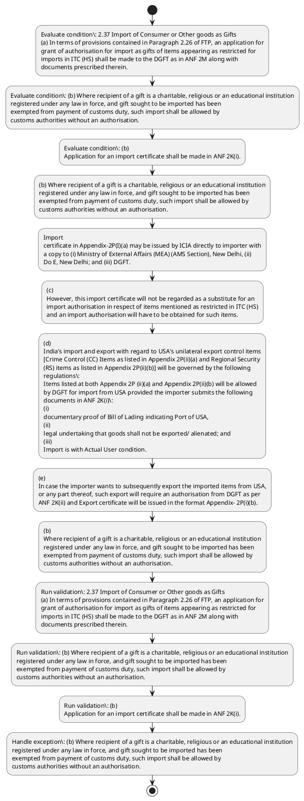

# Chapter 2 / Section 2.37: Import of Consumer or Other goods as Gifts

**Chapter Title:** General Provisions Regarding Imports and Exports

**Pages:** 14

**Purpose:** 2.37 Import of Consumer or Other goods as Gifts
(a) In terms of provisions contained in Paragraph 2.26 of FTP, an application for
grant of authorisation for import as gifts of items appearing as restricted for
imports in ITC (HS) shall be made to the DGFT as in ANF 2M along with
documents prescribed therein.

**Purpose Thanglish:** Indha Import of Consumer or Other goods as Gifts section-la, 2.37 import of Consumer or Other goods as Gifts
(a) In terms of provisions contained in Paragraph 2.26 of FTP, an application for
grant of authorisation for import as gifts of items appearing as restricted for
imports in ITC (HS) kandippa be made to the DGFT as in ANF 2M along with
documents prescribed therein.

**Summary:** 2.37 Import of Consumer or Other goods as Gifts
(a) In terms of provisions contained in Paragraph 2.26 of FTP, an application for
grant of authorisation for import as gifts of items appearing as restricted for
imports in ITC (HS) shall be made to the DGFT as in ANF 2M along with
documents prescribed therein. (b) Where recipient of a gift is a charitable, religious or an educational institution
registered under any law in force, and gift sought to be imported has been
exempted from payment of customs duty, such import shall be allowed by
customs authorities without an authorisation. pg.

**Business Meaning:** Import of Consumer or Other goods as Gifts governs how DGFT business controls should be applied, validated, and enforced.

**Business Explanation:** Import of Consumer or Other goods as Gifts explains the operating rule set that DEKAI should enforce. Key control points include 2.37 Import of Consumer or Other goods as Gifts
(a) In terms of provisions contained in Paragraph 2.26 of FTP, an application for
grant of authorisation for import as gifts of items appearing as restricted for
imports in ITC (HS) shall be made to the DGFT as in ANF 2M along with
documents prescribed therein. The section also drives actions such as (b) Where recipient of a gift is a charitable, religious or an educational institution
registered under any law in force, and gift sought to be imported has been
exempted from payment of customs duty, such import shall be allowed by
customs authorities without an authorisation..

**Business Explanation Thanglish:** Indha Import of Consumer or Other goods as Gifts section-la, import of Consumer or Other goods as Gifts explains the operating rule set that DEKAI should enforce. Key control points include 2.37 import of Consumer or Other goods as Gifts
(a) In terms of provisions contained in Paragraph 2.26 of FTP, an application for
grant of authorisation for import as gifts of items appearing as restricted for
imports in ITC (HS) kandippa be made to the DGFT as in ANF 2M along with
documents prescribed therein. The section also drives actions such as (b) Where recipient of a gift is a charitable, religious or an educational institution
registered under any law in force, and gift sought to be imported has been
exempted from payment of customs duty, such import kandippa be allowed by
customs authorities without an authorisation..

## Business Logic
- 2.37 Import of Consumer or Other goods as Gifts
(a) In terms of provisions contained in Paragraph 2.26 of FTP, an application for
grant of authorisation for import as gifts of items appearing as restricted for
imports in ITC (HS) shall be made to the DGFT as in ANF 2M along with
documents prescribed therein.
- (b) Where recipient of a gift is a charitable, religious or an educational institution
registered under any law in force, and gift sought to be imported has been
exempted from payment of customs duty, such import shall be allowed by
customs authorities without an authorisation.
- (b)
Application for an import certificate shall be made in ANF 2K(i).
- (d)
India’s import and export with regard to USA’s unilateral export control items
[Crime Control (CC) Items as listed in Appendix 2P(ii)(a) and Regional Security
(RS) items as listed in Appendix 2P(ii)(b)] will be governed by the following
regulations:
Items listed at both Appendix 2P (ii)(a) and Appendix 2P(ii)(b) will be allowed
by DGFT for import from USA provided the importer submits the following
documents in ANF 2K(i):
(i)
documentary proof of Bill of Lading indicating Port of USA,
(ii)
legal undertaking that goods shall not be exported/ alienated; and
(iii)
Import is with Actual User condition.
- (f)
Import /export of such items shall be allowed only through EDI enabled ports
of India.
- IMPORTS
2.37 Import of Consumer or Other goods as Gifts
(a)
In terms of provisions contained in Paragraph 2.26 of FTP, an application for
grant of authorisation for import as gifts of items appearing as restricted for
imports in ITC (HS) shall be made to the DGFT as in ANF 2M along with
documents prescribed therein.
- (b)
Where recipient of a gift is a charitable, religious or an educational institution
registered under any law in force, and gift sought to be imported has been
exempted from payment of customs duty, such import shall be allowed by
customs authorities without an authorisation.

## Business Rules
- rule_id=CH2-SEC2_37-R001, rule_description=2.37 Import of Consumer or Other goods as Gifts
(a) In terms of provisions contained in Paragraph 2.26 of FTP, an application for
grant of authorisation for import as gifts of items appearing as restricted for
imports in ITC (HS) shall be made to the DGFT as in ANF 2M along with
documents prescribed therein., trigger=Import of Consumer or Other goods as Gifts, condition=2.37 Import of Consumer or Other goods as Gifts
(a) In terms of provisions contained in Paragraph 2.26 of FTP, an application for
grant of authorisation for import as gifts of items appearing as restricted for
imports in ITC (HS) shall be made to the DGFT as in ANF 2M along with
documents prescribed therein., validation=2.37 Import of Consumer or Other goods as Gifts
(a) In terms of provisions contained in Paragraph 2.26 of FTP, an application for
grant of authorisation for import as gifts of items appearing as restricted for
imports in ITC (HS) shall be made to the DGFT as in ANF 2M along with
documents prescribed therein., action=(b) Where recipient of a gift is a charitable, religious or an educational institution
registered under any law in force, and gift sought to be imported has been
exempted from payment of customs duty, such import shall be allowed by
customs authorities without an authorisation., exception=(b) Where recipient of a gift is a charitable, religious or an educational institution
registered under any law in force, and gift sought to be imported has been
exempted from payment of customs duty, such import shall be allowed by
customs authorities without an authorisation., output=DEKAI should produce a compliance decision for 2.37 - Import of Consumer or Other goods as Gifts.
- rule_id=CH2-SEC2_37-R002, rule_description=(b) Where recipient of a gift is a charitable, religious or an educational institution
registered under any law in force, and gift sought to be imported has been
exempted from payment of customs duty, such import shall be allowed by
customs authorities without an authorisation., trigger=Import of Consumer or Other goods as Gifts, condition=(b) Where recipient of a gift is a charitable, religious or an educational institution
registered under any law in force, and gift sought to be imported has been
exempted from payment of customs duty, such import shall be allowed by
customs authorities without an authorisation., validation=(b) Where recipient of a gift is a charitable, religious or an educational institution
registered under any law in force, and gift sought to be imported has been
exempted from payment of customs duty, such import shall be allowed by
customs authorities without an authorisation., action=Import
certificate in Appendix-2P(I)(a) may be issued by ICIA directly to importer with
a copy to (i) Ministry of External Affairs (MEA) (AMS Section), New Delhi, (ii)
Do E, New Delhi; and (iii) DGFT., exception=(c)
However, this import certificate will not be regarded as a substitute for an
import authorisation in respect of items mentioned as restricted in ITC (HS)
and an import authorisation will have to be obtained for such items., output=DEKAI should produce a compliance decision for 2.37 - Import of Consumer or Other goods as Gifts.
- rule_id=CH2-SEC2_37-R003, rule_description=(b)
Application for an import certificate shall be made in ANF 2K(i)., trigger=Import of Consumer or Other goods as Gifts, condition=(b)
Application for an import certificate shall be made in ANF 2K(i)., validation=(b)
Application for an import certificate shall be made in ANF 2K(i)., action=(c)
However, this import certificate will not be regarded as a substitute for an
import authorisation in respect of items mentioned as restricted in ITC (HS)
and an import authorisation will have to be obtained for such items., exception=(b)
Where recipient of a gift is a charitable, religious or an educational institution
registered under any law in force, and gift sought to be imported has been
exempted from payment of customs duty, such import shall be allowed by
customs authorities without an authorisation., output=DEKAI should produce a compliance decision for 2.37 - Import of Consumer or Other goods as Gifts.
- rule_id=CH2-SEC2_37-R004, rule_description=(d)
India’s import and export with regard to USA’s unilateral export control items
[Crime Control (CC) Items as listed in Appendix 2P(ii)(a) and Regional Security
(RS) items as listed in Appendix 2P(ii)(b)] will be governed by the following
regulations:
Items listed at both Appendix 2P (ii)(a) and Appendix 2P(ii)(b) will be allowed
by DGFT for import from USA provided the importer submits the following
documents in ANF 2K(i):
(i)
documentary proof of Bill of Lading indicating Port of USA,
(ii)
legal undertaking that goods shall not be exported/ alienated; and
(iii)
Import is with Actual User condition., trigger=Import of Consumer or Other goods as Gifts, condition=Import
certificate in Appendix-2P(I)(a) may be issued by ICIA directly to importer with
a copy to (i) Ministry of External Affairs (MEA) (AMS Section), New Delhi, (ii)
Do E, New Delhi; and (iii) DGFT., validation=(d)
India’s import and export with regard to USA’s unilateral export control items
[Crime Control (CC) Items as listed in Appendix 2P(ii)(a) and Regional Security
(RS) items as listed in Appendix 2P(ii)(b)] will be governed by the following
regulations:
Items listed at both Appendix 2P (ii)(a) and Appendix 2P(ii)(b) will be allowed
by DGFT for import from USA provided the importer submits the following
documents in ANF 2K(i):
(i)
documentary proof of Bill of Lading indicating Port of USA,
(ii)
legal undertaking that goods shall not be exported/ alienated; and
(iii)
Import is with Actual User condition., action=(d)
India’s import and export with regard to USA’s unilateral export control items
[Crime Control (CC) Items as listed in Appendix 2P(ii)(a) and Regional Security
(RS) items as listed in Appendix 2P(ii)(b)] will be governed by the following
regulations:
Items listed at both Appendix 2P (ii)(a) and Appendix 2P(ii)(b) will be allowed
by DGFT for import from USA provided the importer submits the following
documents in ANF 2K(i):
(i)
documentary proof of Bill of Lading indicating Port of USA,
(ii)
legal undertaking that goods shall not be exported/ alienated; and
(iii)
Import is with Actual User condition., exception=(b)
Where recipient of a gift is a charitable, religious or an educational institution
registered under any law in force, and gift sought to be imported has been
exempted from payment of customs duty, such import shall be allowed by
customs authorities without an authorisation., output=DEKAI should produce a compliance decision for 2.37 - Import of Consumer or Other goods as Gifts.
- rule_id=CH2-SEC2_37-R005, rule_description=(f)
Import /export of such items shall be allowed only through EDI enabled ports
of India., trigger=Import of Consumer or Other goods as Gifts, condition=(c)
However, this import certificate will not be regarded as a substitute for an
import authorisation in respect of items mentioned as restricted in ITC (HS)
and an import authorisation will have to be obtained for such items., validation=(f)
Import /export of such items shall be allowed only through EDI enabled ports
of India., action=(e)
In case the importer wants to subsequently export the imported items from USA,
or any part thereof, such export will require an authorisation from DGFT as per
ANF 2K(ii) and Export certificate will be issued in the format Appendix- 2P(i)(b)., exception=(b)
Where recipient of a gift is a charitable, religious or an educational institution
registered under any law in force, and gift sought to be imported has been
exempted from payment of customs duty, such import shall be allowed by
customs authorities without an authorisation., output=DEKAI should produce a compliance decision for 2.37 - Import of Consumer or Other goods as Gifts.
- rule_id=CH2-SEC2_37-R006, rule_description=IMPORTS
2.37 Import of Consumer or Other goods as Gifts
(a)
In terms of provisions contained in Paragraph 2.26 of FTP, an application for
grant of authorisation for import as gifts of items appearing as restricted for
imports in ITC (HS) shall be made to the DGFT as in ANF 2M along with
documents prescribed therein., trigger=Import of Consumer or Other goods as Gifts, condition=(e)
In case the importer wants to subsequently export the imported items from USA,
or any part thereof, such export will require an authorisation from DGFT as per
ANF 2K(ii) and Export certificate will be issued in the format Appendix- 2P(i)(b)., validation=IMPORTS
2.37 Import of Consumer or Other goods as Gifts
(a)
In terms of provisions contained in Paragraph 2.26 of FTP, an application for
grant of authorisation for import as gifts of items appearing as restricted for
imports in ITC (HS) shall be made to the DGFT as in ANF 2M along with
documents prescribed therein., action=(b)
Where recipient of a gift is a charitable, religious or an educational institution
registered under any law in force, and gift sought to be imported has been
exempted from payment of customs duty, such import shall be allowed by
customs authorities without an authorisation., exception=(b)
Where recipient of a gift is a charitable, religious or an educational institution
registered under any law in force, and gift sought to be imported has been
exempted from payment of customs duty, such import shall be allowed by
customs authorities without an authorisation., output=DEKAI should produce a compliance decision for 2.37 - Import of Consumer or Other goods as Gifts.
- rule_id=CH2-SEC2_37-R007, rule_description=(b)
Where recipient of a gift is a charitable, religious or an educational institution
registered under any law in force, and gift sought to be imported has been
exempted from payment of customs duty, such import shall be allowed by
customs authorities without an authorisation., trigger=Import of Consumer or Other goods as Gifts, condition=IMPORTS
2.37 Import of Consumer or Other goods as Gifts
(a)
In terms of provisions contained in Paragraph 2.26 of FTP, an application for
grant of authorisation for import as gifts of items appearing as restricted for
imports in ITC (HS) shall be made to the DGFT as in ANF 2M along with
documents prescribed therein., validation=(b)
Where recipient of a gift is a charitable, religious or an educational institution
registered under any law in force, and gift sought to be imported has been
exempted from payment of customs duty, such import shall be allowed by
customs authorities without an authorisation., action=(b)
Where recipient of a gift is a charitable, religious or an educational institution
registered under any law in force, and gift sought to be imported has been
exempted from payment of customs duty, such import shall be allowed by
customs authorities without an authorisation., exception=(b)
Where recipient of a gift is a charitable, religious or an educational institution
registered under any law in force, and gift sought to be imported has been
exempted from payment of customs duty, such import shall be allowed by
customs authorities without an authorisation., output=DEKAI should produce a compliance decision for 2.37 - Import of Consumer or Other goods as Gifts.

## Conditions
- 2.37 Import of Consumer or Other goods as Gifts
(a) In terms of provisions contained in Paragraph 2.26 of FTP, an application for
grant of authorisation for import as gifts of items appearing as restricted for
imports in ITC (HS) shall be made to the DGFT as in ANF 2M along with
documents prescribed therein.
- (b) Where recipient of a gift is a charitable, religious or an educational institution
registered under any law in force, and gift sought to be imported has been
exempted from payment of customs duty, such import shall be allowed by
customs authorities without an authorisation.
- (b)
Application for an import certificate shall be made in ANF 2K(i).
- Import
certificate in Appendix-2P(I)(a) may be issued by ICIA directly to importer with
a copy to (i) Ministry of External Affairs (MEA) (AMS Section), New Delhi, (ii)
Do E, New Delhi; and (iii) DGFT.
- (c)
However, this import certificate will not be regarded as a substitute for an
import authorisation in respect of items mentioned as restricted in ITC (HS)
and an import authorisation will have to be obtained for such items.
- (e)
In case the importer wants to subsequently export the imported items from USA,
or any part thereof, such export will require an authorisation from DGFT as per
ANF 2K(ii) and Export certificate will be issued in the format Appendix- 2P(i)(b).
- IMPORTS
2.37 Import of Consumer or Other goods as Gifts
(a)
In terms of provisions contained in Paragraph 2.26 of FTP, an application for
grant of authorisation for import as gifts of items appearing as restricted for
imports in ITC (HS) shall be made to the DGFT as in ANF 2M along with
documents prescribed therein.
- (b)
Where recipient of a gift is a charitable, religious or an educational institution
registered under any law in force, and gift sought to be imported has been
exempted from payment of customs duty, such import shall be allowed by
customs authorities without an authorisation.

## Condition Logic
- id=2.2.37.1, if=2.37 Import of Consumer or Other goods as Gifts
(a) In terms of provisions contained in Paragraph 2.26 of FTP, an application for
grant of authorisation for import as gifts of items appearing as restricted for
imports in ITC (HS) shall be made to the DGFT as in ANF 2M along with
documents prescribed therein., then=(b) Where recipient of a gift is a charitable, religious or an educational institution
registered under any law in force, and gift sought to be imported has been
exempted from payment of customs duty, such import shall be allowed by
customs authorities without an authorisation., source=2.37 Import of Consumer or Other goods as Gifts
(a) In terms of provisions contained in Paragraph 2.26 of FTP, an application for
grant of authorisation for import as gifts of items appearing as restricted for
imports in ITC (HS) shall be made to the DGFT as in ANF 2M along with
documents prescribed therein.
- id=2.2.37.2, if=(b) Where recipient of a gift is a charitable, religious or an educational institution
registered under any law in force, and gift sought to be imported has been
exempted from payment of customs duty, such import shall be allowed by
customs authorities without an authorisation., then=(b) Where recipient of a gift is a charitable, religious or an educational institution
registered under any law in force, and gift sought to be imported has been
exempted from payment of customs duty, such import shall be allowed by
customs authorities without an authorisation., source=(b) Where recipient of a gift is a charitable, religious or an educational institution
registered under any law in force, and gift sought to be imported has been
exempted from payment of customs duty, such import shall be allowed by
customs authorities without an authorisation.
- id=2.2.37.3, if=(b)
Application for an import certificate shall be made in ANF 2K(i)., then=(b) Where recipient of a gift is a charitable, religious or an educational institution
registered under any law in force, and gift sought to be imported has been
exempted from payment of customs duty, such import shall be allowed by
customs authorities without an authorisation., source=(b)
Application for an import certificate shall be made in ANF 2K(i).
- id=2.2.37.4, if=Import
certificate in Appendix-2P(I)(a) may be issued by ICIA directly to importer with
a copy to (i) Ministry of External Affairs (MEA) (AMS Section), New Delhi, (ii)
Do E, New Delhi; and (iii) DGFT., then=(b) Where recipient of a gift is a charitable, religious or an educational institution
registered under any law in force, and gift sought to be imported has been
exempted from payment of customs duty, such import shall be allowed by
customs authorities without an authorisation., source=Import
certificate in Appendix-2P(I)(a) may be issued by ICIA directly to importer with
a copy to (i) Ministry of External Affairs (MEA) (AMS Section), New Delhi, (ii)
Do E, New Delhi; and (iii) DGFT.
- id=2.2.37.5, if=(c)
However, this import certificate will not be regarded as a substitute for an
import authorisation in respect of items mentioned as restricted in ITC (HS)
and an import authorisation will have to be obtained for such items., then=(b) Where recipient of a gift is a charitable, religious or an educational institution
registered under any law in force, and gift sought to be imported has been
exempted from payment of customs duty, such import shall be allowed by
customs authorities without an authorisation., source=(c)
However, this import certificate will not be regarded as a substitute for an
import authorisation in respect of items mentioned as restricted in ITC (HS)
and an import authorisation will have to be obtained for such items.
- id=2.2.37.6, if=(e)
In case the importer wants to subsequently export the imported items from USA,
or any part thereof, such export will require an authorisation from DGFT as per
ANF 2K(ii) and Export certificate will be issued in the format Appendix- 2P(i)(b)., then=(b) Where recipient of a gift is a charitable, religious or an educational institution
registered under any law in force, and gift sought to be imported has been
exempted from payment of customs duty, such import shall be allowed by
customs authorities without an authorisation., source=(e)
In case the importer wants to subsequently export the imported items from USA,
or any part thereof, such export will require an authorisation from DGFT as per
ANF 2K(ii) and Export certificate will be issued in the format Appendix- 2P(i)(b).
- id=2.2.37.7, if=IMPORTS
2.37 Import of Consumer or Other goods as Gifts
(a)
In terms of provisions contained in Paragraph 2.26 of FTP, an application for
grant of authorisation for import as gifts of items appearing as restricted for
imports in ITC (HS) shall be made to the DGFT as in ANF 2M along with
documents prescribed therein., then=(b) Where recipient of a gift is a charitable, religious or an educational institution
registered under any law in force, and gift sought to be imported has been
exempted from payment of customs duty, such import shall be allowed by
customs authorities without an authorisation., source=IMPORTS
2.37 Import of Consumer or Other goods as Gifts
(a)
In terms of provisions contained in Paragraph 2.26 of FTP, an application for
grant of authorisation for import as gifts of items appearing as restricted for
imports in ITC (HS) shall be made to the DGFT as in ANF 2M along with
documents prescribed therein.
- id=2.2.37.8, if=(b)
Where recipient of a gift is a charitable, religious or an educational institution
registered under any law in force, and gift sought to be imported has been
exempted from payment of customs duty, such import shall be allowed by
customs authorities without an authorisation., then=(b) Where recipient of a gift is a charitable, religious or an educational institution
registered under any law in force, and gift sought to be imported has been
exempted from payment of customs duty, such import shall be allowed by
customs authorities without an authorisation., source=(b)
Where recipient of a gift is a charitable, religious or an educational institution
registered under any law in force, and gift sought to be imported has been
exempted from payment of customs duty, such import shall be allowed by
customs authorities without an authorisation.

## Validations
- 2.37 Import of Consumer or Other goods as Gifts
(a) In terms of provisions contained in Paragraph 2.26 of FTP, an application for
grant of authorisation for import as gifts of items appearing as restricted for
imports in ITC (HS) shall be made to the DGFT as in ANF 2M along with
documents prescribed therein.
- (b) Where recipient of a gift is a charitable, religious or an educational institution
registered under any law in force, and gift sought to be imported has been
exempted from payment of customs duty, such import shall be allowed by
customs authorities without an authorisation.
- (b)
Application for an import certificate shall be made in ANF 2K(i).
- (d)
India’s import and export with regard to USA’s unilateral export control items
[Crime Control (CC) Items as listed in Appendix 2P(ii)(a) and Regional Security
(RS) items as listed in Appendix 2P(ii)(b)] will be governed by the following
regulations:
Items listed at both Appendix 2P (ii)(a) and Appendix 2P(ii)(b) will be allowed
by DGFT for import from USA provided the importer submits the following
documents in ANF 2K(i):
(i)
documentary proof of Bill of Lading indicating Port of USA,
(ii)
legal undertaking that goods shall not be exported/ alienated; and
(iii)
Import is with Actual User condition.
- (f)
Import /export of such items shall be allowed only through EDI enabled ports
of India.
- IMPORTS
2.37 Import of Consumer or Other goods as Gifts
(a)
In terms of provisions contained in Paragraph 2.26 of FTP, an application for
grant of authorisation for import as gifts of items appearing as restricted for
imports in ITC (HS) shall be made to the DGFT as in ANF 2M along with
documents prescribed therein.
- (b)
Where recipient of a gift is a charitable, religious or an educational institution
registered under any law in force, and gift sought to be imported has been
exempted from payment of customs duty, such import shall be allowed by
customs authorities without an authorisation.

## Exceptions
- (b) Where recipient of a gift is a charitable, religious or an educational institution
registered under any law in force, and gift sought to be imported has been
exempted from payment of customs duty, such import shall be allowed by
customs authorities without an authorisation.
- (c)
However, this import certificate will not be regarded as a substitute for an
import authorisation in respect of items mentioned as restricted in ITC (HS)
and an import authorisation will have to be obtained for such items.
- (b)
Where recipient of a gift is a charitable, religious or an educational institution
registered under any law in force, and gift sought to be imported has been
exempted from payment of customs duty, such import shall be allowed by
customs authorities without an authorisation.

## Dependencies
- 2.26

## Authorities
- DGFT
- ITC (HS) shall be made to the DGFT
- customs

## Required Documents
- 2.37 Import of Consumer or Other goods as Gifts
(a) In terms of provisions contained in Paragraph 2.26 of FTP, an application for
grant of authorisation for import as gifts of items appearing as restricted for
imports in ITC (HS) shall be made to the DGFT as in ANF 2M along with
documents prescribed therein.
- (b)
Application for an import certificate shall be made in ANF 2K(i).
- Import
certificate in Appendix-2P(I)(a) may be issued by ICIA directly to importer with
a copy to (i) Ministry of External Affairs (MEA) (AMS Section), New Delhi, (ii)
Do E, New Delhi; and (iii) DGFT.
- (c)
However, this import certificate will not be regarded as a substitute for an
import authorisation in respect of items mentioned as restricted in ITC (HS)
and an import authorisation will have to be obtained for such items.
- (d)
India’s import and export with regard to USA’s unilateral export control items
[Crime Control (CC) Items as listed in Appendix 2P(ii)(a) and Regional Security
(RS) items as listed in Appendix 2P(ii)(b)] will be governed by the following
regulations:
Items listed at both Appendix 2P (ii)(a) and Appendix 2P(ii)(b) will be allowed
by DGFT for import from USA provided the importer submits the following
documents in ANF 2K(i):
(i)
documentary proof of Bill of Lading indicating Port of USA,
(ii)
legal undertaking that goods shall not be exported/ alienated; and
(iii)
Import is with Actual User condition.
- (e)
In case the importer wants to subsequently export the imported items from USA,
or any part thereof, such export will require an authorisation from DGFT as per
ANF 2K(ii) and Export certificate will be issued in the format Appendix- 2P(i)(b).
- IMPORTS
2.37 Import of Consumer or Other goods as Gifts
(a)
In terms of provisions contained in Paragraph 2.26 of FTP, an application for
grant of authorisation for import as gifts of items appearing as restricted for
imports in ITC (HS) shall be made to the DGFT as in ANF 2M along with
documents prescribed therein.

## Timelines
- None identified

## Actions
- (b) Where recipient of a gift is a charitable, religious or an educational institution
registered under any law in force, and gift sought to be imported has been
exempted from payment of customs duty, such import shall be allowed by
customs authorities without an authorisation.
- Import
certificate in Appendix-2P(I)(a) may be issued by ICIA directly to importer with
a copy to (i) Ministry of External Affairs (MEA) (AMS Section), New Delhi, (ii)
Do E, New Delhi; and (iii) DGFT.
- (c)
However, this import certificate will not be regarded as a substitute for an
import authorisation in respect of items mentioned as restricted in ITC (HS)
and an import authorisation will have to be obtained for such items.
- (d)
India’s import and export with regard to USA’s unilateral export control items
[Crime Control (CC) Items as listed in Appendix 2P(ii)(a) and Regional Security
(RS) items as listed in Appendix 2P(ii)(b)] will be governed by the following
regulations:
Items listed at both Appendix 2P (ii)(a) and Appendix 2P(ii)(b) will be allowed
by DGFT for import from USA provided the importer submits the following
documents in ANF 2K(i):
(i)
documentary proof of Bill of Lading indicating Port of USA,
(ii)
legal undertaking that goods shall not be exported/ alienated; and
(iii)
Import is with Actual User condition.
- (e)
In case the importer wants to subsequently export the imported items from USA,
or any part thereof, such export will require an authorisation from DGFT as per
ANF 2K(ii) and Export certificate will be issued in the format Appendix- 2P(i)(b).
- (b)
Where recipient of a gift is a charitable, religious or an educational institution
registered under any law in force, and gift sought to be imported has been
exempted from payment of customs duty, such import shall be allowed by
customs authorities without an authorisation.

## Workflow
- Evaluate condition: 2.37 Import of Consumer or Other goods as Gifts
(a) In terms of provisions contained in Paragraph 2.26 of FTP, an application for
grant of authorisation for import as gifts of items appearing as restricted for
imports in ITC (HS) shall be made to the DGFT as in ANF 2M along with
documents prescribed therein.
- Evaluate condition: (b) Where recipient of a gift is a charitable, religious or an educational institution
registered under any law in force, and gift sought to be imported has been
exempted from payment of customs duty, such import shall be allowed by
customs authorities without an authorisation.
- Evaluate condition: (b)
Application for an import certificate shall be made in ANF 2K(i).
- (b) Where recipient of a gift is a charitable, religious or an educational institution
registered under any law in force, and gift sought to be imported has been
exempted from payment of customs duty, such import shall be allowed by
customs authorities without an authorisation.
- Import
certificate in Appendix-2P(I)(a) may be issued by ICIA directly to importer with
a copy to (i) Ministry of External Affairs (MEA) (AMS Section), New Delhi, (ii)
Do E, New Delhi; and (iii) DGFT.
- (c)
However, this import certificate will not be regarded as a substitute for an
import authorisation in respect of items mentioned as restricted in ITC (HS)
and an import authorisation will have to be obtained for such items.
- (d)
India’s import and export with regard to USA’s unilateral export control items
[Crime Control (CC) Items as listed in Appendix 2P(ii)(a) and Regional Security
(RS) items as listed in Appendix 2P(ii)(b)] will be governed by the following
regulations:
Items listed at both Appendix 2P (ii)(a) and Appendix 2P(ii)(b) will be allowed
by DGFT for import from USA provided the importer submits the following
documents in ANF 2K(i):
(i)
documentary proof of Bill of Lading indicating Port of USA,
(ii)
legal undertaking that goods shall not be exported/ alienated; and
(iii)
Import is with Actual User condition.
- (e)
In case the importer wants to subsequently export the imported items from USA,
or any part thereof, such export will require an authorisation from DGFT as per
ANF 2K(ii) and Export certificate will be issued in the format Appendix- 2P(i)(b).
- (b)
Where recipient of a gift is a charitable, religious or an educational institution
registered under any law in force, and gift sought to be imported has been
exempted from payment of customs duty, such import shall be allowed by
customs authorities without an authorisation.
- Run validation: 2.37 Import of Consumer or Other goods as Gifts
(a) In terms of provisions contained in Paragraph 2.26 of FTP, an application for
grant of authorisation for import as gifts of items appearing as restricted for
imports in ITC (HS) shall be made to the DGFT as in ANF 2M along with
documents prescribed therein.
- Run validation: (b) Where recipient of a gift is a charitable, religious or an educational institution
registered under any law in force, and gift sought to be imported has been
exempted from payment of customs duty, such import shall be allowed by
customs authorities without an authorisation.
- Run validation: (b)
Application for an import certificate shall be made in ANF 2K(i).
- Handle exception: (b) Where recipient of a gift is a charitable, religious or an educational institution
registered under any law in force, and gift sought to be imported has been
exempted from payment of customs duty, such import shall be allowed by
customs authorities without an authorisation.

## Workflow ASCII
```text
Import of Consumer or Other goods as Gifts
Evaluate condition: 2.37 Import of Consumer or Other goods as Gifts
(a) In terms of provisions contained in Paragraph 2.26 of FTP, an application for
grant of authorisation for import as gifts of items appearing as restricted for
imports in ITC (HS) shall be made to the DGFT as in ANF 2M along with
documents prescribed therein.
   |
   v
Evaluate condition: (b) Where recipient of a gift is a charitable, religious or an educational institution
registered under any law in force, and gift sought to be imported has been
exempted from payment of customs duty, such import shall be allowed by
customs authorities without an authorisation.
   |
   v
Evaluate condition: (b)
Application for an import certificate shall be made in ANF 2K(i).
   |
   v
(b) Where recipient of a gift is a charitable, religious or an educational institution
registered under any law in force, and gift sought to be imported has been
exempted from payment of customs duty, such import shall be allowed by
customs authorities without an authorisation.
   |
   v
Import
certificate in Appendix-2P(I)(a) may be issued by ICIA directly to importer with
a copy to (i) Ministry of External Affairs (MEA) (AMS Section), New Delhi, (ii)
Do E, New Delhi; and (iii) DGFT.
   |
   v
(c)
However, this import certificate will not be regarded as a substitute for an
import authorisation in respect of items mentioned as restricted in ITC (HS)
and an import authorisation will have to be obtained for such items.
   |
   v
(d)
India’s import and export with regard to USA’s unilateral export control items
[Crime Control (CC) Items as listed in Appendix 2P(ii)(a) and Regional Security
(RS) items as listed in Appendix 2P(ii)(b)] will be governed by the following
regulations:
Items listed at both Appendix 2P (ii)(a) and Appendix 2P(ii)(b) will be allowed
by DGFT for import from USA provided the importer submits the following
documents in ANF 2K(i):
(i)
documentary proof of Bill of Lading indicating Port of USA,
(ii)
legal undertaking that goods shall not be exported/ alienated; and
(iii)
Import is with Actual User condition.
   |
   v
(e)
In case the importer wants to subsequently export the imported items from USA,
or any part thereof, such export will require an authorisation from DGFT as per
ANF 2K(ii) and Export certificate will be issued in the format Appendix- 2P(i)(b).
   |
   v
(b)
Where recipient of a gift is a charitable, religious or an educational institution
registered under any law in force, and gift sought to be imported has been
exempted from payment of customs duty, such import shall be allowed by
customs authorities without an authorisation.
   |
   v
Run validation: 2.37 Import of Consumer or Other goods as Gifts
(a) In terms of provisions contained in Paragraph 2.26 of FTP, an application for
grant of authorisation for import as gifts of items appearing as restricted for
imports in ITC (HS) shall be made to the DGFT as in ANF 2M along with
documents prescribed therein.
   |
   v
Run validation: (b) Where recipient of a gift is a charitable, religious or an educational institution
registered under any law in force, and gift sought to be imported has been
exempted from payment of customs duty, such import shall be allowed by
customs authorities without an authorisation.
   |
   v
Run validation: (b)
Application for an import certificate shall be made in ANF 2K(i).
   |
   v
Handle exception: (b) Where recipient of a gift is a charitable, religious or an educational institution
registered under any law in force, and gift sought to be imported has been
exempted from payment of customs duty, such import shall be allowed by
customs authorities without an authorisation.
```

## Decision Tree
- IF 2.37 Import of Consumer or Other goods as Gifts
(a) In terms of provisions contained in Paragraph 2.26 of FTP, an application for
grant of authorisation for import as gifts of items appearing as restricted for
imports in ITC (HS) shall be made to the DGFT as in ANF 2M along with
documents prescribed therein. THEN (b) Where recipient of a gift is a charitable, religious or an educational institution
registered under any law in force, and gift sought to be imported has been
exempted from payment of customs duty, such import shall be allowed by
customs authorities without an authorisation.
- IF (b) Where recipient of a gift is a charitable, religious or an educational institution
registered under any law in force, and gift sought to be imported has been
exempted from payment of customs duty, such import shall be allowed by
customs authorities without an authorisation. THEN (b) Where recipient of a gift is a charitable, religious or an educational institution
registered under any law in force, and gift sought to be imported has been
exempted from payment of customs duty, such import shall be allowed by
customs authorities without an authorisation.
- IF (b)
Application for an import certificate shall be made in ANF 2K(i). THEN (b) Where recipient of a gift is a charitable, religious or an educational institution
registered under any law in force, and gift sought to be imported has been
exempted from payment of customs duty, such import shall be allowed by
customs authorities without an authorisation.
- IF Import
certificate in Appendix-2P(I)(a) may be issued by ICIA directly to importer with
a copy to (i) Ministry of External Affairs (MEA) (AMS Section), New Delhi, (ii)
Do E, New Delhi; and (iii) DGFT. THEN (b) Where recipient of a gift is a charitable, religious or an educational institution
registered under any law in force, and gift sought to be imported has been
exempted from payment of customs duty, such import shall be allowed by
customs authorities without an authorisation.
- IF (c)
However, this import certificate will not be regarded as a substitute for an
import authorisation in respect of items mentioned as restricted in ITC (HS)
and an import authorisation will have to be obtained for such items. THEN (b) Where recipient of a gift is a charitable, religious or an educational institution
registered under any law in force, and gift sought to be imported has been
exempted from payment of customs duty, such import shall be allowed by
customs authorities without an authorisation.
- IF exception applies ((b) Where recipient of a gift is a charitable, religious or an educational institution
registered under any law in force, and gift sought to be imported has been
exempted from payment of customs duty, such import shall be allowed by
customs authorities without an authorisation.) THEN route to manual review
- IF exception applies ((c)
However, this import certificate will not be regarded as a substitute for an
import authorisation in respect of items mentioned as restricted in ITC (HS)
and an import authorisation will have to be obtained for such items.) THEN route to manual review
- IF exception applies ((b)
Where recipient of a gift is a charitable, religious or an educational institution
registered under any law in force, and gift sought to be imported has been
exempted from payment of customs duty, such import shall be allowed by
customs authorities without an authorisation.) THEN route to manual review

## Decision Tree ASCII
```text
Import of Consumer or Other goods as Gifts Decision
IF 2.37 Import of Consumer or Other goods as Gifts
(a) In terms of provisions contained in Paragraph 2.26 of FTP, an application for
grant of authorisation for import as gifts of items appearing as restricted for
imports in ITC (HS) shall be made to the DGFT as in ANF 2M along with
documents prescribed therein. THEN (b) Where recipient of a gift is a charitable, religious or an educational institution
registered under any law in force, and gift sought to be imported has been
exempted from payment of customs duty, such import shall be allowed by
customs authorities without an authorisation.
   |
   v
IF (b) Where recipient of a gift is a charitable, religious or an educational institution
registered under any law in force, and gift sought to be imported has been
exempted from payment of customs duty, such import shall be allowed by
customs authorities without an authorisation. THEN (b) Where recipient of a gift is a charitable, religious or an educational institution
registered under any law in force, and gift sought to be imported has been
exempted from payment of customs duty, such import shall be allowed by
customs authorities without an authorisation.
   |
   v
IF (b)
Application for an import certificate shall be made in ANF 2K(i). THEN (b) Where recipient of a gift is a charitable, religious or an educational institution
registered under any law in force, and gift sought to be imported has been
exempted from payment of customs duty, such import shall be allowed by
customs authorities without an authorisation.
   |
   v
IF Import
certificate in Appendix-2P(I)(a) may be issued by ICIA directly to importer with
a copy to (i) Ministry of External Affairs (MEA) (AMS Section), New Delhi, (ii)
Do E, New Delhi; and (iii) DGFT. THEN (b) Where recipient of a gift is a charitable, religious or an educational institution
registered under any law in force, and gift sought to be imported has been
exempted from payment of customs duty, such import shall be allowed by
customs authorities without an authorisation.
   |
   v
IF (c)
However, this import certificate will not be regarded as a substitute for an
import authorisation in respect of items mentioned as restricted in ITC (HS)
and an import authorisation will have to be obtained for such items. THEN (b) Where recipient of a gift is a charitable, religious or an educational institution
registered under any law in force, and gift sought to be imported has been
exempted from payment of customs duty, such import shall be allowed by
customs authorities without an authorisation.
   |
   v
IF exception applies ((b) Where recipient of a gift is a charitable, religious or an educational institution
registered under any law in force, and gift sought to be imported has been
exempted from payment of customs duty, such import shall be allowed by
customs authorities without an authorisation.) THEN route to manual review
   |
   v
IF exception applies ((c)
However, this import certificate will not be regarded as a substitute for an
import authorisation in respect of items mentioned as restricted in ITC (HS)
and an import authorisation will have to be obtained for such items.) THEN route to manual review
   |
   v
IF exception applies ((b)
Where recipient of a gift is a charitable, religious or an educational institution
registered under any law in force, and gift sought to be imported has been
exempted from payment of customs duty, such import shall be allowed by
customs authorities without an authorisation.) THEN route to manual review
```

## Examples
- User asks to process Import of Consumer or Other goods as Gifts; the platform checks conditions, validations, and documents before action.

**Real-world Example:** Example: an importer or exporter invokes Import of Consumer or Other goods as Gifts, submits 2.37 Import of Consumer or Other goods as Gifts
(a) In terms of provisions contained in Paragraph 2.26 of FTP, an application for
grant of authorisation for import as gifts of items appearing as restricted for
imports in ITC (HS) shall be made to the DGFT as in ANF 2M along with
documents prescribed therein., (b)
Application for an import certificate shall be made in ANF 2K(i)., Import
certificate in Appendix-2P(I)(a) may be issued by ICIA directly to importer with
a copy to (i) Ministry of External Affairs (MEA) (AMS Section), New Delhi, (ii)
Do E, New Delhi; and (iii) DGFT., and DEKAI uses the extracted rules to (b) where recipient of a gift is a charitable, religious or an educational institution
registered under any law in force, and gift sought to be imported has been
exempted from payment of customs duty, such import shall be allowed by
customs authorities without an authorisation..

**Real-world Example Thanglish:** Indha Import of Consumer or Other goods as Gifts section-la, Example: an importer or exporter invokes import of Consumer or Other goods as Gifts, submits 2.37 import of Consumer or Other goods as Gifts
(a) In terms of provisions contained in Paragraph 2.26 of FTP, an application for
grant of authorisation for import as gifts of items appearing as restricted for
imports in ITC (HS) kandippa be made to the DGFT as in ANF 2M along with
documents prescribed therein., (b)
application for an import certificate kandippa be made in ANF 2K(i)., import
certificate in Appendix-2P(I)(a) may be issued by ICIA directly to importer with
a copy to (i) Ministry of External Affairs (MEA) (AMS Section), New Delhi, (ii)
Do E, New Delhi; and (iii) DGFT., and DEKAI uses the extracted rules to (b) where recipient of a gift is a charitable, religious or an educational institution
registered under any law in force, and gift sought to be imported has been
exempted from payment of customs duty, such import kandippa be allowed by
customs authorities without an authorisation..

## AI Rules
- IF detected context matches section rule THEN enforce: 2.37 Import of Consumer or Other goods as Gifts
(a) In terms of provisions contained in Paragraph 2.26 of FTP, an application for
grant of authorisation for import as gifts of items appearing as restricted for
imports in ITC (HS) shall be made to the DGFT as in ANF 2M along with
documents prescribed therein.
- IF detected context matches section rule THEN enforce: (b) Where recipient of a gift is a charitable, religious or an educational institution
registered under any law in force, and gift sought to be imported has been
exempted from payment of customs duty, such import shall be allowed by
customs authorities without an authorisation.
- IF detected context matches section rule THEN enforce: (b)
Application for an import certificate shall be made in ANF 2K(i).
- IF detected context matches section rule THEN enforce: (d)
India’s import and export with regard to USA’s unilateral export control items
[Crime Control (CC) Items as listed in Appendix 2P(ii)(a) and Regional Security
(RS) items as listed in Appendix 2P(ii)(b)] will be governed by the following
regulations:
Items listed at both Appendix 2P (ii)(a) and Appendix 2P(ii)(b) will be allowed
by DGFT for import from USA provided the importer submits the following
documents in ANF 2K(i):
(i)
documentary proof of Bill of Lading indicating Port of USA,
(ii)
legal undertaking that goods shall not be exported/ alienated; and
(iii)
Import is with Actual User condition.
- IF detected context matches section rule THEN enforce: (f)
Import /export of such items shall be allowed only through EDI enabled ports
of India.
- IF detected context matches section rule THEN enforce: IMPORTS
2.37 Import of Consumer or Other goods as Gifts
(a)
In terms of provisions contained in Paragraph 2.26 of FTP, an application for
grant of authorisation for import as gifts of items appearing as restricted for
imports in ITC (HS) shall be made to the DGFT as in ANF 2M along with
documents prescribed therein.
- IF validations pass THEN recommend action: (b) Where recipient of a gift is a charitable, religious or an educational institution
registered under any law in force, and gift sought to be imported has been
exempted from payment of customs duty, such import shall be allowed by
customs authorities without an authorisation.

## Database Fields
- name=section_code, type=string, required=True, source=parsed_section_heading
- name=section_title, type=string, required=True, source=parsed_section_heading
- name=ftp_flag, type=boolean, required=False, source=keyword:FTP
- name=for_flag, type=boolean, required=False, source=keyword:for
- name=itc_flag, type=boolean, required=False, source=keyword:ITC
- name=the_flag, type=boolean, required=False, source=keyword:the
- name=anf_flag, type=boolean, required=False, source=keyword:ANF
- name=any_flag, type=boolean, required=False, source=keyword:any
- name=law_flag, type=boolean, required=False, source=keyword:law
- name=and_flag, type=boolean, required=False, source=keyword:and
- name=document_1_submitted, type=boolean, required=True, source=2.37 Import of Consumer or Other goods as Gifts
(a) In terms of provisions contained in Paragraph 2.26 of FTP, an application for
grant of authorisation for import as gifts of items appearing as restricted for
imports in ITC (HS) shall be made to the DGFT as in ANF 2M along with
documents prescribed therein.
- name=document_2_submitted, type=boolean, required=True, source=(b)
Application for an import certificate shall be made in ANF 2K(i).
- name=document_3_submitted, type=boolean, required=True, source=Import
certificate in Appendix-2P(I)(a) may be issued by ICIA directly to importer with
a copy to (i) Ministry of External Affairs (MEA) (AMS Section), New Delhi, (ii)
Do E, New Delhi; and (iii) DGFT.
- name=document_4_submitted, type=boolean, required=True, source=(c)
However, this import certificate will not be regarded as a substitute for an
import authorisation in respect of items mentioned as restricted in ITC (HS)
and an import authorisation will have to be obtained for such items.
- name=document_5_submitted, type=boolean, required=True, source=(d)
India’s import and export with regard to USA’s unilateral export control items
[Crime Control (CC) Items as listed in Appendix 2P(ii)(a) and Regional Security
(RS) items as listed in Appendix 2P(ii)(b)] will be governed by the following
regulations:
Items listed at both Appendix 2P (ii)(a) and Appendix 2P(ii)(b) will be allowed
by DGFT for import from USA provided the importer submits the following
documents in ANF 2K(i):
(i)
documentary proof of Bill of Lading indicating Port of USA,
(ii)
legal undertaking that goods shall not be exported/ alienated; and
(iii)
Import is with Actual User condition.
- name=document_6_submitted, type=boolean, required=True, source=(e)
In case the importer wants to subsequently export the imported items from USA,
or any part thereof, such export will require an authorisation from DGFT as per
ANF 2K(ii) and Export certificate will be issued in the format Appendix- 2P(i)(b).

## API Requirements
- method=GET, path=/api/dgft/sections/2.37, purpose=Retrieve knowledge payload for section 2.37, query_params=['include=workflow,decision_tree,validations'], response_fields=['section', 'title', 'summary', 'conditions', 'validations', 'exceptions', 'workflow', 'decision_tree']
- method=POST, path=/api/dgft/Import-of-Consumer-or-Other-goods-as-Gifts/validate, purpose=Validate inputs and documents for Import of Consumer or Other goods as Gifts, request_fields=['section_code', 'section_title', 'document_1_submitted', 'document_2_submitted', 'document_3_submitted', 'document_4_submitted', 'document_5_submitted', 'document_6_submitted'], response_fields=['status', 'errors', 'warnings', 'next_actions']
- method=POST, path=/api/dgft/Import-of-Consumer-or-Other-goods-as-Gifts/execute, purpose=Trigger business action for (b) Where recipient of a gift is a charitable, religious or an educational institution
registered under any law in force, and gift sought to be imported has been
exempted from payment of customs duty, such import shall be allowed by
customs authorities without an authorisation., request_fields=['section_code', 'section_title', 'document_1_submitted', 'document_2_submitted', 'document_3_submitted', 'document_4_submitted', 'document_5_submitted', 'document_6_submitted'], response_fields=['reference_id', 'status', 'authority', 'timeline']

## UI Screens
- screen_id=Import_of_Consumer_or_Other_goods_as_Gifts_overview, name=Import of Consumer or Other goods as Gifts Overview, purpose=Show section summary, authority, timeline, and eligibility cues., widgets=['summary_card', 'conditions_table', 'authority_badges', 'timeline_panel']
- screen_id=Import_of_Consumer_or_Other_goods_as_Gifts_submission, name=Import of Consumer or Other goods as Gifts Submission, purpose=Capture applicant data and supporting documents., widgets=['dynamic_form', 'document_uploader', 'validation_panel', 'next_action_footer'], fields=['section_code', 'section_title', 'ftp_flag', 'for_flag', 'itc_flag', 'the_flag', 'anf_flag', 'any_flag']
- screen_id=Import_of_Consumer_or_Other_goods_as_Gifts_exceptions, name=Import of Consumer or Other goods as Gifts Exception Review, purpose=Explain exception handling and manual review triggers., widgets=['exception_banner', 'decision_tree', 'case_notes']

## Error Messages
- Validation failed because the section requirements were not fully met.

## FAQ
- question_en=What is the purpose of section 2.37?, answer_en=Import of Consumer or Other goods as Gifts explains the operating rule set that DEKAI should enforce. Key control points include 2.37 Import of Consumer or Other goods as Gifts
(a) In terms of provisions contained in Paragraph 2.26 of FTP, an application for
grant of authorisation for import as gifts of items appearing as restricted for
imports in ITC (HS) shall be made to the DGFT as in ANF 2M along with
documents prescribed therein. The section also drives actions such as (b) Where recipient of a gift is a charitable, religious or an educational institution
registered under any law in force, and gift sought to be imported has been
exempted from payment of customs duty, such import shall be allowed by
customs authorities without an authorisation.., question_thanglish=Indha Import of Consumer or Other goods as Gifts section-la, What is the purpose of section 2.37?, answer_thanglish=Indha Import of Consumer or Other goods as Gifts section-la, import of Consumer or Other goods as Gifts explains the operating rule set that DEKAI should enforce. Key control points include 2.37 import of Consumer or Other goods as Gifts
(a) In terms of provisions contained in Paragraph 2.26 of FTP, an application for
grant of authorisation for import as gifts of items appearing as restricted for
imports in ITC (HS) kandippa be made to the DGFT as in ANF 2M along with
documents prescribed therein. The section also drives actions such as (b) Where recipient of a gift is a charitable, religious or an educational institution
registered under any law in force, and gift sought to be imported has been
exempted from payment of customs duty, such import kandippa be allowed by
customs authorities without an authorisation..
- question_en=What documents are required under Import of Consumer or Other goods as Gifts?, answer_en=2.37 Import of Consumer or Other goods as Gifts
(a) In terms of provisions contained in Paragraph 2.26 of FTP, an application for
grant of authorisation for import as gifts of items appearing as restricted for
imports in ITC (HS) shall be made to the DGFT as in ANF 2M along with
documents prescribed therein., (b)
Application for an import certificate shall be made in ANF 2K(i)., Import
certificate in Appendix-2P(I)(a) may be issued by ICIA directly to importer with
a copy to (i) Ministry of External Affairs (MEA) (AMS Section), New Delhi, (ii)
Do E, New Delhi; and (iii) DGFT., (c)
However, this import certificate will not be regarded as a substitute for an
import authorisation in respect of items mentioned as restricted in ITC (HS)
and an import authorisation will have to be obtained for such items., (d)
India’s import and export with regard to USA’s unilateral export control items
[Crime Control (CC) Items as listed in Appendix 2P(ii)(a) and Regional Security
(RS) items as listed in Appendix 2P(ii)(b)] will be governed by the following
regulations:
Items listed at both Appendix 2P (ii)(a) and Appendix 2P(ii)(b) will be allowed
by DGFT for import from USA provided the importer submits the following
documents in ANF 2K(i):
(i)
documentary proof of Bill of Lading indicating Port of USA,
(ii)
legal undertaking that goods shall not be exported/ alienated; and
(iii)
Import is with Actual User condition., (e)
In case the importer wants to subsequently export the imported items from USA,
or any part thereof, such export will require an authorisation from DGFT as per
ANF 2K(ii) and Export certificate will be issued in the format Appendix- 2P(i)(b)., IMPORTS
2.37 Import of Consumer or Other goods as Gifts
(a)
In terms of provisions contained in Paragraph 2.26 of FTP, an application for
grant of authorisation for import as gifts of items appearing as restricted for
imports in ITC (HS) shall be made to the DGFT as in ANF 2M along with
documents prescribed therein., question_thanglish=Indha Import of Consumer or Other goods as Gifts section-la, What documents are required under import of Consumer or Other goods as Gifts?, answer_thanglish=Indha Import of Consumer or Other goods as Gifts section-la, 2.37 import of Consumer or Other goods as Gifts
(a) In terms of provisions contained in Paragraph 2.26 of FTP, an application for
grant of authorisation for import as gifts of items appearing as restricted for
imports in ITC (HS) kandippa be made to the DGFT as in ANF 2M along with
documents prescribed therein., (b)
application for an import certificate kandippa be made in ANF 2K(i)., import
certificate in Appendix-2P(I)(a) may be issued by ICIA directly to importer with
a copy to (i) Ministry of External Affairs (MEA) (AMS Section), New Delhi, (ii)
Do E, New Delhi; and (iii) DGFT., (c)
However, this import certificate will not be regarded as a substitute for an
import authorisation in respect of items mentioned as restricted in ITC (HS)
and an import authorisation will have to be obtained for such items., (d)
India’s import and export with regard to USA’s unilateral export control items
[Crime Control (CC) Items as listed in Appendix 2P(ii)(a) and Regional Security
(RS) items as listed in Appendix 2P(ii)(b)] will be governed by the following
regulations:
Items listed at both Appendix 2P (ii)(a) and Appendix 2P(ii)(b) will be allowed
by DGFT for import from USA provided the importer submits the following
documents in ANF 2K(i):
(i)
documentary proof of Bill of Lading indicating Port of USA,
(ii)
legal undertaking that goods kandippa not be exported/ alienated; and
(iii)
import is with Actual User condition., (e)
In case the importer wants to subsequently export the imported items from USA,
or any part thereof, such export will require an authorisation from DGFT as per
ANF 2K(ii) and export certificate will be issued in the format Appendix- 2P(i)(b)., IMPORTS
2.37 import of Consumer or Other goods as Gifts
(a)
In terms of provisions contained in Paragraph 2.26 of FTP, an application for
grant of authorisation for import as gifts of items appearing as restricted for
imports in ITC (HS) kandippa be made to the DGFT as in ANF 2M along with
documents prescribed therein.
- question_en=Which authority handles Import of Consumer or Other goods as Gifts?, answer_en=DGFT, ITC (HS) shall be made to the DGFT, customs, question_thanglish=Indha Import of Consumer or Other goods as Gifts section-la, Which authority handles import of Consumer or Other goods as Gifts?, answer_thanglish=Indha Import of Consumer or Other goods as Gifts section-la, DGFT, ITC (HS) kandippa be made to the DGFT, customs

## Questions Users May Ask
- What does Import of Consumer or Other goods as Gifts require?
- Which documents are needed for Import of Consumer or Other goods as Gifts?
- How does DEKAI validate Import of Consumer or Other goods as Gifts requests?
- What action should be taken for Import of Consumer or Other goods as Gifts?

## Expected AI Answers
- Import of Consumer or Other goods as Gifts requires the platform to interpret the section text, apply the extracted business rules, and present the correct next action.
- Required documents are inferred from the section text: 2.37 Import of Consumer or Other goods as Gifts
(a) In terms of provisions contained in Paragraph 2.26 of FTP, an application for
grant of authorisation for import as gifts of items appearing as restricted for
imports in ITC (HS) shall be made to the DGFT as in ANF 2M along with
documents prescribed therein., (b)
Application for an import certificate shall be made in ANF 2K(i)., Import
certificate in Appendix-2P(I)(a) may be issued by ICIA directly to importer with
a copy to (i) Ministry of External Affairs (MEA) (AMS Section), New Delhi, (ii)
Do E, New Delhi; and (iii) DGFT., (c)
However, this import certificate will not be regarded as a substitute for an
import authorisation in respect of items mentioned as restricted in ITC (HS)
and an import authorisation will have to be obtained for such items., (d)
India’s import and export with regard to USA’s unilateral export control items
[Crime Control (CC) Items as listed in Appendix 2P(ii)(a) and Regional Security
(RS) items as listed in Appendix 2P(ii)(b)] will be governed by the following
regulations:
Items listed at both Appendix 2P (ii)(a) and Appendix 2P(ii)(b) will be allowed
by DGFT for import from USA provided the importer submits the following
documents in ANF 2K(i):
(i)
documentary proof of Bill of Lading indicating Port of USA,
(ii)
legal undertaking that goods shall not be exported/ alienated; and
(iii)
Import is with Actual User condition.
- DEKAI validates Import of Consumer or Other goods as Gifts by checking conditions, required documents, authority references, and exception clauses before recommending an outcome.
- The primary extracted action is: (b) Where recipient of a gift is a charitable, religious or an educational institution
registered under any law in force, and gift sought to be imported has been
exempted from payment of customs duty, such import shall be allowed by
customs authorities without an authorisation.

## AI Q&A Examples
- question_en=User asks: How do I comply with Import of Consumer or Other goods as Gifts?, answer_en=AI answers: DEKAI should evaluate section 2.37, apply the extracted rules, and guide the user through Evaluate condition: 2.37 Import of Consumer or Other goods as Gifts
(a) In terms of provisions contained in Paragraph 2.26 of FTP, an application for
grant of authorisation for import as gifts of items appearing as restricted for
imports in ITC (HS) shall be made to the DGFT as in ANF 2M along with
documents prescribed therein.., question_thanglish=Indha Import of Consumer or Other goods as Gifts section-la, User asks: How do I comply with import of Consumer or Other goods as Gifts?, answer_thanglish=Indha Import of Consumer or Other goods as Gifts section-la, AI answers: DEKAI should evaluate section 2.37, apply the extracted rules, and guide the user through Evaluate condition: 2.37 import of Consumer or Other goods as Gifts
(a) In terms of provisions contained in Paragraph 2.26 of FTP, an application for
grant of authorisation for import as gifts of items appearing as restricted for
imports in ITC (HS) kandippa be made to the DGFT as in ANF 2M along with
documents prescribed therein..
- question_en=User asks: Which validations apply to Import of Consumer or Other goods as Gifts?, answer_en=AI answers: Applicable validations are 2.37 Import of Consumer or Other goods as Gifts
(a) In terms of provisions contained in Paragraph 2.26 of FTP, an application for
grant of authorisation for import as gifts of items appearing as restricted for
imports in ITC (HS) shall be made to the DGFT as in ANF 2M along with
documents prescribed therein., (b) Where recipient of a gift is a charitable, religious or an educational institution
registered under any law in force, and gift sought to be imported has been
exempted from payment of customs duty, such import shall be allowed by
customs authorities without an authorisation., (b)
Application for an import certificate shall be made in ANF 2K(i)., question_thanglish=Indha Import of Consumer or Other goods as Gifts section-la, User asks: Which validations apply to import of Consumer or Other goods as Gifts?, answer_thanglish=Indha Import of Consumer or Other goods as Gifts section-la, AI answers: Applicable validations are 2.37 import of Consumer or Other goods as Gifts
(a) In terms of provisions contained in Paragraph 2.26 of FTP, an application for
grant of authorisation for import as gifts of items appearing as restricted for
imports in ITC (HS) kandippa be made to the DGFT as in ANF 2M along with
documents prescribed therein., (b) Where recipient of a gift is a charitable, religious or an educational institution
registered under any law in force, and gift sought to be imported has been
exempted from payment of customs duty, such import kandippa be allowed by
customs authorities without an authorisation., (b)
application for an import certificate kandippa be made in ANF 2K(i).

## DEKAI AI Implementation Notes
- Capture chapter 2, section 2.37, title, and page references as immutable knowledge metadata.
- Bind validations for Import of Consumer or Other goods as Gifts into a rule engine keyed by the rule IDs extracted for this section.
- Expose document upload controls for: 2.37 Import of Consumer or Other goods as Gifts
(a) In terms of provisions contained in Paragraph 2.26 of FTP, an application for
grant of authorisation for import as gifts of items appearing as restricted for
imports in ITC (HS) shall be made to the DGFT as in ANF 2M along with
documents prescribed therein., (b)
Application for an import certificate shall be made in ANF 2K(i)., Import
certificate in Appendix-2P(I)(a) may be issued by ICIA directly to importer with
a copy to (i) Ministry of External Affairs (MEA) (AMS Section), New Delhi, (ii)
Do E, New Delhi; and (iii) DGFT., (c)
However, this import certificate will not be regarded as a substitute for an
import authorisation in respect of items mentioned as restricted in ITC (HS)
and an import authorisation will have to be obtained for such items., (d)
India’s import and export with regard to USA’s unilateral export control items
[Crime Control (CC) Items as listed in Appendix 2P(ii)(a) and Regional Security
(RS) items as listed in Appendix 2P(ii)(b)] will be governed by the following
regulations:
Items listed at both Appendix 2P (ii)(a) and Appendix 2P(ii)(b) will be allowed
by DGFT for import from USA provided the importer submits the following
documents in ANF 2K(i):
(i)
documentary proof of Bill of Lading indicating Port of USA,
(ii)
legal undertaking that goods shall not be exported/ alienated; and
(iii)
Import is with Actual User condition., (e)
In case the importer wants to subsequently export the imported items from USA,
or any part thereof, such export will require an authorisation from DGFT as per
ANF 2K(ii) and Export certificate will be issued in the format Appendix- 2P(i)(b)..
- Route escalations or approvals to: DGFT, ITC (HS) shall be made to the DGFT, customs.
- Trigger manual review when exception clauses are detected.
- Show contextual links to related sections: 2.26.

## DEKAI AI Implementation Notes Thanglish
- Indha Import of Consumer or Other goods as Gifts section-la, Capture chapter 2, section 2.37, title, and page references as immutable knowledge metadata.
- Indha Import of Consumer or Other goods as Gifts section-la, Bind validations for import of Consumer or Other goods as Gifts into a rule engine keyed by the rule IDs extracted for this section.
- Indha Import of Consumer or Other goods as Gifts section-la, Expose document upload controls for: 2.37 import of Consumer or Other goods as Gifts
(a) In terms of provisions contained in Paragraph 2.26 of FTP, an application for
grant of authorisation for import as gifts of items appearing as restricted for
imports in ITC (HS) kandippa be made to the DGFT as in ANF 2M along with
documents prescribed therein., (b)
application for an import certificate kandippa be made in ANF 2K(i)., import
certificate in Appendix-2P(I)(a) may be issued by ICIA directly to importer with
a copy to (i) Ministry of External Affairs (MEA) (AMS Section), New Delhi, (ii)
Do E, New Delhi; and (iii) DGFT., (c)
However, this import certificate will not be regarded as a substitute for an
import authorisation in respect of items mentioned as restricted in ITC (HS)
and an import authorisation will have to be obtained for such items., (d)
India’s import and export with regard to USA’s unilateral export control items
[Crime Control (CC) Items as listed in Appendix 2P(ii)(a) and Regional Security
(RS) items as listed in Appendix 2P(ii)(b)] will be governed by the following
regulations:
Items listed at both Appendix 2P (ii)(a) and Appendix 2P(ii)(b) will be allowed
by DGFT for import from USA provided the importer submits the following
documents in ANF 2K(i):
(i)
documentary proof of Bill of Lading indicating Port of USA,
(ii)
legal undertaking that goods kandippa not be exported/ alienated; and
(iii)
import is with Actual User condition., (e)
In case the importer wants to subsequently export the imported items from USA,
or any part thereof, such export will require an authorisation from DGFT as per
ANF 2K(ii) and export certificate will be issued in the format Appendix- 2P(i)(b)..
- Indha Import of Consumer or Other goods as Gifts section-la, Route escalations or approvals to: DGFT, ITC (HS) kandippa be made to the DGFT, customs.
- Indha Import of Consumer or Other goods as Gifts section-la, Trigger manual review when exception clauses are detected.
- Indha Import of Consumer or Other goods as Gifts section-la, Show contextual links to related sections: 2.26.

## AI Metadata
- Keywords: FTP, for, ITC, the, ANF, any, law, and, has, may, MEA, AMS, New, iii, not, USA, per, EDI, made, DGFT
- Search Keywords: FTP, for, ITC, the, ANF, any, law, and, has, may, MEA, AMS, New, iii, not, USA, per, EDI, made, DGFT
- Intent: Support Import of Consumer or Other goods as Gifts processing and compliance validation.
- Tags: 2.37, Import of Consumer or Other goods as Gifts, business-rule, document-driven, dgft
- Related Sections: 2.26
- Related Chapters: 
- Related Rules: 2.37 Import of Consumer or Other goods as Gifts
(a) In terms of provisions contained in Paragraph 2.26 of FTP, an application for
grant of authorisation for import as gifts of items appearing as restricted for
imports in ITC (HS) shall be made to the DGFT as in ANF 2M along with
documents prescribed therein., (b) Where recipient of a gift is a charitable, religious or an educational institution
registered under any law in force, and gift sought to be imported has been
exempted from payment of customs duty, such import shall be allowed by
customs authorities without an authorisation., (b)
Application for an import certificate shall be made in ANF 2K(i)., (d)
India’s import and export with regard to USA’s unilateral export control items
[Crime Control (CC) Items as listed in Appendix 2P(ii)(a) and Regional Security
(RS) items as listed in Appendix 2P(ii)(b)] will be governed by the following
regulations:
Items listed at both Appendix 2P (ii)(a) and Appendix 2P(ii)(b) will be allowed
by DGFT for import from USA provided the importer submits the following
documents in ANF 2K(i):
(i)
documentary proof of Bill of Lading indicating Port of USA,
(ii)
legal undertaking that goods shall not be exported/ alienated; and
(iii)
Import is with Actual User condition., (f)
Import /export of such items shall be allowed only through EDI enabled ports
of India.

## Mermaid

```mermaid
flowchart TD
    S1["Evaluate condition: 2.37 Import of Consumer or Other goods as Gifts
(a) In terms of provisions contained in Paragraph 2.26 of FTP, an application for
grant of authorisation for import as gifts of items appearing as restricted for
imports in ITC (HS) shall be made to the DGFT as in ANF 2M along with
documents prescribed therein."]
    S2["Evaluate condition: (b) Where recipient of a gift is a charitable, religious or an educational institution
registered under any law in force, and gift sought to be imported has been
exempted from payment of customs duty, such import shall be allowed by
customs authorities without an authorisation."]
    S1 --> S2
    S3["Evaluate condition: (b)
Application for an import certificate shall be made in ANF 2K(i)."]
    S2 --> S3
    S4["(b) Where recipient of a gift is a charitable, religious or an educational institution
registered under any law in force, and gift sought to be imported has been
exempted from payment of customs duty, such import shall be allowed by
customs authorities without an authorisation."]
    S3 --> S4
    S5["Import
certificate in Appendix-2P(I)(a) may be issued by ICIA directly to importer with
a copy to (i) Ministry of External Affairs (MEA) (AMS Section), New Delhi, (ii)
Do E, New Delhi; and (iii) DGFT."]
    S4 --> S5
    S6["(c)
However, this import certificate will not be regarded as a substitute for an
import authorisation in respect of items mentioned as restricted in ITC (HS)
and an import authorisation will have to be obtained for such items."]
    S5 --> S6
    S7["(d)
India’s import and export with regard to USA’s unilateral export control items
[Crime Control (CC) Items as listed in Appendix 2P(ii)(a) and Regional Security
(RS) items as listed in Appendix 2P(ii)(b)] will be governed by the following
regulations:
Items listed at both Appendix 2P (ii)(a) and Appendix 2P(ii)(b) will be allowed
by DGFT for import from USA provided the importer submits the following
documents in ANF 2K(i):
(i)
documentary proof of Bill of Lading indicating Port of USA,
(ii)
legal undertaking that goods shall not be exported/ alienated; and
(iii)
Import is with Actual User condition."]
    S6 --> S7
    S8["(e)
In case the importer wants to subsequently export the imported items from USA,
or any part thereof, such export will require an authorisation from DGFT as per
ANF 2K(ii) and Export certificate will be issued in the format Appendix- 2P(i)(b)."]
    S7 --> S8
    S9["(b)
Where recipient of a gift is a charitable, religious or an educational institution
registered under any law in force, and gift sought to be imported has been
exempted from payment of customs duty, such import shall be allowed by
customs authorities without an authorisation."]
    S8 --> S9
    S10["Run validation: 2.37 Import of Consumer or Other goods as Gifts
(a) In terms of provisions contained in Paragraph 2.26 of FTP, an application for
grant of authorisation for import as gifts of items appearing as restricted for
imports in ITC (HS) shall be made to the DGFT as in ANF 2M along with
documents prescribed therein."]
    S9 --> S10
    S11["Run validation: (b) Where recipient of a gift is a charitable, religious or an educational institution
registered under any law in force, and gift sought to be imported has been
exempted from payment of customs duty, such import shall be allowed by
customs authorities without an authorisation."]
    S10 --> S11
    S12["Run validation: (b)
Application for an import certificate shall be made in ANF 2K(i)."]
    S11 --> S12
    S13["Handle exception: (b) Where recipient of a gift is a charitable, religious or an educational institution
registered under any law in force, and gift sought to be imported has been
exempted from payment of customs duty, such import shall be allowed by
customs authorities without an authorisation."]
    S12 --> S13
```


## PlantUML

