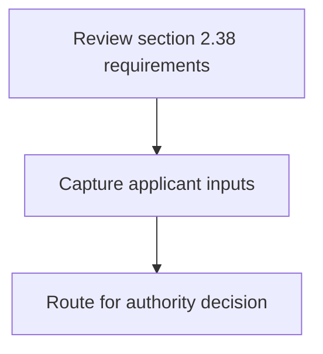
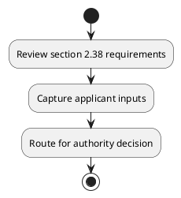

# Chapter 2 / Section 2.38: Import of Cheque Books /Ticket Forms etc.

**Chapter Title:** General Provisions Regarding Imports and Exports

**Pages:** 15

**Purpose:** Defines the operational requirements for Import of Cheque Books /Ticket Forms etc..

**Purpose Thanglish:** Indha Import of Cheque Books /Ticket Forms etc. section-la, Defines the operational requirements for import of Cheque Books /Ticket Forms etc..

**Summary:** 2.38 Import of Cheque Books /Ticket Forms etc. Indian branches of foreign banks, insurance companies and travel agencies may import
cheque books, bank draft forms and travellers’ cheque forms without an authorisation. Similarly, airlines / shipping companies operating in India, including persons
authorised by such airlines / shipping companies, may import passenger ticket forms
without an authorisation.

**Business Meaning:** 2.38 Import of Cheque Books /Ticket Forms etc.

**Business Explanation:** 2.38 Import of Cheque Books /Ticket Forms etc. Indian branches of foreign banks, insurance companies and travel agencies may import
cheque books, bank draft forms and travellers’ cheque forms without an authorisation. Similarly, airlines / shipping companies operating in India, including persons
authorised by such airlines / shipping companies, may import passenger ticket forms
without an authorisation.

**Business Explanation Thanglish:** Indha Import of Cheque Books /Ticket Forms etc. section-la, 2.38 import of Cheque Books /Ticket Forms etc. Indian branches of foreign banks, insurance companies and travel agencies may import
cheque books, bank draft forms and travellers’ cheque forms without an authorisation. Similarly, airlines / shipping companies operating in India, including persons
authorised by such airlines / shipping companies, may import passenger ticket forms
without an authorisation.

## Business Logic
- None identified

## Business Rules
- rule_id=CH2-SEC2_38-R001, rule_description=2.38 Import of Cheque Books /Ticket Forms etc. Indian branches of foreign banks, insurance companies and travel agencies may import
cheque books, bank draft forms and travellers’ cheque forms without an authorisation. Similarly, airlines / shipping companies operating in India, including persons
authorised by such airlines / shipping companies, may import passenger ticket forms
without an authorisation., trigger=Import of Cheque Books /Ticket Forms etc., condition=Not explicitly covered in uploaded documents., validation=Not explicitly covered in uploaded documents., action=Manual review required., exception=No explicit exception found in uploaded documents., output=DEKAI should produce a compliance decision for 2.38 - Import of Cheque Books /Ticket Forms etc..

## Conditions
- None identified

## Condition Logic
- None identified

## Validations
- None identified

## Exceptions
- None identified

## Dependencies
- None identified

## Authorities
- None identified

## Required Documents
- None identified

## Timelines
- None identified

## Actions
- None identified

## Workflow
- Review section 2.38 requirements
- Capture applicant inputs
- Route for authority decision

## Workflow ASCII
```text
Import of Cheque Books /Ticket Forms etc.
Review section 2.38 requirements
   |
   v
Capture applicant inputs
   |
   v
Route for authority decision
```

## Decision Tree
- IF section 2.38 applies THEN proceed with standard DGFT workflow

## Decision Tree ASCII
```text
Import of Cheque Books /Ticket Forms etc. Decision
IF section 2.38 applies THEN proceed with standard DGFT workflow
```

## Examples
- User asks to process Import of Cheque Books /Ticket Forms etc.; the platform checks conditions, validations, and documents before action.

**Real-world Example:** Example: an importer or exporter invokes Import of Cheque Books /Ticket Forms etc., submits the prescribed DGFT records, and DEKAI uses the extracted rules to follow the import of cheque books /ticket forms etc. process.

**Real-world Example Thanglish:** Indha Import of Cheque Books /Ticket Forms etc. section-la, Example: an importer or exporter invokes import of Cheque Books /Ticket Forms etc., submits the prescribed DGFT records, and DEKAI uses the extracted rules to follow the import of cheque books /ticket forms etc. process.

## AI Rules
- None identified

## Database Fields
- name=section_code, type=string, required=True, source=parsed_section_heading
- name=section_title, type=string, required=True, source=parsed_section_heading
- name=etc_flag, type=boolean, required=False, source=keyword:etc
- name=and_flag, type=boolean, required=False, source=keyword:and
- name=may_flag, type=boolean, required=False, source=keyword:may
- name=bank_flag, type=boolean, required=False, source=keyword:bank
- name=such_flag, type=boolean, required=False, source=keyword:such
- name=books_flag, type=boolean, required=False, source=keyword:Books
- name=forms_flag, type=boolean, required=False, source=keyword:Forms
- name=banks_flag, type=boolean, required=False, source=keyword:banks

## API Requirements
- method=GET, path=/api/dgft/sections/2.38, purpose=Retrieve knowledge payload for section 2.38, query_params=['include=workflow,decision_tree,validations'], response_fields=['section', 'title', 'summary', 'conditions', 'validations', 'exceptions', 'workflow', 'decision_tree']
- method=POST, path=/api/dgft/Import-of-Cheque-Books-Ticket-Forms-etc/validate, purpose=Validate inputs and documents for Import of Cheque Books /Ticket Forms etc., request_fields=['section_code', 'section_title'], response_fields=['status', 'errors', 'warnings', 'next_actions']

## UI Screens
- screen_id=Import_of_Cheque_Books_Ticket_Forms_etc_overview, name=Import of Cheque Books /Ticket Forms etc. Overview, purpose=Show section summary, authority, timeline, and eligibility cues., widgets=['summary_card', 'conditions_table', 'authority_badges', 'timeline_panel']
- screen_id=Import_of_Cheque_Books_Ticket_Forms_etc_submission, name=Import of Cheque Books /Ticket Forms etc. Submission, purpose=Capture applicant data and supporting documents., widgets=['dynamic_form', 'document_uploader', 'validation_panel', 'next_action_footer'], fields=['section_code', 'section_title', 'etc_flag', 'and_flag', 'may_flag', 'bank_flag', 'such_flag', 'books_flag']

## Error Messages
- Validation failed because the section requirements were not fully met.

## FAQ
- question_en=What is the purpose of section 2.38?, answer_en=2.38 Import of Cheque Books /Ticket Forms etc. Indian branches of foreign banks, insurance companies and travel agencies may import
cheque books, bank draft forms and travellers’ cheque forms without an authorisation. Similarly, airlines / shipping companies operating in India, including persons
authorised by such airlines / shipping companies, may import passenger ticket forms
without an authorisation., question_thanglish=Indha Import of Cheque Books /Ticket Forms etc. section-la, What is the purpose of section 2.38?, answer_thanglish=Indha Import of Cheque Books /Ticket Forms etc. section-la, 2.38 import of Cheque Books /Ticket Forms etc. Indian branches of foreign banks, insurance companies and travel agencies may import
cheque books, bank draft forms and travellers’ cheque forms without an authorisation. Similarly, airlines / shipping companies operating in India, including persons
authorised by such airlines / shipping companies, may import passenger ticket forms
without an authorisation.
- question_en=What documents are required under Import of Cheque Books /Ticket Forms etc.?, answer_en=Not explicitly covered in uploaded documents., question_thanglish=Indha Import of Cheque Books /Ticket Forms etc. section-la, What documents are required under import of Cheque Books /Ticket Forms etc.?, answer_thanglish=Indha Import of Cheque Books /Ticket Forms etc. section-la, Not explicitly covered in uploaded documents.
- question_en=Which authority handles Import of Cheque Books /Ticket Forms etc.?, answer_en=Not explicitly covered in uploaded documents., question_thanglish=Indha Import of Cheque Books /Ticket Forms etc. section-la, Which authority handles import of Cheque Books /Ticket Forms etc.?, answer_thanglish=Indha Import of Cheque Books /Ticket Forms etc. section-la, Not explicitly covered in uploaded documents.

## Questions Users May Ask
- What does Import of Cheque Books /Ticket Forms etc. require?
- Which documents are needed for Import of Cheque Books /Ticket Forms etc.?
- How does DEKAI validate Import of Cheque Books /Ticket Forms etc. requests?

## Expected AI Answers
- Import of Cheque Books /Ticket Forms etc. requires the platform to interpret the section text, apply the extracted business rules, and present the correct next action.
- Required documents are inferred from the section text: no explicit documents were detected.
- DEKAI validates Import of Cheque Books /Ticket Forms etc. by checking conditions, required documents, authority references, and exception clauses before recommending an outcome.

## AI Q&A Examples
- question_en=User asks: How do I comply with Import of Cheque Books /Ticket Forms etc.?, answer_en=AI answers: DEKAI should evaluate section 2.38, apply the extracted rules, and guide the user through Review section 2.38 requirements., question_thanglish=Indha Import of Cheque Books /Ticket Forms etc. section-la, User asks: How do I comply with import of Cheque Books /Ticket Forms etc.?, answer_thanglish=Indha Import of Cheque Books /Ticket Forms etc. section-la, AI answers: DEKAI should evaluate section 2.38, apply the extracted rules, and guide the user through Review section 2.38 requirements.
- question_en=User asks: Which validations apply to Import of Cheque Books /Ticket Forms etc.?, answer_en=AI answers: Applicable validations are not explicitly covered in the uploaded documents., question_thanglish=Indha Import of Cheque Books /Ticket Forms etc. section-la, User asks: Which validations apply to import of Cheque Books /Ticket Forms etc.?, answer_thanglish=Indha Import of Cheque Books /Ticket Forms etc. section-la, AI answers: Applicable validations are not explicitly covered in the uploaded documents.

## DEKAI AI Implementation Notes
- Capture chapter 2, section 2.38, title, and page references as immutable knowledge metadata.
- Bind validations for Import of Cheque Books /Ticket Forms etc. into a rule engine keyed by the rule IDs extracted for this section.

## DEKAI AI Implementation Notes Thanglish
- Indha Import of Cheque Books /Ticket Forms etc. section-la, Capture chapter 2, section 2.38, title, and page references as immutable knowledge metadata.
- Indha Import of Cheque Books /Ticket Forms etc. section-la, Bind validations for import of Cheque Books /Ticket Forms etc. into a rule engine keyed by the rule IDs extracted for this section.

## AI Metadata
- Keywords: etc, and, may, bank, such, Books, Forms, banks, draft, India, Import, Cheque, Ticket, Indian, travel, foreign, without, persons, branches, agencies
- Search Keywords: etc, and, may, bank, such, Books, Forms, banks, draft, India, Import, Cheque, Ticket, Indian, travel, foreign, without, persons, branches, agencies
- Intent: Provide knowledge guidance for Import of Cheque Books /Ticket Forms etc..
- Tags: 2.38, Import of Cheque Books /Ticket Forms etc., dgft
- Related Sections: 
- Related Chapters: 
- Related Rules: 

## Mermaid


## PlantUML

