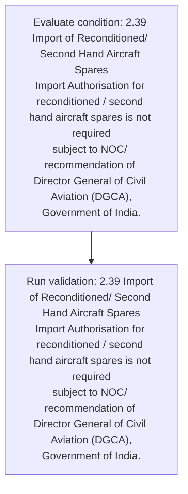
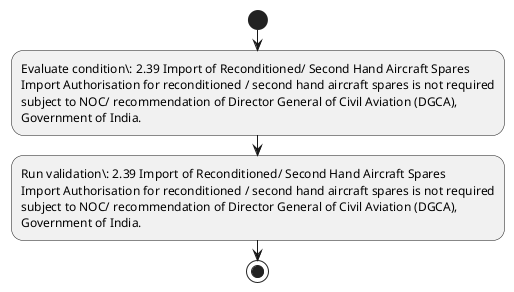

# Chapter 2 / Section 2.39: Import of Reconditioned/ Second Hand Aircraft Spares

**Chapter Title:** General Provisions Regarding Imports and Exports

**Pages:** 15

**Purpose:** 2.39 Import of Reconditioned/ Second Hand Aircraft Spares
Import Authorisation for reconditioned / second hand aircraft spares is not required
subject to NOC/ recommendation of Director General of Civil Aviation (DGCA),
Government of India.

**Purpose Thanglish:** Indha Import of Reconditioned/ Second Hand Aircraft Spares section-la, 2.39 import of Reconditioned/ Second Hand Aircraft Spares
import Authorisation for reconditioned / second hand aircraft spares is not required
subject to NOC/ recommendation of Director General of Civil Aviation (DGCA),
Government of India.

**Summary:** 2.39 Import of Reconditioned/ Second Hand Aircraft Spares
Import Authorisation for reconditioned / second hand aircraft spares is not required
subject to NOC/ recommendation of Director General of Civil Aviation (DGCA),
Government of India.

**Business Meaning:** Import of Reconditioned/ Second Hand Aircraft Spares governs how DGFT business controls should be applied, validated, and enforced.

**Business Explanation:** Import of Reconditioned/ Second Hand Aircraft Spares explains the operating rule set that DEKAI should enforce. Key control points include 2.39 Import of Reconditioned/ Second Hand Aircraft Spares
Import Authorisation for reconditioned / second hand aircraft spares is not required
subject to NOC/ recommendation of Director General of Civil Aviation (DGCA),
Government of India.

**Business Explanation Thanglish:** Indha Import of Reconditioned/ Second Hand Aircraft Spares section-la, import of Reconditioned/ Second Hand Aircraft Spares explains the operating rule set that DEKAI should enforce. Key control points include 2.39 import of Reconditioned/ Second Hand Aircraft Spares
import Authorisation for reconditioned / second hand aircraft spares is not required
subject to NOC/ recommendation of Director General of Civil Aviation (DGCA),
Government of India.

## Business Logic
- 2.39 Import of Reconditioned/ Second Hand Aircraft Spares
Import Authorisation for reconditioned / second hand aircraft spares is not required
subject to NOC/ recommendation of Director General of Civil Aviation (DGCA),
Government of India.

## Business Rules
- rule_id=CH2-SEC2_39-R001, rule_description=2.39 Import of Reconditioned/ Second Hand Aircraft Spares
Import Authorisation for reconditioned / second hand aircraft spares is not required
subject to NOC/ recommendation of Director General of Civil Aviation (DGCA),
Government of India., trigger=Import of Reconditioned/ Second Hand Aircraft Spares, condition=2.39 Import of Reconditioned/ Second Hand Aircraft Spares
Import Authorisation for reconditioned / second hand aircraft spares is not required
subject to NOC/ recommendation of Director General of Civil Aviation (DGCA),
Government of India., validation=2.39 Import of Reconditioned/ Second Hand Aircraft Spares
Import Authorisation for reconditioned / second hand aircraft spares is not required
subject to NOC/ recommendation of Director General of Civil Aviation (DGCA),
Government of India., action=Manual review required., exception=No explicit exception found in uploaded documents., output=DEKAI should produce a compliance decision for 2.39 - Import of Reconditioned/ Second Hand Aircraft Spares.

## Conditions
- 2.39 Import of Reconditioned/ Second Hand Aircraft Spares
Import Authorisation for reconditioned / second hand aircraft spares is not required
subject to NOC/ recommendation of Director General of Civil Aviation (DGCA),
Government of India.

## Condition Logic
- id=2.2.39.1, if=2.39 Import of Reconditioned/ Second Hand Aircraft Spares
Import Authorisation for reconditioned / second hand aircraft spares is not required
subject to NOC/ recommendation of Director General of Civil Aviation (DGCA),
Government of India., then=Route for review, source=2.39 Import of Reconditioned/ Second Hand Aircraft Spares
Import Authorisation for reconditioned / second hand aircraft spares is not required
subject to NOC/ recommendation of Director General of Civil Aviation (DGCA),
Government of India.

## Validations
- 2.39 Import of Reconditioned/ Second Hand Aircraft Spares
Import Authorisation for reconditioned / second hand aircraft spares is not required
subject to NOC/ recommendation of Director General of Civil Aviation (DGCA),
Government of India.

## Exceptions
- None identified

## Dependencies
- None identified

## Authorities
- None identified

## Required Documents
- None identified

## Timelines
- None identified

## Actions
- None identified

## Workflow
- Evaluate condition: 2.39 Import of Reconditioned/ Second Hand Aircraft Spares
Import Authorisation for reconditioned / second hand aircraft spares is not required
subject to NOC/ recommendation of Director General of Civil Aviation (DGCA),
Government of India.
- Run validation: 2.39 Import of Reconditioned/ Second Hand Aircraft Spares
Import Authorisation for reconditioned / second hand aircraft spares is not required
subject to NOC/ recommendation of Director General of Civil Aviation (DGCA),
Government of India.

## Workflow ASCII
```text
Import of Reconditioned/ Second Hand Aircraft Spares
Evaluate condition: 2.39 Import of Reconditioned/ Second Hand Aircraft Spares
Import Authorisation for reconditioned / second hand aircraft spares is not required
subject to NOC/ recommendation of Director General of Civil Aviation (DGCA),
Government of India.
   |
   v
Run validation: 2.39 Import of Reconditioned/ Second Hand Aircraft Spares
Import Authorisation for reconditioned / second hand aircraft spares is not required
subject to NOC/ recommendation of Director General of Civil Aviation (DGCA),
Government of India.
```

## Decision Tree
- IF section 2.39 applies THEN proceed with standard DGFT workflow

## Decision Tree ASCII
```text
Import of Reconditioned/ Second Hand Aircraft Spares Decision
IF section 2.39 applies THEN proceed with standard DGFT workflow
```

## Examples
- User asks to process Import of Reconditioned/ Second Hand Aircraft Spares; the platform checks conditions, validations, and documents before action.

**Real-world Example:** Example: an importer or exporter invokes Import of Reconditioned/ Second Hand Aircraft Spares, submits the prescribed DGFT records, and DEKAI uses the extracted rules to follow the import of reconditioned/ second hand aircraft spares process.

**Real-world Example Thanglish:** Indha Import of Reconditioned/ Second Hand Aircraft Spares section-la, Example: an importer or exporter invokes import of Reconditioned/ Second Hand Aircraft Spares, submits the prescribed DGFT records, and DEKAI uses the extracted rules to follow the import of reconditioned/ second hand aircraft spares process.

## AI Rules
- IF detected context matches section rule THEN enforce: 2.39 Import of Reconditioned/ Second Hand Aircraft Spares
Import Authorisation for reconditioned / second hand aircraft spares is not required
subject to NOC/ recommendation of Director General of Civil Aviation (DGCA),
Government of India.

## Database Fields
- name=section_code, type=string, required=True, source=parsed_section_heading
- name=section_title, type=string, required=True, source=parsed_section_heading
- name=for_flag, type=boolean, required=False, source=keyword:for
- name=not_flag, type=boolean, required=False, source=keyword:not
- name=noc_flag, type=boolean, required=False, source=keyword:NOC
- name=hand_flag, type=boolean, required=False, source=keyword:Hand
- name=dgca_flag, type=boolean, required=False, source=keyword:DGCA
- name=civil_flag, type=boolean, required=False, source=keyword:Civil
- name=india_flag, type=boolean, required=False, source=keyword:India
- name=import_flag, type=boolean, required=False, source=keyword:Import

## API Requirements
- method=GET, path=/api/dgft/sections/2.39, purpose=Retrieve knowledge payload for section 2.39, query_params=['include=workflow,decision_tree,validations'], response_fields=['section', 'title', 'summary', 'conditions', 'validations', 'exceptions', 'workflow', 'decision_tree']
- method=POST, path=/api/dgft/Import-of-Reconditioned-Second-Hand-Aircraft-Spares/validate, purpose=Validate inputs and documents for Import of Reconditioned/ Second Hand Aircraft Spares, request_fields=['section_code', 'section_title'], response_fields=['status', 'errors', 'warnings', 'next_actions']

## UI Screens
- screen_id=Import_of_Reconditioned_Second_Hand_Aircraft_Spares_overview, name=Import of Reconditioned/ Second Hand Aircraft Spares Overview, purpose=Show section summary, authority, timeline, and eligibility cues., widgets=['summary_card', 'conditions_table', 'authority_badges', 'timeline_panel']
- screen_id=Import_of_Reconditioned_Second_Hand_Aircraft_Spares_submission, name=Import of Reconditioned/ Second Hand Aircraft Spares Submission, purpose=Capture applicant data and supporting documents., widgets=['dynamic_form', 'document_uploader', 'validation_panel', 'next_action_footer'], fields=['section_code', 'section_title', 'for_flag', 'not_flag', 'noc_flag', 'hand_flag', 'dgca_flag', 'civil_flag']

## Error Messages
- Validation failed because the section requirements were not fully met.

## FAQ
- question_en=What is the purpose of section 2.39?, answer_en=Import of Reconditioned/ Second Hand Aircraft Spares explains the operating rule set that DEKAI should enforce. Key control points include 2.39 Import of Reconditioned/ Second Hand Aircraft Spares
Import Authorisation for reconditioned / second hand aircraft spares is not required
subject to NOC/ recommendation of Director General of Civil Aviation (DGCA),
Government of India., question_thanglish=Indha Import of Reconditioned/ Second Hand Aircraft Spares section-la, What is the purpose of section 2.39?, answer_thanglish=Indha Import of Reconditioned/ Second Hand Aircraft Spares section-la, import of Reconditioned/ Second Hand Aircraft Spares explains the operating rule set that DEKAI should enforce. Key control points include 2.39 import of Reconditioned/ Second Hand Aircraft Spares
import Authorisation for reconditioned / second hand aircraft spares is not required
subject to NOC/ recommendation of Director General of Civil Aviation (DGCA),
Government of India.
- question_en=What documents are required under Import of Reconditioned/ Second Hand Aircraft Spares?, answer_en=Not explicitly covered in uploaded documents., question_thanglish=Indha Import of Reconditioned/ Second Hand Aircraft Spares section-la, What documents are required under import of Reconditioned/ Second Hand Aircraft Spares?, answer_thanglish=Indha Import of Reconditioned/ Second Hand Aircraft Spares section-la, Not explicitly covered in uploaded documents.
- question_en=Which authority handles Import of Reconditioned/ Second Hand Aircraft Spares?, answer_en=Not explicitly covered in uploaded documents., question_thanglish=Indha Import of Reconditioned/ Second Hand Aircraft Spares section-la, Which authority handles import of Reconditioned/ Second Hand Aircraft Spares?, answer_thanglish=Indha Import of Reconditioned/ Second Hand Aircraft Spares section-la, Not explicitly covered in uploaded documents.

## Questions Users May Ask
- What does Import of Reconditioned/ Second Hand Aircraft Spares require?
- Which documents are needed for Import of Reconditioned/ Second Hand Aircraft Spares?
- How does DEKAI validate Import of Reconditioned/ Second Hand Aircraft Spares requests?

## Expected AI Answers
- Import of Reconditioned/ Second Hand Aircraft Spares requires the platform to interpret the section text, apply the extracted business rules, and present the correct next action.
- Required documents are inferred from the section text: no explicit documents were detected.
- DEKAI validates Import of Reconditioned/ Second Hand Aircraft Spares by checking conditions, required documents, authority references, and exception clauses before recommending an outcome.

## AI Q&A Examples
- question_en=User asks: How do I comply with Import of Reconditioned/ Second Hand Aircraft Spares?, answer_en=AI answers: DEKAI should evaluate section 2.39, apply the extracted rules, and guide the user through Evaluate condition: 2.39 Import of Reconditioned/ Second Hand Aircraft Spares
Import Authorisation for reconditioned / second hand aircraft spares is not required
subject to NOC/ recommendation of Director General of Civil Aviation (DGCA),
Government of India.., question_thanglish=Indha Import of Reconditioned/ Second Hand Aircraft Spares section-la, User asks: How do I comply with import of Reconditioned/ Second Hand Aircraft Spares?, answer_thanglish=Indha Import of Reconditioned/ Second Hand Aircraft Spares section-la, AI answers: DEKAI should evaluate section 2.39, apply the extracted rules, and guide the user through Evaluate condition: 2.39 import of Reconditioned/ Second Hand Aircraft Spares
import Authorisation for reconditioned / second hand aircraft spares is not required
subject to NOC/ recommendation of Director General of Civil Aviation (DGCA),
Government of India..
- question_en=User asks: Which validations apply to Import of Reconditioned/ Second Hand Aircraft Spares?, answer_en=AI answers: Applicable validations are 2.39 Import of Reconditioned/ Second Hand Aircraft Spares
Import Authorisation for reconditioned / second hand aircraft spares is not required
subject to NOC/ recommendation of Director General of Civil Aviation (DGCA),
Government of India., question_thanglish=Indha Import of Reconditioned/ Second Hand Aircraft Spares section-la, User asks: Which validations apply to import of Reconditioned/ Second Hand Aircraft Spares?, answer_thanglish=Indha Import of Reconditioned/ Second Hand Aircraft Spares section-la, AI answers: Applicable validations are 2.39 import of Reconditioned/ Second Hand Aircraft Spares
import Authorisation for reconditioned / second hand aircraft spares is not required
subject to NOC/ recommendation of Director General of Civil Aviation (DGCA),
Government of India.

## DEKAI AI Implementation Notes
- Capture chapter 2, section 2.39, title, and page references as immutable knowledge metadata.
- Bind validations for Import of Reconditioned/ Second Hand Aircraft Spares into a rule engine keyed by the rule IDs extracted for this section.

## DEKAI AI Implementation Notes Thanglish
- Indha Import of Reconditioned/ Second Hand Aircraft Spares section-la, Capture chapter 2, section 2.39, title, and page references as immutable knowledge metadata.
- Indha Import of Reconditioned/ Second Hand Aircraft Spares section-la, Bind validations for import of Reconditioned/ Second Hand Aircraft Spares into a rule engine keyed by the rule IDs extracted for this section.

## AI Metadata
- Keywords: for, not, NOC, Hand, DGCA, Civil, India, Import, Second, Spares, subject, General, Aircraft, required, Director, Aviation, Government, Reconditioned, Authorisation, recommendation
- Search Keywords: for, not, NOC, Hand, DGCA, Civil, India, Import, Second, Spares, subject, General, Aircraft, required, Director, Aviation, Government, Reconditioned, Authorisation, recommendation
- Intent: Provide knowledge guidance for Import of Reconditioned/ Second Hand Aircraft Spares.
- Tags: 2.39, Import of Reconditioned/ Second Hand Aircraft Spares, business-rule, dgft
- Related Sections: 
- Related Chapters: 
- Related Rules: 2.39 Import of Reconditioned/ Second Hand Aircraft Spares
Import Authorisation for reconditioned / second hand aircraft spares is not required
subject to NOC/ recommendation of Director General of Civil Aviation (DGCA),
Government of India.

## Mermaid


## PlantUML

