# Chapter 2 / Section 2.40: Import of Replacement Goods

**Chapter Title:** General Provisions Regarding Imports and Exports

**Pages:** 15

**Purpose:** 2.40 Import of Replacement Goods
Goods or parts thereof on being imported and found defective or otherwise unfit for use
or which have been damaged after import, may be exported without an Authorisation,
and goods in replacement thereof may be supplied free of charge by foreign suppliers
or imported against a marine insurance or marine-cum-erection insurance claim settled
by an insurance company.

**Purpose Thanglish:** Indha Import of Replacement Goods section-la, 2.40 import of Replacement Goods
Goods or parts thereof on being imported and found defective or otherwise unfit for use
or which have been damaged after import, may be exported without an Authorisation,
and goods in replacement thereof may be supplied free of charge by foreign suppliers
or imported against a marine insurance or marine-cum-erection insurance claim settled
by an insurance company.

**Summary:** 2.40 Import of Replacement Goods
Goods or parts thereof on being imported and found defective or otherwise unfit for use
or which have been damaged after import, may be exported without an Authorisation,
and goods in replacement thereof may be supplied free of charge by foreign suppliers
or imported against a marine insurance or marine-cum-erection insurance claim settled
by an insurance company. Such goods shall be allowed clearance by the customs
authorities without an import Authorisation provided that:
(a) Shipment of replacement goods is made within 24 months from date of clearance
of previously imported goods through Customs or within guarantee period in
case of machines or parts thereof where such period is more than 24 months;
and
(b) No remittance shall be allowed except for payment of insurance and freight
charges where replacement of goods by foreign suppliers is subject to payment
of insurance and / or freight by importer and documentary evidence to this effect
is produced while making remittance. 2.40 Import of Replacement Goods
Goods or parts thereof on being imported and found defective or otherwise unfit for use
or which have been damaged after import, may be exported without an Authorisation,
and goods in replacement thereof may be supplied free of charge by foreign suppliers
or imported against a marine insurance or marine-cum-erection insurance claim settled
by an insurance company.

**Business Meaning:** Import of Replacement Goods governs how DGFT business controls should be applied, validated, and enforced.

**Business Explanation:** Import of Replacement Goods explains the operating rule set that DEKAI should enforce. Key control points include Such goods shall be allowed clearance by the customs
authorities without an import Authorisation provided that:
(a) Shipment of replacement goods is made within 24 months from date of clearance
of previously imported goods through Customs or within guarantee period in
case of machines or parts thereof where such period is more than 24 months;
and
(b) No remittance shall be allowed except for payment of insurance and freight
charges where replacement of goods by foreign suppliers is subject to payment
of insurance and / or freight by importer and documentary evidence to this effect
is produced while making remittance. The section also drives actions such as Such goods shall be allowed clearance by the customs
authorities without an import Authorisation provided that:
(a) Shipment of replacement goods is made within 24 months from date of clearance
of previously imported goods through Customs or within guarantee period in
case of machines or parts thereof where such period is more than 24 months;
and
(b) No remittance shall be allowed except for payment of insurance and freight
charges where replacement of goods by foreign suppliers is subject to payment
of insurance and / or freight by importer and documentary evidence to this effect
is produced while making remittance..

**Business Explanation Thanglish:** Indha Import of Replacement Goods section-la, import of Replacement Goods explains the operating rule set that DEKAI should enforce. Key control points include Such goods kandippa be allowed clearance by the customs
authorities without an import Authorisation provided that:
(a) Shipment of replacement goods is made within 24 months from date of clearance
of previously imported goods through Customs or within guarantee period in
case of machines or parts thereof where such period is more than 24 months;
and
(b) No remittance kandippa be allowed except for payment of insurance and freight
charges where replacement of goods by foreign suppliers is subject to payment
of insurance and / or freight by importer and documentary evidence to this effect
is produced while making remittance. The section also drives actions such as Such goods kandippa be allowed clearance by the customs
authorities without an import Authorisation provided that:
(a) Shipment of replacement goods is made within 24 months from date of clearance
of previously imported goods through Customs or within guarantee period in
case of machines or parts thereof where such period is more than 24 months;
and
(b) No remittance kandippa be allowed except for payment of insurance and freight
charges where replacement of goods by foreign suppliers is subject to payment
of insurance and / or freight by importer and documentary evidence to this effect
is produced while making remittance..

## Business Logic
- Such goods shall be allowed clearance by the customs
authorities without an import Authorisation provided that:
(a) Shipment of replacement goods is made within 24 months from date of clearance
of previously imported goods through Customs or within guarantee period in
case of machines or parts thereof where such period is more than 24 months;
and
(b) No remittance shall be allowed except for payment of insurance and freight
charges where replacement of goods by foreign suppliers is subject to payment
of insurance and / or freight by importer and documentary evidence to this effect
is produced while making remittance.
- Such goods shall be allowed clearance by the customs
authorities without an import Authorisation provided that:
(a)
Shipment of replacement goods is made within 24 months from date of clearance
of previously imported goods through Customs or within guarantee period in
case of machines or parts thereof where such period is more than 24 months;
and
(b)
No remittance shall be allowed except for payment of insurance and freight
charges where replacement of goods by foreign suppliers is subject to payment
of insurance and / or freight by importer and documentary evidence to this effect
is produced while making remittance.

## Business Rules
- rule_id=CH2-SEC2_40-R001, rule_description=Such goods shall be allowed clearance by the customs
authorities without an import Authorisation provided that:
(a) Shipment of replacement goods is made within 24 months from date of clearance
of previously imported goods through Customs or within guarantee period in
case of machines or parts thereof where such period is more than 24 months;
and
(b) No remittance shall be allowed except for payment of insurance and freight
charges where replacement of goods by foreign suppliers is subject to payment
of insurance and / or freight by importer and documentary evidence to this effect
is produced while making remittance., trigger=Import of Replacement Goods, condition=2.40 Import of Replacement Goods
Goods or parts thereof on being imported and found defective or otherwise unfit for use
or which have been damaged after import, may be exported without an Authorisation,
and goods in replacement thereof may be supplied free of charge by foreign suppliers
or imported against a marine insurance or marine-cum-erection insurance claim settled
by an insurance company., validation=Such goods shall be allowed clearance by the customs
authorities without an import Authorisation provided that:
(a) Shipment of replacement goods is made within 24 months from date of clearance
of previously imported goods through Customs or within guarantee period in
case of machines or parts thereof where such period is more than 24 months;
and
(b) No remittance shall be allowed except for payment of insurance and freight
charges where replacement of goods by foreign suppliers is subject to payment
of insurance and / or freight by importer and documentary evidence to this effect
is produced while making remittance., action=Such goods shall be allowed clearance by the customs
authorities without an import Authorisation provided that:
(a) Shipment of replacement goods is made within 24 months from date of clearance
of previously imported goods through Customs or within guarantee period in
case of machines or parts thereof where such period is more than 24 months;
and
(b) No remittance shall be allowed except for payment of insurance and freight
charges where replacement of goods by foreign suppliers is subject to payment
of insurance and / or freight by importer and documentary evidence to this effect
is produced while making remittance., exception=Such goods shall be allowed clearance by the customs
authorities without an import Authorisation provided that:
(a) Shipment of replacement goods is made within 24 months from date of clearance
of previously imported goods through Customs or within guarantee period in
case of machines or parts thereof where such period is more than 24 months;
and
(b) No remittance shall be allowed except for payment of insurance and freight
charges where replacement of goods by foreign suppliers is subject to payment
of insurance and / or freight by importer and documentary evidence to this effect
is produced while making remittance., output=DEKAI should produce a compliance decision for 2.40 - Import of Replacement Goods.
- rule_id=CH2-SEC2_40-R002, rule_description=Such goods shall be allowed clearance by the customs
authorities without an import Authorisation provided that:
(a)
Shipment of replacement goods is made within 24 months from date of clearance
of previously imported goods through Customs or within guarantee period in
case of machines or parts thereof where such period is more than 24 months;
and
(b)
No remittance shall be allowed except for payment of insurance and freight
charges where replacement of goods by foreign suppliers is subject to payment
of insurance and / or freight by importer and documentary evidence to this effect
is produced while making remittance., trigger=Import of Replacement Goods, condition=Such goods shall be allowed clearance by the customs
authorities without an import Authorisation provided that:
(a) Shipment of replacement goods is made within 24 months from date of clearance
of previously imported goods through Customs or within guarantee period in
case of machines or parts thereof where such period is more than 24 months;
and
(b) No remittance shall be allowed except for payment of insurance and freight
charges where replacement of goods by foreign suppliers is subject to payment
of insurance and / or freight by importer and documentary evidence to this effect
is produced while making remittance., validation=Such goods shall be allowed clearance by the customs
authorities without an import Authorisation provided that:
(a)
Shipment of replacement goods is made within 24 months from date of clearance
of previously imported goods through Customs or within guarantee period in
case of machines or parts thereof where such period is more than 24 months;
and
(b)
No remittance shall be allowed except for payment of insurance and freight
charges where replacement of goods by foreign suppliers is subject to payment
of insurance and / or freight by importer and documentary evidence to this effect
is produced while making remittance., action=Such goods shall be allowed clearance by the customs
authorities without an import Authorisation provided that:
(a)
Shipment of replacement goods is made within 24 months from date of clearance
of previously imported goods through Customs or within guarantee period in
case of machines or parts thereof where such period is more than 24 months;
and
(b)
No remittance shall be allowed except for payment of insurance and freight
charges where replacement of goods by foreign suppliers is subject to payment
of insurance and / or freight by importer and documentary evidence to this effect
is produced while making remittance., exception=Such goods shall be allowed clearance by the customs
authorities without an import Authorisation provided that:
(a)
Shipment of replacement goods is made within 24 months from date of clearance
of previously imported goods through Customs or within guarantee period in
case of machines or parts thereof where such period is more than 24 months;
and
(b)
No remittance shall be allowed except for payment of insurance and freight
charges where replacement of goods by foreign suppliers is subject to payment
of insurance and / or freight by importer and documentary evidence to this effect
is produced while making remittance., output=DEKAI should produce a compliance decision for 2.40 - Import of Replacement Goods.

## Conditions
- 2.40 Import of Replacement Goods
Goods or parts thereof on being imported and found defective or otherwise unfit for use
or which have been damaged after import, may be exported without an Authorisation,
and goods in replacement thereof may be supplied free of charge by foreign suppliers
or imported against a marine insurance or marine-cum-erection insurance claim settled
by an insurance company.
- Such goods shall be allowed clearance by the customs
authorities without an import Authorisation provided that:
(a) Shipment of replacement goods is made within 24 months from date of clearance
of previously imported goods through Customs or within guarantee period in
case of machines or parts thereof where such period is more than 24 months;
and
(b) No remittance shall be allowed except for payment of insurance and freight
charges where replacement of goods by foreign suppliers is subject to payment
of insurance and / or freight by importer and documentary evidence to this effect
is produced while making remittance.
- Such goods shall be allowed clearance by the customs
authorities without an import Authorisation provided that:
(a)
Shipment of replacement goods is made within 24 months from date of clearance
of previously imported goods through Customs or within guarantee period in
case of machines or parts thereof where such period is more than 24 months;
and
(b)
No remittance shall be allowed except for payment of insurance and freight
charges where replacement of goods by foreign suppliers is subject to payment
of insurance and / or freight by importer and documentary evidence to this effect
is produced while making remittance.

## Condition Logic
- id=2.2.40.1, if=2.40 Import of Replacement Goods
Goods or parts thereof on being imported and found defective or otherwise unfit for use
or which have been damaged after import, may be exported without an Authorisation,
and goods in replacement thereof may be supplied free of charge by foreign suppliers
or imported against a marine insurance or marine-cum-erection insurance claim settled
by an insurance company., then=Such goods shall be allowed clearance by the customs
authorities without an import Authorisation provided that:
(a) Shipment of replacement goods is made within 24 months from date of clearance
of previously imported goods through Customs or within guarantee period in
case of machines or parts thereof where such period is more than 24 months;
and
(b) No remittance shall be allowed except for payment of insurance and freight
charges where replacement of goods by foreign suppliers is subject to payment
of insurance and / or freight by importer and documentary evidence to this effect
is produced while making remittance., source=2.40 Import of Replacement Goods
Goods or parts thereof on being imported and found defective or otherwise unfit for use
or which have been damaged after import, may be exported without an Authorisation,
and goods in replacement thereof may be supplied free of charge by foreign suppliers
or imported against a marine insurance or marine-cum-erection insurance claim settled
by an insurance company.
- id=2.2.40.2, if=Such goods shall be allowed clearance by the customs
authorities without an import Authorisation provided that:
(a) Shipment of replacement goods is made within 24 months from date of clearance
of previously imported goods through Customs or within guarantee period in
case of machines or parts thereof where such period is more than 24 months;
and
(b) No remittance shall be allowed except for payment of insurance and freight
charges where replacement of goods by foreign suppliers is subject to payment
of insurance and / or freight by importer and documentary evidence to this effect
is produced while making remittance., then=Such goods shall be allowed clearance by the customs
authorities without an import Authorisation provided that:
(a) Shipment of replacement goods is made within 24 months from date of clearance
of previously imported goods through Customs or within guarantee period in
case of machines or parts thereof where such period is more than 24 months;
and
(b) No remittance shall be allowed except for payment of insurance and freight
charges where replacement of goods by foreign suppliers is subject to payment
of insurance and / or freight by importer and documentary evidence to this effect
is produced while making remittance., source=Such goods shall be allowed clearance by the customs
authorities without an import Authorisation provided that:
(a) Shipment of replacement goods is made within 24 months from date of clearance
of previously imported goods through Customs or within guarantee period in
case of machines or parts thereof where such period is more than 24 months;
and
(b) No remittance shall be allowed except for payment of insurance and freight
charges where replacement of goods by foreign suppliers is subject to payment
of insurance and / or freight by importer and documentary evidence to this effect
is produced while making remittance.
- id=2.2.40.3, if=Such goods shall be allowed clearance by the customs
authorities without an import Authorisation provided that:
(a)
Shipment of replacement goods is made within 24 months from date of clearance
of previously imported goods through Customs or within guarantee period in
case of machines or parts thereof where such period is more than 24 months;
and
(b)
No remittance shall be allowed except for payment of insurance and freight
charges where replacement of goods by foreign suppliers is subject to payment
of insurance and / or freight by importer and documentary evidence to this effect
is produced while making remittance., then=Such goods shall be allowed clearance by the customs
authorities without an import Authorisation provided that:
(a) Shipment of replacement goods is made within 24 months from date of clearance
of previously imported goods through Customs or within guarantee period in
case of machines or parts thereof where such period is more than 24 months;
and
(b) No remittance shall be allowed except for payment of insurance and freight
charges where replacement of goods by foreign suppliers is subject to payment
of insurance and / or freight by importer and documentary evidence to this effect
is produced while making remittance., source=Such goods shall be allowed clearance by the customs
authorities without an import Authorisation provided that:
(a)
Shipment of replacement goods is made within 24 months from date of clearance
of previously imported goods through Customs or within guarantee period in
case of machines or parts thereof where such period is more than 24 months;
and
(b)
No remittance shall be allowed except for payment of insurance and freight
charges where replacement of goods by foreign suppliers is subject to payment
of insurance and / or freight by importer and documentary evidence to this effect
is produced while making remittance.

## Validations
- Such goods shall be allowed clearance by the customs
authorities without an import Authorisation provided that:
(a) Shipment of replacement goods is made within 24 months from date of clearance
of previously imported goods through Customs or within guarantee period in
case of machines or parts thereof where such period is more than 24 months;
and
(b) No remittance shall be allowed except for payment of insurance and freight
charges where replacement of goods by foreign suppliers is subject to payment
of insurance and / or freight by importer and documentary evidence to this effect
is produced while making remittance.
- Such goods shall be allowed clearance by the customs
authorities without an import Authorisation provided that:
(a)
Shipment of replacement goods is made within 24 months from date of clearance
of previously imported goods through Customs or within guarantee period in
case of machines or parts thereof where such period is more than 24 months;
and
(b)
No remittance shall be allowed except for payment of insurance and freight
charges where replacement of goods by foreign suppliers is subject to payment
of insurance and / or freight by importer and documentary evidence to this effect
is produced while making remittance.

## Exceptions
- Such goods shall be allowed clearance by the customs
authorities without an import Authorisation provided that:
(a) Shipment of replacement goods is made within 24 months from date of clearance
of previously imported goods through Customs or within guarantee period in
case of machines or parts thereof where such period is more than 24 months;
and
(b) No remittance shall be allowed except for payment of insurance and freight
charges where replacement of goods by foreign suppliers is subject to payment
of insurance and / or freight by importer and documentary evidence to this effect
is produced while making remittance.
- Such goods shall be allowed clearance by the customs
authorities without an import Authorisation provided that:
(a)
Shipment of replacement goods is made within 24 months from date of clearance
of previously imported goods through Customs or within guarantee period in
case of machines or parts thereof where such period is more than 24 months;
and
(b)
No remittance shall be allowed except for payment of insurance and freight
charges where replacement of goods by foreign suppliers is subject to payment
of insurance and / or freight by importer and documentary evidence to this effect
is produced while making remittance.

## Dependencies
- None identified

## Authorities
- customs

## Required Documents
- Such goods shall be allowed clearance by the customs
authorities without an import Authorisation provided that:
(a) Shipment of replacement goods is made within 24 months from date of clearance
of previously imported goods through Customs or within guarantee period in
case of machines or parts thereof where such period is more than 24 months;
and
(b) No remittance shall be allowed except for payment of insurance and freight
charges where replacement of goods by foreign suppliers is subject to payment
of insurance and / or freight by importer and documentary evidence to this effect
is produced while making remittance.
- Such goods shall be allowed clearance by the customs
authorities without an import Authorisation provided that:
(a)
Shipment of replacement goods is made within 24 months from date of clearance
of previously imported goods through Customs or within guarantee period in
case of machines or parts thereof where such period is more than 24 months;
and
(b)
No remittance shall be allowed except for payment of insurance and freight
charges where replacement of goods by foreign suppliers is subject to payment
of insurance and / or freight by importer and documentary evidence to this effect
is produced while making remittance.

## Timelines
- 2.40 Import of Replacement Goods
Goods or parts thereof on being imported and found defective or otherwise unfit for use
or which have been damaged after import, may be exported without an Authorisation,
and goods in replacement thereof may be supplied free of charge by foreign suppliers
or imported against a marine insurance or marine-cum-erection insurance claim settled
by an insurance company.
- Such goods shall be allowed clearance by the customs
authorities without an import Authorisation provided that:
(a) Shipment of replacement goods is made within 24 months from date of clearance
of previously imported goods through Customs or within guarantee period in
case of machines or parts thereof where such period is more than 24 months;
and
(b) No remittance shall be allowed except for payment of insurance and freight
charges where replacement of goods by foreign suppliers is subject to payment
of insurance and / or freight by importer and documentary evidence to this effect
is produced while making remittance.
- Such goods shall be allowed clearance by the customs
authorities without an import Authorisation provided that:
(a)
Shipment of replacement goods is made within 24 months from date of clearance
of previously imported goods through Customs or within guarantee period in
case of machines or parts thereof where such period is more than 24 months;
and
(b)
No remittance shall be allowed except for payment of insurance and freight
charges where replacement of goods by foreign suppliers is subject to payment
of insurance and / or freight by importer and documentary evidence to this effect
is produced while making remittance.

## Actions
- Such goods shall be allowed clearance by the customs
authorities without an import Authorisation provided that:
(a) Shipment of replacement goods is made within 24 months from date of clearance
of previously imported goods through Customs or within guarantee period in
case of machines or parts thereof where such period is more than 24 months;
and
(b) No remittance shall be allowed except for payment of insurance and freight
charges where replacement of goods by foreign suppliers is subject to payment
of insurance and / or freight by importer and documentary evidence to this effect
is produced while making remittance.
- Such goods shall be allowed clearance by the customs
authorities without an import Authorisation provided that:
(a)
Shipment of replacement goods is made within 24 months from date of clearance
of previously imported goods through Customs or within guarantee period in
case of machines or parts thereof where such period is more than 24 months;
and
(b)
No remittance shall be allowed except for payment of insurance and freight
charges where replacement of goods by foreign suppliers is subject to payment
of insurance and / or freight by importer and documentary evidence to this effect
is produced while making remittance.

## Workflow
- Evaluate condition: 2.40 Import of Replacement Goods
Goods or parts thereof on being imported and found defective or otherwise unfit for use
or which have been damaged after import, may be exported without an Authorisation,
and goods in replacement thereof may be supplied free of charge by foreign suppliers
or imported against a marine insurance or marine-cum-erection insurance claim settled
by an insurance company.
- Evaluate condition: Such goods shall be allowed clearance by the customs
authorities without an import Authorisation provided that:
(a) Shipment of replacement goods is made within 24 months from date of clearance
of previously imported goods through Customs or within guarantee period in
case of machines or parts thereof where such period is more than 24 months;
and
(b) No remittance shall be allowed except for payment of insurance and freight
charges where replacement of goods by foreign suppliers is subject to payment
of insurance and / or freight by importer and documentary evidence to this effect
is produced while making remittance.
- Evaluate condition: Such goods shall be allowed clearance by the customs
authorities without an import Authorisation provided that:
(a)
Shipment of replacement goods is made within 24 months from date of clearance
of previously imported goods through Customs or within guarantee period in
case of machines or parts thereof where such period is more than 24 months;
and
(b)
No remittance shall be allowed except for payment of insurance and freight
charges where replacement of goods by foreign suppliers is subject to payment
of insurance and / or freight by importer and documentary evidence to this effect
is produced while making remittance.
- Such goods shall be allowed clearance by the customs
authorities without an import Authorisation provided that:
(a) Shipment of replacement goods is made within 24 months from date of clearance
of previously imported goods through Customs or within guarantee period in
case of machines or parts thereof where such period is more than 24 months;
and
(b) No remittance shall be allowed except for payment of insurance and freight
charges where replacement of goods by foreign suppliers is subject to payment
of insurance and / or freight by importer and documentary evidence to this effect
is produced while making remittance.
- Such goods shall be allowed clearance by the customs
authorities without an import Authorisation provided that:
(a)
Shipment of replacement goods is made within 24 months from date of clearance
of previously imported goods through Customs or within guarantee period in
case of machines or parts thereof where such period is more than 24 months;
and
(b)
No remittance shall be allowed except for payment of insurance and freight
charges where replacement of goods by foreign suppliers is subject to payment
of insurance and / or freight by importer and documentary evidence to this effect
is produced while making remittance.
- Run validation: Such goods shall be allowed clearance by the customs
authorities without an import Authorisation provided that:
(a) Shipment of replacement goods is made within 24 months from date of clearance
of previously imported goods through Customs or within guarantee period in
case of machines or parts thereof where such period is more than 24 months;
and
(b) No remittance shall be allowed except for payment of insurance and freight
charges where replacement of goods by foreign suppliers is subject to payment
of insurance and / or freight by importer and documentary evidence to this effect
is produced while making remittance.
- Run validation: Such goods shall be allowed clearance by the customs
authorities without an import Authorisation provided that:
(a)
Shipment of replacement goods is made within 24 months from date of clearance
of previously imported goods through Customs or within guarantee period in
case of machines or parts thereof where such period is more than 24 months;
and
(b)
No remittance shall be allowed except for payment of insurance and freight
charges where replacement of goods by foreign suppliers is subject to payment
of insurance and / or freight by importer and documentary evidence to this effect
is produced while making remittance.
- Handle exception: Such goods shall be allowed clearance by the customs
authorities without an import Authorisation provided that:
(a) Shipment of replacement goods is made within 24 months from date of clearance
of previously imported goods through Customs or within guarantee period in
case of machines or parts thereof where such period is more than 24 months;
and
(b) No remittance shall be allowed except for payment of insurance and freight
charges where replacement of goods by foreign suppliers is subject to payment
of insurance and / or freight by importer and documentary evidence to this effect
is produced while making remittance.

## Workflow ASCII
```text
Import of Replacement Goods
Evaluate condition: 2.40 Import of Replacement Goods
Goods or parts thereof on being imported and found defective or otherwise unfit for use
or which have been damaged after import, may be exported without an Authorisation,
and goods in replacement thereof may be supplied free of charge by foreign suppliers
or imported against a marine insurance or marine-cum-erection insurance claim settled
by an insurance company.
   |
   v
Evaluate condition: Such goods shall be allowed clearance by the customs
authorities without an import Authorisation provided that:
(a) Shipment of replacement goods is made within 24 months from date of clearance
of previously imported goods through Customs or within guarantee period in
case of machines or parts thereof where such period is more than 24 months;
and
(b) No remittance shall be allowed except for payment of insurance and freight
charges where replacement of goods by foreign suppliers is subject to payment
of insurance and / or freight by importer and documentary evidence to this effect
is produced while making remittance.
   |
   v
Evaluate condition: Such goods shall be allowed clearance by the customs
authorities without an import Authorisation provided that:
(a)
Shipment of replacement goods is made within 24 months from date of clearance
of previously imported goods through Customs or within guarantee period in
case of machines or parts thereof where such period is more than 24 months;
and
(b)
No remittance shall be allowed except for payment of insurance and freight
charges where replacement of goods by foreign suppliers is subject to payment
of insurance and / or freight by importer and documentary evidence to this effect
is produced while making remittance.
   |
   v
Such goods shall be allowed clearance by the customs
authorities without an import Authorisation provided that:
(a) Shipment of replacement goods is made within 24 months from date of clearance
of previously imported goods through Customs or within guarantee period in
case of machines or parts thereof where such period is more than 24 months;
and
(b) No remittance shall be allowed except for payment of insurance and freight
charges where replacement of goods by foreign suppliers is subject to payment
of insurance and / or freight by importer and documentary evidence to this effect
is produced while making remittance.
   |
   v
Such goods shall be allowed clearance by the customs
authorities without an import Authorisation provided that:
(a)
Shipment of replacement goods is made within 24 months from date of clearance
of previously imported goods through Customs or within guarantee period in
case of machines or parts thereof where such period is more than 24 months;
and
(b)
No remittance shall be allowed except for payment of insurance and freight
charges where replacement of goods by foreign suppliers is subject to payment
of insurance and / or freight by importer and documentary evidence to this effect
is produced while making remittance.
   |
   v
Run validation: Such goods shall be allowed clearance by the customs
authorities without an import Authorisation provided that:
(a) Shipment of replacement goods is made within 24 months from date of clearance
of previously imported goods through Customs or within guarantee period in
case of machines or parts thereof where such period is more than 24 months;
and
(b) No remittance shall be allowed except for payment of insurance and freight
charges where replacement of goods by foreign suppliers is subject to payment
of insurance and / or freight by importer and documentary evidence to this effect
is produced while making remittance.
   |
   v
Run validation: Such goods shall be allowed clearance by the customs
authorities without an import Authorisation provided that:
(a)
Shipment of replacement goods is made within 24 months from date of clearance
of previously imported goods through Customs or within guarantee period in
case of machines or parts thereof where such period is more than 24 months;
and
(b)
No remittance shall be allowed except for payment of insurance and freight
charges where replacement of goods by foreign suppliers is subject to payment
of insurance and / or freight by importer and documentary evidence to this effect
is produced while making remittance.
   |
   v
Handle exception: Such goods shall be allowed clearance by the customs
authorities without an import Authorisation provided that:
(a) Shipment of replacement goods is made within 24 months from date of clearance
of previously imported goods through Customs or within guarantee period in
case of machines or parts thereof where such period is more than 24 months;
and
(b) No remittance shall be allowed except for payment of insurance and freight
charges where replacement of goods by foreign suppliers is subject to payment
of insurance and / or freight by importer and documentary evidence to this effect
is produced while making remittance.
```

## Decision Tree
- IF 2.40 Import of Replacement Goods
Goods or parts thereof on being imported and found defective or otherwise unfit for use
or which have been damaged after import, may be exported without an Authorisation,
and goods in replacement thereof may be supplied free of charge by foreign suppliers
or imported against a marine insurance or marine-cum-erection insurance claim settled
by an insurance company. THEN Such goods shall be allowed clearance by the customs
authorities without an import Authorisation provided that:
(a) Shipment of replacement goods is made within 24 months from date of clearance
of previously imported goods through Customs or within guarantee period in
case of machines or parts thereof where such period is more than 24 months;
and
(b) No remittance shall be allowed except for payment of insurance and freight
charges where replacement of goods by foreign suppliers is subject to payment
of insurance and / or freight by importer and documentary evidence to this effect
is produced while making remittance.
- IF Such goods shall be allowed clearance by the customs
authorities without an import Authorisation provided that:
(a) Shipment of replacement goods is made within 24 months from date of clearance
of previously imported goods through Customs or within guarantee period in
case of machines or parts thereof where such period is more than 24 months;
and
(b) No remittance shall be allowed except for payment of insurance and freight
charges where replacement of goods by foreign suppliers is subject to payment
of insurance and / or freight by importer and documentary evidence to this effect
is produced while making remittance. THEN Such goods shall be allowed clearance by the customs
authorities without an import Authorisation provided that:
(a) Shipment of replacement goods is made within 24 months from date of clearance
of previously imported goods through Customs or within guarantee period in
case of machines or parts thereof where such period is more than 24 months;
and
(b) No remittance shall be allowed except for payment of insurance and freight
charges where replacement of goods by foreign suppliers is subject to payment
of insurance and / or freight by importer and documentary evidence to this effect
is produced while making remittance.
- IF Such goods shall be allowed clearance by the customs
authorities without an import Authorisation provided that:
(a)
Shipment of replacement goods is made within 24 months from date of clearance
of previously imported goods through Customs or within guarantee period in
case of machines or parts thereof where such period is more than 24 months;
and
(b)
No remittance shall be allowed except for payment of insurance and freight
charges where replacement of goods by foreign suppliers is subject to payment
of insurance and / or freight by importer and documentary evidence to this effect
is produced while making remittance. THEN Such goods shall be allowed clearance by the customs
authorities without an import Authorisation provided that:
(a) Shipment of replacement goods is made within 24 months from date of clearance
of previously imported goods through Customs or within guarantee period in
case of machines or parts thereof where such period is more than 24 months;
and
(b) No remittance shall be allowed except for payment of insurance and freight
charges where replacement of goods by foreign suppliers is subject to payment
of insurance and / or freight by importer and documentary evidence to this effect
is produced while making remittance.
- IF exception applies (Such goods shall be allowed clearance by the customs
authorities without an import Authorisation provided that:
(a) Shipment of replacement goods is made within 24 months from date of clearance
of previously imported goods through Customs or within guarantee period in
case of machines or parts thereof where such period is more than 24 months;
and
(b) No remittance shall be allowed except for payment of insurance and freight
charges where replacement of goods by foreign suppliers is subject to payment
of insurance and / or freight by importer and documentary evidence to this effect
is produced while making remittance.) THEN route to manual review
- IF exception applies (Such goods shall be allowed clearance by the customs
authorities without an import Authorisation provided that:
(a)
Shipment of replacement goods is made within 24 months from date of clearance
of previously imported goods through Customs or within guarantee period in
case of machines or parts thereof where such period is more than 24 months;
and
(b)
No remittance shall be allowed except for payment of insurance and freight
charges where replacement of goods by foreign suppliers is subject to payment
of insurance and / or freight by importer and documentary evidence to this effect
is produced while making remittance.) THEN route to manual review

## Decision Tree ASCII
```text
Import of Replacement Goods Decision
IF 2.40 Import of Replacement Goods
Goods or parts thereof on being imported and found defective or otherwise unfit for use
or which have been damaged after import, may be exported without an Authorisation,
and goods in replacement thereof may be supplied free of charge by foreign suppliers
or imported against a marine insurance or marine-cum-erection insurance claim settled
by an insurance company. THEN Such goods shall be allowed clearance by the customs
authorities without an import Authorisation provided that:
(a) Shipment of replacement goods is made within 24 months from date of clearance
of previously imported goods through Customs or within guarantee period in
case of machines or parts thereof where such period is more than 24 months;
and
(b) No remittance shall be allowed except for payment of insurance and freight
charges where replacement of goods by foreign suppliers is subject to payment
of insurance and / or freight by importer and documentary evidence to this effect
is produced while making remittance.
   |
   v
IF Such goods shall be allowed clearance by the customs
authorities without an import Authorisation provided that:
(a) Shipment of replacement goods is made within 24 months from date of clearance
of previously imported goods through Customs or within guarantee period in
case of machines or parts thereof where such period is more than 24 months;
and
(b) No remittance shall be allowed except for payment of insurance and freight
charges where replacement of goods by foreign suppliers is subject to payment
of insurance and / or freight by importer and documentary evidence to this effect
is produced while making remittance. THEN Such goods shall be allowed clearance by the customs
authorities without an import Authorisation provided that:
(a) Shipment of replacement goods is made within 24 months from date of clearance
of previously imported goods through Customs or within guarantee period in
case of machines or parts thereof where such period is more than 24 months;
and
(b) No remittance shall be allowed except for payment of insurance and freight
charges where replacement of goods by foreign suppliers is subject to payment
of insurance and / or freight by importer and documentary evidence to this effect
is produced while making remittance.
   |
   v
IF Such goods shall be allowed clearance by the customs
authorities without an import Authorisation provided that:
(a)
Shipment of replacement goods is made within 24 months from date of clearance
of previously imported goods through Customs or within guarantee period in
case of machines or parts thereof where such period is more than 24 months;
and
(b)
No remittance shall be allowed except for payment of insurance and freight
charges where replacement of goods by foreign suppliers is subject to payment
of insurance and / or freight by importer and documentary evidence to this effect
is produced while making remittance. THEN Such goods shall be allowed clearance by the customs
authorities without an import Authorisation provided that:
(a) Shipment of replacement goods is made within 24 months from date of clearance
of previously imported goods through Customs or within guarantee period in
case of machines or parts thereof where such period is more than 24 months;
and
(b) No remittance shall be allowed except for payment of insurance and freight
charges where replacement of goods by foreign suppliers is subject to payment
of insurance and / or freight by importer and documentary evidence to this effect
is produced while making remittance.
   |
   v
IF exception applies (Such goods shall be allowed clearance by the customs
authorities without an import Authorisation provided that:
(a) Shipment of replacement goods is made within 24 months from date of clearance
of previously imported goods through Customs or within guarantee period in
case of machines or parts thereof where such period is more than 24 months;
and
(b) No remittance shall be allowed except for payment of insurance and freight
charges where replacement of goods by foreign suppliers is subject to payment
of insurance and / or freight by importer and documentary evidence to this effect
is produced while making remittance.) THEN route to manual review
   |
   v
IF exception applies (Such goods shall be allowed clearance by the customs
authorities without an import Authorisation provided that:
(a)
Shipment of replacement goods is made within 24 months from date of clearance
of previously imported goods through Customs or within guarantee period in
case of machines or parts thereof where such period is more than 24 months;
and
(b)
No remittance shall be allowed except for payment of insurance and freight
charges where replacement of goods by foreign suppliers is subject to payment
of insurance and / or freight by importer and documentary evidence to this effect
is produced while making remittance.) THEN route to manual review
```

## Examples
- User asks to process Import of Replacement Goods; the platform checks conditions, validations, and documents before action.

**Real-world Example:** Example: an importer or exporter invokes Import of Replacement Goods, submits Such goods shall be allowed clearance by the customs
authorities without an import Authorisation provided that:
(a) Shipment of replacement goods is made within 24 months from date of clearance
of previously imported goods through Customs or within guarantee period in
case of machines or parts thereof where such period is more than 24 months;
and
(b) No remittance shall be allowed except for payment of insurance and freight
charges where replacement of goods by foreign suppliers is subject to payment
of insurance and / or freight by importer and documentary evidence to this effect
is produced while making remittance., Such goods shall be allowed clearance by the customs
authorities without an import Authorisation provided that:
(a)
Shipment of replacement goods is made within 24 months from date of clearance
of previously imported goods through Customs or within guarantee period in
case of machines or parts thereof where such period is more than 24 months;
and
(b)
No remittance shall be allowed except for payment of insurance and freight
charges where replacement of goods by foreign suppliers is subject to payment
of insurance and / or freight by importer and documentary evidence to this effect
is produced while making remittance., and DEKAI uses the extracted rules to such goods shall be allowed clearance by the customs
authorities without an import authorisation provided that:
(a) shipment of replacement goods is made within 24 months from date of clearance
of previously imported goods through customs or within guarantee period in
case of machines or parts thereof where such period is more than 24 months;
and
(b) no remittance shall be allowed except for payment of insurance and freight
charges where replacement of goods by foreign suppliers is subject to payment
of insurance and / or freight by importer and documentary evidence to this effect
is produced while making remittance..

**Real-world Example Thanglish:** Indha Import of Replacement Goods section-la, Example: an importer or exporter invokes import of Replacement Goods, submits Such goods kandippa be allowed clearance by the customs
authorities without an import Authorisation provided that:
(a) Shipment of replacement goods is made within 24 months from date of clearance
of previously imported goods through Customs or within guarantee period in
case of machines or parts thereof where such period is more than 24 months;
and
(b) No remittance kandippa be allowed except for payment of insurance and freight
charges where replacement of goods by foreign suppliers is subject to payment
of insurance and / or freight by importer and documentary evidence to this effect
is produced while making remittance., Such goods kandippa be allowed clearance by the customs
authorities without an import Authorisation provided that:
(a)
Shipment of replacement goods is made within 24 months from date of clearance
of previously imported goods through Customs or within guarantee period in
case of machines or parts thereof where such period is more than 24 months;
and
(b)
No remittance kandippa be allowed except for payment of insurance and freight
charges where replacement of goods by foreign suppliers is subject to payment
of insurance and / or freight by importer and documentary evidence to this effect
is produced while making remittance., and DEKAI uses the extracted rules to such goods kandippa be allowed clearance by the customs
authorities without an import authorisation provided that:
(a) shipment of replacement goods is made within 24 months from date of clearance
of previously imported goods through customs or within guarantee period in
case of machines or parts thereof where such period is more than 24 months;
and
(b) no remittance kandippa be allowed except for payment of insurance and freight
charges where replacement of goods by foreign suppliers is subject to payment
of insurance and / or freight by importer and documentary evidence to this effect
is produced while making remittance..

## AI Rules
- IF detected context matches section rule THEN enforce: Such goods shall be allowed clearance by the customs
authorities without an import Authorisation provided that:
(a) Shipment of replacement goods is made within 24 months from date of clearance
of previously imported goods through Customs or within guarantee period in
case of machines or parts thereof where such period is more than 24 months;
and
(b) No remittance shall be allowed except for payment of insurance and freight
charges where replacement of goods by foreign suppliers is subject to payment
of insurance and / or freight by importer and documentary evidence to this effect
is produced while making remittance.
- IF detected context matches section rule THEN enforce: Such goods shall be allowed clearance by the customs
authorities without an import Authorisation provided that:
(a)
Shipment of replacement goods is made within 24 months from date of clearance
of previously imported goods through Customs or within guarantee period in
case of machines or parts thereof where such period is more than 24 months;
and
(b)
No remittance shall be allowed except for payment of insurance and freight
charges where replacement of goods by foreign suppliers is subject to payment
of insurance and / or freight by importer and documentary evidence to this effect
is produced while making remittance.
- IF validations pass THEN recommend action: Such goods shall be allowed clearance by the customs
authorities without an import Authorisation provided that:
(a) Shipment of replacement goods is made within 24 months from date of clearance
of previously imported goods through Customs or within guarantee period in
case of machines or parts thereof where such period is more than 24 months;
and
(b) No remittance shall be allowed except for payment of insurance and freight
charges where replacement of goods by foreign suppliers is subject to payment
of insurance and / or freight by importer and documentary evidence to this effect
is produced while making remittance.

## Database Fields
- name=section_code, type=string, required=True, source=parsed_section_heading
- name=section_title, type=string, required=True, source=parsed_section_heading
- name=and_flag, type=boolean, required=False, source=keyword:and
- name=for_flag, type=boolean, required=False, source=keyword:for
- name=use_flag, type=boolean, required=False, source=keyword:use
- name=may_flag, type=boolean, required=False, source=keyword:may
- name=the_flag, type=boolean, required=False, source=keyword:the
- name=have_flag, type=boolean, required=False, source=keyword:have
- name=been_flag, type=boolean, required=False, source=keyword:been
- name=free_flag, type=boolean, required=False, source=keyword:free
- name=document_1_submitted, type=boolean, required=True, source=Such goods shall be allowed clearance by the customs
authorities without an import Authorisation provided that:
(a) Shipment of replacement goods is made within 24 months from date of clearance
of previously imported goods through Customs or within guarantee period in
case of machines or parts thereof where such period is more than 24 months;
and
(b) No remittance shall be allowed except for payment of insurance and freight
charges where replacement of goods by foreign suppliers is subject to payment
of insurance and / or freight by importer and documentary evidence to this effect
is produced while making remittance.
- name=document_2_submitted, type=boolean, required=True, source=Such goods shall be allowed clearance by the customs
authorities without an import Authorisation provided that:
(a)
Shipment of replacement goods is made within 24 months from date of clearance
of previously imported goods through Customs or within guarantee period in
case of machines or parts thereof where such period is more than 24 months;
and
(b)
No remittance shall be allowed except for payment of insurance and freight
charges where replacement of goods by foreign suppliers is subject to payment
of insurance and / or freight by importer and documentary evidence to this effect
is produced while making remittance.

## API Requirements
- method=GET, path=/api/dgft/sections/2.40, purpose=Retrieve knowledge payload for section 2.40, query_params=['include=workflow,decision_tree,validations'], response_fields=['section', 'title', 'summary', 'conditions', 'validations', 'exceptions', 'workflow', 'decision_tree']
- method=POST, path=/api/dgft/Import-of-Replacement-Goods/validate, purpose=Validate inputs and documents for Import of Replacement Goods, request_fields=['section_code', 'section_title', 'document_1_submitted', 'document_2_submitted'], response_fields=['status', 'errors', 'warnings', 'next_actions']
- method=POST, path=/api/dgft/Import-of-Replacement-Goods/execute, purpose=Trigger business action for Such goods shall be allowed clearance by the customs
authorities without an import Authorisation provided that:
(a) Shipment of replacement goods is made within 24 months from date of clearance
of previously imported goods through Customs or within guarantee period in
case of machines or parts thereof where such period is more than 24 months;
and
(b) No remittance shall be allowed except for payment of insurance and freight
charges where replacement of goods by foreign suppliers is subject to payment
of insurance and / or freight by importer and documentary evidence to this effect
is produced while making remittance., request_fields=['section_code', 'section_title', 'document_1_submitted', 'document_2_submitted'], response_fields=['reference_id', 'status', 'authority', 'timeline']

## UI Screens
- screen_id=Import_of_Replacement_Goods_overview, name=Import of Replacement Goods Overview, purpose=Show section summary, authority, timeline, and eligibility cues., widgets=['summary_card', 'conditions_table', 'authority_badges', 'timeline_panel']
- screen_id=Import_of_Replacement_Goods_submission, name=Import of Replacement Goods Submission, purpose=Capture applicant data and supporting documents., widgets=['dynamic_form', 'document_uploader', 'validation_panel', 'next_action_footer'], fields=['section_code', 'section_title', 'and_flag', 'for_flag', 'use_flag', 'may_flag', 'the_flag', 'have_flag']
- screen_id=Import_of_Replacement_Goods_exceptions, name=Import of Replacement Goods Exception Review, purpose=Explain exception handling and manual review triggers., widgets=['exception_banner', 'decision_tree', 'case_notes']

## Error Messages
- Validation failed because the section requirements were not fully met.

## FAQ
- question_en=What is the purpose of section 2.40?, answer_en=Import of Replacement Goods explains the operating rule set that DEKAI should enforce. Key control points include Such goods shall be allowed clearance by the customs
authorities without an import Authorisation provided that:
(a) Shipment of replacement goods is made within 24 months from date of clearance
of previously imported goods through Customs or within guarantee period in
case of machines or parts thereof where such period is more than 24 months;
and
(b) No remittance shall be allowed except for payment of insurance and freight
charges where replacement of goods by foreign suppliers is subject to payment
of insurance and / or freight by importer and documentary evidence to this effect
is produced while making remittance. The section also drives actions such as Such goods shall be allowed clearance by the customs
authorities without an import Authorisation provided that:
(a) Shipment of replacement goods is made within 24 months from date of clearance
of previously imported goods through Customs or within guarantee period in
case of machines or parts thereof where such period is more than 24 months;
and
(b) No remittance shall be allowed except for payment of insurance and freight
charges where replacement of goods by foreign suppliers is subject to payment
of insurance and / or freight by importer and documentary evidence to this effect
is produced while making remittance.., question_thanglish=Indha Import of Replacement Goods section-la, What is the purpose of section 2.40?, answer_thanglish=Indha Import of Replacement Goods section-la, import of Replacement Goods explains the operating rule set that DEKAI should enforce. Key control points include Such goods kandippa be allowed clearance by the customs
authorities without an import Authorisation provided that:
(a) Shipment of replacement goods is made within 24 months from date of clearance
of previously imported goods through Customs or within guarantee period in
case of machines or parts thereof where such period is more than 24 months;
and
(b) No remittance kandippa be allowed except for payment of insurance and freight
charges where replacement of goods by foreign suppliers is subject to payment
of insurance and / or freight by importer and documentary evidence to this effect
is produced while making remittance. The section also drives actions such as Such goods kandippa be allowed clearance by the customs
authorities without an import Authorisation provided that:
(a) Shipment of replacement goods is made within 24 months from date of clearance
of previously imported goods through Customs or within guarantee period in
case of machines or parts thereof where such period is more than 24 months;
and
(b) No remittance kandippa be allowed except for payment of insurance and freight
charges where replacement of goods by foreign suppliers is subject to payment
of insurance and / or freight by importer and documentary evidence to this effect
is produced while making remittance..
- question_en=What documents are required under Import of Replacement Goods?, answer_en=Such goods shall be allowed clearance by the customs
authorities without an import Authorisation provided that:
(a) Shipment of replacement goods is made within 24 months from date of clearance
of previously imported goods through Customs or within guarantee period in
case of machines or parts thereof where such period is more than 24 months;
and
(b) No remittance shall be allowed except for payment of insurance and freight
charges where replacement of goods by foreign suppliers is subject to payment
of insurance and / or freight by importer and documentary evidence to this effect
is produced while making remittance., Such goods shall be allowed clearance by the customs
authorities without an import Authorisation provided that:
(a)
Shipment of replacement goods is made within 24 months from date of clearance
of previously imported goods through Customs or within guarantee period in
case of machines or parts thereof where such period is more than 24 months;
and
(b)
No remittance shall be allowed except for payment of insurance and freight
charges where replacement of goods by foreign suppliers is subject to payment
of insurance and / or freight by importer and documentary evidence to this effect
is produced while making remittance., question_thanglish=Indha Import of Replacement Goods section-la, What documents are required under import of Replacement Goods?, answer_thanglish=Indha Import of Replacement Goods section-la, Such goods kandippa be allowed clearance by the customs
authorities without an import Authorisation provided that:
(a) Shipment of replacement goods is made within 24 months from date of clearance
of previously imported goods through Customs or within guarantee period in
case of machines or parts thereof where such period is more than 24 months;
and
(b) No remittance kandippa be allowed except for payment of insurance and freight
charges where replacement of goods by foreign suppliers is subject to payment
of insurance and / or freight by importer and documentary evidence to this effect
is produced while making remittance., Such goods kandippa be allowed clearance by the customs
authorities without an import Authorisation provided that:
(a)
Shipment of replacement goods is made within 24 months from date of clearance
of previously imported goods through Customs or within guarantee period in
case of machines or parts thereof where such period is more than 24 months;
and
(b)
No remittance kandippa be allowed except for payment of insurance and freight
charges where replacement of goods by foreign suppliers is subject to payment
of insurance and / or freight by importer and documentary evidence to this effect
is produced while making remittance.
- question_en=Which authority handles Import of Replacement Goods?, answer_en=customs, question_thanglish=Indha Import of Replacement Goods section-la, Which authority handles import of Replacement Goods?, answer_thanglish=Indha Import of Replacement Goods section-la, customs

## Questions Users May Ask
- What does Import of Replacement Goods require?
- Which documents are needed for Import of Replacement Goods?
- How does DEKAI validate Import of Replacement Goods requests?
- What action should be taken for Import of Replacement Goods?

## Expected AI Answers
- Import of Replacement Goods requires the platform to interpret the section text, apply the extracted business rules, and present the correct next action.
- Required documents are inferred from the section text: Such goods shall be allowed clearance by the customs
authorities without an import Authorisation provided that:
(a) Shipment of replacement goods is made within 24 months from date of clearance
of previously imported goods through Customs or within guarantee period in
case of machines or parts thereof where such period is more than 24 months;
and
(b) No remittance shall be allowed except for payment of insurance and freight
charges where replacement of goods by foreign suppliers is subject to payment
of insurance and / or freight by importer and documentary evidence to this effect
is produced while making remittance., Such goods shall be allowed clearance by the customs
authorities without an import Authorisation provided that:
(a)
Shipment of replacement goods is made within 24 months from date of clearance
of previously imported goods through Customs or within guarantee period in
case of machines or parts thereof where such period is more than 24 months;
and
(b)
No remittance shall be allowed except for payment of insurance and freight
charges where replacement of goods by foreign suppliers is subject to payment
of insurance and / or freight by importer and documentary evidence to this effect
is produced while making remittance.
- DEKAI validates Import of Replacement Goods by checking conditions, required documents, authority references, and exception clauses before recommending an outcome.
- The primary extracted action is: Such goods shall be allowed clearance by the customs
authorities without an import Authorisation provided that:
(a) Shipment of replacement goods is made within 24 months from date of clearance
of previously imported goods through Customs or within guarantee period in
case of machines or parts thereof where such period is more than 24 months;
and
(b) No remittance shall be allowed except for payment of insurance and freight
charges where replacement of goods by foreign suppliers is subject to payment
of insurance and / or freight by importer and documentary evidence to this effect
is produced while making remittance.

## AI Q&A Examples
- question_en=User asks: How do I comply with Import of Replacement Goods?, answer_en=AI answers: DEKAI should evaluate section 2.40, apply the extracted rules, and guide the user through Evaluate condition: 2.40 Import of Replacement Goods
Goods or parts thereof on being imported and found defective or otherwise unfit for use
or which have been damaged after import, may be exported without an Authorisation,
and goods in replacement thereof may be supplied free of charge by foreign suppliers
or imported against a marine insurance or marine-cum-erection insurance claim settled
by an insurance company.., question_thanglish=Indha Import of Replacement Goods section-la, User asks: How do I comply with import of Replacement Goods?, answer_thanglish=Indha Import of Replacement Goods section-la, AI answers: DEKAI should evaluate section 2.40, apply the extracted rules, and guide the user through Evaluate condition: 2.40 import of Replacement Goods
Goods or parts thereof on being imported and found defective or otherwise unfit for use
or which have been damaged after import, may be exported without an Authorisation,
and goods in replacement thereof may be supplied free of charge by foreign suppliers
or imported against a marine insurance or marine-cum-erection insurance claim settled
by an insurance company..
- question_en=User asks: Which validations apply to Import of Replacement Goods?, answer_en=AI answers: Applicable validations are Such goods shall be allowed clearance by the customs
authorities without an import Authorisation provided that:
(a) Shipment of replacement goods is made within 24 months from date of clearance
of previously imported goods through Customs or within guarantee period in
case of machines or parts thereof where such period is more than 24 months;
and
(b) No remittance shall be allowed except for payment of insurance and freight
charges where replacement of goods by foreign suppliers is subject to payment
of insurance and / or freight by importer and documentary evidence to this effect
is produced while making remittance., Such goods shall be allowed clearance by the customs
authorities without an import Authorisation provided that:
(a)
Shipment of replacement goods is made within 24 months from date of clearance
of previously imported goods through Customs or within guarantee period in
case of machines or parts thereof where such period is more than 24 months;
and
(b)
No remittance shall be allowed except for payment of insurance and freight
charges where replacement of goods by foreign suppliers is subject to payment
of insurance and / or freight by importer and documentary evidence to this effect
is produced while making remittance., question_thanglish=Indha Import of Replacement Goods section-la, User asks: Which validations apply to import of Replacement Goods?, answer_thanglish=Indha Import of Replacement Goods section-la, AI answers: Applicable validations are Such goods kandippa be allowed clearance by the customs
authorities without an import Authorisation provided that:
(a) Shipment of replacement goods is made within 24 months from date of clearance
of previously imported goods through Customs or within guarantee period in
case of machines or parts thereof where such period is more than 24 months;
and
(b) No remittance kandippa be allowed except for payment of insurance and freight
charges where replacement of goods by foreign suppliers is subject to payment
of insurance and / or freight by importer and documentary evidence to this effect
is produced while making remittance., Such goods kandippa be allowed clearance by the customs
authorities without an import Authorisation provided that:
(a)
Shipment of replacement goods is made within 24 months from date of clearance
of previously imported goods through Customs or within guarantee period in
case of machines or parts thereof where such period is more than 24 months;
and
(b)
No remittance kandippa be allowed except for payment of insurance and freight
charges where replacement of goods by foreign suppliers is subject to payment
of insurance and / or freight by importer and documentary evidence to this effect
is produced while making remittance.

## DEKAI AI Implementation Notes
- Capture chapter 2, section 2.40, title, and page references as immutable knowledge metadata.
- Bind validations for Import of Replacement Goods into a rule engine keyed by the rule IDs extracted for this section.
- Expose document upload controls for: Such goods shall be allowed clearance by the customs
authorities without an import Authorisation provided that:
(a) Shipment of replacement goods is made within 24 months from date of clearance
of previously imported goods through Customs or within guarantee period in
case of machines or parts thereof where such period is more than 24 months;
and
(b) No remittance shall be allowed except for payment of insurance and freight
charges where replacement of goods by foreign suppliers is subject to payment
of insurance and / or freight by importer and documentary evidence to this effect
is produced while making remittance., Such goods shall be allowed clearance by the customs
authorities without an import Authorisation provided that:
(a)
Shipment of replacement goods is made within 24 months from date of clearance
of previously imported goods through Customs or within guarantee period in
case of machines or parts thereof where such period is more than 24 months;
and
(b)
No remittance shall be allowed except for payment of insurance and freight
charges where replacement of goods by foreign suppliers is subject to payment
of insurance and / or freight by importer and documentary evidence to this effect
is produced while making remittance..
- Route escalations or approvals to: customs.
- Trigger manual review when exception clauses are detected.

## DEKAI AI Implementation Notes Thanglish
- Indha Import of Replacement Goods section-la, Capture chapter 2, section 2.40, title, and page references as immutable knowledge metadata.
- Indha Import of Replacement Goods section-la, Bind validations for import of Replacement Goods into a rule engine keyed by the rule IDs extracted for this section.
- Indha Import of Replacement Goods section-la, Expose document upload controls for: Such goods kandippa be allowed clearance by the customs
authorities without an import Authorisation provided that:
(a) Shipment of replacement goods is made within 24 months from date of clearance
of previously imported goods through Customs or within guarantee period in
case of machines or parts thereof where such period is more than 24 months;
and
(b) No remittance kandippa be allowed except for payment of insurance and freight
charges where replacement of goods by foreign suppliers is subject to payment
of insurance and / or freight by importer and documentary evidence to this effect
is produced while making remittance., Such goods kandippa be allowed clearance by the customs
authorities without an import Authorisation provided that:
(a)
Shipment of replacement goods is made within 24 months from date of clearance
of previously imported goods through Customs or within guarantee period in
case of machines or parts thereof where such period is more than 24 months;
and
(b)
No remittance kandippa be allowed except for payment of insurance and freight
charges where replacement of goods by foreign suppliers is subject to payment
of insurance and / or freight by importer and documentary evidence to this effect
is produced while making remittance..
- Indha Import of Replacement Goods section-la, Route escalations or approvals to: customs.
- Indha Import of Replacement Goods section-la, Trigger manual review when exception clauses are detected.

## AI Metadata
- Keywords: and, for, use, may, the, have, been, free, Such, that, made, from, date, case, more, than, this, Goods, parts, being
- Search Keywords: and, for, use, may, the, have, been, free, Such, that, made, from, date, case, more, than, this, Goods, parts, being
- Intent: Support Import of Replacement Goods processing and compliance validation.
- Tags: 2.40, Import of Replacement Goods, business-rule, document-driven, dgft
- Related Sections: 
- Related Chapters: 
- Related Rules: Such goods shall be allowed clearance by the customs
authorities without an import Authorisation provided that:
(a) Shipment of replacement goods is made within 24 months from date of clearance
of previously imported goods through Customs or within guarantee period in
case of machines or parts thereof where such period is more than 24 months;
and
(b) No remittance shall be allowed except for payment of insurance and freight
charges where replacement of goods by foreign suppliers is subject to payment
of insurance and / or freight by importer and documentary evidence to this effect
is produced while making remittance., Such goods shall be allowed clearance by the customs
authorities without an import Authorisation provided that:
(a)
Shipment of replacement goods is made within 24 months from date of clearance
of previously imported goods through Customs or within guarantee period in
case of machines or parts thereof where such period is more than 24 months;
and
(b)
No remittance shall be allowed except for payment of insurance and freight
charges where replacement of goods by foreign suppliers is subject to payment
of insurance and / or freight by importer and documentary evidence to this effect
is produced while making remittance.

## Mermaid

```mermaid
flowchart TD
    S1["Evaluate condition: 2.40 Import of Replacement Goods
Goods or parts thereof on being imported and found defective or otherwise unfit for use
or which have been damaged after import, may be exported without an Authorisation,
and goods in replacement thereof may be supplied free of charge by foreign suppliers
or imported against a marine insurance or marine-cum-erection insurance claim settled
by an insurance company."]
    S2["Evaluate condition: Such goods shall be allowed clearance by the customs
authorities without an import Authorisation provided that:
(a) Shipment of replacement goods is made within 24 months from date of clearance
of previously imported goods through Customs or within guarantee period in
case of machines or parts thereof where such period is more than 24 months;
and
(b) No remittance shall be allowed except for payment of insurance and freight
charges where replacement of goods by foreign suppliers is subject to payment
of insurance and / or freight by importer and documentary evidence to this effect
is produced while making remittance."]
    S1 --> S2
    S3["Evaluate condition: Such goods shall be allowed clearance by the customs
authorities without an import Authorisation provided that:
(a)
Shipment of replacement goods is made within 24 months from date of clearance
of previously imported goods through Customs or within guarantee period in
case of machines or parts thereof where such period is more than 24 months;
and
(b)
No remittance shall be allowed except for payment of insurance and freight
charges where replacement of goods by foreign suppliers is subject to payment
of insurance and / or freight by importer and documentary evidence to this effect
is produced while making remittance."]
    S2 --> S3
    S4["Such goods shall be allowed clearance by the customs
authorities without an import Authorisation provided that:
(a) Shipment of replacement goods is made within 24 months from date of clearance
of previously imported goods through Customs or within guarantee period in
case of machines or parts thereof where such period is more than 24 months;
and
(b) No remittance shall be allowed except for payment of insurance and freight
charges where replacement of goods by foreign suppliers is subject to payment
of insurance and / or freight by importer and documentary evidence to this effect
is produced while making remittance."]
    S3 --> S4
    S5["Such goods shall be allowed clearance by the customs
authorities without an import Authorisation provided that:
(a)
Shipment of replacement goods is made within 24 months from date of clearance
of previously imported goods through Customs or within guarantee period in
case of machines or parts thereof where such period is more than 24 months;
and
(b)
No remittance shall be allowed except for payment of insurance and freight
charges where replacement of goods by foreign suppliers is subject to payment
of insurance and / or freight by importer and documentary evidence to this effect
is produced while making remittance."]
    S4 --> S5
    S6["Run validation: Such goods shall be allowed clearance by the customs
authorities without an import Authorisation provided that:
(a) Shipment of replacement goods is made within 24 months from date of clearance
of previously imported goods through Customs or within guarantee period in
case of machines or parts thereof where such period is more than 24 months;
and
(b) No remittance shall be allowed except for payment of insurance and freight
charges where replacement of goods by foreign suppliers is subject to payment
of insurance and / or freight by importer and documentary evidence to this effect
is produced while making remittance."]
    S5 --> S6
    S7["Run validation: Such goods shall be allowed clearance by the customs
authorities without an import Authorisation provided that:
(a)
Shipment of replacement goods is made within 24 months from date of clearance
of previously imported goods through Customs or within guarantee period in
case of machines or parts thereof where such period is more than 24 months;
and
(b)
No remittance shall be allowed except for payment of insurance and freight
charges where replacement of goods by foreign suppliers is subject to payment
of insurance and / or freight by importer and documentary evidence to this effect
is produced while making remittance."]
    S6 --> S7
    S8["Handle exception: Such goods shall be allowed clearance by the customs
authorities without an import Authorisation provided that:
(a) Shipment of replacement goods is made within 24 months from date of clearance
of previously imported goods through Customs or within guarantee period in
case of machines or parts thereof where such period is more than 24 months;
and
(b) No remittance shall be allowed except for payment of insurance and freight
charges where replacement of goods by foreign suppliers is subject to payment
of insurance and / or freight by importer and documentary evidence to this effect
is produced while making remittance."]
    S7 --> S8
```


## PlantUML
```plantuml
@startuml
start
:Evaluate condition\: 2.40 Import of Replacement Goods
Goods or parts thereof on being imported and found defective or otherwise unfit for use
or which have been damaged after import, may be exported without an Authorisation,
and goods in replacement thereof may be supplied free of charge by foreign suppliers
or imported against a marine insurance or marine-cum-erection insurance claim settled
by an insurance company.;
:Evaluate condition\: Such goods shall be allowed clearance by the customs
authorities without an import Authorisation provided that\:
(a) Shipment of replacement goods is made within 24 months from date of clearance
of previously imported goods through Customs or within guarantee period in
case of machines or parts thereof where such period is more than 24 months;
and
(b) No remittance shall be allowed except for payment of insurance and freight
charges where replacement of goods by foreign suppliers is subject to payment
of insurance and / or freight by importer and documentary evidence to this effect
is produced while making remittance.;
:Evaluate condition\: Such goods shall be allowed clearance by the customs
authorities without an import Authorisation provided that\:
(a)
Shipment of replacement goods is made within 24 months from date of clearance
of previously imported goods through Customs or within guarantee period in
case of machines or parts thereof where such period is more than 24 months;
and
(b)
No remittance shall be allowed except for payment of insurance and freight
charges where replacement of goods by foreign suppliers is subject to payment
of insurance and / or freight by importer and documentary evidence to this effect
is produced while making remittance.;
:Such goods shall be allowed clearance by the customs
authorities without an import Authorisation provided that\:
(a) Shipment of replacement goods is made within 24 months from date of clearance
of previously imported goods through Customs or within guarantee period in
case of machines or parts thereof where such period is more than 24 months;
and
(b) No remittance shall be allowed except for payment of insurance and freight
charges where replacement of goods by foreign suppliers is subject to payment
of insurance and / or freight by importer and documentary evidence to this effect
is produced while making remittance.;
:Such goods shall be allowed clearance by the customs
authorities without an import Authorisation provided that\:
(a)
Shipment of replacement goods is made within 24 months from date of clearance
of previously imported goods through Customs or within guarantee period in
case of machines or parts thereof where such period is more than 24 months;
and
(b)
No remittance shall be allowed except for payment of insurance and freight
charges where replacement of goods by foreign suppliers is subject to payment
of insurance and / or freight by importer and documentary evidence to this effect
is produced while making remittance.;
:Run validation\: Such goods shall be allowed clearance by the customs
authorities without an import Authorisation provided that\:
(a) Shipment of replacement goods is made within 24 months from date of clearance
of previously imported goods through Customs or within guarantee period in
case of machines or parts thereof where such period is more than 24 months;
and
(b) No remittance shall be allowed except for payment of insurance and freight
charges where replacement of goods by foreign suppliers is subject to payment
of insurance and / or freight by importer and documentary evidence to this effect
is produced while making remittance.;
:Run validation\: Such goods shall be allowed clearance by the customs
authorities without an import Authorisation provided that\:
(a)
Shipment of replacement goods is made within 24 months from date of clearance
of previously imported goods through Customs or within guarantee period in
case of machines or parts thereof where such period is more than 24 months;
and
(b)
No remittance shall be allowed except for payment of insurance and freight
charges where replacement of goods by foreign suppliers is subject to payment
of insurance and / or freight by importer and documentary evidence to this effect
is produced while making remittance.;
:Handle exception\: Such goods shall be allowed clearance by the customs
authorities without an import Authorisation provided that\:
(a) Shipment of replacement goods is made within 24 months from date of clearance
of previously imported goods through Customs or within guarantee period in
case of machines or parts thereof where such period is more than 24 months;
and
(b) No remittance shall be allowed except for payment of insurance and freight
charges where replacement of goods by foreign suppliers is subject to payment
of insurance and / or freight by importer and documentary evidence to this effect
is produced while making remittance.;
stop
@enduml
```
