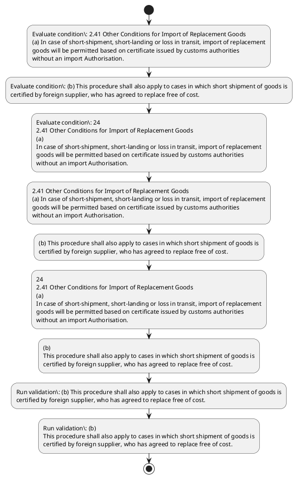

# Chapter 2 / Section 2.41: Other Conditions for Import of Replacement Goods

**Chapter Title:** General Provisions Regarding Imports and Exports

**Pages:** 15

**Purpose:** 2.41 Other Conditions for Import of Replacement Goods
(a) In case of short-shipment, short-landing or loss in transit, import of replacement
goods will be permitted based on certificate issued by customs authorities
without an import Authorisation.

**Purpose Thanglish:** Indha Other Conditions for Import of Replacement Goods section-la, 2.41 Other Conditions for import of Replacement Goods
(a) In case of short-shipment, short-landing or loss in transit, import of replacement
goods will be permitted based on certificate issued by customs authorities
without an import Authorisation.

**Summary:** 2.41 Other Conditions for Import of Replacement Goods
(a) In case of short-shipment, short-landing or loss in transit, import of replacement
goods will be permitted based on certificate issued by customs authorities
without an import Authorisation. (b) This procedure shall also apply to cases in which short shipment of goods is
certified by foreign supplier, who has agreed to replace free of cost. (c) Cases not covered by above provisions will be considered on merits by DGFT for
grant of Authorisation for replacement of goods for which an application may be
made as per paragraph 2.47 of HBP.

**Business Meaning:** Other Conditions for Import of Replacement Goods governs how DGFT business controls should be applied, validated, and enforced.

**Business Explanation:** Other Conditions for Import of Replacement Goods explains the operating rule set that DEKAI should enforce. Key control points include (b) This procedure shall also apply to cases in which short shipment of goods is
certified by foreign supplier, who has agreed to replace free of cost. The section also drives actions such as 2.41 Other Conditions for Import of Replacement Goods
(a) In case of short-shipment, short-landing or loss in transit, import of replacement
goods will be permitted based on certificate issued by customs authorities
without an import Authorisation..

**Business Explanation Thanglish:** Indha Other Conditions for Import of Replacement Goods section-la, Other Conditions for import of Replacement Goods explains the operating rule set that DEKAI should enforce. Key control points include (b) This procedure kandippa also apply to cases in which short shipment of goods is
certified by foreign supplier, who has agreed to replace free of cost. The section also drives actions such as 2.41 Other Conditions for import of Replacement Goods
(a) In case of short-shipment, short-landing or loss in transit, import of replacement
goods will be permitted based on certificate issued by customs authorities
without an import Authorisation..

## Business Logic
- (b) This procedure shall also apply to cases in which short shipment of goods is
certified by foreign supplier, who has agreed to replace free of cost.
- (b)
This procedure shall also apply to cases in which short shipment of goods is
certified by foreign supplier, who has agreed to replace free of cost.

## Business Rules
- rule_id=CH2-SEC2_41-R001, rule_description=(b) This procedure shall also apply to cases in which short shipment of goods is
certified by foreign supplier, who has agreed to replace free of cost., trigger=Other Conditions for Import of Replacement Goods, condition=2.41 Other Conditions for Import of Replacement Goods
(a) In case of short-shipment, short-landing or loss in transit, import of replacement
goods will be permitted based on certificate issued by customs authorities
without an import Authorisation., validation=(b) This procedure shall also apply to cases in which short shipment of goods is
certified by foreign supplier, who has agreed to replace free of cost., action=2.41 Other Conditions for Import of Replacement Goods
(a) In case of short-shipment, short-landing or loss in transit, import of replacement
goods will be permitted based on certificate issued by customs authorities
without an import Authorisation., exception=No explicit exception found in uploaded documents., output=DEKAI should produce a compliance decision for 2.41 - Other Conditions for Import of Replacement Goods.
- rule_id=CH2-SEC2_41-R002, rule_description=(b)
This procedure shall also apply to cases in which short shipment of goods is
certified by foreign supplier, who has agreed to replace free of cost., trigger=Other Conditions for Import of Replacement Goods, condition=(b) This procedure shall also apply to cases in which short shipment of goods is
certified by foreign supplier, who has agreed to replace free of cost., validation=(b)
This procedure shall also apply to cases in which short shipment of goods is
certified by foreign supplier, who has agreed to replace free of cost., action=(b) This procedure shall also apply to cases in which short shipment of goods is
certified by foreign supplier, who has agreed to replace free of cost., exception=No explicit exception found in uploaded documents., output=DEKAI should produce a compliance decision for 2.41 - Other Conditions for Import of Replacement Goods.

## Conditions
- 2.41 Other Conditions for Import of Replacement Goods
(a) In case of short-shipment, short-landing or loss in transit, import of replacement
goods will be permitted based on certificate issued by customs authorities
without an import Authorisation.
- (b) This procedure shall also apply to cases in which short shipment of goods is
certified by foreign supplier, who has agreed to replace free of cost.
- 24
2.41 Other Conditions for Import of Replacement Goods
(a)
In case of short-shipment, short-landing or loss in transit, import of replacement
goods will be permitted based on certificate issued by customs authorities
without an import Authorisation.
- (b)
This procedure shall also apply to cases in which short shipment of goods is
certified by foreign supplier, who has agreed to replace free of cost.

## Condition Logic
- id=2.2.41.1, if=2.41 Other Conditions for Import of Replacement Goods
(a) In case of short-shipment, short-landing or loss in transit, import of replacement
goods will be permitted based on certificate issued by customs authorities
without an import Authorisation., then=2.41 Other Conditions for Import of Replacement Goods
(a) In case of short-shipment, short-landing or loss in transit, import of replacement
goods will be permitted based on certificate issued by customs authorities
without an import Authorisation., source=2.41 Other Conditions for Import of Replacement Goods
(a) In case of short-shipment, short-landing or loss in transit, import of replacement
goods will be permitted based on certificate issued by customs authorities
without an import Authorisation.
- id=2.2.41.2, if=(b) This procedure shall also apply to cases in which short shipment of goods is
certified by foreign supplier, who has agreed to replace free of cost., then=2.41 Other Conditions for Import of Replacement Goods
(a) In case of short-shipment, short-landing or loss in transit, import of replacement
goods will be permitted based on certificate issued by customs authorities
without an import Authorisation., source=(b) This procedure shall also apply to cases in which short shipment of goods is
certified by foreign supplier, who has agreed to replace free of cost.
- id=2.2.41.3, if=24
2.41 Other Conditions for Import of Replacement Goods
(a)
In case of short-shipment, short-landing or loss in transit, import of replacement
goods will be permitted based on certificate issued by customs authorities
without an import Authorisation., then=2.41 Other Conditions for Import of Replacement Goods
(a) In case of short-shipment, short-landing or loss in transit, import of replacement
goods will be permitted based on certificate issued by customs authorities
without an import Authorisation., source=24
2.41 Other Conditions for Import of Replacement Goods
(a)
In case of short-shipment, short-landing or loss in transit, import of replacement
goods will be permitted based on certificate issued by customs authorities
without an import Authorisation.
- id=2.2.41.4, if=(b)
This procedure shall also apply to cases in which short shipment of goods is
certified by foreign supplier, who has agreed to replace free of cost., then=2.41 Other Conditions for Import of Replacement Goods
(a) In case of short-shipment, short-landing or loss in transit, import of replacement
goods will be permitted based on certificate issued by customs authorities
without an import Authorisation., source=(b)
This procedure shall also apply to cases in which short shipment of goods is
certified by foreign supplier, who has agreed to replace free of cost.

## Validations
- (b) This procedure shall also apply to cases in which short shipment of goods is
certified by foreign supplier, who has agreed to replace free of cost.
- (b)
This procedure shall also apply to cases in which short shipment of goods is
certified by foreign supplier, who has agreed to replace free of cost.

## Exceptions
- None identified

## Dependencies
- 2.47

## Authorities
- customs
- DGFT
- Cases not covered by above provisions will be considered on merits by DGFT

## Required Documents
- 2.41 Other Conditions for Import of Replacement Goods
(a) In case of short-shipment, short-landing or loss in transit, import of replacement
goods will be permitted based on certificate issued by customs authorities
without an import Authorisation.
- (c) Cases not covered by above provisions will be considered on merits by DGFT for
grant of Authorisation for replacement of goods for which an application may be
made as per paragraph 2.47 of HBP.
- 24
2.41 Other Conditions for Import of Replacement Goods
(a)
In case of short-shipment, short-landing or loss in transit, import of replacement
goods will be permitted based on certificate issued by customs authorities
without an import Authorisation.
- (c)
Cases not covered by above provisions will be considered on merits by DGFT for
grant of Authorisation for replacement of goods for which an application may be
made as per paragraph 2.47 of HBP.

## Timelines
- None identified

## Actions
- 2.41 Other Conditions for Import of Replacement Goods
(a) In case of short-shipment, short-landing or loss in transit, import of replacement
goods will be permitted based on certificate issued by customs authorities
without an import Authorisation.
- (b) This procedure shall also apply to cases in which short shipment of goods is
certified by foreign supplier, who has agreed to replace free of cost.
- 24
2.41 Other Conditions for Import of Replacement Goods
(a)
In case of short-shipment, short-landing or loss in transit, import of replacement
goods will be permitted based on certificate issued by customs authorities
without an import Authorisation.
- (b)
This procedure shall also apply to cases in which short shipment of goods is
certified by foreign supplier, who has agreed to replace free of cost.

## Workflow
- Evaluate condition: 2.41 Other Conditions for Import of Replacement Goods
(a) In case of short-shipment, short-landing or loss in transit, import of replacement
goods will be permitted based on certificate issued by customs authorities
without an import Authorisation.
- Evaluate condition: (b) This procedure shall also apply to cases in which short shipment of goods is
certified by foreign supplier, who has agreed to replace free of cost.
- Evaluate condition: 24
2.41 Other Conditions for Import of Replacement Goods
(a)
In case of short-shipment, short-landing or loss in transit, import of replacement
goods will be permitted based on certificate issued by customs authorities
without an import Authorisation.
- 2.41 Other Conditions for Import of Replacement Goods
(a) In case of short-shipment, short-landing or loss in transit, import of replacement
goods will be permitted based on certificate issued by customs authorities
without an import Authorisation.
- (b) This procedure shall also apply to cases in which short shipment of goods is
certified by foreign supplier, who has agreed to replace free of cost.
- 24
2.41 Other Conditions for Import of Replacement Goods
(a)
In case of short-shipment, short-landing or loss in transit, import of replacement
goods will be permitted based on certificate issued by customs authorities
without an import Authorisation.
- (b)
This procedure shall also apply to cases in which short shipment of goods is
certified by foreign supplier, who has agreed to replace free of cost.
- Run validation: (b) This procedure shall also apply to cases in which short shipment of goods is
certified by foreign supplier, who has agreed to replace free of cost.
- Run validation: (b)
This procedure shall also apply to cases in which short shipment of goods is
certified by foreign supplier, who has agreed to replace free of cost.

## Workflow ASCII
```text
Other Conditions for Import of Replacement Goods
Evaluate condition: 2.41 Other Conditions for Import of Replacement Goods
(a) In case of short-shipment, short-landing or loss in transit, import of replacement
goods will be permitted based on certificate issued by customs authorities
without an import Authorisation.
   |
   v
Evaluate condition: (b) This procedure shall also apply to cases in which short shipment of goods is
certified by foreign supplier, who has agreed to replace free of cost.
   |
   v
Evaluate condition: 24
2.41 Other Conditions for Import of Replacement Goods
(a)
In case of short-shipment, short-landing or loss in transit, import of replacement
goods will be permitted based on certificate issued by customs authorities
without an import Authorisation.
   |
   v
2.41 Other Conditions for Import of Replacement Goods
(a) In case of short-shipment, short-landing or loss in transit, import of replacement
goods will be permitted based on certificate issued by customs authorities
without an import Authorisation.
   |
   v
(b) This procedure shall also apply to cases in which short shipment of goods is
certified by foreign supplier, who has agreed to replace free of cost.
   |
   v
24
2.41 Other Conditions for Import of Replacement Goods
(a)
In case of short-shipment, short-landing or loss in transit, import of replacement
goods will be permitted based on certificate issued by customs authorities
without an import Authorisation.
   |
   v
(b)
This procedure shall also apply to cases in which short shipment of goods is
certified by foreign supplier, who has agreed to replace free of cost.
   |
   v
Run validation: (b) This procedure shall also apply to cases in which short shipment of goods is
certified by foreign supplier, who has agreed to replace free of cost.
   |
   v
Run validation: (b)
This procedure shall also apply to cases in which short shipment of goods is
certified by foreign supplier, who has agreed to replace free of cost.
```

## Decision Tree
- IF 2.41 Other Conditions for Import of Replacement Goods
(a) In case of short-shipment, short-landing or loss in transit, import of replacement
goods will be permitted based on certificate issued by customs authorities
without an import Authorisation. THEN 2.41 Other Conditions for Import of Replacement Goods
(a) In case of short-shipment, short-landing or loss in transit, import of replacement
goods will be permitted based on certificate issued by customs authorities
without an import Authorisation.
- IF (b) This procedure shall also apply to cases in which short shipment of goods is
certified by foreign supplier, who has agreed to replace free of cost. THEN 2.41 Other Conditions for Import of Replacement Goods
(a) In case of short-shipment, short-landing or loss in transit, import of replacement
goods will be permitted based on certificate issued by customs authorities
without an import Authorisation.
- IF 24
2.41 Other Conditions for Import of Replacement Goods
(a)
In case of short-shipment, short-landing or loss in transit, import of replacement
goods will be permitted based on certificate issued by customs authorities
without an import Authorisation. THEN 2.41 Other Conditions for Import of Replacement Goods
(a) In case of short-shipment, short-landing or loss in transit, import of replacement
goods will be permitted based on certificate issued by customs authorities
without an import Authorisation.
- IF (b)
This procedure shall also apply to cases in which short shipment of goods is
certified by foreign supplier, who has agreed to replace free of cost. THEN 2.41 Other Conditions for Import of Replacement Goods
(a) In case of short-shipment, short-landing or loss in transit, import of replacement
goods will be permitted based on certificate issued by customs authorities
without an import Authorisation.

## Decision Tree ASCII
```text
Other Conditions for Import of Replacement Goods Decision
IF 2.41 Other Conditions for Import of Replacement Goods
(a) In case of short-shipment, short-landing or loss in transit, import of replacement
goods will be permitted based on certificate issued by customs authorities
without an import Authorisation. THEN 2.41 Other Conditions for Import of Replacement Goods
(a) In case of short-shipment, short-landing or loss in transit, import of replacement
goods will be permitted based on certificate issued by customs authorities
without an import Authorisation.
   |
   v
IF (b) This procedure shall also apply to cases in which short shipment of goods is
certified by foreign supplier, who has agreed to replace free of cost. THEN 2.41 Other Conditions for Import of Replacement Goods
(a) In case of short-shipment, short-landing or loss in transit, import of replacement
goods will be permitted based on certificate issued by customs authorities
without an import Authorisation.
   |
   v
IF 24
2.41 Other Conditions for Import of Replacement Goods
(a)
In case of short-shipment, short-landing or loss in transit, import of replacement
goods will be permitted based on certificate issued by customs authorities
without an import Authorisation. THEN 2.41 Other Conditions for Import of Replacement Goods
(a) In case of short-shipment, short-landing or loss in transit, import of replacement
goods will be permitted based on certificate issued by customs authorities
without an import Authorisation.
   |
   v
IF (b)
This procedure shall also apply to cases in which short shipment of goods is
certified by foreign supplier, who has agreed to replace free of cost. THEN 2.41 Other Conditions for Import of Replacement Goods
(a) In case of short-shipment, short-landing or loss in transit, import of replacement
goods will be permitted based on certificate issued by customs authorities
without an import Authorisation.
```

## Examples
- User asks to process Other Conditions for Import of Replacement Goods; the platform checks conditions, validations, and documents before action.

**Real-world Example:** Example: an importer or exporter invokes Other Conditions for Import of Replacement Goods, submits 2.41 Other Conditions for Import of Replacement Goods
(a) In case of short-shipment, short-landing or loss in transit, import of replacement
goods will be permitted based on certificate issued by customs authorities
without an import Authorisation., (c) Cases not covered by above provisions will be considered on merits by DGFT for
grant of Authorisation for replacement of goods for which an application may be
made as per paragraph 2.47 of HBP., 24
2.41 Other Conditions for Import of Replacement Goods
(a)
In case of short-shipment, short-landing or loss in transit, import of replacement
goods will be permitted based on certificate issued by customs authorities
without an import Authorisation., and DEKAI uses the extracted rules to 2.41 other conditions for import of replacement goods
(a) in case of short-shipment, short-landing or loss in transit, import of replacement
goods will be permitted based on certificate issued by customs authorities
without an import authorisation..

**Real-world Example Thanglish:** Indha Other Conditions for Import of Replacement Goods section-la, Example: an importer or exporter invokes Other Conditions for import of Replacement Goods, submits 2.41 Other Conditions for import of Replacement Goods
(a) In case of short-shipment, short-landing or loss in transit, import of replacement
goods will be permitted based on certificate issued by customs authorities
without an import Authorisation., (c) Cases not covered by above provisions will be considered on merits by DGFT for
grant of Authorisation for replacement of goods for which an application may be
made as per paragraph 2.47 of HBP., 24
2.41 Other Conditions for import of Replacement Goods
(a)
In case of short-shipment, short-landing or loss in transit, import of replacement
goods will be permitted based on certificate issued by customs authorities
without an import Authorisation., and DEKAI uses the extracted rules to 2.41 other conditions for import of replacement goods
(a) in case of short-shipment, short-landing or loss in transit, import of replacement
goods will be permitted based on certificate issued by customs authorities
without an import authorisation..

## AI Rules
- IF detected context matches section rule THEN enforce: (b) This procedure shall also apply to cases in which short shipment of goods is
certified by foreign supplier, who has agreed to replace free of cost.
- IF detected context matches section rule THEN enforce: (b)
This procedure shall also apply to cases in which short shipment of goods is
certified by foreign supplier, who has agreed to replace free of cost.
- IF validations pass THEN recommend action: 2.41 Other Conditions for Import of Replacement Goods
(a) In case of short-shipment, short-landing or loss in transit, import of replacement
goods will be permitted based on certificate issued by customs authorities
without an import Authorisation.

## Database Fields
- name=section_code, type=string, required=True, source=parsed_section_heading
- name=section_title, type=string, required=True, source=parsed_section_heading
- name=for_flag, type=boolean, required=False, source=keyword:for
- name=who_flag, type=boolean, required=False, source=keyword:who
- name=has_flag, type=boolean, required=False, source=keyword:has
- name=not_flag, type=boolean, required=False, source=keyword:not
- name=may_flag, type=boolean, required=False, source=keyword:may
- name=per_flag, type=boolean, required=False, source=keyword:per
- name=hbp_flag, type=boolean, required=False, source=keyword:HBP
- name=case_flag, type=boolean, required=False, source=keyword:case
- name=document_1_submitted, type=boolean, required=True, source=2.41 Other Conditions for Import of Replacement Goods
(a) In case of short-shipment, short-landing or loss in transit, import of replacement
goods will be permitted based on certificate issued by customs authorities
without an import Authorisation.
- name=document_2_submitted, type=boolean, required=True, source=(c) Cases not covered by above provisions will be considered on merits by DGFT for
grant of Authorisation for replacement of goods for which an application may be
made as per paragraph 2.47 of HBP.
- name=document_3_submitted, type=boolean, required=True, source=24
2.41 Other Conditions for Import of Replacement Goods
(a)
In case of short-shipment, short-landing or loss in transit, import of replacement
goods will be permitted based on certificate issued by customs authorities
without an import Authorisation.
- name=document_4_submitted, type=boolean, required=True, source=(c)
Cases not covered by above provisions will be considered on merits by DGFT for
grant of Authorisation for replacement of goods for which an application may be
made as per paragraph 2.47 of HBP.

## API Requirements
- method=GET, path=/api/dgft/sections/2.41, purpose=Retrieve knowledge payload for section 2.41, query_params=['include=workflow,decision_tree,validations'], response_fields=['section', 'title', 'summary', 'conditions', 'validations', 'exceptions', 'workflow', 'decision_tree']
- method=POST, path=/api/dgft/Other-Conditions-for-Import-of-Replacement-Goods/validate, purpose=Validate inputs and documents for Other Conditions for Import of Replacement Goods, request_fields=['section_code', 'section_title', 'document_1_submitted', 'document_2_submitted', 'document_3_submitted', 'document_4_submitted'], response_fields=['status', 'errors', 'warnings', 'next_actions']
- method=POST, path=/api/dgft/Other-Conditions-for-Import-of-Replacement-Goods/execute, purpose=Trigger business action for 2.41 Other Conditions for Import of Replacement Goods
(a) In case of short-shipment, short-landing or loss in transit, import of replacement
goods will be permitted based on certificate issued by customs authorities
without an import Authorisation., request_fields=['section_code', 'section_title', 'document_1_submitted', 'document_2_submitted', 'document_3_submitted', 'document_4_submitted'], response_fields=['reference_id', 'status', 'authority', 'timeline']

## UI Screens
- screen_id=Other_Conditions_for_Import_of_Replacement_Goods_overview, name=Other Conditions for Import of Replacement Goods Overview, purpose=Show section summary, authority, timeline, and eligibility cues., widgets=['summary_card', 'conditions_table', 'authority_badges', 'timeline_panel']
- screen_id=Other_Conditions_for_Import_of_Replacement_Goods_submission, name=Other Conditions for Import of Replacement Goods Submission, purpose=Capture applicant data and supporting documents., widgets=['dynamic_form', 'document_uploader', 'validation_panel', 'next_action_footer'], fields=['section_code', 'section_title', 'for_flag', 'who_flag', 'has_flag', 'not_flag', 'may_flag', 'per_flag']

## Error Messages
- Validation failed because the section requirements were not fully met.

## FAQ
- question_en=What is the purpose of section 2.41?, answer_en=Other Conditions for Import of Replacement Goods explains the operating rule set that DEKAI should enforce. Key control points include (b) This procedure shall also apply to cases in which short shipment of goods is
certified by foreign supplier, who has agreed to replace free of cost. The section also drives actions such as 2.41 Other Conditions for Import of Replacement Goods
(a) In case of short-shipment, short-landing or loss in transit, import of replacement
goods will be permitted based on certificate issued by customs authorities
without an import Authorisation.., question_thanglish=Indha Other Conditions for Import of Replacement Goods section-la, What is the purpose of section 2.41?, answer_thanglish=Indha Other Conditions for Import of Replacement Goods section-la, Other Conditions for import of Replacement Goods explains the operating rule set that DEKAI should enforce. Key control points include (b) This procedure kandippa also apply to cases in which short shipment of goods is
certified by foreign supplier, who has agreed to replace free of cost. The section also drives actions such as 2.41 Other Conditions for import of Replacement Goods
(a) In case of short-shipment, short-landing or loss in transit, import of replacement
goods will be permitted based on certificate issued by customs authorities
without an import Authorisation..
- question_en=What documents are required under Other Conditions for Import of Replacement Goods?, answer_en=2.41 Other Conditions for Import of Replacement Goods
(a) In case of short-shipment, short-landing or loss in transit, import of replacement
goods will be permitted based on certificate issued by customs authorities
without an import Authorisation., (c) Cases not covered by above provisions will be considered on merits by DGFT for
grant of Authorisation for replacement of goods for which an application may be
made as per paragraph 2.47 of HBP., 24
2.41 Other Conditions for Import of Replacement Goods
(a)
In case of short-shipment, short-landing or loss in transit, import of replacement
goods will be permitted based on certificate issued by customs authorities
without an import Authorisation., (c)
Cases not covered by above provisions will be considered on merits by DGFT for
grant of Authorisation for replacement of goods for which an application may be
made as per paragraph 2.47 of HBP., question_thanglish=Indha Other Conditions for Import of Replacement Goods section-la, What documents are required under Other Conditions for import of Replacement Goods?, answer_thanglish=Indha Other Conditions for Import of Replacement Goods section-la, 2.41 Other Conditions for import of Replacement Goods
(a) In case of short-shipment, short-landing or loss in transit, import of replacement
goods will be permitted based on certificate issued by customs authorities
without an import Authorisation., (c) Cases not covered by above provisions will be considered on merits by DGFT for
grant of Authorisation for replacement of goods for which an application may be
made as per paragraph 2.47 of HBP., 24
2.41 Other Conditions for import of Replacement Goods
(a)
In case of short-shipment, short-landing or loss in transit, import of replacement
goods will be permitted based on certificate issued by customs authorities
without an import Authorisation., (c)
Cases not covered by above provisions will be considered on merits by DGFT for
grant of Authorisation for replacement of goods for which an application may be
made as per paragraph 2.47 of HBP.
- question_en=Which authority handles Other Conditions for Import of Replacement Goods?, answer_en=customs, DGFT, Cases not covered by above provisions will be considered on merits by DGFT, question_thanglish=Indha Other Conditions for Import of Replacement Goods section-la, Which authority handles Other Conditions for import of Replacement Goods?, answer_thanglish=Indha Other Conditions for Import of Replacement Goods section-la, customs, DGFT, Cases not covered by above provisions will be considered on merits by DGFT

## Questions Users May Ask
- What does Other Conditions for Import of Replacement Goods require?
- Which documents are needed for Other Conditions for Import of Replacement Goods?
- How does DEKAI validate Other Conditions for Import of Replacement Goods requests?
- What action should be taken for Other Conditions for Import of Replacement Goods?

## Expected AI Answers
- Other Conditions for Import of Replacement Goods requires the platform to interpret the section text, apply the extracted business rules, and present the correct next action.
- Required documents are inferred from the section text: 2.41 Other Conditions for Import of Replacement Goods
(a) In case of short-shipment, short-landing or loss in transit, import of replacement
goods will be permitted based on certificate issued by customs authorities
without an import Authorisation., (c) Cases not covered by above provisions will be considered on merits by DGFT for
grant of Authorisation for replacement of goods for which an application may be
made as per paragraph 2.47 of HBP., 24
2.41 Other Conditions for Import of Replacement Goods
(a)
In case of short-shipment, short-landing or loss in transit, import of replacement
goods will be permitted based on certificate issued by customs authorities
without an import Authorisation., (c)
Cases not covered by above provisions will be considered on merits by DGFT for
grant of Authorisation for replacement of goods for which an application may be
made as per paragraph 2.47 of HBP.
- DEKAI validates Other Conditions for Import of Replacement Goods by checking conditions, required documents, authority references, and exception clauses before recommending an outcome.
- The primary extracted action is: 2.41 Other Conditions for Import of Replacement Goods
(a) In case of short-shipment, short-landing or loss in transit, import of replacement
goods will be permitted based on certificate issued by customs authorities
without an import Authorisation.

## AI Q&A Examples
- question_en=User asks: How do I comply with Other Conditions for Import of Replacement Goods?, answer_en=AI answers: DEKAI should evaluate section 2.41, apply the extracted rules, and guide the user through Evaluate condition: 2.41 Other Conditions for Import of Replacement Goods
(a) In case of short-shipment, short-landing or loss in transit, import of replacement
goods will be permitted based on certificate issued by customs authorities
without an import Authorisation.., question_thanglish=Indha Other Conditions for Import of Replacement Goods section-la, User asks: How do I comply with Other Conditions for import of Replacement Goods?, answer_thanglish=Indha Other Conditions for Import of Replacement Goods section-la, AI answers: DEKAI should evaluate section 2.41, apply the extracted rules, and guide the user through Evaluate condition: 2.41 Other Conditions for import of Replacement Goods
(a) In case of short-shipment, short-landing or loss in transit, import of replacement
goods will be permitted based on certificate issued by customs authorities
without an import Authorisation..
- question_en=User asks: Which validations apply to Other Conditions for Import of Replacement Goods?, answer_en=AI answers: Applicable validations are (b) This procedure shall also apply to cases in which short shipment of goods is
certified by foreign supplier, who has agreed to replace free of cost., (b)
This procedure shall also apply to cases in which short shipment of goods is
certified by foreign supplier, who has agreed to replace free of cost., question_thanglish=Indha Other Conditions for Import of Replacement Goods section-la, User asks: Which validations apply to Other Conditions for import of Replacement Goods?, answer_thanglish=Indha Other Conditions for Import of Replacement Goods section-la, AI answers: Applicable validations are (b) This procedure kandippa also apply to cases in which short shipment of goods is
certified by foreign supplier, who has agreed to replace free of cost., (b)
This procedure kandippa also apply to cases in which short shipment of goods is
certified by foreign supplier, who has agreed to replace free of cost.

## DEKAI AI Implementation Notes
- Capture chapter 2, section 2.41, title, and page references as immutable knowledge metadata.
- Bind validations for Other Conditions for Import of Replacement Goods into a rule engine keyed by the rule IDs extracted for this section.
- Expose document upload controls for: 2.41 Other Conditions for Import of Replacement Goods
(a) In case of short-shipment, short-landing or loss in transit, import of replacement
goods will be permitted based on certificate issued by customs authorities
without an import Authorisation., (c) Cases not covered by above provisions will be considered on merits by DGFT for
grant of Authorisation for replacement of goods for which an application may be
made as per paragraph 2.47 of HBP., 24
2.41 Other Conditions for Import of Replacement Goods
(a)
In case of short-shipment, short-landing or loss in transit, import of replacement
goods will be permitted based on certificate issued by customs authorities
without an import Authorisation., (c)
Cases not covered by above provisions will be considered on merits by DGFT for
grant of Authorisation for replacement of goods for which an application may be
made as per paragraph 2.47 of HBP..
- Route escalations or approvals to: customs, DGFT, Cases not covered by above provisions will be considered on merits by DGFT.
- Show contextual links to related sections: 2.47.

## DEKAI AI Implementation Notes Thanglish
- Indha Other Conditions for Import of Replacement Goods section-la, Capture chapter 2, section 2.41, title, and page references as immutable knowledge metadata.
- Indha Other Conditions for Import of Replacement Goods section-la, Bind validations for Other Conditions for import of Replacement Goods into a rule engine keyed by the rule IDs extracted for this section.
- Indha Other Conditions for Import of Replacement Goods section-la, Expose document upload controls for: 2.41 Other Conditions for import of Replacement Goods
(a) In case of short-shipment, short-landing or loss in transit, import of replacement
goods will be permitted based on certificate issued by customs authorities
without an import Authorisation., (c) Cases not covered by above provisions will be considered on merits by DGFT for
grant of Authorisation for replacement of goods for which an application may be
made as per paragraph 2.47 of HBP., 24
2.41 Other Conditions for import of Replacement Goods
(a)
In case of short-shipment, short-landing or loss in transit, import of replacement
goods will be permitted based on certificate issued by customs authorities
without an import Authorisation., (c)
Cases not covered by above provisions will be considered on merits by DGFT for
grant of Authorisation for replacement of goods for which an application may be
made as per paragraph 2.47 of HBP..
- Indha Other Conditions for Import of Replacement Goods section-la, Route escalations or approvals to: customs, DGFT, Cases not covered by above provisions will be considered on merits by DGFT.
- Indha Other Conditions for Import of Replacement Goods section-la, Show contextual links to related sections: 2.47.

## AI Metadata
- Keywords: for, who, has, not, may, per, HBP, case, loss, will, This, also, free, cost, DGFT, made, Other, Goods, based, shall
- Search Keywords: for, who, has, not, may, per, HBP, case, loss, will, This, also, free, cost, DGFT, made, Other, Goods, based, shall
- Intent: Support Other Conditions for Import of Replacement Goods processing and compliance validation.
- Tags: 2.41, Other Conditions for Import of Replacement Goods, business-rule, document-driven, dgft
- Related Sections: 2.47
- Related Chapters: 
- Related Rules: (b) This procedure shall also apply to cases in which short shipment of goods is
certified by foreign supplier, who has agreed to replace free of cost., (b)
This procedure shall also apply to cases in which short shipment of goods is
certified by foreign supplier, who has agreed to replace free of cost.

## Mermaid

```mermaid
flowchart TD
    S1["Evaluate condition: 2.41 Other Conditions for Import of Replacement Goods
(a) In case of short-shipment, short-landing or loss in transit, import of replacement
goods will be permitted based on certificate issued by customs authorities
without an import Authorisation."]
    S2["Evaluate condition: (b) This procedure shall also apply to cases in which short shipment of goods is
certified by foreign supplier, who has agreed to replace free of cost."]
    S1 --> S2
    S3["Evaluate condition: 24
2.41 Other Conditions for Import of Replacement Goods
(a)
In case of short-shipment, short-landing or loss in transit, import of replacement
goods will be permitted based on certificate issued by customs authorities
without an import Authorisation."]
    S2 --> S3
    S4["2.41 Other Conditions for Import of Replacement Goods
(a) In case of short-shipment, short-landing or loss in transit, import of replacement
goods will be permitted based on certificate issued by customs authorities
without an import Authorisation."]
    S3 --> S4
    S5["(b) This procedure shall also apply to cases in which short shipment of goods is
certified by foreign supplier, who has agreed to replace free of cost."]
    S4 --> S5
    S6["24
2.41 Other Conditions for Import of Replacement Goods
(a)
In case of short-shipment, short-landing or loss in transit, import of replacement
goods will be permitted based on certificate issued by customs authorities
without an import Authorisation."]
    S5 --> S6
    S7["(b)
This procedure shall also apply to cases in which short shipment of goods is
certified by foreign supplier, who has agreed to replace free of cost."]
    S6 --> S7
    S8["Run validation: (b) This procedure shall also apply to cases in which short shipment of goods is
certified by foreign supplier, who has agreed to replace free of cost."]
    S7 --> S8
    S9["Run validation: (b)
This procedure shall also apply to cases in which short shipment of goods is
certified by foreign supplier, who has agreed to replace free of cost."]
    S8 --> S9
```


## PlantUML

