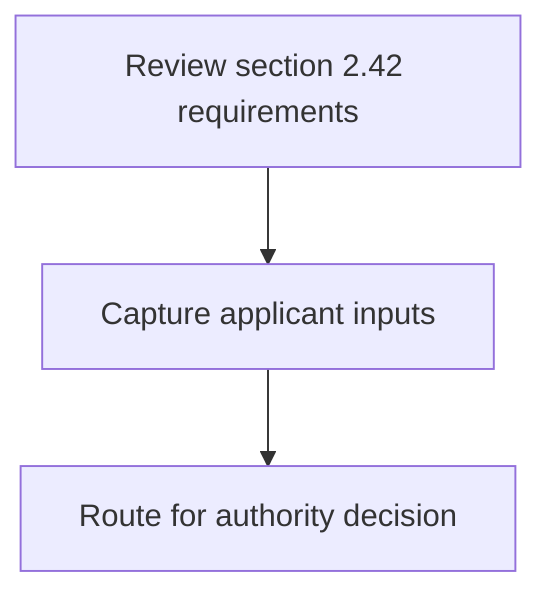
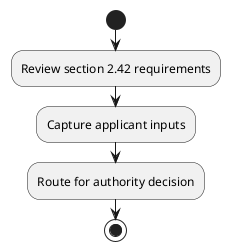

# Chapter 2 / Section 2.42: Import of Overseas Office Equipment

**Chapter Title:** General Provisions Regarding Imports and Exports

**Pages:** 16

**Purpose:** Defines the operational requirements for Import of Overseas Office Equipment.

**Purpose Thanglish:** Indha Import of Overseas Office Equipment section-la, Defines the operational requirements for import of Overseas Office Equipment.

**Summary:** 2.42 Import of Overseas Office Equipment
On winding up of overseas offices, set up with approval of RBI, used office equipment
and other items may be imported without Authorisation.

**Business Meaning:** 2.42 Import of Overseas Office Equipment
On winding up of overseas offices, set up with approval of RBI, used office equipment
and other items may be imported without Authorisation.

**Business Explanation:** 2.42 Import of Overseas Office Equipment
On winding up of overseas offices, set up with approval of RBI, used office equipment
and other items may be imported without Authorisation.

**Business Explanation Thanglish:** Indha Import of Overseas Office Equipment section-la, 2.42 import of Overseas Office Equipment
On winding up of overseas offices, set up with approval of RBI, used office equipment
and other items may be imported without Authorisation.

## Business Logic
- None identified

## Business Rules
- rule_id=CH2-SEC2_42-R001, rule_description=2.42 Import of Overseas Office Equipment
On winding up of overseas offices, set up with approval of RBI, used office equipment
and other items may be imported without Authorisation., trigger=Import of Overseas Office Equipment, condition=Not explicitly covered in uploaded documents., validation=Not explicitly covered in uploaded documents., action=Manual review required., exception=No explicit exception found in uploaded documents., output=DEKAI should produce a compliance decision for 2.42 - Import of Overseas Office Equipment.

## Conditions
- None identified

## Condition Logic
- None identified

## Validations
- None identified

## Exceptions
- None identified

## Dependencies
- None identified

## Authorities
- None identified

## Required Documents
- None identified

## Timelines
- None identified

## Actions
- None identified

## Workflow
- Review section 2.42 requirements
- Capture applicant inputs
- Route for authority decision

## Workflow ASCII
```text
Import of Overseas Office Equipment
Review section 2.42 requirements
   |
   v
Capture applicant inputs
   |
   v
Route for authority decision
```

## Decision Tree
- IF section 2.42 applies THEN proceed with standard DGFT workflow

## Decision Tree ASCII
```text
Import of Overseas Office Equipment Decision
IF section 2.42 applies THEN proceed with standard DGFT workflow
```

## Examples
- User asks to process Import of Overseas Office Equipment; the platform checks conditions, validations, and documents before action.

**Real-world Example:** Example: an importer or exporter invokes Import of Overseas Office Equipment, submits the prescribed DGFT records, and DEKAI uses the extracted rules to follow the import of overseas office equipment process.

**Real-world Example Thanglish:** Indha Import of Overseas Office Equipment section-la, Example: an importer or exporter invokes import of Overseas Office Equipment, submits the prescribed DGFT records, and DEKAI uses the extracted rules to follow the import of overseas office equipment process.

## AI Rules
- None identified

## Database Fields
- name=section_code, type=string, required=True, source=parsed_section_heading
- name=section_title, type=string, required=True, source=parsed_section_heading
- name=set_flag, type=boolean, required=False, source=keyword:set
- name=rbi_flag, type=boolean, required=False, source=keyword:RBI
- name=and_flag, type=boolean, required=False, source=keyword:and
- name=may_flag, type=boolean, required=False, source=keyword:may
- name=with_flag, type=boolean, required=False, source=keyword:with
- name=used_flag, type=boolean, required=False, source=keyword:used
- name=other_flag, type=boolean, required=False, source=keyword:other
- name=items_flag, type=boolean, required=False, source=keyword:items

## API Requirements
- method=GET, path=/api/dgft/sections/2.42, purpose=Retrieve knowledge payload for section 2.42, query_params=['include=workflow,decision_tree,validations'], response_fields=['section', 'title', 'summary', 'conditions', 'validations', 'exceptions', 'workflow', 'decision_tree']
- method=POST, path=/api/dgft/Import-of-Overseas-Office-Equipment/validate, purpose=Validate inputs and documents for Import of Overseas Office Equipment, request_fields=['section_code', 'section_title'], response_fields=['status', 'errors', 'warnings', 'next_actions']

## UI Screens
- screen_id=Import_of_Overseas_Office_Equipment_overview, name=Import of Overseas Office Equipment Overview, purpose=Show section summary, authority, timeline, and eligibility cues., widgets=['summary_card', 'conditions_table', 'authority_badges', 'timeline_panel']
- screen_id=Import_of_Overseas_Office_Equipment_submission, name=Import of Overseas Office Equipment Submission, purpose=Capture applicant data and supporting documents., widgets=['dynamic_form', 'document_uploader', 'validation_panel', 'next_action_footer'], fields=['section_code', 'section_title', 'set_flag', 'rbi_flag', 'and_flag', 'may_flag', 'with_flag', 'used_flag']

## Error Messages
- Validation failed because the section requirements were not fully met.

## FAQ
- question_en=What is the purpose of section 2.42?, answer_en=2.42 Import of Overseas Office Equipment
On winding up of overseas offices, set up with approval of RBI, used office equipment
and other items may be imported without Authorisation., question_thanglish=Indha Import of Overseas Office Equipment section-la, What is the purpose of section 2.42?, answer_thanglish=Indha Import of Overseas Office Equipment section-la, 2.42 import of Overseas Office Equipment
On winding up of overseas offices, set up with approval of RBI, used office equipment
and other items may be imported without Authorisation.
- question_en=What documents are required under Import of Overseas Office Equipment?, answer_en=Not explicitly covered in uploaded documents., question_thanglish=Indha Import of Overseas Office Equipment section-la, What documents are required under import of Overseas Office Equipment?, answer_thanglish=Indha Import of Overseas Office Equipment section-la, Not explicitly covered in uploaded documents.
- question_en=Which authority handles Import of Overseas Office Equipment?, answer_en=Not explicitly covered in uploaded documents., question_thanglish=Indha Import of Overseas Office Equipment section-la, Which authority handles import of Overseas Office Equipment?, answer_thanglish=Indha Import of Overseas Office Equipment section-la, Not explicitly covered in uploaded documents.

## Questions Users May Ask
- What does Import of Overseas Office Equipment require?
- Which documents are needed for Import of Overseas Office Equipment?
- How does DEKAI validate Import of Overseas Office Equipment requests?

## Expected AI Answers
- Import of Overseas Office Equipment requires the platform to interpret the section text, apply the extracted business rules, and present the correct next action.
- Required documents are inferred from the section text: no explicit documents were detected.
- DEKAI validates Import of Overseas Office Equipment by checking conditions, required documents, authority references, and exception clauses before recommending an outcome.

## AI Q&A Examples
- question_en=User asks: How do I comply with Import of Overseas Office Equipment?, answer_en=AI answers: DEKAI should evaluate section 2.42, apply the extracted rules, and guide the user through Review section 2.42 requirements., question_thanglish=Indha Import of Overseas Office Equipment section-la, User asks: How do I comply with import of Overseas Office Equipment?, answer_thanglish=Indha Import of Overseas Office Equipment section-la, AI answers: DEKAI should evaluate section 2.42, apply the extracted rules, and guide the user through Review section 2.42 requirements.
- question_en=User asks: Which validations apply to Import of Overseas Office Equipment?, answer_en=AI answers: Applicable validations are not explicitly covered in the uploaded documents., question_thanglish=Indha Import of Overseas Office Equipment section-la, User asks: Which validations apply to import of Overseas Office Equipment?, answer_thanglish=Indha Import of Overseas Office Equipment section-la, AI answers: Applicable validations are not explicitly covered in the uploaded documents.

## DEKAI AI Implementation Notes
- Capture chapter 2, section 2.42, title, and page references as immutable knowledge metadata.
- Bind validations for Import of Overseas Office Equipment into a rule engine keyed by the rule IDs extracted for this section.

## DEKAI AI Implementation Notes Thanglish
- Indha Import of Overseas Office Equipment section-la, Capture chapter 2, section 2.42, title, and page references as immutable knowledge metadata.
- Indha Import of Overseas Office Equipment section-la, Bind validations for import of Overseas Office Equipment into a rule engine keyed by the rule IDs extracted for this section.

## AI Metadata
- Keywords: set, RBI, and, may, with, used, other, items, Import, Office, winding, offices, without, Overseas, approval, imported, Equipment, Authorisation
- Search Keywords: set, RBI, and, may, with, used, other, items, Import, Office, winding, offices, without, Overseas, approval, imported, Equipment, Authorisation
- Intent: Provide knowledge guidance for Import of Overseas Office Equipment.
- Tags: 2.42, Import of Overseas Office Equipment, dgft
- Related Sections: 
- Related Chapters: 
- Related Rules: 

## Mermaid


## PlantUML

