# Chapter 2 / Section 2.43: Import of Ammunition by Licensed /Authorised Arms Dealers

**Chapter Title:** General Provisions Regarding Imports and Exports

**Pages:** 16

**Purpose:** 2.43 Import of Ammunition by Licensed /Authorised Arms Dealers
(a) Import of following types of ammunition are allowed against an Authorisation
by licensed arms dealers subject to conditions as may be specified:
(i) Shotgun Cartridges 28 bore;
(ii) Revolver Cartridges of.450,.455 and.45 bores;
(iii) Pistol Cartridges of.25,.30 Mauser,.450 and.45 bores;
(iv) Rifle Cartridges of 6.5 mm,.22 savage,.22 Hornet,300 Sherwood, 32/40,
.256,.275,.280, 7m/m Mauser, 7 m/m Man Schoener, 9m/m Mauser, 9
m/m Man Schoener, 8x57, 8x57S, 9.3 m/m, 9.5 m/m,.375 Magnum,.405,
.30.06,.270,.30/30 Winch,.318,.33 Winch,.275 Mag.,.350 Mag.,
400/350,.369 Purdey,.450/400,.470,.32 Win,.458 Win,.380 Rook,
.220 Swift and.44 Win.

**Purpose Thanglish:** Indha Import of Ammunition by Licensed /Authorised Arms Dealers section-la, 2.43 import of Ammunition by Licensed /Authorised Arms Dealers
(a) import of following types of ammunition are allowed against an Authorisation
by licensed arms dealers subject to conditions as may be specified:
(i) Shotgun Cartridges 28 bore;
(ii) Revolver Cartridges of.450,.455 and.45 bores;
(iii) Pistol Cartridges of.25,.30 Mauser,.450 and.45 bores;
(iv) Rifle Cartridges of 6.5 mm,.22 savage,.22 Hornet,300 Sherwood, 32/40,
.256,.275,.280, 7m/m Mauser, 7 m/m Man Schoener, 9m/m Mauser, 9
m/m Man Schoener, 8x57, 8x57S, 9.3 m/m, 9.5 m/m,.375 Magnum,.405,
.30.06,.270,.30/30 Winch,.318,.33 Winch,.275 Mag.,.350 Mag.,
400/350,.369 Purdey,.450/400,.470,.32 Win,.458 Win,.380 Rook,
.220 Swift and.44 Win.

**Summary:** 2.43 Import of Ammunition by Licensed /Authorised Arms Dealers
(a) Import of following types of ammunition are allowed against an Authorisation
by licensed arms dealers subject to conditions as may be specified:
(i) Shotgun Cartridges 28 bore;
(ii) Revolver Cartridges of.450,.455 and.45 bores;
(iii) Pistol Cartridges of.25,.30 Mauser,.450 and.45 bores;
(iv) Rifle Cartridges of 6.5 mm,.22 savage,.22 Hornet,300 Sherwood, 32/40,
.256,.275,.280, 7m/m Mauser, 7 m/m Man Schoener, 9m/m Mauser, 9
m/m Man Schoener, 8x57, 8x57S, 9.3 m/m, 9.5 m/m,.375 Magnum,.405,
.30.06,.270,.30/30 Winch,.318,.33 Winch,.275 Mag.,.350 Mag.,
400/350,.369 Purdey,.450/400,.470,.32 Win,.458 Win,.380 Rook,
.220 Swift and.44 Win. bores. (b) An import Authorisation shall be issued at 5% of value of annual average sales
turnover of ammunition (whether indigenous or imported) during preceding
three licensing years subject to a minimum of Rs.

**Business Meaning:** Import of Ammunition by Licensed /Authorised Arms Dealers governs how DGFT business controls should be applied, validated, and enforced.

**Business Explanation:** Import of Ammunition by Licensed /Authorised Arms Dealers explains the operating rule set that DEKAI should enforce. Key control points include 2.43 Import of Ammunition by Licensed /Authorised Arms Dealers
(a) Import of following types of ammunition are allowed against an Authorisation
by licensed arms dealers subject to conditions as may be specified:
(i) Shotgun Cartridges 28 bore;
(ii) Revolver Cartridges of.450,.455 and.45 bores;
(iii) Pistol Cartridges of.25,.30 Mauser,.450 and.45 bores;
(iv) Rifle Cartridges of 6.5 mm,.22 savage,.22 Hornet,300 Sherwood, 32/40,
.256,.275,.280, 7m/m Mauser, 7 m/m Man Schoener, 9m/m Mauser, 9
m/m Man Schoener, 8x57, 8x57S, 9.3 m/m, 9.5 m/m,.375 Magnum,.405,
.30.06,.270,.30/30 Winch,.318,.33 Winch,.275 Mag.,.350 Mag.,
400/350,.369 Purdey,.450/400,.470,.32 Win,.458 Win,.380 Rook,
.220 Swift and.44 Win. The section also drives actions such as (b) An import Authorisation shall be issued at 5% of value of annual average sales
turnover of ammunition (whether indigenous or imported) during preceding
three licensing years subject to a minimum of Rs..

**Business Explanation Thanglish:** Indha Import of Ammunition by Licensed /Authorised Arms Dealers section-la, import of Ammunition by Licensed /Authorised Arms Dealers explains the operating rule set that DEKAI should enforce. Key control points include 2.43 import of Ammunition by Licensed /Authorised Arms Dealers
(a) import of following types of ammunition are allowed against an Authorisation
by licensed arms dealers subject to conditions as may be specified:
(i) Shotgun Cartridges 28 bore;
(ii) Revolver Cartridges of.450,.455 and.45 bores;
(iii) Pistol Cartridges of.25,.30 Mauser,.450 and.45 bores;
(iv) Rifle Cartridges of 6.5 mm,.22 savage,.22 Hornet,300 Sherwood, 32/40,
.256,.275,.280, 7m/m Mauser, 7 m/m Man Schoener, 9m/m Mauser, 9
m/m Man Schoener, 8x57, 8x57S, 9.3 m/m, 9.5 m/m,.375 Magnum,.405,
.30.06,.270,.30/30 Winch,.318,.33 Winch,.275 Mag.,.350 Mag.,
400/350,.369 Purdey,.450/400,.470,.32 Win,.458 Win,.380 Rook,
.220 Swift and.44 Win. The section also drives actions such as (b) An import Authorisation kandippa be issued at 5% of value of annual average sales
turnover of ammunition (whether indigenous or imported) during preceding
three licensing years subject to a minimum of Rs..

## Business Logic
- 2.43 Import of Ammunition by Licensed /Authorised Arms Dealers
(a) Import of following types of ammunition are allowed against an Authorisation
by licensed arms dealers subject to conditions as may be specified:
(i) Shotgun Cartridges 28 bore;
(ii) Revolver Cartridges of.450,.455 and.45 bores;
(iii) Pistol Cartridges of.25,.30 Mauser,.450 and.45 bores;
(iv) Rifle Cartridges of 6.5 mm,.22 savage,.22 Hornet,300 Sherwood, 32/40,
.256,.275,.280, 7m/m Mauser, 7 m/m Man Schoener, 9m/m Mauser, 9
m/m Man Schoener, 8x57, 8x57S, 9.3 m/m, 9.5 m/m,.375 Magnum,.405,
.30.06,.270,.30/30 Winch,.318,.33 Winch,.275 Mag.,.350 Mag.,
400/350,.369 Purdey,.450/400,.470,.32 Win,.458 Win,.380 Rook,
.220 Swift and.44 Win.
- (b) An import Authorisation shall be issued at 5% of value of annual average sales
turnover of ammunition (whether indigenous or imported) during preceding
three licensing years subject to a minimum of Rs.
- 2.43 Import of Ammunition by Licensed /Authorised Arms Dealers
(a)
Import of following types of ammunition are allowed against an Authorisation
by licensed arms dealers subject to conditions as may be specified:
(i)
Shotgun Cartridges 28 bore;
(ii)
Revolver Cartridges of.450,.455 and.45 bores;
(iii)
Pistol Cartridges of.25,.30 Mauser,.450 and.45 bores;
(iv)
Rifle Cartridges of 6.5 mm,.22 savage,.22 Hornet,300 Sherwood, 32/40,
.256,.275,.280, 7m/m Mauser, 7 m/m Man Schoener, 9m/m Mauser, 9
m/m Man Schoener, 8x57, 8x57S, 9.3 m/m, 9.5 m/m,.375 Magnum,.405,
.30.06,.270,.30/30 Winch,.318,.33 Winch,.275 Mag.,.350 Mag.,
400/350,.369 Purdey,.450/400,.470,.32 Win,.458 Win,.380 Rook,
.220 Swift and.44 Win.
- (b)
An import Authorisation shall be issued at 5% of value of annual average sales
turnover of ammunition (whether indigenous or imported) during preceding
three licensing years subject to a minimum of Rs.

## Business Rules
- rule_id=CH2-SEC2_43-R001, rule_description=2.43 Import of Ammunition by Licensed /Authorised Arms Dealers
(a) Import of following types of ammunition are allowed against an Authorisation
by licensed arms dealers subject to conditions as may be specified:
(i) Shotgun Cartridges 28 bore;
(ii) Revolver Cartridges of.450,.455 and.45 bores;
(iii) Pistol Cartridges of.25,.30 Mauser,.450 and.45 bores;
(iv) Rifle Cartridges of 6.5 mm,.22 savage,.22 Hornet,300 Sherwood, 32/40,
.256,.275,.280, 7m/m Mauser, 7 m/m Man Schoener, 9m/m Mauser, 9
m/m Man Schoener, 8x57, 8x57S, 9.3 m/m, 9.5 m/m,.375 Magnum,.405,
.30.06,.270,.30/30 Winch,.318,.33 Winch,.275 Mag.,.350 Mag.,
400/350,.369 Purdey,.450/400,.470,.32 Win,.458 Win,.380 Rook,
.220 Swift and.44 Win., trigger=Import of Ammunition by Licensed /Authorised Arms Dealers, condition=2.43 Import of Ammunition by Licensed /Authorised Arms Dealers
(a) Import of following types of ammunition are allowed against an Authorisation
by licensed arms dealers subject to conditions as may be specified:
(i) Shotgun Cartridges 28 bore;
(ii) Revolver Cartridges of.450,.455 and.45 bores;
(iii) Pistol Cartridges of.25,.30 Mauser,.450 and.45 bores;
(iv) Rifle Cartridges of 6.5 mm,.22 savage,.22 Hornet,300 Sherwood, 32/40,
.256,.275,.280, 7m/m Mauser, 7 m/m Man Schoener, 9m/m Mauser, 9
m/m Man Schoener, 8x57, 8x57S, 9.3 m/m, 9.5 m/m,.375 Magnum,.405,
.30.06,.270,.30/30 Winch,.318,.33 Winch,.275 Mag.,.350 Mag.,
400/350,.369 Purdey,.450/400,.470,.32 Win,.458 Win,.380 Rook,
.220 Swift and.44 Win., validation=(b) An import Authorisation shall be issued at 5% of value of annual average sales
turnover of ammunition (whether indigenous or imported) during preceding
three licensing years subject to a minimum of Rs., action=(b) An import Authorisation shall be issued at 5% of value of annual average sales
turnover of ammunition (whether indigenous or imported) during preceding
three licensing years subject to a minimum of Rs., exception=No explicit exception found in uploaded documents., output=DEKAI should produce a compliance decision for 2.43 - Import of Ammunition by Licensed /Authorised Arms Dealers.
- rule_id=CH2-SEC2_43-R002, rule_description=(b) An import Authorisation shall be issued at 5% of value of annual average sales
turnover of ammunition (whether indigenous or imported) during preceding
three licensing years subject to a minimum of Rs., trigger=Import of Ammunition by Licensed /Authorised Arms Dealers, condition=(b) An import Authorisation shall be issued at 5% of value of annual average sales
turnover of ammunition (whether indigenous or imported) during preceding
three licensing years subject to a minimum of Rs., validation=(b)
An import Authorisation shall be issued at 5% of value of annual average sales
turnover of ammunition (whether indigenous or imported) during preceding
three licensing years subject to a minimum of Rs., action=(b)
An import Authorisation shall be issued at 5% of value of annual average sales
turnover of ammunition (whether indigenous or imported) during preceding
three licensing years subject to a minimum of Rs., exception=No explicit exception found in uploaded documents., output=DEKAI should produce a compliance decision for 2.43 - Import of Ammunition by Licensed /Authorised Arms Dealers.
- rule_id=CH2-SEC2_43-R003, rule_description=2.43 Import of Ammunition by Licensed /Authorised Arms Dealers
(a)
Import of following types of ammunition are allowed against an Authorisation
by licensed arms dealers subject to conditions as may be specified:
(i)
Shotgun Cartridges 28 bore;
(ii)
Revolver Cartridges of.450,.455 and.45 bores;
(iii)
Pistol Cartridges of.25,.30 Mauser,.450 and.45 bores;
(iv)
Rifle Cartridges of 6.5 mm,.22 savage,.22 Hornet,300 Sherwood, 32/40,
.256,.275,.280, 7m/m Mauser, 7 m/m Man Schoener, 9m/m Mauser, 9
m/m Man Schoener, 8x57, 8x57S, 9.3 m/m, 9.5 m/m,.375 Magnum,.405,
.30.06,.270,.30/30 Winch,.318,.33 Winch,.275 Mag.,.350 Mag.,
400/350,.369 Purdey,.450/400,.470,.32 Win,.458 Win,.380 Rook,
.220 Swift and.44 Win., trigger=Import of Ammunition by Licensed /Authorised Arms Dealers, condition=2.43 Import of Ammunition by Licensed /Authorised Arms Dealers
(a)
Import of following types of ammunition are allowed against an Authorisation
by licensed arms dealers subject to conditions as may be specified:
(i)
Shotgun Cartridges 28 bore;
(ii)
Revolver Cartridges of.450,.455 and.45 bores;
(iii)
Pistol Cartridges of.25,.30 Mauser,.450 and.45 bores;
(iv)
Rifle Cartridges of 6.5 mm,.22 savage,.22 Hornet,300 Sherwood, 32/40,
.256,.275,.280, 7m/m Mauser, 7 m/m Man Schoener, 9m/m Mauser, 9
m/m Man Schoener, 8x57, 8x57S, 9.3 m/m, 9.5 m/m,.375 Magnum,.405,
.30.06,.270,.30/30 Winch,.318,.33 Winch,.275 Mag.,.350 Mag.,
400/350,.369 Purdey,.450/400,.470,.32 Win,.458 Win,.380 Rook,
.220 Swift and.44 Win., validation=(b)
An import Authorisation shall be issued at 5% of value of annual average sales
turnover of ammunition (whether indigenous or imported) during preceding
three licensing years subject to a minimum of Rs., action=(b)
An import Authorisation shall be issued at 5% of value of annual average sales
turnover of ammunition (whether indigenous or imported) during preceding
three licensing years subject to a minimum of Rs., exception=No explicit exception found in uploaded documents., output=DEKAI should produce a compliance decision for 2.43 - Import of Ammunition by Licensed /Authorised Arms Dealers.
- rule_id=CH2-SEC2_43-R004, rule_description=(b)
An import Authorisation shall be issued at 5% of value of annual average sales
turnover of ammunition (whether indigenous or imported) during preceding
three licensing years subject to a minimum of Rs., trigger=Import of Ammunition by Licensed /Authorised Arms Dealers, condition=(b)
An import Authorisation shall be issued at 5% of value of annual average sales
turnover of ammunition (whether indigenous or imported) during preceding
three licensing years subject to a minimum of Rs., validation=(b)
An import Authorisation shall be issued at 5% of value of annual average sales
turnover of ammunition (whether indigenous or imported) during preceding
three licensing years subject to a minimum of Rs., action=(b)
An import Authorisation shall be issued at 5% of value of annual average sales
turnover of ammunition (whether indigenous or imported) during preceding
three licensing years subject to a minimum of Rs., exception=No explicit exception found in uploaded documents., output=DEKAI should produce a compliance decision for 2.43 - Import of Ammunition by Licensed /Authorised Arms Dealers.

## Conditions
- 2.43 Import of Ammunition by Licensed /Authorised Arms Dealers
(a) Import of following types of ammunition are allowed against an Authorisation
by licensed arms dealers subject to conditions as may be specified:
(i) Shotgun Cartridges 28 bore;
(ii) Revolver Cartridges of.450,.455 and.45 bores;
(iii) Pistol Cartridges of.25,.30 Mauser,.450 and.45 bores;
(iv) Rifle Cartridges of 6.5 mm,.22 savage,.22 Hornet,300 Sherwood, 32/40,
.256,.275,.280, 7m/m Mauser, 7 m/m Man Schoener, 9m/m Mauser, 9
m/m Man Schoener, 8x57, 8x57S, 9.3 m/m, 9.5 m/m,.375 Magnum,.405,
.30.06,.270,.30/30 Winch,.318,.33 Winch,.275 Mag.,.350 Mag.,
400/350,.369 Purdey,.450/400,.470,.32 Win,.458 Win,.380 Rook,
.220 Swift and.44 Win.
- (b) An import Authorisation shall be issued at 5% of value of annual average sales
turnover of ammunition (whether indigenous or imported) during preceding
three licensing years subject to a minimum of Rs.
- 2.43 Import of Ammunition by Licensed /Authorised Arms Dealers
(a)
Import of following types of ammunition are allowed against an Authorisation
by licensed arms dealers subject to conditions as may be specified:
(i)
Shotgun Cartridges 28 bore;
(ii)
Revolver Cartridges of.450,.455 and.45 bores;
(iii)
Pistol Cartridges of.25,.30 Mauser,.450 and.45 bores;
(iv)
Rifle Cartridges of 6.5 mm,.22 savage,.22 Hornet,300 Sherwood, 32/40,
.256,.275,.280, 7m/m Mauser, 7 m/m Man Schoener, 9m/m Mauser, 9
m/m Man Schoener, 8x57, 8x57S, 9.3 m/m, 9.5 m/m,.375 Magnum,.405,
.30.06,.270,.30/30 Winch,.318,.33 Winch,.275 Mag.,.350 Mag.,
400/350,.369 Purdey,.450/400,.470,.32 Win,.458 Win,.380 Rook,
.220 Swift and.44 Win.
- (b)
An import Authorisation shall be issued at 5% of value of annual average sales
turnover of ammunition (whether indigenous or imported) during preceding
three licensing years subject to a minimum of Rs.

## Condition Logic
- id=2.2.43.1, if=2.43 Import of Ammunition by Licensed /Authorised Arms Dealers
(a) Import of following types of ammunition are allowed against an Authorisation
by licensed arms dealers subject to conditions as may be specified:
(i) Shotgun Cartridges 28 bore;
(ii) Revolver Cartridges of.450,.455 and.45 bores;
(iii) Pistol Cartridges of.25,.30 Mauser,.450 and.45 bores;
(iv) Rifle Cartridges of 6.5 mm,.22 savage,.22 Hornet,300 Sherwood, 32/40,
.256,.275,.280, 7m/m Mauser, 7 m/m Man Schoener, 9m/m Mauser, 9
m/m Man Schoener, 8x57, 8x57S, 9.3 m/m, 9.5 m/m,.375 Magnum,.405,
.30.06,.270,.30/30 Winch,.318,.33 Winch,.275 Mag.,.350 Mag.,
400/350,.369 Purdey,.450/400,.470,.32 Win,.458 Win,.380 Rook,
.220 Swift and.44 Win., then=(b) An import Authorisation shall be issued at 5% of value of annual average sales
turnover of ammunition (whether indigenous or imported) during preceding
three licensing years subject to a minimum of Rs., source=2.43 Import of Ammunition by Licensed /Authorised Arms Dealers
(a) Import of following types of ammunition are allowed against an Authorisation
by licensed arms dealers subject to conditions as may be specified:
(i) Shotgun Cartridges 28 bore;
(ii) Revolver Cartridges of.450,.455 and.45 bores;
(iii) Pistol Cartridges of.25,.30 Mauser,.450 and.45 bores;
(iv) Rifle Cartridges of 6.5 mm,.22 savage,.22 Hornet,300 Sherwood, 32/40,
.256,.275,.280, 7m/m Mauser, 7 m/m Man Schoener, 9m/m Mauser, 9
m/m Man Schoener, 8x57, 8x57S, 9.3 m/m, 9.5 m/m,.375 Magnum,.405,
.30.06,.270,.30/30 Winch,.318,.33 Winch,.275 Mag.,.350 Mag.,
400/350,.369 Purdey,.450/400,.470,.32 Win,.458 Win,.380 Rook,
.220 Swift and.44 Win.
- id=2.2.43.2, if=(b) An import Authorisation shall be issued at 5% of value of annual average sales
turnover of ammunition (whether indigenous or imported) during preceding
three licensing years subject to a minimum of Rs., then=(b) An import Authorisation shall be issued at 5% of value of annual average sales
turnover of ammunition (whether indigenous or imported) during preceding
three licensing years subject to a minimum of Rs., source=(b) An import Authorisation shall be issued at 5% of value of annual average sales
turnover of ammunition (whether indigenous or imported) during preceding
three licensing years subject to a minimum of Rs.
- id=2.2.43.3, if=2.43 Import of Ammunition by Licensed /Authorised Arms Dealers
(a)
Import of following types of ammunition are allowed against an Authorisation
by licensed arms dealers subject to conditions as may be specified:
(i)
Shotgun Cartridges 28 bore;
(ii)
Revolver Cartridges of.450,.455 and.45 bores;
(iii)
Pistol Cartridges of.25,.30 Mauser,.450 and.45 bores;
(iv)
Rifle Cartridges of 6.5 mm,.22 savage,.22 Hornet,300 Sherwood, 32/40,
.256,.275,.280, 7m/m Mauser, 7 m/m Man Schoener, 9m/m Mauser, 9
m/m Man Schoener, 8x57, 8x57S, 9.3 m/m, 9.5 m/m,.375 Magnum,.405,
.30.06,.270,.30/30 Winch,.318,.33 Winch,.275 Mag.,.350 Mag.,
400/350,.369 Purdey,.450/400,.470,.32 Win,.458 Win,.380 Rook,
.220 Swift and.44 Win., then=(b) An import Authorisation shall be issued at 5% of value of annual average sales
turnover of ammunition (whether indigenous or imported) during preceding
three licensing years subject to a minimum of Rs., source=2.43 Import of Ammunition by Licensed /Authorised Arms Dealers
(a)
Import of following types of ammunition are allowed against an Authorisation
by licensed arms dealers subject to conditions as may be specified:
(i)
Shotgun Cartridges 28 bore;
(ii)
Revolver Cartridges of.450,.455 and.45 bores;
(iii)
Pistol Cartridges of.25,.30 Mauser,.450 and.45 bores;
(iv)
Rifle Cartridges of 6.5 mm,.22 savage,.22 Hornet,300 Sherwood, 32/40,
.256,.275,.280, 7m/m Mauser, 7 m/m Man Schoener, 9m/m Mauser, 9
m/m Man Schoener, 8x57, 8x57S, 9.3 m/m, 9.5 m/m,.375 Magnum,.405,
.30.06,.270,.30/30 Winch,.318,.33 Winch,.275 Mag.,.350 Mag.,
400/350,.369 Purdey,.450/400,.470,.32 Win,.458 Win,.380 Rook,
.220 Swift and.44 Win.
- id=2.2.43.4, if=(b)
An import Authorisation shall be issued at 5% of value of annual average sales
turnover of ammunition (whether indigenous or imported) during preceding
three licensing years subject to a minimum of Rs., then=(b) An import Authorisation shall be issued at 5% of value of annual average sales
turnover of ammunition (whether indigenous or imported) during preceding
three licensing years subject to a minimum of Rs., source=(b)
An import Authorisation shall be issued at 5% of value of annual average sales
turnover of ammunition (whether indigenous or imported) during preceding
three licensing years subject to a minimum of Rs.

## Validations
- (b) An import Authorisation shall be issued at 5% of value of annual average sales
turnover of ammunition (whether indigenous or imported) during preceding
three licensing years subject to a minimum of Rs.
- (b)
An import Authorisation shall be issued at 5% of value of annual average sales
turnover of ammunition (whether indigenous or imported) during preceding
three licensing years subject to a minimum of Rs.

## Exceptions
- None identified

## Dependencies
- None identified

## Authorities
- DGFT

## Required Documents
- 2.43 Import of Ammunition by Licensed /Authorised Arms Dealers
(a) Import of following types of ammunition are allowed against an Authorisation
by licensed arms dealers subject to conditions as may be specified:
(i) Shotgun Cartridges 28 bore;
(ii) Revolver Cartridges of.450,.455 and.45 bores;
(iii) Pistol Cartridges of.25,.30 Mauser,.450 and.45 bores;
(iv) Rifle Cartridges of 6.5 mm,.22 savage,.22 Hornet,300 Sherwood, 32/40,
.256,.275,.280, 7m/m Mauser, 7 m/m Man Schoener, 9m/m Mauser, 9
m/m Man Schoener, 8x57, 8x57S, 9.3 m/m, 9.5 m/m,.375 Magnum,.405,
.30.06,.270,.30/30 Winch,.318,.33 Winch,.275 Mag.,.350 Mag.,
400/350,.369 Purdey,.450/400,.470,.32 Win,.458 Win,.380 Rook,
.220 Swift and.44 Win.
- (c) An application for grant of an Authorisation for items listed above may be made
online to DGFT Hqrs in ANF 2M along with documents prescribed therein.
- 2.43 Import of Ammunition by Licensed /Authorised Arms Dealers
(a)
Import of following types of ammunition are allowed against an Authorisation
by licensed arms dealers subject to conditions as may be specified:
(i)
Shotgun Cartridges 28 bore;
(ii)
Revolver Cartridges of.450,.455 and.45 bores;
(iii)
Pistol Cartridges of.25,.30 Mauser,.450 and.45 bores;
(iv)
Rifle Cartridges of 6.5 mm,.22 savage,.22 Hornet,300 Sherwood, 32/40,
.256,.275,.280, 7m/m Mauser, 7 m/m Man Schoener, 9m/m Mauser, 9
m/m Man Schoener, 8x57, 8x57S, 9.3 m/m, 9.5 m/m,.375 Magnum,.405,
.30.06,.270,.30/30 Winch,.318,.33 Winch,.275 Mag.,.350 Mag.,
400/350,.369 Purdey,.450/400,.470,.32 Win,.458 Win,.380 Rook,
.220 Swift and.44 Win.
- (c)
An application for grant of an Authorisation for items listed above may be made
online to DGFT Hqrs in ANF 2M along with documents prescribed therein.

## Timelines
- (b) An import Authorisation shall be issued at 5% of value of annual average sales
turnover of ammunition (whether indigenous or imported) during preceding
three licensing years subject to a minimum of Rs.
- (b)
An import Authorisation shall be issued at 5% of value of annual average sales
turnover of ammunition (whether indigenous or imported) during preceding
three licensing years subject to a minimum of Rs.

## Actions
- (b) An import Authorisation shall be issued at 5% of value of annual average sales
turnover of ammunition (whether indigenous or imported) during preceding
three licensing years subject to a minimum of Rs.
- (b)
An import Authorisation shall be issued at 5% of value of annual average sales
turnover of ammunition (whether indigenous or imported) during preceding
three licensing years subject to a minimum of Rs.

## Workflow
- Evaluate condition: 2.43 Import of Ammunition by Licensed /Authorised Arms Dealers
(a) Import of following types of ammunition are allowed against an Authorisation
by licensed arms dealers subject to conditions as may be specified:
(i) Shotgun Cartridges 28 bore;
(ii) Revolver Cartridges of.450,.455 and.45 bores;
(iii) Pistol Cartridges of.25,.30 Mauser,.450 and.45 bores;
(iv) Rifle Cartridges of 6.5 mm,.22 savage,.22 Hornet,300 Sherwood, 32/40,
.256,.275,.280, 7m/m Mauser, 7 m/m Man Schoener, 9m/m Mauser, 9
m/m Man Schoener, 8x57, 8x57S, 9.3 m/m, 9.5 m/m,.375 Magnum,.405,
.30.06,.270,.30/30 Winch,.318,.33 Winch,.275 Mag.,.350 Mag.,
400/350,.369 Purdey,.450/400,.470,.32 Win,.458 Win,.380 Rook,
.220 Swift and.44 Win.
- Evaluate condition: (b) An import Authorisation shall be issued at 5% of value of annual average sales
turnover of ammunition (whether indigenous or imported) during preceding
three licensing years subject to a minimum of Rs.
- Evaluate condition: 2.43 Import of Ammunition by Licensed /Authorised Arms Dealers
(a)
Import of following types of ammunition are allowed against an Authorisation
by licensed arms dealers subject to conditions as may be specified:
(i)
Shotgun Cartridges 28 bore;
(ii)
Revolver Cartridges of.450,.455 and.45 bores;
(iii)
Pistol Cartridges of.25,.30 Mauser,.450 and.45 bores;
(iv)
Rifle Cartridges of 6.5 mm,.22 savage,.22 Hornet,300 Sherwood, 32/40,
.256,.275,.280, 7m/m Mauser, 7 m/m Man Schoener, 9m/m Mauser, 9
m/m Man Schoener, 8x57, 8x57S, 9.3 m/m, 9.5 m/m,.375 Magnum,.405,
.30.06,.270,.30/30 Winch,.318,.33 Winch,.275 Mag.,.350 Mag.,
400/350,.369 Purdey,.450/400,.470,.32 Win,.458 Win,.380 Rook,
.220 Swift and.44 Win.
- (b) An import Authorisation shall be issued at 5% of value of annual average sales
turnover of ammunition (whether indigenous or imported) during preceding
three licensing years subject to a minimum of Rs.
- (b)
An import Authorisation shall be issued at 5% of value of annual average sales
turnover of ammunition (whether indigenous or imported) during preceding
three licensing years subject to a minimum of Rs.
- Run validation: (b) An import Authorisation shall be issued at 5% of value of annual average sales
turnover of ammunition (whether indigenous or imported) during preceding
three licensing years subject to a minimum of Rs.
- Run validation: (b)
An import Authorisation shall be issued at 5% of value of annual average sales
turnover of ammunition (whether indigenous or imported) during preceding
three licensing years subject to a minimum of Rs.

## Workflow ASCII
```text
Import of Ammunition by Licensed /Authorised Arms Dealers
Evaluate condition: 2.43 Import of Ammunition by Licensed /Authorised Arms Dealers
(a) Import of following types of ammunition are allowed against an Authorisation
by licensed arms dealers subject to conditions as may be specified:
(i) Shotgun Cartridges 28 bore;
(ii) Revolver Cartridges of.450,.455 and.45 bores;
(iii) Pistol Cartridges of.25,.30 Mauser,.450 and.45 bores;
(iv) Rifle Cartridges of 6.5 mm,.22 savage,.22 Hornet,300 Sherwood, 32/40,
.256,.275,.280, 7m/m Mauser, 7 m/m Man Schoener, 9m/m Mauser, 9
m/m Man Schoener, 8x57, 8x57S, 9.3 m/m, 9.5 m/m,.375 Magnum,.405,
.30.06,.270,.30/30 Winch,.318,.33 Winch,.275 Mag.,.350 Mag.,
400/350,.369 Purdey,.450/400,.470,.32 Win,.458 Win,.380 Rook,
.220 Swift and.44 Win.
   |
   v
Evaluate condition: (b) An import Authorisation shall be issued at 5% of value of annual average sales
turnover of ammunition (whether indigenous or imported) during preceding
three licensing years subject to a minimum of Rs.
   |
   v
Evaluate condition: 2.43 Import of Ammunition by Licensed /Authorised Arms Dealers
(a)
Import of following types of ammunition are allowed against an Authorisation
by licensed arms dealers subject to conditions as may be specified:
(i)
Shotgun Cartridges 28 bore;
(ii)
Revolver Cartridges of.450,.455 and.45 bores;
(iii)
Pistol Cartridges of.25,.30 Mauser,.450 and.45 bores;
(iv)
Rifle Cartridges of 6.5 mm,.22 savage,.22 Hornet,300 Sherwood, 32/40,
.256,.275,.280, 7m/m Mauser, 7 m/m Man Schoener, 9m/m Mauser, 9
m/m Man Schoener, 8x57, 8x57S, 9.3 m/m, 9.5 m/m,.375 Magnum,.405,
.30.06,.270,.30/30 Winch,.318,.33 Winch,.275 Mag.,.350 Mag.,
400/350,.369 Purdey,.450/400,.470,.32 Win,.458 Win,.380 Rook,
.220 Swift and.44 Win.
   |
   v
(b) An import Authorisation shall be issued at 5% of value of annual average sales
turnover of ammunition (whether indigenous or imported) during preceding
three licensing years subject to a minimum of Rs.
   |
   v
(b)
An import Authorisation shall be issued at 5% of value of annual average sales
turnover of ammunition (whether indigenous or imported) during preceding
three licensing years subject to a minimum of Rs.
   |
   v
Run validation: (b) An import Authorisation shall be issued at 5% of value of annual average sales
turnover of ammunition (whether indigenous or imported) during preceding
three licensing years subject to a minimum of Rs.
   |
   v
Run validation: (b)
An import Authorisation shall be issued at 5% of value of annual average sales
turnover of ammunition (whether indigenous or imported) during preceding
three licensing years subject to a minimum of Rs.
```

## Decision Tree
- IF 2.43 Import of Ammunition by Licensed /Authorised Arms Dealers
(a) Import of following types of ammunition are allowed against an Authorisation
by licensed arms dealers subject to conditions as may be specified:
(i) Shotgun Cartridges 28 bore;
(ii) Revolver Cartridges of.450,.455 and.45 bores;
(iii) Pistol Cartridges of.25,.30 Mauser,.450 and.45 bores;
(iv) Rifle Cartridges of 6.5 mm,.22 savage,.22 Hornet,300 Sherwood, 32/40,
.256,.275,.280, 7m/m Mauser, 7 m/m Man Schoener, 9m/m Mauser, 9
m/m Man Schoener, 8x57, 8x57S, 9.3 m/m, 9.5 m/m,.375 Magnum,.405,
.30.06,.270,.30/30 Winch,.318,.33 Winch,.275 Mag.,.350 Mag.,
400/350,.369 Purdey,.450/400,.470,.32 Win,.458 Win,.380 Rook,
.220 Swift and.44 Win. THEN (b) An import Authorisation shall be issued at 5% of value of annual average sales
turnover of ammunition (whether indigenous or imported) during preceding
three licensing years subject to a minimum of Rs.
- IF (b) An import Authorisation shall be issued at 5% of value of annual average sales
turnover of ammunition (whether indigenous or imported) during preceding
three licensing years subject to a minimum of Rs. THEN (b) An import Authorisation shall be issued at 5% of value of annual average sales
turnover of ammunition (whether indigenous or imported) during preceding
three licensing years subject to a minimum of Rs.
- IF 2.43 Import of Ammunition by Licensed /Authorised Arms Dealers
(a)
Import of following types of ammunition are allowed against an Authorisation
by licensed arms dealers subject to conditions as may be specified:
(i)
Shotgun Cartridges 28 bore;
(ii)
Revolver Cartridges of.450,.455 and.45 bores;
(iii)
Pistol Cartridges of.25,.30 Mauser,.450 and.45 bores;
(iv)
Rifle Cartridges of 6.5 mm,.22 savage,.22 Hornet,300 Sherwood, 32/40,
.256,.275,.280, 7m/m Mauser, 7 m/m Man Schoener, 9m/m Mauser, 9
m/m Man Schoener, 8x57, 8x57S, 9.3 m/m, 9.5 m/m,.375 Magnum,.405,
.30.06,.270,.30/30 Winch,.318,.33 Winch,.275 Mag.,.350 Mag.,
400/350,.369 Purdey,.450/400,.470,.32 Win,.458 Win,.380 Rook,
.220 Swift and.44 Win. THEN (b) An import Authorisation shall be issued at 5% of value of annual average sales
turnover of ammunition (whether indigenous or imported) during preceding
three licensing years subject to a minimum of Rs.
- IF (b)
An import Authorisation shall be issued at 5% of value of annual average sales
turnover of ammunition (whether indigenous or imported) during preceding
three licensing years subject to a minimum of Rs. THEN (b) An import Authorisation shall be issued at 5% of value of annual average sales
turnover of ammunition (whether indigenous or imported) during preceding
three licensing years subject to a minimum of Rs.

## Decision Tree ASCII
```text
Import of Ammunition by Licensed /Authorised Arms Dealers Decision
IF 2.43 Import of Ammunition by Licensed /Authorised Arms Dealers
(a) Import of following types of ammunition are allowed against an Authorisation
by licensed arms dealers subject to conditions as may be specified:
(i) Shotgun Cartridges 28 bore;
(ii) Revolver Cartridges of.450,.455 and.45 bores;
(iii) Pistol Cartridges of.25,.30 Mauser,.450 and.45 bores;
(iv) Rifle Cartridges of 6.5 mm,.22 savage,.22 Hornet,300 Sherwood, 32/40,
.256,.275,.280, 7m/m Mauser, 7 m/m Man Schoener, 9m/m Mauser, 9
m/m Man Schoener, 8x57, 8x57S, 9.3 m/m, 9.5 m/m,.375 Magnum,.405,
.30.06,.270,.30/30 Winch,.318,.33 Winch,.275 Mag.,.350 Mag.,
400/350,.369 Purdey,.450/400,.470,.32 Win,.458 Win,.380 Rook,
.220 Swift and.44 Win. THEN (b) An import Authorisation shall be issued at 5% of value of annual average sales
turnover of ammunition (whether indigenous or imported) during preceding
three licensing years subject to a minimum of Rs.
   |
   v
IF (b) An import Authorisation shall be issued at 5% of value of annual average sales
turnover of ammunition (whether indigenous or imported) during preceding
three licensing years subject to a minimum of Rs. THEN (b) An import Authorisation shall be issued at 5% of value of annual average sales
turnover of ammunition (whether indigenous or imported) during preceding
three licensing years subject to a minimum of Rs.
   |
   v
IF 2.43 Import of Ammunition by Licensed /Authorised Arms Dealers
(a)
Import of following types of ammunition are allowed against an Authorisation
by licensed arms dealers subject to conditions as may be specified:
(i)
Shotgun Cartridges 28 bore;
(ii)
Revolver Cartridges of.450,.455 and.45 bores;
(iii)
Pistol Cartridges of.25,.30 Mauser,.450 and.45 bores;
(iv)
Rifle Cartridges of 6.5 mm,.22 savage,.22 Hornet,300 Sherwood, 32/40,
.256,.275,.280, 7m/m Mauser, 7 m/m Man Schoener, 9m/m Mauser, 9
m/m Man Schoener, 8x57, 8x57S, 9.3 m/m, 9.5 m/m,.375 Magnum,.405,
.30.06,.270,.30/30 Winch,.318,.33 Winch,.275 Mag.,.350 Mag.,
400/350,.369 Purdey,.450/400,.470,.32 Win,.458 Win,.380 Rook,
.220 Swift and.44 Win. THEN (b) An import Authorisation shall be issued at 5% of value of annual average sales
turnover of ammunition (whether indigenous or imported) during preceding
three licensing years subject to a minimum of Rs.
   |
   v
IF (b)
An import Authorisation shall be issued at 5% of value of annual average sales
turnover of ammunition (whether indigenous or imported) during preceding
three licensing years subject to a minimum of Rs. THEN (b) An import Authorisation shall be issued at 5% of value of annual average sales
turnover of ammunition (whether indigenous or imported) during preceding
three licensing years subject to a minimum of Rs.
```

## Examples
- User asks to process Import of Ammunition by Licensed /Authorised Arms Dealers; the platform checks conditions, validations, and documents before action.

**Real-world Example:** Example: an importer or exporter invokes Import of Ammunition by Licensed /Authorised Arms Dealers, submits 2.43 Import of Ammunition by Licensed /Authorised Arms Dealers
(a) Import of following types of ammunition are allowed against an Authorisation
by licensed arms dealers subject to conditions as may be specified:
(i) Shotgun Cartridges 28 bore;
(ii) Revolver Cartridges of.450,.455 and.45 bores;
(iii) Pistol Cartridges of.25,.30 Mauser,.450 and.45 bores;
(iv) Rifle Cartridges of 6.5 mm,.22 savage,.22 Hornet,300 Sherwood, 32/40,
.256,.275,.280, 7m/m Mauser, 7 m/m Man Schoener, 9m/m Mauser, 9
m/m Man Schoener, 8x57, 8x57S, 9.3 m/m, 9.5 m/m,.375 Magnum,.405,
.30.06,.270,.30/30 Winch,.318,.33 Winch,.275 Mag.,.350 Mag.,
400/350,.369 Purdey,.450/400,.470,.32 Win,.458 Win,.380 Rook,
.220 Swift and.44 Win., (c) An application for grant of an Authorisation for items listed above may be made
online to DGFT Hqrs in ANF 2M along with documents prescribed therein., 2.43 Import of Ammunition by Licensed /Authorised Arms Dealers
(a)
Import of following types of ammunition are allowed against an Authorisation
by licensed arms dealers subject to conditions as may be specified:
(i)
Shotgun Cartridges 28 bore;
(ii)
Revolver Cartridges of.450,.455 and.45 bores;
(iii)
Pistol Cartridges of.25,.30 Mauser,.450 and.45 bores;
(iv)
Rifle Cartridges of 6.5 mm,.22 savage,.22 Hornet,300 Sherwood, 32/40,
.256,.275,.280, 7m/m Mauser, 7 m/m Man Schoener, 9m/m Mauser, 9
m/m Man Schoener, 8x57, 8x57S, 9.3 m/m, 9.5 m/m,.375 Magnum,.405,
.30.06,.270,.30/30 Winch,.318,.33 Winch,.275 Mag.,.350 Mag.,
400/350,.369 Purdey,.450/400,.470,.32 Win,.458 Win,.380 Rook,
.220 Swift and.44 Win., and DEKAI uses the extracted rules to (b) an import authorisation shall be issued at 5% of value of annual average sales
turnover of ammunition (whether indigenous or imported) during preceding
three licensing years subject to a minimum of rs..

**Real-world Example Thanglish:** Indha Import of Ammunition by Licensed /Authorised Arms Dealers section-la, Example: an importer or exporter invokes import of Ammunition by Licensed /Authorised Arms Dealers, submits 2.43 import of Ammunition by Licensed /Authorised Arms Dealers
(a) import of following types of ammunition are allowed against an Authorisation
by licensed arms dealers subject to conditions as may be specified:
(i) Shotgun Cartridges 28 bore;
(ii) Revolver Cartridges of.450,.455 and.45 bores;
(iii) Pistol Cartridges of.25,.30 Mauser,.450 and.45 bores;
(iv) Rifle Cartridges of 6.5 mm,.22 savage,.22 Hornet,300 Sherwood, 32/40,
.256,.275,.280, 7m/m Mauser, 7 m/m Man Schoener, 9m/m Mauser, 9
m/m Man Schoener, 8x57, 8x57S, 9.3 m/m, 9.5 m/m,.375 Magnum,.405,
.30.06,.270,.30/30 Winch,.318,.33 Winch,.275 Mag.,.350 Mag.,
400/350,.369 Purdey,.450/400,.470,.32 Win,.458 Win,.380 Rook,
.220 Swift and.44 Win., (c) An application for grant of an Authorisation for items listed above may be made
online to DGFT Hqrs in ANF 2M along with documents prescribed therein., 2.43 import of Ammunition by Licensed /Authorised Arms Dealers
(a)
import of following types of ammunition are allowed against an Authorisation
by licensed arms dealers subject to conditions as may be specified:
(i)
Shotgun Cartridges 28 bore;
(ii)
Revolver Cartridges of.450,.455 and.45 bores;
(iii)
Pistol Cartridges of.25,.30 Mauser,.450 and.45 bores;
(iv)
Rifle Cartridges of 6.5 mm,.22 savage,.22 Hornet,300 Sherwood, 32/40,
.256,.275,.280, 7m/m Mauser, 7 m/m Man Schoener, 9m/m Mauser, 9
m/m Man Schoener, 8x57, 8x57S, 9.3 m/m, 9.5 m/m,.375 Magnum,.405,
.30.06,.270,.30/30 Winch,.318,.33 Winch,.275 Mag.,.350 Mag.,
400/350,.369 Purdey,.450/400,.470,.32 Win,.458 Win,.380 Rook,
.220 Swift and.44 Win., and DEKAI uses the extracted rules to (b) an import authorisation kandippa be issued at 5% of value of annual average sales
turnover of ammunition (whether indigenous or imported) during preceding
three licensing years subject to a minimum of rs..

## AI Rules
- IF detected context matches section rule THEN enforce: 2.43 Import of Ammunition by Licensed /Authorised Arms Dealers
(a) Import of following types of ammunition are allowed against an Authorisation
by licensed arms dealers subject to conditions as may be specified:
(i) Shotgun Cartridges 28 bore;
(ii) Revolver Cartridges of.450,.455 and.45 bores;
(iii) Pistol Cartridges of.25,.30 Mauser,.450 and.45 bores;
(iv) Rifle Cartridges of 6.5 mm,.22 savage,.22 Hornet,300 Sherwood, 32/40,
.256,.275,.280, 7m/m Mauser, 7 m/m Man Schoener, 9m/m Mauser, 9
m/m Man Schoener, 8x57, 8x57S, 9.3 m/m, 9.5 m/m,.375 Magnum,.405,
.30.06,.270,.30/30 Winch,.318,.33 Winch,.275 Mag.,.350 Mag.,
400/350,.369 Purdey,.450/400,.470,.32 Win,.458 Win,.380 Rook,
.220 Swift and.44 Win.
- IF detected context matches section rule THEN enforce: (b) An import Authorisation shall be issued at 5% of value of annual average sales
turnover of ammunition (whether indigenous or imported) during preceding
three licensing years subject to a minimum of Rs.
- IF detected context matches section rule THEN enforce: 2.43 Import of Ammunition by Licensed /Authorised Arms Dealers
(a)
Import of following types of ammunition are allowed against an Authorisation
by licensed arms dealers subject to conditions as may be specified:
(i)
Shotgun Cartridges 28 bore;
(ii)
Revolver Cartridges of.450,.455 and.45 bores;
(iii)
Pistol Cartridges of.25,.30 Mauser,.450 and.45 bores;
(iv)
Rifle Cartridges of 6.5 mm,.22 savage,.22 Hornet,300 Sherwood, 32/40,
.256,.275,.280, 7m/m Mauser, 7 m/m Man Schoener, 9m/m Mauser, 9
m/m Man Schoener, 8x57, 8x57S, 9.3 m/m, 9.5 m/m,.375 Magnum,.405,
.30.06,.270,.30/30 Winch,.318,.33 Winch,.275 Mag.,.350 Mag.,
400/350,.369 Purdey,.450/400,.470,.32 Win,.458 Win,.380 Rook,
.220 Swift and.44 Win.
- IF detected context matches section rule THEN enforce: (b)
An import Authorisation shall be issued at 5% of value of annual average sales
turnover of ammunition (whether indigenous or imported) during preceding
three licensing years subject to a minimum of Rs.
- IF validations pass THEN recommend action: (b) An import Authorisation shall be issued at 5% of value of annual average sales
turnover of ammunition (whether indigenous or imported) during preceding
three licensing years subject to a minimum of Rs.

## Database Fields
- name=section_code, type=string, required=True, source=parsed_section_heading
- name=section_title, type=string, required=True, source=parsed_section_heading
- name=are_flag, type=boolean, required=False, source=keyword:are
- name=may_flag, type=boolean, required=False, source=keyword:may
- name=and_flag, type=boolean, required=False, source=keyword:and
- name=iii_flag, type=boolean, required=False, source=keyword:iii
- name=m_m_flag, type=boolean, required=False, source=keyword:m/m
- name=man_flag, type=boolean, required=False, source=keyword:Man
- name=mag_flag, type=boolean, required=False, source=keyword:Mag
- name=win_flag, type=boolean, required=False, source=keyword:Win
- name=document_1_submitted, type=boolean, required=True, source=2.43 Import of Ammunition by Licensed /Authorised Arms Dealers
(a) Import of following types of ammunition are allowed against an Authorisation
by licensed arms dealers subject to conditions as may be specified:
(i) Shotgun Cartridges 28 bore;
(ii) Revolver Cartridges of.450,.455 and.45 bores;
(iii) Pistol Cartridges of.25,.30 Mauser,.450 and.45 bores;
(iv) Rifle Cartridges of 6.5 mm,.22 savage,.22 Hornet,300 Sherwood, 32/40,
.256,.275,.280, 7m/m Mauser, 7 m/m Man Schoener, 9m/m Mauser, 9
m/m Man Schoener, 8x57, 8x57S, 9.3 m/m, 9.5 m/m,.375 Magnum,.405,
.30.06,.270,.30/30 Winch,.318,.33 Winch,.275 Mag.,.350 Mag.,
400/350,.369 Purdey,.450/400,.470,.32 Win,.458 Win,.380 Rook,
.220 Swift and.44 Win.
- name=document_2_submitted, type=boolean, required=True, source=(c) An application for grant of an Authorisation for items listed above may be made
online to DGFT Hqrs in ANF 2M along with documents prescribed therein.
- name=document_3_submitted, type=boolean, required=True, source=2.43 Import of Ammunition by Licensed /Authorised Arms Dealers
(a)
Import of following types of ammunition are allowed against an Authorisation
by licensed arms dealers subject to conditions as may be specified:
(i)
Shotgun Cartridges 28 bore;
(ii)
Revolver Cartridges of.450,.455 and.45 bores;
(iii)
Pistol Cartridges of.25,.30 Mauser,.450 and.45 bores;
(iv)
Rifle Cartridges of 6.5 mm,.22 savage,.22 Hornet,300 Sherwood, 32/40,
.256,.275,.280, 7m/m Mauser, 7 m/m Man Schoener, 9m/m Mauser, 9
m/m Man Schoener, 8x57, 8x57S, 9.3 m/m, 9.5 m/m,.375 Magnum,.405,
.30.06,.270,.30/30 Winch,.318,.33 Winch,.275 Mag.,.350 Mag.,
400/350,.369 Purdey,.450/400,.470,.32 Win,.458 Win,.380 Rook,
.220 Swift and.44 Win.
- name=document_4_submitted, type=boolean, required=True, source=(c)
An application for grant of an Authorisation for items listed above may be made
online to DGFT Hqrs in ANF 2M along with documents prescribed therein.

## API Requirements
- method=GET, path=/api/dgft/sections/2.43, purpose=Retrieve knowledge payload for section 2.43, query_params=['include=workflow,decision_tree,validations'], response_fields=['section', 'title', 'summary', 'conditions', 'validations', 'exceptions', 'workflow', 'decision_tree']
- method=POST, path=/api/dgft/Import-of-Ammunition-by-Licensed-Authorised-Arms-Dealers/validate, purpose=Validate inputs and documents for Import of Ammunition by Licensed /Authorised Arms Dealers, request_fields=['section_code', 'section_title', 'document_1_submitted', 'document_2_submitted', 'document_3_submitted', 'document_4_submitted'], response_fields=['status', 'errors', 'warnings', 'next_actions']
- method=POST, path=/api/dgft/Import-of-Ammunition-by-Licensed-Authorised-Arms-Dealers/execute, purpose=Trigger business action for (b) An import Authorisation shall be issued at 5% of value of annual average sales
turnover of ammunition (whether indigenous or imported) during preceding
three licensing years subject to a minimum of Rs., request_fields=['section_code', 'section_title', 'document_1_submitted', 'document_2_submitted', 'document_3_submitted', 'document_4_submitted'], response_fields=['reference_id', 'status', 'authority', 'timeline']

## UI Screens
- screen_id=Import_of_Ammunition_by_Licensed_Authorised_Arms_Dealers_overview, name=Import of Ammunition by Licensed /Authorised Arms Dealers Overview, purpose=Show section summary, authority, timeline, and eligibility cues., widgets=['summary_card', 'conditions_table', 'authority_badges', 'timeline_panel']
- screen_id=Import_of_Ammunition_by_Licensed_Authorised_Arms_Dealers_submission, name=Import of Ammunition by Licensed /Authorised Arms Dealers Submission, purpose=Capture applicant data and supporting documents., widgets=['dynamic_form', 'document_uploader', 'validation_panel', 'next_action_footer'], fields=['section_code', 'section_title', 'are_flag', 'may_flag', 'and_flag', 'iii_flag', 'm_m_flag', 'man_flag']

## Error Messages
- Validation failed because the section requirements were not fully met.

## FAQ
- question_en=What is the purpose of section 2.43?, answer_en=Import of Ammunition by Licensed /Authorised Arms Dealers explains the operating rule set that DEKAI should enforce. Key control points include 2.43 Import of Ammunition by Licensed /Authorised Arms Dealers
(a) Import of following types of ammunition are allowed against an Authorisation
by licensed arms dealers subject to conditions as may be specified:
(i) Shotgun Cartridges 28 bore;
(ii) Revolver Cartridges of.450,.455 and.45 bores;
(iii) Pistol Cartridges of.25,.30 Mauser,.450 and.45 bores;
(iv) Rifle Cartridges of 6.5 mm,.22 savage,.22 Hornet,300 Sherwood, 32/40,
.256,.275,.280, 7m/m Mauser, 7 m/m Man Schoener, 9m/m Mauser, 9
m/m Man Schoener, 8x57, 8x57S, 9.3 m/m, 9.5 m/m,.375 Magnum,.405,
.30.06,.270,.30/30 Winch,.318,.33 Winch,.275 Mag.,.350 Mag.,
400/350,.369 Purdey,.450/400,.470,.32 Win,.458 Win,.380 Rook,
.220 Swift and.44 Win. The section also drives actions such as (b) An import Authorisation shall be issued at 5% of value of annual average sales
turnover of ammunition (whether indigenous or imported) during preceding
three licensing years subject to a minimum of Rs.., question_thanglish=Indha Import of Ammunition by Licensed /Authorised Arms Dealers section-la, What is the purpose of section 2.43?, answer_thanglish=Indha Import of Ammunition by Licensed /Authorised Arms Dealers section-la, import of Ammunition by Licensed /Authorised Arms Dealers explains the operating rule set that DEKAI should enforce. Key control points include 2.43 import of Ammunition by Licensed /Authorised Arms Dealers
(a) import of following types of ammunition are allowed against an Authorisation
by licensed arms dealers subject to conditions as may be specified:
(i) Shotgun Cartridges 28 bore;
(ii) Revolver Cartridges of.450,.455 and.45 bores;
(iii) Pistol Cartridges of.25,.30 Mauser,.450 and.45 bores;
(iv) Rifle Cartridges of 6.5 mm,.22 savage,.22 Hornet,300 Sherwood, 32/40,
.256,.275,.280, 7m/m Mauser, 7 m/m Man Schoener, 9m/m Mauser, 9
m/m Man Schoener, 8x57, 8x57S, 9.3 m/m, 9.5 m/m,.375 Magnum,.405,
.30.06,.270,.30/30 Winch,.318,.33 Winch,.275 Mag.,.350 Mag.,
400/350,.369 Purdey,.450/400,.470,.32 Win,.458 Win,.380 Rook,
.220 Swift and.44 Win. The section also drives actions such as (b) An import Authorisation kandippa be issued at 5% of value of annual average sales
turnover of ammunition (whether indigenous or imported) during preceding
three licensing years subject to a minimum of Rs..
- question_en=What documents are required under Import of Ammunition by Licensed /Authorised Arms Dealers?, answer_en=2.43 Import of Ammunition by Licensed /Authorised Arms Dealers
(a) Import of following types of ammunition are allowed against an Authorisation
by licensed arms dealers subject to conditions as may be specified:
(i) Shotgun Cartridges 28 bore;
(ii) Revolver Cartridges of.450,.455 and.45 bores;
(iii) Pistol Cartridges of.25,.30 Mauser,.450 and.45 bores;
(iv) Rifle Cartridges of 6.5 mm,.22 savage,.22 Hornet,300 Sherwood, 32/40,
.256,.275,.280, 7m/m Mauser, 7 m/m Man Schoener, 9m/m Mauser, 9
m/m Man Schoener, 8x57, 8x57S, 9.3 m/m, 9.5 m/m,.375 Magnum,.405,
.30.06,.270,.30/30 Winch,.318,.33 Winch,.275 Mag.,.350 Mag.,
400/350,.369 Purdey,.450/400,.470,.32 Win,.458 Win,.380 Rook,
.220 Swift and.44 Win., (c) An application for grant of an Authorisation for items listed above may be made
online to DGFT Hqrs in ANF 2M along with documents prescribed therein., 2.43 Import of Ammunition by Licensed /Authorised Arms Dealers
(a)
Import of following types of ammunition are allowed against an Authorisation
by licensed arms dealers subject to conditions as may be specified:
(i)
Shotgun Cartridges 28 bore;
(ii)
Revolver Cartridges of.450,.455 and.45 bores;
(iii)
Pistol Cartridges of.25,.30 Mauser,.450 and.45 bores;
(iv)
Rifle Cartridges of 6.5 mm,.22 savage,.22 Hornet,300 Sherwood, 32/40,
.256,.275,.280, 7m/m Mauser, 7 m/m Man Schoener, 9m/m Mauser, 9
m/m Man Schoener, 8x57, 8x57S, 9.3 m/m, 9.5 m/m,.375 Magnum,.405,
.30.06,.270,.30/30 Winch,.318,.33 Winch,.275 Mag.,.350 Mag.,
400/350,.369 Purdey,.450/400,.470,.32 Win,.458 Win,.380 Rook,
.220 Swift and.44 Win., (c)
An application for grant of an Authorisation for items listed above may be made
online to DGFT Hqrs in ANF 2M along with documents prescribed therein., question_thanglish=Indha Import of Ammunition by Licensed /Authorised Arms Dealers section-la, What documents are required under import of Ammunition by Licensed /Authorised Arms Dealers?, answer_thanglish=Indha Import of Ammunition by Licensed /Authorised Arms Dealers section-la, 2.43 import of Ammunition by Licensed /Authorised Arms Dealers
(a) import of following types of ammunition are allowed against an Authorisation
by licensed arms dealers subject to conditions as may be specified:
(i) Shotgun Cartridges 28 bore;
(ii) Revolver Cartridges of.450,.455 and.45 bores;
(iii) Pistol Cartridges of.25,.30 Mauser,.450 and.45 bores;
(iv) Rifle Cartridges of 6.5 mm,.22 savage,.22 Hornet,300 Sherwood, 32/40,
.256,.275,.280, 7m/m Mauser, 7 m/m Man Schoener, 9m/m Mauser, 9
m/m Man Schoener, 8x57, 8x57S, 9.3 m/m, 9.5 m/m,.375 Magnum,.405,
.30.06,.270,.30/30 Winch,.318,.33 Winch,.275 Mag.,.350 Mag.,
400/350,.369 Purdey,.450/400,.470,.32 Win,.458 Win,.380 Rook,
.220 Swift and.44 Win., (c) An application for grant of an Authorisation for items listed above may be made
online to DGFT Hqrs in ANF 2M along with documents prescribed therein., 2.43 import of Ammunition by Licensed /Authorised Arms Dealers
(a)
import of following types of ammunition are allowed against an Authorisation
by licensed arms dealers subject to conditions as may be specified:
(i)
Shotgun Cartridges 28 bore;
(ii)
Revolver Cartridges of.450,.455 and.45 bores;
(iii)
Pistol Cartridges of.25,.30 Mauser,.450 and.45 bores;
(iv)
Rifle Cartridges of 6.5 mm,.22 savage,.22 Hornet,300 Sherwood, 32/40,
.256,.275,.280, 7m/m Mauser, 7 m/m Man Schoener, 9m/m Mauser, 9
m/m Man Schoener, 8x57, 8x57S, 9.3 m/m, 9.5 m/m,.375 Magnum,.405,
.30.06,.270,.30/30 Winch,.318,.33 Winch,.275 Mag.,.350 Mag.,
400/350,.369 Purdey,.450/400,.470,.32 Win,.458 Win,.380 Rook,
.220 Swift and.44 Win., (c)
An application for grant of an Authorisation for items listed above may be made
online to DGFT Hqrs in ANF 2M along with documents prescribed therein.
- question_en=Which authority handles Import of Ammunition by Licensed /Authorised Arms Dealers?, answer_en=DGFT, question_thanglish=Indha Import of Ammunition by Licensed /Authorised Arms Dealers section-la, Which authority handles import of Ammunition by Licensed /Authorised Arms Dealers?, answer_thanglish=Indha Import of Ammunition by Licensed /Authorised Arms Dealers section-la, DGFT

## Questions Users May Ask
- What does Import of Ammunition by Licensed /Authorised Arms Dealers require?
- Which documents are needed for Import of Ammunition by Licensed /Authorised Arms Dealers?
- How does DEKAI validate Import of Ammunition by Licensed /Authorised Arms Dealers requests?
- What action should be taken for Import of Ammunition by Licensed /Authorised Arms Dealers?

## Expected AI Answers
- Import of Ammunition by Licensed /Authorised Arms Dealers requires the platform to interpret the section text, apply the extracted business rules, and present the correct next action.
- Required documents are inferred from the section text: 2.43 Import of Ammunition by Licensed /Authorised Arms Dealers
(a) Import of following types of ammunition are allowed against an Authorisation
by licensed arms dealers subject to conditions as may be specified:
(i) Shotgun Cartridges 28 bore;
(ii) Revolver Cartridges of.450,.455 and.45 bores;
(iii) Pistol Cartridges of.25,.30 Mauser,.450 and.45 bores;
(iv) Rifle Cartridges of 6.5 mm,.22 savage,.22 Hornet,300 Sherwood, 32/40,
.256,.275,.280, 7m/m Mauser, 7 m/m Man Schoener, 9m/m Mauser, 9
m/m Man Schoener, 8x57, 8x57S, 9.3 m/m, 9.5 m/m,.375 Magnum,.405,
.30.06,.270,.30/30 Winch,.318,.33 Winch,.275 Mag.,.350 Mag.,
400/350,.369 Purdey,.450/400,.470,.32 Win,.458 Win,.380 Rook,
.220 Swift and.44 Win., (c) An application for grant of an Authorisation for items listed above may be made
online to DGFT Hqrs in ANF 2M along with documents prescribed therein., 2.43 Import of Ammunition by Licensed /Authorised Arms Dealers
(a)
Import of following types of ammunition are allowed against an Authorisation
by licensed arms dealers subject to conditions as may be specified:
(i)
Shotgun Cartridges 28 bore;
(ii)
Revolver Cartridges of.450,.455 and.45 bores;
(iii)
Pistol Cartridges of.25,.30 Mauser,.450 and.45 bores;
(iv)
Rifle Cartridges of 6.5 mm,.22 savage,.22 Hornet,300 Sherwood, 32/40,
.256,.275,.280, 7m/m Mauser, 7 m/m Man Schoener, 9m/m Mauser, 9
m/m Man Schoener, 8x57, 8x57S, 9.3 m/m, 9.5 m/m,.375 Magnum,.405,
.30.06,.270,.30/30 Winch,.318,.33 Winch,.275 Mag.,.350 Mag.,
400/350,.369 Purdey,.450/400,.470,.32 Win,.458 Win,.380 Rook,
.220 Swift and.44 Win., (c)
An application for grant of an Authorisation for items listed above may be made
online to DGFT Hqrs in ANF 2M along with documents prescribed therein.
- DEKAI validates Import of Ammunition by Licensed /Authorised Arms Dealers by checking conditions, required documents, authority references, and exception clauses before recommending an outcome.
- The primary extracted action is: (b) An import Authorisation shall be issued at 5% of value of annual average sales
turnover of ammunition (whether indigenous or imported) during preceding
three licensing years subject to a minimum of Rs.

## AI Q&A Examples
- question_en=User asks: How do I comply with Import of Ammunition by Licensed /Authorised Arms Dealers?, answer_en=AI answers: DEKAI should evaluate section 2.43, apply the extracted rules, and guide the user through Evaluate condition: 2.43 Import of Ammunition by Licensed /Authorised Arms Dealers
(a) Import of following types of ammunition are allowed against an Authorisation
by licensed arms dealers subject to conditions as may be specified:
(i) Shotgun Cartridges 28 bore;
(ii) Revolver Cartridges of.450,.455 and.45 bores;
(iii) Pistol Cartridges of.25,.30 Mauser,.450 and.45 bores;
(iv) Rifle Cartridges of 6.5 mm,.22 savage,.22 Hornet,300 Sherwood, 32/40,
.256,.275,.280, 7m/m Mauser, 7 m/m Man Schoener, 9m/m Mauser, 9
m/m Man Schoener, 8x57, 8x57S, 9.3 m/m, 9.5 m/m,.375 Magnum,.405,
.30.06,.270,.30/30 Winch,.318,.33 Winch,.275 Mag.,.350 Mag.,
400/350,.369 Purdey,.450/400,.470,.32 Win,.458 Win,.380 Rook,
.220 Swift and.44 Win.., question_thanglish=Indha Import of Ammunition by Licensed /Authorised Arms Dealers section-la, User asks: How do I comply with import of Ammunition by Licensed /Authorised Arms Dealers?, answer_thanglish=Indha Import of Ammunition by Licensed /Authorised Arms Dealers section-la, AI answers: DEKAI should evaluate section 2.43, apply the extracted rules, and guide the user through Evaluate condition: 2.43 import of Ammunition by Licensed /Authorised Arms Dealers
(a) import of following types of ammunition are allowed against an Authorisation
by licensed arms dealers subject to conditions as may be specified:
(i) Shotgun Cartridges 28 bore;
(ii) Revolver Cartridges of.450,.455 and.45 bores;
(iii) Pistol Cartridges of.25,.30 Mauser,.450 and.45 bores;
(iv) Rifle Cartridges of 6.5 mm,.22 savage,.22 Hornet,300 Sherwood, 32/40,
.256,.275,.280, 7m/m Mauser, 7 m/m Man Schoener, 9m/m Mauser, 9
m/m Man Schoener, 8x57, 8x57S, 9.3 m/m, 9.5 m/m,.375 Magnum,.405,
.30.06,.270,.30/30 Winch,.318,.33 Winch,.275 Mag.,.350 Mag.,
400/350,.369 Purdey,.450/400,.470,.32 Win,.458 Win,.380 Rook,
.220 Swift and.44 Win..
- question_en=User asks: Which validations apply to Import of Ammunition by Licensed /Authorised Arms Dealers?, answer_en=AI answers: Applicable validations are (b) An import Authorisation shall be issued at 5% of value of annual average sales
turnover of ammunition (whether indigenous or imported) during preceding
three licensing years subject to a minimum of Rs., (b)
An import Authorisation shall be issued at 5% of value of annual average sales
turnover of ammunition (whether indigenous or imported) during preceding
three licensing years subject to a minimum of Rs., question_thanglish=Indha Import of Ammunition by Licensed /Authorised Arms Dealers section-la, User asks: Which validations apply to import of Ammunition by Licensed /Authorised Arms Dealers?, answer_thanglish=Indha Import of Ammunition by Licensed /Authorised Arms Dealers section-la, AI answers: Applicable validations are (b) An import Authorisation kandippa be issued at 5% of value of annual average sales
turnover of ammunition (whether indigenous or imported) during preceding
three licensing years subject to a minimum of Rs., (b)
An import Authorisation kandippa be issued at 5% of value of annual average sales
turnover of ammunition (whether indigenous or imported) during preceding
three licensing years subject to a minimum of Rs.

## DEKAI AI Implementation Notes
- Capture chapter 2, section 2.43, title, and page references as immutable knowledge metadata.
- Bind validations for Import of Ammunition by Licensed /Authorised Arms Dealers into a rule engine keyed by the rule IDs extracted for this section.
- Expose document upload controls for: 2.43 Import of Ammunition by Licensed /Authorised Arms Dealers
(a) Import of following types of ammunition are allowed against an Authorisation
by licensed arms dealers subject to conditions as may be specified:
(i) Shotgun Cartridges 28 bore;
(ii) Revolver Cartridges of.450,.455 and.45 bores;
(iii) Pistol Cartridges of.25,.30 Mauser,.450 and.45 bores;
(iv) Rifle Cartridges of 6.5 mm,.22 savage,.22 Hornet,300 Sherwood, 32/40,
.256,.275,.280, 7m/m Mauser, 7 m/m Man Schoener, 9m/m Mauser, 9
m/m Man Schoener, 8x57, 8x57S, 9.3 m/m, 9.5 m/m,.375 Magnum,.405,
.30.06,.270,.30/30 Winch,.318,.33 Winch,.275 Mag.,.350 Mag.,
400/350,.369 Purdey,.450/400,.470,.32 Win,.458 Win,.380 Rook,
.220 Swift and.44 Win., (c) An application for grant of an Authorisation for items listed above may be made
online to DGFT Hqrs in ANF 2M along with documents prescribed therein., 2.43 Import of Ammunition by Licensed /Authorised Arms Dealers
(a)
Import of following types of ammunition are allowed against an Authorisation
by licensed arms dealers subject to conditions as may be specified:
(i)
Shotgun Cartridges 28 bore;
(ii)
Revolver Cartridges of.450,.455 and.45 bores;
(iii)
Pistol Cartridges of.25,.30 Mauser,.450 and.45 bores;
(iv)
Rifle Cartridges of 6.5 mm,.22 savage,.22 Hornet,300 Sherwood, 32/40,
.256,.275,.280, 7m/m Mauser, 7 m/m Man Schoener, 9m/m Mauser, 9
m/m Man Schoener, 8x57, 8x57S, 9.3 m/m, 9.5 m/m,.375 Magnum,.405,
.30.06,.270,.30/30 Winch,.318,.33 Winch,.275 Mag.,.350 Mag.,
400/350,.369 Purdey,.450/400,.470,.32 Win,.458 Win,.380 Rook,
.220 Swift and.44 Win., (c)
An application for grant of an Authorisation for items listed above may be made
online to DGFT Hqrs in ANF 2M along with documents prescribed therein..
- Route escalations or approvals to: DGFT.

## DEKAI AI Implementation Notes Thanglish
- Indha Import of Ammunition by Licensed /Authorised Arms Dealers section-la, Capture chapter 2, section 2.43, title, and page references as immutable knowledge metadata.
- Indha Import of Ammunition by Licensed /Authorised Arms Dealers section-la, Bind validations for import of Ammunition by Licensed /Authorised Arms Dealers into a rule engine keyed by the rule IDs extracted for this section.
- Indha Import of Ammunition by Licensed /Authorised Arms Dealers section-la, Expose document upload controls for: 2.43 import of Ammunition by Licensed /Authorised Arms Dealers
(a) import of following types of ammunition are allowed against an Authorisation
by licensed arms dealers subject to conditions as may be specified:
(i) Shotgun Cartridges 28 bore;
(ii) Revolver Cartridges of.450,.455 and.45 bores;
(iii) Pistol Cartridges of.25,.30 Mauser,.450 and.45 bores;
(iv) Rifle Cartridges of 6.5 mm,.22 savage,.22 Hornet,300 Sherwood, 32/40,
.256,.275,.280, 7m/m Mauser, 7 m/m Man Schoener, 9m/m Mauser, 9
m/m Man Schoener, 8x57, 8x57S, 9.3 m/m, 9.5 m/m,.375 Magnum,.405,
.30.06,.270,.30/30 Winch,.318,.33 Winch,.275 Mag.,.350 Mag.,
400/350,.369 Purdey,.450/400,.470,.32 Win,.458 Win,.380 Rook,
.220 Swift and.44 Win., (c) An application for grant of an Authorisation for items listed above may be made
online to DGFT Hqrs in ANF 2M along with documents prescribed therein., 2.43 import of Ammunition by Licensed /Authorised Arms Dealers
(a)
import of following types of ammunition are allowed against an Authorisation
by licensed arms dealers subject to conditions as may be specified:
(i)
Shotgun Cartridges 28 bore;
(ii)
Revolver Cartridges of.450,.455 and.45 bores;
(iii)
Pistol Cartridges of.25,.30 Mauser,.450 and.45 bores;
(iv)
Rifle Cartridges of 6.5 mm,.22 savage,.22 Hornet,300 Sherwood, 32/40,
.256,.275,.280, 7m/m Mauser, 7 m/m Man Schoener, 9m/m Mauser, 9
m/m Man Schoener, 8x57, 8x57S, 9.3 m/m, 9.5 m/m,.375 Magnum,.405,
.30.06,.270,.30/30 Winch,.318,.33 Winch,.275 Mag.,.350 Mag.,
400/350,.369 Purdey,.450/400,.470,.32 Win,.458 Win,.380 Rook,
.220 Swift and.44 Win., (c)
An application for grant of an Authorisation for items listed above may be made
online to DGFT Hqrs in ANF 2M along with documents prescribed therein..
- Indha Import of Ammunition by Licensed /Authorised Arms Dealers section-la, Route escalations or approvals to: DGFT.

## AI Metadata
- Keywords: are, may, and, iii, m/m, Man, Mag, Win, for, ANF, Arms, bore, Rook, made, DGFT, Hqrs, with, types, bores, Rifle
- Search Keywords: are, may, and, iii, m/m, Man, Mag, Win, for, ANF, Arms, bore, Rook, made, DGFT, Hqrs, with, types, bores, Rifle
- Intent: Support Import of Ammunition by Licensed /Authorised Arms Dealers processing and compliance validation.
- Tags: 2.43, Import of Ammunition by Licensed /Authorised Arms Dealers, business-rule, document-driven, dgft
- Related Sections: 
- Related Chapters: 
- Related Rules: 2.43 Import of Ammunition by Licensed /Authorised Arms Dealers
(a) Import of following types of ammunition are allowed against an Authorisation
by licensed arms dealers subject to conditions as may be specified:
(i) Shotgun Cartridges 28 bore;
(ii) Revolver Cartridges of.450,.455 and.45 bores;
(iii) Pistol Cartridges of.25,.30 Mauser,.450 and.45 bores;
(iv) Rifle Cartridges of 6.5 mm,.22 savage,.22 Hornet,300 Sherwood, 32/40,
.256,.275,.280, 7m/m Mauser, 7 m/m Man Schoener, 9m/m Mauser, 9
m/m Man Schoener, 8x57, 8x57S, 9.3 m/m, 9.5 m/m,.375 Magnum,.405,
.30.06,.270,.30/30 Winch,.318,.33 Winch,.275 Mag.,.350 Mag.,
400/350,.369 Purdey,.450/400,.470,.32 Win,.458 Win,.380 Rook,
.220 Swift and.44 Win., (b) An import Authorisation shall be issued at 5% of value of annual average sales
turnover of ammunition (whether indigenous or imported) during preceding
three licensing years subject to a minimum of Rs., 2.43 Import of Ammunition by Licensed /Authorised Arms Dealers
(a)
Import of following types of ammunition are allowed against an Authorisation
by licensed arms dealers subject to conditions as may be specified:
(i)
Shotgun Cartridges 28 bore;
(ii)
Revolver Cartridges of.450,.455 and.45 bores;
(iii)
Pistol Cartridges of.25,.30 Mauser,.450 and.45 bores;
(iv)
Rifle Cartridges of 6.5 mm,.22 savage,.22 Hornet,300 Sherwood, 32/40,
.256,.275,.280, 7m/m Mauser, 7 m/m Man Schoener, 9m/m Mauser, 9
m/m Man Schoener, 8x57, 8x57S, 9.3 m/m, 9.5 m/m,.375 Magnum,.405,
.30.06,.270,.30/30 Winch,.318,.33 Winch,.275 Mag.,.350 Mag.,
400/350,.369 Purdey,.450/400,.470,.32 Win,.458 Win,.380 Rook,
.220 Swift and.44 Win., (b)
An import Authorisation shall be issued at 5% of value of annual average sales
turnover of ammunition (whether indigenous or imported) during preceding
three licensing years subject to a minimum of Rs.

## Mermaid

```mermaid
flowchart TD
    S1["Evaluate condition: 2.43 Import of Ammunition by Licensed /Authorised Arms Dealers
(a) Import of following types of ammunition are allowed against an Authorisation
by licensed arms dealers subject to conditions as may be specified:
(i) Shotgun Cartridges 28 bore;
(ii) Revolver Cartridges of.450,.455 and.45 bores;
(iii) Pistol Cartridges of.25,.30 Mauser,.450 and.45 bores;
(iv) Rifle Cartridges of 6.5 mm,.22 savage,.22 Hornet,300 Sherwood, 32/40,
.256,.275,.280, 7m/m Mauser, 7 m/m Man Schoener, 9m/m Mauser, 9
m/m Man Schoener, 8x57, 8x57S, 9.3 m/m, 9.5 m/m,.375 Magnum,.405,
.30.06,.270,.30/30 Winch,.318,.33 Winch,.275 Mag.,.350 Mag.,
400/350,.369 Purdey,.450/400,.470,.32 Win,.458 Win,.380 Rook,
.220 Swift and.44 Win."]
    S2["Evaluate condition: (b) An import Authorisation shall be issued at 5% of value of annual average sales
turnover of ammunition (whether indigenous or imported) during preceding
three licensing years subject to a minimum of Rs."]
    S1 --> S2
    S3["Evaluate condition: 2.43 Import of Ammunition by Licensed /Authorised Arms Dealers
(a)
Import of following types of ammunition are allowed against an Authorisation
by licensed arms dealers subject to conditions as may be specified:
(i)
Shotgun Cartridges 28 bore;
(ii)
Revolver Cartridges of.450,.455 and.45 bores;
(iii)
Pistol Cartridges of.25,.30 Mauser,.450 and.45 bores;
(iv)
Rifle Cartridges of 6.5 mm,.22 savage,.22 Hornet,300 Sherwood, 32/40,
.256,.275,.280, 7m/m Mauser, 7 m/m Man Schoener, 9m/m Mauser, 9
m/m Man Schoener, 8x57, 8x57S, 9.3 m/m, 9.5 m/m,.375 Magnum,.405,
.30.06,.270,.30/30 Winch,.318,.33 Winch,.275 Mag.,.350 Mag.,
400/350,.369 Purdey,.450/400,.470,.32 Win,.458 Win,.380 Rook,
.220 Swift and.44 Win."]
    S2 --> S3
    S4["(b) An import Authorisation shall be issued at 5% of value of annual average sales
turnover of ammunition (whether indigenous or imported) during preceding
three licensing years subject to a minimum of Rs."]
    S3 --> S4
    S5["(b)
An import Authorisation shall be issued at 5% of value of annual average sales
turnover of ammunition (whether indigenous or imported) during preceding
three licensing years subject to a minimum of Rs."]
    S4 --> S5
    S6["Run validation: (b) An import Authorisation shall be issued at 5% of value of annual average sales
turnover of ammunition (whether indigenous or imported) during preceding
three licensing years subject to a minimum of Rs."]
    S5 --> S6
    S7["Run validation: (b)
An import Authorisation shall be issued at 5% of value of annual average sales
turnover of ammunition (whether indigenous or imported) during preceding
three licensing years subject to a minimum of Rs."]
    S6 --> S7
```


## PlantUML
```plantuml
@startuml
start
:Evaluate condition\: 2.43 Import of Ammunition by Licensed /Authorised Arms Dealers
(a) Import of following types of ammunition are allowed against an Authorisation
by licensed arms dealers subject to conditions as may be specified\:
(i) Shotgun Cartridges 28 bore;
(ii) Revolver Cartridges of.450,.455 and.45 bores;
(iii) Pistol Cartridges of.25,.30 Mauser,.450 and.45 bores;
(iv) Rifle Cartridges of 6.5 mm,.22 savage,.22 Hornet,300 Sherwood, 32/40,
.256,.275,.280, 7m/m Mauser, 7 m/m Man Schoener, 9m/m Mauser, 9
m/m Man Schoener, 8x57, 8x57S, 9.3 m/m, 9.5 m/m,.375 Magnum,.405,
.30.06,.270,.30/30 Winch,.318,.33 Winch,.275 Mag.,.350 Mag.,
400/350,.369 Purdey,.450/400,.470,.32 Win,.458 Win,.380 Rook,
.220 Swift and.44 Win.;
:Evaluate condition\: (b) An import Authorisation shall be issued at 5% of value of annual average sales
turnover of ammunition (whether indigenous or imported) during preceding
three licensing years subject to a minimum of Rs.;
:Evaluate condition\: 2.43 Import of Ammunition by Licensed /Authorised Arms Dealers
(a)
Import of following types of ammunition are allowed against an Authorisation
by licensed arms dealers subject to conditions as may be specified\:
(i)
Shotgun Cartridges 28 bore;
(ii)
Revolver Cartridges of.450,.455 and.45 bores;
(iii)
Pistol Cartridges of.25,.30 Mauser,.450 and.45 bores;
(iv)
Rifle Cartridges of 6.5 mm,.22 savage,.22 Hornet,300 Sherwood, 32/40,
.256,.275,.280, 7m/m Mauser, 7 m/m Man Schoener, 9m/m Mauser, 9
m/m Man Schoener, 8x57, 8x57S, 9.3 m/m, 9.5 m/m,.375 Magnum,.405,
.30.06,.270,.30/30 Winch,.318,.33 Winch,.275 Mag.,.350 Mag.,
400/350,.369 Purdey,.450/400,.470,.32 Win,.458 Win,.380 Rook,
.220 Swift and.44 Win.;
:(b) An import Authorisation shall be issued at 5% of value of annual average sales
turnover of ammunition (whether indigenous or imported) during preceding
three licensing years subject to a minimum of Rs.;
:(b)
An import Authorisation shall be issued at 5% of value of annual average sales
turnover of ammunition (whether indigenous or imported) during preceding
three licensing years subject to a minimum of Rs.;
:Run validation\: (b) An import Authorisation shall be issued at 5% of value of annual average sales
turnover of ammunition (whether indigenous or imported) during preceding
three licensing years subject to a minimum of Rs.;
:Run validation\: (b)
An import Authorisation shall be issued at 5% of value of annual average sales
turnover of ammunition (whether indigenous or imported) during preceding
three licensing years subject to a minimum of Rs.;
stop
@enduml
```
