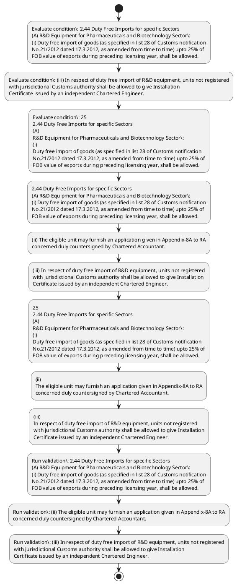

# Chapter 2 / Section 2.44: Duty Free Imports for specific Sectors

**Chapter Title:** General Provisions Regarding Imports and Exports

**Pages:** 16, 17

**Purpose:** 2.44 Duty Free Imports for specific Sectors
(A) R&D Equipment for Pharmaceuticals and Biotechnology Sector:
(i) Duty free import of goods (as specified in list 28 of Customs notification
No.21/2012 dated 17.3.2012, as amended from time to time) upto 25% of
FOB value of exports during preceding licensing year, shall be allowed.

**Purpose Thanglish:** Indha Duty Free Imports for specific Sectors section-la, 2.44 Duty Free Imports for specific Sectors
(A) R&D Equipment for Pharmaceuticals and Biotechnology Sector:
(i) Duty free import of goods (as specified in list 28 of Customs notification
No.21/2012 dated 17.3.2012, as amended from time to time) upto 25% of
FOB value of exports during preceding licensing year, kandippa be allowed.

**Summary:** 2.44 Duty Free Imports for specific Sectors
(A) R&D Equipment for Pharmaceuticals and Biotechnology Sector:
(i) Duty free import of goods (as specified in list 28 of Customs notification
No.21/2012 dated 17.3.2012, as amended from time to time) upto 25% of
FOB value of exports during preceding licensing year, shall be allowed. (ii) The eligible unit may furnish an application given in Appendix-8A to RA
concerned duly countersigned by Chartered Accountant. (iii) In respect of duty free import of R&D equipment, units not registered
with jurisdictional Customs authority shall be allowed to give Installation
Certificate issued by an independent Chartered Engineer.

**Business Meaning:** Duty Free Imports for specific Sectors governs how DGFT business controls should be applied, validated, and enforced.

**Business Explanation:** Duty Free Imports for specific Sectors explains the operating rule set that DEKAI should enforce. Key control points include 2.44 Duty Free Imports for specific Sectors
(A) R&D Equipment for Pharmaceuticals and Biotechnology Sector:
(i) Duty free import of goods (as specified in list 28 of Customs notification
No.21/2012 dated 17.3.2012, as amended from time to time) upto 25% of
FOB value of exports during preceding licensing year, shall be allowed. The section also drives actions such as 2.44 Duty Free Imports for specific Sectors
(A) R&D Equipment for Pharmaceuticals and Biotechnology Sector:
(i) Duty free import of goods (as specified in list 28 of Customs notification
No.21/2012 dated 17.3.2012, as amended from time to time) upto 25% of
FOB value of exports during preceding licensing year, shall be allowed..

**Business Explanation Thanglish:** Indha Duty Free Imports for specific Sectors section-la, Duty Free Imports for specific Sectors explains the operating rule set that DEKAI should enforce. Key control points include 2.44 Duty Free Imports for specific Sectors
(A) R&D Equipment for Pharmaceuticals and Biotechnology Sector:
(i) Duty free import of goods (as specified in list 28 of Customs notification
No.21/2012 dated 17.3.2012, as amended from time to time) upto 25% of
FOB value of exports during preceding licensing year, kandippa be allowed. The section also drives actions such as 2.44 Duty Free Imports for specific Sectors
(A) R&D Equipment for Pharmaceuticals and Biotechnology Sector:
(i) Duty free import of goods (as specified in list 28 of Customs notification
No.21/2012 dated 17.3.2012, as amended from time to time) upto 25% of
FOB value of exports during preceding licensing year, kandippa be allowed..

## Business Logic
- 2.44 Duty Free Imports for specific Sectors
(A) R&D Equipment for Pharmaceuticals and Biotechnology Sector:
(i) Duty free import of goods (as specified in list 28 of Customs notification
No.21/2012 dated 17.3.2012, as amended from time to time) upto 25% of
FOB value of exports during preceding licensing year, shall be allowed.
- (ii) The eligible unit may furnish an application given in Appendix-8A to RA
concerned duly countersigned by Chartered Accountant.
- (iii) In respect of duty free import of R&D equipment, units not registered
with jurisdictional Customs authority shall be allowed to give Installation
Certificate issued by an independent Chartered Engineer.
- 25
2.44 Duty Free Imports for specific Sectors
(A)
R&D Equipment for Pharmaceuticals and Biotechnology Sector:
(i)
Duty free import of goods (as specified in list 28 of Customs notification
No.21/2012 dated 17.3.2012, as amended from time to time) upto 25% of
FOB value of exports during preceding licensing year, shall be allowed.
- (ii)
The eligible unit may furnish an application given in Appendix-8A to RA
concerned duly countersigned by Chartered Accountant.
- (iii)
In respect of duty free import of R&D equipment, units not registered
with jurisdictional Customs authority shall be allowed to give Installation
Certificate issued by an independent Chartered Engineer.
- 21/2012 dated 17.3.2012, upto 1% of FOB value of exports made
during preceding licensing year, shall be allowed to agrochemicals sector
unit having export turnover of Rs.
- (ii) The eligible unit shall apply in form given in Appendix-8B to RA
concerned duly countersigned by Chartered Accountant.

## Business Rules
- rule_id=CH2-SEC2_44-R001, rule_description=2.44 Duty Free Imports for specific Sectors
(A) R&D Equipment for Pharmaceuticals and Biotechnology Sector:
(i) Duty free import of goods (as specified in list 28 of Customs notification
No.21/2012 dated 17.3.2012, as amended from time to time) upto 25% of
FOB value of exports during preceding licensing year, shall be allowed., trigger=Duty Free Imports for specific Sectors, condition=2.44 Duty Free Imports for specific Sectors
(A) R&D Equipment for Pharmaceuticals and Biotechnology Sector:
(i) Duty free import of goods (as specified in list 28 of Customs notification
No.21/2012 dated 17.3.2012, as amended from time to time) upto 25% of
FOB value of exports during preceding licensing year, shall be allowed., validation=2.44 Duty Free Imports for specific Sectors
(A) R&D Equipment for Pharmaceuticals and Biotechnology Sector:
(i) Duty free import of goods (as specified in list 28 of Customs notification
No.21/2012 dated 17.3.2012, as amended from time to time) upto 25% of
FOB value of exports during preceding licensing year, shall be allowed., action=2.44 Duty Free Imports for specific Sectors
(A) R&D Equipment for Pharmaceuticals and Biotechnology Sector:
(i) Duty free import of goods (as specified in list 28 of Customs notification
No.21/2012 dated 17.3.2012, as amended from time to time) upto 25% of
FOB value of exports during preceding licensing year, shall be allowed., exception=No explicit exception found in uploaded documents., output=DEKAI should produce a compliance decision for 2.44 - Duty Free Imports for specific Sectors.
- rule_id=CH2-SEC2_44-R002, rule_description=(ii) The eligible unit may furnish an application given in Appendix-8A to RA
concerned duly countersigned by Chartered Accountant., trigger=Duty Free Imports for specific Sectors, condition=(iii) In respect of duty free import of R&D equipment, units not registered
with jurisdictional Customs authority shall be allowed to give Installation
Certificate issued by an independent Chartered Engineer., validation=(ii) The eligible unit may furnish an application given in Appendix-8A to RA
concerned duly countersigned by Chartered Accountant., action=(ii) The eligible unit may furnish an application given in Appendix-8A to RA
concerned duly countersigned by Chartered Accountant., exception=No explicit exception found in uploaded documents., output=DEKAI should produce a compliance decision for 2.44 - Duty Free Imports for specific Sectors.
- rule_id=CH2-SEC2_44-R003, rule_description=(iii) In respect of duty free import of R&D equipment, units not registered
with jurisdictional Customs authority shall be allowed to give Installation
Certificate issued by an independent Chartered Engineer., trigger=Duty Free Imports for specific Sectors, condition=25
2.44 Duty Free Imports for specific Sectors
(A)
R&D Equipment for Pharmaceuticals and Biotechnology Sector:
(i)
Duty free import of goods (as specified in list 28 of Customs notification
No.21/2012 dated 17.3.2012, as amended from time to time) upto 25% of
FOB value of exports during preceding licensing year, shall be allowed., validation=(iii) In respect of duty free import of R&D equipment, units not registered
with jurisdictional Customs authority shall be allowed to give Installation
Certificate issued by an independent Chartered Engineer., action=(iii) In respect of duty free import of R&D equipment, units not registered
with jurisdictional Customs authority shall be allowed to give Installation
Certificate issued by an independent Chartered Engineer., exception=No explicit exception found in uploaded documents., output=DEKAI should produce a compliance decision for 2.44 - Duty Free Imports for specific Sectors.
- rule_id=CH2-SEC2_44-R004, rule_description=25
2.44 Duty Free Imports for specific Sectors
(A)
R&D Equipment for Pharmaceuticals and Biotechnology Sector:
(i)
Duty free import of goods (as specified in list 28 of Customs notification
No.21/2012 dated 17.3.2012, as amended from time to time) upto 25% of
FOB value of exports during preceding licensing year, shall be allowed., trigger=Duty Free Imports for specific Sectors, condition=(iii)
In respect of duty free import of R&D equipment, units not registered
with jurisdictional Customs authority shall be allowed to give Installation
Certificate issued by an independent Chartered Engineer., validation=25
2.44 Duty Free Imports for specific Sectors
(A)
R&D Equipment for Pharmaceuticals and Biotechnology Sector:
(i)
Duty free import of goods (as specified in list 28 of Customs notification
No.21/2012 dated 17.3.2012, as amended from time to time) upto 25% of
FOB value of exports during preceding licensing year, shall be allowed., action=25
2.44 Duty Free Imports for specific Sectors
(A)
R&D Equipment for Pharmaceuticals and Biotechnology Sector:
(i)
Duty free import of goods (as specified in list 28 of Customs notification
No.21/2012 dated 17.3.2012, as amended from time to time) upto 25% of
FOB value of exports during preceding licensing year, shall be allowed., exception=No explicit exception found in uploaded documents., output=DEKAI should produce a compliance decision for 2.44 - Duty Free Imports for specific Sectors.
- rule_id=CH2-SEC2_44-R005, rule_description=(ii)
The eligible unit may furnish an application given in Appendix-8A to RA
concerned duly countersigned by Chartered Accountant., trigger=Duty Free Imports for specific Sectors, condition=25
(i) Duty free imports of goods as specified in list 28A of Customs notification
No., validation=(ii)
The eligible unit may furnish an application given in Appendix-8A to RA
concerned duly countersigned by Chartered Accountant., action=(ii)
The eligible unit may furnish an application given in Appendix-8A to RA
concerned duly countersigned by Chartered Accountant., exception=No explicit exception found in uploaded documents., output=DEKAI should produce a compliance decision for 2.44 - Duty Free Imports for specific Sectors.
- rule_id=CH2-SEC2_44-R006, rule_description=(iii)
In respect of duty free import of R&D equipment, units not registered
with jurisdictional Customs authority shall be allowed to give Installation
Certificate issued by an independent Chartered Engineer., trigger=Duty Free Imports for specific Sectors, condition=25
(i) Duty free imports of goods as specified in list 28A of Customs notification
No., validation=(iii)
In respect of duty free import of R&D equipment, units not registered
with jurisdictional Customs authority shall be allowed to give Installation
Certificate issued by an independent Chartered Engineer., action=(iii)
In respect of duty free import of R&D equipment, units not registered
with jurisdictional Customs authority shall be allowed to give Installation
Certificate issued by an independent Chartered Engineer., exception=No explicit exception found in uploaded documents., output=DEKAI should produce a compliance decision for 2.44 - Duty Free Imports for specific Sectors.
- rule_id=CH2-SEC2_44-R007, rule_description=21/2012 dated 17.3.2012, upto 1% of FOB value of exports made
during preceding licensing year, shall be allowed to agrochemicals sector
unit having export turnover of Rs., trigger=Duty Free Imports for specific Sectors, condition=25
(i) Duty free imports of goods as specified in list 28A of Customs notification
No., validation=21/2012 dated 17.3.2012, upto 1% of FOB value of exports made
during preceding licensing year, shall be allowed to agrochemicals sector
unit having export turnover of Rs., action=(ii) The eligible unit shall apply in form given in Appendix-8B to RA
concerned duly countersigned by Chartered Accountant., exception=No explicit exception found in uploaded documents., output=DEKAI should produce a compliance decision for 2.44 - Duty Free Imports for specific Sectors.
- rule_id=CH2-SEC2_44-R008, rule_description=(ii) The eligible unit shall apply in form given in Appendix-8B to RA
concerned duly countersigned by Chartered Accountant., trigger=Duty Free Imports for specific Sectors, condition=25
(i) Duty free imports of goods as specified in list 28A of Customs notification
No., validation=(ii) The eligible unit shall apply in form given in Appendix-8B to RA
concerned duly countersigned by Chartered Accountant., action=(ii) The eligible unit shall apply in form given in Appendix-8B to RA
concerned duly countersigned by Chartered Accountant., exception=No explicit exception found in uploaded documents., output=DEKAI should produce a compliance decision for 2.44 - Duty Free Imports for specific Sectors.

## Conditions
- 2.44 Duty Free Imports for specific Sectors
(A) R&D Equipment for Pharmaceuticals and Biotechnology Sector:
(i) Duty free import of goods (as specified in list 28 of Customs notification
No.21/2012 dated 17.3.2012, as amended from time to time) upto 25% of
FOB value of exports during preceding licensing year, shall be allowed.
- (iii) In respect of duty free import of R&D equipment, units not registered
with jurisdictional Customs authority shall be allowed to give Installation
Certificate issued by an independent Chartered Engineer.
- 25
2.44 Duty Free Imports for specific Sectors
(A)
R&D Equipment for Pharmaceuticals and Biotechnology Sector:
(i)
Duty free import of goods (as specified in list 28 of Customs notification
No.21/2012 dated 17.3.2012, as amended from time to time) upto 25% of
FOB value of exports during preceding licensing year, shall be allowed.
- (iii)
In respect of duty free import of R&D equipment, units not registered
with jurisdictional Customs authority shall be allowed to give Installation
Certificate issued by an independent Chartered Engineer.
- 25
(i) Duty free imports of goods as specified in list 28A of Customs notification
No.

## Condition Logic
- id=2.2.44.1, if=2.44 Duty Free Imports for specific Sectors
(A) R&D Equipment for Pharmaceuticals and Biotechnology Sector:
(i) Duty free import of goods (as specified in list 28 of Customs notification
No.21/2012 dated 17.3.2012, as amended from time to time) upto 25% of
FOB value of exports during preceding licensing year, shall be allowed., then=2.44 Duty Free Imports for specific Sectors
(A) R&D Equipment for Pharmaceuticals and Biotechnology Sector:
(i) Duty free import of goods (as specified in list 28 of Customs notification
No.21/2012 dated 17.3.2012, as amended from time to time) upto 25% of
FOB value of exports during preceding licensing year, shall be allowed., source=2.44 Duty Free Imports for specific Sectors
(A) R&D Equipment for Pharmaceuticals and Biotechnology Sector:
(i) Duty free import of goods (as specified in list 28 of Customs notification
No.21/2012 dated 17.3.2012, as amended from time to time) upto 25% of
FOB value of exports during preceding licensing year, shall be allowed.
- id=2.2.44.2, if=(iii) In respect of duty free import of R&D equipment, units not registered
with jurisdictional Customs authority shall be allowed to give Installation
Certificate issued by an independent Chartered Engineer., then=2.44 Duty Free Imports for specific Sectors
(A) R&D Equipment for Pharmaceuticals and Biotechnology Sector:
(i) Duty free import of goods (as specified in list 28 of Customs notification
No.21/2012 dated 17.3.2012, as amended from time to time) upto 25% of
FOB value of exports during preceding licensing year, shall be allowed., source=(iii) In respect of duty free import of R&D equipment, units not registered
with jurisdictional Customs authority shall be allowed to give Installation
Certificate issued by an independent Chartered Engineer.
- id=2.2.44.3, if=25
2.44 Duty Free Imports for specific Sectors
(A)
R&D Equipment for Pharmaceuticals and Biotechnology Sector:
(i)
Duty free import of goods (as specified in list 28 of Customs notification
No.21/2012 dated 17.3.2012, as amended from time to time) upto 25% of
FOB value of exports during preceding licensing year, shall be allowed., then=2.44 Duty Free Imports for specific Sectors
(A) R&D Equipment for Pharmaceuticals and Biotechnology Sector:
(i) Duty free import of goods (as specified in list 28 of Customs notification
No.21/2012 dated 17.3.2012, as amended from time to time) upto 25% of
FOB value of exports during preceding licensing year, shall be allowed., source=25
2.44 Duty Free Imports for specific Sectors
(A)
R&D Equipment for Pharmaceuticals and Biotechnology Sector:
(i)
Duty free import of goods (as specified in list 28 of Customs notification
No.21/2012 dated 17.3.2012, as amended from time to time) upto 25% of
FOB value of exports during preceding licensing year, shall be allowed.
- id=2.2.44.4, if=(iii)
In respect of duty free import of R&D equipment, units not registered
with jurisdictional Customs authority shall be allowed to give Installation
Certificate issued by an independent Chartered Engineer., then=2.44 Duty Free Imports for specific Sectors
(A) R&D Equipment for Pharmaceuticals and Biotechnology Sector:
(i) Duty free import of goods (as specified in list 28 of Customs notification
No.21/2012 dated 17.3.2012, as amended from time to time) upto 25% of
FOB value of exports during preceding licensing year, shall be allowed., source=(iii)
In respect of duty free import of R&D equipment, units not registered
with jurisdictional Customs authority shall be allowed to give Installation
Certificate issued by an independent Chartered Engineer.
- id=2.2.44.5, if=25
(i) Duty free imports of goods as specified in list 28A of Customs notification
No., then=2.44 Duty Free Imports for specific Sectors
(A) R&D Equipment for Pharmaceuticals and Biotechnology Sector:
(i) Duty free import of goods (as specified in list 28 of Customs notification
No.21/2012 dated 17.3.2012, as amended from time to time) upto 25% of
FOB value of exports during preceding licensing year, shall be allowed., source=25
(i) Duty free imports of goods as specified in list 28A of Customs notification
No.

## Validations
- 2.44 Duty Free Imports for specific Sectors
(A) R&D Equipment for Pharmaceuticals and Biotechnology Sector:
(i) Duty free import of goods (as specified in list 28 of Customs notification
No.21/2012 dated 17.3.2012, as amended from time to time) upto 25% of
FOB value of exports during preceding licensing year, shall be allowed.
- (ii) The eligible unit may furnish an application given in Appendix-8A to RA
concerned duly countersigned by Chartered Accountant.
- (iii) In respect of duty free import of R&D equipment, units not registered
with jurisdictional Customs authority shall be allowed to give Installation
Certificate issued by an independent Chartered Engineer.
- 25
2.44 Duty Free Imports for specific Sectors
(A)
R&D Equipment for Pharmaceuticals and Biotechnology Sector:
(i)
Duty free import of goods (as specified in list 28 of Customs notification
No.21/2012 dated 17.3.2012, as amended from time to time) upto 25% of
FOB value of exports during preceding licensing year, shall be allowed.
- (ii)
The eligible unit may furnish an application given in Appendix-8A to RA
concerned duly countersigned by Chartered Accountant.
- (iii)
In respect of duty free import of R&D equipment, units not registered
with jurisdictional Customs authority shall be allowed to give Installation
Certificate issued by an independent Chartered Engineer.
- 21/2012 dated 17.3.2012, upto 1% of FOB value of exports made
during preceding licensing year, shall be allowed to agrochemicals sector
unit having export turnover of Rs.
- (ii) The eligible unit shall apply in form given in Appendix-8B to RA
concerned duly countersigned by Chartered Accountant.

## Exceptions
- None identified

## Dependencies
- 1

## Authorities
- Customs
- RA
- Customs authority

## Required Documents
- (ii) The eligible unit may furnish an application given in Appendix-8A to RA
concerned duly countersigned by Chartered Accountant.
- (iii) In respect of duty free import of R&D equipment, units not registered
with jurisdictional Customs authority shall be allowed to give Installation
Certificate issued by an independent Chartered Engineer.
- (ii)
The eligible unit may furnish an application given in Appendix-8A to RA
concerned duly countersigned by Chartered Accountant.
- (iii)
In respect of duty free import of R&D equipment, units not registered
with jurisdictional Customs authority shall be allowed to give Installation
Certificate issued by an independent Chartered Engineer.

## Timelines
- None identified

## Actions
- 2.44 Duty Free Imports for specific Sectors
(A) R&D Equipment for Pharmaceuticals and Biotechnology Sector:
(i) Duty free import of goods (as specified in list 28 of Customs notification
No.21/2012 dated 17.3.2012, as amended from time to time) upto 25% of
FOB value of exports during preceding licensing year, shall be allowed.
- (ii) The eligible unit may furnish an application given in Appendix-8A to RA
concerned duly countersigned by Chartered Accountant.
- (iii) In respect of duty free import of R&D equipment, units not registered
with jurisdictional Customs authority shall be allowed to give Installation
Certificate issued by an independent Chartered Engineer.
- 25
2.44 Duty Free Imports for specific Sectors
(A)
R&D Equipment for Pharmaceuticals and Biotechnology Sector:
(i)
Duty free import of goods (as specified in list 28 of Customs notification
No.21/2012 dated 17.3.2012, as amended from time to time) upto 25% of
FOB value of exports during preceding licensing year, shall be allowed.
- (ii)
The eligible unit may furnish an application given in Appendix-8A to RA
concerned duly countersigned by Chartered Accountant.
- (iii)
In respect of duty free import of R&D equipment, units not registered
with jurisdictional Customs authority shall be allowed to give Installation
Certificate issued by an independent Chartered Engineer.
- (ii) The eligible unit shall apply in form given in Appendix-8B to RA
concerned duly countersigned by Chartered Accountant.

## Workflow
- Evaluate condition: 2.44 Duty Free Imports for specific Sectors
(A) R&D Equipment for Pharmaceuticals and Biotechnology Sector:
(i) Duty free import of goods (as specified in list 28 of Customs notification
No.21/2012 dated 17.3.2012, as amended from time to time) upto 25% of
FOB value of exports during preceding licensing year, shall be allowed.
- Evaluate condition: (iii) In respect of duty free import of R&D equipment, units not registered
with jurisdictional Customs authority shall be allowed to give Installation
Certificate issued by an independent Chartered Engineer.
- Evaluate condition: 25
2.44 Duty Free Imports for specific Sectors
(A)
R&D Equipment for Pharmaceuticals and Biotechnology Sector:
(i)
Duty free import of goods (as specified in list 28 of Customs notification
No.21/2012 dated 17.3.2012, as amended from time to time) upto 25% of
FOB value of exports during preceding licensing year, shall be allowed.
- 2.44 Duty Free Imports for specific Sectors
(A) R&D Equipment for Pharmaceuticals and Biotechnology Sector:
(i) Duty free import of goods (as specified in list 28 of Customs notification
No.21/2012 dated 17.3.2012, as amended from time to time) upto 25% of
FOB value of exports during preceding licensing year, shall be allowed.
- (ii) The eligible unit may furnish an application given in Appendix-8A to RA
concerned duly countersigned by Chartered Accountant.
- (iii) In respect of duty free import of R&D equipment, units not registered
with jurisdictional Customs authority shall be allowed to give Installation
Certificate issued by an independent Chartered Engineer.
- 25
2.44 Duty Free Imports for specific Sectors
(A)
R&D Equipment for Pharmaceuticals and Biotechnology Sector:
(i)
Duty free import of goods (as specified in list 28 of Customs notification
No.21/2012 dated 17.3.2012, as amended from time to time) upto 25% of
FOB value of exports during preceding licensing year, shall be allowed.
- (ii)
The eligible unit may furnish an application given in Appendix-8A to RA
concerned duly countersigned by Chartered Accountant.
- (iii)
In respect of duty free import of R&D equipment, units not registered
with jurisdictional Customs authority shall be allowed to give Installation
Certificate issued by an independent Chartered Engineer.
- Run validation: 2.44 Duty Free Imports for specific Sectors
(A) R&D Equipment for Pharmaceuticals and Biotechnology Sector:
(i) Duty free import of goods (as specified in list 28 of Customs notification
No.21/2012 dated 17.3.2012, as amended from time to time) upto 25% of
FOB value of exports during preceding licensing year, shall be allowed.
- Run validation: (ii) The eligible unit may furnish an application given in Appendix-8A to RA
concerned duly countersigned by Chartered Accountant.
- Run validation: (iii) In respect of duty free import of R&D equipment, units not registered
with jurisdictional Customs authority shall be allowed to give Installation
Certificate issued by an independent Chartered Engineer.

## Workflow ASCII
```text
Duty Free Imports for specific Sectors
Evaluate condition: 2.44 Duty Free Imports for specific Sectors
(A) R&D Equipment for Pharmaceuticals and Biotechnology Sector:
(i) Duty free import of goods (as specified in list 28 of Customs notification
No.21/2012 dated 17.3.2012, as amended from time to time) upto 25% of
FOB value of exports during preceding licensing year, shall be allowed.
   |
   v
Evaluate condition: (iii) In respect of duty free import of R&D equipment, units not registered
with jurisdictional Customs authority shall be allowed to give Installation
Certificate issued by an independent Chartered Engineer.
   |
   v
Evaluate condition: 25
2.44 Duty Free Imports for specific Sectors
(A)
R&D Equipment for Pharmaceuticals and Biotechnology Sector:
(i)
Duty free import of goods (as specified in list 28 of Customs notification
No.21/2012 dated 17.3.2012, as amended from time to time) upto 25% of
FOB value of exports during preceding licensing year, shall be allowed.
   |
   v
2.44 Duty Free Imports for specific Sectors
(A) R&D Equipment for Pharmaceuticals and Biotechnology Sector:
(i) Duty free import of goods (as specified in list 28 of Customs notification
No.21/2012 dated 17.3.2012, as amended from time to time) upto 25% of
FOB value of exports during preceding licensing year, shall be allowed.
   |
   v
(ii) The eligible unit may furnish an application given in Appendix-8A to RA
concerned duly countersigned by Chartered Accountant.
   |
   v
(iii) In respect of duty free import of R&D equipment, units not registered
with jurisdictional Customs authority shall be allowed to give Installation
Certificate issued by an independent Chartered Engineer.
   |
   v
25
2.44 Duty Free Imports for specific Sectors
(A)
R&D Equipment for Pharmaceuticals and Biotechnology Sector:
(i)
Duty free import of goods (as specified in list 28 of Customs notification
No.21/2012 dated 17.3.2012, as amended from time to time) upto 25% of
FOB value of exports during preceding licensing year, shall be allowed.
   |
   v
(ii)
The eligible unit may furnish an application given in Appendix-8A to RA
concerned duly countersigned by Chartered Accountant.
   |
   v
(iii)
In respect of duty free import of R&D equipment, units not registered
with jurisdictional Customs authority shall be allowed to give Installation
Certificate issued by an independent Chartered Engineer.
   |
   v
Run validation: 2.44 Duty Free Imports for specific Sectors
(A) R&D Equipment for Pharmaceuticals and Biotechnology Sector:
(i) Duty free import of goods (as specified in list 28 of Customs notification
No.21/2012 dated 17.3.2012, as amended from time to time) upto 25% of
FOB value of exports during preceding licensing year, shall be allowed.
   |
   v
Run validation: (ii) The eligible unit may furnish an application given in Appendix-8A to RA
concerned duly countersigned by Chartered Accountant.
   |
   v
Run validation: (iii) In respect of duty free import of R&D equipment, units not registered
with jurisdictional Customs authority shall be allowed to give Installation
Certificate issued by an independent Chartered Engineer.
```

## Decision Tree
- IF 2.44 Duty Free Imports for specific Sectors
(A) R&D Equipment for Pharmaceuticals and Biotechnology Sector:
(i) Duty free import of goods (as specified in list 28 of Customs notification
No.21/2012 dated 17.3.2012, as amended from time to time) upto 25% of
FOB value of exports during preceding licensing year, shall be allowed. THEN 2.44 Duty Free Imports for specific Sectors
(A) R&D Equipment for Pharmaceuticals and Biotechnology Sector:
(i) Duty free import of goods (as specified in list 28 of Customs notification
No.21/2012 dated 17.3.2012, as amended from time to time) upto 25% of
FOB value of exports during preceding licensing year, shall be allowed.
- IF (iii) In respect of duty free import of R&D equipment, units not registered
with jurisdictional Customs authority shall be allowed to give Installation
Certificate issued by an independent Chartered Engineer. THEN 2.44 Duty Free Imports for specific Sectors
(A) R&D Equipment for Pharmaceuticals and Biotechnology Sector:
(i) Duty free import of goods (as specified in list 28 of Customs notification
No.21/2012 dated 17.3.2012, as amended from time to time) upto 25% of
FOB value of exports during preceding licensing year, shall be allowed.
- IF 25
2.44 Duty Free Imports for specific Sectors
(A)
R&D Equipment for Pharmaceuticals and Biotechnology Sector:
(i)
Duty free import of goods (as specified in list 28 of Customs notification
No.21/2012 dated 17.3.2012, as amended from time to time) upto 25% of
FOB value of exports during preceding licensing year, shall be allowed. THEN 2.44 Duty Free Imports for specific Sectors
(A) R&D Equipment for Pharmaceuticals and Biotechnology Sector:
(i) Duty free import of goods (as specified in list 28 of Customs notification
No.21/2012 dated 17.3.2012, as amended from time to time) upto 25% of
FOB value of exports during preceding licensing year, shall be allowed.
- IF (iii)
In respect of duty free import of R&D equipment, units not registered
with jurisdictional Customs authority shall be allowed to give Installation
Certificate issued by an independent Chartered Engineer. THEN 2.44 Duty Free Imports for specific Sectors
(A) R&D Equipment for Pharmaceuticals and Biotechnology Sector:
(i) Duty free import of goods (as specified in list 28 of Customs notification
No.21/2012 dated 17.3.2012, as amended from time to time) upto 25% of
FOB value of exports during preceding licensing year, shall be allowed.
- IF 25
(i) Duty free imports of goods as specified in list 28A of Customs notification
No. THEN 2.44 Duty Free Imports for specific Sectors
(A) R&D Equipment for Pharmaceuticals and Biotechnology Sector:
(i) Duty free import of goods (as specified in list 28 of Customs notification
No.21/2012 dated 17.3.2012, as amended from time to time) upto 25% of
FOB value of exports during preceding licensing year, shall be allowed.

## Decision Tree ASCII
```text
Duty Free Imports for specific Sectors Decision
IF 2.44 Duty Free Imports for specific Sectors
(A) R&D Equipment for Pharmaceuticals and Biotechnology Sector:
(i) Duty free import of goods (as specified in list 28 of Customs notification
No.21/2012 dated 17.3.2012, as amended from time to time) upto 25% of
FOB value of exports during preceding licensing year, shall be allowed. THEN 2.44 Duty Free Imports for specific Sectors
(A) R&D Equipment for Pharmaceuticals and Biotechnology Sector:
(i) Duty free import of goods (as specified in list 28 of Customs notification
No.21/2012 dated 17.3.2012, as amended from time to time) upto 25% of
FOB value of exports during preceding licensing year, shall be allowed.
   |
   v
IF (iii) In respect of duty free import of R&D equipment, units not registered
with jurisdictional Customs authority shall be allowed to give Installation
Certificate issued by an independent Chartered Engineer. THEN 2.44 Duty Free Imports for specific Sectors
(A) R&D Equipment for Pharmaceuticals and Biotechnology Sector:
(i) Duty free import of goods (as specified in list 28 of Customs notification
No.21/2012 dated 17.3.2012, as amended from time to time) upto 25% of
FOB value of exports during preceding licensing year, shall be allowed.
   |
   v
IF 25
2.44 Duty Free Imports for specific Sectors
(A)
R&D Equipment for Pharmaceuticals and Biotechnology Sector:
(i)
Duty free import of goods (as specified in list 28 of Customs notification
No.21/2012 dated 17.3.2012, as amended from time to time) upto 25% of
FOB value of exports during preceding licensing year, shall be allowed. THEN 2.44 Duty Free Imports for specific Sectors
(A) R&D Equipment for Pharmaceuticals and Biotechnology Sector:
(i) Duty free import of goods (as specified in list 28 of Customs notification
No.21/2012 dated 17.3.2012, as amended from time to time) upto 25% of
FOB value of exports during preceding licensing year, shall be allowed.
   |
   v
IF (iii)
In respect of duty free import of R&D equipment, units not registered
with jurisdictional Customs authority shall be allowed to give Installation
Certificate issued by an independent Chartered Engineer. THEN 2.44 Duty Free Imports for specific Sectors
(A) R&D Equipment for Pharmaceuticals and Biotechnology Sector:
(i) Duty free import of goods (as specified in list 28 of Customs notification
No.21/2012 dated 17.3.2012, as amended from time to time) upto 25% of
FOB value of exports during preceding licensing year, shall be allowed.
   |
   v
IF 25
(i) Duty free imports of goods as specified in list 28A of Customs notification
No. THEN 2.44 Duty Free Imports for specific Sectors
(A) R&D Equipment for Pharmaceuticals and Biotechnology Sector:
(i) Duty free import of goods (as specified in list 28 of Customs notification
No.21/2012 dated 17.3.2012, as amended from time to time) upto 25% of
FOB value of exports during preceding licensing year, shall be allowed.
```

## Examples
- User asks to process Duty Free Imports for specific Sectors; the platform checks conditions, validations, and documents before action.

**Real-world Example:** Example: an importer or exporter invokes Duty Free Imports for specific Sectors, submits (ii) The eligible unit may furnish an application given in Appendix-8A to RA
concerned duly countersigned by Chartered Accountant., (iii) In respect of duty free import of R&D equipment, units not registered
with jurisdictional Customs authority shall be allowed to give Installation
Certificate issued by an independent Chartered Engineer., (ii)
The eligible unit may furnish an application given in Appendix-8A to RA
concerned duly countersigned by Chartered Accountant., and DEKAI uses the extracted rules to 2.44 duty free imports for specific sectors
(a) r&d equipment for pharmaceuticals and biotechnology sector:
(i) duty free import of goods (as specified in list 28 of customs notification
no.21/2012 dated 17.3.2012, as amended from time to time) upto 25% of
fob value of exports during preceding licensing year, shall be allowed..

**Real-world Example Thanglish:** Indha Duty Free Imports for specific Sectors section-la, Example: an importer or exporter invokes Duty Free Imports for specific Sectors, submits (ii) The eligible unit may furnish an application given in Appendix-8A to RA
concerned duly countersigned by Chartered Accountant., (iii) In respect of duty free import of R&D equipment, units not registered
with jurisdictional Customs authority kandippa be allowed to give Installation
Certificate issued by an independent Chartered Engineer., (ii)
The eligible unit may furnish an application given in Appendix-8A to RA
concerned duly countersigned by Chartered Accountant., and DEKAI uses the extracted rules to 2.44 duty free imports for specific sectors
(a) r&d equipment for pharmaceuticals and biotechnology sector:
(i) duty free import of goods (as specified in list 28 of customs notification
no.21/2012 dated 17.3.2012, as amended from time to time) upto 25% of
fob value of exports during preceding licensing year, kandippa be allowed..

## AI Rules
- IF detected context matches section rule THEN enforce: 2.44 Duty Free Imports for specific Sectors
(A) R&D Equipment for Pharmaceuticals and Biotechnology Sector:
(i) Duty free import of goods (as specified in list 28 of Customs notification
No.21/2012 dated 17.3.2012, as amended from time to time) upto 25% of
FOB value of exports during preceding licensing year, shall be allowed.
- IF detected context matches section rule THEN enforce: (ii) The eligible unit may furnish an application given in Appendix-8A to RA
concerned duly countersigned by Chartered Accountant.
- IF detected context matches section rule THEN enforce: (iii) In respect of duty free import of R&D equipment, units not registered
with jurisdictional Customs authority shall be allowed to give Installation
Certificate issued by an independent Chartered Engineer.
- IF detected context matches section rule THEN enforce: 25
2.44 Duty Free Imports for specific Sectors
(A)
R&D Equipment for Pharmaceuticals and Biotechnology Sector:
(i)
Duty free import of goods (as specified in list 28 of Customs notification
No.21/2012 dated 17.3.2012, as amended from time to time) upto 25% of
FOB value of exports during preceding licensing year, shall be allowed.
- IF detected context matches section rule THEN enforce: (ii)
The eligible unit may furnish an application given in Appendix-8A to RA
concerned duly countersigned by Chartered Accountant.
- IF detected context matches section rule THEN enforce: (iii)
In respect of duty free import of R&D equipment, units not registered
with jurisdictional Customs authority shall be allowed to give Installation
Certificate issued by an independent Chartered Engineer.
- IF validations pass THEN recommend action: 2.44 Duty Free Imports for specific Sectors
(A) R&D Equipment for Pharmaceuticals and Biotechnology Sector:
(i) Duty free import of goods (as specified in list 28 of Customs notification
No.21/2012 dated 17.3.2012, as amended from time to time) upto 25% of
FOB value of exports during preceding licensing year, shall be allowed.

## Database Fields
- name=section_code, type=string, required=True, source=parsed_section_heading
- name=section_title, type=string, required=True, source=parsed_section_heading
- name=for_flag, type=boolean, required=False, source=keyword:for
- name=r&d_flag, type=boolean, required=False, source=keyword:R&D
- name=and_flag, type=boolean, required=False, source=keyword:and
- name=fob_flag, type=boolean, required=False, source=keyword:FOB
- name=the_flag, type=boolean, required=False, source=keyword:The
- name=may_flag, type=boolean, required=False, source=keyword:may
- name=iii_flag, type=boolean, required=False, source=keyword:iii
- name=not_flag, type=boolean, required=False, source=keyword:not
- name=document_1_submitted, type=boolean, required=True, source=(ii) The eligible unit may furnish an application given in Appendix-8A to RA
concerned duly countersigned by Chartered Accountant.
- name=document_2_submitted, type=boolean, required=True, source=(iii) In respect of duty free import of R&D equipment, units not registered
with jurisdictional Customs authority shall be allowed to give Installation
Certificate issued by an independent Chartered Engineer.
- name=document_3_submitted, type=boolean, required=True, source=(ii)
The eligible unit may furnish an application given in Appendix-8A to RA
concerned duly countersigned by Chartered Accountant.
- name=document_4_submitted, type=boolean, required=True, source=(iii)
In respect of duty free import of R&D equipment, units not registered
with jurisdictional Customs authority shall be allowed to give Installation
Certificate issued by an independent Chartered Engineer.

## API Requirements
- method=GET, path=/api/dgft/sections/2.44, purpose=Retrieve knowledge payload for section 2.44, query_params=['include=workflow,decision_tree,validations'], response_fields=['section', 'title', 'summary', 'conditions', 'validations', 'exceptions', 'workflow', 'decision_tree']
- method=POST, path=/api/dgft/Duty-Free-Imports-for-specific-Sectors/validate, purpose=Validate inputs and documents for Duty Free Imports for specific Sectors, request_fields=['section_code', 'section_title', 'document_1_submitted', 'document_2_submitted', 'document_3_submitted', 'document_4_submitted'], response_fields=['status', 'errors', 'warnings', 'next_actions']
- method=POST, path=/api/dgft/Duty-Free-Imports-for-specific-Sectors/execute, purpose=Trigger business action for 2.44 Duty Free Imports for specific Sectors
(A) R&D Equipment for Pharmaceuticals and Biotechnology Sector:
(i) Duty free import of goods (as specified in list 28 of Customs notification
No.21/2012 dated 17.3.2012, as amended from time to time) upto 25% of
FOB value of exports during preceding licensing year, shall be allowed., request_fields=['section_code', 'section_title', 'document_1_submitted', 'document_2_submitted', 'document_3_submitted', 'document_4_submitted'], response_fields=['reference_id', 'status', 'authority', 'timeline']

## UI Screens
- screen_id=Duty_Free_Imports_for_specific_Sectors_overview, name=Duty Free Imports for specific Sectors Overview, purpose=Show section summary, authority, timeline, and eligibility cues., widgets=['summary_card', 'conditions_table', 'authority_badges', 'timeline_panel']
- screen_id=Duty_Free_Imports_for_specific_Sectors_submission, name=Duty Free Imports for specific Sectors Submission, purpose=Capture applicant data and supporting documents., widgets=['dynamic_form', 'document_uploader', 'validation_panel', 'next_action_footer'], fields=['section_code', 'section_title', 'for_flag', 'r&d_flag', 'and_flag', 'fob_flag', 'the_flag', 'may_flag']

## Error Messages
- Validation failed because the section requirements were not fully met.

## FAQ
- question_en=What is the purpose of section 2.44?, answer_en=Duty Free Imports for specific Sectors explains the operating rule set that DEKAI should enforce. Key control points include 2.44 Duty Free Imports for specific Sectors
(A) R&D Equipment for Pharmaceuticals and Biotechnology Sector:
(i) Duty free import of goods (as specified in list 28 of Customs notification
No.21/2012 dated 17.3.2012, as amended from time to time) upto 25% of
FOB value of exports during preceding licensing year, shall be allowed. The section also drives actions such as 2.44 Duty Free Imports for specific Sectors
(A) R&D Equipment for Pharmaceuticals and Biotechnology Sector:
(i) Duty free import of goods (as specified in list 28 of Customs notification
No.21/2012 dated 17.3.2012, as amended from time to time) upto 25% of
FOB value of exports during preceding licensing year, shall be allowed.., question_thanglish=Indha Duty Free Imports for specific Sectors section-la, What is the purpose of section 2.44?, answer_thanglish=Indha Duty Free Imports for specific Sectors section-la, Duty Free Imports for specific Sectors explains the operating rule set that DEKAI should enforce. Key control points include 2.44 Duty Free Imports for specific Sectors
(A) R&D Equipment for Pharmaceuticals and Biotechnology Sector:
(i) Duty free import of goods (as specified in list 28 of Customs notification
No.21/2012 dated 17.3.2012, as amended from time to time) upto 25% of
FOB value of exports during preceding licensing year, kandippa be allowed. The section also drives actions such as 2.44 Duty Free Imports for specific Sectors
(A) R&D Equipment for Pharmaceuticals and Biotechnology Sector:
(i) Duty free import of goods (as specified in list 28 of Customs notification
No.21/2012 dated 17.3.2012, as amended from time to time) upto 25% of
FOB value of exports during preceding licensing year, kandippa be allowed..
- question_en=What documents are required under Duty Free Imports for specific Sectors?, answer_en=(ii) The eligible unit may furnish an application given in Appendix-8A to RA
concerned duly countersigned by Chartered Accountant., (iii) In respect of duty free import of R&D equipment, units not registered
with jurisdictional Customs authority shall be allowed to give Installation
Certificate issued by an independent Chartered Engineer., (ii)
The eligible unit may furnish an application given in Appendix-8A to RA
concerned duly countersigned by Chartered Accountant., (iii)
In respect of duty free import of R&D equipment, units not registered
with jurisdictional Customs authority shall be allowed to give Installation
Certificate issued by an independent Chartered Engineer., question_thanglish=Indha Duty Free Imports for specific Sectors section-la, What documents are required under Duty Free Imports for specific Sectors?, answer_thanglish=Indha Duty Free Imports for specific Sectors section-la, (ii) The eligible unit may furnish an application given in Appendix-8A to RA
concerned duly countersigned by Chartered Accountant., (iii) In respect of duty free import of R&D equipment, units not registered
with jurisdictional Customs authority kandippa be allowed to give Installation
Certificate issued by an independent Chartered Engineer., (ii)
The eligible unit may furnish an application given in Appendix-8A to RA
concerned duly countersigned by Chartered Accountant., (iii)
In respect of duty free import of R&D equipment, units not registered
with jurisdictional Customs authority kandippa be allowed to give Installation
Certificate issued by an independent Chartered Engineer.
- question_en=Which authority handles Duty Free Imports for specific Sectors?, answer_en=Customs, RA, Customs authority, question_thanglish=Indha Duty Free Imports for specific Sectors section-la, Which authority handles Duty Free Imports for specific Sectors?, answer_thanglish=Indha Duty Free Imports for specific Sectors section-la, Customs, RA, Customs authority

## Questions Users May Ask
- What does Duty Free Imports for specific Sectors require?
- Which documents are needed for Duty Free Imports for specific Sectors?
- How does DEKAI validate Duty Free Imports for specific Sectors requests?
- What action should be taken for Duty Free Imports for specific Sectors?

## Expected AI Answers
- Duty Free Imports for specific Sectors requires the platform to interpret the section text, apply the extracted business rules, and present the correct next action.
- Required documents are inferred from the section text: (ii) The eligible unit may furnish an application given in Appendix-8A to RA
concerned duly countersigned by Chartered Accountant., (iii) In respect of duty free import of R&D equipment, units not registered
with jurisdictional Customs authority shall be allowed to give Installation
Certificate issued by an independent Chartered Engineer., (ii)
The eligible unit may furnish an application given in Appendix-8A to RA
concerned duly countersigned by Chartered Accountant., (iii)
In respect of duty free import of R&D equipment, units not registered
with jurisdictional Customs authority shall be allowed to give Installation
Certificate issued by an independent Chartered Engineer.
- DEKAI validates Duty Free Imports for specific Sectors by checking conditions, required documents, authority references, and exception clauses before recommending an outcome.
- The primary extracted action is: 2.44 Duty Free Imports for specific Sectors
(A) R&D Equipment for Pharmaceuticals and Biotechnology Sector:
(i) Duty free import of goods (as specified in list 28 of Customs notification
No.21/2012 dated 17.3.2012, as amended from time to time) upto 25% of
FOB value of exports during preceding licensing year, shall be allowed.

## AI Q&A Examples
- question_en=User asks: How do I comply with Duty Free Imports for specific Sectors?, answer_en=AI answers: DEKAI should evaluate section 2.44, apply the extracted rules, and guide the user through Evaluate condition: 2.44 Duty Free Imports for specific Sectors
(A) R&D Equipment for Pharmaceuticals and Biotechnology Sector:
(i) Duty free import of goods (as specified in list 28 of Customs notification
No.21/2012 dated 17.3.2012, as amended from time to time) upto 25% of
FOB value of exports during preceding licensing year, shall be allowed.., question_thanglish=Indha Duty Free Imports for specific Sectors section-la, User asks: How do I comply with Duty Free Imports for specific Sectors?, answer_thanglish=Indha Duty Free Imports for specific Sectors section-la, AI answers: DEKAI should evaluate section 2.44, apply the extracted rules, and guide the user through Evaluate condition: 2.44 Duty Free Imports for specific Sectors
(A) R&D Equipment for Pharmaceuticals and Biotechnology Sector:
(i) Duty free import of goods (as specified in list 28 of Customs notification
No.21/2012 dated 17.3.2012, as amended from time to time) upto 25% of
FOB value of exports during preceding licensing year, kandippa be allowed..
- question_en=User asks: Which validations apply to Duty Free Imports for specific Sectors?, answer_en=AI answers: Applicable validations are 2.44 Duty Free Imports for specific Sectors
(A) R&D Equipment for Pharmaceuticals and Biotechnology Sector:
(i) Duty free import of goods (as specified in list 28 of Customs notification
No.21/2012 dated 17.3.2012, as amended from time to time) upto 25% of
FOB value of exports during preceding licensing year, shall be allowed., (ii) The eligible unit may furnish an application given in Appendix-8A to RA
concerned duly countersigned by Chartered Accountant., (iii) In respect of duty free import of R&D equipment, units not registered
with jurisdictional Customs authority shall be allowed to give Installation
Certificate issued by an independent Chartered Engineer., question_thanglish=Indha Duty Free Imports for specific Sectors section-la, User asks: Which validations apply to Duty Free Imports for specific Sectors?, answer_thanglish=Indha Duty Free Imports for specific Sectors section-la, AI answers: Applicable validations are 2.44 Duty Free Imports for specific Sectors
(A) R&D Equipment for Pharmaceuticals and Biotechnology Sector:
(i) Duty free import of goods (as specified in list 28 of Customs notification
No.21/2012 dated 17.3.2012, as amended from time to time) upto 25% of
FOB value of exports during preceding licensing year, kandippa be allowed., (ii) The eligible unit may furnish an application given in Appendix-8A to RA
concerned duly countersigned by Chartered Accountant., (iii) In respect of duty free import of R&D equipment, units not registered
with jurisdictional Customs authority kandippa be allowed to give Installation
Certificate issued by an independent Chartered Engineer.

## DEKAI AI Implementation Notes
- Capture chapter 2, section 2.44, title, and page references as immutable knowledge metadata.
- Bind validations for Duty Free Imports for specific Sectors into a rule engine keyed by the rule IDs extracted for this section.
- Expose document upload controls for: (ii) The eligible unit may furnish an application given in Appendix-8A to RA
concerned duly countersigned by Chartered Accountant., (iii) In respect of duty free import of R&D equipment, units not registered
with jurisdictional Customs authority shall be allowed to give Installation
Certificate issued by an independent Chartered Engineer., (ii)
The eligible unit may furnish an application given in Appendix-8A to RA
concerned duly countersigned by Chartered Accountant., (iii)
In respect of duty free import of R&D equipment, units not registered
with jurisdictional Customs authority shall be allowed to give Installation
Certificate issued by an independent Chartered Engineer..
- Route escalations or approvals to: Customs, RA, Customs authority.
- Show contextual links to related sections: 1.

## DEKAI AI Implementation Notes Thanglish
- Indha Duty Free Imports for specific Sectors section-la, Capture chapter 2, section 2.44, title, and page references as immutable knowledge metadata.
- Indha Duty Free Imports for specific Sectors section-la, Bind validations for Duty Free Imports for specific Sectors into a rule engine keyed by the rule IDs extracted for this section.
- Indha Duty Free Imports for specific Sectors section-la, Expose document upload controls for: (ii) The eligible unit may furnish an application given in Appendix-8A to RA
concerned duly countersigned by Chartered Accountant., (iii) In respect of duty free import of R&D equipment, units not registered
with jurisdictional Customs authority kandippa be allowed to give Installation
Certificate issued by an independent Chartered Engineer., (ii)
The eligible unit may furnish an application given in Appendix-8A to RA
concerned duly countersigned by Chartered Accountant., (iii)
In respect of duty free import of R&D equipment, units not registered
with jurisdictional Customs authority kandippa be allowed to give Installation
Certificate issued by an independent Chartered Engineer..
- Indha Duty Free Imports for specific Sectors section-la, Route escalations or approvals to: Customs, RA, Customs authority.
- Indha Duty Free Imports for specific Sectors section-la, Show contextual links to related sections: 1.

## AI Metadata
- Keywords: for, R&D, and, FOB, The, may, iii, not, Duty, Free, list, from, time, upto, year, unit, duly, with, give, made
- Search Keywords: for, R&D, and, FOB, The, may, iii, not, Duty, Free, list, from, time, upto, year, unit, duly, with, give, made
- Intent: Support Duty Free Imports for specific Sectors processing and compliance validation.
- Tags: 2.44, Duty Free Imports for specific Sectors, business-rule, document-driven, dgft
- Related Sections: 1
- Related Chapters: 
- Related Rules: 2.44 Duty Free Imports for specific Sectors
(A) R&D Equipment for Pharmaceuticals and Biotechnology Sector:
(i) Duty free import of goods (as specified in list 28 of Customs notification
No.21/2012 dated 17.3.2012, as amended from time to time) upto 25% of
FOB value of exports during preceding licensing year, shall be allowed., (ii) The eligible unit may furnish an application given in Appendix-8A to RA
concerned duly countersigned by Chartered Accountant., (iii) In respect of duty free import of R&D equipment, units not registered
with jurisdictional Customs authority shall be allowed to give Installation
Certificate issued by an independent Chartered Engineer., 25
2.44 Duty Free Imports for specific Sectors
(A)
R&D Equipment for Pharmaceuticals and Biotechnology Sector:
(i)
Duty free import of goods (as specified in list 28 of Customs notification
No.21/2012 dated 17.3.2012, as amended from time to time) upto 25% of
FOB value of exports during preceding licensing year, shall be allowed., (ii)
The eligible unit may furnish an application given in Appendix-8A to RA
concerned duly countersigned by Chartered Accountant.

## Mermaid

```mermaid
flowchart TD
    S1["Evaluate condition: 2.44 Duty Free Imports for specific Sectors
(A) R&D Equipment for Pharmaceuticals and Biotechnology Sector:
(i) Duty free import of goods (as specified in list 28 of Customs notification
No.21/2012 dated 17.3.2012, as amended from time to time) upto 25% of
FOB value of exports during preceding licensing year, shall be allowed."]
    S2["Evaluate condition: (iii) In respect of duty free import of R&D equipment, units not registered
with jurisdictional Customs authority shall be allowed to give Installation
Certificate issued by an independent Chartered Engineer."]
    S1 --> S2
    S3["Evaluate condition: 25
2.44 Duty Free Imports for specific Sectors
(A)
R&D Equipment for Pharmaceuticals and Biotechnology Sector:
(i)
Duty free import of goods (as specified in list 28 of Customs notification
No.21/2012 dated 17.3.2012, as amended from time to time) upto 25% of
FOB value of exports during preceding licensing year, shall be allowed."]
    S2 --> S3
    S4["2.44 Duty Free Imports for specific Sectors
(A) R&D Equipment for Pharmaceuticals and Biotechnology Sector:
(i) Duty free import of goods (as specified in list 28 of Customs notification
No.21/2012 dated 17.3.2012, as amended from time to time) upto 25% of
FOB value of exports during preceding licensing year, shall be allowed."]
    S3 --> S4
    S5["(ii) The eligible unit may furnish an application given in Appendix-8A to RA
concerned duly countersigned by Chartered Accountant."]
    S4 --> S5
    S6["(iii) In respect of duty free import of R&D equipment, units not registered
with jurisdictional Customs authority shall be allowed to give Installation
Certificate issued by an independent Chartered Engineer."]
    S5 --> S6
    S7["25
2.44 Duty Free Imports for specific Sectors
(A)
R&D Equipment for Pharmaceuticals and Biotechnology Sector:
(i)
Duty free import of goods (as specified in list 28 of Customs notification
No.21/2012 dated 17.3.2012, as amended from time to time) upto 25% of
FOB value of exports during preceding licensing year, shall be allowed."]
    S6 --> S7
    S8["(ii)
The eligible unit may furnish an application given in Appendix-8A to RA
concerned duly countersigned by Chartered Accountant."]
    S7 --> S8
    S9["(iii)
In respect of duty free import of R&D equipment, units not registered
with jurisdictional Customs authority shall be allowed to give Installation
Certificate issued by an independent Chartered Engineer."]
    S8 --> S9
    S10["Run validation: 2.44 Duty Free Imports for specific Sectors
(A) R&D Equipment for Pharmaceuticals and Biotechnology Sector:
(i) Duty free import of goods (as specified in list 28 of Customs notification
No.21/2012 dated 17.3.2012, as amended from time to time) upto 25% of
FOB value of exports during preceding licensing year, shall be allowed."]
    S9 --> S10
    S11["Run validation: (ii) The eligible unit may furnish an application given in Appendix-8A to RA
concerned duly countersigned by Chartered Accountant."]
    S10 --> S11
    S12["Run validation: (iii) In respect of duty free import of R&D equipment, units not registered
with jurisdictional Customs authority shall be allowed to give Installation
Certificate issued by an independent Chartered Engineer."]
    S11 --> S12
```


## PlantUML

