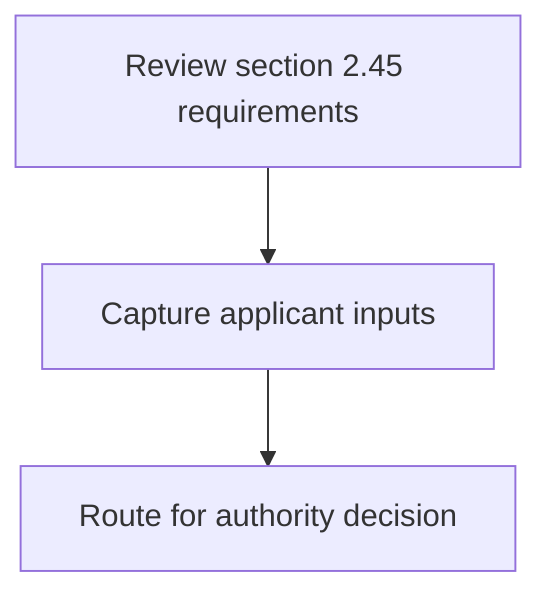
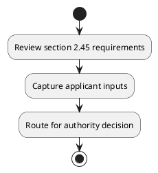

# Chapter 2 / Section 2.45: Import under Govt. to Govt. Agreements

**Chapter Title:** General Provisions Regarding Imports and Exports

**Pages:** 17

**Purpose:** to Govt.

**Purpose Thanglish:** Indha Import under Govt. to Govt. Agreements section-la, to Govt.

**Summary:** 2.45 Import under Govt. to Govt. Agreements
Import of goods under Government-to-Government agreements may be allowed
without an Authorisation on production of necessary evidence to satisfaction of
Customs authorities.

**Business Meaning:** 2.45 Import under Govt.

**Business Explanation:** 2.45 Import under Govt. to Govt. Agreements
Import of goods under Government-to-Government agreements may be allowed
without an Authorisation on production of necessary evidence to satisfaction of
Customs authorities.

**Business Explanation Thanglish:** Indha Import under Govt. to Govt. Agreements section-la, 2.45 import under Govt. to Govt. Agreements
import of goods under Government-to-Government agreements may be allowed
without an Authorisation on production of necessary evidence to satisfaction of
Customs authorities.

## Business Logic
- None identified

## Business Rules
- rule_id=CH2-SEC2_45-R001, rule_description=2.45 Import under Govt. to Govt. Agreements
Import of goods under Government-to-Government agreements may be allowed
without an Authorisation on production of necessary evidence to satisfaction of
Customs authorities., trigger=Import under Govt. to Govt. Agreements, condition=Not explicitly covered in uploaded documents., validation=Not explicitly covered in uploaded documents., action=Manual review required., exception=No explicit exception found in uploaded documents., output=DEKAI should produce a compliance decision for 2.45 - Import under Govt. to Govt. Agreements.

## Conditions
- None identified

## Condition Logic
- None identified

## Validations
- None identified

## Exceptions
- None identified

## Dependencies
- None identified

## Authorities
- Customs
- Import of goods under Government-to-Government

## Required Documents
- None identified

## Timelines
- None identified

## Actions
- None identified

## Workflow
- Review section 2.45 requirements
- Capture applicant inputs
- Route for authority decision

## Workflow ASCII
```text
Import under Govt. to Govt. Agreements
Review section 2.45 requirements
   |
   v
Capture applicant inputs
   |
   v
Route for authority decision
```

## Decision Tree
- IF section 2.45 applies THEN proceed with standard DGFT workflow

## Decision Tree ASCII
```text
Import under Govt. to Govt. Agreements Decision
IF section 2.45 applies THEN proceed with standard DGFT workflow
```

## Examples
- User asks to process Import under Govt. to Govt. Agreements; the platform checks conditions, validations, and documents before action.

**Real-world Example:** Example: an importer or exporter invokes Import under Govt. to Govt. Agreements, submits the prescribed DGFT records, and DEKAI uses the extracted rules to follow the import under govt. to govt. agreements process.

**Real-world Example Thanglish:** Indha Import under Govt. to Govt. Agreements section-la, Example: an importer or exporter invokes import under Govt. to Govt. Agreements, submits the prescribed DGFT records, and DEKAI uses the extracted rules to follow the import under govt. to govt. agreements process.

## AI Rules
- None identified

## Database Fields
- name=section_code, type=string, required=True, source=parsed_section_heading
- name=section_title, type=string, required=True, source=parsed_section_heading
- name=may_flag, type=boolean, required=False, source=keyword:may
- name=govt_flag, type=boolean, required=False, source=keyword:Govt
- name=under_flag, type=boolean, required=False, source=keyword:under
- name=goods_flag, type=boolean, required=False, source=keyword:goods
- name=import_flag, type=boolean, required=False, source=keyword:Import
- name=allowed_flag, type=boolean, required=False, source=keyword:allowed
- name=without_flag, type=boolean, required=False, source=keyword:without
- name=customs_flag, type=boolean, required=False, source=keyword:Customs

## API Requirements
- method=GET, path=/api/dgft/sections/2.45, purpose=Retrieve knowledge payload for section 2.45, query_params=['include=workflow,decision_tree,validations'], response_fields=['section', 'title', 'summary', 'conditions', 'validations', 'exceptions', 'workflow', 'decision_tree']
- method=POST, path=/api/dgft/Import-under-Govt-to-Govt-Agreements/validate, purpose=Validate inputs and documents for Import under Govt. to Govt. Agreements, request_fields=['section_code', 'section_title'], response_fields=['status', 'errors', 'warnings', 'next_actions']

## UI Screens
- screen_id=Import_under_Govt_to_Govt_Agreements_overview, name=Import under Govt. to Govt. Agreements Overview, purpose=Show section summary, authority, timeline, and eligibility cues., widgets=['summary_card', 'conditions_table', 'authority_badges', 'timeline_panel']
- screen_id=Import_under_Govt_to_Govt_Agreements_submission, name=Import under Govt. to Govt. Agreements Submission, purpose=Capture applicant data and supporting documents., widgets=['dynamic_form', 'document_uploader', 'validation_panel', 'next_action_footer'], fields=['section_code', 'section_title', 'may_flag', 'govt_flag', 'under_flag', 'goods_flag', 'import_flag', 'allowed_flag']

## Error Messages
- Validation failed because the section requirements were not fully met.

## FAQ
- question_en=What is the purpose of section 2.45?, answer_en=2.45 Import under Govt. to Govt. Agreements
Import of goods under Government-to-Government agreements may be allowed
without an Authorisation on production of necessary evidence to satisfaction of
Customs authorities., question_thanglish=Indha Import under Govt. to Govt. Agreements section-la, What is the purpose of section 2.45?, answer_thanglish=Indha Import under Govt. to Govt. Agreements section-la, 2.45 import under Govt. to Govt. Agreements
import of goods under Government-to-Government agreements may be allowed
without an Authorisation on production of necessary evidence to satisfaction of
Customs authorities.
- question_en=What documents are required under Import under Govt. to Govt. Agreements?, answer_en=Not explicitly covered in uploaded documents., question_thanglish=Indha Import under Govt. to Govt. Agreements section-la, What documents are required under import under Govt. to Govt. Agreements?, answer_thanglish=Indha Import under Govt. to Govt. Agreements section-la, Not explicitly covered in uploaded documents.
- question_en=Which authority handles Import under Govt. to Govt. Agreements?, answer_en=Customs, Import of goods under Government-to-Government, question_thanglish=Indha Import under Govt. to Govt. Agreements section-la, Which authority handles import under Govt. to Govt. Agreements?, answer_thanglish=Indha Import under Govt. to Govt. Agreements section-la, Customs, import of goods under Government-to-Government

## Questions Users May Ask
- What does Import under Govt. to Govt. Agreements require?
- Which documents are needed for Import under Govt. to Govt. Agreements?
- How does DEKAI validate Import under Govt. to Govt. Agreements requests?

## Expected AI Answers
- Import under Govt. to Govt. Agreements requires the platform to interpret the section text, apply the extracted business rules, and present the correct next action.
- Required documents are inferred from the section text: no explicit documents were detected.
- DEKAI validates Import under Govt. to Govt. Agreements by checking conditions, required documents, authority references, and exception clauses before recommending an outcome.

## AI Q&A Examples
- question_en=User asks: How do I comply with Import under Govt. to Govt. Agreements?, answer_en=AI answers: DEKAI should evaluate section 2.45, apply the extracted rules, and guide the user through Review section 2.45 requirements., question_thanglish=Indha Import under Govt. to Govt. Agreements section-la, User asks: How do I comply with import under Govt. to Govt. Agreements?, answer_thanglish=Indha Import under Govt. to Govt. Agreements section-la, AI answers: DEKAI should evaluate section 2.45, apply the extracted rules, and guide the user through Review section 2.45 requirements.
- question_en=User asks: Which validations apply to Import under Govt. to Govt. Agreements?, answer_en=AI answers: Applicable validations are not explicitly covered in the uploaded documents., question_thanglish=Indha Import under Govt. to Govt. Agreements section-la, User asks: Which validations apply to import under Govt. to Govt. Agreements?, answer_thanglish=Indha Import under Govt. to Govt. Agreements section-la, AI answers: Applicable validations are not explicitly covered in the uploaded documents.

## DEKAI AI Implementation Notes
- Capture chapter 2, section 2.45, title, and page references as immutable knowledge metadata.
- Bind validations for Import under Govt. to Govt. Agreements into a rule engine keyed by the rule IDs extracted for this section.
- Route escalations or approvals to: Customs, Import of goods under Government-to-Government.

## DEKAI AI Implementation Notes Thanglish
- Indha Import under Govt. to Govt. Agreements section-la, Capture chapter 2, section 2.45, title, and page references as immutable knowledge metadata.
- Indha Import under Govt. to Govt. Agreements section-la, Bind validations for import under Govt. to Govt. Agreements into a rule engine keyed by the rule IDs extracted for this section.
- Indha Import under Govt. to Govt. Agreements section-la, Route escalations or approvals to: Customs, import of goods under Government-to-Government.

## AI Metadata
- Keywords: may, Govt, under, goods, Import, allowed, without, Customs, evidence, necessary, Agreements, production, authorities, satisfaction, Authorisation, Government-to-Government
- Search Keywords: may, Govt, under, goods, Import, allowed, without, Customs, evidence, necessary, Agreements, production, authorities, satisfaction, Authorisation, Government-to-Government
- Intent: Provide knowledge guidance for Import under Govt. to Govt. Agreements.
- Tags: 2.45, Import under Govt. to Govt. Agreements, dgft
- Related Sections: 
- Related Chapters: 
- Related Rules: 

## Mermaid


## PlantUML

