# Chapter 2 / Section 2.46: Transfer of Imported Goods

**Chapter Title:** General Provisions Regarding Imports and Exports

**Pages:** 17, 18

**Purpose:** 2.46 Transfer of Imported Goods
(a) Cases where prior permission is required:
Transfer of imported goods which are subject to Actual User condition and have
become surplus to needs of Actual User, shall be made only with prior permission of
the issuing authority.

**Purpose Thanglish:** Indha Transfer of Imported Goods section-la, 2.46 Transfer of Imported Goods
(a) Cases where prior permission is required:
Transfer of imported goods which are subject to Actual User condition and have
become surplus to needs of Actual User, kandippa be made only with prior permission of
the issuing authority.

**Summary:** 2.46 Transfer of Imported Goods
(a) Cases where prior permission is required:
Transfer of imported goods which are subject to Actual User condition and have
become surplus to needs of Actual User, shall be made only with prior permission of
the issuing authority. Following information along with supporting documents shall
be furnished with request for grant of permission for transfer, to the issuing authority:
(i) Reasons for transfer of imported material;
(ii) Name, address, IEC number and industrial Authorisation registration, if
any, of transferee;
(iii) Description, quantity and value of goods imported and those sought to be
transferred;
(iv) Copies of import Authorisation and bills of entry relating to imports made;
(v) Terms and conditions of transfer as agreed upon between buyer and
seller. (b) Cases where prior permission is not required
(i) in case of sale or otherwise by importer of freely importable goods;
pg.

**Business Meaning:** Transfer of Imported Goods governs how DGFT business controls should be applied, validated, and enforced.

**Business Explanation:** Transfer of Imported Goods explains the operating rule set that DEKAI should enforce. Key control points include 2.46 Transfer of Imported Goods
(a) Cases where prior permission is required:
Transfer of imported goods which are subject to Actual User condition and have
become surplus to needs of Actual User, shall be made only with prior permission of
the issuing authority. The section also drives actions such as Following information along with supporting documents shall
be furnished with request for grant of permission for transfer, to the issuing authority:
(i) Reasons for transfer of imported material;
(ii) Name, address, IEC number and industrial Authorisation registration, if
any, of transferee;
(iii) Description, quantity and value of goods imported and those sought to be
transferred;
(iv) Copies of import Authorisation and bills of entry relating to imports made;
(v) Terms and conditions of transfer as agreed upon between buyer and
seller..

**Business Explanation Thanglish:** Indha Transfer of Imported Goods section-la, Transfer of Imported Goods explains the operating rule set that DEKAI should enforce. Key control points include 2.46 Transfer of Imported Goods
(a) Cases where prior permission is required:
Transfer of imported goods which are subject to Actual User condition and have
become surplus to needs of Actual User, kandippa be made only with prior permission of
the issuing authority. The section also drives actions such as Following information along with supporting documents kandippa
be furnished with request for grant of permission for transfer, to the issuing authority:
(i) Reasons for transfer of imported material;
(ii) Name, address, IEC number and industrial Authorisation registration, if
any, of transferee;
(iii) Description, quantity and value of goods imported and those sought to be
transferred;
(iv) Copies of import Authorisation and bills of entry relating to imports made;
(v) Terms and conditions of transfer as agreed upon between buyer and
seller..

## Business Logic
- 2.46 Transfer of Imported Goods
(a) Cases where prior permission is required:
Transfer of imported goods which are subject to Actual User condition and have
become surplus to needs of Actual User, shall be made only with prior permission of
the issuing authority.
- Following information along with supporting documents shall
be furnished with request for grant of permission for transfer, to the issuing authority:
(i) Reasons for transfer of imported material;
(ii) Name, address, IEC number and industrial Authorisation registration, if
any, of transferee;
(iii) Description, quantity and value of goods imported and those sought to be
transferred;
(iv) Copies of import Authorisation and bills of entry relating to imports made;
(v) Terms and conditions of transfer as agreed upon between buyer and
seller.
- 21/2012 dated 17.3.2012, upto 1% of FOB value of exports made
during preceding licensing year, shall be allowed to agrochemicals sector
unit having export turnover of Rs.
- (ii)
The eligible unit shall apply in form given in Appendix-8B to RA
concerned duly countersigned by Chartered Accountant.
- (iii)
In respect of duty free import of R&D equipment, units not registered
with jurisdictional Customs authority shall be allowed to give Installation
Certificate issued by an independent Chartered Engineer.
- 2.46 Transfer of Imported Goods
(a)
Cases where prior permission is required:
Transfer of imported goods which are subject to Actual User condition and have
become surplus to needs of Actual User, shall be made only with prior permission of
the issuing authority.
- Following information along with supporting documents shall
be furnished with request for grant of permission for transfer, to the issuing authority:
(i)
Reasons for transfer of imported material;
(ii)
Name, address, IEC number and industrial Authorisation registration, if
any, of transferee;
(iii)
Description, quantity and value of goods imported and those sought to be
transferred;
(iv)
Copies of import Authorisation and bills of entry relating to imports made;
(v)
Terms and conditions of transfer as agreed upon between buyer and
seller.
- (iv) for transfer of Imported Firearms (a) after 10 years of import or (b) on
attaining the age of 60 years by such importer, subject to condition
that transferee fulfils conditions as in Arms Act and Rules there under.
- Such transfer/sale is
subject to the provisions of the Arms Act, 1959 and other
rules/regulations by state/local police.

## Business Rules
- rule_id=CH2-SEC2_46-R001, rule_description=2.46 Transfer of Imported Goods
(a) Cases where prior permission is required:
Transfer of imported goods which are subject to Actual User condition and have
become surplus to needs of Actual User, shall be made only with prior permission of
the issuing authority., trigger=Transfer of Imported Goods, condition=2.46 Transfer of Imported Goods
(a) Cases where prior permission is required:
Transfer of imported goods which are subject to Actual User condition and have
become surplus to needs of Actual User, shall be made only with prior permission of
the issuing authority., validation=2.46 Transfer of Imported Goods
(a) Cases where prior permission is required:
Transfer of imported goods which are subject to Actual User condition and have
become surplus to needs of Actual User, shall be made only with prior permission of
the issuing authority., action=Following information along with supporting documents shall
be furnished with request for grant of permission for transfer, to the issuing authority:
(i) Reasons for transfer of imported material;
(ii) Name, address, IEC number and industrial Authorisation registration, if
any, of transferee;
(iii) Description, quantity and value of goods imported and those sought to be
transferred;
(iv) Copies of import Authorisation and bills of entry relating to imports made;
(v) Terms and conditions of transfer as agreed upon between buyer and
seller., exception=No explicit exception found in uploaded documents., output=DEKAI should produce a compliance decision for 2.46 - Transfer of Imported Goods.
- rule_id=CH2-SEC2_46-R002, rule_description=Following information along with supporting documents shall
be furnished with request for grant of permission for transfer, to the issuing authority:
(i) Reasons for transfer of imported material;
(ii) Name, address, IEC number and industrial Authorisation registration, if
any, of transferee;
(iii) Description, quantity and value of goods imported and those sought to be
transferred;
(iv) Copies of import Authorisation and bills of entry relating to imports made;
(v) Terms and conditions of transfer as agreed upon between buyer and
seller., trigger=Transfer of Imported Goods, condition=any, validation=Following information along with supporting documents shall
be furnished with request for grant of permission for transfer, to the issuing authority:
(i) Reasons for transfer of imported material;
(ii) Name, address, IEC number and industrial Authorisation registration, if
any, of transferee;
(iii) Description, quantity and value of goods imported and those sought to be
transferred;
(iv) Copies of import Authorisation and bills of entry relating to imports made;
(v) Terms and conditions of transfer as agreed upon between buyer and
seller., action=(ii)
The eligible unit shall apply in form given in Appendix-8B to RA
concerned duly countersigned by Chartered Accountant., exception=No explicit exception found in uploaded documents., output=DEKAI should produce a compliance decision for 2.46 - Transfer of Imported Goods.
- rule_id=CH2-SEC2_46-R003, rule_description=21/2012 dated 17.3.2012, upto 1% of FOB value of exports made
during preceding licensing year, shall be allowed to agrochemicals sector
unit having export turnover of Rs., trigger=Transfer of Imported Goods, condition=(b) Cases where prior permission is not required
(i) in case of sale or otherwise by importer of freely importable goods;
pg., validation=(b) Cases where prior permission is not required
(i) in case of sale or otherwise by importer of freely importable goods;
pg., action=(iii)
In respect of duty free import of R&D equipment, units not registered
with jurisdictional Customs authority shall be allowed to give Installation
Certificate issued by an independent Chartered Engineer., exception=No explicit exception found in uploaded documents., output=DEKAI should produce a compliance decision for 2.46 - Transfer of Imported Goods.
- rule_id=CH2-SEC2_46-R004, rule_description=(ii)
The eligible unit shall apply in form given in Appendix-8B to RA
concerned duly countersigned by Chartered Accountant., trigger=Transfer of Imported Goods, condition=26
(i)
Duty free imports of goods as specified in list 28A of Customs notification
No., validation=21/2012 dated 17.3.2012, upto 1% of FOB value of exports made
during preceding licensing year, shall be allowed to agrochemicals sector
unit having export turnover of Rs., action=Following information along with supporting documents shall
be furnished with request for grant of permission for transfer, to the issuing authority:
(i)
Reasons for transfer of imported material;
(ii)
Name, address, IEC number and industrial Authorisation registration, if
any, of transferee;
(iii)
Description, quantity and value of goods imported and those sought to be
transferred;
(iv)
Copies of import Authorisation and bills of entry relating to imports made;
(v)
Terms and conditions of transfer as agreed upon between buyer and
seller., exception=No explicit exception found in uploaded documents., output=DEKAI should produce a compliance decision for 2.46 - Transfer of Imported Goods.
- rule_id=CH2-SEC2_46-R005, rule_description=(iii)
In respect of duty free import of R&D equipment, units not registered
with jurisdictional Customs authority shall be allowed to give Installation
Certificate issued by an independent Chartered Engineer., trigger=Transfer of Imported Goods, condition=(iii)
In respect of duty free import of R&D equipment, units not registered
with jurisdictional Customs authority shall be allowed to give Installation
Certificate issued by an independent Chartered Engineer., validation=(ii)
The eligible unit shall apply in form given in Appendix-8B to RA
concerned duly countersigned by Chartered Accountant., action=NRAI/Department of Sports
will maintain the required records., exception=No explicit exception found in uploaded documents., output=DEKAI should produce a compliance decision for 2.46 - Transfer of Imported Goods.
- rule_id=CH2-SEC2_46-R006, rule_description=2.46 Transfer of Imported Goods
(a)
Cases where prior permission is required:
Transfer of imported goods which are subject to Actual User condition and have
become surplus to needs of Actual User, shall be made only with prior permission of
the issuing authority., trigger=Transfer of Imported Goods, condition=2.46 Transfer of Imported Goods
(a)
Cases where prior permission is required:
Transfer of imported goods which are subject to Actual User condition and have
become surplus to needs of Actual User, shall be made only with prior permission of
the issuing authority., validation=(iii)
In respect of duty free import of R&D equipment, units not registered
with jurisdictional Customs authority shall be allowed to give Installation
Certificate issued by an independent Chartered Engineer., action=NRAI/Department of Sports
will maintain the required records., exception=No explicit exception found in uploaded documents., output=DEKAI should produce a compliance decision for 2.46 - Transfer of Imported Goods.
- rule_id=CH2-SEC2_46-R007, rule_description=Following information along with supporting documents shall
be furnished with request for grant of permission for transfer, to the issuing authority:
(i)
Reasons for transfer of imported material;
(ii)
Name, address, IEC number and industrial Authorisation registration, if
any, of transferee;
(iii)
Description, quantity and value of goods imported and those sought to be
transferred;
(iv)
Copies of import Authorisation and bills of entry relating to imports made;
(v)
Terms and conditions of transfer as agreed upon between buyer and
seller., trigger=Transfer of Imported Goods, condition=any, validation=2.46 Transfer of Imported Goods
(a)
Cases where prior permission is required:
Transfer of imported goods which are subject to Actual User condition and have
become surplus to needs of Actual User, shall be made only with prior permission of
the issuing authority., action=NRAI/Department of Sports
will maintain the required records., exception=No explicit exception found in uploaded documents., output=DEKAI should produce a compliance decision for 2.46 - Transfer of Imported Goods.
- rule_id=CH2-SEC2_46-R008, rule_description=(iv) for transfer of Imported Firearms (a) after 10 years of import or (b) on
attaining the age of 60 years by such importer, subject to condition
that transferee fulfils conditions as in Arms Act and Rules there under., trigger=Transfer of Imported Goods, condition=(b)
Cases where prior permission is not required
(i)
in case of sale or otherwise by importer of freely importable goods;
pg., validation=Following information along with supporting documents shall
be furnished with request for grant of permission for transfer, to the issuing authority:
(i)
Reasons for transfer of imported material;
(ii)
Name, address, IEC number and industrial Authorisation registration, if
any, of transferee;
(iii)
Description, quantity and value of goods imported and those sought to be
transferred;
(iv)
Copies of import Authorisation and bills of entry relating to imports made;
(v)
Terms and conditions of transfer as agreed upon between buyer and
seller., action=NRAI/Department of Sports
will maintain the required records., exception=No explicit exception found in uploaded documents., output=DEKAI should produce a compliance decision for 2.46 - Transfer of Imported Goods.
- rule_id=CH2-SEC2_46-R009, rule_description=Such transfer/sale is
subject to the provisions of the Arms Act, 1959 and other
rules/regulations by state/local police., trigger=Transfer of Imported Goods, condition=26
(ii) for goods imported with Actual User condition, provided such good is
freely importable without Actual User condition on date of transfer
(iii) for goods with AU Condition after a period of two years from the date
of import., validation=(b)
Cases where prior permission is not required
(i)
in case of sale or otherwise by importer of freely importable goods;
pg., action=NRAI/Department of Sports
will maintain the required records., exception=No explicit exception found in uploaded documents., output=DEKAI should produce a compliance decision for 2.46 - Transfer of Imported Goods.

## Conditions
- 2.46 Transfer of Imported Goods
(a) Cases where prior permission is required:
Transfer of imported goods which are subject to Actual User condition and have
become surplus to needs of Actual User, shall be made only with prior permission of
the issuing authority.
- Following information along with supporting documents shall
be furnished with request for grant of permission for transfer, to the issuing authority:
(i) Reasons for transfer of imported material;
(ii) Name, address, IEC number and industrial Authorisation registration, if
any, of transferee;
(iii) Description, quantity and value of goods imported and those sought to be
transferred;
(iv) Copies of import Authorisation and bills of entry relating to imports made;
(v) Terms and conditions of transfer as agreed upon between buyer and
seller.
- (b) Cases where prior permission is not required
(i) in case of sale or otherwise by importer of freely importable goods;
pg.
- 26
(i)
Duty free imports of goods as specified in list 28A of Customs notification
No.
- (iii)
In respect of duty free import of R&D equipment, units not registered
with jurisdictional Customs authority shall be allowed to give Installation
Certificate issued by an independent Chartered Engineer.
- 2.46 Transfer of Imported Goods
(a)
Cases where prior permission is required:
Transfer of imported goods which are subject to Actual User condition and have
become surplus to needs of Actual User, shall be made only with prior permission of
the issuing authority.
- Following information along with supporting documents shall
be furnished with request for grant of permission for transfer, to the issuing authority:
(i)
Reasons for transfer of imported material;
(ii)
Name, address, IEC number and industrial Authorisation registration, if
any, of transferee;
(iii)
Description, quantity and value of goods imported and those sought to be
transferred;
(iv)
Copies of import Authorisation and bills of entry relating to imports made;
(v)
Terms and conditions of transfer as agreed upon between buyer and
seller.
- (b)
Cases where prior permission is not required
(i)
in case of sale or otherwise by importer of freely importable goods;
pg.
- 26
(ii) for goods imported with Actual User condition, provided such good is
freely importable without Actual User condition on date of transfer
(iii) for goods with AU Condition after a period of two years from the date
of import.
- (iv) for transfer of Imported Firearms (a) after 10 years of import or (b) on
attaining the age of 60 years by such importer, subject to condition
that transferee fulfils conditions as in Arms Act and Rules there under.
- (v) for transfer of weapon/s (firearm/s) imported by a Renowned Shooter
(as defined in Policy Condition 3 of Chapter 93 of ITC (HS) 2022) for
the purpose of his/her pursuing shooting as a sport to any upcoming
shooter as certified either by the National Rifle Association of India
(NRAI) or the Department of Sports, Ministry of Youth Affairs & Sports
after two years from the date of import.
- The transferee can
subsequently transfer/resell to any buyer as certified by the NRAI or
Department of Sports for the sole purpose of pursuing shooting as a
sport after one year from the date of its first sale.
- Such transfer/sale is
subject to the provisions of the Arms Act, 1959 and other
rules/regulations by state/local police.

## Condition Logic
- id=2.2.46.1, if=2.46 Transfer of Imported Goods
(a) Cases where prior permission is required:
Transfer of imported goods which are subject to Actual User condition and have
become surplus to needs of Actual User, shall be made only with prior permission of
the issuing authority., then=Following information along with supporting documents shall
be furnished with request for grant of permission for transfer, to the issuing authority:
(i) Reasons for transfer of imported material;
(ii) Name, address, IEC number and industrial Authorisation registration, if
any, of transferee;
(iii) Description, quantity and value of goods imported and those sought to be
transferred;
(iv) Copies of import Authorisation and bills of entry relating to imports made;
(v) Terms and conditions of transfer as agreed upon between buyer and
seller., source=2.46 Transfer of Imported Goods
(a) Cases where prior permission is required:
Transfer of imported goods which are subject to Actual User condition and have
become surplus to needs of Actual User, shall be made only with prior permission of
the issuing authority.
- id=2.2.46.2, if=any, then=Following information along with supporting documents shall
be furnished with request for grant of permission for transfer, to the issuing authority:
(i) Reasons for transfer of imported material;
(ii) Name, address, IEC number and industrial Authorisation registration, if
any, of transferee;
(iii) Description, quantity and value of goods imported and those sought to be
transferred;
(iv) Copies of import Authorisation and bills of entry relating to imports made;
(v) Terms and conditions of transfer as agreed upon between buyer and
seller., source=Following information along with supporting documents shall
be furnished with request for grant of permission for transfer, to the issuing authority:
(i) Reasons for transfer of imported material;
(ii) Name, address, IEC number and industrial Authorisation registration, if
any, of transferee;
(iii) Description, quantity and value of goods imported and those sought to be
transferred;
(iv) Copies of import Authorisation and bills of entry relating to imports made;
(v) Terms and conditions of transfer as agreed upon between buyer and
seller.
- id=2.2.46.3, if=(b) Cases where prior permission is not required
(i) in case of sale or otherwise by importer of freely importable goods;
pg., then=Following information along with supporting documents shall
be furnished with request for grant of permission for transfer, to the issuing authority:
(i) Reasons for transfer of imported material;
(ii) Name, address, IEC number and industrial Authorisation registration, if
any, of transferee;
(iii) Description, quantity and value of goods imported and those sought to be
transferred;
(iv) Copies of import Authorisation and bills of entry relating to imports made;
(v) Terms and conditions of transfer as agreed upon between buyer and
seller., source=(b) Cases where prior permission is not required
(i) in case of sale or otherwise by importer of freely importable goods;
pg.
- id=2.2.46.4, if=26
(i)
Duty free imports of goods as specified in list 28A of Customs notification
No., then=Following information along with supporting documents shall
be furnished with request for grant of permission for transfer, to the issuing authority:
(i) Reasons for transfer of imported material;
(ii) Name, address, IEC number and industrial Authorisation registration, if
any, of transferee;
(iii) Description, quantity and value of goods imported and those sought to be
transferred;
(iv) Copies of import Authorisation and bills of entry relating to imports made;
(v) Terms and conditions of transfer as agreed upon between buyer and
seller., source=26
(i)
Duty free imports of goods as specified in list 28A of Customs notification
No.
- id=2.2.46.5, if=(iii)
In respect of duty free import of R&D equipment, units not registered
with jurisdictional Customs authority shall be allowed to give Installation
Certificate issued by an independent Chartered Engineer., then=Following information along with supporting documents shall
be furnished with request for grant of permission for transfer, to the issuing authority:
(i) Reasons for transfer of imported material;
(ii) Name, address, IEC number and industrial Authorisation registration, if
any, of transferee;
(iii) Description, quantity and value of goods imported and those sought to be
transferred;
(iv) Copies of import Authorisation and bills of entry relating to imports made;
(v) Terms and conditions of transfer as agreed upon between buyer and
seller., source=(iii)
In respect of duty free import of R&D equipment, units not registered
with jurisdictional Customs authority shall be allowed to give Installation
Certificate issued by an independent Chartered Engineer.
- id=2.2.46.6, if=2.46 Transfer of Imported Goods
(a)
Cases where prior permission is required:
Transfer of imported goods which are subject to Actual User condition and have
become surplus to needs of Actual User, shall be made only with prior permission of
the issuing authority., then=Following information along with supporting documents shall
be furnished with request for grant of permission for transfer, to the issuing authority:
(i) Reasons for transfer of imported material;
(ii) Name, address, IEC number and industrial Authorisation registration, if
any, of transferee;
(iii) Description, quantity and value of goods imported and those sought to be
transferred;
(iv) Copies of import Authorisation and bills of entry relating to imports made;
(v) Terms and conditions of transfer as agreed upon between buyer and
seller., source=2.46 Transfer of Imported Goods
(a)
Cases where prior permission is required:
Transfer of imported goods which are subject to Actual User condition and have
become surplus to needs of Actual User, shall be made only with prior permission of
the issuing authority.
- id=2.2.46.7, if=any, then=Following information along with supporting documents shall
be furnished with request for grant of permission for transfer, to the issuing authority:
(i) Reasons for transfer of imported material;
(ii) Name, address, IEC number and industrial Authorisation registration, if
any, of transferee;
(iii) Description, quantity and value of goods imported and those sought to be
transferred;
(iv) Copies of import Authorisation and bills of entry relating to imports made;
(v) Terms and conditions of transfer as agreed upon between buyer and
seller., source=Following information along with supporting documents shall
be furnished with request for grant of permission for transfer, to the issuing authority:
(i)
Reasons for transfer of imported material;
(ii)
Name, address, IEC number and industrial Authorisation registration, if
any, of transferee;
(iii)
Description, quantity and value of goods imported and those sought to be
transferred;
(iv)
Copies of import Authorisation and bills of entry relating to imports made;
(v)
Terms and conditions of transfer as agreed upon between buyer and
seller.
- id=2.2.46.8, if=(b)
Cases where prior permission is not required
(i)
in case of sale or otherwise by importer of freely importable goods;
pg., then=Following information along with supporting documents shall
be furnished with request for grant of permission for transfer, to the issuing authority:
(i) Reasons for transfer of imported material;
(ii) Name, address, IEC number and industrial Authorisation registration, if
any, of transferee;
(iii) Description, quantity and value of goods imported and those sought to be
transferred;
(iv) Copies of import Authorisation and bills of entry relating to imports made;
(v) Terms and conditions of transfer as agreed upon between buyer and
seller., source=(b)
Cases where prior permission is not required
(i)
in case of sale or otherwise by importer of freely importable goods;
pg.
- id=2.2.46.9, if=26
(ii) for goods imported with Actual User condition, provided such good is
freely importable without Actual User condition on date of transfer
(iii) for goods with AU Condition after a period of two years from the date
of import., then=Following information along with supporting documents shall
be furnished with request for grant of permission for transfer, to the issuing authority:
(i) Reasons for transfer of imported material;
(ii) Name, address, IEC number and industrial Authorisation registration, if
any, of transferee;
(iii) Description, quantity and value of goods imported and those sought to be
transferred;
(iv) Copies of import Authorisation and bills of entry relating to imports made;
(v) Terms and conditions of transfer as agreed upon between buyer and
seller., source=26
(ii) for goods imported with Actual User condition, provided such good is
freely importable without Actual User condition on date of transfer
(iii) for goods with AU Condition after a period of two years from the date
of import.
- id=2.2.46.10, if=(iv) for transfer of Imported Firearms (a) after 10 years of import or (b) on
attaining the age of 60 years by such importer, subject to condition
that transferee fulfils conditions as in Arms Act and Rules there under., then=Following information along with supporting documents shall
be furnished with request for grant of permission for transfer, to the issuing authority:
(i) Reasons for transfer of imported material;
(ii) Name, address, IEC number and industrial Authorisation registration, if
any, of transferee;
(iii) Description, quantity and value of goods imported and those sought to be
transferred;
(iv) Copies of import Authorisation and bills of entry relating to imports made;
(v) Terms and conditions of transfer as agreed upon between buyer and
seller., source=(iv) for transfer of Imported Firearms (a) after 10 years of import or (b) on
attaining the age of 60 years by such importer, subject to condition
that transferee fulfils conditions as in Arms Act and Rules there under.
- id=2.2.46.11, if=(v) for transfer of weapon/s (firearm/s) imported by a Renowned Shooter
(as defined in Policy Condition 3 of Chapter 93 of ITC (HS) 2022) for
the purpose of his/her pursuing shooting as a sport to any upcoming
shooter as certified either by the National Rifle Association of India
(NRAI) or the Department of Sports, Ministry of Youth Affairs & Sports
after two years from the date of import., then=Following information along with supporting documents shall
be furnished with request for grant of permission for transfer, to the issuing authority:
(i) Reasons for transfer of imported material;
(ii) Name, address, IEC number and industrial Authorisation registration, if
any, of transferee;
(iii) Description, quantity and value of goods imported and those sought to be
transferred;
(iv) Copies of import Authorisation and bills of entry relating to imports made;
(v) Terms and conditions of transfer as agreed upon between buyer and
seller., source=(v) for transfer of weapon/s (firearm/s) imported by a Renowned Shooter
(as defined in Policy Condition 3 of Chapter 93 of ITC (HS) 2022) for
the purpose of his/her pursuing shooting as a sport to any upcoming
shooter as certified either by the National Rifle Association of India
(NRAI) or the Department of Sports, Ministry of Youth Affairs & Sports
after two years from the date of import.
- id=2.2.46.12, if=The transferee can
subsequently transfer/resell to any buyer as certified by the NRAI or
Department of Sports for the sole purpose of pursuing shooting as a
sport after one year from the date of its first sale., then=Following information along with supporting documents shall
be furnished with request for grant of permission for transfer, to the issuing authority:
(i) Reasons for transfer of imported material;
(ii) Name, address, IEC number and industrial Authorisation registration, if
any, of transferee;
(iii) Description, quantity and value of goods imported and those sought to be
transferred;
(iv) Copies of import Authorisation and bills of entry relating to imports made;
(v) Terms and conditions of transfer as agreed upon between buyer and
seller., source=The transferee can
subsequently transfer/resell to any buyer as certified by the NRAI or
Department of Sports for the sole purpose of pursuing shooting as a
sport after one year from the date of its first sale.
- id=2.2.46.13, if=Such transfer/sale is
subject to the provisions of the Arms Act, 1959 and other
rules/regulations by state/local police., then=Following information along with supporting documents shall
be furnished with request for grant of permission for transfer, to the issuing authority:
(i) Reasons for transfer of imported material;
(ii) Name, address, IEC number and industrial Authorisation registration, if
any, of transferee;
(iii) Description, quantity and value of goods imported and those sought to be
transferred;
(iv) Copies of import Authorisation and bills of entry relating to imports made;
(v) Terms and conditions of transfer as agreed upon between buyer and
seller., source=Such transfer/sale is
subject to the provisions of the Arms Act, 1959 and other
rules/regulations by state/local police.

## Validations
- 2.46 Transfer of Imported Goods
(a) Cases where prior permission is required:
Transfer of imported goods which are subject to Actual User condition and have
become surplus to needs of Actual User, shall be made only with prior permission of
the issuing authority.
- Following information along with supporting documents shall
be furnished with request for grant of permission for transfer, to the issuing authority:
(i) Reasons for transfer of imported material;
(ii) Name, address, IEC number and industrial Authorisation registration, if
any, of transferee;
(iii) Description, quantity and value of goods imported and those sought to be
transferred;
(iv) Copies of import Authorisation and bills of entry relating to imports made;
(v) Terms and conditions of transfer as agreed upon between buyer and
seller.
- (b) Cases where prior permission is not required
(i) in case of sale or otherwise by importer of freely importable goods;
pg.
- 21/2012 dated 17.3.2012, upto 1% of FOB value of exports made
during preceding licensing year, shall be allowed to agrochemicals sector
unit having export turnover of Rs.
- (ii)
The eligible unit shall apply in form given in Appendix-8B to RA
concerned duly countersigned by Chartered Accountant.
- (iii)
In respect of duty free import of R&D equipment, units not registered
with jurisdictional Customs authority shall be allowed to give Installation
Certificate issued by an independent Chartered Engineer.
- 2.46 Transfer of Imported Goods
(a)
Cases where prior permission is required:
Transfer of imported goods which are subject to Actual User condition and have
become surplus to needs of Actual User, shall be made only with prior permission of
the issuing authority.
- Following information along with supporting documents shall
be furnished with request for grant of permission for transfer, to the issuing authority:
(i)
Reasons for transfer of imported material;
(ii)
Name, address, IEC number and industrial Authorisation registration, if
any, of transferee;
(iii)
Description, quantity and value of goods imported and those sought to be
transferred;
(iv)
Copies of import Authorisation and bills of entry relating to imports made;
(v)
Terms and conditions of transfer as agreed upon between buyer and
seller.
- (b)
Cases where prior permission is not required
(i)
in case of sale or otherwise by importer of freely importable goods;
pg.
- NRAI/Department of Sports
will maintain the required records.

## Exceptions
- None identified

## Dependencies
- 93
- 1

## Authorities
- Customs
- RA
- Customs authority

## Required Documents
- Following information along with supporting documents shall
be furnished with request for grant of permission for transfer, to the issuing authority:
(i) Reasons for transfer of imported material;
(ii) Name, address, IEC number and industrial Authorisation registration, if
any, of transferee;
(iii) Description, quantity and value of goods imported and those sought to be
transferred;
(iv) Copies of import Authorisation and bills of entry relating to imports made;
(v) Terms and conditions of transfer as agreed upon between buyer and
seller.
- (iii)
In respect of duty free import of R&D equipment, units not registered
with jurisdictional Customs authority shall be allowed to give Installation
Certificate issued by an independent Chartered Engineer.
- Following information along with supporting documents shall
be furnished with request for grant of permission for transfer, to the issuing authority:
(i)
Reasons for transfer of imported material;
(ii)
Name, address, IEC number and industrial Authorisation registration, if
any, of transferee;
(iii)
Description, quantity and value of goods imported and those sought to be
transferred;
(iv)
Copies of import Authorisation and bills of entry relating to imports made;
(v)
Terms and conditions of transfer as agreed upon between buyer and
seller.

## Timelines
- 26
(ii) for goods imported with Actual User condition, provided such good is
freely importable without Actual User condition on date of transfer
(iii) for goods with AU Condition after a period of two years from the date
of import.
- (iv) for transfer of Imported Firearms (a) after 10 years of import or (b) on
attaining the age of 60 years by such importer, subject to condition
that transferee fulfils conditions as in Arms Act and Rules there under.
- (v) for transfer of weapon/s (firearm/s) imported by a Renowned Shooter
(as defined in Policy Condition 3 of Chapter 93 of ITC (HS) 2022) for
the purpose of his/her pursuing shooting as a sport to any upcoming
shooter as certified either by the National Rifle Association of India
(NRAI) or the Department of Sports, Ministry of Youth Affairs & Sports
after two years from the date of import.
- The transferee can
subsequently transfer/resell to any buyer as certified by the NRAI or
Department of Sports for the sole purpose of pursuing shooting as a
sport after one year from the date of its first sale.

## Actions
- Following information along with supporting documents shall
be furnished with request for grant of permission for transfer, to the issuing authority:
(i) Reasons for transfer of imported material;
(ii) Name, address, IEC number and industrial Authorisation registration, if
any, of transferee;
(iii) Description, quantity and value of goods imported and those sought to be
transferred;
(iv) Copies of import Authorisation and bills of entry relating to imports made;
(v) Terms and conditions of transfer as agreed upon between buyer and
seller.
- (ii)
The eligible unit shall apply in form given in Appendix-8B to RA
concerned duly countersigned by Chartered Accountant.
- (iii)
In respect of duty free import of R&D equipment, units not registered
with jurisdictional Customs authority shall be allowed to give Installation
Certificate issued by an independent Chartered Engineer.
- Following information along with supporting documents shall
be furnished with request for grant of permission for transfer, to the issuing authority:
(i)
Reasons for transfer of imported material;
(ii)
Name, address, IEC number and industrial Authorisation registration, if
any, of transferee;
(iii)
Description, quantity and value of goods imported and those sought to be
transferred;
(iv)
Copies of import Authorisation and bills of entry relating to imports made;
(v)
Terms and conditions of transfer as agreed upon between buyer and
seller.
- NRAI/Department of Sports
will maintain the required records.

## Workflow
- Evaluate condition: 2.46 Transfer of Imported Goods
(a) Cases where prior permission is required:
Transfer of imported goods which are subject to Actual User condition and have
become surplus to needs of Actual User, shall be made only with prior permission of
the issuing authority.
- Evaluate condition: Following information along with supporting documents shall
be furnished with request for grant of permission for transfer, to the issuing authority:
(i) Reasons for transfer of imported material;
(ii) Name, address, IEC number and industrial Authorisation registration, if
any, of transferee;
(iii) Description, quantity and value of goods imported and those sought to be
transferred;
(iv) Copies of import Authorisation and bills of entry relating to imports made;
(v) Terms and conditions of transfer as agreed upon between buyer and
seller.
- Evaluate condition: (b) Cases where prior permission is not required
(i) in case of sale or otherwise by importer of freely importable goods;
pg.
- Following information along with supporting documents shall
be furnished with request for grant of permission for transfer, to the issuing authority:
(i) Reasons for transfer of imported material;
(ii) Name, address, IEC number and industrial Authorisation registration, if
any, of transferee;
(iii) Description, quantity and value of goods imported and those sought to be
transferred;
(iv) Copies of import Authorisation and bills of entry relating to imports made;
(v) Terms and conditions of transfer as agreed upon between buyer and
seller.
- (ii)
The eligible unit shall apply in form given in Appendix-8B to RA
concerned duly countersigned by Chartered Accountant.
- (iii)
In respect of duty free import of R&D equipment, units not registered
with jurisdictional Customs authority shall be allowed to give Installation
Certificate issued by an independent Chartered Engineer.
- Following information along with supporting documents shall
be furnished with request for grant of permission for transfer, to the issuing authority:
(i)
Reasons for transfer of imported material;
(ii)
Name, address, IEC number and industrial Authorisation registration, if
any, of transferee;
(iii)
Description, quantity and value of goods imported and those sought to be
transferred;
(iv)
Copies of import Authorisation and bills of entry relating to imports made;
(v)
Terms and conditions of transfer as agreed upon between buyer and
seller.
- NRAI/Department of Sports
will maintain the required records.
- Run validation: 2.46 Transfer of Imported Goods
(a) Cases where prior permission is required:
Transfer of imported goods which are subject to Actual User condition and have
become surplus to needs of Actual User, shall be made only with prior permission of
the issuing authority.
- Run validation: Following information along with supporting documents shall
be furnished with request for grant of permission for transfer, to the issuing authority:
(i) Reasons for transfer of imported material;
(ii) Name, address, IEC number and industrial Authorisation registration, if
any, of transferee;
(iii) Description, quantity and value of goods imported and those sought to be
transferred;
(iv) Copies of import Authorisation and bills of entry relating to imports made;
(v) Terms and conditions of transfer as agreed upon between buyer and
seller.
- Run validation: (b) Cases where prior permission is not required
(i) in case of sale or otherwise by importer of freely importable goods;
pg.

## Workflow ASCII
```text
Transfer of Imported Goods
Evaluate condition: 2.46 Transfer of Imported Goods
(a) Cases where prior permission is required:
Transfer of imported goods which are subject to Actual User condition and have
become surplus to needs of Actual User, shall be made only with prior permission of
the issuing authority.
   |
   v
Evaluate condition: Following information along with supporting documents shall
be furnished with request for grant of permission for transfer, to the issuing authority:
(i) Reasons for transfer of imported material;
(ii) Name, address, IEC number and industrial Authorisation registration, if
any, of transferee;
(iii) Description, quantity and value of goods imported and those sought to be
transferred;
(iv) Copies of import Authorisation and bills of entry relating to imports made;
(v) Terms and conditions of transfer as agreed upon between buyer and
seller.
   |
   v
Evaluate condition: (b) Cases where prior permission is not required
(i) in case of sale or otherwise by importer of freely importable goods;
pg.
   |
   v
Following information along with supporting documents shall
be furnished with request for grant of permission for transfer, to the issuing authority:
(i) Reasons for transfer of imported material;
(ii) Name, address, IEC number and industrial Authorisation registration, if
any, of transferee;
(iii) Description, quantity and value of goods imported and those sought to be
transferred;
(iv) Copies of import Authorisation and bills of entry relating to imports made;
(v) Terms and conditions of transfer as agreed upon between buyer and
seller.
   |
   v
(ii)
The eligible unit shall apply in form given in Appendix-8B to RA
concerned duly countersigned by Chartered Accountant.
   |
   v
(iii)
In respect of duty free import of R&D equipment, units not registered
with jurisdictional Customs authority shall be allowed to give Installation
Certificate issued by an independent Chartered Engineer.
   |
   v
Following information along with supporting documents shall
be furnished with request for grant of permission for transfer, to the issuing authority:
(i)
Reasons for transfer of imported material;
(ii)
Name, address, IEC number and industrial Authorisation registration, if
any, of transferee;
(iii)
Description, quantity and value of goods imported and those sought to be
transferred;
(iv)
Copies of import Authorisation and bills of entry relating to imports made;
(v)
Terms and conditions of transfer as agreed upon between buyer and
seller.
   |
   v
NRAI/Department of Sports
will maintain the required records.
   |
   v
Run validation: 2.46 Transfer of Imported Goods
(a) Cases where prior permission is required:
Transfer of imported goods which are subject to Actual User condition and have
become surplus to needs of Actual User, shall be made only with prior permission of
the issuing authority.
   |
   v
Run validation: Following information along with supporting documents shall
be furnished with request for grant of permission for transfer, to the issuing authority:
(i) Reasons for transfer of imported material;
(ii) Name, address, IEC number and industrial Authorisation registration, if
any, of transferee;
(iii) Description, quantity and value of goods imported and those sought to be
transferred;
(iv) Copies of import Authorisation and bills of entry relating to imports made;
(v) Terms and conditions of transfer as agreed upon between buyer and
seller.
   |
   v
Run validation: (b) Cases where prior permission is not required
(i) in case of sale or otherwise by importer of freely importable goods;
pg.
```

## Decision Tree
- IF 2.46 Transfer of Imported Goods
(a) Cases where prior permission is required:
Transfer of imported goods which are subject to Actual User condition and have
become surplus to needs of Actual User, shall be made only with prior permission of
the issuing authority. THEN Following information along with supporting documents shall
be furnished with request for grant of permission for transfer, to the issuing authority:
(i) Reasons for transfer of imported material;
(ii) Name, address, IEC number and industrial Authorisation registration, if
any, of transferee;
(iii) Description, quantity and value of goods imported and those sought to be
transferred;
(iv) Copies of import Authorisation and bills of entry relating to imports made;
(v) Terms and conditions of transfer as agreed upon between buyer and
seller.
- IF Following information along with supporting documents shall
be furnished with request for grant of permission for transfer, to the issuing authority:
(i) Reasons for transfer of imported material;
(ii) Name, address, IEC number and industrial Authorisation registration, if
any, of transferee;
(iii) Description, quantity and value of goods imported and those sought to be
transferred;
(iv) Copies of import Authorisation and bills of entry relating to imports made;
(v) Terms and conditions of transfer as agreed upon between buyer and
seller. THEN Following information along with supporting documents shall
be furnished with request for grant of permission for transfer, to the issuing authority:
(i) Reasons for transfer of imported material;
(ii) Name, address, IEC number and industrial Authorisation registration, if
any, of transferee;
(iii) Description, quantity and value of goods imported and those sought to be
transferred;
(iv) Copies of import Authorisation and bills of entry relating to imports made;
(v) Terms and conditions of transfer as agreed upon between buyer and
seller.
- IF (b) Cases where prior permission is not required
(i) in case of sale or otherwise by importer of freely importable goods;
pg. THEN Following information along with supporting documents shall
be furnished with request for grant of permission for transfer, to the issuing authority:
(i) Reasons for transfer of imported material;
(ii) Name, address, IEC number and industrial Authorisation registration, if
any, of transferee;
(iii) Description, quantity and value of goods imported and those sought to be
transferred;
(iv) Copies of import Authorisation and bills of entry relating to imports made;
(v) Terms and conditions of transfer as agreed upon between buyer and
seller.
- IF 26
(i)
Duty free imports of goods as specified in list 28A of Customs notification
No. THEN Following information along with supporting documents shall
be furnished with request for grant of permission for transfer, to the issuing authority:
(i) Reasons for transfer of imported material;
(ii) Name, address, IEC number and industrial Authorisation registration, if
any, of transferee;
(iii) Description, quantity and value of goods imported and those sought to be
transferred;
(iv) Copies of import Authorisation and bills of entry relating to imports made;
(v) Terms and conditions of transfer as agreed upon between buyer and
seller.
- IF (iii)
In respect of duty free import of R&D equipment, units not registered
with jurisdictional Customs authority shall be allowed to give Installation
Certificate issued by an independent Chartered Engineer. THEN Following information along with supporting documents shall
be furnished with request for grant of permission for transfer, to the issuing authority:
(i) Reasons for transfer of imported material;
(ii) Name, address, IEC number and industrial Authorisation registration, if
any, of transferee;
(iii) Description, quantity and value of goods imported and those sought to be
transferred;
(iv) Copies of import Authorisation and bills of entry relating to imports made;
(v) Terms and conditions of transfer as agreed upon between buyer and
seller.

## Decision Tree ASCII
```text
Transfer of Imported Goods Decision
IF 2.46 Transfer of Imported Goods
(a) Cases where prior permission is required:
Transfer of imported goods which are subject to Actual User condition and have
become surplus to needs of Actual User, shall be made only with prior permission of
the issuing authority. THEN Following information along with supporting documents shall
be furnished with request for grant of permission for transfer, to the issuing authority:
(i) Reasons for transfer of imported material;
(ii) Name, address, IEC number and industrial Authorisation registration, if
any, of transferee;
(iii) Description, quantity and value of goods imported and those sought to be
transferred;
(iv) Copies of import Authorisation and bills of entry relating to imports made;
(v) Terms and conditions of transfer as agreed upon between buyer and
seller.
   |
   v
IF Following information along with supporting documents shall
be furnished with request for grant of permission for transfer, to the issuing authority:
(i) Reasons for transfer of imported material;
(ii) Name, address, IEC number and industrial Authorisation registration, if
any, of transferee;
(iii) Description, quantity and value of goods imported and those sought to be
transferred;
(iv) Copies of import Authorisation and bills of entry relating to imports made;
(v) Terms and conditions of transfer as agreed upon between buyer and
seller. THEN Following information along with supporting documents shall
be furnished with request for grant of permission for transfer, to the issuing authority:
(i) Reasons for transfer of imported material;
(ii) Name, address, IEC number and industrial Authorisation registration, if
any, of transferee;
(iii) Description, quantity and value of goods imported and those sought to be
transferred;
(iv) Copies of import Authorisation and bills of entry relating to imports made;
(v) Terms and conditions of transfer as agreed upon between buyer and
seller.
   |
   v
IF (b) Cases where prior permission is not required
(i) in case of sale or otherwise by importer of freely importable goods;
pg. THEN Following information along with supporting documents shall
be furnished with request for grant of permission for transfer, to the issuing authority:
(i) Reasons for transfer of imported material;
(ii) Name, address, IEC number and industrial Authorisation registration, if
any, of transferee;
(iii) Description, quantity and value of goods imported and those sought to be
transferred;
(iv) Copies of import Authorisation and bills of entry relating to imports made;
(v) Terms and conditions of transfer as agreed upon between buyer and
seller.
   |
   v
IF 26
(i)
Duty free imports of goods as specified in list 28A of Customs notification
No. THEN Following information along with supporting documents shall
be furnished with request for grant of permission for transfer, to the issuing authority:
(i) Reasons for transfer of imported material;
(ii) Name, address, IEC number and industrial Authorisation registration, if
any, of transferee;
(iii) Description, quantity and value of goods imported and those sought to be
transferred;
(iv) Copies of import Authorisation and bills of entry relating to imports made;
(v) Terms and conditions of transfer as agreed upon between buyer and
seller.
   |
   v
IF (iii)
In respect of duty free import of R&D equipment, units not registered
with jurisdictional Customs authority shall be allowed to give Installation
Certificate issued by an independent Chartered Engineer. THEN Following information along with supporting documents shall
be furnished with request for grant of permission for transfer, to the issuing authority:
(i) Reasons for transfer of imported material;
(ii) Name, address, IEC number and industrial Authorisation registration, if
any, of transferee;
(iii) Description, quantity and value of goods imported and those sought to be
transferred;
(iv) Copies of import Authorisation and bills of entry relating to imports made;
(v) Terms and conditions of transfer as agreed upon between buyer and
seller.
```

## Examples
- User asks to process Transfer of Imported Goods; the platform checks conditions, validations, and documents before action.

**Real-world Example:** Example: an importer or exporter invokes Transfer of Imported Goods, submits Following information along with supporting documents shall
be furnished with request for grant of permission for transfer, to the issuing authority:
(i) Reasons for transfer of imported material;
(ii) Name, address, IEC number and industrial Authorisation registration, if
any, of transferee;
(iii) Description, quantity and value of goods imported and those sought to be
transferred;
(iv) Copies of import Authorisation and bills of entry relating to imports made;
(v) Terms and conditions of transfer as agreed upon between buyer and
seller., (iii)
In respect of duty free import of R&D equipment, units not registered
with jurisdictional Customs authority shall be allowed to give Installation
Certificate issued by an independent Chartered Engineer., Following information along with supporting documents shall
be furnished with request for grant of permission for transfer, to the issuing authority:
(i)
Reasons for transfer of imported material;
(ii)
Name, address, IEC number and industrial Authorisation registration, if
any, of transferee;
(iii)
Description, quantity and value of goods imported and those sought to be
transferred;
(iv)
Copies of import Authorisation and bills of entry relating to imports made;
(v)
Terms and conditions of transfer as agreed upon between buyer and
seller., and DEKAI uses the extracted rules to following information along with supporting documents shall
be furnished with request for grant of permission for transfer, to the issuing authority:
(i) reasons for transfer of imported material;
(ii) name, address, iec number and industrial authorisation registration, if
any, of transferee;
(iii) description, quantity and value of goods imported and those sought to be
transferred;
(iv) copies of import authorisation and bills of entry relating to imports made;
(v) terms and conditions of transfer as agreed upon between buyer and
seller..

**Real-world Example Thanglish:** Indha Transfer of Imported Goods section-la, Example: an importer or exporter invokes Transfer of Imported Goods, submits Following information along with supporting documents kandippa
be furnished with request for grant of permission for transfer, to the issuing authority:
(i) Reasons for transfer of imported material;
(ii) Name, address, IEC number and industrial Authorisation registration, if
any, of transferee;
(iii) Description, quantity and value of goods imported and those sought to be
transferred;
(iv) Copies of import Authorisation and bills of entry relating to imports made;
(v) Terms and conditions of transfer as agreed upon between buyer and
seller., (iii)
In respect of duty free import of R&D equipment, units not registered
with jurisdictional Customs authority kandippa be allowed to give Installation
Certificate issued by an independent Chartered Engineer., Following information along with supporting documents kandippa
be furnished with request for grant of permission for transfer, to the issuing authority:
(i)
Reasons for transfer of imported material;
(ii)
Name, address, IEC number and industrial Authorisation registration, if
any, of transferee;
(iii)
Description, quantity and value of goods imported and those sought to be
transferred;
(iv)
Copies of import Authorisation and bills of entry relating to imports made;
(v)
Terms and conditions of transfer as agreed upon between buyer and
seller., and DEKAI uses the extracted rules to following information along with supporting documents kandippa
be furnished with request for grant of permission for transfer, to the issuing authority:
(i) reasons for transfer of imported material;
(ii) name, address, iec number and industrial authorisation registration, if
any, of transferee;
(iii) description, quantity and value of goods imported and those sought to be
transferred;
(iv) copies of import authorisation and bills of entry relating to imports made;
(v) terms and conditions of transfer as agreed upon between buyer and
seller..

## AI Rules
- IF detected context matches section rule THEN enforce: 2.46 Transfer of Imported Goods
(a) Cases where prior permission is required:
Transfer of imported goods which are subject to Actual User condition and have
become surplus to needs of Actual User, shall be made only with prior permission of
the issuing authority.
- IF detected context matches section rule THEN enforce: Following information along with supporting documents shall
be furnished with request for grant of permission for transfer, to the issuing authority:
(i) Reasons for transfer of imported material;
(ii) Name, address, IEC number and industrial Authorisation registration, if
any, of transferee;
(iii) Description, quantity and value of goods imported and those sought to be
transferred;
(iv) Copies of import Authorisation and bills of entry relating to imports made;
(v) Terms and conditions of transfer as agreed upon between buyer and
seller.
- IF detected context matches section rule THEN enforce: 21/2012 dated 17.3.2012, upto 1% of FOB value of exports made
during preceding licensing year, shall be allowed to agrochemicals sector
unit having export turnover of Rs.
- IF detected context matches section rule THEN enforce: (ii)
The eligible unit shall apply in form given in Appendix-8B to RA
concerned duly countersigned by Chartered Accountant.
- IF detected context matches section rule THEN enforce: (iii)
In respect of duty free import of R&D equipment, units not registered
with jurisdictional Customs authority shall be allowed to give Installation
Certificate issued by an independent Chartered Engineer.
- IF detected context matches section rule THEN enforce: 2.46 Transfer of Imported Goods
(a)
Cases where prior permission is required:
Transfer of imported goods which are subject to Actual User condition and have
become surplus to needs of Actual User, shall be made only with prior permission of
the issuing authority.
- IF validations pass THEN recommend action: Following information along with supporting documents shall
be furnished with request for grant of permission for transfer, to the issuing authority:
(i) Reasons for transfer of imported material;
(ii) Name, address, IEC number and industrial Authorisation registration, if
any, of transferee;
(iii) Description, quantity and value of goods imported and those sought to be
transferred;
(iv) Copies of import Authorisation and bills of entry relating to imports made;
(v) Terms and conditions of transfer as agreed upon between buyer and
seller.

## Database Fields
- name=section_code, type=string, required=True, source=parsed_section_heading
- name=section_title, type=string, required=True, source=parsed_section_heading
- name=are_flag, type=boolean, required=False, source=keyword:are
- name=and_flag, type=boolean, required=False, source=keyword:and
- name=the_flag, type=boolean, required=False, source=keyword:the
- name=for_flag, type=boolean, required=False, source=keyword:for
- name=iec_flag, type=boolean, required=False, source=keyword:IEC
- name=any_flag, type=boolean, required=False, source=keyword:any
- name=iii_flag, type=boolean, required=False, source=keyword:iii
- name=not_flag, type=boolean, required=False, source=keyword:not
- name=document_1_submitted, type=boolean, required=True, source=Following information along with supporting documents shall
be furnished with request for grant of permission for transfer, to the issuing authority:
(i) Reasons for transfer of imported material;
(ii) Name, address, IEC number and industrial Authorisation registration, if
any, of transferee;
(iii) Description, quantity and value of goods imported and those sought to be
transferred;
(iv) Copies of import Authorisation and bills of entry relating to imports made;
(v) Terms and conditions of transfer as agreed upon between buyer and
seller.
- name=document_2_submitted, type=boolean, required=True, source=(iii)
In respect of duty free import of R&D equipment, units not registered
with jurisdictional Customs authority shall be allowed to give Installation
Certificate issued by an independent Chartered Engineer.
- name=document_3_submitted, type=boolean, required=True, source=Following information along with supporting documents shall
be furnished with request for grant of permission for transfer, to the issuing authority:
(i)
Reasons for transfer of imported material;
(ii)
Name, address, IEC number and industrial Authorisation registration, if
any, of transferee;
(iii)
Description, quantity and value of goods imported and those sought to be
transferred;
(iv)
Copies of import Authorisation and bills of entry relating to imports made;
(v)
Terms and conditions of transfer as agreed upon between buyer and
seller.

## API Requirements
- method=GET, path=/api/dgft/sections/2.46, purpose=Retrieve knowledge payload for section 2.46, query_params=['include=workflow,decision_tree,validations'], response_fields=['section', 'title', 'summary', 'conditions', 'validations', 'exceptions', 'workflow', 'decision_tree']
- method=POST, path=/api/dgft/Transfer-of-Imported-Goods/validate, purpose=Validate inputs and documents for Transfer of Imported Goods, request_fields=['section_code', 'section_title', 'document_1_submitted', 'document_2_submitted', 'document_3_submitted'], response_fields=['status', 'errors', 'warnings', 'next_actions']
- method=POST, path=/api/dgft/Transfer-of-Imported-Goods/execute, purpose=Trigger business action for Following information along with supporting documents shall
be furnished with request for grant of permission for transfer, to the issuing authority:
(i) Reasons for transfer of imported material;
(ii) Name, address, IEC number and industrial Authorisation registration, if
any, of transferee;
(iii) Description, quantity and value of goods imported and those sought to be
transferred;
(iv) Copies of import Authorisation and bills of entry relating to imports made;
(v) Terms and conditions of transfer as agreed upon between buyer and
seller., request_fields=['section_code', 'section_title', 'document_1_submitted', 'document_2_submitted', 'document_3_submitted'], response_fields=['reference_id', 'status', 'authority', 'timeline']

## UI Screens
- screen_id=Transfer_of_Imported_Goods_overview, name=Transfer of Imported Goods Overview, purpose=Show section summary, authority, timeline, and eligibility cues., widgets=['summary_card', 'conditions_table', 'authority_badges', 'timeline_panel']
- screen_id=Transfer_of_Imported_Goods_submission, name=Transfer of Imported Goods Submission, purpose=Capture applicant data and supporting documents., widgets=['dynamic_form', 'document_uploader', 'validation_panel', 'next_action_footer'], fields=['section_code', 'section_title', 'are_flag', 'and_flag', 'the_flag', 'for_flag', 'iec_flag', 'any_flag']

## Error Messages
- Validation failed because the section requirements were not fully met.

## FAQ
- question_en=What is the purpose of section 2.46?, answer_en=Transfer of Imported Goods explains the operating rule set that DEKAI should enforce. Key control points include 2.46 Transfer of Imported Goods
(a) Cases where prior permission is required:
Transfer of imported goods which are subject to Actual User condition and have
become surplus to needs of Actual User, shall be made only with prior permission of
the issuing authority. The section also drives actions such as Following information along with supporting documents shall
be furnished with request for grant of permission for transfer, to the issuing authority:
(i) Reasons for transfer of imported material;
(ii) Name, address, IEC number and industrial Authorisation registration, if
any, of transferee;
(iii) Description, quantity and value of goods imported and those sought to be
transferred;
(iv) Copies of import Authorisation and bills of entry relating to imports made;
(v) Terms and conditions of transfer as agreed upon between buyer and
seller.., question_thanglish=Indha Transfer of Imported Goods section-la, What is the purpose of section 2.46?, answer_thanglish=Indha Transfer of Imported Goods section-la, Transfer of Imported Goods explains the operating rule set that DEKAI should enforce. Key control points include 2.46 Transfer of Imported Goods
(a) Cases where prior permission is required:
Transfer of imported goods which are subject to Actual User condition and have
become surplus to needs of Actual User, kandippa be made only with prior permission of
the issuing authority. The section also drives actions such as Following information along with supporting documents kandippa
be furnished with request for grant of permission for transfer, to the issuing authority:
(i) Reasons for transfer of imported material;
(ii) Name, address, IEC number and industrial Authorisation registration, if
any, of transferee;
(iii) Description, quantity and value of goods imported and those sought to be
transferred;
(iv) Copies of import Authorisation and bills of entry relating to imports made;
(v) Terms and conditions of transfer as agreed upon between buyer and
seller..
- question_en=What documents are required under Transfer of Imported Goods?, answer_en=Following information along with supporting documents shall
be furnished with request for grant of permission for transfer, to the issuing authority:
(i) Reasons for transfer of imported material;
(ii) Name, address, IEC number and industrial Authorisation registration, if
any, of transferee;
(iii) Description, quantity and value of goods imported and those sought to be
transferred;
(iv) Copies of import Authorisation and bills of entry relating to imports made;
(v) Terms and conditions of transfer as agreed upon between buyer and
seller., (iii)
In respect of duty free import of R&D equipment, units not registered
with jurisdictional Customs authority shall be allowed to give Installation
Certificate issued by an independent Chartered Engineer., Following information along with supporting documents shall
be furnished with request for grant of permission for transfer, to the issuing authority:
(i)
Reasons for transfer of imported material;
(ii)
Name, address, IEC number and industrial Authorisation registration, if
any, of transferee;
(iii)
Description, quantity and value of goods imported and those sought to be
transferred;
(iv)
Copies of import Authorisation and bills of entry relating to imports made;
(v)
Terms and conditions of transfer as agreed upon between buyer and
seller., question_thanglish=Indha Transfer of Imported Goods section-la, What documents are required under Transfer of Imported Goods?, answer_thanglish=Indha Transfer of Imported Goods section-la, Following information along with supporting documents kandippa
be furnished with request for grant of permission for transfer, to the issuing authority:
(i) Reasons for transfer of imported material;
(ii) Name, address, IEC number and industrial Authorisation registration, if
any, of transferee;
(iii) Description, quantity and value of goods imported and those sought to be
transferred;
(iv) Copies of import Authorisation and bills of entry relating to imports made;
(v) Terms and conditions of transfer as agreed upon between buyer and
seller., (iii)
In respect of duty free import of R&D equipment, units not registered
with jurisdictional Customs authority kandippa be allowed to give Installation
Certificate issued by an independent Chartered Engineer., Following information along with supporting documents kandippa
be furnished with request for grant of permission for transfer, to the issuing authority:
(i)
Reasons for transfer of imported material;
(ii)
Name, address, IEC number and industrial Authorisation registration, if
any, of transferee;
(iii)
Description, quantity and value of goods imported and those sought to be
transferred;
(iv)
Copies of import Authorisation and bills of entry relating to imports made;
(v)
Terms and conditions of transfer as agreed upon between buyer and
seller.
- question_en=Which authority handles Transfer of Imported Goods?, answer_en=Customs, RA, Customs authority, question_thanglish=Indha Transfer of Imported Goods section-la, Which authority handles Transfer of Imported Goods?, answer_thanglish=Indha Transfer of Imported Goods section-la, Customs, RA, Customs authority

## Questions Users May Ask
- What does Transfer of Imported Goods require?
- Which documents are needed for Transfer of Imported Goods?
- How does DEKAI validate Transfer of Imported Goods requests?
- What action should be taken for Transfer of Imported Goods?

## Expected AI Answers
- Transfer of Imported Goods requires the platform to interpret the section text, apply the extracted business rules, and present the correct next action.
- Required documents are inferred from the section text: Following information along with supporting documents shall
be furnished with request for grant of permission for transfer, to the issuing authority:
(i) Reasons for transfer of imported material;
(ii) Name, address, IEC number and industrial Authorisation registration, if
any, of transferee;
(iii) Description, quantity and value of goods imported and those sought to be
transferred;
(iv) Copies of import Authorisation and bills of entry relating to imports made;
(v) Terms and conditions of transfer as agreed upon between buyer and
seller., (iii)
In respect of duty free import of R&D equipment, units not registered
with jurisdictional Customs authority shall be allowed to give Installation
Certificate issued by an independent Chartered Engineer., Following information along with supporting documents shall
be furnished with request for grant of permission for transfer, to the issuing authority:
(i)
Reasons for transfer of imported material;
(ii)
Name, address, IEC number and industrial Authorisation registration, if
any, of transferee;
(iii)
Description, quantity and value of goods imported and those sought to be
transferred;
(iv)
Copies of import Authorisation and bills of entry relating to imports made;
(v)
Terms and conditions of transfer as agreed upon between buyer and
seller.
- DEKAI validates Transfer of Imported Goods by checking conditions, required documents, authority references, and exception clauses before recommending an outcome.
- The primary extracted action is: Following information along with supporting documents shall
be furnished with request for grant of permission for transfer, to the issuing authority:
(i) Reasons for transfer of imported material;
(ii) Name, address, IEC number and industrial Authorisation registration, if
any, of transferee;
(iii) Description, quantity and value of goods imported and those sought to be
transferred;
(iv) Copies of import Authorisation and bills of entry relating to imports made;
(v) Terms and conditions of transfer as agreed upon between buyer and
seller.

## AI Q&A Examples
- question_en=User asks: How do I comply with Transfer of Imported Goods?, answer_en=AI answers: DEKAI should evaluate section 2.46, apply the extracted rules, and guide the user through Evaluate condition: 2.46 Transfer of Imported Goods
(a) Cases where prior permission is required:
Transfer of imported goods which are subject to Actual User condition and have
become surplus to needs of Actual User, shall be made only with prior permission of
the issuing authority.., question_thanglish=Indha Transfer of Imported Goods section-la, User asks: How do I comply with Transfer of Imported Goods?, answer_thanglish=Indha Transfer of Imported Goods section-la, AI answers: DEKAI should evaluate section 2.46, apply the extracted rules, and guide the user through Evaluate condition: 2.46 Transfer of Imported Goods
(a) Cases where prior permission is required:
Transfer of imported goods which are subject to Actual User condition and have
become surplus to needs of Actual User, kandippa be made only with prior permission of
the issuing authority..
- question_en=User asks: Which validations apply to Transfer of Imported Goods?, answer_en=AI answers: Applicable validations are 2.46 Transfer of Imported Goods
(a) Cases where prior permission is required:
Transfer of imported goods which are subject to Actual User condition and have
become surplus to needs of Actual User, shall be made only with prior permission of
the issuing authority., Following information along with supporting documents shall
be furnished with request for grant of permission for transfer, to the issuing authority:
(i) Reasons for transfer of imported material;
(ii) Name, address, IEC number and industrial Authorisation registration, if
any, of transferee;
(iii) Description, quantity and value of goods imported and those sought to be
transferred;
(iv) Copies of import Authorisation and bills of entry relating to imports made;
(v) Terms and conditions of transfer as agreed upon between buyer and
seller., (b) Cases where prior permission is not required
(i) in case of sale or otherwise by importer of freely importable goods;
pg., question_thanglish=Indha Transfer of Imported Goods section-la, User asks: Which validations apply to Transfer of Imported Goods?, answer_thanglish=Indha Transfer of Imported Goods section-la, AI answers: Applicable validations are 2.46 Transfer of Imported Goods
(a) Cases where prior permission is required:
Transfer of imported goods which are subject to Actual User condition and have
become surplus to needs of Actual User, kandippa be made only with prior permission of
the issuing authority., Following information along with supporting documents kandippa
be furnished with request for grant of permission for transfer, to the issuing authority:
(i) Reasons for transfer of imported material;
(ii) Name, address, IEC number and industrial Authorisation registration, if
any, of transferee;
(iii) Description, quantity and value of goods imported and those sought to be
transferred;
(iv) Copies of import Authorisation and bills of entry relating to imports made;
(v) Terms and conditions of transfer as agreed upon between buyer and
seller., (b) Cases where prior permission is not required
(i) in case of sale or otherwise by importer of freely importable goods;
pg.

## DEKAI AI Implementation Notes
- Capture chapter 2, section 2.46, title, and page references as immutable knowledge metadata.
- Bind validations for Transfer of Imported Goods into a rule engine keyed by the rule IDs extracted for this section.
- Expose document upload controls for: Following information along with supporting documents shall
be furnished with request for grant of permission for transfer, to the issuing authority:
(i) Reasons for transfer of imported material;
(ii) Name, address, IEC number and industrial Authorisation registration, if
any, of transferee;
(iii) Description, quantity and value of goods imported and those sought to be
transferred;
(iv) Copies of import Authorisation and bills of entry relating to imports made;
(v) Terms and conditions of transfer as agreed upon between buyer and
seller., (iii)
In respect of duty free import of R&D equipment, units not registered
with jurisdictional Customs authority shall be allowed to give Installation
Certificate issued by an independent Chartered Engineer., Following information along with supporting documents shall
be furnished with request for grant of permission for transfer, to the issuing authority:
(i)
Reasons for transfer of imported material;
(ii)
Name, address, IEC number and industrial Authorisation registration, if
any, of transferee;
(iii)
Description, quantity and value of goods imported and those sought to be
transferred;
(iv)
Copies of import Authorisation and bills of entry relating to imports made;
(v)
Terms and conditions of transfer as agreed upon between buyer and
seller..
- Route escalations or approvals to: Customs, RA, Customs authority.
- Show contextual links to related sections: 1.

## DEKAI AI Implementation Notes Thanglish
- Indha Transfer of Imported Goods section-la, Capture chapter 2, section 2.46, title, and page references as immutable knowledge metadata.
- Indha Transfer of Imported Goods section-la, Bind validations for Transfer of Imported Goods into a rule engine keyed by the rule IDs extracted for this section.
- Indha Transfer of Imported Goods section-la, Expose document upload controls for: Following information along with supporting documents kandippa
be furnished with request for grant of permission for transfer, to the issuing authority:
(i) Reasons for transfer of imported material;
(ii) Name, address, IEC number and industrial Authorisation registration, if
any, of transferee;
(iii) Description, quantity and value of goods imported and those sought to be
transferred;
(iv) Copies of import Authorisation and bills of entry relating to imports made;
(v) Terms and conditions of transfer as agreed upon between buyer and
seller., (iii)
In respect of duty free import of R&D equipment, units not registered
with jurisdictional Customs authority kandippa be allowed to give Installation
Certificate issued by an independent Chartered Engineer., Following information along with supporting documents kandippa
be furnished with request for grant of permission for transfer, to the issuing authority:
(i)
Reasons for transfer of imported material;
(ii)
Name, address, IEC number and industrial Authorisation registration, if
any, of transferee;
(iii)
Description, quantity and value of goods imported and those sought to be
transferred;
(iv)
Copies of import Authorisation and bills of entry relating to imports made;
(v)
Terms and conditions of transfer as agreed upon between buyer and
seller..
- Indha Transfer of Imported Goods section-la, Route escalations or approvals to: Customs, RA, Customs authority.
- Indha Transfer of Imported Goods section-la, Show contextual links to related sections: 1.

## AI Metadata
- Keywords: are, and, the, for, IEC, any, iii, not, FOB, R&D, two, age, Act, ITC, can, one, its, User, have, made
- Search Keywords: are, and, the, for, IEC, any, iii, not, FOB, R&D, two, age, Act, ITC, can, one, its, User, have, made
- Intent: Support Transfer of Imported Goods processing and compliance validation.
- Tags: 2.46, Transfer of Imported Goods, business-rule, document-driven, dgft
- Related Sections: 1
- Related Chapters: 
- Related Rules: 2.46 Transfer of Imported Goods
(a) Cases where prior permission is required:
Transfer of imported goods which are subject to Actual User condition and have
become surplus to needs of Actual User, shall be made only with prior permission of
the issuing authority., Following information along with supporting documents shall
be furnished with request for grant of permission for transfer, to the issuing authority:
(i) Reasons for transfer of imported material;
(ii) Name, address, IEC number and industrial Authorisation registration, if
any, of transferee;
(iii) Description, quantity and value of goods imported and those sought to be
transferred;
(iv) Copies of import Authorisation and bills of entry relating to imports made;
(v) Terms and conditions of transfer as agreed upon between buyer and
seller., 21/2012 dated 17.3.2012, upto 1% of FOB value of exports made
during preceding licensing year, shall be allowed to agrochemicals sector
unit having export turnover of Rs., (ii)
The eligible unit shall apply in form given in Appendix-8B to RA
concerned duly countersigned by Chartered Accountant., (iii)
In respect of duty free import of R&D equipment, units not registered
with jurisdictional Customs authority shall be allowed to give Installation
Certificate issued by an independent Chartered Engineer.

## Mermaid

```mermaid
flowchart TD
    S1["Evaluate condition: 2.46 Transfer of Imported Goods
(a) Cases where prior permission is required:
Transfer of imported goods which are subject to Actual User condition and have
become surplus to needs of Actual User, shall be made only with prior permission of
the issuing authority."]
    S2["Evaluate condition: Following information along with supporting documents shall
be furnished with request for grant of permission for transfer, to the issuing authority:
(i) Reasons for transfer of imported material;
(ii) Name, address, IEC number and industrial Authorisation registration, if
any, of transferee;
(iii) Description, quantity and value of goods imported and those sought to be
transferred;
(iv) Copies of import Authorisation and bills of entry relating to imports made;
(v) Terms and conditions of transfer as agreed upon between buyer and
seller."]
    S1 --> S2
    S3["Evaluate condition: (b) Cases where prior permission is not required
(i) in case of sale or otherwise by importer of freely importable goods;
pg."]
    S2 --> S3
    S4["Following information along with supporting documents shall
be furnished with request for grant of permission for transfer, to the issuing authority:
(i) Reasons for transfer of imported material;
(ii) Name, address, IEC number and industrial Authorisation registration, if
any, of transferee;
(iii) Description, quantity and value of goods imported and those sought to be
transferred;
(iv) Copies of import Authorisation and bills of entry relating to imports made;
(v) Terms and conditions of transfer as agreed upon between buyer and
seller."]
    S3 --> S4
    S5["(ii)
The eligible unit shall apply in form given in Appendix-8B to RA
concerned duly countersigned by Chartered Accountant."]
    S4 --> S5
    S6["(iii)
In respect of duty free import of R&D equipment, units not registered
with jurisdictional Customs authority shall be allowed to give Installation
Certificate issued by an independent Chartered Engineer."]
    S5 --> S6
    S7["Following information along with supporting documents shall
be furnished with request for grant of permission for transfer, to the issuing authority:
(i)
Reasons for transfer of imported material;
(ii)
Name, address, IEC number and industrial Authorisation registration, if
any, of transferee;
(iii)
Description, quantity and value of goods imported and those sought to be
transferred;
(iv)
Copies of import Authorisation and bills of entry relating to imports made;
(v)
Terms and conditions of transfer as agreed upon between buyer and
seller."]
    S6 --> S7
    S8["NRAI/Department of Sports
will maintain the required records."]
    S7 --> S8
    S9["Run validation: 2.46 Transfer of Imported Goods
(a) Cases where prior permission is required:
Transfer of imported goods which are subject to Actual User condition and have
become surplus to needs of Actual User, shall be made only with prior permission of
the issuing authority."]
    S8 --> S9
    S10["Run validation: Following information along with supporting documents shall
be furnished with request for grant of permission for transfer, to the issuing authority:
(i) Reasons for transfer of imported material;
(ii) Name, address, IEC number and industrial Authorisation registration, if
any, of transferee;
(iii) Description, quantity and value of goods imported and those sought to be
transferred;
(iv) Copies of import Authorisation and bills of entry relating to imports made;
(v) Terms and conditions of transfer as agreed upon between buyer and
seller."]
    S9 --> S10
    S11["Run validation: (b) Cases where prior permission is not required
(i) in case of sale or otherwise by importer of freely importable goods;
pg."]
    S10 --> S11
```


## PlantUML
```plantuml
@startuml
start
:Evaluate condition\: 2.46 Transfer of Imported Goods
(a) Cases where prior permission is required\:
Transfer of imported goods which are subject to Actual User condition and have
become surplus to needs of Actual User, shall be made only with prior permission of
the issuing authority.;
:Evaluate condition\: Following information along with supporting documents shall
be furnished with request for grant of permission for transfer, to the issuing authority\:
(i) Reasons for transfer of imported material;
(ii) Name, address, IEC number and industrial Authorisation registration, if
any, of transferee;
(iii) Description, quantity and value of goods imported and those sought to be
transferred;
(iv) Copies of import Authorisation and bills of entry relating to imports made;
(v) Terms and conditions of transfer as agreed upon between buyer and
seller.;
:Evaluate condition\: (b) Cases where prior permission is not required
(i) in case of sale or otherwise by importer of freely importable goods;
pg.;
:Following information along with supporting documents shall
be furnished with request for grant of permission for transfer, to the issuing authority\:
(i) Reasons for transfer of imported material;
(ii) Name, address, IEC number and industrial Authorisation registration, if
any, of transferee;
(iii) Description, quantity and value of goods imported and those sought to be
transferred;
(iv) Copies of import Authorisation and bills of entry relating to imports made;
(v) Terms and conditions of transfer as agreed upon between buyer and
seller.;
:(ii)
The eligible unit shall apply in form given in Appendix-8B to RA
concerned duly countersigned by Chartered Accountant.;
:(iii)
In respect of duty free import of R&D equipment, units not registered
with jurisdictional Customs authority shall be allowed to give Installation
Certificate issued by an independent Chartered Engineer.;
:Following information along with supporting documents shall
be furnished with request for grant of permission for transfer, to the issuing authority\:
(i)
Reasons for transfer of imported material;
(ii)
Name, address, IEC number and industrial Authorisation registration, if
any, of transferee;
(iii)
Description, quantity and value of goods imported and those sought to be
transferred;
(iv)
Copies of import Authorisation and bills of entry relating to imports made;
(v)
Terms and conditions of transfer as agreed upon between buyer and
seller.;
:NRAI/Department of Sports
will maintain the required records.;
:Run validation\: 2.46 Transfer of Imported Goods
(a) Cases where prior permission is required\:
Transfer of imported goods which are subject to Actual User condition and have
become surplus to needs of Actual User, shall be made only with prior permission of
the issuing authority.;
:Run validation\: Following information along with supporting documents shall
be furnished with request for grant of permission for transfer, to the issuing authority\:
(i) Reasons for transfer of imported material;
(ii) Name, address, IEC number and industrial Authorisation registration, if
any, of transferee;
(iii) Description, quantity and value of goods imported and those sought to be
transferred;
(iv) Copies of import Authorisation and bills of entry relating to imports made;
(v) Terms and conditions of transfer as agreed upon between buyer and
seller.;
:Run validation\: (b) Cases where prior permission is not required
(i) in case of sale or otherwise by importer of freely importable goods;
pg.;
stop
@enduml
```
