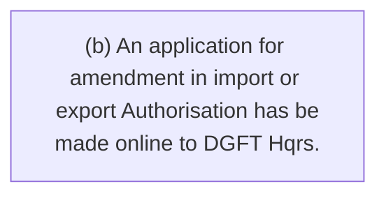
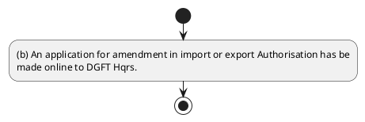

# Chapter 2 / Section 2.47: Import /Export of Restricted Items

**Chapter Title:** General Provisions Regarding Imports and Exports

**Pages:** 18

**Purpose:** 2.47 Import /Export of Restricted Items
(a) An application for grant of an Authorisation for import or export of items
mentioned as ‘Restricted’ in ITC (HS) may be made online to DGFT Hqrs in
ANF 2M /ANF 2N respectively along with documents prescribed therein.

**Purpose Thanglish:** Indha Import /Export of Restricted Items section-la, 2.47 import /export of Restricted Items
(a) An application for grant of an Authorisation for import or export of items
mentioned as ‘Restricted’ in ITC (HS) may be made online to DGFT Hqrs in
ANF 2M /ANF 2N respectively along with documents prescribed therein.

**Summary:** 2.47 Import /Export of Restricted Items
(a) An application for grant of an Authorisation for import or export of items
mentioned as ‘Restricted’ in ITC (HS) may be made online to DGFT Hqrs in
ANF 2M /ANF 2N respectively along with documents prescribed therein. (b) An application for amendment in import or export Authorisation has be
made online to DGFT Hqrs.

**Business Meaning:** 2.47 Import /Export of Restricted Items
(a) An application for grant of an Authorisation for import or export of items
mentioned as ‘Restricted’ in ITC (HS) may be made online to DGFT Hqrs in
ANF 2M /ANF 2N respectively along with documents prescribed therein.

**Business Explanation:** 2.47 Import /Export of Restricted Items
(a) An application for grant of an Authorisation for import or export of items
mentioned as ‘Restricted’ in ITC (HS) may be made online to DGFT Hqrs in
ANF 2M /ANF 2N respectively along with documents prescribed therein. (b) An application for amendment in import or export Authorisation has be
made online to DGFT Hqrs.

**Business Explanation Thanglish:** Indha Import /Export of Restricted Items section-la, 2.47 import /export of Restricted Items
(a) An application for grant of an Authorisation for import or export of items
mentioned as ‘Restricted’ in ITC (HS) may be made online to DGFT Hqrs in
ANF 2M /ANF 2N respectively along with documents prescribed therein. (b) An application for amendment in import or export Authorisation has be
made online to DGFT Hqrs.

## Business Logic
- None identified

## Business Rules
- rule_id=CH2-SEC2_47-R001, rule_description=IF validations pass THEN recommend action: (b) An application for amendment in import or export Authorisation has be
made online to DGFT Hqrs., trigger=Import /Export of Restricted Items, condition=Section 2.47 is applicable, validation=Not explicitly covered in uploaded documents., action=(b) An application for amendment in import or export Authorisation has be
made online to DGFT Hqrs., exception=No explicit exception found in uploaded documents., output=DEKAI should produce a compliance decision for 2.47 - Import /Export of Restricted Items.

## Conditions
- None identified

## Condition Logic
- id=2.2.47.1, if=Section 2.47 is applicable, then=(b) An application for amendment in import or export Authorisation has be
made online to DGFT Hqrs., source=Derived from uploaded documents

## Validations
- None identified

## Exceptions
- None identified

## Dependencies
- None identified

## Authorities
- DGFT
- ITC (HS) may be made online to DGFT

## Required Documents
- 2.47 Import /Export of Restricted Items
(a) An application for grant of an Authorisation for import or export of items
mentioned as ‘Restricted’ in ITC (HS) may be made online to DGFT Hqrs in
ANF 2M /ANF 2N respectively along with documents prescribed therein.
- (b) An application for amendment in import or export Authorisation has be
made online to DGFT Hqrs.

## Timelines
- None identified

## Actions
- (b) An application for amendment in import or export Authorisation has be
made online to DGFT Hqrs.

## Workflow
- (b) An application for amendment in import or export Authorisation has be
made online to DGFT Hqrs.

## Workflow ASCII
```text
Import /Export of Restricted Items
(b) An application for amendment in import or export Authorisation has be
made online to DGFT Hqrs.
```

## Decision Tree
- IF section 2.47 applies THEN (b) An application for amendment in import or export Authorisation has be
made online to DGFT Hqrs.

## Decision Tree ASCII
```text
Import /Export of Restricted Items Decision
IF section 2.47 applies THEN (b) An application for amendment in import or export Authorisation has be
made online to DGFT Hqrs.
```

## Examples
- User asks to process Import /Export of Restricted Items; the platform checks conditions, validations, and documents before action.

**Real-world Example:** Example: an importer or exporter invokes Import /Export of Restricted Items, submits 2.47 Import /Export of Restricted Items
(a) An application for grant of an Authorisation for import or export of items
mentioned as ‘Restricted’ in ITC (HS) may be made online to DGFT Hqrs in
ANF 2M /ANF 2N respectively along with documents prescribed therein., (b) An application for amendment in import or export Authorisation has be
made online to DGFT Hqrs., and DEKAI uses the extracted rules to (b) an application for amendment in import or export authorisation has be
made online to dgft hqrs..

**Real-world Example Thanglish:** Indha Import /Export of Restricted Items section-la, Example: an importer or exporter invokes import /export of Restricted Items, submits 2.47 import /export of Restricted Items
(a) An application for grant of an Authorisation for import or export of items
mentioned as ‘Restricted’ in ITC (HS) may be made online to DGFT Hqrs in
ANF 2M /ANF 2N respectively along with documents prescribed therein., (b) An application for amendment in import or export Authorisation has be
made online to DGFT Hqrs., and DEKAI uses the extracted rules to (b) an application for amendment in import or export authorisation has be
made online to dgft hqrs..

## AI Rules
- IF validations pass THEN recommend action: (b) An application for amendment in import or export Authorisation has be
made online to DGFT Hqrs.

## Database Fields
- name=section_code, type=string, required=True, source=parsed_section_heading
- name=section_title, type=string, required=True, source=parsed_section_heading
- name=for_flag, type=boolean, required=False, source=keyword:for
- name=itc_flag, type=boolean, required=False, source=keyword:ITC
- name=may_flag, type=boolean, required=False, source=keyword:may
- name=anf_flag, type=boolean, required=False, source=keyword:ANF
- name=has_flag, type=boolean, required=False, source=keyword:has
- name=made_flag, type=boolean, required=False, source=keyword:made
- name=dgft_flag, type=boolean, required=False, source=keyword:DGFT
- name=hqrs_flag, type=boolean, required=False, source=keyword:Hqrs
- name=document_1_submitted, type=boolean, required=True, source=2.47 Import /Export of Restricted Items
(a) An application for grant of an Authorisation for import or export of items
mentioned as ‘Restricted’ in ITC (HS) may be made online to DGFT Hqrs in
ANF 2M /ANF 2N respectively along with documents prescribed therein.
- name=document_2_submitted, type=boolean, required=True, source=(b) An application for amendment in import or export Authorisation has be
made online to DGFT Hqrs.

## API Requirements
- method=GET, path=/api/dgft/sections/2.47, purpose=Retrieve knowledge payload for section 2.47, query_params=['include=workflow,decision_tree,validations'], response_fields=['section', 'title', 'summary', 'conditions', 'validations', 'exceptions', 'workflow', 'decision_tree']
- method=POST, path=/api/dgft/Import-Export-of-Restricted-Items/validate, purpose=Validate inputs and documents for Import /Export of Restricted Items, request_fields=['section_code', 'section_title', 'document_1_submitted', 'document_2_submitted'], response_fields=['status', 'errors', 'warnings', 'next_actions']
- method=POST, path=/api/dgft/Import-Export-of-Restricted-Items/execute, purpose=Trigger business action for (b) An application for amendment in import or export Authorisation has be
made online to DGFT Hqrs., request_fields=['section_code', 'section_title', 'document_1_submitted', 'document_2_submitted'], response_fields=['reference_id', 'status', 'authority', 'timeline']

## UI Screens
- screen_id=Import_Export_of_Restricted_Items_overview, name=Import /Export of Restricted Items Overview, purpose=Show section summary, authority, timeline, and eligibility cues., widgets=['summary_card', 'conditions_table', 'authority_badges', 'timeline_panel']
- screen_id=Import_Export_of_Restricted_Items_submission, name=Import /Export of Restricted Items Submission, purpose=Capture applicant data and supporting documents., widgets=['dynamic_form', 'document_uploader', 'validation_panel', 'next_action_footer'], fields=['section_code', 'section_title', 'for_flag', 'itc_flag', 'may_flag', 'anf_flag', 'has_flag', 'made_flag']

## Error Messages
- Validation failed because the section requirements were not fully met.

## FAQ
- question_en=What is the purpose of section 2.47?, answer_en=2.47 Import /Export of Restricted Items
(a) An application for grant of an Authorisation for import or export of items
mentioned as ‘Restricted’ in ITC (HS) may be made online to DGFT Hqrs in
ANF 2M /ANF 2N respectively along with documents prescribed therein. (b) An application for amendment in import or export Authorisation has be
made online to DGFT Hqrs., question_thanglish=Indha Import /Export of Restricted Items section-la, What is the purpose of section 2.47?, answer_thanglish=Indha Import /Export of Restricted Items section-la, 2.47 import /export of Restricted Items
(a) An application for grant of an Authorisation for import or export of items
mentioned as ‘Restricted’ in ITC (HS) may be made online to DGFT Hqrs in
ANF 2M /ANF 2N respectively along with documents prescribed therein. (b) An application for amendment in import or export Authorisation has be
made online to DGFT Hqrs.
- question_en=What documents are required under Import /Export of Restricted Items?, answer_en=2.47 Import /Export of Restricted Items
(a) An application for grant of an Authorisation for import or export of items
mentioned as ‘Restricted’ in ITC (HS) may be made online to DGFT Hqrs in
ANF 2M /ANF 2N respectively along with documents prescribed therein., (b) An application for amendment in import or export Authorisation has be
made online to DGFT Hqrs., question_thanglish=Indha Import /Export of Restricted Items section-la, What documents are required under import /export of Restricted Items?, answer_thanglish=Indha Import /Export of Restricted Items section-la, 2.47 import /export of Restricted Items
(a) An application for grant of an Authorisation for import or export of items
mentioned as ‘Restricted’ in ITC (HS) may be made online to DGFT Hqrs in
ANF 2M /ANF 2N respectively along with documents prescribed therein., (b) An application for amendment in import or export Authorisation has be
made online to DGFT Hqrs.
- question_en=Which authority handles Import /Export of Restricted Items?, answer_en=DGFT, ITC (HS) may be made online to DGFT, question_thanglish=Indha Import /Export of Restricted Items section-la, Which authority handles import /export of Restricted Items?, answer_thanglish=Indha Import /Export of Restricted Items section-la, DGFT, ITC (HS) may be made online to DGFT

## Questions Users May Ask
- What does Import /Export of Restricted Items require?
- Which documents are needed for Import /Export of Restricted Items?
- How does DEKAI validate Import /Export of Restricted Items requests?
- What action should be taken for Import /Export of Restricted Items?

## Expected AI Answers
- Import /Export of Restricted Items requires the platform to interpret the section text, apply the extracted business rules, and present the correct next action.
- Required documents are inferred from the section text: 2.47 Import /Export of Restricted Items
(a) An application for grant of an Authorisation for import or export of items
mentioned as ‘Restricted’ in ITC (HS) may be made online to DGFT Hqrs in
ANF 2M /ANF 2N respectively along with documents prescribed therein., (b) An application for amendment in import or export Authorisation has be
made online to DGFT Hqrs.
- DEKAI validates Import /Export of Restricted Items by checking conditions, required documents, authority references, and exception clauses before recommending an outcome.
- The primary extracted action is: (b) An application for amendment in import or export Authorisation has be
made online to DGFT Hqrs.

## AI Q&A Examples
- question_en=User asks: How do I comply with Import /Export of Restricted Items?, answer_en=AI answers: DEKAI should evaluate section 2.47, apply the extracted rules, and guide the user through (b) An application for amendment in import or export Authorisation has be
made online to DGFT Hqrs.., question_thanglish=Indha Import /Export of Restricted Items section-la, User asks: How do I comply with import /export of Restricted Items?, answer_thanglish=Indha Import /Export of Restricted Items section-la, AI answers: DEKAI should evaluate section 2.47, apply the extracted rules, and guide the user through (b) An application for amendment in import or export Authorisation has be
made online to DGFT Hqrs..
- question_en=User asks: Which validations apply to Import /Export of Restricted Items?, answer_en=AI answers: Applicable validations are not explicitly covered in the uploaded documents., question_thanglish=Indha Import /Export of Restricted Items section-la, User asks: Which validations apply to import /export of Restricted Items?, answer_thanglish=Indha Import /Export of Restricted Items section-la, AI answers: Applicable validations are not explicitly covered in the uploaded documents.

## DEKAI AI Implementation Notes
- Capture chapter 2, section 2.47, title, and page references as immutable knowledge metadata.
- Bind validations for Import /Export of Restricted Items into a rule engine keyed by the rule IDs extracted for this section.
- Expose document upload controls for: 2.47 Import /Export of Restricted Items
(a) An application for grant of an Authorisation for import or export of items
mentioned as ‘Restricted’ in ITC (HS) may be made online to DGFT Hqrs in
ANF 2M /ANF 2N respectively along with documents prescribed therein., (b) An application for amendment in import or export Authorisation has be
made online to DGFT Hqrs..
- Route escalations or approvals to: DGFT, ITC (HS) may be made online to DGFT.

## DEKAI AI Implementation Notes Thanglish
- Indha Import /Export of Restricted Items section-la, Capture chapter 2, section 2.47, title, and page references as immutable knowledge metadata.
- Indha Import /Export of Restricted Items section-la, Bind validations for import /export of Restricted Items into a rule engine keyed by the rule IDs extracted for this section.
- Indha Import /Export of Restricted Items section-la, Expose document upload controls for: 2.47 import /export of Restricted Items
(a) An application for grant of an Authorisation for import or export of items
mentioned as ‘Restricted’ in ITC (HS) may be made online to DGFT Hqrs in
ANF 2M /ANF 2N respectively along with documents prescribed therein., (b) An application for amendment in import or export Authorisation has be
made online to DGFT Hqrs..
- Indha Import /Export of Restricted Items section-la, Route escalations or approvals to: DGFT, ITC (HS) may be made online to DGFT.

## AI Metadata
- Keywords: for, ITC, may, ANF, has, made, DGFT, Hqrs, with, Items, grant, along, Import, Export, online, therein, mentioned, documents, amendment, Restricted
- Search Keywords: for, ITC, may, ANF, has, made, DGFT, Hqrs, with, Items, grant, along, Import, Export, online, therein, mentioned, documents, amendment, Restricted
- Intent: Support Import /Export of Restricted Items processing and compliance validation.
- Tags: 2.47, Import /Export of Restricted Items, document-driven, dgft
- Related Sections: 
- Related Chapters: 
- Related Rules: 

## Mermaid


## PlantUML

