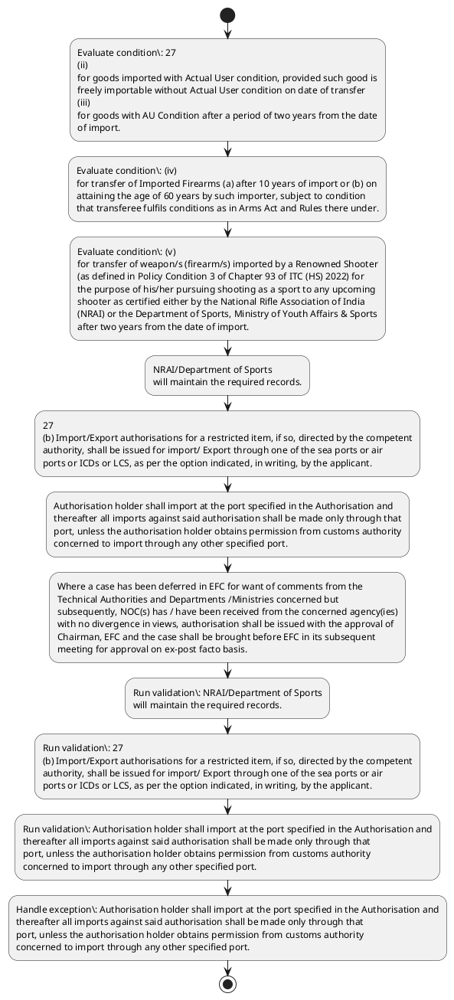

# Chapter 2 / Section 2.48: EXIM Facilitation Committee

**Chapter Title:** General Provisions Regarding Imports and Exports

**Pages:** 18, 19

**Purpose:** 27
(ii)
for goods imported with Actual User condition, provided such good is
freely importable without Actual User condition on date of transfer
(iii)
for goods with AU Condition after a period of two years from the date
of import.

**Purpose Thanglish:** Indha EXIM Facilitation Committee section-la, 27
(ii)
for goods imported with Actual User condition, provided such good is
freely importable without Actual User condition on date of transfer
(iii)
for goods with AU Condition after a period of two years from the date
of import.

**Summary:** 2.48 EXIM Facilitation Committee
(a) Restricted item Authorisation may be granted by DGFT or any other RA
authorised by him in this behalf. DGFT / RA may take assistance and advice
of a Facilitation Committee while granting authorisation. The Assistance of
technical authorities may also be taken by seeking their comments in writing.

**Business Meaning:** EXIM Facilitation Committee governs how DGFT business controls should be applied, validated, and enforced.

**Business Explanation:** EXIM Facilitation Committee explains the operating rule set that DEKAI should enforce. Key control points include (iv)
for transfer of Imported Firearms (a) after 10 years of import or (b) on
attaining the age of 60 years by such importer, subject to condition
that transferee fulfils conditions as in Arms Act and Rules there under. The section also drives actions such as NRAI/Department of Sports
will maintain the required records..

**Business Explanation Thanglish:** Indha EXIM Facilitation Committee section-la, EXIM Facilitation Committee explains the operating rule set that DEKAI should enforce. Key control points include (iv)
for transfer of Imported Firearms (a) after 10 years of import or (b) on
attaining the age of 60 years by such importer, subject to condition
that transferee fulfils conditions as in Arms Act and Rules there under. The section also drives actions such as NRAI/Department of Sports
will maintain the required records..

## Business Logic
- (iv)
for transfer of Imported Firearms (a) after 10 years of import or (b) on
attaining the age of 60 years by such importer, subject to condition
that transferee fulfils conditions as in Arms Act and Rules there under.
- Such transfer/sale is
subject to the provisions of the Arms Act, 1959 and other
rules/regulations by state/local police.
- 27
(b) Import/Export authorisations for a restricted item, if so, directed by the competent
authority, shall be issued for import/ Export through one of the sea ports or air
ports or ICDs or LCS, as per the option indicated, in writing, by the applicant.
- Authorisation holder shall import at the port specified in the Authorisation and
thereafter all imports against said authorisation shall be made only through that
port, unless the authorisation holder obtains permission from customs authority
concerned to import through any other specified port.
- (c) EXIM Facilitation Committee (EFC) shall normally meet once every month.
- Where a case has been deferred in EFC for want of comments from the
Technical Authorities and Departments /Ministries concerned but
subsequently, NOC(s) has / have been received from the concerned agency(ies)
with no divergence in views, authorisation shall be issued with the approval of
Chairman, EFC and the case shall be brought before EFC in its subsequent
meeting for approval on ex-post facto basis.

## Business Rules
- rule_id=CH2-SEC2_48-R001, rule_description=(iv)
for transfer of Imported Firearms (a) after 10 years of import or (b) on
attaining the age of 60 years by such importer, subject to condition
that transferee fulfils conditions as in Arms Act and Rules there under., trigger=EXIM Facilitation Committee, condition=27
(ii)
for goods imported with Actual User condition, provided such good is
freely importable without Actual User condition on date of transfer
(iii)
for goods with AU Condition after a period of two years from the date
of import., validation=NRAI/Department of Sports
will maintain the required records., action=NRAI/Department of Sports
will maintain the required records., exception=Authorisation holder shall import at the port specified in the Authorisation and
thereafter all imports against said authorisation shall be made only through that
port, unless the authorisation holder obtains permission from customs authority
concerned to import through any other specified port., output=DEKAI should produce a compliance decision for 2.48 - EXIM Facilitation Committee.
- rule_id=CH2-SEC2_48-R002, rule_description=Such transfer/sale is
subject to the provisions of the Arms Act, 1959 and other
rules/regulations by state/local police., trigger=EXIM Facilitation Committee, condition=(iv)
for transfer of Imported Firearms (a) after 10 years of import or (b) on
attaining the age of 60 years by such importer, subject to condition
that transferee fulfils conditions as in Arms Act and Rules there under., validation=27
(b) Import/Export authorisations for a restricted item, if so, directed by the competent
authority, shall be issued for import/ Export through one of the sea ports or air
ports or ICDs or LCS, as per the option indicated, in writing, by the applicant., action=27
(b) Import/Export authorisations for a restricted item, if so, directed by the competent
authority, shall be issued for import/ Export through one of the sea ports or air
ports or ICDs or LCS, as per the option indicated, in writing, by the applicant., exception=Where a case has been deferred in EFC for want of comments from the
Technical Authorities and Departments /Ministries concerned but
subsequently, NOC(s) has / have been received from the concerned agency(ies)
with no divergence in views, authorisation shall be issued with the approval of
Chairman, EFC and the case shall be brought before EFC in its subsequent
meeting for approval on ex-post facto basis., output=DEKAI should produce a compliance decision for 2.48 - EXIM Facilitation Committee.
- rule_id=CH2-SEC2_48-R003, rule_description=27
(b) Import/Export authorisations for a restricted item, if so, directed by the competent
authority, shall be issued for import/ Export through one of the sea ports or air
ports or ICDs or LCS, as per the option indicated, in writing, by the applicant., trigger=EXIM Facilitation Committee, condition=(v)
for transfer of weapon/s (firearm/s) imported by a Renowned Shooter
(as defined in Policy Condition 3 of Chapter 93 of ITC (HS) 2022) for
the purpose of his/her pursuing shooting as a sport to any upcoming
shooter as certified either by the National Rifle Association of India
(NRAI) or the Department of Sports, Ministry of Youth Affairs & Sports
after two years from the date of import., validation=Authorisation holder shall import at the port specified in the Authorisation and
thereafter all imports against said authorisation shall be made only through that
port, unless the authorisation holder obtains permission from customs authority
concerned to import through any other specified port., action=Authorisation holder shall import at the port specified in the Authorisation and
thereafter all imports against said authorisation shall be made only through that
port, unless the authorisation holder obtains permission from customs authority
concerned to import through any other specified port., exception=Where a case has been deferred in EFC for want of comments from the
Technical Authorities and Departments /Ministries concerned but
subsequently, NOC(s) has / have been received from the concerned agency(ies)
with no divergence in views, authorisation shall be issued with the approval of
Chairman, EFC and the case shall be brought before EFC in its subsequent
meeting for approval on ex-post facto basis., output=DEKAI should produce a compliance decision for 2.48 - EXIM Facilitation Committee.
- rule_id=CH2-SEC2_48-R004, rule_description=Authorisation holder shall import at the port specified in the Authorisation and
thereafter all imports against said authorisation shall be made only through that
port, unless the authorisation holder obtains permission from customs authority
concerned to import through any other specified port., trigger=EXIM Facilitation Committee, condition=The transferee can
subsequently transfer/resell to any buyer as certified by the NRAI or
Department of Sports for the sole purpose of pursuing shooting as a
sport after one year from the date of its first sale., validation=(c) EXIM Facilitation Committee (EFC) shall normally meet once every month., action=Where a case has been deferred in EFC for want of comments from the
Technical Authorities and Departments /Ministries concerned but
subsequently, NOC(s) has / have been received from the concerned agency(ies)
with no divergence in views, authorisation shall be issued with the approval of
Chairman, EFC and the case shall be brought before EFC in its subsequent
meeting for approval on ex-post facto basis., exception=Where a case has been deferred in EFC for want of comments from the
Technical Authorities and Departments /Ministries concerned but
subsequently, NOC(s) has / have been received from the concerned agency(ies)
with no divergence in views, authorisation shall be issued with the approval of
Chairman, EFC and the case shall be brought before EFC in its subsequent
meeting for approval on ex-post facto basis., output=DEKAI should produce a compliance decision for 2.48 - EXIM Facilitation Committee.
- rule_id=CH2-SEC2_48-R005, rule_description=(c) EXIM Facilitation Committee (EFC) shall normally meet once every month., trigger=EXIM Facilitation Committee, condition=Such transfer/sale is
subject to the provisions of the Arms Act, 1959 and other
rules/regulations by state/local police., validation=Where a case has been deferred in EFC for want of comments from the
Technical Authorities and Departments /Ministries concerned but
subsequently, NOC(s) has / have been received from the concerned agency(ies)
with no divergence in views, authorisation shall be issued with the approval of
Chairman, EFC and the case shall be brought before EFC in its subsequent
meeting for approval on ex-post facto basis., action=Where a case has been deferred in EFC for want of comments from the
Technical Authorities and Departments /Ministries concerned but
subsequently, NOC(s) has / have been received from the concerned agency(ies)
with no divergence in views, authorisation shall be issued with the approval of
Chairman, EFC and the case shall be brought before EFC in its subsequent
meeting for approval on ex-post facto basis., exception=Where a case has been deferred in EFC for want of comments from the
Technical Authorities and Departments /Ministries concerned but
subsequently, NOC(s) has / have been received from the concerned agency(ies)
with no divergence in views, authorisation shall be issued with the approval of
Chairman, EFC and the case shall be brought before EFC in its subsequent
meeting for approval on ex-post facto basis., output=DEKAI should produce a compliance decision for 2.48 - EXIM Facilitation Committee.
- rule_id=CH2-SEC2_48-R006, rule_description=Where a case has been deferred in EFC for want of comments from the
Technical Authorities and Departments /Ministries concerned but
subsequently, NOC(s) has / have been received from the concerned agency(ies)
with no divergence in views, authorisation shall be issued with the approval of
Chairman, EFC and the case shall be brought before EFC in its subsequent
meeting for approval on ex-post facto basis., trigger=EXIM Facilitation Committee, condition=so, validation=Where a case has been deferred in EFC for want of comments from the
Technical Authorities and Departments /Ministries concerned but
subsequently, NOC(s) has / have been received from the concerned agency(ies)
with no divergence in views, authorisation shall be issued with the approval of
Chairman, EFC and the case shall be brought before EFC in its subsequent
meeting for approval on ex-post facto basis., action=Where a case has been deferred in EFC for want of comments from the
Technical Authorities and Departments /Ministries concerned but
subsequently, NOC(s) has / have been received from the concerned agency(ies)
with no divergence in views, authorisation shall be issued with the approval of
Chairman, EFC and the case shall be brought before EFC in its subsequent
meeting for approval on ex-post facto basis., exception=Where a case has been deferred in EFC for want of comments from the
Technical Authorities and Departments /Ministries concerned but
subsequently, NOC(s) has / have been received from the concerned agency(ies)
with no divergence in views, authorisation shall be issued with the approval of
Chairman, EFC and the case shall be brought before EFC in its subsequent
meeting for approval on ex-post facto basis., output=DEKAI should produce a compliance decision for 2.48 - EXIM Facilitation Committee.

## Conditions
- 27
(ii)
for goods imported with Actual User condition, provided such good is
freely importable without Actual User condition on date of transfer
(iii)
for goods with AU Condition after a period of two years from the date
of import.
- (iv)
for transfer of Imported Firearms (a) after 10 years of import or (b) on
attaining the age of 60 years by such importer, subject to condition
that transferee fulfils conditions as in Arms Act and Rules there under.
- (v)
for transfer of weapon/s (firearm/s) imported by a Renowned Shooter
(as defined in Policy Condition 3 of Chapter 93 of ITC (HS) 2022) for
the purpose of his/her pursuing shooting as a sport to any upcoming
shooter as certified either by the National Rifle Association of India
(NRAI) or the Department of Sports, Ministry of Youth Affairs & Sports
after two years from the date of import.
- The transferee can
subsequently transfer/resell to any buyer as certified by the NRAI or
Department of Sports for the sole purpose of pursuing shooting as a
sport after one year from the date of its first sale.
- Such transfer/sale is
subject to the provisions of the Arms Act, 1959 and other
rules/regulations by state/local police.
- 27
(b) Import/Export authorisations for a restricted item, if so, directed by the competent
authority, shall be issued for import/ Export through one of the sea ports or air
ports or ICDs or LCS, as per the option indicated, in writing, by the applicant.
- Authorisation holder shall import at the port specified in the Authorisation and
thereafter all imports against said authorisation shall be made only through that
port, unless the authorisation holder obtains permission from customs authority
concerned to import through any other specified port.
- Where a case has been deferred in EFC for want of comments from the
Technical Authorities and Departments /Ministries concerned but
subsequently, NOC(s) has / have been received from the concerned agency(ies)
with no divergence in views, authorisation shall be issued with the approval of
Chairman, EFC and the case shall be brought before EFC in its subsequent
meeting for approval on ex-post facto basis.

## Condition Logic
- id=2.2.48.1, if=27
(ii)
for goods imported with Actual User condition, provided such good is
freely importable without Actual User condition on date of transfer
(iii)
for goods with AU Condition after a period of two years from the date
of import., then=NRAI/Department of Sports
will maintain the required records., source=27
(ii)
for goods imported with Actual User condition, provided such good is
freely importable without Actual User condition on date of transfer
(iii)
for goods with AU Condition after a period of two years from the date
of import.
- id=2.2.48.2, if=(iv)
for transfer of Imported Firearms (a) after 10 years of import or (b) on
attaining the age of 60 years by such importer, subject to condition
that transferee fulfils conditions as in Arms Act and Rules there under., then=NRAI/Department of Sports
will maintain the required records., source=(iv)
for transfer of Imported Firearms (a) after 10 years of import or (b) on
attaining the age of 60 years by such importer, subject to condition
that transferee fulfils conditions as in Arms Act and Rules there under.
- id=2.2.48.3, if=(v)
for transfer of weapon/s (firearm/s) imported by a Renowned Shooter
(as defined in Policy Condition 3 of Chapter 93 of ITC (HS) 2022) for
the purpose of his/her pursuing shooting as a sport to any upcoming
shooter as certified either by the National Rifle Association of India
(NRAI) or the Department of Sports, Ministry of Youth Affairs & Sports
after two years from the date of import., then=NRAI/Department of Sports
will maintain the required records., source=(v)
for transfer of weapon/s (firearm/s) imported by a Renowned Shooter
(as defined in Policy Condition 3 of Chapter 93 of ITC (HS) 2022) for
the purpose of his/her pursuing shooting as a sport to any upcoming
shooter as certified either by the National Rifle Association of India
(NRAI) or the Department of Sports, Ministry of Youth Affairs & Sports
after two years from the date of import.
- id=2.2.48.4, if=The transferee can
subsequently transfer/resell to any buyer as certified by the NRAI or
Department of Sports for the sole purpose of pursuing shooting as a
sport after one year from the date of its first sale., then=NRAI/Department of Sports
will maintain the required records., source=The transferee can
subsequently transfer/resell to any buyer as certified by the NRAI or
Department of Sports for the sole purpose of pursuing shooting as a
sport after one year from the date of its first sale.
- id=2.2.48.5, if=Such transfer/sale is
subject to the provisions of the Arms Act, 1959 and other
rules/regulations by state/local police., then=NRAI/Department of Sports
will maintain the required records., source=Such transfer/sale is
subject to the provisions of the Arms Act, 1959 and other
rules/regulations by state/local police.
- id=2.2.48.6, if=so, then=NRAI/Department of Sports
will maintain the required records., source=27
(b) Import/Export authorisations for a restricted item, if so, directed by the competent
authority, shall be issued for import/ Export through one of the sea ports or air
ports or ICDs or LCS, as per the option indicated, in writing, by the applicant.
- id=2.2.48.7, if=Authorisation holder shall import at the port specified in the Authorisation and
thereafter all imports against said authorisation shall be made only through that
port, unless the authorisation holder obtains permission from customs authority
concerned to import through any other specified port., then=NRAI/Department of Sports
will maintain the required records., source=Authorisation holder shall import at the port specified in the Authorisation and
thereafter all imports against said authorisation shall be made only through that
port, unless the authorisation holder obtains permission from customs authority
concerned to import through any other specified port.
- id=2.2.48.8, if=Where a case has been deferred in EFC for want of comments from the
Technical Authorities and Departments /Ministries concerned but
subsequently, NOC(s) has / have been received from the concerned agency(ies)
with no divergence in views, authorisation shall be issued with the approval of
Chairman, EFC and the case shall be brought before EFC in its subsequent
meeting for approval on ex-post facto basis., then=NRAI/Department of Sports
will maintain the required records., source=Where a case has been deferred in EFC for want of comments from the
Technical Authorities and Departments /Ministries concerned but
subsequently, NOC(s) has / have been received from the concerned agency(ies)
with no divergence in views, authorisation shall be issued with the approval of
Chairman, EFC and the case shall be brought before EFC in its subsequent
meeting for approval on ex-post facto basis.

## Validations
- NRAI/Department of Sports
will maintain the required records.
- 27
(b) Import/Export authorisations for a restricted item, if so, directed by the competent
authority, shall be issued for import/ Export through one of the sea ports or air
ports or ICDs or LCS, as per the option indicated, in writing, by the applicant.
- Authorisation holder shall import at the port specified in the Authorisation and
thereafter all imports against said authorisation shall be made only through that
port, unless the authorisation holder obtains permission from customs authority
concerned to import through any other specified port.
- (c) EXIM Facilitation Committee (EFC) shall normally meet once every month.
- Where a case has been deferred in EFC for want of comments from the
Technical Authorities and Departments /Ministries concerned but
subsequently, NOC(s) has / have been received from the concerned agency(ies)
with no divergence in views, authorisation shall be issued with the approval of
Chairman, EFC and the case shall be brought before EFC in its subsequent
meeting for approval on ex-post facto basis.

## Exceptions
- Authorisation holder shall import at the port specified in the Authorisation and
thereafter all imports against said authorisation shall be made only through that
port, unless the authorisation holder obtains permission from customs authority
concerned to import through any other specified port.
- Where a case has been deferred in EFC for want of comments from the
Technical Authorities and Departments /Ministries concerned but
subsequently, NOC(s) has / have been received from the concerned agency(ies)
with no divergence in views, authorisation shall be issued with the approval of
Chairman, EFC and the case shall be brought before EFC in its subsequent
meeting for approval on ex-post facto basis.

## Dependencies
- 93
- 1

## Authorities
- DGFT
- RA
- EXIM Facilitation Committee
- Restricted item Authorisation may be granted by DGFT or any other RA
- DGFT / RA
- Facilitation Committee
- customs
- customs authority
- Technical Authorities

## Required Documents
- None identified

## Timelines
- 27
(ii)
for goods imported with Actual User condition, provided such good is
freely importable without Actual User condition on date of transfer
(iii)
for goods with AU Condition after a period of two years from the date
of import.
- (iv)
for transfer of Imported Firearms (a) after 10 years of import or (b) on
attaining the age of 60 years by such importer, subject to condition
that transferee fulfils conditions as in Arms Act and Rules there under.
- (v)
for transfer of weapon/s (firearm/s) imported by a Renowned Shooter
(as defined in Policy Condition 3 of Chapter 93 of ITC (HS) 2022) for
the purpose of his/her pursuing shooting as a sport to any upcoming
shooter as certified either by the National Rifle Association of India
(NRAI) or the Department of Sports, Ministry of Youth Affairs & Sports
after two years from the date of import.
- The transferee can
subsequently transfer/resell to any buyer as certified by the NRAI or
Department of Sports for the sole purpose of pursuing shooting as a
sport after one year from the date of its first sale.
- Authorisation holder shall import at the port specified in the Authorisation and
thereafter all imports against said authorisation shall be made only through that
port, unless the authorisation holder obtains permission from customs authority
concerned to import through any other specified port.
- Where a case has been deferred in EFC for want of comments from the
Technical Authorities and Departments /Ministries concerned but
subsequently, NOC(s) has / have been received from the concerned agency(ies)
with no divergence in views, authorisation shall be issued with the approval of
Chairman, EFC and the case shall be brought before EFC in its subsequent
meeting for approval on ex-post facto basis.

## Actions
- NRAI/Department of Sports
will maintain the required records.
- 27
(b) Import/Export authorisations for a restricted item, if so, directed by the competent
authority, shall be issued for import/ Export through one of the sea ports or air
ports or ICDs or LCS, as per the option indicated, in writing, by the applicant.
- Authorisation holder shall import at the port specified in the Authorisation and
thereafter all imports against said authorisation shall be made only through that
port, unless the authorisation holder obtains permission from customs authority
concerned to import through any other specified port.
- Where a case has been deferred in EFC for want of comments from the
Technical Authorities and Departments /Ministries concerned but
subsequently, NOC(s) has / have been received from the concerned agency(ies)
with no divergence in views, authorisation shall be issued with the approval of
Chairman, EFC and the case shall be brought before EFC in its subsequent
meeting for approval on ex-post facto basis.

## Workflow
- Evaluate condition: 27
(ii)
for goods imported with Actual User condition, provided such good is
freely importable without Actual User condition on date of transfer
(iii)
for goods with AU Condition after a period of two years from the date
of import.
- Evaluate condition: (iv)
for transfer of Imported Firearms (a) after 10 years of import or (b) on
attaining the age of 60 years by such importer, subject to condition
that transferee fulfils conditions as in Arms Act and Rules there under.
- Evaluate condition: (v)
for transfer of weapon/s (firearm/s) imported by a Renowned Shooter
(as defined in Policy Condition 3 of Chapter 93 of ITC (HS) 2022) for
the purpose of his/her pursuing shooting as a sport to any upcoming
shooter as certified either by the National Rifle Association of India
(NRAI) or the Department of Sports, Ministry of Youth Affairs & Sports
after two years from the date of import.
- NRAI/Department of Sports
will maintain the required records.
- 27
(b) Import/Export authorisations for a restricted item, if so, directed by the competent
authority, shall be issued for import/ Export through one of the sea ports or air
ports or ICDs or LCS, as per the option indicated, in writing, by the applicant.
- Authorisation holder shall import at the port specified in the Authorisation and
thereafter all imports against said authorisation shall be made only through that
port, unless the authorisation holder obtains permission from customs authority
concerned to import through any other specified port.
- Where a case has been deferred in EFC for want of comments from the
Technical Authorities and Departments /Ministries concerned but
subsequently, NOC(s) has / have been received from the concerned agency(ies)
with no divergence in views, authorisation shall be issued with the approval of
Chairman, EFC and the case shall be brought before EFC in its subsequent
meeting for approval on ex-post facto basis.
- Run validation: NRAI/Department of Sports
will maintain the required records.
- Run validation: 27
(b) Import/Export authorisations for a restricted item, if so, directed by the competent
authority, shall be issued for import/ Export through one of the sea ports or air
ports or ICDs or LCS, as per the option indicated, in writing, by the applicant.
- Run validation: Authorisation holder shall import at the port specified in the Authorisation and
thereafter all imports against said authorisation shall be made only through that
port, unless the authorisation holder obtains permission from customs authority
concerned to import through any other specified port.
- Handle exception: Authorisation holder shall import at the port specified in the Authorisation and
thereafter all imports against said authorisation shall be made only through that
port, unless the authorisation holder obtains permission from customs authority
concerned to import through any other specified port.

## Workflow ASCII
```text
EXIM Facilitation Committee
Evaluate condition: 27
(ii)
for goods imported with Actual User condition, provided such good is
freely importable without Actual User condition on date of transfer
(iii)
for goods with AU Condition after a period of two years from the date
of import.
   |
   v
Evaluate condition: (iv)
for transfer of Imported Firearms (a) after 10 years of import or (b) on
attaining the age of 60 years by such importer, subject to condition
that transferee fulfils conditions as in Arms Act and Rules there under.
   |
   v
Evaluate condition: (v)
for transfer of weapon/s (firearm/s) imported by a Renowned Shooter
(as defined in Policy Condition 3 of Chapter 93 of ITC (HS) 2022) for
the purpose of his/her pursuing shooting as a sport to any upcoming
shooter as certified either by the National Rifle Association of India
(NRAI) or the Department of Sports, Ministry of Youth Affairs & Sports
after two years from the date of import.
   |
   v
NRAI/Department of Sports
will maintain the required records.
   |
   v
27
(b) Import/Export authorisations for a restricted item, if so, directed by the competent
authority, shall be issued for import/ Export through one of the sea ports or air
ports or ICDs or LCS, as per the option indicated, in writing, by the applicant.
   |
   v
Authorisation holder shall import at the port specified in the Authorisation and
thereafter all imports against said authorisation shall be made only through that
port, unless the authorisation holder obtains permission from customs authority
concerned to import through any other specified port.
   |
   v
Where a case has been deferred in EFC for want of comments from the
Technical Authorities and Departments /Ministries concerned but
subsequently, NOC(s) has / have been received from the concerned agency(ies)
with no divergence in views, authorisation shall be issued with the approval of
Chairman, EFC and the case shall be brought before EFC in its subsequent
meeting for approval on ex-post facto basis.
   |
   v
Run validation: NRAI/Department of Sports
will maintain the required records.
   |
   v
Run validation: 27
(b) Import/Export authorisations for a restricted item, if so, directed by the competent
authority, shall be issued for import/ Export through one of the sea ports or air
ports or ICDs or LCS, as per the option indicated, in writing, by the applicant.
   |
   v
Run validation: Authorisation holder shall import at the port specified in the Authorisation and
thereafter all imports against said authorisation shall be made only through that
port, unless the authorisation holder obtains permission from customs authority
concerned to import through any other specified port.
   |
   v
Handle exception: Authorisation holder shall import at the port specified in the Authorisation and
thereafter all imports against said authorisation shall be made only through that
port, unless the authorisation holder obtains permission from customs authority
concerned to import through any other specified port.
```

## Decision Tree
- IF 27
(ii)
for goods imported with Actual User condition, provided such good is
freely importable without Actual User condition on date of transfer
(iii)
for goods with AU Condition after a period of two years from the date
of import. THEN NRAI/Department of Sports
will maintain the required records.
- IF (iv)
for transfer of Imported Firearms (a) after 10 years of import or (b) on
attaining the age of 60 years by such importer, subject to condition
that transferee fulfils conditions as in Arms Act and Rules there under. THEN NRAI/Department of Sports
will maintain the required records.
- IF (v)
for transfer of weapon/s (firearm/s) imported by a Renowned Shooter
(as defined in Policy Condition 3 of Chapter 93 of ITC (HS) 2022) for
the purpose of his/her pursuing shooting as a sport to any upcoming
shooter as certified either by the National Rifle Association of India
(NRAI) or the Department of Sports, Ministry of Youth Affairs & Sports
after two years from the date of import. THEN NRAI/Department of Sports
will maintain the required records.
- IF The transferee can
subsequently transfer/resell to any buyer as certified by the NRAI or
Department of Sports for the sole purpose of pursuing shooting as a
sport after one year from the date of its first sale. THEN NRAI/Department of Sports
will maintain the required records.
- IF Such transfer/sale is
subject to the provisions of the Arms Act, 1959 and other
rules/regulations by state/local police. THEN NRAI/Department of Sports
will maintain the required records.
- IF exception applies (Authorisation holder shall import at the port specified in the Authorisation and
thereafter all imports against said authorisation shall be made only through that
port, unless the authorisation holder obtains permission from customs authority
concerned to import through any other specified port.) THEN route to manual review
- IF exception applies (Where a case has been deferred in EFC for want of comments from the
Technical Authorities and Departments /Ministries concerned but
subsequently, NOC(s) has / have been received from the concerned agency(ies)
with no divergence in views, authorisation shall be issued with the approval of
Chairman, EFC and the case shall be brought before EFC in its subsequent
meeting for approval on ex-post facto basis.) THEN route to manual review

## Decision Tree ASCII
```text
EXIM Facilitation Committee Decision
IF 27
(ii)
for goods imported with Actual User condition, provided such good is
freely importable without Actual User condition on date of transfer
(iii)
for goods with AU Condition after a period of two years from the date
of import. THEN NRAI/Department of Sports
will maintain the required records.
   |
   v
IF (iv)
for transfer of Imported Firearms (a) after 10 years of import or (b) on
attaining the age of 60 years by such importer, subject to condition
that transferee fulfils conditions as in Arms Act and Rules there under. THEN NRAI/Department of Sports
will maintain the required records.
   |
   v
IF (v)
for transfer of weapon/s (firearm/s) imported by a Renowned Shooter
(as defined in Policy Condition 3 of Chapter 93 of ITC (HS) 2022) for
the purpose of his/her pursuing shooting as a sport to any upcoming
shooter as certified either by the National Rifle Association of India
(NRAI) or the Department of Sports, Ministry of Youth Affairs & Sports
after two years from the date of import. THEN NRAI/Department of Sports
will maintain the required records.
   |
   v
IF The transferee can
subsequently transfer/resell to any buyer as certified by the NRAI or
Department of Sports for the sole purpose of pursuing shooting as a
sport after one year from the date of its first sale. THEN NRAI/Department of Sports
will maintain the required records.
   |
   v
IF Such transfer/sale is
subject to the provisions of the Arms Act, 1959 and other
rules/regulations by state/local police. THEN NRAI/Department of Sports
will maintain the required records.
   |
   v
IF exception applies (Authorisation holder shall import at the port specified in the Authorisation and
thereafter all imports against said authorisation shall be made only through that
port, unless the authorisation holder obtains permission from customs authority
concerned to import through any other specified port.) THEN route to manual review
   |
   v
IF exception applies (Where a case has been deferred in EFC for want of comments from the
Technical Authorities and Departments /Ministries concerned but
subsequently, NOC(s) has / have been received from the concerned agency(ies)
with no divergence in views, authorisation shall be issued with the approval of
Chairman, EFC and the case shall be brought before EFC in its subsequent
meeting for approval on ex-post facto basis.) THEN route to manual review
```

## Examples
- User asks to process EXIM Facilitation Committee; the platform checks conditions, validations, and documents before action.

**Real-world Example:** Example: an importer or exporter invokes EXIM Facilitation Committee, submits the prescribed DGFT records, and DEKAI uses the extracted rules to nrai/department of sports
will maintain the required records..

**Real-world Example Thanglish:** Indha EXIM Facilitation Committee section-la, Example: an importer or exporter invokes EXIM Facilitation Committee, submits the prescribed DGFT records, and DEKAI uses the extracted rules to nrai/department of sports
will maintain the required records..

## AI Rules
- IF detected context matches section rule THEN enforce: (iv)
for transfer of Imported Firearms (a) after 10 years of import or (b) on
attaining the age of 60 years by such importer, subject to condition
that transferee fulfils conditions as in Arms Act and Rules there under.
- IF detected context matches section rule THEN enforce: Such transfer/sale is
subject to the provisions of the Arms Act, 1959 and other
rules/regulations by state/local police.
- IF detected context matches section rule THEN enforce: 27
(b) Import/Export authorisations for a restricted item, if so, directed by the competent
authority, shall be issued for import/ Export through one of the sea ports or air
ports or ICDs or LCS, as per the option indicated, in writing, by the applicant.
- IF detected context matches section rule THEN enforce: Authorisation holder shall import at the port specified in the Authorisation and
thereafter all imports against said authorisation shall be made only through that
port, unless the authorisation holder obtains permission from customs authority
concerned to import through any other specified port.
- IF detected context matches section rule THEN enforce: (c) EXIM Facilitation Committee (EFC) shall normally meet once every month.
- IF detected context matches section rule THEN enforce: Where a case has been deferred in EFC for want of comments from the
Technical Authorities and Departments /Ministries concerned but
subsequently, NOC(s) has / have been received from the concerned agency(ies)
with no divergence in views, authorisation shall be issued with the approval of
Chairman, EFC and the case shall be brought before EFC in its subsequent
meeting for approval on ex-post facto basis.
- IF validations pass THEN recommend action: NRAI/Department of Sports
will maintain the required records.

## Database Fields
- name=section_code, type=string, required=True, source=parsed_section_heading
- name=section_title, type=string, required=True, source=parsed_section_heading
- name=may_flag, type=boolean, required=False, source=keyword:may
- name=any_flag, type=boolean, required=False, source=keyword:any
- name=him_flag, type=boolean, required=False, source=keyword:him
- name=and_flag, type=boolean, required=False, source=keyword:and
- name=the_flag, type=boolean, required=False, source=keyword:The
- name=for_flag, type=boolean, required=False, source=keyword:for
- name=iii_flag, type=boolean, required=False, source=keyword:iii
- name=two_flag, type=boolean, required=False, source=keyword:two

## API Requirements
- method=GET, path=/api/dgft/sections/2.48, purpose=Retrieve knowledge payload for section 2.48, query_params=['include=workflow,decision_tree,validations'], response_fields=['section', 'title', 'summary', 'conditions', 'validations', 'exceptions', 'workflow', 'decision_tree']
- method=POST, path=/api/dgft/EXIM-Facilitation-Committee/validate, purpose=Validate inputs and documents for EXIM Facilitation Committee, request_fields=['section_code', 'section_title'], response_fields=['status', 'errors', 'warnings', 'next_actions']
- method=POST, path=/api/dgft/EXIM-Facilitation-Committee/execute, purpose=Trigger business action for NRAI/Department of Sports
will maintain the required records., request_fields=['section_code', 'section_title'], response_fields=['reference_id', 'status', 'authority', 'timeline']

## UI Screens
- screen_id=EXIM_Facilitation_Committee_overview, name=EXIM Facilitation Committee Overview, purpose=Show section summary, authority, timeline, and eligibility cues., widgets=['summary_card', 'conditions_table', 'authority_badges', 'timeline_panel']
- screen_id=EXIM_Facilitation_Committee_submission, name=EXIM Facilitation Committee Submission, purpose=Capture applicant data and supporting documents., widgets=['dynamic_form', 'document_uploader', 'validation_panel', 'next_action_footer'], fields=['section_code', 'section_title', 'may_flag', 'any_flag', 'him_flag', 'and_flag', 'the_flag', 'for_flag']
- screen_id=EXIM_Facilitation_Committee_exceptions, name=EXIM Facilitation Committee Exception Review, purpose=Explain exception handling and manual review triggers., widgets=['exception_banner', 'decision_tree', 'case_notes']

## Error Messages
- Validation failed because the section requirements were not fully met.

## FAQ
- question_en=What is the purpose of section 2.48?, answer_en=EXIM Facilitation Committee explains the operating rule set that DEKAI should enforce. Key control points include (iv)
for transfer of Imported Firearms (a) after 10 years of import or (b) on
attaining the age of 60 years by such importer, subject to condition
that transferee fulfils conditions as in Arms Act and Rules there under. The section also drives actions such as NRAI/Department of Sports
will maintain the required records.., question_thanglish=Indha EXIM Facilitation Committee section-la, What is the purpose of section 2.48?, answer_thanglish=Indha EXIM Facilitation Committee section-la, EXIM Facilitation Committee explains the operating rule set that DEKAI should enforce. Key control points include (iv)
for transfer of Imported Firearms (a) after 10 years of import or (b) on
attaining the age of 60 years by such importer, subject to condition
that transferee fulfils conditions as in Arms Act and Rules there under. The section also drives actions such as NRAI/Department of Sports
will maintain the required records..
- question_en=What documents are required under EXIM Facilitation Committee?, answer_en=Not explicitly covered in uploaded documents., question_thanglish=Indha EXIM Facilitation Committee section-la, What documents are required under EXIM Facilitation Committee?, answer_thanglish=Indha EXIM Facilitation Committee section-la, Not explicitly covered in uploaded documents.
- question_en=Which authority handles EXIM Facilitation Committee?, answer_en=DGFT, RA, EXIM Facilitation Committee, Restricted item Authorisation may be granted by DGFT or any other RA, DGFT / RA, Facilitation Committee, customs, customs authority, Technical Authorities, question_thanglish=Indha EXIM Facilitation Committee section-la, Which authority handles EXIM Facilitation Committee?, answer_thanglish=Indha EXIM Facilitation Committee section-la, DGFT, RA, EXIM Facilitation Committee, Restricted item Authorisation may be granted by DGFT or any other RA, DGFT / RA, Facilitation Committee, customs, customs authority, Technical Authorities

## Questions Users May Ask
- What does EXIM Facilitation Committee require?
- Which documents are needed for EXIM Facilitation Committee?
- How does DEKAI validate EXIM Facilitation Committee requests?
- What action should be taken for EXIM Facilitation Committee?

## Expected AI Answers
- EXIM Facilitation Committee requires the platform to interpret the section text, apply the extracted business rules, and present the correct next action.
- Required documents are inferred from the section text: no explicit documents were detected.
- DEKAI validates EXIM Facilitation Committee by checking conditions, required documents, authority references, and exception clauses before recommending an outcome.
- The primary extracted action is: NRAI/Department of Sports
will maintain the required records.

## AI Q&A Examples
- question_en=User asks: How do I comply with EXIM Facilitation Committee?, answer_en=AI answers: DEKAI should evaluate section 2.48, apply the extracted rules, and guide the user through Evaluate condition: 27
(ii)
for goods imported with Actual User condition, provided such good is
freely importable without Actual User condition on date of transfer
(iii)
for goods with AU Condition after a period of two years from the date
of import.., question_thanglish=Indha EXIM Facilitation Committee section-la, User asks: How do I comply with EXIM Facilitation Committee?, answer_thanglish=Indha EXIM Facilitation Committee section-la, AI answers: DEKAI should evaluate section 2.48, apply the extracted rules, and guide the user through Evaluate condition: 27
(ii)
for goods imported with Actual User condition, provided such good is
freely importable without Actual User condition on date of transfer
(iii)
for goods with AU Condition after a period of two years from the date
of import..
- question_en=User asks: Which validations apply to EXIM Facilitation Committee?, answer_en=AI answers: Applicable validations are NRAI/Department of Sports
will maintain the required records., 27
(b) Import/Export authorisations for a restricted item, if so, directed by the competent
authority, shall be issued for import/ Export through one of the sea ports or air
ports or ICDs or LCS, as per the option indicated, in writing, by the applicant., Authorisation holder shall import at the port specified in the Authorisation and
thereafter all imports against said authorisation shall be made only through that
port, unless the authorisation holder obtains permission from customs authority
concerned to import through any other specified port., question_thanglish=Indha EXIM Facilitation Committee section-la, User asks: Which validations apply to EXIM Facilitation Committee?, answer_thanglish=Indha EXIM Facilitation Committee section-la, AI answers: Applicable validations are NRAI/Department of Sports
will maintain the required records., 27
(b) import/export authorisations for a restricted item, if so, directed by the competent
authority, kandippa be issued for import/ export through one of the sea ports or air
ports or ICDs or LCS, as per the option indicated, in writing, by the applicant., Authorisation holder kandippa import at the port specified in the Authorisation and
thereafter all imports against said authorisation kandippa be made only through that
port, unless the authorisation holder obtains permission from customs authority
concerned to import through any other specified port.

## DEKAI AI Implementation Notes
- Capture chapter 2, section 2.48, title, and page references as immutable knowledge metadata.
- Bind validations for EXIM Facilitation Committee into a rule engine keyed by the rule IDs extracted for this section.
- Route escalations or approvals to: DGFT, RA, EXIM Facilitation Committee, Restricted item Authorisation may be granted by DGFT or any other RA.
- Trigger manual review when exception clauses are detected.
- Show contextual links to related sections: 1.

## DEKAI AI Implementation Notes Thanglish
- Indha EXIM Facilitation Committee section-la, Capture chapter 2, section 2.48, title, and page references as immutable knowledge metadata.
- Indha EXIM Facilitation Committee section-la, Bind validations for EXIM Facilitation Committee into a rule engine keyed by the rule IDs extracted for this section.
- Indha EXIM Facilitation Committee section-la, Route escalations or approvals to: DGFT, RA, EXIM Facilitation Committee, Restricted item Authorisation may be granted by DGFT or any other RA.
- Indha EXIM Facilitation Committee section-la, Trigger manual review when exception clauses are detected.
- Indha EXIM Facilitation Committee section-la, Show contextual links to related sections: 1.

## AI Metadata
- Keywords: may, any, him, and, The, for, iii, two, age, Act, ITC, can, one, its, sea, air, LCS, per, all, EFC
- Search Keywords: may, any, him, and, The, for, iii, two, age, Act, ITC, can, one, its, sea, air, LCS, per, all, EFC
- Intent: Support EXIM Facilitation Committee processing and compliance validation.
- Tags: 2.48, EXIM Facilitation Committee, business-rule, dgft
- Related Sections: 1
- Related Chapters: 
- Related Rules: (iv)
for transfer of Imported Firearms (a) after 10 years of import or (b) on
attaining the age of 60 years by such importer, subject to condition
that transferee fulfils conditions as in Arms Act and Rules there under., Such transfer/sale is
subject to the provisions of the Arms Act, 1959 and other
rules/regulations by state/local police., 27
(b) Import/Export authorisations for a restricted item, if so, directed by the competent
authority, shall be issued for import/ Export through one of the sea ports or air
ports or ICDs or LCS, as per the option indicated, in writing, by the applicant., Authorisation holder shall import at the port specified in the Authorisation and
thereafter all imports against said authorisation shall be made only through that
port, unless the authorisation holder obtains permission from customs authority
concerned to import through any other specified port., (c) EXIM Facilitation Committee (EFC) shall normally meet once every month.

## Mermaid

```mermaid
flowchart TD
    S1["Evaluate condition: 27
(ii)
for goods imported with Actual User condition, provided such good is
freely importable without Actual User condition on date of transfer
(iii)
for goods with AU Condition after a period of two years from the date
of import."]
    S2["Evaluate condition: (iv)
for transfer of Imported Firearms (a) after 10 years of import or (b) on
attaining the age of 60 years by such importer, subject to condition
that transferee fulfils conditions as in Arms Act and Rules there under."]
    S1 --> S2
    S3["Evaluate condition: (v)
for transfer of weapon/s (firearm/s) imported by a Renowned Shooter
(as defined in Policy Condition 3 of Chapter 93 of ITC (HS) 2022) for
the purpose of his/her pursuing shooting as a sport to any upcoming
shooter as certified either by the National Rifle Association of India
(NRAI) or the Department of Sports, Ministry of Youth Affairs & Sports
after two years from the date of import."]
    S2 --> S3
    S4["NRAI/Department of Sports
will maintain the required records."]
    S3 --> S4
    S5["27
(b) Import/Export authorisations for a restricted item, if so, directed by the competent
authority, shall be issued for import/ Export through one of the sea ports or air
ports or ICDs or LCS, as per the option indicated, in writing, by the applicant."]
    S4 --> S5
    S6["Authorisation holder shall import at the port specified in the Authorisation and
thereafter all imports against said authorisation shall be made only through that
port, unless the authorisation holder obtains permission from customs authority
concerned to import through any other specified port."]
    S5 --> S6
    S7["Where a case has been deferred in EFC for want of comments from the
Technical Authorities and Departments /Ministries concerned but
subsequently, NOC(s) has / have been received from the concerned agency(ies)
with no divergence in views, authorisation shall be issued with the approval of
Chairman, EFC and the case shall be brought before EFC in its subsequent
meeting for approval on ex-post facto basis."]
    S6 --> S7
    S8["Run validation: NRAI/Department of Sports
will maintain the required records."]
    S7 --> S8
    S9["Run validation: 27
(b) Import/Export authorisations for a restricted item, if so, directed by the competent
authority, shall be issued for import/ Export through one of the sea ports or air
ports or ICDs or LCS, as per the option indicated, in writing, by the applicant."]
    S8 --> S9
    S10["Run validation: Authorisation holder shall import at the port specified in the Authorisation and
thereafter all imports against said authorisation shall be made only through that
port, unless the authorisation holder obtains permission from customs authority
concerned to import through any other specified port."]
    S9 --> S10
    S11["Handle exception: Authorisation holder shall import at the port specified in the Authorisation and
thereafter all imports against said authorisation shall be made only through that
port, unless the authorisation holder obtains permission from customs authority
concerned to import through any other specified port."]
    S10 --> S11
```


## PlantUML

