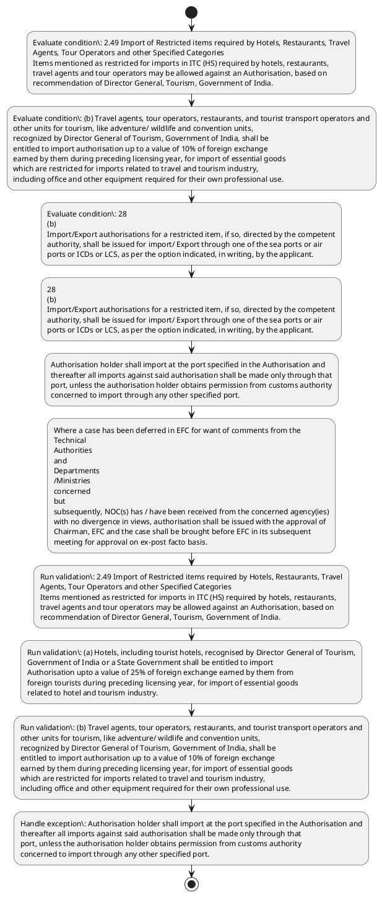

# Chapter 2 / Section 2.49: Import of Restricted items required by Hotels, Restaurants, Travel

**Chapter Title:** General Provisions Regarding Imports and Exports

**Pages:** 19, 20

**Purpose:** 2.49 Import of Restricted items required by Hotels, Restaurants, Travel
Agents, Tour Operators and other Specified Categories
Items mentioned as restricted for imports in ITC (HS) required by hotels, restaurants,
travel agents and tour operators may be allowed against an Authorisation, based on
recommendation of Director General, Tourism, Government of India.

**Purpose Thanglish:** Indha Import of Restricted items required by Hotels, Restaurants, Travel section-la, 2.49 import of Restricted items required by Hotels, Restaurants, Travel
Agents, Tour Operators and other Specified Categories
Items mentioned as restricted for imports in ITC (HS) required by hotels, restaurants,
travel agents and tour operators may be allowed against an Authorisation, based on
recommendation of Director General, Tourism, Government of India.

**Summary:** 2.49 Import of Restricted items required by Hotels, Restaurants, Travel
Agents, Tour Operators and other Specified Categories
Items mentioned as restricted for imports in ITC (HS) required by hotels, restaurants,
travel agents and tour operators may be allowed against an Authorisation, based on
recommendation of Director General, Tourism, Government of India. (a) Hotels, including tourist hotels, recognised by Director General of Tourism,
Government of India or a State Government shall be entitled to import
Authorisation upto a value of 25% of foreign exchange earned by them from
foreign tourists during preceding licensing year, for import of essential goods
related to hotel and tourism industry. (b) Travel agents, tour operators, restaurants, and tourist transport operators and
other units for tourism, like adventure/ wildlife and convention units,
recognized by Director General of Tourism, Government of India, shall be
entitled to import authorisation up to a value of 10% of foreign exchange
earned by them during preceding licensing year, for import of essential goods
which are restricted for imports related to travel and tourism industry,
including office and other equipment required for their own professional use.

**Business Meaning:** Import of Restricted items required by Hotels, Restaurants, Travel governs how DGFT business controls should be applied, validated, and enforced.

**Business Explanation:** Import of Restricted items required by Hotels, Restaurants, Travel explains the operating rule set that DEKAI should enforce. Key control points include (a) Hotels, including tourist hotels, recognised by Director General of Tourism,
Government of India or a State Government shall be entitled to import
Authorisation upto a value of 25% of foreign exchange earned by them from
foreign tourists during preceding licensing year, for import of essential goods
related to hotel and tourism industry. The section also drives actions such as 28
(b)
Import/Export authorisations for a restricted item, if so, directed by the competent
authority, shall be issued for import/ Export through one of the sea ports or air
ports or ICDs or LCS, as per the option indicated, in writing, by the applicant..

**Business Explanation Thanglish:** Indha Import of Restricted items required by Hotels, Restaurants, Travel section-la, import of Restricted items required by Hotels, Restaurants, Travel explains the operating rule set that DEKAI should enforce. Key control points include (a) Hotels, including tourist hotels, recognised by Director General of Tourism,
Government of India or a State Government kandippa be entitled to import
Authorisation upto a value of 25% of foreign exchange earned by them from
foreign tourists during preceding licensing year, for import of essential goods
related to hotel and tourism industry. The section also drives actions such as 28
(b)
import/export authorisations for a restricted item, if so, directed by the competent
authority, kandippa be issued for import/ export through one of the sea ports or air
ports or ICDs or LCS, as per the option indicated, in writing, by the applicant..

## Business Logic
- (a) Hotels, including tourist hotels, recognised by Director General of Tourism,
Government of India or a State Government shall be entitled to import
Authorisation upto a value of 25% of foreign exchange earned by them from
foreign tourists during preceding licensing year, for import of essential goods
related to hotel and tourism industry.
- (b) Travel agents, tour operators, restaurants, and tourist transport operators and
other units for tourism, like adventure/ wildlife and convention units,
recognized by Director General of Tourism, Government of India, shall be
entitled to import authorisation up to a value of 10% of foreign exchange
earned by them during preceding licensing year, for import of essential goods
which are restricted for imports related to travel and tourism industry,
including office and other equipment required for their own professional use.
- 28
(b)
Import/Export authorisations for a restricted item, if so, directed by the competent
authority, shall be issued for import/ Export through one of the sea ports or air
ports or ICDs or LCS, as per the option indicated, in writing, by the applicant.
- Authorisation holder shall import at the port specified in the Authorisation and
thereafter all imports against said authorisation shall be made only through that
port, unless the authorisation holder obtains permission from customs authority
concerned to import through any other specified port.
- (c)
EXIM Facilitation Committee (EFC) shall normally meet once every month.
- Where a case has been deferred in EFC for want of comments from the
Technical
Authorities
and
Departments
/Ministries
concerned
but
subsequently, NOC(s) has / have been received from the concerned agency(ies)
with no divergence in views, authorisation shall be issued with the approval of
Chairman, EFC and the case shall be brought before EFC in its subsequent
meeting for approval on ex-post facto basis.
- (a)
Hotels, including tourist hotels, recognised by Director General of Tourism,
Government of India or a State Government shall be entitled to import
Authorisation upto a value of 25% of foreign exchange earned by them from
foreign tourists during preceding licensing year, for import of essential goods
related to hotel and tourism industry.
- (b)
Travel agents, tour operators, restaurants, and tourist transport operators and
other units for tourism, like adventure/ wildlife and convention units,
recognized by Director General of Tourism, Government of India, shall be
entitled to import authorisation up to a value of 10% of foreign exchange
earned by them during preceding licensing year, for import of essential goods
which are restricted for imports related to travel and tourism industry,
including office and other equipment required for their own professional use.
- However, re-export shall be subject to all conditionality, or
requirement of licence, or permission, as may be required under Schedule II of
ITC (HS).

## Business Rules
- rule_id=CH2-SEC2_49-R001, rule_description=(a) Hotels, including tourist hotels, recognised by Director General of Tourism,
Government of India or a State Government shall be entitled to import
Authorisation upto a value of 25% of foreign exchange earned by them from
foreign tourists during preceding licensing year, for import of essential goods
related to hotel and tourism industry., trigger=Import of Restricted items required by Hotels, Restaurants, Travel, condition=2.49 Import of Restricted items required by Hotels, Restaurants, Travel
Agents, Tour Operators and other Specified Categories
Items mentioned as restricted for imports in ITC (HS) required by hotels, restaurants,
travel agents and tour operators may be allowed against an Authorisation, based on
recommendation of Director General, Tourism, Government of India., validation=2.49 Import of Restricted items required by Hotels, Restaurants, Travel
Agents, Tour Operators and other Specified Categories
Items mentioned as restricted for imports in ITC (HS) required by hotels, restaurants,
travel agents and tour operators may be allowed against an Authorisation, based on
recommendation of Director General, Tourism, Government of India., action=28
(b)
Import/Export authorisations for a restricted item, if so, directed by the competent
authority, shall be issued for import/ Export through one of the sea ports or air
ports or ICDs or LCS, as per the option indicated, in writing, by the applicant., exception=Authorisation holder shall import at the port specified in the Authorisation and
thereafter all imports against said authorisation shall be made only through that
port, unless the authorisation holder obtains permission from customs authority
concerned to import through any other specified port., output=DEKAI should produce a compliance decision for 2.49 - Import of Restricted items required by Hotels, Restaurants, Travel.
- rule_id=CH2-SEC2_49-R002, rule_description=(b) Travel agents, tour operators, restaurants, and tourist transport operators and
other units for tourism, like adventure/ wildlife and convention units,
recognized by Director General of Tourism, Government of India, shall be
entitled to import authorisation up to a value of 10% of foreign exchange
earned by them during preceding licensing year, for import of essential goods
which are restricted for imports related to travel and tourism industry,
including office and other equipment required for their own professional use., trigger=Import of Restricted items required by Hotels, Restaurants, Travel, condition=(b) Travel agents, tour operators, restaurants, and tourist transport operators and
other units for tourism, like adventure/ wildlife and convention units,
recognized by Director General of Tourism, Government of India, shall be
entitled to import authorisation up to a value of 10% of foreign exchange
earned by them during preceding licensing year, for import of essential goods
which are restricted for imports related to travel and tourism industry,
including office and other equipment required for their own professional use., validation=(a) Hotels, including tourist hotels, recognised by Director General of Tourism,
Government of India or a State Government shall be entitled to import
Authorisation upto a value of 25% of foreign exchange earned by them from
foreign tourists during preceding licensing year, for import of essential goods
related to hotel and tourism industry., action=Authorisation holder shall import at the port specified in the Authorisation and
thereafter all imports against said authorisation shall be made only through that
port, unless the authorisation holder obtains permission from customs authority
concerned to import through any other specified port., exception=Where a case has been deferred in EFC for want of comments from the
Technical
Authorities
and
Departments
/Ministries
concerned
but
subsequently, NOC(s) has / have been received from the concerned agency(ies)
with no divergence in views, authorisation shall be issued with the approval of
Chairman, EFC and the case shall be brought before EFC in its subsequent
meeting for approval on ex-post facto basis., output=DEKAI should produce a compliance decision for 2.49 - Import of Restricted items required by Hotels, Restaurants, Travel.
- rule_id=CH2-SEC2_49-R003, rule_description=28
(b)
Import/Export authorisations for a restricted item, if so, directed by the competent
authority, shall be issued for import/ Export through one of the sea ports or air
ports or ICDs or LCS, as per the option indicated, in writing, by the applicant., trigger=Import of Restricted items required by Hotels, Restaurants, Travel, condition=so, validation=(b) Travel agents, tour operators, restaurants, and tourist transport operators and
other units for tourism, like adventure/ wildlife and convention units,
recognized by Director General of Tourism, Government of India, shall be
entitled to import authorisation up to a value of 10% of foreign exchange
earned by them during preceding licensing year, for import of essential goods
which are restricted for imports related to travel and tourism industry,
including office and other equipment required for their own professional use., action=Where a case has been deferred in EFC for want of comments from the
Technical
Authorities
and
Departments
/Ministries
concerned
but
subsequently, NOC(s) has / have been received from the concerned agency(ies)
with no divergence in views, authorisation shall be issued with the approval of
Chairman, EFC and the case shall be brought before EFC in its subsequent
meeting for approval on ex-post facto basis., exception=However, re-export shall be subject to all conditionality, or
requirement of licence, or permission, as may be required under Schedule II of
ITC (HS)., output=DEKAI should produce a compliance decision for 2.49 - Import of Restricted items required by Hotels, Restaurants, Travel.
- rule_id=CH2-SEC2_49-R004, rule_description=Authorisation holder shall import at the port specified in the Authorisation and
thereafter all imports against said authorisation shall be made only through that
port, unless the authorisation holder obtains permission from customs authority
concerned to import through any other specified port., trigger=Import of Restricted items required by Hotels, Restaurants, Travel, condition=Authorisation holder shall import at the port specified in the Authorisation and
thereafter all imports against said authorisation shall be made only through that
port, unless the authorisation holder obtains permission from customs authority
concerned to import through any other specified port., validation=28
(b)
Import/Export authorisations for a restricted item, if so, directed by the competent
authority, shall be issued for import/ Export through one of the sea ports or air
ports or ICDs or LCS, as per the option indicated, in writing, by the applicant., action=Where a case has been deferred in EFC for want of comments from the
Technical
Authorities
and
Departments
/Ministries
concerned
but
subsequently, NOC(s) has / have been received from the concerned agency(ies)
with no divergence in views, authorisation shall be issued with the approval of
Chairman, EFC and the case shall be brought before EFC in its subsequent
meeting for approval on ex-post facto basis., exception=However, re-export shall be subject to all conditionality, or
requirement of licence, or permission, as may be required under Schedule II of
ITC (HS)., output=DEKAI should produce a compliance decision for 2.49 - Import of Restricted items required by Hotels, Restaurants, Travel.
- rule_id=CH2-SEC2_49-R005, rule_description=(c)
EXIM Facilitation Committee (EFC) shall normally meet once every month., trigger=Import of Restricted items required by Hotels, Restaurants, Travel, condition=Where a case has been deferred in EFC for want of comments from the
Technical
Authorities
and
Departments
/Ministries
concerned
but
subsequently, NOC(s) has / have been received from the concerned agency(ies)
with no divergence in views, authorisation shall be issued with the approval of
Chairman, EFC and the case shall be brought before EFC in its subsequent
meeting for approval on ex-post facto basis., validation=Authorisation holder shall import at the port specified in the Authorisation and
thereafter all imports against said authorisation shall be made only through that
port, unless the authorisation holder obtains permission from customs authority
concerned to import through any other specified port., action=Where a case has been deferred in EFC for want of comments from the
Technical
Authorities
and
Departments
/Ministries
concerned
but
subsequently, NOC(s) has / have been received from the concerned agency(ies)
with no divergence in views, authorisation shall be issued with the approval of
Chairman, EFC and the case shall be brought before EFC in its subsequent
meeting for approval on ex-post facto basis., exception=However, re-export shall be subject to all conditionality, or
requirement of licence, or permission, as may be required under Schedule II of
ITC (HS)., output=DEKAI should produce a compliance decision for 2.49 - Import of Restricted items required by Hotels, Restaurants, Travel.
- rule_id=CH2-SEC2_49-R006, rule_description=Where a case has been deferred in EFC for want of comments from the
Technical
Authorities
and
Departments
/Ministries
concerned
but
subsequently, NOC(s) has / have been received from the concerned agency(ies)
with no divergence in views, authorisation shall be issued with the approval of
Chairman, EFC and the case shall be brought before EFC in its subsequent
meeting for approval on ex-post facto basis., trigger=Import of Restricted items required by Hotels, Restaurants, Travel, condition=(b)
Travel agents, tour operators, restaurants, and tourist transport operators and
other units for tourism, like adventure/ wildlife and convention units,
recognized by Director General of Tourism, Government of India, shall be
entitled to import authorisation up to a value of 10% of foreign exchange
earned by them during preceding licensing year, for import of essential goods
which are restricted for imports related to travel and tourism industry,
including office and other equipment required for their own professional use., validation=(c)
EXIM Facilitation Committee (EFC) shall normally meet once every month., action=Where a case has been deferred in EFC for want of comments from the
Technical
Authorities
and
Departments
/Ministries
concerned
but
subsequently, NOC(s) has / have been received from the concerned agency(ies)
with no divergence in views, authorisation shall be issued with the approval of
Chairman, EFC and the case shall be brought before EFC in its subsequent
meeting for approval on ex-post facto basis., exception=However, re-export shall be subject to all conditionality, or
requirement of licence, or permission, as may be required under Schedule II of
ITC (HS)., output=DEKAI should produce a compliance decision for 2.49 - Import of Restricted items required by Hotels, Restaurants, Travel.
- rule_id=CH2-SEC2_49-R007, rule_description=(a)
Hotels, including tourist hotels, recognised by Director General of Tourism,
Government of India or a State Government shall be entitled to import
Authorisation upto a value of 25% of foreign exchange earned by them from
foreign tourists during preceding licensing year, for import of essential goods
related to hotel and tourism industry., trigger=Import of Restricted items required by Hotels, Restaurants, Travel, condition=28
(d) Such imported goods may be transferred after 2 years with permission of DGFT., validation=Where a case has been deferred in EFC for want of comments from the
Technical
Authorities
and
Departments
/Ministries
concerned
but
subsequently, NOC(s) has / have been received from the concerned agency(ies)
with no divergence in views, authorisation shall be issued with the approval of
Chairman, EFC and the case shall be brought before EFC in its subsequent
meeting for approval on ex-post facto basis., action=Where a case has been deferred in EFC for want of comments from the
Technical
Authorities
and
Departments
/Ministries
concerned
but
subsequently, NOC(s) has / have been received from the concerned agency(ies)
with no divergence in views, authorisation shall be issued with the approval of
Chairman, EFC and the case shall be brought before EFC in its subsequent
meeting for approval on ex-post facto basis., exception=However, re-export shall be subject to all conditionality, or
requirement of licence, or permission, as may be required under Schedule II of
ITC (HS)., output=DEKAI should produce a compliance decision for 2.49 - Import of Restricted items required by Hotels, Restaurants, Travel.
- rule_id=CH2-SEC2_49-R008, rule_description=(b)
Travel agents, tour operators, restaurants, and tourist transport operators and
other units for tourism, like adventure/ wildlife and convention units,
recognized by Director General of Tourism, Government of India, shall be
entitled to import authorisation up to a value of 10% of foreign exchange
earned by them during preceding licensing year, for import of essential goods
which are restricted for imports related to travel and tourism industry,
including office and other equipment required for their own professional use., trigger=Import of Restricted items required by Hotels, Restaurants, Travel, condition=No permission for transfer will be required in case the imported goods are re-
exported., validation=(a)
Hotels, including tourist hotels, recognised by Director General of Tourism,
Government of India or a State Government shall be entitled to import
Authorisation upto a value of 25% of foreign exchange earned by them from
foreign tourists during preceding licensing year, for import of essential goods
related to hotel and tourism industry., action=Where a case has been deferred in EFC for want of comments from the
Technical
Authorities
and
Departments
/Ministries
concerned
but
subsequently, NOC(s) has / have been received from the concerned agency(ies)
with no divergence in views, authorisation shall be issued with the approval of
Chairman, EFC and the case shall be brought before EFC in its subsequent
meeting for approval on ex-post facto basis., exception=However, re-export shall be subject to all conditionality, or
requirement of licence, or permission, as may be required under Schedule II of
ITC (HS)., output=DEKAI should produce a compliance decision for 2.49 - Import of Restricted items required by Hotels, Restaurants, Travel.
- rule_id=CH2-SEC2_49-R009, rule_description=However, re-export shall be subject to all conditionality, or
requirement of licence, or permission, as may be required under Schedule II of
ITC (HS)., trigger=Import of Restricted items required by Hotels, Restaurants, Travel, condition=However, re-export shall be subject to all conditionality, or
requirement of licence, or permission, as may be required under Schedule II of
ITC (HS)., validation=(b)
Travel agents, tour operators, restaurants, and tourist transport operators and
other units for tourism, like adventure/ wildlife and convention units,
recognized by Director General of Tourism, Government of India, shall be
entitled to import authorisation up to a value of 10% of foreign exchange
earned by them during preceding licensing year, for import of essential goods
which are restricted for imports related to travel and tourism industry,
including office and other equipment required for their own professional use., action=Where a case has been deferred in EFC for want of comments from the
Technical
Authorities
and
Departments
/Ministries
concerned
but
subsequently, NOC(s) has / have been received from the concerned agency(ies)
with no divergence in views, authorisation shall be issued with the approval of
Chairman, EFC and the case shall be brought before EFC in its subsequent
meeting for approval on ex-post facto basis., exception=However, re-export shall be subject to all conditionality, or
requirement of licence, or permission, as may be required under Schedule II of
ITC (HS)., output=DEKAI should produce a compliance decision for 2.49 - Import of Restricted items required by Hotels, Restaurants, Travel.

## Conditions
- 2.49 Import of Restricted items required by Hotels, Restaurants, Travel
Agents, Tour Operators and other Specified Categories
Items mentioned as restricted for imports in ITC (HS) required by hotels, restaurants,
travel agents and tour operators may be allowed against an Authorisation, based on
recommendation of Director General, Tourism, Government of India.
- (b) Travel agents, tour operators, restaurants, and tourist transport operators and
other units for tourism, like adventure/ wildlife and convention units,
recognized by Director General of Tourism, Government of India, shall be
entitled to import authorisation up to a value of 10% of foreign exchange
earned by them during preceding licensing year, for import of essential goods
which are restricted for imports related to travel and tourism industry,
including office and other equipment required for their own professional use.
- 28
(b)
Import/Export authorisations for a restricted item, if so, directed by the competent
authority, shall be issued for import/ Export through one of the sea ports or air
ports or ICDs or LCS, as per the option indicated, in writing, by the applicant.
- Authorisation holder shall import at the port specified in the Authorisation and
thereafter all imports against said authorisation shall be made only through that
port, unless the authorisation holder obtains permission from customs authority
concerned to import through any other specified port.
- Where a case has been deferred in EFC for want of comments from the
Technical
Authorities
and
Departments
/Ministries
concerned
but
subsequently, NOC(s) has / have been received from the concerned agency(ies)
with no divergence in views, authorisation shall be issued with the approval of
Chairman, EFC and the case shall be brought before EFC in its subsequent
meeting for approval on ex-post facto basis.
- (b)
Travel agents, tour operators, restaurants, and tourist transport operators and
other units for tourism, like adventure/ wildlife and convention units,
recognized by Director General of Tourism, Government of India, shall be
entitled to import authorisation up to a value of 10% of foreign exchange
earned by them during preceding licensing year, for import of essential goods
which are restricted for imports related to travel and tourism industry,
including office and other equipment required for their own professional use.
- 28
(d) Such imported goods may be transferred after 2 years with permission of DGFT.
- No permission for transfer will be required in case the imported goods are re-
exported.
- However, re-export shall be subject to all conditionality, or
requirement of licence, or permission, as may be required under Schedule II of
ITC (HS).

## Condition Logic
- id=2.2.49.1, if=2.49 Import of Restricted items required by Hotels, Restaurants, Travel
Agents, Tour Operators and other Specified Categories
Items mentioned as restricted for imports in ITC (HS) required by hotels, restaurants,
travel agents and tour operators may be allowed against an Authorisation, based on
recommendation of Director General, Tourism, Government of India., then=28
(b)
Import/Export authorisations for a restricted item, if so, directed by the competent
authority, shall be issued for import/ Export through one of the sea ports or air
ports or ICDs or LCS, as per the option indicated, in writing, by the applicant., source=2.49 Import of Restricted items required by Hotels, Restaurants, Travel
Agents, Tour Operators and other Specified Categories
Items mentioned as restricted for imports in ITC (HS) required by hotels, restaurants,
travel agents and tour operators may be allowed against an Authorisation, based on
recommendation of Director General, Tourism, Government of India.
- id=2.2.49.2, if=(b) Travel agents, tour operators, restaurants, and tourist transport operators and
other units for tourism, like adventure/ wildlife and convention units,
recognized by Director General of Tourism, Government of India, shall be
entitled to import authorisation up to a value of 10% of foreign exchange
earned by them during preceding licensing year, for import of essential goods
which are restricted for imports related to travel and tourism industry,
including office and other equipment required for their own professional use., then=28
(b)
Import/Export authorisations for a restricted item, if so, directed by the competent
authority, shall be issued for import/ Export through one of the sea ports or air
ports or ICDs or LCS, as per the option indicated, in writing, by the applicant., source=(b) Travel agents, tour operators, restaurants, and tourist transport operators and
other units for tourism, like adventure/ wildlife and convention units,
recognized by Director General of Tourism, Government of India, shall be
entitled to import authorisation up to a value of 10% of foreign exchange
earned by them during preceding licensing year, for import of essential goods
which are restricted for imports related to travel and tourism industry,
including office and other equipment required for their own professional use.
- id=2.2.49.3, if=so, then=28
(b)
Import/Export authorisations for a restricted item, if so, directed by the competent
authority, shall be issued for import/ Export through one of the sea ports or air
ports or ICDs or LCS, as per the option indicated, in writing, by the applicant., source=28
(b)
Import/Export authorisations for a restricted item, if so, directed by the competent
authority, shall be issued for import/ Export through one of the sea ports or air
ports or ICDs or LCS, as per the option indicated, in writing, by the applicant.
- id=2.2.49.4, if=Authorisation holder shall import at the port specified in the Authorisation and
thereafter all imports against said authorisation shall be made only through that
port, unless the authorisation holder obtains permission from customs authority
concerned to import through any other specified port., then=28
(b)
Import/Export authorisations for a restricted item, if so, directed by the competent
authority, shall be issued for import/ Export through one of the sea ports or air
ports or ICDs or LCS, as per the option indicated, in writing, by the applicant., source=Authorisation holder shall import at the port specified in the Authorisation and
thereafter all imports against said authorisation shall be made only through that
port, unless the authorisation holder obtains permission from customs authority
concerned to import through any other specified port.
- id=2.2.49.5, if=Where a case has been deferred in EFC for want of comments from the
Technical
Authorities
and
Departments
/Ministries
concerned
but
subsequently, NOC(s) has / have been received from the concerned agency(ies)
with no divergence in views, authorisation shall be issued with the approval of
Chairman, EFC and the case shall be brought before EFC in its subsequent
meeting for approval on ex-post facto basis., then=28
(b)
Import/Export authorisations for a restricted item, if so, directed by the competent
authority, shall be issued for import/ Export through one of the sea ports or air
ports or ICDs or LCS, as per the option indicated, in writing, by the applicant., source=Where a case has been deferred in EFC for want of comments from the
Technical
Authorities
and
Departments
/Ministries
concerned
but
subsequently, NOC(s) has / have been received from the concerned agency(ies)
with no divergence in views, authorisation shall be issued with the approval of
Chairman, EFC and the case shall be brought before EFC in its subsequent
meeting for approval on ex-post facto basis.
- id=2.2.49.6, if=(b)
Travel agents, tour operators, restaurants, and tourist transport operators and
other units for tourism, like adventure/ wildlife and convention units,
recognized by Director General of Tourism, Government of India, shall be
entitled to import authorisation up to a value of 10% of foreign exchange
earned by them during preceding licensing year, for import of essential goods
which are restricted for imports related to travel and tourism industry,
including office and other equipment required for their own professional use., then=28
(b)
Import/Export authorisations for a restricted item, if so, directed by the competent
authority, shall be issued for import/ Export through one of the sea ports or air
ports or ICDs or LCS, as per the option indicated, in writing, by the applicant., source=(b)
Travel agents, tour operators, restaurants, and tourist transport operators and
other units for tourism, like adventure/ wildlife and convention units,
recognized by Director General of Tourism, Government of India, shall be
entitled to import authorisation up to a value of 10% of foreign exchange
earned by them during preceding licensing year, for import of essential goods
which are restricted for imports related to travel and tourism industry,
including office and other equipment required for their own professional use.
- id=2.2.49.7, if=28
(d) Such imported goods may be transferred after 2 years with permission of DGFT., then=28
(b)
Import/Export authorisations for a restricted item, if so, directed by the competent
authority, shall be issued for import/ Export through one of the sea ports or air
ports or ICDs or LCS, as per the option indicated, in writing, by the applicant., source=28
(d) Such imported goods may be transferred after 2 years with permission of DGFT.
- id=2.2.49.8, if=No permission for transfer will be required in case the imported goods are re-
exported., then=28
(b)
Import/Export authorisations for a restricted item, if so, directed by the competent
authority, shall be issued for import/ Export through one of the sea ports or air
ports or ICDs or LCS, as per the option indicated, in writing, by the applicant., source=No permission for transfer will be required in case the imported goods are re-
exported.
- id=2.2.49.9, if=However, re-export shall be subject to all conditionality, or
requirement of licence, or permission, as may be required under Schedule II of
ITC (HS)., then=28
(b)
Import/Export authorisations for a restricted item, if so, directed by the competent
authority, shall be issued for import/ Export through one of the sea ports or air
ports or ICDs or LCS, as per the option indicated, in writing, by the applicant., source=However, re-export shall be subject to all conditionality, or
requirement of licence, or permission, as may be required under Schedule II of
ITC (HS).

## Validations
- 2.49 Import of Restricted items required by Hotels, Restaurants, Travel
Agents, Tour Operators and other Specified Categories
Items mentioned as restricted for imports in ITC (HS) required by hotels, restaurants,
travel agents and tour operators may be allowed against an Authorisation, based on
recommendation of Director General, Tourism, Government of India.
- (a) Hotels, including tourist hotels, recognised by Director General of Tourism,
Government of India or a State Government shall be entitled to import
Authorisation upto a value of 25% of foreign exchange earned by them from
foreign tourists during preceding licensing year, for import of essential goods
related to hotel and tourism industry.
- (b) Travel agents, tour operators, restaurants, and tourist transport operators and
other units for tourism, like adventure/ wildlife and convention units,
recognized by Director General of Tourism, Government of India, shall be
entitled to import authorisation up to a value of 10% of foreign exchange
earned by them during preceding licensing year, for import of essential goods
which are restricted for imports related to travel and tourism industry,
including office and other equipment required for their own professional use.
- 28
(b)
Import/Export authorisations for a restricted item, if so, directed by the competent
authority, shall be issued for import/ Export through one of the sea ports or air
ports or ICDs or LCS, as per the option indicated, in writing, by the applicant.
- Authorisation holder shall import at the port specified in the Authorisation and
thereafter all imports against said authorisation shall be made only through that
port, unless the authorisation holder obtains permission from customs authority
concerned to import through any other specified port.
- (c)
EXIM Facilitation Committee (EFC) shall normally meet once every month.
- Where a case has been deferred in EFC for want of comments from the
Technical
Authorities
and
Departments
/Ministries
concerned
but
subsequently, NOC(s) has / have been received from the concerned agency(ies)
with no divergence in views, authorisation shall be issued with the approval of
Chairman, EFC and the case shall be brought before EFC in its subsequent
meeting for approval on ex-post facto basis.
- (a)
Hotels, including tourist hotels, recognised by Director General of Tourism,
Government of India or a State Government shall be entitled to import
Authorisation upto a value of 25% of foreign exchange earned by them from
foreign tourists during preceding licensing year, for import of essential goods
related to hotel and tourism industry.
- (b)
Travel agents, tour operators, restaurants, and tourist transport operators and
other units for tourism, like adventure/ wildlife and convention units,
recognized by Director General of Tourism, Government of India, shall be
entitled to import authorisation up to a value of 10% of foreign exchange
earned by them during preceding licensing year, for import of essential goods
which are restricted for imports related to travel and tourism industry,
including office and other equipment required for their own professional use.
- No permission for transfer will be required in case the imported goods are re-
exported.
- However, re-export shall be subject to all conditionality, or
requirement of licence, or permission, as may be required under Schedule II of
ITC (HS).

## Exceptions
- Authorisation holder shall import at the port specified in the Authorisation and
thereafter all imports against said authorisation shall be made only through that
port, unless the authorisation holder obtains permission from customs authority
concerned to import through any other specified port.
- Where a case has been deferred in EFC for want of comments from the
Technical
Authorities
and
Departments
/Ministries
concerned
but
subsequently, NOC(s) has / have been received from the concerned agency(ies)
with no divergence in views, authorisation shall be issued with the approval of
Chairman, EFC and the case shall be brought before EFC in its subsequent
meeting for approval on ex-post facto basis.
- However, re-export shall be subject to all conditionality, or
requirement of licence, or permission, as may be required under Schedule II of
ITC (HS).

## Dependencies
- 1

## Authorities
- State Government
- Government of India or a State Government
- customs
- customs authority
- EXIM Facilitation Committee
- DGFT

## Required Documents
- However, re-export shall be subject to all conditionality, or
requirement of licence, or permission, as may be required under Schedule II of
ITC (HS).
- (e) An application for grant of an Authorisation under paragraphs 2.49 (a) and 2.49
(b) may be made in ANF 2M to DGFT Hqrs through Director of Tourism,
Government of India.

## Timelines
- (c) Import entitlement under paragraphs 2.49 (a) and 2.49 (b) of any one licensing
year can be carried forward, either in full or in part, and added to import
entitlement of two succeeding licensing years.
- Authorisation holder shall import at the port specified in the Authorisation and
thereafter all imports against said authorisation shall be made only through that
port, unless the authorisation holder obtains permission from customs authority
concerned to import through any other specified port.
- Where a case has been deferred in EFC for want of comments from the
Technical
Authorities
and
Departments
/Ministries
concerned
but
subsequently, NOC(s) has / have been received from the concerned agency(ies)
with no divergence in views, authorisation shall be issued with the approval of
Chairman, EFC and the case shall be brought before EFC in its subsequent
meeting for approval on ex-post facto basis.
- (c)
Import entitlement under paragraphs 2.49 (a) and 2.49 (b) of any one licensing
year can be carried forward, either in full or in part, and added to import
entitlement of two succeeding licensing years.
- 28
(d) Such imported goods may be transferred after 2 years with permission of DGFT.

## Actions
- 28
(b)
Import/Export authorisations for a restricted item, if so, directed by the competent
authority, shall be issued for import/ Export through one of the sea ports or air
ports or ICDs or LCS, as per the option indicated, in writing, by the applicant.
- Authorisation holder shall import at the port specified in the Authorisation and
thereafter all imports against said authorisation shall be made only through that
port, unless the authorisation holder obtains permission from customs authority
concerned to import through any other specified port.
- Where a case has been deferred in EFC for want of comments from the
Technical
Authorities
and
Departments
/Ministries
concerned
but
subsequently, NOC(s) has / have been received from the concerned agency(ies)
with no divergence in views, authorisation shall be issued with the approval of
Chairman, EFC and the case shall be brought before EFC in its subsequent
meeting for approval on ex-post facto basis.

## Workflow
- Evaluate condition: 2.49 Import of Restricted items required by Hotels, Restaurants, Travel
Agents, Tour Operators and other Specified Categories
Items mentioned as restricted for imports in ITC (HS) required by hotels, restaurants,
travel agents and tour operators may be allowed against an Authorisation, based on
recommendation of Director General, Tourism, Government of India.
- Evaluate condition: (b) Travel agents, tour operators, restaurants, and tourist transport operators and
other units for tourism, like adventure/ wildlife and convention units,
recognized by Director General of Tourism, Government of India, shall be
entitled to import authorisation up to a value of 10% of foreign exchange
earned by them during preceding licensing year, for import of essential goods
which are restricted for imports related to travel and tourism industry,
including office and other equipment required for their own professional use.
- Evaluate condition: 28
(b)
Import/Export authorisations for a restricted item, if so, directed by the competent
authority, shall be issued for import/ Export through one of the sea ports or air
ports or ICDs or LCS, as per the option indicated, in writing, by the applicant.
- 28
(b)
Import/Export authorisations for a restricted item, if so, directed by the competent
authority, shall be issued for import/ Export through one of the sea ports or air
ports or ICDs or LCS, as per the option indicated, in writing, by the applicant.
- Authorisation holder shall import at the port specified in the Authorisation and
thereafter all imports against said authorisation shall be made only through that
port, unless the authorisation holder obtains permission from customs authority
concerned to import through any other specified port.
- Where a case has been deferred in EFC for want of comments from the
Technical
Authorities
and
Departments
/Ministries
concerned
but
subsequently, NOC(s) has / have been received from the concerned agency(ies)
with no divergence in views, authorisation shall be issued with the approval of
Chairman, EFC and the case shall be brought before EFC in its subsequent
meeting for approval on ex-post facto basis.
- Run validation: 2.49 Import of Restricted items required by Hotels, Restaurants, Travel
Agents, Tour Operators and other Specified Categories
Items mentioned as restricted for imports in ITC (HS) required by hotels, restaurants,
travel agents and tour operators may be allowed against an Authorisation, based on
recommendation of Director General, Tourism, Government of India.
- Run validation: (a) Hotels, including tourist hotels, recognised by Director General of Tourism,
Government of India or a State Government shall be entitled to import
Authorisation upto a value of 25% of foreign exchange earned by them from
foreign tourists during preceding licensing year, for import of essential goods
related to hotel and tourism industry.
- Run validation: (b) Travel agents, tour operators, restaurants, and tourist transport operators and
other units for tourism, like adventure/ wildlife and convention units,
recognized by Director General of Tourism, Government of India, shall be
entitled to import authorisation up to a value of 10% of foreign exchange
earned by them during preceding licensing year, for import of essential goods
which are restricted for imports related to travel and tourism industry,
including office and other equipment required for their own professional use.
- Handle exception: Authorisation holder shall import at the port specified in the Authorisation and
thereafter all imports against said authorisation shall be made only through that
port, unless the authorisation holder obtains permission from customs authority
concerned to import through any other specified port.

## Workflow ASCII
```text
Import of Restricted items required by Hotels, Restaurants, Travel
Evaluate condition: 2.49 Import of Restricted items required by Hotels, Restaurants, Travel
Agents, Tour Operators and other Specified Categories
Items mentioned as restricted for imports in ITC (HS) required by hotels, restaurants,
travel agents and tour operators may be allowed against an Authorisation, based on
recommendation of Director General, Tourism, Government of India.
   |
   v
Evaluate condition: (b) Travel agents, tour operators, restaurants, and tourist transport operators and
other units for tourism, like adventure/ wildlife and convention units,
recognized by Director General of Tourism, Government of India, shall be
entitled to import authorisation up to a value of 10% of foreign exchange
earned by them during preceding licensing year, for import of essential goods
which are restricted for imports related to travel and tourism industry,
including office and other equipment required for their own professional use.
   |
   v
Evaluate condition: 28
(b)
Import/Export authorisations for a restricted item, if so, directed by the competent
authority, shall be issued for import/ Export through one of the sea ports or air
ports or ICDs or LCS, as per the option indicated, in writing, by the applicant.
   |
   v
28
(b)
Import/Export authorisations for a restricted item, if so, directed by the competent
authority, shall be issued for import/ Export through one of the sea ports or air
ports or ICDs or LCS, as per the option indicated, in writing, by the applicant.
   |
   v
Authorisation holder shall import at the port specified in the Authorisation and
thereafter all imports against said authorisation shall be made only through that
port, unless the authorisation holder obtains permission from customs authority
concerned to import through any other specified port.
   |
   v
Where a case has been deferred in EFC for want of comments from the
Technical
Authorities
and
Departments
/Ministries
concerned
but
subsequently, NOC(s) has / have been received from the concerned agency(ies)
with no divergence in views, authorisation shall be issued with the approval of
Chairman, EFC and the case shall be brought before EFC in its subsequent
meeting for approval on ex-post facto basis.
   |
   v
Run validation: 2.49 Import of Restricted items required by Hotels, Restaurants, Travel
Agents, Tour Operators and other Specified Categories
Items mentioned as restricted for imports in ITC (HS) required by hotels, restaurants,
travel agents and tour operators may be allowed against an Authorisation, based on
recommendation of Director General, Tourism, Government of India.
   |
   v
Run validation: (a) Hotels, including tourist hotels, recognised by Director General of Tourism,
Government of India or a State Government shall be entitled to import
Authorisation upto a value of 25% of foreign exchange earned by them from
foreign tourists during preceding licensing year, for import of essential goods
related to hotel and tourism industry.
   |
   v
Run validation: (b) Travel agents, tour operators, restaurants, and tourist transport operators and
other units for tourism, like adventure/ wildlife and convention units,
recognized by Director General of Tourism, Government of India, shall be
entitled to import authorisation up to a value of 10% of foreign exchange
earned by them during preceding licensing year, for import of essential goods
which are restricted for imports related to travel and tourism industry,
including office and other equipment required for their own professional use.
   |
   v
Handle exception: Authorisation holder shall import at the port specified in the Authorisation and
thereafter all imports against said authorisation shall be made only through that
port, unless the authorisation holder obtains permission from customs authority
concerned to import through any other specified port.
```

## Decision Tree
- IF 2.49 Import of Restricted items required by Hotels, Restaurants, Travel
Agents, Tour Operators and other Specified Categories
Items mentioned as restricted for imports in ITC (HS) required by hotels, restaurants,
travel agents and tour operators may be allowed against an Authorisation, based on
recommendation of Director General, Tourism, Government of India. THEN 28
(b)
Import/Export authorisations for a restricted item, if so, directed by the competent
authority, shall be issued for import/ Export through one of the sea ports or air
ports or ICDs or LCS, as per the option indicated, in writing, by the applicant.
- IF (b) Travel agents, tour operators, restaurants, and tourist transport operators and
other units for tourism, like adventure/ wildlife and convention units,
recognized by Director General of Tourism, Government of India, shall be
entitled to import authorisation up to a value of 10% of foreign exchange
earned by them during preceding licensing year, for import of essential goods
which are restricted for imports related to travel and tourism industry,
including office and other equipment required for their own professional use. THEN 28
(b)
Import/Export authorisations for a restricted item, if so, directed by the competent
authority, shall be issued for import/ Export through one of the sea ports or air
ports or ICDs or LCS, as per the option indicated, in writing, by the applicant.
- IF 28
(b)
Import/Export authorisations for a restricted item, if so, directed by the competent
authority, shall be issued for import/ Export through one of the sea ports or air
ports or ICDs or LCS, as per the option indicated, in writing, by the applicant. THEN 28
(b)
Import/Export authorisations for a restricted item, if so, directed by the competent
authority, shall be issued for import/ Export through one of the sea ports or air
ports or ICDs or LCS, as per the option indicated, in writing, by the applicant.
- IF Authorisation holder shall import at the port specified in the Authorisation and
thereafter all imports against said authorisation shall be made only through that
port, unless the authorisation holder obtains permission from customs authority
concerned to import through any other specified port. THEN 28
(b)
Import/Export authorisations for a restricted item, if so, directed by the competent
authority, shall be issued for import/ Export through one of the sea ports or air
ports or ICDs or LCS, as per the option indicated, in writing, by the applicant.
- IF Where a case has been deferred in EFC for want of comments from the
Technical
Authorities
and
Departments
/Ministries
concerned
but
subsequently, NOC(s) has / have been received from the concerned agency(ies)
with no divergence in views, authorisation shall be issued with the approval of
Chairman, EFC and the case shall be brought before EFC in its subsequent
meeting for approval on ex-post facto basis. THEN 28
(b)
Import/Export authorisations for a restricted item, if so, directed by the competent
authority, shall be issued for import/ Export through one of the sea ports or air
ports or ICDs or LCS, as per the option indicated, in writing, by the applicant.
- IF exception applies (Authorisation holder shall import at the port specified in the Authorisation and
thereafter all imports against said authorisation shall be made only through that
port, unless the authorisation holder obtains permission from customs authority
concerned to import through any other specified port.) THEN route to manual review
- IF exception applies (Where a case has been deferred in EFC for want of comments from the
Technical
Authorities
and
Departments
/Ministries
concerned
but
subsequently, NOC(s) has / have been received from the concerned agency(ies)
with no divergence in views, authorisation shall be issued with the approval of
Chairman, EFC and the case shall be brought before EFC in its subsequent
meeting for approval on ex-post facto basis.) THEN route to manual review
- IF exception applies (However, re-export shall be subject to all conditionality, or
requirement of licence, or permission, as may be required under Schedule II of
ITC (HS).) THEN route to manual review

## Decision Tree ASCII
```text
Import of Restricted items required by Hotels, Restaurants, Travel Decision
IF 2.49 Import of Restricted items required by Hotels, Restaurants, Travel
Agents, Tour Operators and other Specified Categories
Items mentioned as restricted for imports in ITC (HS) required by hotels, restaurants,
travel agents and tour operators may be allowed against an Authorisation, based on
recommendation of Director General, Tourism, Government of India. THEN 28
(b)
Import/Export authorisations for a restricted item, if so, directed by the competent
authority, shall be issued for import/ Export through one of the sea ports or air
ports or ICDs or LCS, as per the option indicated, in writing, by the applicant.
   |
   v
IF (b) Travel agents, tour operators, restaurants, and tourist transport operators and
other units for tourism, like adventure/ wildlife and convention units,
recognized by Director General of Tourism, Government of India, shall be
entitled to import authorisation up to a value of 10% of foreign exchange
earned by them during preceding licensing year, for import of essential goods
which are restricted for imports related to travel and tourism industry,
including office and other equipment required for their own professional use. THEN 28
(b)
Import/Export authorisations for a restricted item, if so, directed by the competent
authority, shall be issued for import/ Export through one of the sea ports or air
ports or ICDs or LCS, as per the option indicated, in writing, by the applicant.
   |
   v
IF 28
(b)
Import/Export authorisations for a restricted item, if so, directed by the competent
authority, shall be issued for import/ Export through one of the sea ports or air
ports or ICDs or LCS, as per the option indicated, in writing, by the applicant. THEN 28
(b)
Import/Export authorisations for a restricted item, if so, directed by the competent
authority, shall be issued for import/ Export through one of the sea ports or air
ports or ICDs or LCS, as per the option indicated, in writing, by the applicant.
   |
   v
IF Authorisation holder shall import at the port specified in the Authorisation and
thereafter all imports against said authorisation shall be made only through that
port, unless the authorisation holder obtains permission from customs authority
concerned to import through any other specified port. THEN 28
(b)
Import/Export authorisations for a restricted item, if so, directed by the competent
authority, shall be issued for import/ Export through one of the sea ports or air
ports or ICDs or LCS, as per the option indicated, in writing, by the applicant.
   |
   v
IF Where a case has been deferred in EFC for want of comments from the
Technical
Authorities
and
Departments
/Ministries
concerned
but
subsequently, NOC(s) has / have been received from the concerned agency(ies)
with no divergence in views, authorisation shall be issued with the approval of
Chairman, EFC and the case shall be brought before EFC in its subsequent
meeting for approval on ex-post facto basis. THEN 28
(b)
Import/Export authorisations for a restricted item, if so, directed by the competent
authority, shall be issued for import/ Export through one of the sea ports or air
ports or ICDs or LCS, as per the option indicated, in writing, by the applicant.
   |
   v
IF exception applies (Authorisation holder shall import at the port specified in the Authorisation and
thereafter all imports against said authorisation shall be made only through that
port, unless the authorisation holder obtains permission from customs authority
concerned to import through any other specified port.) THEN route to manual review
   |
   v
IF exception applies (Where a case has been deferred in EFC for want of comments from the
Technical
Authorities
and
Departments
/Ministries
concerned
but
subsequently, NOC(s) has / have been received from the concerned agency(ies)
with no divergence in views, authorisation shall be issued with the approval of
Chairman, EFC and the case shall be brought before EFC in its subsequent
meeting for approval on ex-post facto basis.) THEN route to manual review
   |
   v
IF exception applies (However, re-export shall be subject to all conditionality, or
requirement of licence, or permission, as may be required under Schedule II of
ITC (HS).) THEN route to manual review
```

## Examples
- User asks to process Import of Restricted items required by Hotels, Restaurants, Travel; the platform checks conditions, validations, and documents before action.

**Real-world Example:** Example: an importer or exporter invokes Import of Restricted items required by Hotels, Restaurants, Travel, submits However, re-export shall be subject to all conditionality, or
requirement of licence, or permission, as may be required under Schedule II of
ITC (HS)., (e) An application for grant of an Authorisation under paragraphs 2.49 (a) and 2.49
(b) may be made in ANF 2M to DGFT Hqrs through Director of Tourism,
Government of India., and DEKAI uses the extracted rules to 28
(b)
import/export authorisations for a restricted item, if so, directed by the competent
authority, shall be issued for import/ export through one of the sea ports or air
ports or icds or lcs, as per the option indicated, in writing, by the applicant..

**Real-world Example Thanglish:** Indha Import of Restricted items required by Hotels, Restaurants, Travel section-la, Example: an importer or exporter invokes import of Restricted items required by Hotels, Restaurants, Travel, submits However, re-export kandippa be subject to all conditionality, or
requirement of licence, or permission, as may be required under Schedule II of
ITC (HS)., (e) An application for grant of an Authorisation under paragraphs 2.49 (a) and 2.49
(b) may be made in ANF 2M to DGFT Hqrs through Director of Tourism,
Government of India., and DEKAI uses the extracted rules to 28
(b)
import/export authorisations for a restricted item, if so, directed by the competent
authority, kandippa be issued for import/ export through one of the sea ports or air
ports or icds or lcs, as per the option indicated, in writing, by the applicant..

## AI Rules
- IF detected context matches section rule THEN enforce: (a) Hotels, including tourist hotels, recognised by Director General of Tourism,
Government of India or a State Government shall be entitled to import
Authorisation upto a value of 25% of foreign exchange earned by them from
foreign tourists during preceding licensing year, for import of essential goods
related to hotel and tourism industry.
- IF detected context matches section rule THEN enforce: (b) Travel agents, tour operators, restaurants, and tourist transport operators and
other units for tourism, like adventure/ wildlife and convention units,
recognized by Director General of Tourism, Government of India, shall be
entitled to import authorisation up to a value of 10% of foreign exchange
earned by them during preceding licensing year, for import of essential goods
which are restricted for imports related to travel and tourism industry,
including office and other equipment required for their own professional use.
- IF detected context matches section rule THEN enforce: 28
(b)
Import/Export authorisations for a restricted item, if so, directed by the competent
authority, shall be issued for import/ Export through one of the sea ports or air
ports or ICDs or LCS, as per the option indicated, in writing, by the applicant.
- IF detected context matches section rule THEN enforce: Authorisation holder shall import at the port specified in the Authorisation and
thereafter all imports against said authorisation shall be made only through that
port, unless the authorisation holder obtains permission from customs authority
concerned to import through any other specified port.
- IF detected context matches section rule THEN enforce: (c)
EXIM Facilitation Committee (EFC) shall normally meet once every month.
- IF detected context matches section rule THEN enforce: Where a case has been deferred in EFC for want of comments from the
Technical
Authorities
and
Departments
/Ministries
concerned
but
subsequently, NOC(s) has / have been received from the concerned agency(ies)
with no divergence in views, authorisation shall be issued with the approval of
Chairman, EFC and the case shall be brought before EFC in its subsequent
meeting for approval on ex-post facto basis.
- IF validations pass THEN recommend action: 28
(b)
Import/Export authorisations for a restricted item, if so, directed by the competent
authority, shall be issued for import/ Export through one of the sea ports or air
ports or ICDs or LCS, as per the option indicated, in writing, by the applicant.

## Database Fields
- name=section_code, type=string, required=True, source=parsed_section_heading
- name=section_title, type=string, required=True, source=parsed_section_heading
- name=and_flag, type=boolean, required=False, source=keyword:and
- name=for_flag, type=boolean, required=False, source=keyword:for
- name=itc_flag, type=boolean, required=False, source=keyword:ITC
- name=may_flag, type=boolean, required=False, source=keyword:may
- name=are_flag, type=boolean, required=False, source=keyword:are
- name=own_flag, type=boolean, required=False, source=keyword:own
- name=use_flag, type=boolean, required=False, source=keyword:use
- name=any_flag, type=boolean, required=False, source=keyword:any
- name=document_1_submitted, type=boolean, required=True, source=However, re-export shall be subject to all conditionality, or
requirement of licence, or permission, as may be required under Schedule II of
ITC (HS).
- name=document_2_submitted, type=boolean, required=True, source=(e) An application for grant of an Authorisation under paragraphs 2.49 (a) and 2.49
(b) may be made in ANF 2M to DGFT Hqrs through Director of Tourism,
Government of India.

## API Requirements
- method=GET, path=/api/dgft/sections/2.49, purpose=Retrieve knowledge payload for section 2.49, query_params=['include=workflow,decision_tree,validations'], response_fields=['section', 'title', 'summary', 'conditions', 'validations', 'exceptions', 'workflow', 'decision_tree']
- method=POST, path=/api/dgft/Import-of-Restricted-items-required-by-Hotels-Restaurants-Travel/validate, purpose=Validate inputs and documents for Import of Restricted items required by Hotels, Restaurants, Travel, request_fields=['section_code', 'section_title', 'document_1_submitted', 'document_2_submitted'], response_fields=['status', 'errors', 'warnings', 'next_actions']
- method=POST, path=/api/dgft/Import-of-Restricted-items-required-by-Hotels-Restaurants-Travel/execute, purpose=Trigger business action for 28
(b)
Import/Export authorisations for a restricted item, if so, directed by the competent
authority, shall be issued for import/ Export through one of the sea ports or air
ports or ICDs or LCS, as per the option indicated, in writing, by the applicant., request_fields=['section_code', 'section_title', 'document_1_submitted', 'document_2_submitted'], response_fields=['reference_id', 'status', 'authority', 'timeline']

## UI Screens
- screen_id=Import_of_Restricted_items_required_by_Hotels_Restaurants_Travel_overview, name=Import of Restricted items required by Hotels, Restaurants, Travel Overview, purpose=Show section summary, authority, timeline, and eligibility cues., widgets=['summary_card', 'conditions_table', 'authority_badges', 'timeline_panel']
- screen_id=Import_of_Restricted_items_required_by_Hotels_Restaurants_Travel_submission, name=Import of Restricted items required by Hotels, Restaurants, Travel Submission, purpose=Capture applicant data and supporting documents., widgets=['dynamic_form', 'document_uploader', 'validation_panel', 'next_action_footer'], fields=['section_code', 'section_title', 'and_flag', 'for_flag', 'itc_flag', 'may_flag', 'are_flag', 'own_flag']
- screen_id=Import_of_Restricted_items_required_by_Hotels_Restaurants_Travel_exceptions, name=Import of Restricted items required by Hotels, Restaurants, Travel Exception Review, purpose=Explain exception handling and manual review triggers., widgets=['exception_banner', 'decision_tree', 'case_notes']

## Error Messages
- Validation failed because the section requirements were not fully met.

## FAQ
- question_en=What is the purpose of section 2.49?, answer_en=Import of Restricted items required by Hotels, Restaurants, Travel explains the operating rule set that DEKAI should enforce. Key control points include (a) Hotels, including tourist hotels, recognised by Director General of Tourism,
Government of India or a State Government shall be entitled to import
Authorisation upto a value of 25% of foreign exchange earned by them from
foreign tourists during preceding licensing year, for import of essential goods
related to hotel and tourism industry. The section also drives actions such as 28
(b)
Import/Export authorisations for a restricted item, if so, directed by the competent
authority, shall be issued for import/ Export through one of the sea ports or air
ports or ICDs or LCS, as per the option indicated, in writing, by the applicant.., question_thanglish=Indha Import of Restricted items required by Hotels, Restaurants, Travel section-la, What is the purpose of section 2.49?, answer_thanglish=Indha Import of Restricted items required by Hotels, Restaurants, Travel section-la, import of Restricted items required by Hotels, Restaurants, Travel explains the operating rule set that DEKAI should enforce. Key control points include (a) Hotels, including tourist hotels, recognised by Director General of Tourism,
Government of India or a State Government kandippa be entitled to import
Authorisation upto a value of 25% of foreign exchange earned by them from
foreign tourists during preceding licensing year, for import of essential goods
related to hotel and tourism industry. The section also drives actions such as 28
(b)
import/export authorisations for a restricted item, if so, directed by the competent
authority, kandippa be issued for import/ export through one of the sea ports or air
ports or ICDs or LCS, as per the option indicated, in writing, by the applicant..
- question_en=What documents are required under Import of Restricted items required by Hotels, Restaurants, Travel?, answer_en=However, re-export shall be subject to all conditionality, or
requirement of licence, or permission, as may be required under Schedule II of
ITC (HS)., (e) An application for grant of an Authorisation under paragraphs 2.49 (a) and 2.49
(b) may be made in ANF 2M to DGFT Hqrs through Director of Tourism,
Government of India., question_thanglish=Indha Import of Restricted items required by Hotels, Restaurants, Travel section-la, What documents are required under import of Restricted items required by Hotels, Restaurants, Travel?, answer_thanglish=Indha Import of Restricted items required by Hotels, Restaurants, Travel section-la, However, re-export kandippa be subject to all conditionality, or
requirement of licence, or permission, as may be required under Schedule II of
ITC (HS)., (e) An application for grant of an Authorisation under paragraphs 2.49 (a) and 2.49
(b) may be made in ANF 2M to DGFT Hqrs through Director of Tourism,
Government of India.
- question_en=Which authority handles Import of Restricted items required by Hotels, Restaurants, Travel?, answer_en=State Government, Government of India or a State Government, customs, customs authority, EXIM Facilitation Committee, DGFT, question_thanglish=Indha Import of Restricted items required by Hotels, Restaurants, Travel section-la, Which authority handles import of Restricted items required by Hotels, Restaurants, Travel?, answer_thanglish=Indha Import of Restricted items required by Hotels, Restaurants, Travel section-la, State Government, Government of India or a State Government, customs, customs authority, EXIM Facilitation Committee, DGFT

## Questions Users May Ask
- What does Import of Restricted items required by Hotels, Restaurants, Travel require?
- Which documents are needed for Import of Restricted items required by Hotels, Restaurants, Travel?
- How does DEKAI validate Import of Restricted items required by Hotels, Restaurants, Travel requests?
- What action should be taken for Import of Restricted items required by Hotels, Restaurants, Travel?

## Expected AI Answers
- Import of Restricted items required by Hotels, Restaurants, Travel requires the platform to interpret the section text, apply the extracted business rules, and present the correct next action.
- Required documents are inferred from the section text: However, re-export shall be subject to all conditionality, or
requirement of licence, or permission, as may be required under Schedule II of
ITC (HS)., (e) An application for grant of an Authorisation under paragraphs 2.49 (a) and 2.49
(b) may be made in ANF 2M to DGFT Hqrs through Director of Tourism,
Government of India.
- DEKAI validates Import of Restricted items required by Hotels, Restaurants, Travel by checking conditions, required documents, authority references, and exception clauses before recommending an outcome.
- The primary extracted action is: 28
(b)
Import/Export authorisations for a restricted item, if so, directed by the competent
authority, shall be issued for import/ Export through one of the sea ports or air
ports or ICDs or LCS, as per the option indicated, in writing, by the applicant.

## AI Q&A Examples
- question_en=User asks: How do I comply with Import of Restricted items required by Hotels, Restaurants, Travel?, answer_en=AI answers: DEKAI should evaluate section 2.49, apply the extracted rules, and guide the user through Evaluate condition: 2.49 Import of Restricted items required by Hotels, Restaurants, Travel
Agents, Tour Operators and other Specified Categories
Items mentioned as restricted for imports in ITC (HS) required by hotels, restaurants,
travel agents and tour operators may be allowed against an Authorisation, based on
recommendation of Director General, Tourism, Government of India.., question_thanglish=Indha Import of Restricted items required by Hotels, Restaurants, Travel section-la, User asks: How do I comply with import of Restricted items required by Hotels, Restaurants, Travel?, answer_thanglish=Indha Import of Restricted items required by Hotels, Restaurants, Travel section-la, AI answers: DEKAI should evaluate section 2.49, apply the extracted rules, and guide the user through Evaluate condition: 2.49 import of Restricted items required by Hotels, Restaurants, Travel
Agents, Tour Operators and other Specified Categories
Items mentioned as restricted for imports in ITC (HS) required by hotels, restaurants,
travel agents and tour operators may be allowed against an Authorisation, based on
recommendation of Director General, Tourism, Government of India..
- question_en=User asks: Which validations apply to Import of Restricted items required by Hotels, Restaurants, Travel?, answer_en=AI answers: Applicable validations are 2.49 Import of Restricted items required by Hotels, Restaurants, Travel
Agents, Tour Operators and other Specified Categories
Items mentioned as restricted for imports in ITC (HS) required by hotels, restaurants,
travel agents and tour operators may be allowed against an Authorisation, based on
recommendation of Director General, Tourism, Government of India., (a) Hotels, including tourist hotels, recognised by Director General of Tourism,
Government of India or a State Government shall be entitled to import
Authorisation upto a value of 25% of foreign exchange earned by them from
foreign tourists during preceding licensing year, for import of essential goods
related to hotel and tourism industry., (b) Travel agents, tour operators, restaurants, and tourist transport operators and
other units for tourism, like adventure/ wildlife and convention units,
recognized by Director General of Tourism, Government of India, shall be
entitled to import authorisation up to a value of 10% of foreign exchange
earned by them during preceding licensing year, for import of essential goods
which are restricted for imports related to travel and tourism industry,
including office and other equipment required for their own professional use., question_thanglish=Indha Import of Restricted items required by Hotels, Restaurants, Travel section-la, User asks: Which validations apply to import of Restricted items required by Hotels, Restaurants, Travel?, answer_thanglish=Indha Import of Restricted items required by Hotels, Restaurants, Travel section-la, AI answers: Applicable validations are 2.49 import of Restricted items required by Hotels, Restaurants, Travel
Agents, Tour Operators and other Specified Categories
Items mentioned as restricted for imports in ITC (HS) required by hotels, restaurants,
travel agents and tour operators may be allowed against an Authorisation, based on
recommendation of Director General, Tourism, Government of India., (a) Hotels, including tourist hotels, recognised by Director General of Tourism,
Government of India or a State Government kandippa be entitled to import
Authorisation upto a value of 25% of foreign exchange earned by them from
foreign tourists during preceding licensing year, for import of essential goods
related to hotel and tourism industry., (b) Travel agents, tour operators, restaurants, and tourist transport operators and
other units for tourism, like adventure/ wildlife and convention units,
recognized by Director General of Tourism, Government of India, kandippa be
entitled to import authorisation up to a value of 10% of foreign exchange
earned by them during preceding licensing year, for import of essential goods
which are restricted for imports related to travel and tourism industry,
including office and other equipment required for their own professional use.

## DEKAI AI Implementation Notes
- Capture chapter 2, section 2.49, title, and page references as immutable knowledge metadata.
- Bind validations for Import of Restricted items required by Hotels, Restaurants, Travel into a rule engine keyed by the rule IDs extracted for this section.
- Expose document upload controls for: However, re-export shall be subject to all conditionality, or
requirement of licence, or permission, as may be required under Schedule II of
ITC (HS)., (e) An application for grant of an Authorisation under paragraphs 2.49 (a) and 2.49
(b) may be made in ANF 2M to DGFT Hqrs through Director of Tourism,
Government of India..
- Route escalations or approvals to: State Government, Government of India or a State Government, customs, customs authority.
- Trigger manual review when exception clauses are detected.
- Show contextual links to related sections: 1.

## DEKAI AI Implementation Notes Thanglish
- Indha Import of Restricted items required by Hotels, Restaurants, Travel section-la, Capture chapter 2, section 2.49, title, and page references as immutable knowledge metadata.
- Indha Import of Restricted items required by Hotels, Restaurants, Travel section-la, Bind validations for import of Restricted items required by Hotels, Restaurants, Travel into a rule engine keyed by the rule IDs extracted for this section.
- Indha Import of Restricted items required by Hotels, Restaurants, Travel section-la, Expose document upload controls for: However, re-export kandippa be subject to all conditionality, or
requirement of licence, or permission, as may be required under Schedule II of
ITC (HS)., (e) An application for grant of an Authorisation under paragraphs 2.49 (a) and 2.49
(b) may be made in ANF 2M to DGFT Hqrs through Director of Tourism,
Government of India..
- Indha Import of Restricted items required by Hotels, Restaurants, Travel section-la, Route escalations or approvals to: State Government, Government of India or a State Government, customs, customs authority.
- Indha Import of Restricted items required by Hotels, Restaurants, Travel section-la, Trigger manual review when exception clauses are detected.
- Indha Import of Restricted items required by Hotels, Restaurants, Travel section-la, Show contextual links to related sections: 1.

## AI Metadata
- Keywords: and, for, ITC, may, are, own, use, any, one, can, two, the, sea, air, LCS, per, all, EFC, has, but
- Search Keywords: and, for, ITC, may, are, own, use, any, one, can, two, the, sea, air, LCS, per, all, EFC, has, but
- Intent: Support Import of Restricted items required by Hotels, Restaurants, Travel processing and compliance validation.
- Tags: 2.49, Import of Restricted items required by Hotels, Restaurants, Travel, business-rule, document-driven, dgft
- Related Sections: 1
- Related Chapters: 
- Related Rules: (a) Hotels, including tourist hotels, recognised by Director General of Tourism,
Government of India or a State Government shall be entitled to import
Authorisation upto a value of 25% of foreign exchange earned by them from
foreign tourists during preceding licensing year, for import of essential goods
related to hotel and tourism industry., (b) Travel agents, tour operators, restaurants, and tourist transport operators and
other units for tourism, like adventure/ wildlife and convention units,
recognized by Director General of Tourism, Government of India, shall be
entitled to import authorisation up to a value of 10% of foreign exchange
earned by them during preceding licensing year, for import of essential goods
which are restricted for imports related to travel and tourism industry,
including office and other equipment required for their own professional use., 28
(b)
Import/Export authorisations for a restricted item, if so, directed by the competent
authority, shall be issued for import/ Export through one of the sea ports or air
ports or ICDs or LCS, as per the option indicated, in writing, by the applicant., Authorisation holder shall import at the port specified in the Authorisation and
thereafter all imports against said authorisation shall be made only through that
port, unless the authorisation holder obtains permission from customs authority
concerned to import through any other specified port., (c)
EXIM Facilitation Committee (EFC) shall normally meet once every month.

## Mermaid

```mermaid
flowchart TD
    S1["Evaluate condition: 2.49 Import of Restricted items required by Hotels, Restaurants, Travel
Agents, Tour Operators and other Specified Categories
Items mentioned as restricted for imports in ITC (HS) required by hotels, restaurants,
travel agents and tour operators may be allowed against an Authorisation, based on
recommendation of Director General, Tourism, Government of India."]
    S2["Evaluate condition: (b) Travel agents, tour operators, restaurants, and tourist transport operators and
other units for tourism, like adventure/ wildlife and convention units,
recognized by Director General of Tourism, Government of India, shall be
entitled to import authorisation up to a value of 10% of foreign exchange
earned by them during preceding licensing year, for import of essential goods
which are restricted for imports related to travel and tourism industry,
including office and other equipment required for their own professional use."]
    S1 --> S2
    S3["Evaluate condition: 28
(b)
Import/Export authorisations for a restricted item, if so, directed by the competent
authority, shall be issued for import/ Export through one of the sea ports or air
ports or ICDs or LCS, as per the option indicated, in writing, by the applicant."]
    S2 --> S3
    S4["28
(b)
Import/Export authorisations for a restricted item, if so, directed by the competent
authority, shall be issued for import/ Export through one of the sea ports or air
ports or ICDs or LCS, as per the option indicated, in writing, by the applicant."]
    S3 --> S4
    S5["Authorisation holder shall import at the port specified in the Authorisation and
thereafter all imports against said authorisation shall be made only through that
port, unless the authorisation holder obtains permission from customs authority
concerned to import through any other specified port."]
    S4 --> S5
    S6["Where a case has been deferred in EFC for want of comments from the
Technical
Authorities
and
Departments
/Ministries
concerned
but
subsequently, NOC(s) has / have been received from the concerned agency(ies)
with no divergence in views, authorisation shall be issued with the approval of
Chairman, EFC and the case shall be brought before EFC in its subsequent
meeting for approval on ex-post facto basis."]
    S5 --> S6
    S7["Run validation: 2.49 Import of Restricted items required by Hotels, Restaurants, Travel
Agents, Tour Operators and other Specified Categories
Items mentioned as restricted for imports in ITC (HS) required by hotels, restaurants,
travel agents and tour operators may be allowed against an Authorisation, based on
recommendation of Director General, Tourism, Government of India."]
    S6 --> S7
    S8["Run validation: (a) Hotels, including tourist hotels, recognised by Director General of Tourism,
Government of India or a State Government shall be entitled to import
Authorisation upto a value of 25% of foreign exchange earned by them from
foreign tourists during preceding licensing year, for import of essential goods
related to hotel and tourism industry."]
    S7 --> S8
    S9["Run validation: (b) Travel agents, tour operators, restaurants, and tourist transport operators and
other units for tourism, like adventure/ wildlife and convention units,
recognized by Director General of Tourism, Government of India, shall be
entitled to import authorisation up to a value of 10% of foreign exchange
earned by them during preceding licensing year, for import of essential goods
which are restricted for imports related to travel and tourism industry,
including office and other equipment required for their own professional use."]
    S8 --> S9
    S10["Handle exception: Authorisation holder shall import at the port specified in the Authorisation and
thereafter all imports against said authorisation shall be made only through that
port, unless the authorisation holder obtains permission from customs authority
concerned to import through any other specified port."]
    S9 --> S10
```


## PlantUML

