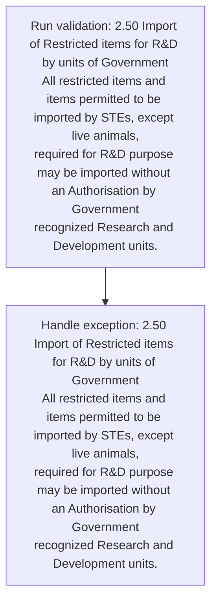
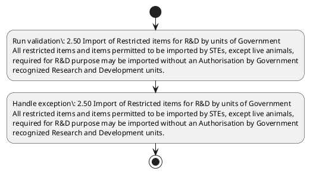

# Chapter 2 / Section 2.50: Import of Restricted items for R&D by units of Government

**Chapter Title:** General Provisions Regarding Imports and Exports

**Pages:** 20

**Purpose:** 2.50 Import of Restricted items for R&D by units of Government
All restricted items and items permitted to be imported by STEs, except live animals,
required for R&D purpose may be imported without an Authorisation by Government
recognized Research and Development units.

**Purpose Thanglish:** Indha Import of Restricted items for R&D by units of Government section-la, 2.50 import of Restricted items for R&D by units of Government
All restricted items and items permitted to be imported by STEs, except live animals,
required for R&D purpose may be imported without an Authorisation by Government
recognized Research and Development units.

**Summary:** 2.50 Import of Restricted items for R&D by units of Government
All restricted items and items permitted to be imported by STEs, except live animals,
required for R&D purpose may be imported without an Authorisation by Government
recognized Research and Development units.

**Business Meaning:** 2.50 Import of Restricted items for R&D by units of Government
All restricted items and items permitted to be imported by STEs, except live animals,
required for R&D purpose may be imported without an Authorisation by Government
recognized Research and Development units.

**Business Explanation:** 2.50 Import of Restricted items for R&D by units of Government
All restricted items and items permitted to be imported by STEs, except live animals,
required for R&D purpose may be imported without an Authorisation by Government
recognized Research and Development units.

**Business Explanation Thanglish:** Indha Import of Restricted items for R&D by units of Government section-la, 2.50 import of Restricted items for R&D by units of Government
All restricted items and items permitted to be imported by STEs, except live animals,
required for R&D purpose may be imported without an Authorisation by Government
recognized Research and Development units.

## Business Logic
- None identified

## Business Rules
- rule_id=CH2-SEC2_50-R001, rule_description=2.50 Import of Restricted items for R&D by units of Government
All restricted items and items permitted to be imported by STEs, except live animals,
required for R&D purpose may be imported without an Authorisation by Government
recognized Research and Development units., trigger=Import of Restricted items for R&D by units of Government, condition=Not explicitly covered in uploaded documents., validation=2.50 Import of Restricted items for R&D by units of Government
All restricted items and items permitted to be imported by STEs, except live animals,
required for R&D purpose may be imported without an Authorisation by Government
recognized Research and Development units., action=Manual review required., exception=2.50 Import of Restricted items for R&D by units of Government
All restricted items and items permitted to be imported by STEs, except live animals,
required for R&D purpose may be imported without an Authorisation by Government
recognized Research and Development units., output=DEKAI should produce a compliance decision for 2.50 - Import of Restricted items for R&D by units of Government.

## Conditions
- None identified

## Condition Logic
- None identified

## Validations
- 2.50 Import of Restricted items for R&D by units of Government
All restricted items and items permitted to be imported by STEs, except live animals,
required for R&D purpose may be imported without an Authorisation by Government
recognized Research and Development units.

## Exceptions
- 2.50 Import of Restricted items for R&D by units of Government
All restricted items and items permitted to be imported by STEs, except live animals,
required for R&D purpose may be imported without an Authorisation by Government
recognized Research and Development units.

## Dependencies
- None identified

## Authorities
- Import of Restricted items for R&D by units of Government
- R&D purpose may be imported without an Authorisation by Government

## Required Documents
- None identified

## Timelines
- None identified

## Actions
- None identified

## Workflow
- Run validation: 2.50 Import of Restricted items for R&D by units of Government
All restricted items and items permitted to be imported by STEs, except live animals,
required for R&D purpose may be imported without an Authorisation by Government
recognized Research and Development units.
- Handle exception: 2.50 Import of Restricted items for R&D by units of Government
All restricted items and items permitted to be imported by STEs, except live animals,
required for R&D purpose may be imported without an Authorisation by Government
recognized Research and Development units.

## Workflow ASCII
```text
Import of Restricted items for R&D by units of Government
Run validation: 2.50 Import of Restricted items for R&D by units of Government
All restricted items and items permitted to be imported by STEs, except live animals,
required for R&D purpose may be imported without an Authorisation by Government
recognized Research and Development units.
   |
   v
Handle exception: 2.50 Import of Restricted items for R&D by units of Government
All restricted items and items permitted to be imported by STEs, except live animals,
required for R&D purpose may be imported without an Authorisation by Government
recognized Research and Development units.
```

## Decision Tree
- IF exception applies (2.50 Import of Restricted items for R&D by units of Government
All restricted items and items permitted to be imported by STEs, except live animals,
required for R&D purpose may be imported without an Authorisation by Government
recognized Research and Development units.) THEN route to manual review

## Decision Tree ASCII
```text
Import of Restricted items for R&D by units of Government Decision
IF exception applies (2.50 Import of Restricted items for R&D by units of Government
All restricted items and items permitted to be imported by STEs, except live animals,
required for R&D purpose may be imported without an Authorisation by Government
recognized Research and Development units.) THEN route to manual review
```

## Examples
- User asks to process Import of Restricted items for R&D by units of Government; the platform checks conditions, validations, and documents before action.

**Real-world Example:** Example: an importer or exporter invokes Import of Restricted items for R&D by units of Government, submits the prescribed DGFT records, and DEKAI uses the extracted rules to follow the import of restricted items for r&d by units of government process.

**Real-world Example Thanglish:** Indha Import of Restricted items for R&D by units of Government section-la, Example: an importer or exporter invokes import of Restricted items for R&D by units of Government, submits the prescribed DGFT records, and DEKAI uses the extracted rules to follow the import of restricted items for r&d by units of government process.

## AI Rules
- None identified

## Database Fields
- name=section_code, type=string, required=True, source=parsed_section_heading
- name=section_title, type=string, required=True, source=parsed_section_heading
- name=for_flag, type=boolean, required=False, source=keyword:for
- name=r&d_flag, type=boolean, required=False, source=keyword:R&D
- name=all_flag, type=boolean, required=False, source=keyword:All
- name=and_flag, type=boolean, required=False, source=keyword:and
- name=may_flag, type=boolean, required=False, source=keyword:may
- name=stes_flag, type=boolean, required=False, source=keyword:STEs
- name=live_flag, type=boolean, required=False, source=keyword:live
- name=items_flag, type=boolean, required=False, source=keyword:items

## API Requirements
- method=GET, path=/api/dgft/sections/2.50, purpose=Retrieve knowledge payload for section 2.50, query_params=['include=workflow,decision_tree,validations'], response_fields=['section', 'title', 'summary', 'conditions', 'validations', 'exceptions', 'workflow', 'decision_tree']
- method=POST, path=/api/dgft/Import-of-Restricted-items-for-R-D-by-units-of-Government/validate, purpose=Validate inputs and documents for Import of Restricted items for R&D by units of Government, request_fields=['section_code', 'section_title'], response_fields=['status', 'errors', 'warnings', 'next_actions']

## UI Screens
- screen_id=Import_of_Restricted_items_for_R_D_by_units_of_Government_overview, name=Import of Restricted items for R&D by units of Government Overview, purpose=Show section summary, authority, timeline, and eligibility cues., widgets=['summary_card', 'conditions_table', 'authority_badges', 'timeline_panel']
- screen_id=Import_of_Restricted_items_for_R_D_by_units_of_Government_submission, name=Import of Restricted items for R&D by units of Government Submission, purpose=Capture applicant data and supporting documents., widgets=['dynamic_form', 'document_uploader', 'validation_panel', 'next_action_footer'], fields=['section_code', 'section_title', 'for_flag', 'r&d_flag', 'all_flag', 'and_flag', 'may_flag', 'stes_flag']
- screen_id=Import_of_Restricted_items_for_R_D_by_units_of_Government_exceptions, name=Import of Restricted items for R&D by units of Government Exception Review, purpose=Explain exception handling and manual review triggers., widgets=['exception_banner', 'decision_tree', 'case_notes']

## Error Messages
- Validation failed because the section requirements were not fully met.

## FAQ
- question_en=What is the purpose of section 2.50?, answer_en=2.50 Import of Restricted items for R&D by units of Government
All restricted items and items permitted to be imported by STEs, except live animals,
required for R&D purpose may be imported without an Authorisation by Government
recognized Research and Development units., question_thanglish=Indha Import of Restricted items for R&D by units of Government section-la, What is the purpose of section 2.50?, answer_thanglish=Indha Import of Restricted items for R&D by units of Government section-la, 2.50 import of Restricted items for R&D by units of Government
All restricted items and items permitted to be imported by STEs, except live animals,
required for R&D purpose may be imported without an Authorisation by Government
recognized Research and Development units.
- question_en=What documents are required under Import of Restricted items for R&D by units of Government?, answer_en=Not explicitly covered in uploaded documents., question_thanglish=Indha Import of Restricted items for R&D by units of Government section-la, What documents are required under import of Restricted items for R&D by units of Government?, answer_thanglish=Indha Import of Restricted items for R&D by units of Government section-la, Not explicitly covered in uploaded documents.
- question_en=Which authority handles Import of Restricted items for R&D by units of Government?, answer_en=Import of Restricted items for R&D by units of Government, R&D purpose may be imported without an Authorisation by Government, question_thanglish=Indha Import of Restricted items for R&D by units of Government section-la, Which authority handles import of Restricted items for R&D by units of Government?, answer_thanglish=Indha Import of Restricted items for R&D by units of Government section-la, import of Restricted items for R&D by units of Government, R&D purpose may be imported without an Authorisation by Government

## Questions Users May Ask
- What does Import of Restricted items for R&D by units of Government require?
- Which documents are needed for Import of Restricted items for R&D by units of Government?
- How does DEKAI validate Import of Restricted items for R&D by units of Government requests?

## Expected AI Answers
- Import of Restricted items for R&D by units of Government requires the platform to interpret the section text, apply the extracted business rules, and present the correct next action.
- Required documents are inferred from the section text: no explicit documents were detected.
- DEKAI validates Import of Restricted items for R&D by units of Government by checking conditions, required documents, authority references, and exception clauses before recommending an outcome.

## AI Q&A Examples
- question_en=User asks: How do I comply with Import of Restricted items for R&D by units of Government?, answer_en=AI answers: DEKAI should evaluate section 2.50, apply the extracted rules, and guide the user through Run validation: 2.50 Import of Restricted items for R&D by units of Government
All restricted items and items permitted to be imported by STEs, except live animals,
required for R&D purpose may be imported without an Authorisation by Government
recognized Research and Development units.., question_thanglish=Indha Import of Restricted items for R&D by units of Government section-la, User asks: How do I comply with import of Restricted items for R&D by units of Government?, answer_thanglish=Indha Import of Restricted items for R&D by units of Government section-la, AI answers: DEKAI should evaluate section 2.50, apply the extracted rules, and guide the user through Run validation: 2.50 import of Restricted items for R&D by units of Government
All restricted items and items permitted to be imported by STEs, except live animals,
required for R&D purpose may be imported without an Authorisation by Government
recognized Research and Development units..
- question_en=User asks: Which validations apply to Import of Restricted items for R&D by units of Government?, answer_en=AI answers: Applicable validations are 2.50 Import of Restricted items for R&D by units of Government
All restricted items and items permitted to be imported by STEs, except live animals,
required for R&D purpose may be imported without an Authorisation by Government
recognized Research and Development units., question_thanglish=Indha Import of Restricted items for R&D by units of Government section-la, User asks: Which validations apply to import of Restricted items for R&D by units of Government?, answer_thanglish=Indha Import of Restricted items for R&D by units of Government section-la, AI answers: Applicable validations are 2.50 import of Restricted items for R&D by units of Government
All restricted items and items permitted to be imported by STEs, except live animals,
required for R&D purpose may be imported without an Authorisation by Government
recognized Research and Development units.

## DEKAI AI Implementation Notes
- Capture chapter 2, section 2.50, title, and page references as immutable knowledge metadata.
- Bind validations for Import of Restricted items for R&D by units of Government into a rule engine keyed by the rule IDs extracted for this section.
- Route escalations or approvals to: Import of Restricted items for R&D by units of Government, R&D purpose may be imported without an Authorisation by Government.
- Trigger manual review when exception clauses are detected.

## DEKAI AI Implementation Notes Thanglish
- Indha Import of Restricted items for R&D by units of Government section-la, Capture chapter 2, section 2.50, title, and page references as immutable knowledge metadata.
- Indha Import of Restricted items for R&D by units of Government section-la, Bind validations for import of Restricted items for R&D by units of Government into a rule engine keyed by the rule IDs extracted for this section.
- Indha Import of Restricted items for R&D by units of Government section-la, Route escalations or approvals to: import of Restricted items for R&D by units of Government, R&D purpose may be imported without an Authorisation by Government.
- Indha Import of Restricted items for R&D by units of Government section-la, Trigger manual review when exception clauses are detected.

## AI Metadata
- Keywords: for, R&D, All, and, may, STEs, live, items, units, Import, except, animals, purpose, without, imported, required, Research, permitted, Restricted, Government
- Search Keywords: for, R&D, All, and, may, STEs, live, items, units, Import, except, animals, purpose, without, imported, required, Research, permitted, Restricted, Government
- Intent: Provide knowledge guidance for Import of Restricted items for R&D by units of Government.
- Tags: 2.50, Import of Restricted items for R&D by units of Government, dgft
- Related Sections: 
- Related Chapters: 
- Related Rules: 

## Mermaid


## PlantUML

